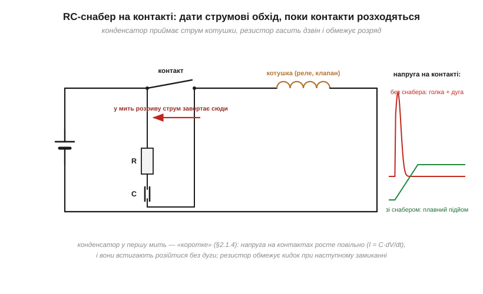
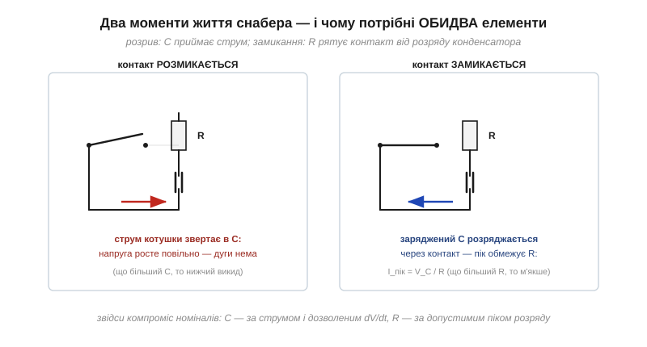

# 🔌 RC-снабер біля контактів і котушок DC: гасимо іскру комутації

> Снабер часто згадують серед приборкувачів сплеску від [«брикання» котушки](book:electronics/inductor-kickback) одним рядком — «для змінного струму». Насправді пара «резистор + конденсатор» працює значно ширше: вона рятує **контакти** реле й вимикачів від іскри там, де зворотний діод безсилий або небажаний. Розберемо, як ці дві деталі ділять роботу і як прикинути їхні номінали на серветці.

### Клас компонента

**Снабер** (*snubber*) — послідовні R і C, підключені паралельно контакту або індуктивному навантаженню. Складається з двох звичайних деталей: плівкового конденсатора 10–100 нФ (для мережевих кіл — обов'язково класу X2) і резистора 47–220 Ом потужністю 1–2 Вт. Продаються й готові снаберні блоки — обидві деталі в одному корпусі з двома виводами, для контакторів і реле.

### Чому не завжди вистачає діода

[Зворотний діод](book:electronics/inductor-kickback) — чудовий захист **ключа** на постійному струмі. Але в нього три межі. На **змінному** струмі він не працює взагалі — провідним виявляється кожен другий півперіод. **Контакт** далеко від котушки він не захищає: іскра спалахує на тому, що розриває коло, а діод стоїть біля навантаження. І нарешті, діод **сповільнює** відпускання реле: струм котушки замикається сам на себе крізь діод і згасає мляво — лише ~0.7 В тиснуть проти нього. Снабер закриває всі три діри: він працює на AC і DC, його можна повісити прямо на контакт, і відпускання він майже не тягне.

### Як RC-пара ділить роботу

У мить розриву струм котушки мусить кудись текти — [струм завжди знайде шлях](book:electronics/inductor-kickback). Снабер цей шлях **пропонує**: струм завертає в конденсатор. Порожній конденсатор у першу мить — [«коротке»](book:electronics/rc-time-constant), тож приймає струм охоче, а напруга на ньому — і на контактах! — росте **повільно**, за законом I = C·dV/dt ([чому саме так](book:electronics/capacitance/math-derivative-current.md)). Контакти встигають розійтися на безпечну відстань ще до того, як напруга виросте до пробою повітря, — дуги немає.

*Рис. У мить розриву струм котушки завертає в RC-ланцюжок: конденсатор обмежує швидкість росту напруги на контактах, і ті розходяться без дуги. Без снабера — голка в сотні вольтів і іскра, що випалює метал контактів і сипле широкосмуговими завадами.*

А резистор потрібен для **іншого** моменту: коли контакт замикається знову. Без R заряджений конденсатор розрядився б через контакт миттєвим кидком струму — і зварював би його так само успішно, як іскра. R обмежує цей пік (I = V_C/R) і заразом демпфує коливання, які C утворив би з індуктивністю кола, — інакше вийшов би [дзвін без втрат](book:electronics/ferrite-beads).

*Рис. Обидві деталі мають свою хвилину слави: при розриванні працює C (приймає струм, тримає dV/dt), при замиканні — R (обмежує розряд конденсатора через контакт). Тому ні сам конденсатор, ні сам резистор снабером не є.*

### Номінали на серветці

- **C — за струмом і дозволеним темпом росту напруги.** З I = C·dV/dt: C ≈ I / (dV/dt). Розриваємо 0.5 А і хочемо не швидше 100 В/мкс: C ≥ 0.5 / 10⁸ = 5 нФ → беремо **10 нФ**.
- **R — за допустимим піком замикання.** Конденсатор, заряджений до амплітуди мережі (≈325 В), не повинен дати понад ~2 А: R ≥ 325/2 ≈ 160 Ом → беремо **180–220 Ом**.
- **Потужність R** — енергія перезаряду конденсатора щокомутації: P ≈ ½·C·V² · f_комутацій. Для реле, що клацає раз на секунди, вистачить пів вата; для частого перемикання рахуйте чесно.

Класичний компроміс видно одразу: більший C — м'якший розрив, але більший розряд при замиканні; більший R — м'якше замикання, але гірше гасіння викиду. Стандартна пара «0.1 мкФ + 100 Ом» недарма стала народною: вона посередині обох компромісів для типових реле й клапанів.

### Типові граблі

- **Кераміка класу 2 у снабері.** Під робочою напругою її ємність тане ([DC bias у MLCC](book:electronics/mlcc)), а імпульсні струми вона любить менше за плівку. Снабер — плівковий конденсатор.
- **У мережу — будь-який конденсатор.** Ні: тільки клас X2, розрахований на роботу прямо на мережі з її викидами, — [запас напруги](book:electronics/capacitor-parasitics) тут обов'язковий.
- **«Протечка» через снабер.** Конденсатор пропускає змінний струм навіть при розімкненому контакті — кілька міліампер крізь 0.1 мкФ на 50 Гц. Звідси класика: вимкнена енергоощадна лампа, що жевріє чи зрідка зблискує, бо паралельно вимикачу стоїть снабер.
- **Снабер замість діода на DC.** Він обмежить викид, але напруга буде вищою за діодну — ключ мусить її витримувати. Часто найкраще працює пара: діод біля котушки + RC біля контакту.

### Варіації класу

Готові снаберні модулі для контакторів, комбінації «варистор + RC» для жорстких мереж, а в силовій електроніці змінного струму — [dv/dt-снабери біля симісторів](book:electronics/snubbers-dvdt), які рятують ключ від самовмикання. Принцип скрізь той самий, що й тут: конденсатор виграє час, резистор платить за це теплом.
