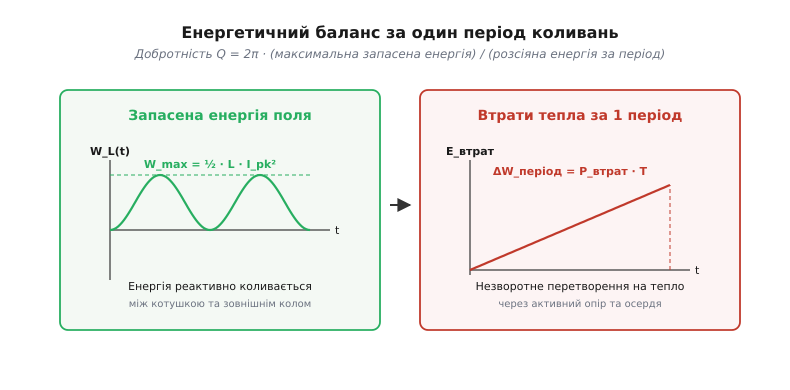
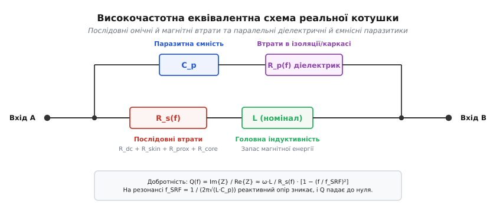
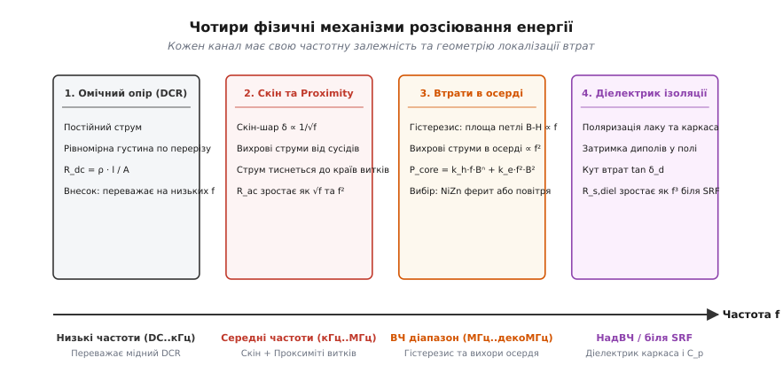
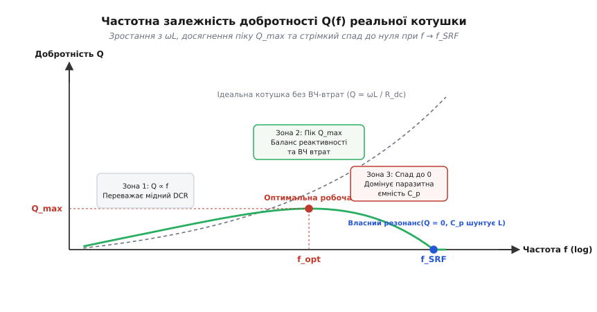
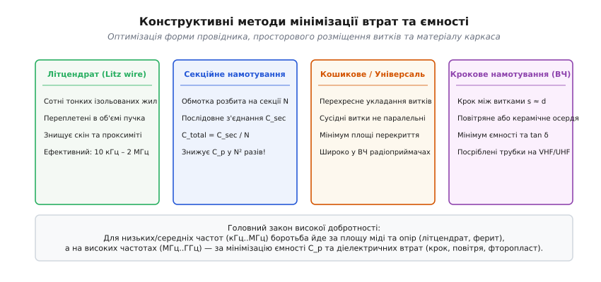

# Добротність котушки індуктивності

<preknowlist>
- [Котушка індуктивності](book:electronics/inductor-coil) — провідник у вигляді витків запасає енергію в магнітному полі при протіканні струму.
- [Реактивний опір](book:electronics/inductive-reactance) — протидія котушки змінному струму, що зростає пропорційно частоті: `X_L = ω·L`.
- [Втрати в осерді](book:electronics/core-losses) — нагрів магнітного матеріалу через гістерезис і вихрові струми.
- [Скін-ефект](book:electronics/skin-effect) — витіснення змінного струму до поверхні провідника на високих частотах.
- [Коливальний контур та резонанс](book:electronics/lc-resonance) — обмін енергією між індуктивністю та ємністю на частоті власного резонансу.
</preknowlist>

У схемотехнічному симуляторі ідеальна котушка індуктивності є бездоганним реактивним елементом: вона приймає енергію від джерела живлення, накопичує її в магнітному полі без жодного мікровата втрат і повертає назад у коло до останнього джоуля. Проте коли таку саму котушку впаюють у реальну плату радіоприймача, імпульсного перетворювача чи фільтра передавача, фізична реальність ламає ідеальну картину. Котушка помітно нагрівається, коефіцієнт корисної дії перетворювача падає з розрахункових 95% до 82%, смуга пропускання радіочастотного селектора розмивається вп'ятеро, а високочастотний автогенератор відмовляється запускатися через надмірне внутрішнє демпфування.

Усі ці проблеми впираються в одну фундаментальну характеристику — **добротність** (*Quality factor*, або скорочено *Q-factor*). Добротність показує міру електромагнітної досконалості котушки: у скільки разів її корисна здатність накопичувати реактивну енергію перевищує паразитно розсіяну теплову потужність за один період коливань. Чим вища добротність, тим ближча реальна котушка до ідеальної моделі й тим менше енергії витікає з коливальної системи у вигляді тепла.

Детальніше про те, як ця характеристика виникла під час прокладання перших трансконтинентальних телефонних ліній і як винахід спеціалізованого вимірювача здійснив революцію в радіопромисловості, описано в статті про [історію появи концепції добротності в телефонії та радіо](book:electronics/inductor-q-factor/hist-q-origin.md).

### Енергетичний зміст добротності

Щоб зрозуміти фізичну природу параметра `Q`, погляньмо на процеси всередині котушки під час протікання змінного синусоїдального струму з частотою `f` та круговою частотою `ω = 2π·f`.

Коли миттєвий струм сягає свого пікового значення `I_pk`, магнітне поле котушки накопичує максимальну енергію:

```
W_max = ½ · L · I_pk²   [Дж]
```

У наступну чверть періоду струм спадає до нуля, і магнітне поле повертає цю енергію назад у коло. Проте провідник обмотки має активний опір, магнітне осердя зазнає циклічного перемагнічування, а електричне поле між витками нагріває діелектрик ізоляції. У результаті частина енергії не повертається колу, а безповоротно перетворюється на тепло.


*Добротність Q визначається співвідношенням між максимальною реактивною енергією, що циркулює в магнітному полі котушки, та активною енергією, яка незворотно втрачається у вигляді тепла за один повний період коливань.*

Енергія `ΔW_період`, розсіяна в тепло за один повний період коливань `T = 1 / f = 2π / ω` на еквівалентному послідовному опорі втрат `R_s`, дорівнює:

```
ΔW_період = P_втрат · T = ( ½ · I_pk² · R_s ) · ( 2π / ω ) = π · I_pk² · R_s / ω
```

Фундаментальне фізичне означення добротності — це відношення максимальної накопиченої енергії до енергії, що розсіюється за один радіан коливального процесу (тобто втрати за повний період, поділені на `2π`):

```
Q = 2π · W_max / ΔW_період                             [за означенням добротності]
  = 2π · ( ½ · L · I_pk² ) / ( π · I_pk² · R_s / ω )   [підстановка W_max та ΔW_період]
  = ω · L / R_s                                        [скорочення спільних множників]
```

> 🔧 **Навіщо це.** Формула `Q = ω·L / R_s` дає просте інженерне правило: щоб котушка мала високу якість, її реактивний опір `X_L = ω·L` на робочій частоті повинен у десятки або сотні разів перевищувати повний опір втрат `R_s`. Наприклад, якщо на частоті `10 МГц` котушка з індуктивністю `10 мкГн` має реактивний опір `X_L ≈ 628 Ом`, а її опір втрат становить `R_s = 1.57 Ом`, її добротність дорівнює `Q = 628 / 1.57 = 400`. Це означає, що за один цикл коливань розсіюється лише `1 / 400` частина (тобто 0.25%) накопиченої магнітної енергії.

Строге математичне виведення енергетичного балансу для складних форм струму та несинусоїдальних режимів наведено у статті про [аналітичне виведення еквівалентних компонентів втрат](book:electronics/inductor-q-factor/math-loss-breakdown.md).

### Високочастотна еквівалентна схема реальної котушки

Головна помилка інженера-початківця полягає в уявленні, ніби опір втрат `R_s` — це звичайний омічний опір мідного дроту постійному струму `R_dc`, виміряний звичайним мультиметром. Якби це було правдою, добротність зростала б прямо пропорційно частоті до нескінченності: подвоїли частоту — подвоївся `ω·L`, а `Q` виросла вдвічі.

Насправді реальна котушка індуктивності є складною розподіленою електромагнітною системою. Її повна високочастотна еквівалентна схема містить чотири обов'язкові елементи:


*Повна високочастотна модель котушки індуктивності: корисна індуктивність L включена послідовно з частотно-залежним опором втрат R_s(f), а вся конструкція зашунтована розподіленою міжевитковою ємністю C_p та опором діелектричних витоків R_p(f).*

1. **Номінальна індуктивність `L`**: корисна індуктивність витків, що відповідає за запас магнітної енергії.
2. **Частотно-залежний послідовний опір `R_s(f)`**: інтегральний опір, що об'єднує омічні втрати в міді на постійному струмі, високочастотне витіснення струму та магнітні втрати в осерді:
   ```
   R_s(f) = R_dc + R_skin(f) + R_prox(f) + R_core(f)
   ```
3. **Розподілена паразитна ємність `C_p`**: сумарна ємність між сусідніми витками, між шарами обмотки та між витками й магнітним осердям чи екраном.
4. **Паралельний опір діелектричних втрат `R_p(f)`**: опір, що описує нагрів ізоляційного лаку дроту, каркаса котушки та компаунду під дією змінного електричного поля між витками.

Ця еквівалентна схема наочно демонструє, чому розрахунок добротності є динамічною задачею: зі зростанням частоти опір послідовної гілки `R_s(f)` швидко зростає, а паралельна паразитна ємність `C_p` починає закорочувати корисний індуктивний струм.

### Чотири фізичні канали розсіювання енергії

Розгляньмо детально кожен із чотирьох фізичних механізмів, які перетворюють енергію коливань на тепло й обмежують добротність котушки.


*Чотири незалежні канали теплових втрат у котушці індуктивності: на низьких частотах домінує постійний опір міді DCR, на середніх — скін-ефект та ефект близькості витків, на високих частотах — втрати в осерді, а поблизу власного резонансу — діелектричні втрати в ізоляції.*

#### 1. Омічний опір постійному струму (DCR)

На постійному струмі або низьких звукових частотах струм тече рівномірно по всій площі поперечного перерізу провідника. Опір обмотки визначається виключно геометрією дроту та питомим опором металу:

```
R_dc = ρ_cu · l_wire / A_wire   [Ом]
```

де `ρ_cu` — питомий опір міді (`1.72·10⁻⁸ Ом·м` при `20 °C`), `l_wire` — загальна розгорнута довжина дроту обмотки, а `A_wire = π·d² / 4` — площа його поперечного перерізу.

На низьких частотах (від одиниць герців до кількох кілогерців) цей опір є єдиним джерелом втрат. Оскільки `R_dc` не залежить від частоти, добротність на початковій ділянці зростає строго лінійно:

```
Q(f) ≈ 2π·f · L / R_dc ∝ f
```

Щоб мінімізувати `R_dc`, інженери обирають дріт максимально можливого діаметра та оптимізують форму котушки, скорочуючи середню довжину одного витка.

#### 2. Високочастотні втрати в провіднику: скін-ефект та ефект близькості

Коли частота струму зростає, рівномірний розподіл струму руйнується під дією власних та зовнішніх змінних магнітних полів. Цей процес розпадається на два самостійні явища:

**А. Скін-ефект (*Skin Effect*)**
Змінний струм, що тече вздовж дроту, створює всередині самого провідника концентричне змінне магнітне поле. Це поле наводить внутрішні вихрові струми, які в центрі провідника спрямовані проти основного струму, а біля поверхні — співнапрямлені з ним. У результаті струм витісняється в тонкий приповерхневий шар товщиною `δ` (глибина скін-шару):

```
δ = √( ρ_cu / (π · f · μ₀ · μ_r) ) ≈ 66 / √f   [мкм, де f у МГц]
```

На частоті `1 МГц` товщина скін-шару в міді становить лише `66 мкм`, а на `100 МГц` — мізерні `6.6 мкм`. Центральна частина товстого дроту перестає проводити струм і перетворюється на баласт, а ефективна площа провідника зменшується до тонкого циліндричного кільця `A_eff ≈ π · d · δ`. Через це активний опір провідника починає зростати пропорційно кореню квадратному з частоти:

```
R_skin(f) ∝ √f
```

Докладний фізичний розбір розподілу струму за радіусом провідника подано в розділі [скін-ефект](book:electronics/skin-effect).

**Б. Ефект близькості (*Proximity Effect*)**
Скін-ефект описує поведінку одиночного ізольованого дроту в порожнечі. Проте в котушці витки розташовані впритул один до одного. Змінне магнітне поле одного витка пронизує тіло сусіднього витка, збуджуючи в ньому додаткові потужні вихрові струми.

У результаті робочий струм не просто витісняється до поверхні — він притискається до внутрішніх поверхонь витків, звернених до осі котушки, або концентрується у вузьких зонах контакту між сусідніми витками.

У багатошарових котушках ефект близькості діє нищівно. Згідно з одновимірною аналітичною моделлю Доуелла (*Dowell's equations*), опір втрат ефекту близькості для котушки з числом шарів `m` зростає пропорційно **квадрату кількості шарів** та **квадрату частоти**:

```
R_prox(f) ∝ (m² − 1) · f²
```

Для котушки з `m = 5` шарами множник `(m² − 1) = 24`. Це означає, що на частоті `500 кГц` опір обмотки через ефект близькості може бути у 25–40 разів більшим за опір на постійному струмі `R_dc`! Саме ефект близькості, а не звичайний скін-ефект, є головним винуватцем деградації добротності багатошарових дроселів.

#### 3. Втрати в магнітному осерді

Щоб збільшити індуктивність `L` без намотування сотень зайвих витків, котушку намотують на феромагнітному осерді (ферит, розпилене залізо, альсифер). Осердя підсилює магнітне поле в сотні разів завдяки відносній проникності `μ_r`, проте вносить два специфічні види втрат:

**А. Втрати на магнітний гістерезис**
Під дією змінного поля магнітні домени осердя щосекунди переорієнтовуються мільйони разів. Зсув доменних стінок супроводжується внутрішнім «тертям» об дефекти кристалічної ґратки. Залежність магнітної індукції `B` від напруженості поля `H` утворює петлю гістерезису. Енергія, втрачена за один цикл перемагнічування, строго дорівнює площі цієї петлі.

Потужність гістерезисних втрат прямо пропорційна кількості циклів за секунду (тобто частоті `f`) та описується рівнянням Штейнмеца:

```
P_hyst = k_h · f · B_pk^n   ⇒   R_hyst(f) ∝ f
```

**Б. Вихрові струми в матеріалі осердя (*Eddy Currents*)**
Оскільки магнітне осердя знаходиться всередині змінного магнітного поля котушки, в самому об'ємі матеріалу індукується вихрове електричне поле. Якщо осердя має електричну провідність (як електротехнічна сталь або порошкове залізо), всередині нього виникають кругові вихрові струми, які нагрівають матеріал.

Потужність втрат на вихрові струми в осерді пропорційна **квадрату частоти** та обернено пропорційна питомому електричному опору матеріалу `ρ_core`:

```
P_eddy = k_e · f² · B_pk² / ρ_core   ⇒   R_eddy(f) ∝ f²
```

Щоб звести вихрові струми до нуля, радіочастотні осердя виготовляють із фериту — магнітної кераміки, питомий електричний опір якої в мільйони разів перевищує опір металів. Детальніше про фізику процесів у феритах можна прочитати в огляді [втрати в осерді](book:electronics/core-losses).

Математично вплив осердя описують комплексною магнітною проникністю `μ = μ' − j·μ''`. Дійсна частина `μ'` визначає корисну індуктивність, а уявна частина `μ''` задає магнітний тангенс кута втрат `tan(δ_m) = μ'' / μ'`. Внесок осердя в послідовний опір втрат становить:

```
R_core(f) = ω · L · ( μ'' / μ' ) = ω · L · tan(δ_m)
```

Варто також пам'ятати про тепловий дрейф магнітних характеристик: при нагріванні осердя внаслідок втрат петля гістерезису та проникність пливуть, а при досягненні точки Кюрі феромагнітні властивості зникають повністю, обвалюючи індуктивність до вакуумного значення.

#### 4. Діелектричні втрати в ізоляції та каркасі

Між сусідніми витками котушки існує різниця потенціалів, яка створює змінне електричне поле в діелектрику: шарі лаку дроту, полімерному каркасі, ізоляційному компаунді та навіть навколишньому повітрі.

Молекули діелектрика є електричними диполями. Змінне електричне поле змушує диполі постійно переорієнтовуватися. Якщо матеріал має помітний тангенс кута діелектричних втрат `tan(δ_d)` (наприклад, дешевий полівінілхлорид, бакеліт або склотекстоліт FR-4), поляризація відстає від коливань поля за фазою, перетворюючи енергію електричного поля на тепло.

Діелектричні втрати моделюються паралельною активною провідністю витоку `G_diel = ω · C_p · tan(δ_d)`. При перерахунку в еквівалентний послідовний опір котушки отримуємо залежність:

```
R_s,diel(f) ≈ (ω·L)² · G_diel = ω³ · L² · C_p · tan(δ_d) ∝ f³
```

Оскільки діелектричний опір зростає як **куб частоти** `f³`, на частотах у десятки й сотні мегагерців саме діелектричні втрати в каркасі стають домінантним фактором, що знищує добротність високочастотних котушок.

---

### Анатомія частотної залежності Q(f)

Підсумувавши всі чотири фізичні канали втрат, ми отримуємо реальну частотну характеристику добротності котушки індуктивності `Q(f)`. На типовому логарифмічному графіку чітко вирізняються три характерні зони:


*Крива добротності Q(f) реальної котушки індуктивності: зона 1 — лінійне зростання під домінуванням омічного опору DCR; зона 2 — досягнення максимуму Q_max при балансі реактивності та ВЧ-втрат; зона 3 — стрімкий спад до нуля при наближенні до частоти власного резонансу f_SRF через шунтування паразитною ємністю C_p.*

#### Зона 1: Низькі частоти (лінійне зростання)
На частотах значно нижчих за оптимальну (`f ≪ f_opt`) глибина скін-шару більша за товщину дроту (`δ > d/2`), а втрати в осерді та діелектрику мізерні. Повний опір втрат фіксований і дорівнює постійному опору міді: `R_s ≈ R_dc`.

Добротність зростає практично строго лінійно з частотою:

```
Q(f) ≈ 2π · f · L / R_dc
```

У цій зоні подвоєння частоти означає подвоєння добротності.

#### Зона 2: Оптимальний діапазон (пік Q_max)
Зі зростанням частоти починають стрімко наростати високочастотні втрати: скін-ефект (`√f`), проксиміті-ефект (`f²`) та вихрові струми в осерді (`f²`). Знаменник формули `Q = ωL / R_s` починає зростати з тим самим або більшим темпом, ніж чисельник `ωL`.

Темп зростання добротності сповільнюється, крива перегинається й досягає абсолютного максимуму `Q_max` на оптимальній частоті `f_opt`:

```
f_opt ≈ √( R_dc / k_hf )
```

У точці піку втрати на постійному струмі `R_dc` приблизно зрівнюються з сумарними високочастотними втратами `R_ac(f)`. Саме на цю частоту `f_opt` інженери намагаються розрахувати коливальні контури приймачів та передавачів для отримання максимальної вибірковості та мінімального тепловиділення.

#### Зона 3: Високі частоти та власний резонанс (SRF)
Коли частота наближається до частоти власного резонансу (*Self-Resonant Frequency*, SRF), у гру вступає розподілена паразитна ємність `C_p`. Резонансна частота котушки визначається класичною формулою Томсона для коливального контуру:

```
f_SRF = 1 / ( 2π · √( L · C_p ) )
```

Паразитна ємність `C_p` увімкнена паралельно індуктивній гілці. При наближенні до `f_SRF` реактивний струм через ємність зростає і починає компенсувати індуктивний струм. Виміряна (еквівалентна) добротність `Q_eff` спадає за квадратичним законом:

```
Q_eff(f) ≈ Q_true(f) · [ 1 − ( f / f_SRF )² ]
```

На самій частоті власного резонансу `f = f_SRF`:
1. Реактивний індуктивний опір повністю компенсується ємнісним, повна реактивність стає рівною нулю (`X_eff = 0`), і добротність **падає строго до нуля** (`Q_eff = 0`).
2. Котушка перетворюється на звичайний високовольтний паралельний резистор із чисто активним опором `R_res = Q_true² · R_s`.
3. На частотах вище `f_SRF` деталь змінює свій фізичний характер: струм через паразитну ємність переважає над індуктивним, і котушка **перетворюється на конденсатор** з великими втратами!

> 🔧 **Навіщо це.** Даташити на якісні радіочастотні котушки (наприклад, фірм Coilcraft чи Murata) завжди наводять графік `Q(f)` та значення `f_SRF`. За золотим правилом високочастотної схемотехніки, робоча частота котушки в коливальних контурах та селективних фільтрах **не повинна перевищувати `0.3–0.5 · f_SRF`**. Якщо спробувати використати котушку на частоті `0.8 · f_SRF`, її добротність впаде втричі, а індуктивність буде катастрофічно нестабільною через температурний дрейф паразитної ємності `C_p`.

---

### Інженерні методи оптимізації та підвищення добротності

Боротьба за підвищення добротності — це завжди інженерний пошук компромісу між опором провідника, властивостями магнітного матеріалу, паразитною ємністю та геометричними габаритами. Розгляньмо головні перевірені методи створення високої `Q`.


*Конструктивні прийоми оптимізації добротності: літцендрат усуває скін та проксиміті-ефект на середніх частотах; секційне та кошикове намотування радикально знижують власну ємність C_p; крокове намотування товстою посрібленою трубкою мінімізує втрати на метрах і дециметрах.*

#### 1. Літцендрат (Litz Wire) для частот 10 кГц – 2 МГц
Якщо на частотах сотень кілогерців намотати котушку товстим суцільним дротом, ефект близькості та скін-ефект збільшать її опір у десятки разів. Щоб усунути це явище, використовують **літцендрат** (*Litzendraht* — від німецького «плетений дріт»).

Літцендрат складається з десятків або сотень найтонших мідних жилок (діаметром від `0.03 мм` до `0.1 мм`), кожна з яких покрита власним шаром ізоляційного поліуретанового лаку. Жилки сплетені між собою за спеціальним геометричним патерном так, що кожна окрема жилка регулярно змінює своє положення в об'ємі пучка: вона почергово виходить на зовнішню поверхню, переходить углиб і зміщується до центру.

Завдяки цьому:
- діаметр кожної жилки менший за подвійну глибину скін-шару (`d_strand < 2δ`), тож скін-ефект усередині окремої жилки відсутній;
- завдяки регулярній транспозиції жилок зовнішнє магнітне поле наводить у сусідніх жилках однакову сумарну ЕРС, що повністю пригнічує внутрішні циркуляційні вихрові струми ефекту близькості.

Застосування літцендрату дозволяє підняти добротність котушок індукційного нагріву, бездротових зарядок (Qi) та резонансних перетворювачів з `15–20` до `300–500`.

Про конструктивні типи плетіння, підбір кількості жил та технологічні правила зачистки й паяння читайте у спеціальному довіднику про [літцендрат](book:electronics/skin-effect/comp-litz-wire.md).

#### 2. Посріблення та трубки для діапазону VHF/UHF (10 МГц – 500 МГц)
На частотах понад `5–10 МГц` мікроскопічна міжелектродна ємність між сусідніми ізольованими жилками літцендрату перетворює пучок на монолітний суцільний провідник, і літцендрат втрачає свої переваги.

Для метрових і дециметрових хвиль застосовують протилежний підхід:
- намотування виконують товстим монолітним мідним дротом діаметром `1.5–4 мм` або **мідною трубкою**;
- оскільки струм тече лише в шарі товщиною кілька мікрометрів, порожниста трубка має таку саму провідність, як і суцільний стрижень, проте має меншу масу та краще охолоджується;
- поверхню міді покривають товстим шаром **гальванічного срібла** (товщиною не менше `5–10 мкм`, що становить `3–5` глибин скін-шару). Оскільки питомий опір срібла (`1.59·10⁻⁸ Ом·м`) нижчий за мідь, опір скін-шару зменшується ще на `8–10%`.

#### 3. Секційне та кошикове намотування для зниження C_p
Щоб підняти частоту власного резонансу `f_SRF` та мінімізувати діелектричні втрати, необхідно радикально знизити паразитну ємність `C_p`:

- **Секційне намотування (*Pi-winding*)**: котушку ділять на `N` ізольованих секцій (щік каркаса), з'єднаних послідовно. Оскільки при послідовному з'єднанні `N` однакових конденсаторів сумарна ємність зменшується в `N` разів (`C_total = C_sec / N`), а кількість витків у секції зменшує напругу між сусідніми витками, загальна паразитна ємність котушки зменшується в **`N²` разів**!
- **Кошикове (*Basket Weave*) та намотування «універсаль»**: витки укладають хвилеподібно під кутом `45°–60°` до осі каркаса. Сусідні витки перетинаються лише в окремих точках під кутом, замість щільного паралельного прилягання. Це знижує власну ємність у 5–8 разів у порівнянні зі звичайним рядовим намотуванням.
- **Крокове намотування (*Space Winding*)**: витки одношарової ВЧ-котушки намотують з примусовим проміжком (кроком), що дорівнює одному-двом діаметрам дроту (`s = 1–2·d`). Це одночасно знижує власну ємність до часток пікофарада та мінімізує викривлення поля від ефекту близькості.

#### 4. Вибір магнітних матеріалів: NiZn, залізопорошок та повітря
Вибір матеріалу осердя строго прив'язаний до робочої частоти:

```
0 Гц — 100 кГц:     Електротехнічна сталь (ламінована), аморфні сплави
50 кГц — 2 МГц:     MnZn-ферити (висока проникність μ = 1000–5000, висока індукція B_sat)
500 кГц — 30 МГц:   Порошкове залізо (Iron Powder) з розподіленим зазором (низькі втрати)
1 МГц — 300 МГц:    NiZn-ферити (кераміка-ізолятор, μ = 20–300, мінімум вихрових струмів)
> 100 МГц (VHF/UHF): Повітряні безкаркасні котушки (повна відсутність магнітних втрат)
```

На ультрависоких частотах (VHF/UHF) будь-яке феромагнітне осердя вносить такі великі втрати на гістерезис і доменний резонанс, що добротність обвалюється до одиниць. Тому всі добротні коливальні контури на частотах понад `100 МГц` будують виключно на **повітряних безкаркасних котушках** або керамічних трубках із високим опором ізоляції.

---

### Наскрізний числовий розрахунок та оптимізація котушки на 10 МГц

Розглянемо практичний інженерний розрахунок високодобротної одношарової котушки для селективного фільтра короткохвильового передавача на частоту `f = 10 МГц`.

**Цільові вимоги:**
- Індуктивність: `L = 10 мкГн`;
- Робоча частота: `f = 10 МГц`;
- Очікувана добротність: `Q > 500`.

**Крок 1: Геометрична оптимізація каркаса за Вілером.**
Для досягнення максимальної власної добротності довжина намотування повинна становити приблизно половину діаметра котушки (`l_coil / d_coil ≈ 0.45`).
- Обираємо ребристий керамічний каркас діаметром `d_coil = 40 мм` (`0.04 м`).
- Оптимальна довжина намотування: `l_coil = 0.45 · 40 = 18 мм` (`0.018 м`).

Розрахуємо необхідну кількість витків за формулою Гарольда Вілера:

```
L = ( d_coil² · N² ) / ( 450·d_coil + 1000·l_coil )   [де розміри в мм, L у мкГн]
10 = ( 40² · N² ) / ( 450·40 + 1000·18 )
10 = ( 1600 · N² ) / ( 18000 + 18000 ) = 1600 · N² / 36000 = N² / 22.5
N² = 225   ⇒   N = 15 витків
```

**Крок 2: Вибір дроту та кроку намотування.**
- Загальна довжина намотування `18 мм` на `15 витків` дає крок намотування `p = 18 / 15 = 1.2 мм`.
- Обираємо посріблений мідний дріт діаметром `d = 0.8 мм`. Проміжок між витками становить `1.2 − 0.8 = 0.4 мм`, що усуває електричний контакт та знижує паразитну ємність.
- Загальна довжина дроту: `l_wire = N · π · d_coil = 15 · π · 0.04 ≈ 1.885 м`.

**Крок 3: Розрахунок втрат на частоті 10 МГц.**
- Глибина скін-шару в срібному покритті: `δ = 0.064 / √(10) ≈ 20.2 мкм`.
- Ефективна площа провідного кільця: `A_skin ≈ π · d · δ = π · (0.8·10⁻³) · (20.2·10⁻⁶) ≈ 5.08·10⁻⁸ м²`.
- Опір скін-шару:
  ```
  R_skin = ρ_ag · l_wire / A_skin = 1.59·10⁻⁸ · 1.885 / 5.08·10⁻⁸ ≈ 0.59 Ом
  ```
- Внесок ефекту близькості для одношарового розрідженого намотування додає близько `30%`:
  ```
  R_prox ≈ 0.30 · R_skin = 0.30 · 0.59 ≈ 0.18 Ом
  ```
- Повний послідовний опір втрат:
  ```
  R_s = R_skin + R_prox = 0.59 + 0.18 = 0.77 Ом
  ```

**Крок 4: Розрахунок реактивності та підсумкової добротності.**
- Реактивний опір на частоті `10 МГц`:
  ```
  X_L = 2π · f · L = 2π · 10⁷ · 10⁻⁵ = 200π ≈ 628.3 Ом
  ```
- Істинна добротність магнітної гілки:
  ```
  Q_true = X_L / R_s = 628.3 / 0.77 ≈ 816
  ```
- Власна паразитна ємність одношарової котушки на ребристому керамічному каркасі становить лише `C_p ≈ 1.2 пФ`. Частота власного резонансу:
  ```
  f_SRF = 1 / [ 2π · √( 10·10⁻⁶ · 1.2·10⁻¹² ) ] ≈ 46 МГц
  ```
- Резонансний фактор зменшення добротності на робочій частоті `10 МГц`:
  ```
  K_srf = 1 − ( f / f_SRF )² = 1 − ( 10 / 46 )² = 1 − 0.047 = 0.953
  ```
- Виміряна ефективна добротність:
  ```
  Q_eff = Q_true · K_srf = 816 · 0.953 ≈ 778
  ```

Результат `Q ≈ 778` повністю перевершує початкове технічне завдання (`Q > 500`) і демонструє силу грамотної геометричної оптимізації без використання дорогих або масивних деталей.

---

### Лабораторні методи вимірювання та діагностики добротності

Для вимірювання добротності в лабораторії застосовують три стандартизовані інструментальні методи:

1. **Резонансний метод навантаженого контуру (-3 дБ)**:
   Котушку підключають паралельно зі зразковим конденсатором і через слабкий ємнісний зв'язок (`0.5 пФ`) збуджують від високочастотного генератора сигналу. Амплітуду напруги реєструють спектроаналізатором або осцилографом. Знаходять резонансну частоту піка `f₀` та точки спаду амплітуди на `3.01 дБ` з обох боків (`f_low` та `f_high`). Добротність обчислюють як:
   ```
   Q = f₀ / ( f_high − f_low )
   ```
2. **Вимірювання векторним аналізатором кіл (VNA)**:
   Прилад вимірює комплексний коефіцієнт відбиття `S₁₁(f)` або коефіцієнт передачі `S₂₁(f)` і за допомогою цифрових алгоритмів автоматично розраховує координати кола імпедансу, виділяючи чисту ненавантажену добротність `Q₀`, опір `ESR` та паразитну ємність `C_p`.
3. **Класичний лабораторний Q-метр**:
   Прилад прямого відліку, що вимірює резонансне підвищення напруги на зразковому конденсаторі за принципом `Q = V_C / V_in`.

Повний програмний код для автоматизації вимірювань, квадратичної інтерполяції піка та матричного деімбеддингу вимірювального стенда на мовах C та C++ наведено в практичній вставці про [цифровий алгоритм вимірювання та екстракції добротності](book:electronics/inductor-q-factor/proj-q-measurement.md).

---

### Добротність у різних класах електронних компонентів

Вимоги до добротності кардинально відрізняються залежно від функції котушки в схемі:

| Застосування | Типова величина `Q` | Головний пріоритет конструкції | Небезпека надмірної / недостатньої `Q` |
| :--- | :--- | :--- | :--- |
| **Радіоселективні контури та преселектори** | `200 – 800` | Вузька смуга пропускання `Δf = f₀/Q`, мінімум фазового шуму в гетеродинах | Мала `Q` розмиває селекцію; надмірна — обрізає бічні смуги корисного сигналу |
| **Бездротова передача енергії (WPT / Qi)** | `150 – 400` | Максимальний ККД магнітного зв'язку `η ∝ k²·Q_tx·Q_rx` | Мала `Q` призводить до катастрофічного нагріву котушок та розряду батареї |
| **Силові дроселі імпульсних DC-DC перетворювачів** | `10 – 50` | Струм насичення `I_sat`, малий DCR для мінімізації втрат провідності `I²·R` | Занадто висока `Q` спричиняє паразиний високочастотний дзвін (*ringing*) на фронтах ключів |
| **Фільтри електромагнітної сумісності (EMI)** | `1 – 5` | Максимальне поглинання високочастотної енергії завад у тепло | Висока `Q` заборонена: вона викликає паразитний резонанс замість придушення шуму |

У силових перетворювачах живлення ([силові дроселі](book:electronics/power-inductor)) конструктори навмисне шукають компроміс: дросель повинен мати мінімальний опір `R_dc` для робочого струму, але на мегагерцових гармоніках комутації помірні втрати в осерді навіть корисні, оскільки вони природно демпфують паразитні коливання на паразитних ємностях транзисторів.

Для протизавадних елементів зв'язку ([феритові намистини](book:electronics/ferrite-bead)) добротність на високих частотах навмисно роблять **меншою за одиницю** (`Q < 1`). У таких компонентах уявна частина магнітної проникності `μ''` (втрати) багаторазово перевищує дійсну `μ'`, завдяки чому високочастотна завада не відбивається назад у коло, а повністю поглинається й розсіюється у вигляді мікроскопічного тепла.

---

### Фундаментальний інженерний синтез: закон геометричної подібності

Підсумовуючи фізику добротності, сформулюємо фундаментальний **закон геометричного масштабування котушок індуктивності**:

> Якщо пропорційно збільшити всі лінійні розміри котушки (діаметр каркаса, довжину намотування та діаметр дроту) в `k` разів при збереженні незмінної номінальної індуктивності `L`, її добротність **зросте рівно в `k` разів**:
> ```
> Q ∝ k
> ```

Фізичний механізм закону простий:
- при масштабуванні в `k` разів кількість витків `N` для збереження тієї самої `L` зменшується як `1 / √k`;
- довжина дроту `l_wire` зростає лише як `√k`;
- площа поперечного перерізу дроту `A_wire` зростає як `k²`;
- у результаті опір втрат `R_s` зменшується як `1 / k`, а добротність `Q = ωL / R_s` зростає пропорційно `k`.

Цей закон пояснює головний компроміс радіоелектроніки: **висока добротність завжди вимагає фізичного об'єму**. Неможливо створити мікроскопічну котушку в корпусі 0402 з добротністю `500` — закони електродинаміки вимагають достатньої площі міді та низької напруженості поля в діелектрику. Інженерне мистецтво полягає в тому, щоб за допомогою літцендрату, високоякісних феритів та просторової геометрії намотування отримати максимально можливу добротність у межах виділених габаритів пристрою.
