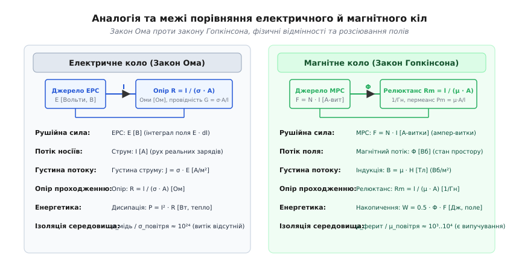
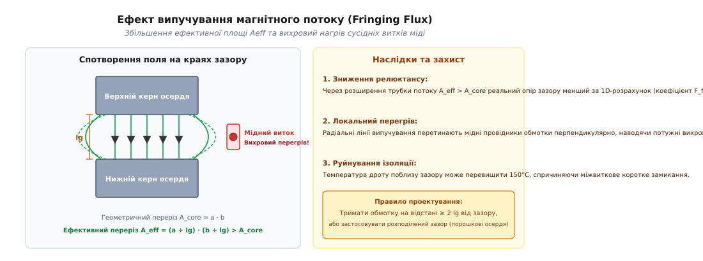
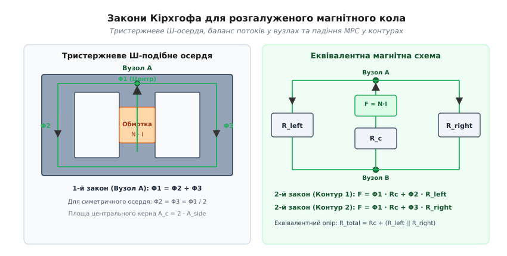

# Магнітне коло

<preknowlist>
- [Закон Ома](topic:electronics/ohms-law) — лінійна залежність між напругою, електричним струмом та омічним опором провідника.
- [Закони Кірхгофа](topic:electronics/kcl) — фундаментальний баланс струмів у вузлах та падінь напруг у замкнених електричних контурах.
- [Котушка](topic:electronics/inductor-coil) — провідник зі струмом збуджує магнітне поле, пропорційне числу ампер-витків обмотки.
- [Індуктивність](topic:electronics/inductance) — здатність контуру накопичувати енергію магнітного поля та протидіяти зміні струму.
- [Ферит і втрати в осерді](topic:electronics/core-losses) — фізика насичення феромагнетика, гістерезис та втрати енергії на вихрові струми.
</preknowlist>

Потужний імпульсний перетворювач на п'ять сотень ватів зібрано на суцільному замкненому феритовому кільці без розривів. При першому ж випробуванні під номінальним навантаженням струм у первинній обмотці за лічені мікросекунди наростає до сотні амперів, спрацьовує аварійний захист або миттєво вибухають силові перемикальні MOSFET-транзистори. Осцилографічні вимірювання свідчать: масивне осердя вагою у чверть кілограма входить у глибоке магнітне насичення, його магнітна проникність обвалюється з двох тисяч до одиниці, а індуктивність котушки зменшується у тисячі разів. Якщо ж узяти алмазну пилку та зробити у феритовому кільці тонкий поперечний розпил завтовшки менше міліметра, той самий перетворювач починає стабільно працювати на повній потужності, струм наростає плавно й лінійно, а індуктивність зберігає стабільність навіть при нагріванні осердя понад сто градусів.

Розрив суцільного феромагнетика з високою магнітною провідністю шаром звичайного повітря не тільки не погіршує роботу накопичувального вузла, але й збільшує граничну здатність системи зберігати енергію у десятки разів.

Щоб точно розраховувати та передбачати поведінку таких систем без розв'язання тривимірних диференціальних рівнянь поля у просторі, електротехніка використовує концепцію **магнітного кола** (*magnetic circuit*).

---

### Від польових рівнянь Максвелла до закону Гопкінсона

У класичній електродинаміці поведінка магнітного поля описується векторними диференціальними рівняннями Максвелла. Проте для практичного проектування трансформаторів, дроселів та електродвигунів тривимірний просторовий аналіз є надлишковим: якщо магнітний потік локалізований усередині матеріалу з високою магнітною проникністю, систему можна звести до моделі із зосередженими параметрами, повністю аналогічної звичайному електричному колу.

Розглянемо замкнений магнітний контур, охоплений котушкою з `N` витків, крізь яку протікає постійний або квазістатичний електричний струм `I`.

Закон циркуляції вектора напруженості магнітного поля (закон повного струму Ампера) стверджує, що лінійний інтеграл вектора напруженості `H` вздовж будь-якого замкненого контуру `C` дорівнює сумарному електричному струму, що пронизує площину, обмежену цим контуром:

```
∮ H · dl = ∑ I_enclosed = N · I      [закон циркуляції Ампера]
```

Добуток кількості витків `N` на силу струму `I` називається **магніторушійною силою** (МРС, позначається `F` або `F_m`, розмірність — ампер-витки, `А-вит` або просто `А`). Магніторушійна сила є безпосереднім магнітним еквівалентом електрорушійної сили (ЕРС) в електричних колах: вона створює енергетичний потенціал, що змушує магнітні силові лінії циркулювати вздовж контуру.

Якщо магнітний шлях розбити на послідовні однорідні ділянки довжиною `l_k` із постійним поперечним перерізом `A_k`, лінійний інтеграл перетворюється на дискретну суму падінь магнітної напруги:

```
N · I = ∑ (H_k · l_k)      [падіння магнітної напруги вздовж контуру]
```

Зв'язок між вектором напруженості `H` та вектором магнітної індукції `B` усередині однорідного магнітного матеріалу визначається його абсолютною магнітною проникністю `μ = μ_0 · μ_r`:

```
B_k = μ_k · H_k  ⇒  H_k = B_k / (μ_0 · μ_r,k)      [матеріальне рівняння]
```

де `μ_0 = 4π · 10⁻⁷ Гн/м ≈ 1.2566 · 10⁻⁶ Гн/м` — магнітна стала вакууму, а `μ_r,k` — безрозмірна відносна магнітна проникність речовини на `k`-й ділянці.

За теоремою Гауса для магнітного поля вектор індукції `B` не має джерел (`div B = 0`), тобто магнітні силові лінії завжди замкнені самі на себе. За умови, що лінії поля утримуються всередині сердечника, сумарний магнітний потік `Φ = ∬ B · dA` через поперечний переріз `A_k` залишається незмінним уздовж усього нерозгалуженого контуру:

```
B_k = Φ / A_k      [зв'язок магнітної індукції та потоку]
```

Підставивши вираз для `H_k` у суму циркуляції, отримуємо:

```
F = N · I = ∑ (Φ · l_k / (μ_0 · μ_r,k · A_k)) = Φ · ∑ (l_k / (μ_0 · μ_r,k · A_k))
```

Позначивши величину `l_k / (μ_0 · μ_r,k · A_k)` як магнітний опір `R_m,k`, приходимо до **закону Гопкінсона** (*Hopkinson's law*), сформульованого Джоном Гопкінсоном у 1886 році:

```
F = Φ · R_m      [закон Гопкінсона: МРС = Магнітний потік · Магнітний опір]
```

Детальний історичний шлях від перших спроб пояснити магнетизм невагомими флюїдами до математичного тріумфу братів Гопкінсонів та введення сучасної термінології Олівером Гевісайдом розкрито в історичній вставці [історією відкриття закону Гопкінсона та еволюцією теорії магнітних кіл](topic:electronics/magnetic-circuit/hist-hopkinson-rowland.md).

---

### Релюктанс, пермеанс та зв'язок з індуктивністю

Величина `R_m`, що протидіє проходженню магнітного потоку під дією прикладеної МРС, називається **магнітним опором** або **релюктансом** (*reluctance*, від латинського *reluctari* — опиратися, чинити опір).

Для геометрично однорідної ділянки магнітопроводу релюктанс виражається фундаментальною формулою:

```
R_m = l / (μ_0 · μ_r · A)      [магнітний опір ділянки кола, 1/Гн або Гн⁻¹]
```

З формули видно фізичну сутність релюктансу:
- Він прямо пропорційний довжині магнітної лінії `l`: чим довший шлях мусять пройти силові лінії, тим більша МРС потрібна для збудження заданого потоку;
- Він обернено пропорційний площі поперечного перерізу `A`: розширення перерізу осердя знижує густину ліній і полегшує проходження потоку;
- Він обернено пропорційний проникності середовища `μ = μ_0 · μ_r`: матеріали з високим `μ_r` (ферити, пермалої, аморфні метали) створюють для потоку шлях із надзвичайно низьким опором.

Обернена до релюктансу величина характеризує магнітну провідність ділянки і називається **пермеансом** (*permeance*, від латинського *permeare* — проходити крізь, позначається `P_m` або `Λ`):

```
P_m = 1 / R_m = (μ_0 · μ_r · A) / l      [магнітна провідність, Генрі, Гн]
```

#### Ефективні геометричні параметри осердь за стандартом IEC 60205
У реальних магнітопроводах (наприклад, броньових, Ш-подібних чи чашкових) площа перерізу не є сталою: бічні керни мають один переріз, центральний керн — інший, а в кутах магнітний шлях розширюється. Щоб застосовувати прості одновимірні формули, міжнародний стандарт **IEC 60205** вводить набір ефективних геометричних параметрів, що обчислюються через так звані геометричні константи осердя:

```
C_1 = ∑ (l_i / A_i)      [перша константа осердя, 1/мм]
C_2 = ∑ (l_i / A_i²)     [друга константа осердя, 1/мм³]
```

Через ці константи визначаються еквівалентні параметри гіпотетичного прямого тороїдального магнітопроводу з однорідним перерізом, який має точно такий самий релюктанс та накопичує таку саму енергію:
- **Ефективна довжина магнітної лінії:** `l_e = C_1² / C_2` (мм);
- **Ефективна площа поперечного перерізу:** `A_e = C_1 / C_2` (мм²);
- **Ефективний магнітний об'єм осердя:** `V_e = l_e · A_e = C_1³ / C_2²` (мм³).

Використання стандартизованих величин `l_e` та `A_e` з паспортів виробників дозволяє розраховувати релюктанс складного фасонного сердечника як одну просту ділянку: `R_core = l_e / (μ_0 · μ_r · A_e)`.

#### Зв'язок релюктансу з індуктивністю та параметр A_L
Індуктивність `L` будь-якого замкненого контуру зі струмом визначається відношенням повного потокозчеплення `Ψ = N · Φ` до струму `I`, що збудив цей потік:

```
L = Ψ / I = (N · Φ) / I      [фундаментальне означення індуктивності]
```

Підставивши вираз для магнітного потоку через закон Гопкінсона `Φ = (N · I) / R_m`:

```
L = (N · ((N · I) / R_m)) / I = N² / R_m = N² · P_m      [індуктивність через релюктанс і пермеанс]
```

Це співвідношення показує, що електрична індуктивність котушки прямо пропорційна квадрату кількості витків `N²` та пермеансу `P_m` магнітного кола, яким замкнений її потік.

У технічній документації на стандартизовані феритові осердя виробники вказують узагальнену величину — **фактор індуктивності** `A_L` (*inductance factor*, або питому індуктивність одного витка):

```
A_L = L / N² = 1 / R_m = P_m      [фактор індуктивності, нГн/вит²]
```

Параметр `A_L` повністю концентрує в собі всю складну просторову геометрію магнітопроводу (довжину середньої лінії `l_e`, ефективну площу `A_e`) та властивості матеріалу `μ_r`. Знаючи `A_L`, інженер знаходить точну кількість витків для заданої індуктивності безпосередньо: `N = √(L / A_L)`.

Строгі математичні виведення цих співвідношень безпосередньо з інтегральних рівнянь електродинаміки винесено в математичну вставку [математичним виведенням формул релюктансу, випучування поля та енергетичного балансу](topic:electronics/magnetic-circuit/math-fringing-flux.md).

---

### Електромагнітна дуальність: де аналогія працює, а де ламається

Зіставлення магнітного кола з електричним колом постійного струму є надзвичайно плідним інженерним інструментом, оскільки дозволяє застосовувати весь розвинений апарат теорії кіл (закони Ома і Кірхгофа, методи вузлових потенціалів та контурних струмів, теореми Тевеніна й Нортона).


*Аналогія величин та фундаментальні фізичні відмінності між протіканням електричного струму та збудженням магнітного потоку.*

Зведемо фундаментальні відповідності в порівняльну систему:

| Параметр | Електричне коло | Магнітне коло |
| :--- | :--- | :--- |
| **Рушійна величина** | Електрорушійна сила `E` [В] | Магніторушійна сила `F = N · I` [А-вит] |
| **Потік носіїв/поля** | Електричний струм `I` [А] | Магнітний потік `Φ` [Вб] |
| **Густина потоку** | Густина струму `J = I / A` [А/м²] | Магнітна індукція `B = Φ / A` [Тл] |
| **Польова напруженість** | Напруженість поля `E` [В/м] | Напруженість поля `H` [А/м] |
| **Питома характеристика** | Питома провідність `σ` [См/м] | Магнітна проникність `μ = μ_0 · μ_r` [Гн/м] |
| **Опір середовища** | Опір `R = l / (σ · A)` [Ом] | Релюктанс `R_m = l / (μ · A)` [1/Гн] |
| **Провідність** | Провідність `G = 1 / R` [См] | Пермеанс `P_m = 1 / R_m` [Гн] |
| **Основний закон** | Закон Ома: `E = I · R` | Закон Гопкінсона: `F = Φ · R_m` |

Попри бездоганну зовнішню математичну схожість, **пряма аналогія між колами має чотири критичні фізичні межі, де механічне перенесення формул призводить до грубих помилок**:

#### 1. Відсутність матеріального руху заряду
В електричному колі протікання струму `I = dq / dt` є фізичним напрямленим рухом вільних носіїв заряду (електронів або іонів) крізь кристалічну ґратку. У магнітному колі немає жодного руху «магнітних зарядів»: магнітний потік `Φ` — це стан деформації електромагнітного поля у просторі та орієнтація спінових магнітних моментів атомів речовини.

#### 2. Радикальна відмінність в енергетиці
Це найбільш оманлива відмінність:
- В електричному резисторі струм викликає постійну, незворотну термодинамічну дисипацію енергії у вигляді джоулевого тепла: `P = I² · R` (потужність споживається щомиті, доки тече струм);
- У магнітному релюктансі за постійного струму в котушці втрати енергії на підтримання магнітного потоку **дорівнюють нулю** (енергія витрачається лише активним омічним опором мідного дроту `I² · R_cu`). Енергія магнітного поля `W = 0.5 · Φ · F` одноразово накопичується у просторі під час наростання струму і повністю повертається назад у коло при його вимкненні.

#### 3. Відсутність ідеального магнітного ізолятора
В електриці існує колосальний контраст питомих провідностей: провідність міді `σ_cu ≈ 5.8 · 10⁷ См/м`, тоді як провідність повітря або тефлону `σ_air < 10⁻¹⁵ См/м`. Співвідношення перевищує `10²²` разів! Тому електричний струм практично ідеально замикається всередині мідного дроту без витоку в навколишній простір.

У магнетизмі магнітна проникність вакууму й повітря дорівнює `μ_0`, а найкращих феритів — `μ_r ≈ 2000 ... 5000` (для спеціальних пермалоїв — до `10⁵`). Контраст становить лише три-чотири порядки. З погляду магнітного потоку навколишнє повітря є не «ізолятором», а поганим провідником: лінії поля легко виходять за межі осердя у вигляді **потоків розсіювання** (*leakage flux*) та бічного випучування, що необхідно враховувати у кожному розрахунку.

#### 4. Нелінійність та насичення
Омічний опір металевих провідників залишається постійним у широкому діапазоні струмів (лінійна вольт-амперна характеристика). Магнітний опір феромагнетиків через криву гістерезису `B(H)` є нелінійною функцією індукції: при досягненні індукції насичення `B_sat` (0.35–0.5 Тл для феритів, 1.5–2.0 Тл для електротехнічної сталі) відносна проникність `μ_r` падає від тисяч до одиниці, а релюктанс осердя стрибкоподібно зростає.

---

### Роль немагнітного проміжку (повітряного зазору, air gap)

Якщо суцільне феромагнітне осердя без розривів має мінімальний магнітний опір і дозволяє отримати максимальну індуктивність при мінімальній кількості витків, виникає парадоксальне питання: навіщо інженери навмисно розрізають сердечники та вводять у них повітряний зазор (*air gap*)?


*Розподіл падіння магніторушійної сили та концентрація густини енергії магнітного поля у повітряному зазорі.*

Розглянемо магнітопровід із середньою довжиною феритового шляху `l_e`, площею перерізу `A_e`, початковою проникністю фериту `μ_r` та тонким поперечним зазором довжиною `l_g` (`l_g << l_e`).

Повний магнітний опір такого комбінованого кола є сумою двох послідовно з'єднаних релюктансів:

```
R_m,total = R_core + R_gap = l_e / (μ_0 · μ_r · A_e) + l_g / (μ_0 · A_e)
```

Знайдемо відношення релюктансу повітряного зазору до релюктансу всього феритового осердя:

```
R_gap / R_core = (l_g / (μ_0 · A_e)) / (l_e / (μ_0 · μ_r · A_e)) = (l_g / l_e) · μ_r
```

Підставимо типові інженерні параметри силового феритового осердя (наприклад, типорозміру E42 або тороїда діаметром 40 мм):
- Довжина магнітної лінії фериту: `l_e = 100 мм = 0.1 м`;
- Проникність фериту: `μ_r = 2000`;
- Довжина повітряного зазору: `l_g = 0.5 мм = 0.0005 м` (лише 0.5% від загальної довжини контуру).

Обчислимо співвідношення опорів:

```
R_gap / R_core = (0.5 мм / 100 мм) · 2000 = 0.005 · 2000 = 10.0
```

Релюктанс міліметрового прошарку повітря у 10 разів перевищує релюктанс стоміліметрового феритового кільця!

Частка зазору в загальному релюктансі системи:

```
R_gap / R_m,total = 10 / (1 + 10) = 10 / 11 ≈ 90.9%
```

Введення повітряного зазору радикально трансформує поведінку моточного вузла завдяки трьом фундаментальним ефектам:

1. **Захист від насичення та розширення струмового діапазону:**
   Струм насичення котушки `I_sat` — це струм, при якому магнітна індукція досягає граничного значення `B_sat` (магнітний потік `Φ_sat = B_sat · A_e`):
   ```
   I_sat = (Φ_sat · R_m,total) / N
   ```
   Оскільки повний релюктанс `R_m,total` зріс в 11 разів, струм насичення дроселя збільшується рівно в 11 разів. Котушка може пропускати в 11 разів більший постійний струм підмагнічування без ризику падіння індуктивності та перевантаження ключів.

2. **Стабілізація індуктивності від зовнішніх факторів:**
   Проникність фериту `μ_r` нестабільна: вона має технологічний виробничий розкид до ±25% між партіями та сильний температурний коефіцієнт (зростає на 40–80% при нагріванні від 20°C до 100°C). Проте оскільки опір фериту становить лише 9% від загального релюктансу контуру, 25-відсоткова зміна `μ_r` викличе зміну сумарного релюктансу та індуктивності лише на `0.09 · 25% ≈ 2.25%`. Індуктивність стає стабільною прецизійною величиною, що визначається виключно геометричною товщиною каліброваної діелектричної прокладки зазору.

3. **Лінеаризація петлі намагнічування:**
   Крута нелінійна петля гістерезису фериту під дією великого лінійного релюктансу зазору «нахиляється» вздовж осі напруженості `H` (*sheared hysteresis loop*). Залежність `Φ(I)` стає строго лінійною в усьому робочому діапазоні струмів, що усуває нелінійні спотворення сигналу.

#### Конструктивні варіанти зазору: центральний проти прокладок
На практиці повітряний зазор у Ш-подібних осердях реалізують двома способами:
1. **Шліфування лише центрального керна (*center-leg gap*):** Центральний керн однієї половинки осердя спилюють на заводі на величину `l_g`, тоді як бічні керни щільно стикаються без зазору. У такій конструкції поле випучування повністю сховане всередині каркаса з обмоткою, а суцільні феритові бічні стінки виконують роль магнітного екрана, що зводить до мінімуму зовнішнє електромагнітне випромінювання (EMI).
2. **Прокладки під усі три керни (*spacer gap*):** Між половинками осердя вкладають діелектричні прокладки (із термостійкої плівки каптон чи майлар) товщиною `s = l_g / 2`. При цьому виникають три однакові зазори (один у центрі і два на бічних кернах). Така конструкція дешевша у штучному виробництві, проте бічні зазори вільно випромінюють магнітне поле назовні, що створює значні радіозавади та наводить паразитні струми в сусідніх доріжках друкованої плати.

---

### Накопичення енергії: чому енергія живе в зазорі

Найважливіша функція силових котушок в імпульсних джерелах живлення (накопичувальні дроселі в топологіях Buck, Boost, Buck-Boost та трансформатори у Flyback-перетворювачах) — це тимчасове зберігання порції енергії на інтервалі замкненого ключа та передача її в навантаження на інтервалі розімкненого ключа.

З'ясуємо, де саме у просторі локалізована ця енергія.

Об'ємна густина енергії магнітного поля `w` (кількість джоулів в одному кубічному метрі) визначається виразом:

```
w = 0.5 · B · H = 0.5 · B² / μ      [густина енергії магнітного поля, Дж/м³]
```

Оскільки магнітний потік `Φ` є неперервним, магнітна індукція `B` усередині фериту та всередині повітряного зазору практично однакова (`B_core ≈ B_gap = B`). Порівняємо густину енергії у повітряному зазорі `w_gap` та в тілі феритового осердя `w_core`:

```
w_gap  = 0.5 · B² / μ_0
w_core = 0.5 · B² / (μ_0 · μ_r)
w_gap / w_core = μ_r
```

При відносній проникності фериту `μ_r = 2000` густина енергії в повітряному зазорі **рівно у дві тисячі разів перевищує** густину енергії у феромагнетику!

Обчислимо повну магнітну енергію `W`, проінтегрувавши густину енергії за відповідними об'ємами — об'ємом фериту `V_core = A_e · l_e` та об'ємом зазору `V_gap = A_e · l_g`:

```
W_core = w_core · V_core = (0.5 · B² / (μ_0 · μ_r)) · (A_e · l_e) = 0.5 · Φ² · R_core
W_gap  = w_gap · V_gap   = (0.5 · B² / μ_0) · (A_e · l_g)         = 0.5 · Φ² · R_gap
```

Повна енергія системи є сумою двох складових:

```
W_total = W_core + W_gap = 0.5 · Φ² · (R_core + R_gap) = 0.5 · L · I²
```

Звідси випливає фундаментальна теорема локалізації:

```
W_gap / W_total = R_gap / (R_core + R_gap) = R_gap / R_m,total
```

**Енергетичний висновок:** Частка енергії магнітного поля, накопиченої у фізичному об'ємі повітряного зазору, точно дорівнює частці релюктансу зазору в повному магнітному опорі кола.

У розглянутому вище дроселі понад 90.9% усієї енергії накопичується безпосередньо у порожньому об'ємі повітряного зазору розміром менше кількох кубічних міліметрів! Феритове осердя взагалі не накопичує значної енергії: його фізична роль зводиться до функції «магнітного хвилеводу» з низькими втратами, який збирає лінії магнітного поля, утримує їх від розсіювання у просторі та доставляє всю енергію до робочої зони повітряного зазору.

Саме тому:
- У **Flyback-перетворювачах** (де трансформатор насправді є двохобмотковим дроселем, що накопичує енергію) осердя **завжди** має повітряний зазор;
- У **прямоходових перетворювачах** (Forward, Push-Pull, Half-Bridge, Full-Bridge), де трансформатор передає енергію з первинної обмотки у вторинну миттєво без її накопичення в осерді, зазор **не потрібен** (осердя робиться суцільним, щоб мінімізувати струм намагнічування та знизити релюктанс).

---

### Ефект випучування магнітного потоку (Fringing Flux)

В ідеалізованій одновимірній моделі лінії магнітного поля в зазорі вважаються строго прямими та паралельними. Проте на практиці магнітні лінії на краях зазору прагнуть розійтися назовні в навколишній простір через взаємне магнітне відштовхування та відсутність магнітної ізоляції. Цей ефект називається **випучуванням магнітного потоку** (*fringing flux*).


*Крайове викривлення силових ліній поблизу зазору, збільшення ефективного перерізу Aeff та наведення вихрових струмів у міді.*

Випучування потоку породжує два важливі наслідки, які кожен інженер мусить враховувати при проектуванні:

#### 1. Збільшення ефективної площі та зниження дійсного релюктансу
Оскільки лінії поля вигинаються назовні, ефективна площа трубки потоку `A_eff` у зоні зазору стає помітно більшою за геометричну площу торців феритового керна `A_e`. Для прямокутного керна розмірами `a × b` діє аналітична поправка:

```
A_eff = (a + l_g) · (b + l_g) > A_e      [ефективна площа поперечного перерізу зазору]
```

Через розширення площі дійсний магнітний опір зазору виявляється меншим за розрахований за одновимірною формулою:

```
R_gap,real = l_g / (μ_0 · A_eff) = R_gap,1D / F_fringe
```

де `F_fringe = A_eff / A_e > 1` — коефіцієнт випучування (за формулою Маклаймана `F_fringe = 1 + (l_g / √A_e) · ln(2·G_w / l_g)`). Якщо знехтувати цим фактором, реальна індуктивність виготовленого дроселя виявиться на 15–35% вищою за розрахункову, що може змістити робочу частоту або призвести до передчасного насичення.

#### 2. Катастрофічний локальний вихровий перегрів витків обмотки
Це найнебезпечніша прихована пастка силової електроніки. Силові лінії основного потоку всередині фериту йдуть паралельно поверхні провідників обмотки. Проте лінії випучування біля зазору утворюють опуклі радіальні дуги, які виходять у вікно намотки і пронизують тіло мідних провідників **перпендикулярно** до їхньої поверхні.

Змінне високочастотне магнітне поле (100 кГц – 1 МГц) індукує всередині товщі мідного дроту потужні локальні кільцеві вихрові струми (*eddy currents*). Питома густина вихрових втрат у міді зростає пропорційно квадрату частоти та квадрату амплітуди поля:

```
p_eddy ∝ f² · B_fringe² · d_wire²      [густина втрат від вихрових струмів у міді]
```

Якщо витки обмотки покладені безпосередньо над зазором, температура міді в цій вузькій зоні може локально підскочити до 160–200°C (при загальній температурі дроселя всього 60°C). Це викликає деструкцію емалевої ізоляції дроту, міжвиткове коротке замикання та аварійний вихід з ладу перетворювача.

**Конструктивні методи захисту від випучування:**
- **Правило безпечної зони:** Обмотку слід віддаляти від площини зазору на відстань не менше двох-трьох довжин зазору (`d_setback ≥ 2 · l_g`), залишаючи каркас над зазором вільним;
- **Розподіл зазору на кілька дрібних:** Замість одного великого зазору `l_g = 1.5 мм` роблять три зазори по `0.5 мм` у різних точках керна. Оскільки випучування пропорційне довжині кожного окремого зазору, сумарні вихрові втрати в міді падають у рази;
- **Використання порошкових осердь (*powder cores*):** Матеріали з розподіленим мікрозазором (Sendust, Kool Mμ, MPP) складаються з мікроскопічних зерен феромагнетика, ізольованих діелектриком. Мікрозазори рівномірно розподілені по всьому об'єму матеріалу, тому локальне крайове поле випучування повністю відсутнє.

---

### Магнітні матеріали: вибір під частоту та релюктанс

Вибір магнітного матеріалу визначає баланс між релюктансом осердя `R_core` та динамічними втратами енергії:

1. **Марганець-цинкові ферити (MnZn):**
   - Проникність: `μ_r = 2000 ... 15000`, індукція насичення: `B_sat ≈ 0.38 ... 0.52 Тл`;
   - Питомий опір: середній (`ρ ≈ 1 ... 10 Ом·м`);
   - Оптимальний частотний діапазон: від 10 кГц до 1.5 МГц. Домінують у силових перетворювачах середньої та великої потужності.
2. **Нікель-цинкові ферити (NiZn):**
   - Проникність: низька (`μ_r = 15 ... 800`), індукція насичення: `B_sat ≈ 0.25 ... 0.35 Тл`;
   - Питомий опір: дуже високий (`ρ > 10⁵ Ом·м`);
   - Оптимальний частотний діапазон: від 2 МГц до 100+ МГц. Застосовуються у високочастотних резонансних вузлах та EMI-фільтрах, де вихрові струми у тілі MnZn фериту викликали б неприпустимий перегрів.
3. **Порошкові композити (Sendust / Kool Mμ, MPP, High Flux):**
   - Проникність: строго нормована (`μ_r = 26 ... 160`), висока індукція насичення (`B_sat ≈ 1.0 ... 1.5 Тл`);
   - М'яке насичення (*soft saturation*): при перевантаженні за струмом індуктивність падає плавно, без різких стрибків;
   - Ідеальний вибір для силових PFC-дроселів (коректорів коефіцієнта потужності) та вихідних згладжувальних фільтрів великого струму.

---

### Закони Кірхгофа для розгалужених магнітних кіл

Більшість промислових моточних компонентів мають розгалужену просторову конфігурацію:
- Ш-подібні осердя (E, ETD, ER, PQ, RM) складаються з трьох паралельних кернів, з'єднаних верхнім та нижнім ярмами;
- Трифазні трансформатори містять три фазні стрижні зі спільними магнітними перемичками;
- Планарні матричні магнітопроводи містять складні сітки паралельних та діагональних шляхів.

Для розрахунку таких систем використовуються перший і другий закони Кірхгофа для магнітних кіл.


*Топологія розгалуженого тристержневого магнітопроводу та його еквівалентна схема заміщення у вузловому базисі.*

#### Перший закон Кірхгофа (для магнітних вузлів)
Алгебраїчна сума магнітних потоків, що сходяться у будь-якому вузлі магнітного кола (точці з'єднання кількох кернів чи ярем), дорівнює нулю:

```
∑ Φ_k = 0      [1-й закон Кірхгофа для магнітного кола]
```

Цей закон є прямим наслідком теореми Гауса `∯ B · dA = 0`: лінії магнітної індукції є неперервними, вони не можуть накопичуватися або зникати у вузлі. Потік, що входить у вузол, точно дорівнює сумі потоків, що виходять із нього.

#### Другий закон Кірхгофа (для магнітних контурів)
Алгебраїчна сума прикладених магніторушійних сил (ампер-витків обмоток `∑ N_k · I_k`) вздовж будь-якого замкненого магнітного контуру дорівнює алгебраїчній сумі падінь магнітної напруги на всіх ділянках цього контуру (`∑ Φ_j · R_m,j`):

```
∑ (N_k · I_k) = ∑ (Φ_j · R_m,j)      [2-й закон Кірхгофа для магнітного кола]
```

Цей закон є прямою дискретною формою закону циркуляції Ампера `∮ H · dl = ∑ I`.

#### Приклад розрахунку симетричного тристержневого Ш-осердя
Розглянемо класичне Ш-подібне осердя, у якого котушка збудження з `N` витків та струмом `I` намотана на центральному керні (магнітний опір `R_c`, магнітний потік `Φ_1`), а магнітний потік замикається через два симетричні бічні керни з опорами `R_left` та `R_right` (потоки `Φ_2` та `Φ_3`).

1. За 1-м законом Кірхгофа для верхнього вузла розгалуження:
   ```
   Φ_1 = Φ_2 + Φ_3      [потік центрального керна ділиться між бічними кернами]
   ```
2. Через повну геометричну симетрію конструкції (`R_left = R_right = R_side`):
   ```
   Φ_2 = Φ_3 = Φ_1 / 2      [потоки бічних кернів рівні половині центрального]
   ```
   Саме тому в усіх стандартних Ш-осердях геометрична площа поперечного перерізу центрального керна виконується вдвічі більшою за площу бічних кернів (`A_c = 2 · A_side`). Це вирівнює рівень магнітної індукції `B = Φ / A` в усіх ділянках магнітопроводу та запобігає локальному передчасному насиченню бічних стінок.

3. За 2-м законом Кірхгофа для лівого контуру:
   ```
   N · I = Φ_1 · R_c + Φ_2 · R_left = Φ_1 · R_c + (Φ_1 / 2) · R_side = Φ_1 · (R_c + R_side / 2)
   ```

4. Еквівалентний повний магнітний опір тристержневого осердя з боку центральної обмотки:
   ```
   R_m,total = R_c + (R_left || R_right) = R_c + R_side / 2      [еквівалентний релюктанс Ш-осердя]
   ```

Для багатоконтурних систем із нелінійним насиченням та довільним просторовим розміщенням обмоток аналітичний розрахунок стає надто громіздким. У таких випадках застосовують метод магнітних вузлових потенціалів, алгоритм якого та робоча програма мовами C і C++ наведені у проектній вставці [програмною реалізацією чисельного розрахунку розгалужених магнітних кіл](topic:electronics/magnetic-circuit/proj-reluctance-network.md).

---

### Покроковий наскрізний інженерний розрахунок дроселя

Щоб закріпити теорію магнітних кіл, проведемо повний розрахунок силового накопичувального дроселя для понижувального DC-DC перетворювача (Buck converter):
- Вхідна напруга: `V_in = 48 В`, вихідна напруга: `V_out = 12 В`, номінальний струм: `I_out = 10 А`;
- Частота комутації: `f_sw = 100 кГц`, допустимий коефіцієнт пульсацій струму: `r = 0.3` (30%);
- Обраний сердечник: ферит Epcos ETD39 (матеріал N87, `B_sat = 0.39 Тл` при 100°C, `l_e = 92.2 мм`, `A_e = 125 мм²`, `μ_r = 2200`).

```
[Крок 1: Необхідна індуктивність котушки]
ΔI = r · I_out = 0.3 · 10 А = 3.0 А
D = V_out / V_in = 12 / 48 = 0.25
L_req = (V_in - V_out) · D / (f_sw · ΔI) = (36 В · 0.25) / (100000 Гц · 3.0 А) = 30.0 мкГн

[Крок 2: Піковий струм та максимальний магнітний потік]
I_pk = I_out + ΔI / 2 = 10 А + 1.5 А = 11.5 А
B_max = 0.30 Тл   (залишаємо запас 23% до B_sat = 0.39 Тл)
Φ_max = B_max · A_e = 0.30 Тл · 1.25 · 10⁻⁴ м² = 37.5 мкВб

[Крок 3: Кількість витків обмотки]
L = (N · Φ_max) / I_pk  ⇒  N = (L_req · I_pk) / Φ_max
N = (30.0 · 10⁻⁶ Гн · 11.5 А) / (37.5 · 10⁻⁶ Вб) = 9.2 витків  ⇒  округлюємо до N = 10 витків

[Крок 4: Необхідний повний магнітний опір кола]
R_m,total = N² / L = 10² / (30.0 · 10⁻⁶ Гн) = 3.333 · 10⁶ Гн⁻¹

[Крок 5: Релюктанс феритового осердя]
R_core = l_e / (μ_0 · μ_r · A_e) = 0.0922 м / (1.2566 · 10⁻⁶ · 2200 · 1.25 · 10⁻⁴ м²) = 0.267 · 10⁶ Гн⁻¹
(Опір фериту становить лише 8.0% від загального релюктансу)

[Крок 6: Релюктанс та довжина повітряного зазору]
R_gap = R_m,total - R_core = 3.333 · 10⁶ - 0.267 · 10⁶ = 3.066 · 10⁶ Гн⁻¹
l_g,1D = μ_0 · A_e · R_gap = 1.2566 · 10⁻⁶ · 1.25 · 10⁻⁴ · 3.066 · 10⁶ = 0.482 мм

[Крок 7: Врахування крайового випучування (Fringing Factor)]
Діаметр круглого центрального керна ETD39: d_core = 12.5 мм
F_fringe ≈ 1 + (l_g / d_core) · ln(2 · h_window / l_g) ≈ 1 + (0.482 / 12.5) · ln(2 · 25 / 0.482) = 1.180
l_g,corrected = l_g,1D · F_fringe = 0.482 мм · 1.180 = 0.569 мм ≈ 0.57 мм

[Крок 8: Перевірка максимальної накопиченої енергії]
W_total = 0.5 · L · I_pk² = 0.5 · 30.0 · 10⁻⁶ Гн · (11.5 А)² = 1.984 мДж
W_gap = 0.5 · (B_max² / μ_0) · (A_e · l_g,corrected) = 0.5 · (0.30² / 1.2566 · 10⁻⁶) · (1.25 · 10⁻⁴ · 0.569 · 10⁻³) = 1.825 мДж
(92.0% усієї магнітної енергії накопичено у повітряному зазорі об'ємом 0.071 см³)
```

---

> 🔧 **Навіщо це в реальній інженерній розробці.**
> 
> Знання теорії магнітних кіл дозволяє інженеру уникнути типових критичних помилок при проектуванні силових джерел живлення та перетворювачів напруги:
> 
> 1. **Швидкий розрахунок зазору під задану індуктивність і струм:**
>    Замість підбору зазору методом спроб і помилок інженер безпосередньо обчислює потрібну довжину зазору за формулою:
>    ```
>    l_g ≈ (μ_0 · N² · A_e) / L - l_e / μ_r
>    ```
>    і перевіряє максимальний робочий струм до насичення: `I_sat = (B_sat · A_e · R_m,total) / N`.
> 
> 2. **Правильний вибір матеріалу осердя:**
>    - Якщо потрібна максимальна індуктивність фільтрації при нульовому або мінімальному постійному струмі (наприклад, синфазний дросель EMI-фільтра) — обирають суцільне високопроникне феритове або нанокристалічне кільце без зазору (`μ_r = 5000 ... 50000`);
>    - Якщо потрібен накопичувальний дросель DC-DC перетворювача (Buck, Boost) або Flyback-трансформатор із великим постійним струмом підмагнічування — обирають ферит зі шліфованим центральним зазором або порошковий композит (Sendust/Kool Mμ) з розподіленим зазором.
> 
> 3. **Захист від теплового руйнування ізоляції обмотки:**
>    Розуміння механізму випучування поля (*fringing flux*) диктує чітке правило трасування та укладання витків: ніколи не намотувати мідний дріт упритул до повітряного зазору, залишаючи технологічний відступ не менше `2 · l_g` за допомогою обмежувальних фланців каркаса.
