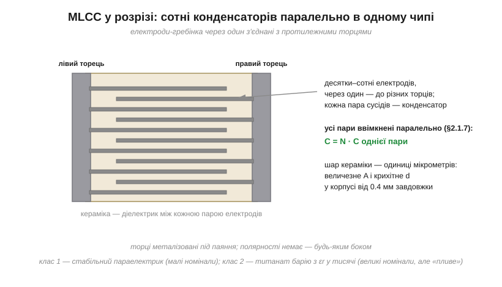
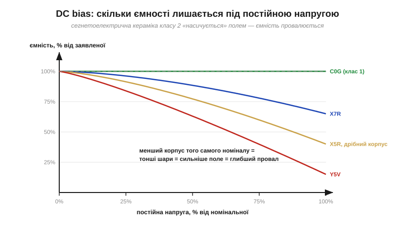

# 🔌 Керамічні MLCC: класи X7R/C0G/Y5V і DC bias

> Каталог «Компоненти» · сектор `passive`.

### Клас компонента

MLCC — крихітний неполярний прямокутник без виводів (від 0.4 мм завдовжки), що паяється прямо на контактні майданчики. Коштує центи, має мізерні ESR і ESL (тому це головний [конденсатор розв'язки](book:electronics/capacitor-uses)), покриває діапазон від часток пікофарада до десятків мікрофарад. На корпусі зазвичай **нічого не написано** — розсипавши стрічку, номінал уже не відновити без вимірювання.

### Будова: багато конденсаторів паралельно, виконані в кераміці

Усередині — «гребінка»: десятки-сотні шарів кераміки завтовшки в одиниці мікрометрів, між ними металеві електроди, з'єднані **через один** із протилежними металізованими торцями. Кожна пара сусідніх електродів — маленький конденсатор; усі вони ввімкнені **паралельно**, тож [ємності додаються](book:electronics/capacitors-series-parallel). Велике сумарне A, крихітне d — обидва важелі [формули C = ε₀·εr·A/d](book:electronics/capacitance) працюють на повну.


*Рис. MLCC у розрізі: шари кераміки й електроди, з'єднані через один із протилежними торцями. Це буквально N конденсаторів паралельно — у корпусі з міліметр.*

### Класи кераміки й розшифровка коду

Уся різниця між «хорошим» і «підступним» MLCC — у кераміці. **Клас 1** (стабільний параелектрик; код **C0G**, він же **NP0** — «нуль ppm/°C») має скромну εr, тож лише дрібні номінали (пФ–одиниці нФ), зате ємність практично не залежить ні від температури, ні від напруги. **Клас 2** (сегнетоелектрик на основі титанату барію) має εr у тисячи — звідси мікрофаради в крихітному корпусі, — але платить за це «плаваючою» ємністю.

Код класу 2 читається за схемою EIA «літера-цифра-літера»: нижня межа температури, верхня межа, допустимий дрейф ємності в цьому діапазоні:

```
X7R:  −55…+125 °C,  ΔC ≤ ±15%      (робоча конячка)
X5R:  −55…+85 °C,   ΔC ≤ ±15%      (дешевше, у дрібних корпусах)
Y5V:  −30…+85 °C,   ΔC +22…−82%    (найдешевша, найнестабільніша)
C0G/NP0: клас 1, ≈0±30 ppm/°C      (для точних кіл)
```

Зверніть увагу: «±15%» — це лише температурний дрейф. Напруга й час додають своє — і головний винуватець тут саме напруга.

### DC bias: куди зникає ємність

Сегнетоелектрик тому й має величезну εr, що його внутрішні диполі легко вишиковуються полем. Але прикладена **постійна** напруга вишиковує їх заздалегідь — і на додаткову зміну заряду їх лишається менше: ефективна εr, а з нею і ємність, **падає** з напругою. Це і є ефект **DC bias** — виняток із [лінійної залежності заряду від напруги](book:electronics/capacitance). Що тонші шари — тобто що **менший корпус** за того самого номіналу, — то сильніше поле за тієї ж напруги й то глибший провал.


*Рис. Типова картина: C0G не пливе взагалі; X7R на повній номінальній напрузі втрачає десятки відсотків; дрібний X5R — половину; Y5V — майже все. Криві орієнтовні — точні дивляться в даташиті конкретної деталі (графік «Capacitance vs. DC bias»).*

Практичний наслідок: «10 мкФ X5R 0603» на шині 5 В — це реально 5–6 мкФ, а той самий номінал у ще меншому корпусі — і того менше. Тому розв'язку та фільтри живлення рахують не за написом у каталозі, а за кривою DC bias у даташиті.

### Типові граблі

- **Точні кола на класі 2.** Таймер, фільтр чи генератор на X7R «попливе» з температурою й напругою — це одна з [неідеальностей реального конденсатора](book:electronics/capacitor-parasitics); для точності — C0G або плівка.
- **Заміна корпусу «один в один».** Поставили 0402 замість 0805 того самого номіналу — і мовчки втратили пів ємності через сильніший DC bias.
- **«Спів» плати.** Кераміка класу 2 п'єзоелектрична: пульсації напруги змушують її вібрувати — плата пищить; і навпаки, вібрація народжує електричний шум у чутливих колах.
- **Тріщини від згину.** Кераміка крихка: MLCC біля краю плати, роз'єму чи кріпильного отвору тріскається при згинанні — а тріщина може стати коротким замиканням живлення. У відповідальних місцях ставлять корпуси з еластичними терміналами (*soft termination*) або два конденсатори послідовно.

### Варіації класу

Автомобільні (кваліфікація AEC-Q200, ширші температури), високовольтні (сотні вольт — товщі шари), низькоіндуктивні «перевернуті» (для швидкої розв'язки), прецизійні C0G для ВЧ-кіл. Але дев'ять із десяти MLCC на типовій платі — це X7R/X5R на розв'язці плюс жменя C0G там, де ємність мусить бути числом, а не «приблизно».
