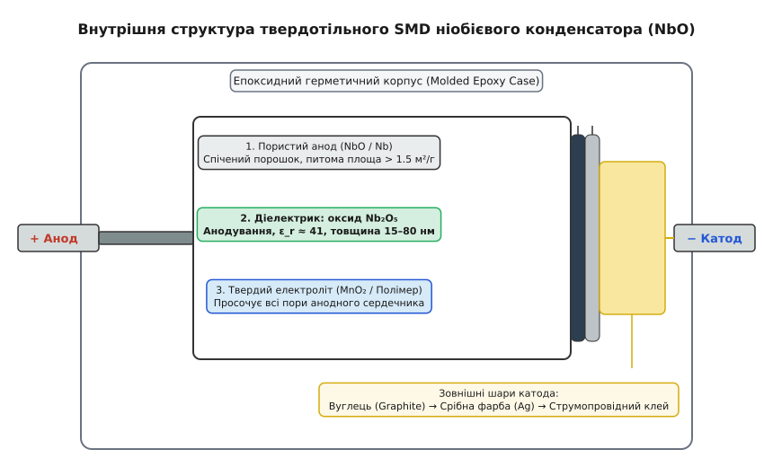
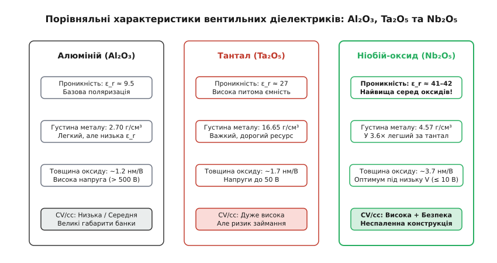
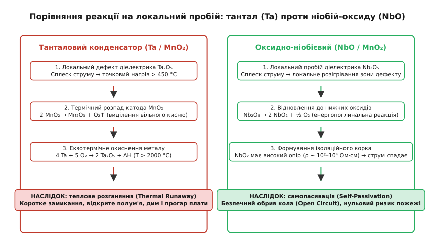
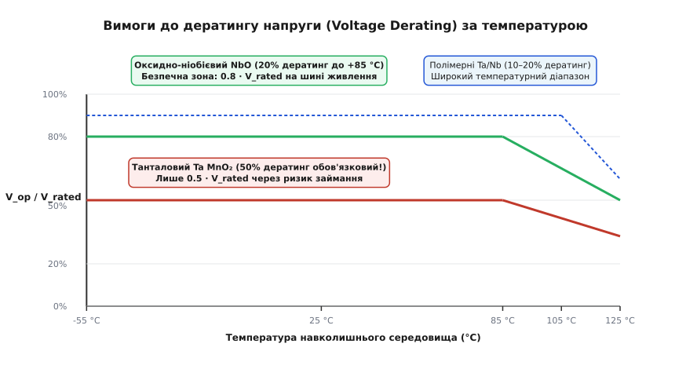
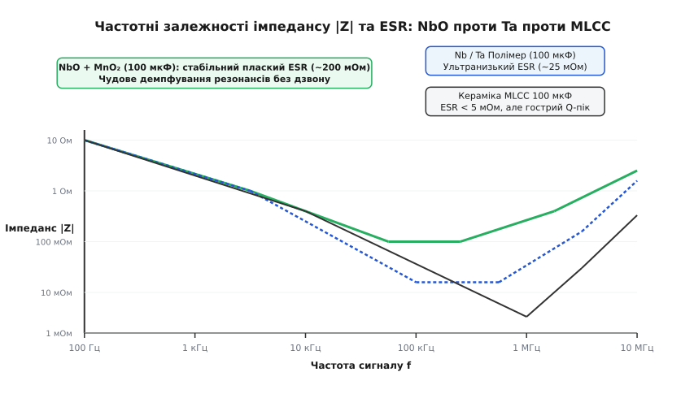

# Ніобієвий конденсатор: пористий анод, діелектрик Nb₂O₅ та неспаленна самопасивація

<preknowlist>
- [Конденсатор](book:electronics/capacitor) — розділення заряду, будова обкладок і діелектрика, накопичення енергії в електричному полі.
- [Ємність](book:electronics/capacitance) — формула C = ε₀·ε_r·A/d, геометричні фактори та фізичні межі збільшення площі.
- [Діелектрики конденсаторів](book:electronics/capacitor-dielectrics) — поляризація речовини, відносна діелектрична проникність, напруженість електричного пробою.
- [Паразити конденсаторів](book:electronics/capacitor-parasitics) — еквівалентний послідовний опір ESR, індуктивність ESL та струм витоку DCL.
- [Дератинг компонентів](book:electronics/derating) — правила зниження робочої напруги залежно від температури для підвищення надійності.
- [Твердотільний танталовий конденсатор](book:electronics/tantalum-capacitor) — пористий спічений анод, катод із MnO₂, механізми теплового пробою.
</preknowlist>

Коли на шині живлення сучасного мікроконтролера, цифрового сигнального процесора або матриці FPGA виникає різкий перехідний процес зі швидкістю наростання струму в десятки ампер за мікросекунду, малогабаритні керамічні конденсатори вичерпують накопичений заряд за лічені наносекунди, а звичайні алюмінієві електролітичні банки не встигають зреагувати через високу власну індуктивність виводів. Десятиліттями безальтернативним рішенням для компактної фільтрації залишалися твердотільні танталові конденсатори. Проте вони несуть у собі критичну приховану загрозу: локальний електричний або тепловий мікропробій діелектрика під дією комутаційного пускового струму перетворює танталовий анод на піротехнічний факел із температурою понад дві тисячі градусів, який пропалює друковану плату наскрізь і знищує сусідні мікросхеми.

Пошук компонента, який зберігав би рекордну об'ємну ємність і компактні SMD-габарити танталу, але був би фундаментально захищений від катастрофічного горіння на фізико-хімічному рівні, привів матеріалознавців до сусіднього елемента п'ятої групи періодичної системи — **ніобію** (*Niobium*, хімічний символ Nb) та його монооксиду (**NbO**). Отриманий прилад — **оксидно-ніобієвий конденсатор** (*niobium oxide capacitor*) — реалізував революційний принцип безпеки: при електричному пробої діелектричний шар не виділяє кисень і не горить, а самостійно пасивується, перетворюючись на високоомний ізоляційний корок.


*Анатомія оксидно-ніобієвого конденсатора в розрізі: пористий анод зі спіченого порошку NbO, нанорозмірний анодний діелектрик Nb₂O₅, твердий напівпровідниковий катод (MnO₂ або провідний полімер) та струмознімальні шари графіту й срібла в герметичному епоксидному корпусі.*

### Вентильні метали та електрохімія нанорозмірного діелектрика

Ніобій, тантал та алюміній належать до підгрупи **вентильних металів** (*valve metals*, від латинського *valva* — стулка, заслінка). Їхня визначальна фізична властивість полягає в здатності утворювати на своїй поверхні при анодній поляризації в розчині електроліту винятково щільну, бездоганно суцільну діелектричну оксидну плівку, яка блокує проходження постійного струму в прямому напрямку, але пропускає електрони при зміні полярності на протилежну.

Фундаментальна формула ємності плоского конденсатора визначає три базові інженерні важелі:

```
C = ε₀ · ε_r · A / d
```

де `ε₀ ≈ 8.854 × 10⁻¹² Ф/м` — електрична стала вакууму, `ε_r` — відносна діелектрична проникність матеріалу, `A` — площа поверхні взаємодії обкладок, `d` — товщина діелектричного прошарку.

Щоб розмістити сотні мікрофарад у корпусі завбільшки із сірникову голівку, твердотільна технологія доводить кожен із цих трьох параметрів до теоретичної фізичної межі:


*Фундаментальні властивості оксидів алюмінію, танталу та ніобію. Оксид ніобію Nb₂O₅ забезпечує рекордну діелектричну проникність (ε_r ≈ 41), що на 52% перевищує показник оксиду танталу, при значно меншій густині вихідного металу.*

1. **Рекордна діелектрична проникність (ε_r).** Аморфний пентаоксид ніобію **Nb₂O₅** має проникність **ε_r ≈ 41–42**. Це в 1.52 раза перевищує показник оксиду танталу Ta₂O₅ (`ε_r ≈ 27`) і в 4.3 раза — оксиду алюмінію Al₂O₃ (`ε_r ≈ 9.5`). За однакових розмірів анода та товщини оксидної плівки ніобієвий діелектрик накопичує на 52% більше електричного заряду, ніж танталовий.
2. **Нанометрова товщина бар'єра (d).** Оксидний шар не наноситься механічно, а вирощується безпосередньо з тіла анода шляхом електрохімічного анодування в слабкому водному розчині ортофосфорної кислоти (0.1–1.0% H₃PO₄) за температури +60...+85 °C. Процес підпорядковується моделі іонного транспорту Кабрери–Мотта у сильних полях: під дією напруженості поля понад `10⁶ В/см` іони кисню мігрують углиб металу, а іони ніобію — назовні. Товщина діелектрика суворо пропорційна кінцевій напрузі формування `V_form`:
   ```
   d = k_anod · V_form
   ```
   Для ніобію коефіцієнт анодування становить `k_anod ≈ 3.7 нм/В` (проти `1.7 нм/В` у танталу). Щоб гарантувати надійність і низький струм витоку, формувальна напруга обирається у 2.5–3.5 раза вищою за номінальну робочу напругу конденсатора. Наприклад, для деталі на робочу напругу 6.3 В формувальна напруга становить `V_form ≈ 20–25 В`, що дає товщину діелектричного шару всього `d ≈ 75–90 нм`.
   
   За такої нанометрової товщини робоча напруженість електричного поля всередині оксиду сягає гігантських величин:
   ```
   E = V_op / d = 5.0 В / (80 × 10⁻⁹ м) ≈ 6.25 × 10⁷ В/м = 625 кВ/см
   ```
   Таку напруженість може витримувати лише однорідна аморфна плівка, позбавлена кристалічних міжзеренних меж і сторонніх включень.
3. **Розвинена тривимірна площа (A).** Анод виготовляють методом порошкової металургії. Первинний порошок із розміром гранул від 0.2 до 1.5 мкм пресують навколо ніобієвого дроту-виводу в прямокутний брикет (*pellet* / *slug*) і спікають у вакуумній печі за температури +1400...+1750 °C при залишковому тиску менше `10⁻⁵ Торр`. Частинки порошку злипаються у точках дотику, утворюючи міцну пористу губку. Питома площа поверхні спіченого тіла сягає **1.5–3.5 м² на грам**. У результаті в об'ємі стандартного SMD-корпусу Case B (3.5 × 2.8 × 1.9 мм) поміщається площа обкладок понад 0.25 м².

Вичерпне порівняння вентильних матеріалів, їхніх кристалічних структур та питомих характеристик наведено в окремому матеріалознавчому огляді ([🔌 порівняння ніобію, танталу та алюмінію](book:electronics/niobium-capacitor/comp-niobium-vs-tantalum.md)).

### Матеріалознавство анода: чому чистий ніобій поступився монооксиду NbO

Перші спроби створити ніобієві конденсатори в 1970–1980-х роках у військових лабораторіях базувалися на чистому металевому ніобії (Nb). Проте всі ранні прилади страждали на хронічну деградацію: після кількох сотень годин роботи за температури понад +85 °C або після проходження термоудару пайки оплавленням (+260 °C) струм витоку лавиноподібно зростав у тисячі разів.

Фізична причина крилася в термодинаміці фазової діаграми системи `Nb – O`. Металевий ніобій має дуже високу границю розчинності кисню в твердому розчині (до 2–3 ат. % за підвищених температур). Коли конденсатор нагрівається, металевий анод буквально витягує атоми кисню з прилеглого діелектричного шару Nb₂O₅:

```
5 Nb (метал анода) + Nb₂O₅ (діелектрик) → 6 NbO (субоксид)   [твердофазна дифузія кисню]
```

Втрата кисню призводить до виникнення в структурі аморфного Nb₂O₅ величезної кількості двічі іонізованих кисневих вакансій `V_O¨`. Вони утворюють у забороненій зоні діелектрика густу мережу енергетичних рівнів-пасток, через які починається безперешкодний тунельний та термопольовий витік електронів. Діелектрик втрачає ізоляційні властивості.

Вирішальним проривом став синтез **монооксиду ніобію** (**NbO**) як матеріалу анода. Монооксид ніобію отримують високотемпературним твердофазним відновленням пентаоксиду воднем або парами магнію. Цей матеріал кардинально змінив фізику контакту:

```
NbO (анод) + Nb₂O₅ (діелектрик)   →   [термодинамічна рівновага, ΔG ≈ 0]
```

1. **Термодинамічна стабільність.** В оксиді NbO молярна частка кисню становить рівно 50%. Хімічний потенціал кисню на межі `NbO / Nb₂O₅` збалансований. Анод не має термодинамічного стимулу поглинати кисень із діелектрика ані під час тривалої роботи при +125 °C, ані під час екстремального пікового нагріву пайки при +260 °C.
2. **Металева провідність.** Монооксид NbO кристалізується в особливій дефектній кубічній решітці типу NaCl, де 25% вузлів підґратки металу і 25% вузлів кисню залишаються структурно вакантними. Завдяки перекриттю 4d-орбіталей ніобію утворюється частково заповнена зона провідності. Питома провідність NbO сягає `10⁴ См/м` (питомий опір `ρ ≈ 10⁻⁴ Ом·см`), що лише на два порядки нижче за чисті метали й повністю достатньо для ефективного струмознімання без збільшення паразитного ESR.

Хронологію того, як світова криза на ринку танталової руди (кольтану) у 2000 році змусила провідні компанії створити технологію OxiCap, описано в історичній довідці ([📜 кольтанова криза та створення NbO](book:electronics/niobium-capacitor/hist-tantalum-crisis-nbo.md)).

### Катодні системи: твердий діоксид марганцю MnO₂ проти електропровідних полімерів

Діелектрична плівка Nb₂O₅ повторює всі вигини нанопор всередині анодного тіла. Щоб створити повноцінний конденсатор, у цей мікроскопічний об'єм необхідно ввести провідний зустрічний електрод — **катод**. Використання рідких електролітів усунули з конструкції ще в середині XX століття через їхнє поступове випаровування та завеликий опір.

У сучасних конденсаторах застосовують дві технології твердого катода:

#### 1. Напівпровідниковий діоксид марганцю (MnO₂)
Анодний брикет із вирощеним оксидом багаторазово просочують водним розчином нітрату марганцю `Mn(NO₃)₂` і піддають високотемпературному піролізу за +240...+280 °C:
```
Mn(NO₃)₂ → MnO₂ + 2 NO₂↑   [термічний піроліз у порах]
```
Утворений чорний діоксид марганцю є твердим напівпровідником p-типу з питомим опором `ρ ≈ 0.1–1.0 Ом·см`. Він щільно заповнює пори, створюючи надійний електричний контакт із діелектриком. Поверх шару MnO₂ послідовно наносять колоїдний графіт (вуглецевий бар'єр, що запобігає хімічній реакції срібла з марганцем) та срібну фарбу, до якої провідним клеєм приєднують зовнішній катодний вивід із мідно-нікелевого сплаву.

#### 2. Електропровідні полімери (PEDOT:PSS / Polypyrrole)
У високочастотних серіях конденсаторів як катод використовують органічні синтетичні метали — полі-3,4-етилендіокситіофен (PEDOT), допований полістиролсульфонатом (PSS). Мономери вводять у пори та полімеризують хімічним шляхом за кімнатної температури.

Провідний полімер має питомий опір `ρ ≈ 0.001–0.01 Ом·см` — на два порядки нижчий за MnO₂. Завдяки цьому еквівалентний послідовний опір (ESR) конденсатора знижується з типових 200–300 мОм до рекордних 15–35 мОм, що дозволяє деталі пропускати струми пульсацій амперного діапазону без перегріву.

### Головний тріумф безпеки: фізика неспаленної самопасивації

Ключова перевага оксидно-ніобієвої технології над танталовою проявляється в момент позаштатної ситуації — при локальному електричному або тепловому пробої діелектричного шару.


*Фізичний механізм відмови: у танталовому конденсаторі кисень із розкладеного катода MnO₂ підтримує бурхливе горіння металевого танталу з виділенням понад 1.3 МДж тепла на моль. В оксидно-ніобієвому конденсаторі локальний нагрів відновлює Nb₂O₅ до напівпровідникового високоомного корка NbO₂, переводячи компонент у безпечний стан розриву кола.*

#### Термічний колапс танталу (Ta / MnO₂)
Коли в танталовому конденсаторі трапляється локальний пробій (унаслідок дефекту решітки чи стрибка напруги), струм короткого замикання в точці пробою нагріває мікрозону до температури понад +450 °C. За цієї температури починається ланцюг незворотних реакцій:
1. Термічний розпад катода з виділенням атомарного кисню:
   ```
   2 MnO₂ → Mn₂O₃ + ½ O₂↑   [ендотермічний розклад, ΔH₁ = +134 кДж/моль]
   ```
2. Катастрофічне окиснення металевого танталового анода у вивільненому кисні:
   ```
   2 Ta + 5/2 O₂ → Ta₂O₅   [глибоко екзотермічне горіння, ΔH₂ = -2046 кДж/моль]
   ```
Сумарний енергетичний баланс реакції становить `ΔH_total = -1376 кДж/моль`. Виділення величезної кількості тепла розігріває зону реакції до температури понад +2200 °C. Тантал починає самопідтримуване горіння, використовуючи власний катод як окиснювач. Корпус розривається, деталь спалахує відкритим полум'ям, виділяючи густий дим, а сплавлені залишки металу створюють стійке коротке замикання шини живлення з опором менше 0.1 Ом (*short-circuit failure mode*).

#### Самопасивація монооксиду ніобію (NbO / MnO₂)
В оксидно-ніобієвому конденсаторі анод виконано з NbO. При аналогічному виникненні локального дефекту й джоулевому розігріві зони пробою відбувається принципово інший фізико-хімічний процес:

```
Nb₂O₅ (діелектрик) → 2 NbO₂ (високоомний оксид) + ½ O₂   [ΔH = +289 кДж/моль]
```

Цей механізм має три захисні ступені:
1. **Ендотермічне гасіння тепла.** Реакція відновлення Nb₂O₅ до нижчих оксидів є **ендотермічною**: вона активно поглинає тепло з дефектного вузла, запобігаючи тепловому розганянню (*thermal runaway*).
2. **Утворення напівпровідникового ізоляційного корка.** Утворений діоксид ніобію **NbO₂** має питомий опір `ρ ≈ 10² – 10⁴ Ом·см` за кімнатної температури. Це на 6–8 порядків вище за опір анодного матеріалу NbO. Мікроканал пробою миттєво «закорковується» високоомною керамічною пробкою.
3. **Падіння струму та стабілізація.** Зі збільшенням опору дефектної зони струм короткого замикання миттєво спадає до мікроамперного рівня, виділення тепла припиняється, а температура спадає до норми.

Конденсатор не горить, не плавить епоксидний корпус, не виділяє газів і назавжди переходить у безпечний **стан розриву кола або високого імпедансу** (*Open-Circuit / Non-Combustion Failure Mode*).

Кількісний термодинамічний розрахунок теплових ефектів реакцій та математичні моделі емісії Френкеля–Пула подано в математичній вставці ([🧮 термодинаміка самопасивації та розрахунок надійності](book:electronics/niobium-capacitor/math-self-healing-kinetics.md)).

### Електричні параметри та правила інженерного проєктування

#### 1. Струм витоку (DCL) та його температурний коефіцієнт
Ширина забороненої зони пентаоксиду ніобію становить `Eg ≈ 3.4 еВ` (проти `4.5 еВ` у Ta₂O₅). Електронний транспорт крізь нанорозмірний оксид під дією сильного електричного поля визначається механізмом польової іонізації пасток (емісія Френкеля–Пула).

Через меншу глибину залягання пасток та дещо більшу дефектність аморфної сітки оксидно-ніобієві конденсатори мають у 3–5 разів вищий базовий струм витоку, ніж танталові:
* Для танталу стандартний витік розраховують як `I_leak ≤ 0.01 · C · V`;
* Для оксиду ніобію нормою є `I_leak ≤ 0.02–0.05 · C · V` (типово 15–30 мкА для номіналу 100 мкФ / 6.3 В за температури +25 °C).

При зростанні температури струм витоку експоненційно зростає згідно з термоактиваційним законом Арреніуса. При +85 °C витік збільшується приблизно в 10–12 разів (до 150–350 мкА), а при максимальній граничній температурі +125 °C може досягати 1.0–1.5 мА.

У схемах вторинного живлення цифрових процесорів, де струми споживання становлять від одиниць до сотень ампер, витік у кілька десятків мікроампер абсолютно непомітний. Проте в мікропотужних батарейних вузлах IoT із тривалим сном (де споживання схеми становить одиниці мікроампер) оксидно-ніобієві конденсатори ставити не рекомендовано.

#### 2. Стійкість до пускових комутаційних струмів (dI/dt)
У момент підключення пристрою до жорсткого джерела живлення незаряджений конденсатор створює сплеск струму:
```
I_peak = V_bus / (R_source + R_trace + ESR)
```
Якщо швидкість наростання `dI/dt` перевищує сотні ампер за мікросекунду, класичний тантал Ta-MnO₂ пробивається й може спалахнути при першому ж увімкненні. Для танталу стандарти вимагають обов'язкового послідовного резистора опором не менше `0.1–0.3 Ом/В`. Для оксидно-ніобієвих конденсаторів завдяки безпечній самопасивації це обмеження повністю скасовано (`R_series = 0 Ом/В`).


*Криві рекомендованого дератингу напруги від -55 °C до +125 °C. Танталові конденсатори Ta-MnO₂ вимагають обов'язкового 50% зниження робочої напруги. Оксидно-ніобієві конденсатори NbO дозволяють експлуатацію при 80% від номіналу (дератинг усього 20%) аж до +85 °C.*

#### 3. Норми дератингу напруги (Voltage Derating)
Через нульовий ризик займання виробники оксидно-ніобієвих конденсаторів (KYOCERA AVX, Vishay) встановили істотно м'якші вимоги до [зниження робочої напруги](book:electronics/derating):
* **Твердотільний тантал Ta-MnO₂:** вимагає обов'язкового дератингу **50%** за нормальних температур (робоча напруга не більше `0.50 · V_rated`) та до **67%** за температури +125 °C (`V_op ≤ 0.33 · V_rated`).
* **Оксид ніобію NbO:** вимагає дератингу лише **20%** за температури навколишнього середовища до +85 °C (дозволена робоча напруга до `0.80 · V_rated`). При нагріванні від +85 °C до +125 °C дератинг лінійно збільшують від 20% до 50%.

**Практичне порівняння для шини 5.0 В:**
* Для танталового конденсатора Ta-MnO₂ за правилом 50% дератингу необхідно обирати деталь номіналом **10 В** або **16 В** (типорозмір Case D або E, об'єм корпусу ~150 мм³).
* Для оксидно-ніобієвого конденсатора NbO достатньо обрати деталь на **6.3 В** (`6.3 В · 0.80 = 5.04 В`, типорозмір Case B або C, об'єм корпусу ~45 мм³).

Це дає виграш у площі друкованої плати у 2.5–3 рази й дозволяє зменшити масу блоку живлення.


*Залежність імпедансу |Z| та ESR від частоти. Помірний і стабільний ESR оксидно-ніобієвого конденсатора з MnO₂ (100–300 мОм) забезпечує ідеальне природне демпфування паразитних коливань шини живлення без резонансного дзвону, властивого наднизькоомній кераміці MLCC.*

#### 4. Частотна поведінка та відсутність ефекту DC-зсуву
Повний імпеданс конденсатора описується еквівалентною послідовною схемою (ємність `C`, послідовний опір `ESR` та паразитна індуктивність виводів `ESL ≈ 1.5–2.5 нГн`):

```
|Z(f)| = √[ ESR² + ( 2π·f·ESL - 1/(2π·f·C) )² ]
```

* На низьких частотах (до 20 кГц) переважає ємнісний реактивний опір.
* На резонансній частоті (`f₀ = 1 / (2π√(ESL·C)) ≈ 200–500 кГц`) реактивні складові взаємно компенсуються, а імпеданс досягає дна, що дорівнює активному ESR.
* На високих частотах (понад 1 МГц) імпеданс зростає через індуктивність металевих струмознімальних рамок.

На відміну від багатошарової кераміки MLCC класу II (діелектрики X7R, X5R на основі титанату барію BaTiO₃), де прикладання постійної напруги зміщення викликає [катастрофічне падіння реальної ємності на 40–80%](book:electronics/dc-bias-capacitance) через насичення доменної поляризації, оксидно-ніобієві конденсатори **мають нульовий ефект DC-зсуву**. Їхня ємність під номінальною робочою напругою становить рівно 100% паспорта. Крім того, неорганічний аморфний діелектрик Nb₂O₅ позбавлений п'єзоелектричних властивостей, що гарантує повну відсутність акустичного писку та мікрофонного шуму в чутливих звукових і радіовимірювальних трактах.

### Тонкощі експлуатації: діелектрична абсорбція та переполюсовка

Твердотільні оксидні конденсатори мають кілька специфічних фізичних особливостей, які інженер зобов'язаний враховувати при виборі компонента для точних аналогових вузлів:

1. **Діелектрична абсорбція (Dielectric Absorption / Soakage).** У структурі аморфного Nb₂O₅ частина електричного заряду перерозподіляється в глибоких потенціальних ямах диполів і пасток. Якщо заряджений конденсатор повністю розрядити накоротко на кілька секунд, а потім розімкнути виводи, через деякий час на обкладках знову з'явиться залишковий потенціал (від 1% до 3% від початкової напруги). Через цей ефект «пам'яті заряду» оксидно-ніобієві конденсатори не застосовують в інтеграторах точних аналогових АЦП і схемах вибірки-зберігання (*Sample-and-Hold*), де стандартом лишається неполярна плівка (поліпропілен або тефлон).
2. **Чутливість до зворотної напруги (Reverse Voltage).** Оскільки оксидно-ніобієвий конденсатор є строго полярним вентильним приладом, прикладання зворотної напруги викликає протікання прямого струму крізь контакт катод–діелектрик. Дозволена зворотна напруга становить не більше **10–15% від номіналу** за кімнатної температури (+25 °C) та не більше **1%** за температури +125 °C. Тривала робота зі зміною полярності руйнує анодний оксидний шар.
3. **Стабільність при тривалому зберіганні (Shelf Life).** На відміну від класичних рідинних алюмінієвих конденсаторів, які при зберіганні без напруги втрачають оксидний шар і потребують процедури повільного відновлення («тренування» або *reforming*), твердотільний анод NbO у сухій системі зберігає вихідні електричні параметри необмежено довго (понад 15–20 років без деградації).

### Виробничий контроль та випробування на надійність

Щоб гарантувати безвідмовну роботу в критичних системах, кожен серійний оксидно-ніобієвий конденсатор на заводі проходить спеціальний комплекс випробувань:

1. **100% сурж-скринінг (Surge Current Screening):** Кожен екземпляр піддають серії жорстких циклів заряду-розряду безпосередньо від низькоомного банку накопичувачів за стандартом MIL-PRF-55365 Option B (4 імпульси струму амплітудою до 15–25 А). Це дозволяє відсіяти зразки з мікротріщинами діелектрика ще на конвеєрі.
2. **Високотемпературне тренування під напругою (Burn-in / Voltage Conditioning):** Деталі витримують протягом 40–100 годин за температури +85 °C при напрузі `1.3 · V_rated`. Усі нестабільні дефекти самопасивуються в процесі тренування.
3. **Кліматичні випробування на вологе тепло (THB-тест):** Вибірковий контроль партій за стандартом AEC-Q200 при температурі +85 °C, відносній вологості 85% під номінальною робочою напругою протягом 1000 годин. Завдяки повній неорганічній природі оксидного сердечника параметри залишаються в межах допусків.
4. **Конструкції корпусів і зменшення індуктивності (Undertab / Facedown):** Традиційні SMD-корпуси мають J-подібні виводи (*J-lead*), які додають 1.5–2.0 нГн паразитної індуктивності. У сучасних низькоіндуктивних версіях оксидно-ніобієвих конденсаторів застосовують торцеві майданчики безпосередньо на нижній грані корпусу (*Facedown / Undertab*), що знижує ESL нижче 0.7–0.9 нГн і підвищує резонансну частоту до 1.5–2.0 МГц.

### Топологія розподільних мереж живлення (PDN)

У сучасних цифрових системах оксидно-ніобієві конденсатори рідко працюють наодинці. Найкращі результати дає **каскадна комбінована схема фільтрації**:

1. Безпосередньо біля виводів живлення кристала BGA встановлюють групу з 5–10 мініатюрних керамічних конденсаторів MLCC типорозмірів 0402 / 0603 номіналом 0.1–1.0 мкФ. Вони шунтують надшвидкі струмові імпульси перемикання транзисторних логічних вентилів на частотах від 10 до 200 МГц.
2. На відстані 5–15 мм на тій самій шині живлення встановлюють один або два оксидно-ніобієві конденсатори номіналом 100–220 мкФ. Вони відіграють роль локального накопичувача енергії при переході процесора з режиму сну в активний стан на частотах від 10 кГц до 500 кГц.
3. **Природне демпфування антирезонансів.** Якщо паралельно увімкнути кілька керамічних конденсаторів із наднизьким ESR (2–5 мОм), паразитні індуктивності друкованих провідників утворюють високодобротний коливальний контур. На частоті паралельного резонансу (типово 5–15 МГц) імпеданс шини живлення дає гострий піковий викид, що спричиняє збої цифрової логіки. Помірний і стабільний ESR оксидно-ніобієвого конденсатора (150–250 мОм) ідеально демпфує цей контур, перетворюючи його добротність на безпечну аперіодичну величину (`Q < 1`) без потреби встановлення додаткових дискретних демпферних резисторів.

Інженерний алгоритм розрахунку пускових контурів, теплових втрат та надійності мовами C і C++ наведено у практичному проєкті ([⚙️ розрахунок надійності та пускових кіл](book:electronics/niobium-capacitor/proj-niobium-inrush-protection.md)).

### Області застосування та інженерні ніші

Унікальні фізичні характеристики визначили чітку нішу оксидно-ніобієвих конденсаторів у сучасній схемотехніці:

1. **Автомобільна електроніка систем безпеки (AEC-Q200 Grade 1 / Grade 3):**
   * Модулі керування подушками безпеки (*Airbag Electronic Control Units*), де за нормами безпеки суворо заборонено використання компонентів із ризиком спалаху або короткого замикання;
   * Блоки електронного підсилювача керма (EPS) та антиблокувальної системи гальм (ABS/ESP);
   * Радари та лідари систем активної допомоги водієві (ADAS).
2. **Бортова авіоніка та космічні системи:**
   * Відповідність жорстким протипожежним нормативам Федерального авіаційного управління США (FAA FAR 25);
   * Істотне зниження польотної ваги апаратури завдяки тому, що оксид ніобію (4.57 г/см³) у 3.6 раза легший за металевий тантал (16.65 г/см³).
3. **Високонадійні сервери та телекомунікації:**
   * Системи вторинного розподілу живлення процесорних плат із шинами 3.3 В, 2.5 В, 1.8 В та 1.2 В;
   * Вузли гарячої заміни мережевих плат (*Hot-Swap Cards*), де високі швидкості комутації струму виключають застосування класичного танталу.

Підсумуймо. Оксидно-ніобієвий конденсатор — це високонадійний твердотільний полярний компонент, у якому пористий анод із напівпровідникового монооксиду ніобію (NbO) поєднано з високоефективним діелектриком Nb₂O₅ (`ε_r ≈ 41`). Він зберіг усі переваги танталових конденсаторів (велику ємність, компактність SMD-монтажу, стабільність у часі та відсутність втрати ємності під постійною напругою), усунувши їхню головну ваду — ризик вибухового горіння при пробої. Завдяки ендотермічній реакції самопасивації у високоомний діоксид NbO₂, помірному дератингу 20% та малій масі, оксидно-ніобієві конденсатори є незамінним вибором для відповідальних низьковольтних ліній живлення сучасної критичної електроніки.
