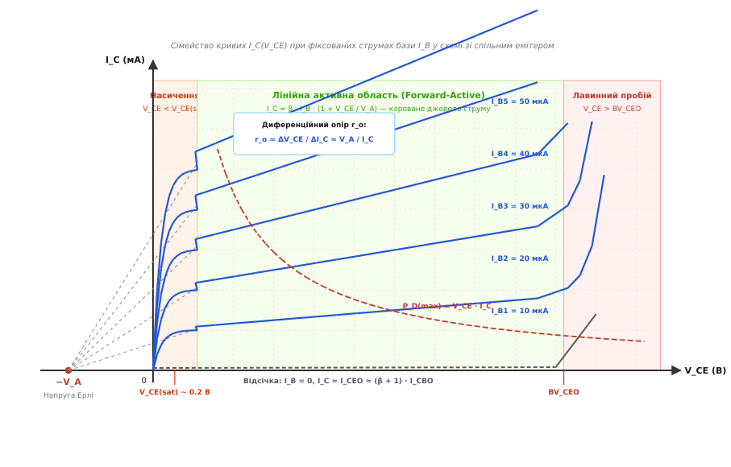
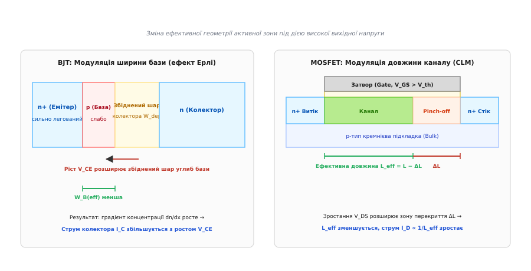
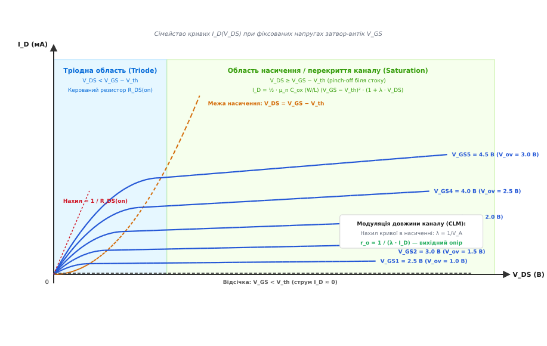
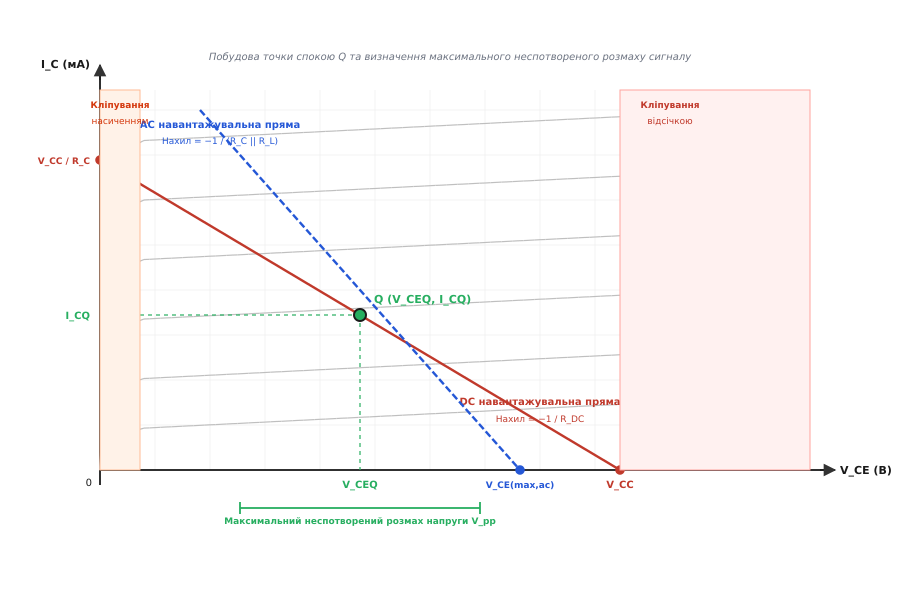

# Вихідні характеристики транзистора

<preknowlist>
- [Закон Ома](book:electronics/ohms-law) — лінійний зв'язок напруги, струму та опору в провіднику.
- [Робота біполярного транзистора](book:electronics/bjt-operation) — інжекція носіїв через емітерний перехід і перенесення струму крізь базу.
- [Керування полем](book:electronics/field-control) — модуляція провідності напівпровідникового каналу поперечним електричним полем затвора.
- [ВАХ діода](book:electronics/diode-iv-curve) — експоненційне пряме та зворотно-зміщене насичення p-n переходу.
- [Метод навантажувальної прямої](book:electronics/load-line) — графічне розв'язання нелінійного кола через накладання прямої Кірхгофа на характеристики елемента.
- [Диференційний опір](book:electronics/differential-resistance) — миттєве відношення приросту напруги до приросту струму в малій околиці точки спокою.
</preknowlist>

Коли електричний струм протікає крізь звичайний резистор, залежність між падінням напруги та величиною струму є однозначною: це пряма лінія, нахил якої визначається постійним опором матеріалу за [законом Ома](book:electronics/ohms-law). Для діода ця залежність стає нелінійною експонентою, проте вона все одно залишається однією фіксованою кривою на площині напруга-струм. Однак транзистор (англ. *transfer resistor* — керований опір переносу) є триполюсником, у якому струм силового виходу залежить не лише від прикладеної між силовими електродами напруги, а й від третьої величини — сигналу на керуючому електроді. Через наявність цього додаткового ступеня вільності повний електричний опис силового виходу транзистора неможливо передати одним графіком.

Для вичерпного опису поведінки транзистора у вихідному колі використовують вихідні вольт-амперні характеристики (грец. *charaktēr* — відбиток, ознака). Це сімейство кривих, кожна з яких фіксує залежність вихідного струму від вихідної напруги за умови, що параметр керування на вході приладу підтримується строго постійним. Для біполярного транзистора таким параметром є постійний струм бази, а для польового транзистора — напруга між затвором і витоком.

Вихідні характеристики дають інженеру повну просторову картину поведінки напівпровідникового приладу. За ними визначають опір відкритого ключа, внутрішній диференційний опір джерела струму, межі лінійного підсилення, залишкові напруги насичення, максимальні допустимі напруги до настання пробою та формують статичні й динамічні навантажувальні прямі каскадів.

---

## Двовимірний простір керованого приладу

У схемотехніці напівпровідниковий прилад розглядають як чотириполюсник, де два виводи слугують входом для подачі сигналу керування, а два інші — виходом для підключення навантаження та джерела живлення. Оскільки транзистор має лише три фізичні виводи, один із них обов'язково роблять спільним для вхідного та вихідного контурів. Найпоширенішими базовими конфігураціями для дослідження вихідних кіл є схема зі спільним емітером (СЕ) для біполярного транзистора та схема зі спільним витоком (СВ) для польового транзистора.

```
Схема зі спільним емітером (BJT):
        +-------> I_C
        |   | / C
        |  -|/ 
I_B --->|   |\
        |   | \ E
        |     |
        +-----+---- Спільний вивід (земля)

Схема зі спільним витоком (MOSFET):
        +-------> I_D
        |   | | D
        |  -||<
V_GS -->|   | | S
        |     |
        +-----+---- Спільний вивід (земля)
```

Вхідне коло керує концентрацією рухомих носіїв заряду в робочому об'ємі напівпровідника або геометрією провідного каналу. Вихідне коло створює поздовжнє електричне поле, яке прискорює та збирає ці носії, формуючи вихідний струм.

Якщо зафіксувати вхідний сигнал керування на деякому рівні та плавно змінювати напругу на силовому виході від нуля до гранично допустимого значення, датчик струму зафіксує плавну зміну вихідного струму. Повторюючи цей вимір для цілого ряду дискретних значень вхідного сигналу, отримують сімейство кривих. На цій двовимірній площині кожен транзистор має виражені характерні області, межі яких визначаються квантово-механічними та електростатичними процесами всередині напівпровідникового кристала.

---

## Вихідні характеристики біполярного транзистора (BJT)

Біполярний транзистор (BJT, англ. *Bipolar Junction Transistor*) складається з трьох послідовних областей напівпровідника з різними типами провідності: емітера (лат. *emittere* — випускати, випромінювати), бази (грец. *basis* — основа) та колектора (лат. *collector* — збирач), які утворюють два зустрічно увімкнених p-n переходи. Вихідною характеристикою BJT у схемі зі спільним емітером є функціональна залежність струму колектора `I_C` від напруги між колектором та емітером `V_CE` за умови фіксованого струму бази `I_B`:

```
I_C = f(V_CE)  при  I_B = const
```


*Сімейство вихідних характеристик біполярного транзистора I_C(V_CE) при фіксованих струмах бази I_B у схемі зі спільним емітером: виділено області насичення, лінійну активну область, відсічку, зону лавинного пробою та екстраполяцію ліній до напруги Ерлі −V_A.*

### Анатомія областей роботи біполярного транзистора

На площині вихідних характеристик BJT чітко розрізняють чотири фізичні області функціонування.

#### 1. Область відсічки (Cutoff Region)

Область відсічки виникає, коли вхідний струм бази дорівнює нулю (`I_B = 0`), або коли напруга на переході база-емітер є нульовою чи від'ємною (`V_BE ≤ 0`). У цьому стані обидва p-n переходи транзистора — емітерний та колекторний — є зворотно зміщеними або перебувають під нульовим потенціалом.

Оскільки емітерний перехід закритий, інжекція основних носіїв заряду з емітера в базу відсутня. Струм колектора, однак, не дорівнює абсолютному нулю через наявність теплової генерації електронно-діркових пар у збідненому шарі зворотно зміщеного колекторного переходу. 

Якщо вивід бази повністю розімкнений (`I_B = 0`), цей тепловий струм колектор-база `I_CBO` потрапляє в базу, прямо зміщує емітерний перехід і зазнає внутрішнього підсилення транзистором. У результаті через закритий транзистор протікає залишковий струм відсічки `I_CEO`:

```
I_CEO
= I_CBO + β · I_CBO      [підсилення теплового струму емітерним переходом]
= (β + 1) · I_CBO        [винесення спільного множника за дужки]
```

Для сучасних кремнієвих малопотужних транзисторів при кімнатній температурі струм `I_CBO` лежить у межах десятків пікоампер або одиниць наноампер, тому струм `I_CEO` не перевищує часток мікроампера, і на загальному графіку лінія відсічки практично збігається з віссю напруги. Проте зі зростанням температури цей струм експоненційно подвоюється приблизно кожні 10 °C, що робить тепловий струм відсічки критичним фактором у високовольтних та високотемпературних схемах.

#### 2. Область насичення (Saturation Region)

Область насичення (лат. *saturatio* — переповнення) розташована в лівій частині графіків при малих значеннях вихідної напруги, типово при `V_CE < 0.3–0.7 В`. У цій області обидва переходи — емітерний та колекторний — виявляються прямо зміщеними (`V_BE > 0` та `V_BC > 0`).

Коли напруга `V_CE` зменшується настільки, що стає меншою за пряме падіння напруги на відкритому емітерному переході (`V_CE < V_BE ≈ 0.65–0.7 В`), потенціал колектора опускається нижче потенціалу бази. Як наслідок, колекторний p-n перехід переходить із режиму зворотного зміщення у режим прямого зміщення. 

Замість того щоб лише збирати електрони, що долетіли з емітера, колектор починає інжектувати зустрічний потік дірок у базу (для структури n-p-n). Концентрація надлишкових носіїв заряду в базі різко зростає біля обох меж, градієнт концентрації електронів зменшується, і колекторний струм різко спадає практично до нуля при `V_CE → 0`.

У режимі насичення струм колектора перестає підкорятися співвідношенню `I_C = β · I_B`. Коефіцієнт підсилення за струмом падає нижче свого паспортного номіналу:

```
β_forced = I_C / I_B < β_active
```

Відношення `β_forced` називають форсованим коефіцієнтом підсилення насичення. Залишкова напруга на виводах повністю відкритого транзистора позначається як напруга насичення колектор-емітер `V_CE(sat)`. Вона складається з різниці напруг двох прямо зміщених p-n переходів і падіння на внутрішніх омічних опорах напівпровідникових шарів колектора `r_C'` та емітера `r_E'`:

```
V_CE(sat) = V_BE(sat) − V_BC(sat) + I_C · r_C' + I_E · r_E'
```

Для малопотужних кремнієвих транзисторів (наприклад, 2N3904 або BC547) величина `V_CE(sat)` становить від 0.05 до 0.2 В при помірних струмах і може досягати 0.4–0.8 В при граничних паспортних струмах колектора через вплив об'ємного опору кремнію `r_C'`.

#### 3. Лінійна активна область (Forward-Active Region)

Лінійна активна область є основним робочим простором транзистора при аналоговому підсиленні сигналів. У цій області емітерний перехід зміщений прямо (`V_BE ≈ 0.65–0.7 В`), а колекторний перехід — зворотно (`V_BC < 0`, що еквівалентно умові `V_CE > V_CE(sat)`).

Емітер інжектує потік електронів у тонку нейтральну область бази. Оскільки товщина бази набагато менша за дифузійну довжину пробігу носіїв, переважна більшість електронів (понад 98–99%) успішно дифундує крізь нейтральну базу, не встигнувши рекомбінувати з її основними носіями (дірками). Дійшовши до межі колекторного переходу, ці електрони захоплюються сильним електричним полем його збідненого шару та миттєво перекидаються в колектор.

Струм колектора в активній області практично повністю задається струмом емітера, який у свою чергу контролюється напругою на базі або струмом бази через коефіцієнт передачі струму `β` (або `h_FE`):

```
I_C = β · I_B = α · I_E
```

На графіку вихідних характеристик активній області відповідають пологі горизонтальні ділянки. Той факт, що криві майже паралельні осі напруги `V_CE`, свідчить про те, що транзистор поводиться як кероване джерело струму з надзвичайно високим внутрішнім диференційним опором: зміна вихідної напруги майже не впливає на величину колекторного струму.

#### 4. Область лавинного пробою (Breakdown Region)

Якщо напруга `V_CE` продовжує зростати, напруженість електричного поля всередині збідненого шару зворотно зміщеного колекторного переходу досягає критичних значень (понад 300 кВ/см для кремнію). Рухомі носії заряду розганяються полем до швидкостей, достатніх для ударної іонізації атомів кристалічної ґратки. Утворюються нові вторинні електронно-діркові пари, які в свою чергу іонізують наступні атоми — розвивається лавинний пробій.

На вихідній характеристиці це проявляється як різкий, практично вертикальний підйом струму колектора в правій частині графіка. Для схеми зі спільним емітером напруга пробою позначається як `BV_CEO` (Breakdown Voltage Collector-to-Emitter with Open Base). Вона помітно менша за напругу пробою самого ізольованого колекторного переходу `BV_CBO` (зі сполученим або розімкненим емітером), оскільки лавинний струм дірок, повертаючись у базу, додатково відкриває емітерний перехід і підсилюється транзистором:

```
BV_CEO ≈ BV_CBO / (β)^(1/n)
```

де `n` — емпіричний показник Міллера, що для кремнію становить 3–6. Наприклад, якщо діодний пробій колектор-база `BV_CBO` становить 80 В, а коефіцієнт `β = 100`, то напруга `BV_CEO` може становити всього 30–40 В. Робота в режимі пробою загрожує незворотним тепловим руйнуванням структури транзистора.

---

### Ефект Ерлі та вихідний диференціальний опір

В ідеальній моделі транзистора горизонтальні ділянки характеристик в активній області мали б нульовий нахил, а внутрішній вихідний опір транзистора дорівнював би нескінченності. Проте на реальних графіках ці криві мають помітний висхідний нахил: зі зростанням напруги колектор-емітер струм колектора плавно збільшується.


*Мікрофізична природа неідеальностей: ліворуч — розширення збідненого шару колектора у слабко леговану базу BJT при зростанні V_CE (ефект Ерлі); праворуч — зміщення точки перекриття інверсійного каналу MOSFET у бік витоку при збільшенні V_DS (модуляція довжини каналу).*

Цей феномен у 1952 році дослідив і описав американський інженер Джеймс Ерлі (James M. Early), і він отримав назву ефекту Ерлі (модуляції ширини бази).

Фізичний механізм явища полягає в наступному:
1. Зростання прикладеної між колектором і емітером напруги `V_CE` означає збільшення зворотної напруги на колекторному переході `V_CB = V_CE − V_BE`.
2. Будь-яке збільшення зворотної напруги на p-n переході призводить до розширення його збідненої області `W_dep`, у якій відсутні вільні рухомі носії заряду.
3. Оскільки область бази легується значно слабше, ніж колектор (для забезпечення високого коефіцієнта інжекції емітера), збіднений шар поширюється переважно вглиб бази.
4. У результаті електрично нейтральна, металургійна товщина бази, крізь яку мають дифундувати інжектовані електрони, скорочується від початкового значення `W_B0` до ефективного значення `W_B(eff)`:

```
W_B(eff) = W_B0 − ΔW(V_CB)
```

Зменшення товщини бази тягне за собою два фундаментальні наслідки:
- Градієнт концентрації надлишкових електронів у базі `dn/dx ≈ n(0) / W_B(eff)` зростає, що за законом дифузії Фіка безпосередньо збільшує дифузійний струм колектора.
- Зменшується ймовірність того, що електрон дорогою рекомбінує з діркою в базі, тому коефіцієнт передачі струму `β` дещо збільшується з ростом `V_CE`.

Якщо продовжити лінійні ділянки сімейства вихідних характеристик з активної області вліво, у бік від'ємних напруг, усі ці дотичні прямі перетнуться в одній точці на осі абсцис. Абсолютне значення напруги в цій точці позначають як напругу Ерлі `V_A` (типові значення для дискретних BJT лежать у діапазоні від 50 до 150 В, а для інтегральних структур — 20–80 В).

Рівняння вихідного струму колектора з урахуванням ефекту Ерлі набуває вигляду:

```
I_C = β · I_B · (1 + V_CE / V_A)
```

Диференційний вихідний опір транзистора `r_o` (лат. *differentia* — різниця), який визначає здатність каскаду протистояти змінам вихідної напруги, є величиною, оберненою до нахилу вихідної характеристики в обраній точці спокою:

```
r_o
= (∂I_C / ∂V_CE)⁻¹                [означення диференційного опору]
= [ (β · I_B) / V_A ]⁻¹            [взяття похідної від I_C по V_CE]
= (V_A + V_CE) / I_C               [точний вираз через напругу Ерлі]
≈ V_A / I_C                        [наближення при V_A >> V_CE]
```

Ефект Ерлі встановлює фундаментальну теоретичну межу для власного коефіцієнта підсилення за напругою `A_v0` одного транзисторного каскаду з ідеальним джерелом струму в навантаженні:

```
A_v0
= −g_m · r_o                       [добуток крутості на вихідний опір]
= −(I_C / V_T) · (V_A / I_C)       [підстановка g_m = I_C/V_T та r_o = V_A/I_C]
= −V_A / V_T                       [скорочення струму спокою I_C]
```

де `V_T = k · T / q ≈ 26 мВ` — тепловий потенціал при температурі 300 K. Для транзистора з напругою Ерлі `V_A = 130 В` граничне підсилення становить `130 / 0.026 = 5000` (близько 74 дБ) незалежно від обраного постійного струму спокою.

---

## Вихідні характеристики польового транзистора (MOSFET)

Польовий транзистор з ізольованим затвором (MOSFET, англ. *Metal-Oxide-Semiconductor Field-Effect Transistor*) керується напругою, прикладеною до затвора (англ. *gate* — брама, шлюз), який ізольований від напівпровідникової підкладки надтонким шаром діелектрика діоксиду кремнію `SiO2`. Силовий струм протікає між витоком (англ. *source* — джерело) та стоком (англ. *drain* — стікання).

Вихідною характеристикою MOSFET у схемі зі спільним витоком називають графік залежності струму стоку `I_D` від напруги стік-витік `V_DS` при фіксованій напрузі затвор-витік `V_GS`:

```
I_D = f(V_DS)  при  V_GS = const
```


*Сімейство вихідних характеристик польового транзистора I_D(V_DS) при фіксованих напругах затвор-витік V_GS: тріодна область, область насичення, межа перекриття каналу V_DS = V_GS − V_th, нахил кривих за рахунок модуляції довжини каналу та крутість відкритого стану 1/R_DS(on).*

### Анатомія областей роботи MOSFET

На вихідних характеристиках MOSFET з індукованим каналом n-типу виділяють три основні області, які принципово відрізняються характером розподілу електричного заряду вздовж каналу.

#### 1. Область відсічки (Cutoff Region)

Якщо напруга між затвором і витоком менша за порогову напругу формування інверсійного шару (`V_GS < V_th`), під затвором не утворюється провідний канал n-типу. Між стоком і витоком розташовані два зустрічно увімкнені p-n переходи підкладка-витік та підкладка-стік. Струм стоку `I_D ≈ 0`.

У дійсності при напругах `V_GS`, близьких до `V_th` знизу, спостерігається так званий підпороговий струм (Subthreshold Current), який має дифузійну природу та експоненційно залежить від `V_GS`. Цей струм є ключовим джерелом статичних витоків у сучасних мікропроцесорах, проте в силовій та аналоговій дискретній схемотехніці транзистор при `V_GS < V_th` вважають повністю вимкненим.

#### 2. Тріодна (лінійна / омічна) область (Triode Region)

Коли напруга затвора перевищує поріг (`V_GS > V_th`), поперечне електричне поле індукує під діелектриком суцільний інверсійний шар електронів, що з'єднує n+ області витоку і стоку. Якщо напруга між стоком і витоком мала і задовольняє умову:

```
V_DS < V_GS − V_th = V_ov
```

(де `V_ov = V_GS − V_th` називають напругою перевищення порогу, або *overdrive voltage*), транзистор працює в тріодній області. Свою назву ця область отримала через аналогію з вольт-амперними характеристиками вакуумного тріода.

У цій області інверсійний канал є неперервним на всій ділянці від витоку до стоку. Падіння напруги вздовж каналу описується квадратичним інтегральним рівнянням струму:

```
I_D = μ_n · C_ox · (W / L) · [ (V_GS − V_th) · V_DS − (V_DS² / 2) ]
```

де:
- `μ_n` — рухливість електронів у поверхневому шарі напівпровідника (см²/(В·с));
- `C_ox = ε_ox / t_ox` — питома ємність підзатворного діелектрика на одиницю площі (Ф/см²);
- `W` — ширина провідного каналу;
- `L` — фізична довжина каналу між витоком і стоком;
- `k_n' = μ_n · C_ox` — питомий технологічний параметр провідності процесу.

При малих значеннях вихідної напруги (`V_DS << 2 · V_ov`) квадратичним членом `V_DS² / 2` у рівнянні можна знехтувати, і залежність між струмом стоку та напругою стає лінійною:

```
I_D ≈ μ_n · C_ox · (W / L) · (V_GS − V_th) · V_DS
```

Транзистор поводиться як лінійний резистор, величиною опору якого можна плавно керувати через напругу затвора `V_GS`. Цей опір називають опором відкритого каналу `R_DS(on)`:

```
R_DS(on) = (∂I_D / ∂V_DS)⁻¹ = 1 / [ μ_n · C_ox · (W / L) · (V_GS − V_th) ]
```

Саме в цій області працюють силові ключові польові транзистори у відкритому стані: чим вища напруга затвора `V_GS`, тим менший опір `R_DS(on)` і тим менші статичні теплові втрати потужності `P = I_D² · R_DS(on)`.

#### 3. Область насичення / перекриття каналу (Saturation Region)

Зі збільшенням напруги на стоку `V_DS` потенціал каналу біля стокового виводу зростає. Оскільки напруга на затворі фіксована, локальна різниця потенціалів між затвором і каналом біля стоку зменшується:

```
V_GD(локальна) = V_GS − V_DS
```

Коли вихідна напруга досягає критичної межі:

```
V_DS = V_DS(sat) = V_GS − V_th = V_ov
```

локальна різниця потенціалів біля стоку стає рівною в точності пороговій напрузі `V_th`. Товщина інверсійного шару в цій точці звужується практично до нуля — настає перекриття каналу (англ. *pinch-off*).

При подальшому збільшенні `V_DS > V_ov` точка перекриття каналу дещо відступає від стоку в бік витоку. Між кінцем провідного каналу і сильно легованою областю стоку утворюється збіднена область, у якій діє сильне поздовжнє електричне поле. Електрони, які рухаються каналом від витоку, доходять до точки перекриття і підхоплюються цим полем, перелітаючи збіднений шар із насиченою дрейфовою швидкістю `v_sat ≈ 10⁷ см/с`.

Оскільки падіння напруги вздовж самого інверсійного каналу (від витоку до точки перекриття) фіксується на рівні `V_ov = V_GS − V_th`, будь-яка додаткова напруга на стоці понад `V_ov` падає виключно на короткому збідненому проміжку перекриття. Як наслідок, струм стоку перестає зростати і виходить на плато насичення:

```
I_D(sat) = (1/2) · μ_n · C_ox · (W / L) · (V_GS − V_th)²
```

Межа між тріодною областю та областю насичення на вихідних характеристиках формує параболу насичення:

```
I_D = (1/2) · k_n' · (W / L) · V_DS²
```

> ⚠️ **Пастка термінології: насичення BJT проти насичення MOSFET.**  
> Слід звернути особливу увагу на кардинальну різницю у використанні терміна «насичення»:
> - У **BJT** насичення — це стан **повністю відкритого ключа з мінімальною напругою** `V_CE(sat)` (переходи прямо зміщені, струм обмежений зовнішнім навантаженням).
> - У **MOSFET** насичення — це стан **джерела струму** з постійним плато (канал перекритий біля стоку, прилад працює в активному підсилювальному режимі).  
> Стан відкритого ключа в MOSFET називають **тріодною або лінійною областю**.

---

### Модуляція довжини каналу (Channel-Length Modulation)

Аналогічно до ефекту Ерлі в біполярних транзисторах, у реальних MOSFET плато струму в області насичення не є абсолютно горизонтальним. При підвищенні напруги `V_DS` понад рівень перекриття `V_ov` збільшується зворотна напруга на збідненій ділянці стоку, що призводить до її розширення `ΔL` в бік витоку.

Фактична довжина інверсійного каналу `L_eff`, уздовж якої падає напруга `V_ov`, скорочується:

```
L_eff = L − ΔL(V_DS)
```

Оскільки струм стоку обернено пропорційний довжині каналу (`I_D ∝ 1 / L_eff`), зменшення `L_eff` спричиняє монотонне зростання струму з ростом вихідної напруги. Цей ефект називають модуляцією довжини каналу (CLM, англ. *Channel-Length Modulation*).

Для врахування CLM у математичну модель вводиться емпіричний параметр модуляції довжини каналу `λ` (вимірюється в `В⁻¹`):

```
I_D = (1/2) · μ_n · C_ox · (W / L) · (V_GS − V_th)² · (1 + λ · V_DS)
```

Параметр `λ` є обернено пропорційним до еквівалентної напруги Ерлі для польового транзистора: `λ = 1 / V_A`. Диференціальний вихідний опір MOSFET в області насичення визначається формулою:

```
r_o = (∂I_D / ∂V_DS)⁻¹ = 1 / (λ · I_D0) ≈ (V_A + V_DS) / I_D
```

Параметр `λ` обернено пропорційний фізичній проектній довжині затвора `L`:

```
λ ∝ 1 / L
```

У довгоканальних транзисторах (наприклад, `L = 2–5 мкм`) зміщення точки перекриття `ΔL ≈ 0.1 мкм` становить незначну частку загальної довжини каналу, тому `λ` є малим (0.005–0.01 В⁻¹), а вихідний опір `r_o` — високим (сотні кілоом). У глибоко субмікронних інтегральних процесах (де `L < 28 нм`) відносне скорочення каналу стає переважаючим фактором, що значно знижує вихідний опір приладу та вимагає застосування каскодних схемотехнічних включень для відновлення високого підсилення каскадів.

---

## Порівняльний аналіз вихідних ВАХ BJT та MOSFET

Незважаючи на різну мікрофізичну природу (перенесення об'ємного струму крізь базу в BJT проти модуляції поверхневого каналу полем у MOSFET), обидва прилади виконують схожу схемотехнічну функцію — перетворення вхідного сигналу на керований вихідний струм.

| Параметр / Характеристика | Біполярний транзистор (BJT) | Польовий транзистор (MOSFET) |
| :--- | :--- | :--- |
| **Параметр керування** | Струм бази `I_B` (струмове керування) | Напруга затвор-витік `V_GS` (керування полем) |
| **Вхідний опір постійному струму** | Низький / помірний (прямо зміщений p-n перехід `r_π = β / g_m`) | Нескінченно великий (ізольований діоксид `R_in > 10¹² Ом`) |
| **Залежність вихідного струму в активному режимі** | Лінійна від струму бази: `I_C = β · I_B`<br>Експоненційна від напруги: `I_C ∝ exp(V_BE / V_T)` | Квадратична від напруги затвора:<br>`I_D = (k_n'/2) · (W/L) · (V_GS − V_th)²` |
| **Поведінка у відкритому ключовому стані** | Залишкове падіння `V_CE(sat) ≈ 0.1–0.3 В`<br>(джерело напруги + опір) | Чисто омічний опір `R_DS(on)`<br>(без початкового порогу напруги) |
| **Фізична назва області лінійного підсилення** | Лінійна активна область (Forward-Active) | Область насичення / перекриття (Saturation) |
| **Фізична назва ключового відкритого стану** | Область насичення (Saturation) | Тріодна / лінійна / омічна область (Triode) |
| **Механізм нахилу вихідних ВАХ** | Ефект Ерлі (розширення збідненого шару колектора у базу `W_B`) | Модуляція довжини каналу CLM (зсув точки pinch-off `L_eff`) |
| **Вихідний диференційний опір** | `r_o ≈ V_A / I_C` | `r_o = 1 / (λ · I_D) ≈ V_A / I_D` |
| **Температурний коефіцієнт опору відкритого стану** | Від'ємний (падіння напруги спадає з ростом `T`, ризик теплового розгону) | Додатний (`R_DS(on)` зростає з ростом `T`, самовирівнювання струму) |

Ключова практична перевага MOSFET у силовій електроніці полягає у відсутності фіксованого порогу падіння напруги: при малих струмах падіння напруги `V_DS = I_D · R_DS(on)` може становити лічені мілівольти, тоді як BJT завжди утримує на собі залишкову напругу насичення `V_CE(sat) ~ 0.1–0.2 В`. З іншого боку, BJT забезпечує значно вищу крутість перетворення напруга-струм `g_m = I_C / V_T` при заданому струмі спокою завдяки експоненційній природі емітерної інжекції.

---

## Навантажувальна пряма (DC & AC Load Lines) та вибір точки спокою

Вихідна характеристика сама по собі відображає лише властивості транзистора як ізольованого компонента. Щоб знайти реальні значення струмів і напруг у працюючій схемі, характеристику транзистора необхідно сумістити з характеристикою зовнішнього кола навантаження. Для цього застосовують метод навантажувальної прямої (графічне представлення законів Кірхгофа на площині вихідних характеристик).


*Статична DC (червона) та динамічна AC (синя пунктирна) навантажувальні прямі на сімействі вихідних кривих транзистора: положення робочої точки спокою Q, границі кліпування та розмах вихідної напруги V_pp без спотворень.*

### 1. Статична навантажувальна пряма (DC Load Line)

Розглянемо класичний резистивний каскад підсилювача зі спільним емітером, підключений до джерела постійної напруги живлення `V_CC` через колекторний резистор `R_C` та емітерний резистор `R_E`.

За другим [законом напруг Кірхгофа](book:electronics/kvl), рівняння для вихідного контуру постійного струму записується так:

```
V_CC = I_C · R_C + V_CE + I_E · R_E
```

Враховуючи, що струм емітера практично дорівнює струму колектора (`I_E ≈ I_C`), об'єднуємо статичні опори в сумарний опір постійного струму `R_DC = R_C + R_E`:

```
V_CC = I_C · R_DC + V_CE
```

Виражаємо струм колектора як лінійну функцію напруги колектор-емітер:

```
I_C = −(1 / R_DC) · V_CE + (V_CC / R_DC)
```

Це рівняння прямої лінії на координатній площині `(V_CE, I_C)`. Її положення однозначно визначається двома граничними точками:
- **Точка відсічки на осі напруги (`I_C = 0`):** транзистор повністю закритий, струм не тече, тому падіння напруги на навантаженні дорівнює нулю:
  `V_CE = V_CC`
- **Точка насичення на осі струму (`V_CE = 0`):** транзистор умовно повністю замкнений накоротко, уся напруга живлення падає на резисторі `R_DC`:
  `I_C(sat,DC) = V_CC / R_DC`

Нахил статичної навантажувальної прямої становить `−1 / R_DC`.

### 2. Робоча точка спокою (Q-point)

Точка перетину статичної навантажувальної прямої з конкретною вихідною кривою транзистора, що відповідає заданому колом зміщення струму бази `I_BQ` (або напрузі `V_GSQ`), називається робочою точкою спокою (Q-point, від лат. *quiescere* — перебувати у спокої). Координати цієї точки `(V_CEQ, I_CQ)` задають статичний режим каскаду за відсутності вхідного змінного сигналу.

Положення точки `Q` обирають залежно від функціонального призначення каскаду:
- **Підсилювач класу A:** Точку `Q` розташовують приблизно посередині між напругою насичення `V_CE(sat)` та напругою живлення `V_CC` (`V_CEQ ≈ (V_CC + V_CE(sat)) / 2`). Це забезпечує симетричний максимальний розмах вихідної напруги в обидва боки без передчасного обмеження.
- **Підсилювачі класу B та AB:** Точку `Q` зсувають впритул до області відсічки (`I_CQ ≈ 0`), що дозволяє різко знизити статичні втрати потужності у стані очікування та підвищити ККД.
- **Ключовий режим (комутація):** Робоча точка не перебуває в активній зоні, а стрибкоподібно перемикається між точкою відсічки (`V_CE ≈ V_CC, I_C ≈ 0`) та точкою насичення (`V_CE = V_CE(sat), I_C ≈ V_CC / R_DC`).

### 3. Динамічна навантажувальна пряма (AC Load Line)

Коли до виходу підсилювача через розділовий конденсатор підключається опір корисного навантаження `R_L`, а на вхід подається змінний сигнал, ситуація змінюється. 

Для змінного сигналу частотою `f` ємнісний опір розділового конденсатора `X_C = 1 / (2π · f · C)` стає мізерно малим (коротке замикання), а джерело живлення постійної напруги `V_CC` за змінним струмом є еквівалентом землі. Тому для змінного сигналу колекторний резистор `R_C` та навантаження `R_L` виявляються з'єднаними [паралельно](book:electronics/parallel-connection). Крім того, якщо емітерний резистор `R_E` зашунтований блокувальним конденсатором `C_E`, він не створює опору змінному струму.

Еквівалентний динамічний опір навантаження для змінного сигналу становить:

```
r_ac = R_C || R_L = (R_C · R_L) / (R_C + R_L)
```

Оскільки `r_ac` завжди строго менший за статичний опір `R_C`, динамічна навантажувальна пряма має **значно крутіший нахил** `−1 / r_ac`, ніж статична пряма `−1 / R_DC`.

Динамічна пряма зобов'язана проходити через точку спокою `Q(V_CEQ, I_CQ)`, оскільки за нульової амплітуди змінного сигналу коло повертається в статичний стан. Її рівняння зв'язку змінних складових струму `i_c` та напруги `v_ce`:

```
i_c = −(1 / r_ac) · v_ce
I_C − I_CQ = −(1 / r_ac) · (V_CE − V_CEQ)
```

Граничні точки динамічної навантажувальної прямої:
- **Максимальна напруга динамічного відсікання (`I_C = 0`):**
  `V_CE(max,ac) = V_CEQ + I_CQ · r_ac`
- **Максимальний струм динамічного насичення (`V_CE = 0`):**
  `I_C(max,ac) = I_CQ + V_CEQ / r_ac`

### 4. Розрахунок максимального неспотвореного розмаху сигналу

Динамічна навантажувальна пряма наочно демонструє межі амплітуди сигналу, який каскад здатен підсилити без спотворень (лат. *distorsio* — викривлення). 

При синусоїдальному керуванні струм і напруга коливаються вздовж динамічної прямої навколо точки `Q`. Розмах коливань обмежений двома бар'єрами:
1. **Зверху за струмом (ліворуч за напругою):** входом в область насичення транзистора при `V_CE = V_CE(sat)`. Максимально можливий спад напруги від точки спокою становить `ΔV_CE(-) = V_CEQ − V_CE(sat)`.
2. **Знизу за струмом (праворуч за напругою):** входом в область відсічки при `I_C = 0`. Максимально можливий приріст напруги від точки спокою обмежений струмом спокою: `ΔV_CE(+) = I_CQ · r_ac`.

Максимальна неспотворена амплітуда вихідної напруги `V_peak` визначається найменшим із цих двох обмежень:

```
V_peak(max) = min( I_CQ · r_ac,  V_CEQ − V_CE(sat) )
```

Повний максимальний розмах вихідної напруги пік-до-піку (Peak-to-Peak) дорівнює подвоєній амплітуді:

```
V_pp(max) = 2 · min( I_CQ · r_ac,  V_CEQ − V_CE(sat) )
```

Якщо амплітуда вхідного сигналу перевищить цю межу, настане явище зрізання верхівок сигналу — кліпування (англ. *clipping*):
- Якщо точка `Q` розташована надто високо (завеликий струм `I_CQ`), приріст сигналу вжене транзистор у насичення, і нижня частина синусоїди вихідної напруги зріжеться на рівні `V_CE(sat)`.
- Якщо точка `Q` розташована надто низько (замалий струм `I_CQ`), транзистор увійде у відсічку, і верхня частина синусоїди вихідної напруги зріжеться на рівні `V_CE(max,ac)`.

Оптимальне положення точки спокою для отримання симетричного максимального динамічного розмаху вимагає рівності обох плечей:

```
I_CQ · r_ac = V_CEQ − V_CE(sat)
```

---

## Зона безпечної роботи (SOA) та практичні обмеження

При проектуванні схем навантажувальна пряма не повинна виходити за межі зони безпечної роботи (SOA, англ. *Safe Operating Area*). Область SOA на вихідних характеристиках обмежується чотирма фізичними бар'єрами:

```
      I_C ^
          |  1. Границя струму I_C(max) (бонди / дроти)
  I_C(max)+-------------+
          |             \
          |              \  2. Границя потужності P_D(max) (критична темп. T_J)
          |               \
          |                \  3. Границя вторинного пробою (BJT)
          |                 \
          |                  \  4. Границя напруги BV_CEO
          +-------------------+----> V_CE
                             BV_CEO
```

1. **Максимальний струм колектора/стоку `I_max`:** визначається щільністю струму металізації та діаметром тонких дротяних виводів (бондів), що з'єднують напівпровідниковий кристал із ніжками корпусу. Перевищення веде до перегорання виводів як плавких запобіжників.
2. **Максимальна розсіювана потужність `P_D(max)`:** крива гіперболи `P_D = V_CE · I_C = const`. Визначається тепловим опором корпус-радіатор та максимальною робочою температурою кристала `T_J(max) ≈ 150–175 °C`.
3. **Межа вторинного пробою (Secondary Breakdown):** специфічний дефект біполярних транзисторів. При одночасно високій напрузі та великому струмі виникає локальна концентрація струму в найгарячішій точці переходу (струмовий шнур), яка викликає локальне розплавлення кремнію.
4. **Максимальна напруга пробою `BV_CEO` / `BV_DSS`:** електрична міцність збідненої області силового переходу.

---

## Інженерний приклад: аналіз робочої точки та навантажувальної прямої

Розглянемо практичну реалізацію алгоритму аналізу вихідного каскаду на транзисторі. Програма розраховує статичну точку спокою `Q`, параметри динамічної прямої, диференційний опір з урахуванням ефекту Ерлі та максимальний неспотворений розмах напруги.

:::tabs
```c
#include <stdio.h>

/* Структура параметрів каскаду та транзистора */
typedef struct {
    double v_cc;      /* Напруга живлення (В) */
    double r_c;       /* Опір колектора (Ом) */
    double r_e;       /* Опір емітера (Ом) */
    double r_l;       /* Опір навантаження (Ом) */
    double v_a;       /* Напруга Ерлі (В) */
    double v_ce_sat;  /* Напруга насичення (В) */
    double i_cq;      /* Струм спокою колектора (А) */
} StageConfig;

typedef struct {
    double v_ceq;       /* Напруга спокою колектор-емітер (В) */
    double r_ac;        /* Динамічний опір навантаження (Ом) */
    double r_o;         /* Вихідний диференційний опір (Ом) */
    double v_pp_max;    /* Максимальний розмах пік-до-піку (В) */
    int is_clipping_sym;/* Прапорець симетричності розмаху */
} AnalysisResult;

AnalysisResult analyze_bjt_stage(const StageConfig *cfg) {
    AnalysisResult res;
    double r_dc = cfg->r_c + cfg->r_e;
    
    /* Статична напруга спокою за KVL */
    res.v_ceq = cfg->v_cc - cfg->i_cq * r_dc;
    
    /* Динамічний опір навантаження для змінного струму */
    res.r_ac = (cfg->r_c * cfg->r_l) / (cfg->r_c + cfg->r_l);
    
    /* Вихідний опір транзистора з урахуванням ефекту Ерлі */
    res.r_o = (cfg->v_a + res.v_ceq) / cfg->i_cq;
    
    /* Допустимі розмахи плечей до насичення та до відсічки */
    double swing_to_sat = res.v_ceq - cfg->v_ce_sat;
    double swing_to_cut = cfg->i_cq * res.r_ac;
    
    double v_peak_max = (swing_to_sat < swing_to_cut) ? swing_to_sat : swing_to_cut;
    res.v_pp_max = 2.0 * v_peak_max;
    
    /* Перевірка симетричності (допуск 5%) */
    double diff = swing_to_sat - swing_to_cut;
    if (diff < 0) diff = -diff;
    res.is_clipping_sym = (diff / v_peak_max) < 0.05;
    
    return res;
}

int main(void) {
    StageConfig cfg = {
        .v_cc = 12.0,
        .r_c = 1000.0,
        .r_e = 200.0,
        .r_l = 2000.0,
        .v_a = 100.0,
        .v_ce_sat = 0.2,
        .i_cq = 0.005 /* 5 мА */
    };
    
    AnalysisResult res = analyze_bjt_stage(&cfg);
    
    printf("V_CEQ: %.2f V\n", res.v_ceq);
    printf("r_ac:  %.1f Ohm\n", res.r_ac);
    printf("r_o:   %.1f kOhm\n", res.r_o / 1000.0);
    printf("V_pp(max): %.2f V (симетрія: %s)\n", 
           res.v_pp_max, res.is_clipping_sym ? "так" : "ні");
           
    return 0;
}
```
```cpp
#include <iostream>
#include <iomanip>
#include <algorithm>
#include <cmath>

struct StageConfig {
    double v_cc{12.0};      // Напруга живлення (В)
    double r_c{1000.0};     // Опір колектора (Ом)
    double r_e{200.0};      // Опір емітера (Ом)
    double r_l{2000.0};     // Опір навантаження (Ом)
    double v_a{100.0};      // Напруга Ерлі (В)
    double v_ce_sat{0.2};   // Напруга насичення (В)
    double i_cq{0.005};     // Струм спокою колектора (А)
};

struct AnalysisResult {
    double v_ceq{0.0};        // Напруга спокою колектор-емітер (В)
    double r_ac{0.0};         // Динамічний опір навантаження (Ом)
    double r_o{0.0};          // Вихідний диференційний опір (Ом)
    double v_pp_max{0.0};     // Максимальний розмах пік-до-піку (В)
    bool is_clipping_sym{false}; // Прапорець симетричності розмаху
};

constexpr AnalysisResult analyze_bjt_stage(const StageConfig& cfg) noexcept {
    const double r_dc = cfg.r_c + cfg.r_e;
    const double v_ceq = cfg.v_cc - cfg.i_cq * r_dc;
    const double r_ac = (cfg.r_c * cfg.r_l) / (cfg.r_c + cfg.r_l);
    const double r_o = (cfg.v_a + v_ceq) / cfg.i_cq;
    
    const double swing_to_sat = v_ceq - cfg.v_ce_sat;
    const double swing_to_cut = cfg.i_cq * r_ac;
    
    const double v_peak_max = std::min(swing_to_sat, swing_to_cut);
    const double v_pp_max = 2.0 * v_peak_max;
    const bool is_clipping_sym = std::abs(swing_to_sat - swing_to_cut) / v_peak_max < 0.05;
    
    return {v_ceq, r_ac, r_o, v_pp_max, is_clipping_sym};
}

int main() {
    constexpr StageConfig cfg{
        .v_cc = 12.0,
        .r_c = 1000.0,
        .r_e = 200.0,
        .r_l = 2000.0,
        .v_a = 100.0,
        .v_ce_sat = 0.2,
        .i_cq = 0.005
    };
    
    constexpr auto res = analyze_bjt_stage(cfg);
    
    std::cout << std::fixed << std::setprecision(2);
    std::cout << "V_CEQ:     " << res.v_ceq << " V\n";
    std::cout << "r_ac:      " << res.r_ac << " Ohm\n";
    std::cout << "r_o:       " << (res.r_o / 1000.0) << " kOhm\n";
    std::cout << "V_pp(max): " << res.v_pp_max << " V (симетрія: " 
              << (res.is_clipping_sym ? "так" : "ні") << ")\n";
              
    return 0;
}
```
:::

---

## Практика вимірювання вихідних характеристик (Curve Tracer)

Зняття сімейства вихідних характеристик напівпровідникових приладів виконують за допомогою спеціалізованих вимірювальних приладів — характериографів (англ. *Curve Tracer*) або сучасних цифрових модулів SMU (англ. *Source-Measure Unit*).

Принцип роботи характериографа побудований на синхронній роботі двох генераторів:
1. **Генератор керуючого сигналу:** формує східчастий сигнал струму або напруги. Кожен крок відповідає одній фіксованій кривій `I_B` або `V_GS` і триває рівно один цикл розгортки силового виходу.
2. **Генератор силової розгортки:** подає на силовий вихід (`V_CE` або `V_DS`) циклічну пилкоподібну або півсинусоїдальну напругу від 0 до заданого максимуму. Одночасно прецизійний шунт вимірює миттєве значення струму `I_C` чи `I_D`.

```
Спрощена структурна схема вимірювача ВАХ:
                   +------------------+
                   |  Генератор пили  |----+
                   |  V_CE розгортки  |    |
                   +------------------+    |
                                           |
                   +------------------+    |    +------------+
                   | Східчастий струм |----+----> Транзистор |
                   |  I_B (кроки)     |    |    |  (DUT)     |
                   +------------------+    |    +------------+
                                           |          |
                                           +---------[Шунт]---> Струм I_C
                                                      |
                                                     GND
```

Критичною вимогою при практичному знятті ВАХ є **імпульсний режим вимірювань** (Pulsed IV Measurement). Якщо подавати постійну напругу та струм тривалий час, кристал транзистора розігрівається через потужність `P = V · I`. Розігрів кристала викликає температурний дрейф характеристик (зростання `β` у BJT або падіння рухливості `μ_n` та зростання `R_DS(on)` у MOSFET), внаслідок чого виміряна крива спотворюється тепловим хвостом. Для отримання справжніх ізотермічних характеристик тривалість вимірювальних імпульсів обмежують величинами 100–300 мкс із низькою шпаруватістю.

> 🔧 **Навіщо це.**  
> Даташити часто наводять поодинокі числові значення параметрів: `h_FE = 200` або `R_DS(on) = 10 мОм`. Проте в реальних схемах транзистор майже ніколи не працює строго в тих умовах, для яких виміряно ці одиничні цифри.
> 
> Вихідні характеристики дають інженеру повну графічну карту приладу:
> - **У підсилювачах:** за нахилом кривих в активній зоні розраховують реальний вихідний опір `r_o` та коефіцієнт підсилення каскаду, а за допомогою навантажувальної прямої точно обирають точку спокою `Q` для запобігання кліпуванню звукового чи радіочастотного сигналу.
> - **У силових перетворювачах і ключах:** за крутістю початкової тріодної ділянки оцінюють реальний опір відкритого транзистора при доступній напрузі драйвера затвора `V_GS`, що дозволяє точно розрахувати тепловідвід та уникнути перегріву.
> - **У джерелах струму та струмових дзеркалах:** вихідні характеристики показують мінімальну напругу виходу на режим стабілізації струму (напругу виходу з насичення) та динамічний опір джерела.

---

## Підсумок

Вихідні вольт-амперні характеристики транзистора є фундаментальним інструментом аналізу та проектування напівпровідникових схем. Вони пов'язують мікроскопічну фізику твердотільного приладу (інжекцію носіїв, модуляцію ширини бази, перекриття інверсійного каналу та лавинний пробій) із системними схемотехнічними параметрами. Накладання статичних та динамічних навантажувальних прямих Кірхгофа на сімейство вихідних кривих дозволяє точно проектувати підсилювальні каскади з максимальним динамічним діапазоном, мінімізувати спотворення та гарантувати безпечну роботу приладу в межах його зони надійності SOA.