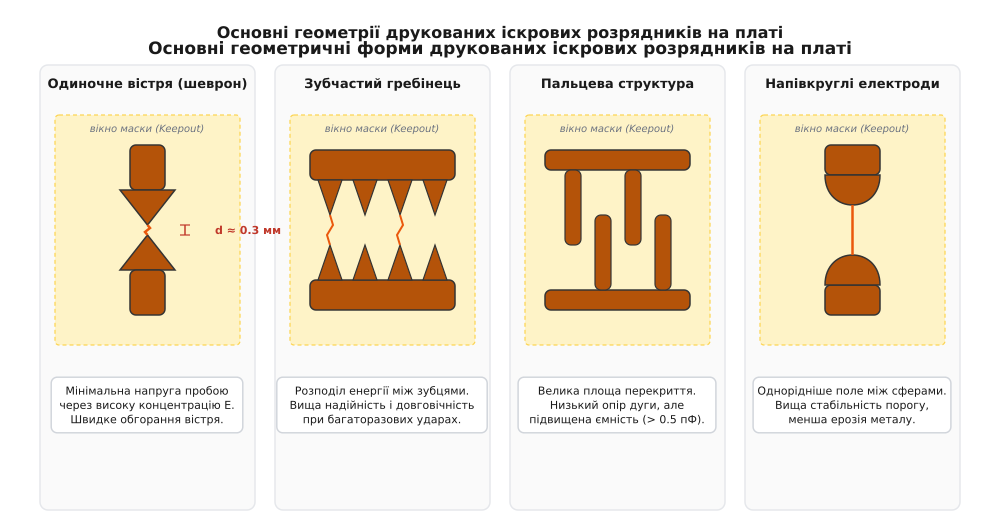
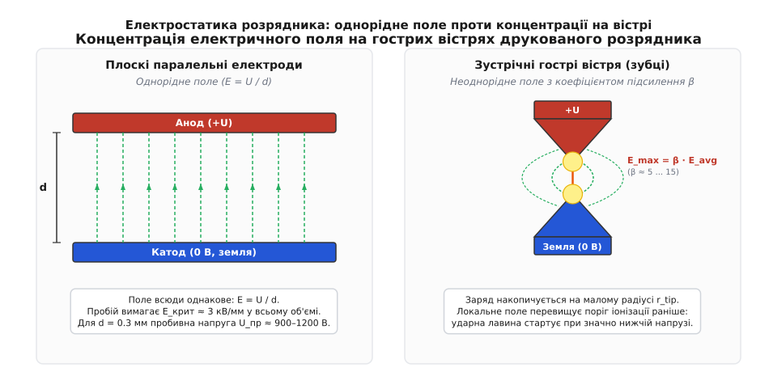
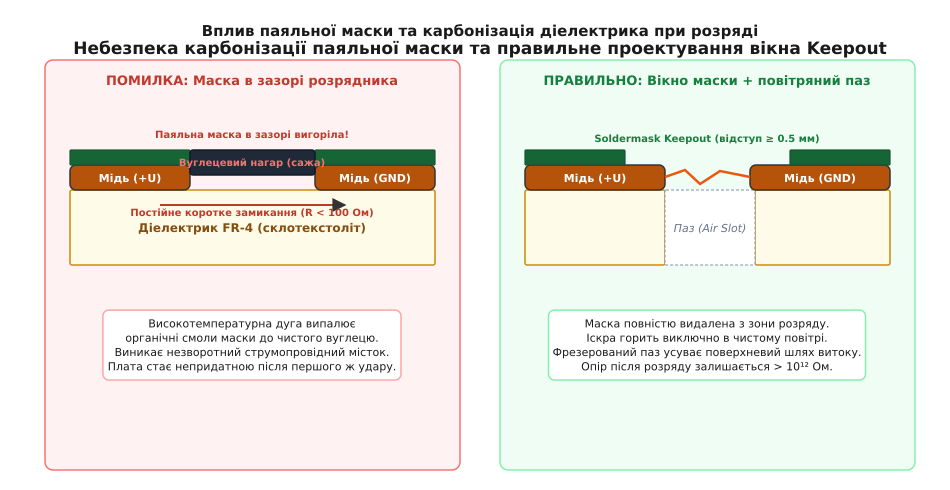
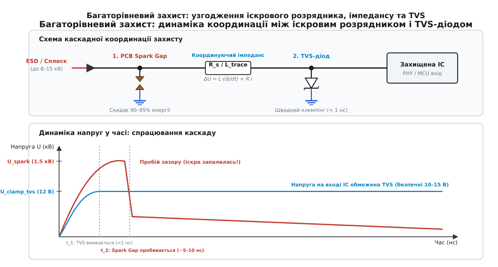

# Друкований іскровий проміжок

<preknowlist>
- [Пробій повітря](topic:physics/air-breakdown) — закон Пашена, ударна іонізація газу та критична напруженість електричного поля.
- [Класи ізоляції та шляхи витоку](topic:electronics/insulation-classes) — повітряний зазор (Clearance) та шлях струму витоку по поверхні діелектрика (Creepage).
- [Газорозрядник (GDT)](topic:electronics/gdt) — динаміка газового розряду, перехід тління в дугу та закоротковий захист (crowbar).
- [TVS-діод](topic:electronics/tvs-diode) — швидкодійне лавинне обмеження напруги (clamping) та динамічний опір.
- [Захист від ESD](topic:electronics/esd-protection) — моделі електростатичного розряду (HBM, CDM) та стандарти випробувань IEC 61000-4-2.
</preknowlist>

Коли оператор торкається металевого гнізда роз'єму RJ45 або зовнішньої клеми польового давача, на плату розряджається електростатичний потенціал людського тіла амплітудою 8–15 кВ із піковим струмом у десятки ампер. Якщо на шляху цього імпульсу немає спеціальних компонентів захисту, сплеск напруги за частки наносекунди пробиває підзатворний оксид вхідних транзисторів мікросхеми, випалюючи кремнієвий кристал. Спеціалізовані захисні компоненти — напівпровідникові діоди [TVS](topic:electronics/tvs-diode) чи керамічні [газорозрядники GDT](topic:electronics/gdt) — потребують окремого місця на платі, збільшують вартість виробу в специфікації (BOM) і вносять власну паразитну ємність, яка спотворює високочастотні сигнали.

Найпростіший і водночас найстаріший спосіб приборкати такий сплеск не вимагає жодного купленого компонента. Достатньо вивести на зовнішньому шарі друкованої плати дві мідні доріжки, що сходяться гострими зубцями на відстань у частки міліметра одна навпроти одної: одна доріжка підключається до сигнальної лінії, друга — до шасі або захисного заземлення. При появі кіловольтних перенапруг повітряний проміжок між вістрями іонізується, спалахує мікроіскра, і весь надлишковий струм скидається на землю ще до того, як імпульс проникне в глибину схеми. Такий елемент топології називають **друкованим іскровим проміжком** (*PCB Spark Gap*).


*Чотири класичні конфігурації друкованого розрядника на платі: одиночний гострий шеврон, багатоточковий зубчастий гребінець для розподілу енергії, зустрічна пальцева структура з низьким опором дуги та напівкруглі електроди зі стабільним порогом пробою. Жовтим пунктиром показано обов'язкове вікно без паяльної маски (Soldermask Keepout).*

> 🔧 **Навіщо це.** Друкований іскровий проміжок — це «нульова лінія оборони» проти потужних статичних та грозових перенапруг. Його вартість у специфікації компонентів дорівнює рівно $0.00, а власна паразитна ємність становить менше ніж 0.05 пФ. Це робить його ідеальним первинним бар'єром для високошвидкісних ліній Ethernet, коаксіальних антенних входів, плат блоків живлення та зовнішніх клемних колодок промислової автоматики.

---

### Фізика газового розряду та електростатика вістря

Робота друкованого розрядника ґрунтується на явищі [електричного пробою повітря](topic:physics/air-breakdown). Сухе атмосферне повітря за нормальних умов є чудовим діелектриком із питомим опором понад `10¹⁴` Ом·м, оскільки кількість вільних носіїв заряду (електронів та іонів, утворених природною радіацією чи космічними променями) у ньому мізерна.

Якщо між двома паралельними плоскими електродами на відстані `d` прикласти різницю потенціалів `U`, виникає однорідне електричне поле з напруженістю:

```
E = U / d      [напруженість однорідного поля]
```

Для плоских електродів за нормального атмосферного тиску повітря втрачає діелектричні властивості при критичній напруженості `E_crit ≈ 3.0` кВ/мм (30 кВ/см). За такої напруженості випадковий вільний електрон на довжині вільного пробігу між зіткненнями з молекулами азоту та кисню встигає набрати кінетичну енергію, достатню для ударної іонізації молекули газу:

```
e⁻ + N₂ → N₂⁺ + 2e⁻      [ударна іонізація молекули азоту]
```

Один електрон вибиває другий, два електрони вибивають чотири — виникає експоненційно зростаюча електронна лавина (механізм Таунсенда). Якщо поле залишається високим, лавина перетворюється на самопропагуючий високопровідний плазмовий канал — стример, який замикає електроди та переходить у низькоомну електричну дугу.


*Зліва — плоскі паралельні пластини формують рівномірне поле E = U / d, де пробій вимагає високої напруги по всьому об'єму. Справа — гострі трикутні зубці викривляють еквіпотенціальні поверхні, концентруючи лінії електричного поля на малому радіусі вістря. Локальне поле E_max перевищує середнє в кілька разів, що знижує напругу запалювання розряду.*

#### Ефект громовідводу: концентрація поля на гострому кінчику

На відміну від плоских пластин, друкований іскровий розрядник виконують у вигляді зустрічних трикутних зубців або гострих вістрів. В електростатиці відомо, що поверхнева густина електричного заряду `σ` на провіднику довільної форми обернено пропорційна локальному радіусу кривини поверхні `r_tip`:

```
σ ∝ 1 / r_tip      [густина заряду на вістрі]
```

Чим гостріший зубець (менший радіус `r_tip`), тим більший електричний заряд скупчується на самому його кінчику. Відповідно, електричне поле безпосередньо біля вершини вістря виявляється набагато сильнішим за середнє поле в зазорі.

Локальне максимальне поле на вістрі з радіусом заокруглення `r_tip` на відстані `d` від протилежного електрода визначається виразом:

```
E_max = β · E_avg = β · (U / d)      [максимальне поле з коефіцієнтом підсилення]
```

де `β` — безрозмірний коефіцієнт геометричного підсилення поля (*field enhancement factor*). Для витягнутого параболічного або гіперболічного вістря цей коефіцієнт наближено дорівнює:

```
β ≈ (2 · d) ÷ (r_tip · ln(4 · d / r_tip))      [коефіцієнт підсилення гострого вістря]
```

Для типових параметрів друкованої плати, де зазор `d = 0.3` мм (`300` мкм), а радіус вістря свіжовитравленого мідного зубця становить `r_tip ≈ 25` мкм, коефіцієнт підсилення сягає `β ≈ 5 ... 8`.

Це означає, що коли середня напруженість у зазорі становить лише `0.6` кВ/мм (при напрузі 180 В), на кінчику зубця локальне поле вже перевищує `3.5–4.5` кВ/мм. Повітря безпосередньо біля вістря починає іонізуватися набагато раніше, виникає коронний мікророзряд, який викидає вільні електрони в зазор і різко полегшує формування стримера.

Повний математичний апарат конформних відображень, виведення коефіцієнта `β` для зустрічних клинів та критерій стримерного пробою Міка–Ретера детально розібрано в окремій вставці ([🧮 математичне виведення концентрації поля на вістрі](topic:electronics/pcb-spark-gap/math-tip-field.md)).

#### Закон Пашена та межа зниження напруги

Залежність напруги пробою газу `U_br` від добутку тиску газу `p` на відстань між електродами `d` описується [законом Пашена](topic:physics/air-breakdown):

```
U_br = f(p · d)      [закон Пашена]
```

Крива Пашена для повітря має характерну U-подібну форму з вираженим мінімумом при `(p · d)_min ≈ 0.57` Торр·см, що за нормального атмосферного тиску (760 мм рт. ст.) відповідає зазору близько **`d ≈ 7.5` мкм**. У цій точці мінімальна напруга пробою повітря становить приблизно **`U_min ≈ 327` В**.

З цього випливає фундаментальний інженерний висновок:
- Якщо зазор між провідниками на платі зменшувати з 1 мм до 0.2 мм, напруга пробою зменшується майже лінійно;
- Проте зробити друкований іскровий розрядник на платі з напругою спрацювання нижче **`350–400 В`** у звичайному атмосферному повітрі **фізично неможливо**, навіть якщо зменшити зазор до кількох мікрометрів за допомогою надточного лазерного різання;
- Зазор менше 50–75 мкм стає технологічно небезпечним через ризик випадкового замикання мікрочастинками пилу, залишками флюсу або ростом мідних дендритів під дією вологи.

Тому друковані іскрові проміжки проектують виключно як захист від кіловольтних перенапруг (типово 800 В — 3 кВ), а для захисту низьковольтних ліній 3.3 В / 5 В їх обов'язково доповнюють напівпровідниковими елементами.

---

### Геометричні форми друкованих розрядників

Форма мідних провідників у зоні розрядника визначає не лише початкову напругу спрацювання, але й термін служби, паразитну ємність та поведінку приладу після багаторазових ударів. У практиці проектування друкованих плат закріпилися чотири основні топологічні конфігурації.

```
Форма електродів              Початкова напруга U_пр   Ємність C_пар    Ерозійна стійкість   Основне призначення
-------------------------------------------------------------------------------------------------------------------------
Одиночний шеврон (зубці)      Мінімальна (600–900 В)   < 0.05 пФ        Низька               Чутливі ESD-входи, сенсори
Зубчастий гребінець           Середня (800–1200 В)     0.05–0.15 пФ     Висока               Входи живлення, Ethernet
Пальцева структура            Середня (900–1300 В)     0.3–0.8 пФ       Дуже висока          Високострумові імпульси
Напівкруглі електроди         Підвищена (1.2–1.8 кВ)   0.1–0.2 пФ       Максимальна          Мережеві бар'єри AC, Hipot
```

#### 1. Одиночний шеврон (Saw-tooth Chevron)

Конфігурація складається з двох гострих трикутних зубців, спрямованих вершинами один до одного. Кут при вершині зубця зазвичай обирають у діапазоні `30° ... 60°`.
- **Переваги:** Максимальна концентрація електричного поля на гострому кінчику забезпечує найнижчу напругу спрацювання серед усіх геометрій при заданому зазорі. Паразитна ємність практично не вимірювана (менше 0.03 пФ), що дозволяє ставити такі зубці на радіочастотні траси до кількох гігагерців.
- **Недоліки:** Оскільки весь струм розряду щоразу проходить через одну й ту саму мікроскопічну точку вершини, мідь швидко оплавляється та випаровується. Радіус вістря збільшується після кожного розряду, і напруга запалювання поступово зростає.

#### 2. Зубчастий гребінець (Multi-tooth Array / Saw-tooth Bar)

Є масивом із кількох паралельних зустрічних зубців (від 3 до 10 пар), об'єднаних спільною шиною.
- **Фізичний механізм:** Первинний пробій виникає на тій парі зубців, де за рахунок технологічного допуску травлення зазор виявився на кілька мікрометрів меншим або вістря гострішим. Якщо струм імпульсу великий, локальне падіння напруги та розширення плазмового шнура ініціюють паралельні розряди на сусідніх зубцях.
- **Переваги:** Енергія сплеску розподіляється між кількома точками ерозії. Термін служби такого розрядника в 5–10 разів вищий, ніж у одиночного шеврона, що робить його стандартом для портів Ethernet RJ45 та промислових інтерфейсів RS-485.

#### 3. Пальцева структура (Interdigital / Interlocking Fingers)

Конфігурація утворена прямокутними мідними смужками, що входять одна між одну у вигляді «гребінки» з фіксованим бічним і торцевим зазором.
- **Переваги:** Велика загальна площа розрядного проміжку забезпечує дуже низький динамічний опір дуги та високу здатність до розсіювання кілоамперних імпульсних струмів тривалістю 8/20 мкс.
- **Недоліки:** Паралельні довгі смужки утворюють суттєву паразитну ємність (до 0.5–1.5 пФ), що обмежує їх застосування у швидкісних цифрових лініях, проте робить їх відмінним рішенням для силових ланцюгів змінного та постійного струму.

#### 4. Напівкруглі та закруглені електроди (Curved / Spark-Sphere)

Електроди виконують у вигляді зустрічних круглих контактних майданчиків або напівкруглих виступів полігонів із радіусом заокруглення `R = 0.5 ... 2.0` мм.
- **Фізичний механізм:** Електричне поле між двома циліндричними або сферичними поверхнями значно однорідніше, ніж між гострими вістрями.
- **Переваги:** Висока повторюваність напруги пробою. Відсутність надтонких вістрів виключає швидке обгорання металу. Застосовується в колах контролю випробувальної напруги ізоляції ([Hipot-тестування](topic:electronics/insulation-classes)) та як контрольований запобіжний розрядник між гальванічно розв'язаними землями.

---

### Топологічні правила та виробничі вимоги

Друкований іскровий розрядник є одним із небагатьох елементів, де надійність роботи визначається не стільки принциповою схемою, скільки прецизійністю топологічного проектування та дотриманням технологічних обмежень виробництва друкованих плат.


*Зліва — груба помилка: наявність паяльної маски в зазорі розрядника призводить до її термічного розкладання дугою, утворення вуглецевого містка (сажі) та незворотного короткого замикання плати. Справа — коректне проектування: вікно паяльної маски Soldermask Keepout з відступом ≥ 0.5 мм та фрезерований наскрізний паз у склотекстоліті FR-4.*

#### 1. Критична вимога: вікно паяльної маски (Soldermask Keepout)

Паяльна маска (зелений, синій або чорний полімерний шар на основі епоксидної смоли) наноситься на плату для захисту міді від окиснення та запобігання перемичкам припою під час монтажу. Діелектрична міцність сухої плівки маски становить близько 15–25 кВ/мм.

Якщо маска покриває зазор іскрового розрядника, виникає катастрофічний ефект:
1. Висока напруга пробиває тонку плівку маски, запалюючи дугу з температурою плазми понад 4000–6000 °C;
2. Під дією надвисокої температури органічна основа маски піддається термічному піролізу — випалюванню з утворенням чистого **електропровідного вуглецю (графіту та сажі)**;
3. На поверхні плати утворюється постійний вуглецевий місток (*carbon track*), опір якого падає з сотень гігаомів до **десятків або сотень омів**;
4. Після першого ж спрацьовування сигнальна лінія виявляється наглухо закороченою на землю. Плата стає повністю непрацездатною і не підлягає відновленню.

> ⚠️ **Залізне правило проектування:** Зона іскрового проміжку мусить мати повне вікно розкриття паяльної маски (*Soldermask Relief / Keepout*). Маска повинна бути відсунута від будь-якої точки мідних зубців щонайменше на **`0.5–1.0 мм`** по всьому периметру.

#### 2. Пропилювання наскрізних пазів у FR-4 (Milled Air Slots)

Навіть за відсутності маски під дією потужного розряду може відбуватися карбонізація самої епоксидної смоли склотекстоліту FR-4, на якому лежать мідні зубці. Крім того, волога та пил, що осідають на текстоліті, утворюють поверхневий шлях витоку ([Creepage](topic:electronics/insulation-classes)), що знижує електричну міцність.

Щоб повністю виключити поверхневий пробій по текстоліту, безпосередньо під зазором між вістрями **фрезерують наскрізний поздовжній паз** (*Air Slot*) шириною 0.8–1.5 мм. У такому випадку:
- Іскра горить виключно в чистому об'ємі повітря, не торкаючись твердого діелектрика;
- Шлях витоку по поверхні діелектрика примусово розривається, зростаючи в кілька разів (струм вимушений огинати краї отвору);
- Продукти ерозії та іонізовані гази вільно розсіюються крізь отвір плати, не осідаючи між зубцями.

#### 3. Фінішне покриття міді (Surface Finish)

Оскільки мідні зубці залишаються відкритими від маски, вони піддаються фінішній металізації на заводі друкованих плат:

- **ENIG (Electroless Nickel Immersion Gold):** Найкращий вибір для іскрових проміжків. Хімічний нікель товщиною 3–5 мкм покривається тонким шаром золота (0.05–0.1 мкм). ENIG точно повторює геометрію травлення, зберігає ідеальну гостроту вістрів, не окислюється в атмосфері, а твердий шар нікелю має високу термостійкість до ерозії дуги.
- **HASL (Hot Air Solder Leveling):** Покриття гарячим припоєм є найгіршим варіантом. Рідкий припій за рахунок сил поверхневого натягу утворює товстий наплив (меніск) на гострих кінчиках, перетворюючи тонке вістря на округлу краплю з непередбачуваним радіусом `r_tip`. Це збільшує напругу спрацювання на 30–50% і робить її абсолютно нестабільною від плати до плати. Крім того, під час розряду краплі розплавленого припою можуть розбризкуватися та закорочувати зазор.
- **Immersion Tin / Immersion Silver:** Забезпечують плоску поверхню та чіткі краї, але срібло з часом піддається сульфідації (покривається темною плівкою сульфіду срібла `Ag₂S` під дією сірки з повітря), а олово під дією сильних електричних полів схильне до утворення ниткоподібних кристалів (віскерів).

#### 4. Технологічні зазори та допуски травлення

Стандартний процес фотолітографії та хімічного травлення на більшості заводів має технологічний допуск на ширину провідника та зазору порядку `±20 ... ±35` мкм:
- Якщо в проекті закладено зазор `d = 0.20` мм (8 mil), на готовій платі він може коливатися від 0.17 мм до 0.23 мм;
- Для напруги пробою це дає технологічний розкид порядку **`±15–25%`** лише за рахунок геометричного фактора;
- Спроба закласти надмалий зазор `d < 0.15` мм (менше 6 mil) на стандартному виробництві веде до високого відсотка браку через неповне витравлювання міді між вістрями (ризик короткого замикання одразу після виготовлення).

---

### Переваги та фундаментальні обмеження

Інженерне рішення про застосування друкованого розрядника завжди є компромісом між абсолютною дешевизною та специфічними фізичними недоліками відкритого газового розряду.

```
Переваги друкованого іскровика                  Фізичні недоліки та обмеження
-----------------------------------------------------------------------------------------------------------------
Нульова вартість у BOM ($0.00)                  Нестабільність порогу пробою (розкид ±30–50% від вологості й тиску)
Нульова паразитна ємність (C < 0.05 пФ)         Повільний час спрацювання (5–20 нс, пропускає швидкі фронти ESD)
Нульовий струм витоку в нормі (R > 10¹³ Ом)    Незворотна ерозія металу та нагар після серії розрядів
Здатність скидати великі струми (сотні ампер)   Струм супроводження (не гасить дугу на колах постійного струму DC)
Не потребує монтажу та паяння на лінії SMT      Висока залишкова напруга до моменту запалювання дуги (сотні вольтів)
```

#### Чому одного іскровика недостатньо для сучасних мікросхем

Сучасні цифрові мікросхеми виготовляються за нанометровими технологічними нормами (від 180 нм до 5 нм). Товщина підзатворного діелектрика оксиду кремнію `SiO₂` у вхідних польових транзисторах становить лише одиниці нанометрів, а його напруга пробою не перевищує **`10–15 В`**. Час руйнування такого затвора становить менше **`0.5–1.0 нс`**.

Друкований іскровик має два фундаментальні часові обмеження:
1. **Статистична затримка іонізації (`t_stat`):** Щоб почалася лавина, у зоні високого поля повинен випадково опинитися хоча б один первинний вільний електрон. У сухому чистому повітрі очікування такого електрона може тривати від 1 до 10 нс.
2. **Формувальна затримка стримера (`t_form`):** Час, необхідний для розвитку лавини та переходу її в суцільний плазмовий шнур (типово 2–5 нс).

У результаті сумарний час спрацювання відкритого іскровика становить **`5–15 нс`**. Протягом цих перших наносекунд напруга на вході встигає підскочити до кількох сотень вольтів, і цей пік вільно проходить далі по лінії, миттєво знищуючи незахищений кристал мікросхеми.

Крім того, після спалаху іскри напруга на дузі не падає до нуля, а фіксується на рівні напруги горіння дуги **`15–25 В`**, що все одно перевищує допустиму напругу для мікроконтролера.

Саме тому друкований іскровий розрядник ніколи не застосовують як *єдиний* засіб захисту чутливих кремнієвих входів.

---

### Багаторівневі комбіновані схеми захисту

Щоб поєднати колосальну енергоємність друкованого іскровика з наносекундною швидкодією та низькою напругою обмеження напівпровідників, будують **багаторівневі (каскадні) схеми захисту**.


*Принципова схема та часові діаграми каскадного захисту. TVS-діод миттєво зрізає фронт сплеску до безпечних 12 В. Швидкозростаючий струм крізь індуктивність L_trace створює динамічне перенапруження, яке підпалює іскровий розрядник. Після запалювання дуги основний струм скидається іскровиком на землю.*

#### Принцип динамічної координації ступенів

Каскад складається з трьох послідовних елементів:
1. **Первинний ступінь:** друкований іскровик `Spark Gap` безпосередньо на вході плати біля гнізда роз'єму.
2. **Координуючий імпеданс:** послідовна друкована доріжка з індуктивністю `L_trace` (20–40 нГн) та/або імпульсний резистор `R_s` (1–5 Ом, або самовідновлюваний запобіжник [PTC](topic:electronics/ptc-fuse)).
3. **Вторинний ступінь:** швидкодійний напівпровідниковий [TVS-діод](topic:electronics/tvs-diode) біля виводів мікросхеми.

Робота каскаду розгортається в часі за чітким сценарієм:
- **0 ... 1 нс:** Високовольтний імпульс ESD приходить на вхід. Іскровик ще не встиг пробитися. Імпульс біжить крізь доріжку до TVS-діода. Діод відкривається менш ніж за 1 нс і фіксує напругу на вході мікросхеми на рівні свого обмеження (наприклад, 10–12 В).
- **1 ... 5 нс:** Струм розряду швидко наростає через лінію. Оскільки струм змінюється з величезною швидкістю (`di/dt > 10¹⁰` А/с), на індуктивності розділової доріжки `L_trace` виникає динамічне падіння напруги:
  ```
  ΔU = L_trace · (di / dt) + R_s · i      [падіння напруги на розв'язці]
  ```
- **Момент запалювання (5 нс):** Напруга на вході іскровика дорівнює сумі напруги TVS-діода та перепаду на індуктивності: `U_gap = U_tvs + ΔU`. Ця напруга швидко перевищує поріг запалювання 1000–1200 В, повітря іонізується, і спалахує іскра.
- **5 ... 100 нс:** Іскровик переходить у низькоомну дугу. Напруга на вході плати падає до 15–20 В. Основна енергія імпульсу (понад 95%) скидається іскровиком на заземлене металеве шасі. TVS-діод розвантажується і безпечно поглинає лише залишковий низькоенергетичний хвіст.

Чисельне моделювання перехідних процесів у такому каскаді, вихідний код симулятора мовами C та C++ і розрахунок необхідної довжини доріжок наведено у практичній вставці ([⚙️ розрахунок і моделювання каскаду захисту](topic:electronics/pcb-spark-gap/proj-spark-gap-coordination.md)).

#### Типові схеми включення в реальних пристроях

```
Інтерфейс / Вузол                 Схема включення розрядника                                 Призначення
---------------------------------------------------------------------------------------------------------------------------------
Ethernet 100/1000Base-T (RJ45)   Між центральними відводами трансформатора і шасі (Chassis)  Скидання синфазного ESD з кабелю
RS-485 / CAN промисловий          З кожної сигнальної лінії (A, B) на захисну землю (PE)      Захист трансивера від статичних наведень
Імпульсний блок живлення (AC)     Між нейтраллю/фазою та Protective Earth (PE) через паз     Захист від грозових мікросплесків
Вхід коаксіальної антени (SMA)    Трикутні зубці безпосередньо біля центрального майданчика  Скидання статики при підключенні антени
Монтажні отвори кріплення плати   Кільцевий зубчастий зазор між внутрішньою та зовнішньою GND Захист від розряду через кріпильні гвинти
```

У портах Ethernet 100/1000Base-T застосовують узгоджувальний ланцюг Боба Сміта (*Bob Smith Termination*), де центральні відводи диференційних трансформаторних пар підключаються до шасі через конденсатор 1–2 кВ та резистори 75 Ом. Паралельно цьому високовольтному конденсатору обов'язково розміщують зубчастий друкований іскровик: коли оператор підключає довгий кабель із накопиченим статичним зарядом у кілька кіловольт, розрядник пробивається першим, рятуючи дорогий високовольтний SMD-конденсатор від діелектричного пробою.

---

### Інженерна практика проектування та типові помилки

Практичне впровадження друкованих розрядників вимагає чіткого дотримання правил електромагнітної сумісності (EMC) та трасування високовольтних контурів.

#### 1. Розділення сигнальної та захисної землі

Струм електричної іскри, що виникає під час спрацьовування розрядника, має пікове значення в десятки ампер і спектр частот до кількох сотень мегагерців. Якщо заземлюючий електрод розрядника підключити безпосередньо до цифрової землі мікроконтролера (*Digital GND*), цей колосальний струм потече через земляний полігон плати, викликаючи падіння напруги на паразитній індуктивності полігону (*Ground Bounce*). Це призведе до зависання мікроконтролера, збою тактування та спотворення даних у пам'яті.

**Правило:** Заземлювальний зубець іскрового проміжку завжди підключають до **захисного заземлення шасі** (*Chassis GND / Earth*), яке з'єднується з металевим корпусом приладу в точці вводу роз'єму. Цифрова земля схеми підключається до шасі в одній віддаленій точці або розв'язується через високовольтний конденсатор (наприклад, 1 нФ, 2 кВ) та паралельний високоомний резистор (1 МОм).

#### 2. Заборона розміщення внутрішніх шарів під зазором

Поширена помилка початківців у багатошарових платах — залишати суцільний полігон живлення або землі на 2-му шарі безпосередньо під іскровим проміжком, розміщеним на верхньому шарі (Top Layer).

Товщина діелектрика (препрегу) між 1-м та 2-м шарами стандартної 4-шарової плати становить лише **`0.1–0.2 мм`**. Діелектрична міцність склотекстоліту становить приблизно `15–20` кВ/мм, тобто пробій шару текстоліту товщиною 0.15 мм відбудеться при напрузі близько **`2.5–3.0 кВ`**. Під час потужного ESD-удару іскра може пробити не повітря між зубцями на поверхні, а діелектрик плати вертикально вниз — у внутрішній шар живлення, назавжди спаливши плату внутрішнім коротким замиканням.

**Правило:** Під зоною іскрового проміжку на **всіх без винятку внутрішніх та нижніх шарах** друкованої плати роблять повний виріз міді (Keepout) радіусом не менше **`2.0–3.0 мм`** від країв розрядника.

#### 3. Небезпека випадкових іскрових проміжків

Ефект концентрації поля на гострих кутах працює незалежно від бажання розробника. Будь-який гострий кут мідної доріжки (90° або менше), кутовий край земляного полігону, що близько підходить до високовольтної шини, або гострий залишок технологічного підводу після фрезерування перетворюються на **паразитні неконтрольовані іскровики**.

Під час випробувань плати підвищеною напругою (Hipot) або дії статичного розряду іскра може вдарити не в спеціально спроектований розрядник, а в найближчий випадковий гострий кут доріжки поруч із процесором.

**Правило:** Усі високовольтні траси та полігони виконують із плавними закругленими кутами (радіус скруглення `R ≥ 1.0` мм або фаска 45° з широким відступом), а зазори до сусідніх сигнальних кіл витримують строго за нормами ізоляційних відстаней ([Clearance & Creepage](topic:electronics/insulation-classes)).

---

### Лабораторна верифікація та діагностика деградації

Перевірка друкованих розрядників у випробувальній лабораторії електромагнітної сумісності (EMC) вимагає спеціального вимірювального обладнання через наносекундні часові масштаби та кіловольтні амплітуди.

#### 1. Методика випробувань ESD-пістолетом (IEC 61000-4-2)

Випробування проводять за допомогою каліброваного генератора електростатичних розрядів (ESD Gun) з ємністю 150 пФ та розрядним резистором 330 Ом:
- **Контактний розряд (Contact Discharge):** Вістря пістолета притискають безпосередньо до вхідної клеми чи екрана гнізда, подаючи імпульси амплітудою ±2 кВ, ±4 кВ, ±6 кВ та ±8 кВ (по 10–20 розрядів кожної полярності).
- **Повітряний розряд (Air Discharge):** Пістолет із круглим наконечником плавно наближають до роз'єму під напругою ±15 кВ.
- **Оцінка залишкової напруги:** Осцилограф зі смугою пропускання не менше 1–2 ГГц підключають до захищеного вузла через високовольтний коаксіальний атенюатор (наприклад, 40 дБ) або диференційний пробник. Інженер перевіряє, чи залишкова пікова амплітуда після TVS-діода не перевищує абсолютний максимум за даташитом мікросхеми (*Absolute Maximum Ratings*).

#### 2. Оптичний та мікроскопічний контроль ерозії

Після серії випробувань плату оглядають під оптичним стереомікроскопом зі збільшенням 40–100x:
- **Оцінка оплавлення вістрів:** Контролюють зміну радіуса `r_tip`. Якщо вістря оплавилося до радіуса понад 100–150 мкм, наступні розряди відбуватимуться при вищій напрузі.
- **Контроль нагару та сажі:** Перевіряють поверхню FR-4 навколо вікна Keepout. Поява чорного нальоту свідчить про недостатній розмір вікна маски або необхідність додавання наскрізного фрезерованого пазу.
- **Вимірювання опору ізоляції:** Тераомметром або мегомметром подають тестову напругу 500 В DC між електродами іскровика. Опір сухого чистого розрядника після 50 розрядів повинен залишатися **`R_iso > 100 ГОм`**. Падіння опору нижче 10 МОм свідчить про утворення провідного вуглецевого нагару та непридатність поточної топології.

---

### Контрольний список правил трасування (PCB Layout Checklist)

Перед відправкою файлів Gerber на виробництво інженер перевіряє такі критичні пункти:

```
[ ] 1. Вікно паяльної маски: шар Solder Mask повністю очищений навколо зубців із запасом ≥ 0.5 мм.
[ ] 2. Внутрішні шари: на шарах L2, L3, L4 зроблено повний мідний Keepout під зоною іскровика (радіус ≥ 2.5 мм).
[ ] 3. Земляний контур: заземлюючий зубець підключений до Chassis GND найкоротшим широким полігоном.
[ ] 4. Відсутність HASL: замовлено фінішне покриття ENIG (імерсійне золото) для збереження гостроти вістрів.
[ ] 5. Фрезерований паз: для силових та високовольтних ліній під зазором передбачено отвір Air Slot у шарі Edge.Cuts.
[ ] 6. Координуюча індуктивність: між іскровиком і TVS-діодом витримано довжину доріжки не менше 20–30 мм.
[ ] 7. Плавні кути: на всіх сусідніх високовольтних шинах усунуто паразитні гострі кути менше 90°.
```
