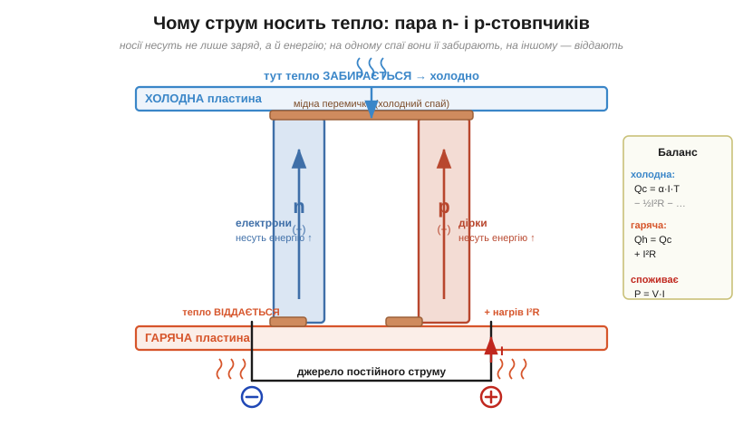
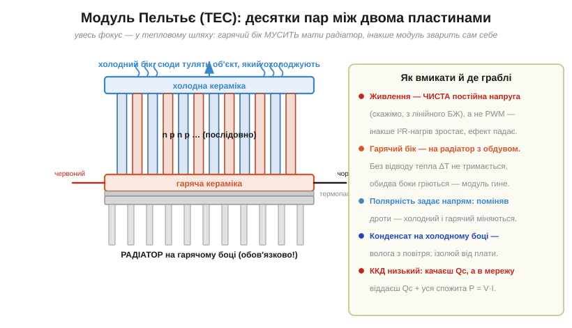

# 🔌 Елемент Пельтьє: качати тепло струмом

> Тепло саме по собі тече лише з гарячого в холодне — трьома [природними шляхами](root:embedded/heat-transfer): кондукція, конвекція, випромінювання. Усі вони ведуть в один бік, згори вниз по температурі. А чи можна качати тепло **проти** цього схилу, з холодного в гаряче, просто пропустивши струм? Можна — і саме це робить **елемент Пельтьє**.

### Що це за клас пристрою

**Елемент Пельтьє** (*Peltier element*), він же **термоелектричний охолоджувач** (*thermoelectric cooler*, **TEC**) — це твердотільний «тепловий насос»: подаєш постійний струм — один його бік холоне, другий гріється. Жодних рухомих частин, рідин чи газів — лише струм носіїв заряду в напівпровіднику. У цьому й уся його особливість: звичайний холодильник качає тепло киплячою й конденсованою рідиною в замкненому контурі, а тут «робочим тілом» служать самі електрони й дірки, і немає чого вилити, заклинити чи розгерметизувати.

Ефект відкрив французький годинникар і фізик-аматор **Жан-Шарль Пельтьє** (*Jean-Charles Peltier*, 1834) як дзеркальне доповнення до термоелектрики **Томаса Зеебека** (*Thomas Seebeck*, 1821). Зеебек побачив пряму дію: різниця температур на стику двох різних провідників народжує напругу. Пельтьє побачив зворотну: пропусти крізь той самий стик струм — і стик почне або холонути, або грітися, залежно від напрямку струму. Що ці два ефекти — одна й та сама монета з двох боків, а не два різні явища, формально довів пізніше **Вільям Томсон** (лорд Кельвін), додавши до картини третій, дрібніший термоелектричний доданок. Елемент Пельтьє цінний тим, що зшиває докупи [теплові шляхи](root:embedded/heat-transfer), [нагрів I²R](book:physics/joule-heating) і [тепловий опір радіатора](book:physics/thermal-resistance): усі троє тут діють одночасно й тягнуть у різні боки, і вся інженерія модуля — це баланс між ними.

> 🔧 **Навіщо це.** В embedded-розробці Пельтьє з'являється там, де треба тримати щось холодніше за повітря довкола без вентилятора-холодильника: стабілізувати температуру лазерного діода чи кварцу-еталона, осушувати дзеркало давача, охолоджувати матрицю камери, щоб прибрати тепловий шум. Усюди, де важить **точність і компактність**, а не велика потужність холоду.

### Чому струм носить тепло (блок-схема)

Звідки ж береться той насос? Носії заряду несуть не лише заряд, а й **енергію**. Електрон у напівпровіднику має не тільки кінетичну енергію руху, а й певний «енергетичний рівень», на якому він сидить відносно решітки атомів. І ось ключове: цей рівень **різний** у різних матеріалах. Коли носій переходить з матеріалу, де його робоча енергія нижча, в матеріал, де вона вища, він мусить десь ту різницю взяти — і забирає її у решітки, тобто у теплових коливань атомів. Решітка від цього **холоне**. На зворотному переході носій ту саму різницю віддає назад у решітку — і там вона **гріється**. Тепло не зникло і не народилося: струм просто переніс його з одного спаю на інший, як конвеєр.

Наскільки сильно матеріал «підіймає» енергію носія на одиницю температури, описує **коефіцієнт Зеебека** (*Seebeck coefficient*, **α**, вимірюється у В/К або частіше мкВ/К). Це і є та фізична величина, що стоїть за всім ефектом, тож варто розуміти її предметно. α показує, скільки вольтів термоелектрорушійної сили дає матеріал на кожен градус різниці температур — а за дзеркальністю Пельтьє та сама α каже, скільки енергії на одиницю заряду носій переносить через спай. У чистих металів α крихітна, одиниці мкВ/К, бо там море електронів і середня енергія, яку несе кожен, майже не залежить від температури. А в спеціально легованому напівпровіднику — телуриді вісмуту Bi₂Te₃, з якого роблять майже всі TEC, — α сягає 200 мкВ/К і більше, бо носіїв там обмаль і кожен несе помітну «порцію» енергії, яка добре чіпляється за температуру. Саме тому Пельтьє роблять не з міді, а з напівпровідника: великий α — це сильний насос.

Знак α теж не випадковий. У матеріалі **n-типу** носії — електрони (від'ємні), у **p-типу** — дірки (додатні), і знак α у них протилежний. Тому, щоб обидві гілки качали тепло в **той самий** бік, їх з'єднують у пару: струм тече крізь n- і p-стовпчик у протилежних напрямках відносно решітки, але енергію обидва несуть до однієї пластини. Десятки таких пар ставлять електрично **послідовно** (щоб струм пройшов крізь усі), а теплово **паралельно** (щоб усі качали в один і той самий бік) — між двома керамічними пластинами, які водночас ізолюють струм і проводять тепло.


*Чому струм носить тепло. Носії в n- і p-гілках рухаються так, що енергію вони несуть до однієї пластини: там тепло **забирається** (холодний спай), на протилежній — **віддається** (гарячий спай). Перекачане тепло Qc ≈ α·I·T; додатково гілки гріються власним I²R — половина цього нагріву псує холодний бік. Тому з мережі модуль бере P = V·I, а на гарячий бік скидає Qh = Qc + I²R.*

### Звідки береться Qc ≈ α·I·T

Формула перекачаного тепла **Qc ≈ α·I·T** виглядає загадково, але збирається з тих самих трьох літер — α, I, T, — тож виведемо її, а не приймемо на віру. Питання просте: скільки ват тепла спай забирає з холодного боку за секунду?

Почнемо з означення коефіцієнта Зеебека. За дзеркальністю Зеебек↔Пельтьє кожен кулон заряду, проходячи через спай, переносить порцію енергії, що дорівнює **α·T** джоулів — це так званий **коефіцієнт Пельтьє** Π = α·T (співвідношення Кельвіна). Чому саме α·T, а не просто α? Бо α — це енергія на одиницю заряду **на градус**, а реальна енергія, яку несе носій, пропорційна абсолютній температурі решітки T (у кельвінах): що гарячіша решітка, то «вищий» рівень, з якого носій падає, і то більшу порцію він тягне. Звідси:

```
енергія на 1 кулон через спай = Π = α · T        [Дж/Кл = В]
```

Тепер лишається помножити цю порцію на те, скільки кулонів за секунду проходить, — а це й є струм I (бо I = кулони/секунду за означенням):

```
Qc = (α · T) · I = α · I · T                       [Дж/с = Вт]
```

Ось і вся формула: **порція енергії на заряд (α·T) × потік заряду (I)**. Лінійність по I тут принципова: саме вона зіткнеться з квадратичним нагрівом і дасть усі «граблі» модуля. Знак «≈», а не «=», стоїть тому, що це лише **корисна** частина балансу: реальний холодний спай водночас псують ще два процеси, які формула вище не врахувала.

Перший — **теплопровідність** самих стовпчиків ([кондукція](root:embedded/heat-transfer)). Гарячий і холодний боки з'єднані тілом напівпровідника, і тепло просто **тече назад** по ньому з гарячого в холодне, зменшуючи чистий виграш: чим більший ΔT ми створили, тим сильніше цей зворотний потік протидіє насосу. Другий — [**нагрів I²R**](book:physics/joule-heating): струм у гілках виділяє джоулеве тепло, і — це тонкий момент — приблизно **половина** його дістається холодному боку, погіршуючи охолодження. Повний баланс холодного спаю:

```
Qc(чисте) = α · I · T  −  ½ · I² · R  −  K · ΔT
            └ насос ┘    └ власний ┘   └ витік ┘
                          нагрів       теплом назад
```

де K — теплопровідність стовпчиків, R — їхній електричний опір. Звідси видно головну драму модуля: насос росте **лінійно** з струмом (α·I·T), а паразитний нагрів — **квадратично** (½·I²·R). На малому струмі виграє насос, на великому квадрат неминуче переганяє лінію — і десь посередині є оптимум.

> 🔧 **Навіщо це.** Ці три доданки — готова модель для прошивки терморегулятора. Якщо ESP32 керує струмом TEC, щоб тримати задану температуру, то він фактично рухається по цій кривій: збільшує I, поки росте α·I·T, але стежить, щоб не зайти в зону, де ½·I²·R усе з'їдає. Розуміючи формулу, ви не «крутите ШІМ навмання», а знаєте, де лежить корисний робочий діапазон.

### Числовий приклад: скільки качає типовий модуль

**Умова.** Маємо ходовий модуль класу TEC1-12706: Imax ≈ 6 А, Vmax ≈ 15 В, Qmax ≈ 53 Вт, ΔTmax ≈ 67 °C, складений приблизно з N = 127 пар. Робочу точку беремо помірну: струм I = 3 А, гарячий бік тримаємо на радіаторі при Th = 27 °C = 300 K. Оцінимо, скільки тепла такий модуль перекачує з холодного боку, поки ΔT малий, і чого це коштує по живленню.

Спершу прикинемо ефективний коефіцієнт Зеебека всього стовпа. Для пари Bi₂Te₃ (n+p) α_пари ≈ 2 × 200 мкВ/К = 400 мкВ/К; 127 пар послідовно дають:

```
α = N · α_пари = 127 · 400e-6 = 0.0508 В/К
```

Тепер корисний насос за чистого α·I·T (поки ΔT ще нульовий, витік K·ΔT не заважає):

```
Qc(насос) = α · I · T
          = 0.0508 · 3 · 300
          = 45.7 Вт
```

Тепер плата за це — власний нагрів. Опір стовпа оцінимо з паспорта: при Imax напруга Vmax майже вся падає на омічному опорі плюс на зустрічній термо-ЕРС, але для грубої оцінки візьмемо R ≈ Vmax/Imax ≈ 15/6 ≈ 2.5 Ω. Тоді на нашому струмі:

```
I²R = 3² · 2.5 = 9 · 2.5 = 22.5 Вт   (повний джоулів нагрів стовпа)
½·I²R = 11.25 Вт                      (стільки псує холодний бік)
```

Чисте охолодження холодного боку (ΔT ще малий, витік нехтуємо):

```
Qc ≈ 45.7 − 11.25 ≈ 34.5 Вт
```

А скільки модуль бере з мережі? Напруга на ньому — це падіння на опорі **плюс** зустрічна термо-ЕРС α·ΔT; при малому ΔT друга частина мала, тож:

```
V ≈ I·R + α·ΔT ≈ 3·2.5 + (мало) ≈ 7.5 В
P = V·I ≈ 7.5 · 3 ≈ 22.5 Вт
```

**Висновок.** Щоб забрати ~34 Вт із холодного боку, модуль спожив ~22 Вт з мережі й **увесь цей струм у вигляді тепла** виштовхнув на гарячий бік разом із перекачаним: Qh = Qc + P ≈ 34.5 + 22.5 ≈ 57 Вт. Тобто на радіатор лягає більше, ніж ми відібрали з холодного боку, — ось чому радіатор тут не аксесуар, а обов'язкова частина схеми. І ще: коефіцієнт корисної дії (COP = Qc/P ≈ 34.5/22.5 ≈ 1.5) виглядає непогано лише тому, що ΔT малий; щойно холодний бік піде вниз, член K·ΔT і зустрічна ЕРС з'їдять і насос, і COP.

### Типова «розпіновка» й параметри

Зовні вся ця фізика прихована: з модуля виходять **лише два дроти** — це найпростіша «розпіновка», яка буває. Конвенція стала: **червоний — плюс, чорний — мінус**, і при «правильній» полярності холодним стає бік із **маркуванням**. Паспортні числа модуля (з його даташита):

```
Imax  — максимальний струм          (типово 3…6 А для дрібних)
Vmax  — напруга при Imax            (типово ~3…16 В)
Qmax  — максимум перекачаного тепла  (Вт, за ΔT = 0)
ΔTmax — максимум перепаду            (~65…70 °C, за Q = 0)
```

Чому Qmax даний саме за ΔT = 0, а ΔTmax — за Q = 0, тепер зрозуміло з балансу вище. Qmax — це найбільший насос α·I·T, поки витік K·ΔT ще не включився (боки однакові). А ΔTmax — це інша крайність: модуль уперся в стіну, де насос рівно зрівноважився зворотним витоком тепла і власним нагрівом, чистий Qc впав до нуля, тож більше «холоду назовні» вже не віддаси, тільки тримаєш перепад. Звідси й хитрість: Qmax і ΔTmax — це **дві крайні точки** однієї кривої, а не одночасні. Хочеш великий ΔT — майже не перекачуєш тепла; качаєш багато тепла — ΔT малий. Реальна робоча точка завжди десь усередині цієї дуги.

### Підключення й «перший байт»

Знаючи ці межи, модуль уже можна вмикати. «Перший байт» тут — не команда по шині, а **правильно поданий струм і відведене тепло**:

1. Притисни модуль **гарячим** боком до радіатора через термопасту ([тепловий шлях](book:physics/thermal-resistance)), холодним — до об'єкта, який охолоджуєш. Без термопасти між модулем і радіатором лежить мікроскопічний прошарок повітря — а повітря [теплоізолятор](root:embedded/heat-transfer), тож увесь Qh застрягне на гарячому боці.
2. Подай **чисту постійну** напругу від лабораторного джерела, почни з малого струму (скажімо, 1 А) і дай радіатору обдув. Малий струм спершу — бо на ньому насос α·I·T ще переважає нагрів ½·I²·R, і ти бачиш чистий ефект, не ризикуючи зварити модуль.
3. За хвилину холодний бік помітно охолоне, гарячий — нагріється. Поміняв полярність — боки **міняються місцями**, бо напрямок струму задає, в який бік носії несуть енергію.


*Модуль Пельтьє в розрізі: масив n/p-пар між холодною й гарячою керамікою, гарячий бік — на радіаторі з обдувом. Поруч — правила вмикання й типові граблі.*

> 🔧 **Навіщо це.** Той самий принцип діє в готовому виробі: якщо TEC стоїть у приладі, який ви проєктуєте, плата керування мусить мати на гарячому боці і радіатор, і давач температури. ESP32 читає давач і скидає струм, щойно гарячий бік перегрівається, — інакше теплова лавина вб'є модуль раніше, ніж спрацює будь-який софтовий захист «по температурі холодного боку».

### Типові граблі

- **Забути радіатор.** Без відводу тепла з гарячого боку весь скинутий туди Qh = Qc + I²R нікуди не дінеться: гарячий бік перегріється, а оскільки насос качає тепло **проти** перепаду, зростання Th автоматично тягне вгору й Tc через зворотний витік K·ΔT. Перепад зникає, **обидва** боки нагріваються — і модуль вмить деградує (паяні спаї й Bi₂Te₃ не люблять високих температур). Радіатор на гарячому боці — **обов'язковий**, а не за вибором.
- **Живити через PWM.** Спокусливо керувати потужністю широтно-імпульсно, та модуль на це реагує погано, і причина — рівно та квадратичність балансу. Пікові імпульси струму роздувають [втрати I²R](book:physics/joule-heating) (бо вони ∝ струму **в квадраті**), тоді як корисне перекачування α·I·T ∝ струму лише **лінійно**. Той самий середній струм, поданий ривками замість рівного потоку, дає той самий насос, але більший нагрів — чистий програш. Потрібна **рівна** постійна напруга (або повільний фільтрований ШІМ із великою індуктивністю, що згладжує піки).
- **Гнатися за Imax.** На великому струмі власний нагрів ½·I²·R (квадрат) переганяє перекачування α·I·T (лінію) — і чистий Qc починає **падати**, холодний бік грітися назад. Найхолодніше виходить не на максимумі, а десь біля 0.6…0.7 від Imax — рівно там, де похідна балансу α·I·T − ½·I²·R по струму ще додатна.
- **Конденсат.** Холодний бік опускається нижче точки роси — на ньому й на сусідніх доріжках осідає **волога** з повітря (це та сама конденсація, що й роса на холодній пляшці влітку). Її ізолюють (піна, герметик), інакше — корозія й замикання на платі, причому замикання часто там, де його найменше чекаєш, бо вода збирається на найхолоднішій точці.
- **Низький ККД.** TEC — не дармовий холод: щоб забрати Qc вату тепла, у мережу він віддає Qc **плюс усю** спожиту P = V·I (у нашій оцінці на радіатор лягло ~57 Вт). Для масивного охолодження це марнотратно; сила Пельтьє — в **компактному, точному, безшумному** холоді там, де компресор не влізе.

### Варіації класу

Саме під такий точний холод і випускають цілий ряд модулів. Дрібні одноступеневі (~40×40 мм) дають ΔT до ~65…70 °C; цей стельовий перепад обмежений фізикою — далі зворотний витік K·ΔT з'їдає весь насос. Щоб його пробити, роблять **багатоступеневі** модулі (каскад «пірамідкою»): кожен наступний ступінь качає тепло з холодного боку попереднього, тож гарячий бік нижнього вже трохи охолоджений, і сумарний ΔT складається. За таку схему платять різко падаючим Qc й COP, тому каскади йдуть лише в лабораторні задачі, де треба −100 °C і нижче, а не велика потужність.

Той самий фізичний ефект, увімкнений «навпаки» (підводиш тепло замість струму), працює як **термоелектричний генератор** (*TEG*) за ефектом Зеебека — джерело напруги з різниці температур: тут уже ΔT народжує α·ΔT вольтів, і струм тече сам. А той самий спай як давач, де вимірюють цю α·ΔT крихітним струмом, — це вже **термопара**, якою міряють температуру. Усі троє — Пельтьє-охолоджувач, TEG-генератор і термопара-давач — це одне явище, описане однією α, тільки прочитане з різних боків: керуєш струмом і дивишся на тепло, керуєш теплом і дивишся на струм, або просто читаєш напругу.
