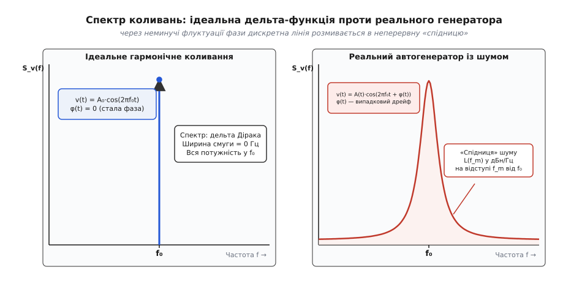
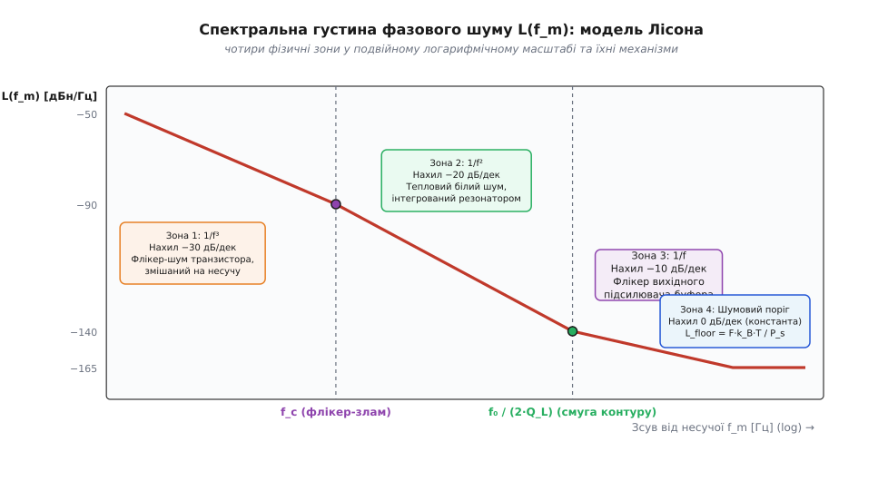
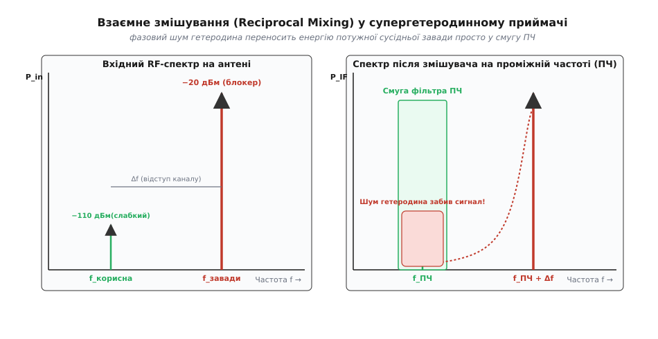
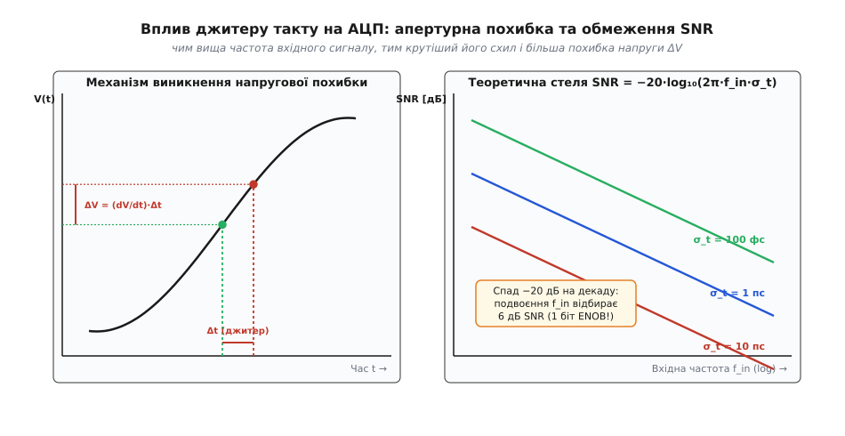

# Фазовий шум генераторів

<preknowlist>
- [Кварцовий резонатор](book:electronics/quartz-resonator) — еквівалентна RLC-схема, послідовний і паралельний резонанс, власна добротність Q.
- [Добротність коливального контуру](book:electronics/inductor-q-factor) — відношення накопиченої реактивної енергії до втрат за період коливань.
- [Тепловий шум резистора](book:electronics/resistor-noise) — спектральна густина потужності шуму Джонсона-Найквіста k_B·T.
- [Флікерний шум](book:physics/flicker-noise) — низькочастотний надлишковий шум 1/f у напівпровідникових структурах.
- [Децибели в електроніці](book:electronics/decibels) — логарифмічні масштаби відношень потужностей і напруг.
</preknowlist>

Підключіть високочастотний генератор на 100 МГц до сучасного аналізатора спектра й подивіться на форму вихідного сигналу. На папері ідеальне гармонічне коливання описується чистою математичною синусоїдою, чий спектр є нескінченно тонкими імпульсом нульової ширини — [дельта-функцією Дірака](book:math/dirac-delta). На екрані приладу ви побачите зовсім іншу картину: навколо центрального піка розгортається широкий, неперервний шлейф сторонньої шумової потужності — так звана «спідниця» шуму, яка спадає в обидва боки на сотні кілогерців і мегагерців.

Цей шумовий шлейф виникає не через дефекти вимірювального кабелю чи недосконалість екрана приладу. Він відображає фундаментальну фізичну властивість будь-якого реального автогенератора: електричні коливання в ньому створюються рухом реальних носіїв заряду в умовах ненульової температури. Внутрішній тепловий шум омічних втрат коливального контуру та дробовий і флікерний шум транзисторів неперервно збурюють фазу й амплітуду коливань, розмиваючи ідеальну лінію в неперервний спектральний розподіл, який називають **фазовим шумом** (англ. *phase noise*).

## Природа фазового шуму: чому амплітуда стабільна, а фаза блукає

Будь-який високочастотний автогенератор являє собою автономну нелінійну динамічну систему, в якій активний підсилювальний елемент (транзистор) компенсує омічні втрати енергії в коливальному контурі. Запишемо вихідну напругу генератора з урахуванням випадкових флуктуацій (лат. *fluctuatio* — коливання):

```
v(t) = [ A₀ + ε(t) ] · cos(2π·f₀·t + φ(t))
```

де `A₀` — номінальна амплітуда коливань, `f₀` — номінальна частота несучої, `ε(t)` — випадкові флуктуації амплітуди (амплітудний шум), а `φ(t)` — випадковий дрейф повної фази сигналу (фазовий шум).

Між амплітудним шумом `ε(t)` та фазовим шумом `φ(t)` існує глибока фізична асиметрія, зумовлена природою автоколивань:

1. **Амплітуда коливань жорстко стабілізується нелінійністю (граничним циклом):**
   Коли амплітуда коливань випадково зростає під дією теплового шуму, підсилювальний каскад заходить у глибше нелінійне насичення. Його середній за період коефіцієнт підсилення падає нижче одиниці, енергія втрат у контурі перевищує внесену енергію, і амплітуда швидко повертається до стабільної рівноважної точки. Якщо амплітуда випадково падає, підсилення зростає, відновлюючи баланс. Таким чином, амплітудний шум `ε(t)` має потужну повертальну силу й швидко релаксує до нуля.
2. **Фаза коливань не має повертальної сили (порушення часової симетрії):**
   Автогенератор не має зовнішнього опорного такту: момент початку коливань є абсолютно довільним. Система є інваріантною щодо часового зсуву. Якщо випадковий шумовий імпульс струму або напруги зсуває миттєву фазу `φ(t)` на невеликий кут `Δφ`, у схемі немає жодного фізичного механізму, який «пам'ятав» би попередню фазу й повертав би коливання назад. Нова зсунута фаза стає новою точкою відліку для всіх наступних коливань.


*Ліворуч — спектр ідеального генератора: вся потужність зосереджена в нескінченно вузькій лінії f₀. Праворуч — спектр реального автогенератора: випадковий дрейф фази розмиває несучу в неперервний шумовий шлейф.*

У результаті фазові збурення не згасають, а накопичуються крок за кроком, утворюючи процес [випадкового блукання](book:math/random-walk) (інтегрування шуму в часі). Неперервне блукання фази призводить до того, що автокореляційна функція коливань повільно згасає, а дискретна дельта-лінія у спектрі розширюється в неперервний спектральний пік зі спадними схилами.

## Спектральна густина фазового шуму однієї бічної смуги L(f_m)

Для кількісного опису фазового шуму використовують спектральну густину потужності випадкових фазових флуктуацій.

Повна спектральна густина фазових коливань `S_φ(f_m)` вимірюється в одиницях `рад²/Гц` на відстані відступу `f_m` (англ. *offset frequency*) від центральної несучої частоти `f₀`. Вона показує, яка дисперсія фази припадає на одиничну смугу частот шириною 1 Гц на заданій відстані від центру.

У радіотехніці та промислових стандартах IEEE загальноприйнятою є інша міра — **спектральна густина фазового шуму однієї бічної смуги** (англ. *Single Sideband Phase Noise*, SSB), яка позначається символом `L(f_m)` (читається як «скрипт-ел від еф-ем»).

Величина `L(f_m)` визначається як відношення потужності фазового шуму `P_noise`, що потрапляє в смугу шириною 1 Гц на відступі `f_m` від несучої, до повної потужності сигналу несучої `P_carrier`:

```
L(f_m) = 10 · log₁₀[ P_noise(f₀ + f_m, 1 Гц) / P_carrier ]   [дБн/Гц]
```

Одиниця вимірювання `дБн/Гц` (англ. *dBc/Hz*, де *c* означає *carrier* — несуча) читається буквально: «децибели відносно потужності несучої в смузі один герц». Наприклад, значення `L(10 кГц) = −130 дБн/Гц` означає, що на відстані 10 кГц від несучої потужність фазового шуму в смузі шириною 1 Гц є на 130 дБ меншою (у `10¹³` разів меншою) за повну потужність основного коливання генератора.

За умови малості фазових флуктуацій (наближення вузькосмугової фазової модуляції, коли середньоквадратичне відхилення фази `σ_φ << 1 рад`), спектральна густина `L(f_m)` строго пов'язана з повною спектральною густиною фази `S_φ(f_m)` простим співвідношенням:

```
L(f_m) = 10 · log₁₀[ S_φ(f_m) / 2 ]
```

Дільник 2 відображає той факт, що `L(f_m)` описує лише одну бічну смугу (наприклад, верхню `f₀ + f_m`), тоді як повна фазова дисперсія `S_φ` порівну розподілена між верхньою та нижньою бічними смугами спектра.

> 🔧 **Навіщо це.** Запис у `дБн/Гц` дозволяє миттєво перераховувати рівень шуму під будь-яку смугу пропускання приймального тракту. Якщо смуга каналу зв'язку становить `BW = 25 кГц`, а фазовий шум на цій відстані дорівнює `−120 дБн/Гц`, то сумарна завада від фазового шуму в каналі складе `−120 + 10·log₁₀(25000) = −120 + 44 = −76 дБн` відносно потужності несучої.

## Емпірично-фізична модель Лісона

Зв'язок між параметрами коливального контуру, струмовим режимом транзистора та спектральною формою кривої `L(f_m)` у 1966 році встановив американський інженер Девід Лісон (англ. *David B. Leeson*). Історія народження цієї теорії та її значення для радіолокації детально описані в [історичній вставці про модель Лісона](book:electronics/phase-noise/hist-leeson-1966.md).

Лісон представив автогенератор як підсилювач, охоплений колом позитивного зворотного зв'язку через селективний коливальний контур із навантаженою добротністю `Q_L`. Коливальний контур має власну смугу пропускання по рівню −3 дБ, яка дорівнює `2·Δf_3dB = f₀ / Q_L`. Відповідно, півширина смуги контуру становить:

```
f_half = f₀ / (2·Q_L)
```

Повний математичний вивід передавальної функції фазових збурень через петльове підсилення Баркгаузена наведено в [математичному виведенні моделі Лісона](book:electronics/phase-noise/math-leeson-derivation.md). Підсумковий результат описується класичним **рівнянням Лісона**:

```
L(f_m) = 10 · log₁₀[ ( (F · k_B · T) / (2 · P_s) ) · ( 1 + (f₀ / (2·Q_L · f_m))² ) · ( 1 + f_c / f_m ) ]
```

де:
- `k_B = 1.380649×10⁻²³ Дж/К` — стала Больцмана;
- `T` — абсолютна температура у Кельвінах (типово 290 К або 300 К);
- `F` — коефіцієнт шуму активного підсилювального елемента у режимі великого сигналу;
- `P_s` — потужність коливального сигналу на вході підсилювача (потужність у контурі);
- `f₀` — номінальна частота генерації (несуча частота);
- `Q_L` — навантажена добротність коливальної системи з урахуванням опорів підключених кіл;
- `f_m` — частота відступу від несучої;
- `f_c` — кутова частота флікер-зламу (англ. *flicker corner frequency*) активного напівпровідникового приладу.

Рівняння Лісона об'єднує в єдину аналітичну конструкцію тепловий шум `k_B·T`, добротність резонатора `Q_L`, потужність коливань `P_s` та низькочастотний напівпровідниковий флікер-шум `f_c`.

## Анатомія спектра фазового шуму: чотири фізичні ділянки

Якщо побудувати графік рівняння Лісона `L(f_m)` у подвійному логарифмічному масштабі (де по осі абсцис відкладено `log₁₀(f_m)`, а по осі ординат — значення в `дБн/Гц`), крива фазового шуму розпадається на чотири характерні прямолінійні ділянки. Кожна ділянка має свій специфічний нахил і формується окремим фізичним механізмом шуму.


*Чотири фізичні зони спектра фазового шуму за моделлю Лісона: стрімка флікер-зона 1/f³ (-30 дБ/дек), зона інтегрування білого шуму 1/f² (-20 дБ/дек), флікер-шум вихідного буфера 1/f (-10 дБ/дек) та плаский тепловий шумовий поріг.*

Розглянемо фізичну природу кожної з чотирьох ділянок за зростанням частоти відступу `f_m`:

### 1. Ділянка 1/f_m³ (Флікер-фазовий шум, нахил −30 дБ/декаду)

Ця зона спостерігається на найближчих відступах від несучої (типово від одиниць герців до одиниць або десятків кілогерців), коли одночасно виконуються дві умови: відступ менший за частоту флікер-зламу транзистора (`f_m < f_c`) і менший за півширину смуги контуру (`f_m < f₀ / (2·Q_L)`).

На цих наднизьких частотах домінує низькочастотний надлишковий [флікер-шум](book:physics/flicker-noise) транзистора, зумовлений випадковими захопленнями й вивільненнями носіїв заряду на дефектах кристалічної ґратки напівпровідника (густина струмового шуму пропорційна `1/f`).

Сам по собі низькочастотний шум не може потрапити на частоту несучої `f₀`. Проте в автогенераторі діє механізм **параметричної нелінійної ап-конверсії**:
- Низькочастотні флуктуації струму зміщують миттєву робочу точку транзистора;
- Зміна напруги на переходах модулює нелінійну бар'єрну ємність колекторного або стокового p-n переходу (варакторний ефект);
- Зміна ємності змінює миттєву резонансну частоту коливального контуру, здійснюючи паразитна частотну модуляцію (ЧМ) несучої з показником `1/f_m`;
- Коливальний контур генератора інтегрує ці частотні флуктуації, вносячи додатковий множник `1/f_m²`.

Добуток флікерного спектра `1/f_m` та передавальної функції контуру `1/f_m²` дає результуючу залежність `1/f_m³`. На логарифмічній шкалі це відповідає стрімкому спаду **−30 дБ на декаду частоти** (або −9 дБ на октаву).

### 2. Ділянка 1/f_m² (Білий частотний шум / Фазове блукання, нахил −20 дБ/декаду)

Коли частота відступу перевищує флікер-злам транзистора (`f_m > f_c`), спектральна густина струмового шуму напівпровідника стає білою (сталою, незалежною від частоти). Проте частота відступу все ще залишається всередині смуги пропускання резонатора (`f_m < f₀ / (2·Q_L)`).

У цій області білий тепловий шум втрат контуру `k_B·T` та тепловий шум каналу транзистора неперервно циркулюють у замкненому колі автоколивань. Оскільки резонатор діє як фазовий інтегратор, вихідний спектр фазових флуктуацій спадає пропорційно `1/f_m²`. На логарифмічній шкалі це дає класичний нахил **−20 дБ на декаду** (або −6 дБ на октаву).

У часовій області ця ділянка відповідає чистому броунівському блуканню фази (англ. *random walk of phase*), а на кривій [девіації Аллана](book:electronics/allan-deviation) вона відображається як білий частотний шум зі спадом `τ^(-1/2)`.

### 3. Ділянка 1/f_m¹ (Флікер-шум вихідного буфера, нахил −10 дБ/декаду)

Ця ділянка проявляється на частотах відступу, що перевищують смугу резонатора (`f_m > f₀ / (2·Q_L)`), якщо вихідний буферний підсилювач або дільник частоти має власний помітний рівень низькочастотного флікер-шуму.

Поза смугою контуру резонатор більше не інтегрує шум (петльове підсилення шуму падає до одиниці). Тому флікер-шум вихідного каскаду потрапляє на вихід напряму без інтегрування, створюючи залежність `1/f_m` зі спадом **−10 дБ на декаду** (або −3 дБ на октаву).

### 4. Ділянка f_m⁰ (Плаский шумовий поріг, нахил 0 дБ/декаду)

На великих відступах від несучої (`f_m >> f₀ / (2·Q_L)` та `f_m >> f_c`) усі внутрішні частотно-залежні механізми генератора повністю згасають. На виході залишається некорельований білий тепловий шум вихідних кіл, буферних підсилювачів та узгоджувальних резисторів.

Рівень цього шумового порогу (англ. *Noise Floor*) є абсолютно пласким і визначається формулою:

```
L_floor = 10 · log₁₀[ (F · k_B · T) / (2 · P_s) ]   [дБн/Гц]
```

Для типового генератора з потужністю сигналу `P_s = +10 дБм` (10 мВт) та коефіцієнтом шуму вихідного буфера `F = 3 дБ` (коефіцієнт 2) при кімнатній температурі (`k_B·T = −174 дБм/Гц`) шумовий поріг складе:

```
L_floor = −174 дБм/Гц + 3 дБ − 10 дБм − 3 дБ (для SSB) = −184 дБн/Гц
```

## Роль навантаженої добротності Q_L у придушенні шуму

Рівняння Лісона демонструє, що найпотужнішим інструментом зниження фазового шуму є збільшення **навантаженої добротності `Q_L`** коливальної системи.

Зверніть увагу на знаменник у внутрішньосмуговому члені рівняння Лісона:

```
|H_φ(f_m)|² = ( f₀ / (2 · Q_L · f_m) )²
```

Потужність фазового шуму на найважливіших ділянках `1/f³` та `1/f²` є обернено пропорційною **квадрату добротності** `Q_L²`. Це означає:
- Якщо збільшити добротність контуру `Q_L` удвічі, фазовий шум усередині смуги зменшиться на **6 дБ** (у 4 рази за потужністю);
- Якщо збільшити `Q_L` у 10 разів, фазовий шум усередині смуги впаде на **20 дБ** (у 100 разів за потужністю);
- Якщо збільшити `Q_L` у 100 разів, фазовий шум впаде на **40 дБ** (у 10 000 разів за потужністю).

При цьому важливо розрізняти **власну (ненавантажену) добротність `Q₀`** резонатора та його **навантажену добротність `Q_L`**. Власна добротність визначається виключно фізичними втратами всередині самого резонатора (опором дроту котушки, втратами в діелектрику конденсатора або внутрішнім тертям кварцової пластини). Навантажена добротність враховує омічні втрати, що вносяться вхідним і вихідним опорами підключеного транзистора та навантаження:

```
Q_L = Q₀ / (1 + β_in + β_out)
```

де `β_in` та `β_out` — коефіцієнти зв'язку резонатора з активним каскадом і навантаженням.

Якщо транзистор підключено до контуру безпосередньо (сильний зв'язок), низький вихідний опір транзистора шунтує контур, знижуючи добротність із високого власного значення `Q₀ = 200` до низького навантаженого значення `Q_L = 20`. У результаті фазовий шум генератора деградує на `20·log₁₀(200/20) = 20 дБ`.

Тому в прецизійних схемах резонатор підключають через ємнісні подільники (схема [генератора Колпітца](book:electronics/colpitts-oscillator)) або слабкі індуктивні відводи, підтримуючи навантажену добротність на рівні `Q_L ≈ ½ · Q₀`.

Порівняння типових технологій резонаторів та їхнього досяжного фазового шуму:

| Тип резонатора | Навантажена добротність Q_L | Фазовий шум L(10 кГц) на 100 МГц | Галузь застосування |
| :--- | :--- | :--- | :--- |
| **Друкований LC-контур (PCB)** | 20 – 60 | −95...−105 дБн/Гц | Недорогі бездротові мікроконтролери, ISM-діапазон |
| **Дискретна високоякісна котушка** | 80 – 180 | −110...−120 дБн/Гц | ВЧ-генератори загального призначення, рації |
| **Коаксіальний резонатор (CRO)** | 500 – 1 500 | −125...−135 дБн/Гц | Стільникові базові станції, трансивери СВЧ |
| **Поверхнево-акустичні хвилі (ПАХ / SAW)** | 1 000 – 4 000 | −130...−140 дБн/Гц | Фіксовані тактові генератори гігагерцових шин |
| **Діелектричний резонатор (ДРО / DRO)** | 3 000 – 12 000 | −135...−145 дБн/Гц | Радари міліметрового діапазону (24–77 ГГц), супутники |
| **Кварцовий резонатор (XTAL, зріз AT/SC)** | 20 000 – 500 000 | −155...−170 дБн/Гц | Опорні джерела OCXO/TCXO, вимірювальні прилади |

## Фазовий шум у кільцях фазового автопідлаштування частоти (ФАПЧ)

У сучасних гетеродинах і синтезаторах частоти високочастотний керований напругою генератор (VCO) стабілізується за допомогою системи фазового автопідлаштування частоти (англ. *Phase-Locked Loop*, PLL).

Форма результуючого спектра фазового шуму синтезатора частоти кардинально відрізняється від вільного генератора через наявність петлі зворотного зв'язку з власною смугою пропускання `f_loop`:

1. **Всередині смуги петлі (`f_m < f_loop`):**
   Кільце ФАПЧ безперервно відстежує похибку фази між опорним кварцовим генератором (TCXO/OCXO) та вихідним VCO. Петля придушує власний низькочастотний фазовий шум VCO зі швидкістю 20–40 дБ на декаду. Проте шум опорного генератора та шум частотно-фазового детектора переносяться на вихід із множенням на коефіцієнт ділення `N`:
   ```
   L_out(f_m) = L_ref(f_m) + 20 · log₁₀(N)   [дБн/Гц]
   ```
   Якщо опорний генератор 10 МГц помножується до 1 ГГц (`N = 100`), його фазовий шум усередині смуги зростає на `20·log₁₀(100) = +40 дБ`.
2. **Поза смугою петлі (`f_m > f_loop`):**
   Фільтр петлі відсікає сигнал похибки, і зворотний зв'язок більше не діє на VCO. Результуючий фазовий шум на великих відступах повністю визначається власним фазовим шумом вільного керованого генератора:
   ```
   L_out(f_m) ≈ L_VCO(f_m)
   ```

Оптимальний вибір смуги пропускання петлі `f_loop,opt` полягає в пошуку точки точного перетину двох шумових кривих: піднятого шуму опори `L_ref + 20·log₁₀(N)` та власного шуму `L_VCO`. Будь-яке розширення або звуження смуги відносно цієї оптимальної точки призводить до зростання сумарного інтегрального джитеру.

## Зв'язок фазового шуму у частотній області та джитеру в часі

У цифровій електроніці, обчислювальних системах та високошвидкісних лініях передачі даних замість спектральної густини `L(f_m)` використовують поняття **часового джитеру** (англ. *timing jitter* — тремтіння, сіпання фронтів тактового сигналу).

Фазовий шум у частотній області та часовий джитер у часовій області — це **два погляди на одне й те саме фізичне явище**:
- **Фазовий шум `L(f_m)`** показує, як енергія випадкових фазових коливань розмазана по окремих спектральних частотах модуляції;
- **Часовий джитер `σ_t`** являє собою сумарне середньоквадратичне відхилення моментів перемикання цифрового сигналу від ідеальної часової сітки, виражене в пікосекундах (`1 пс = 10⁻¹² с`) або фемтосекундах (`1 фс = 10⁻¹⁵ с`).

Щоб знайти сумарний інтегральний середньоквадратичний джитер, необхідно проінтегрувати спектральну густину фазового шуму по заданій смузі частот `[f_start, f_stop]`:

```
σ_φ = √( 2 · ∫_{f_start}^{f_stop} 10^(L(f_m) / 10) df_m )   [рад]
```

Перехід від інтегральної фазової похибки `σ_φ` (у радіанах) до часового джитеру `σ_t` (у секундах) здійснюється через період несучої частоти:

```
σ_t = σ_φ / (2π · f₀)   [секунди]
```

Чисельний алгоритм кусково-логарифмічного інтегрування профілю фазового шуму та робочий код на C і C++ наведено у [проєктній вставці про розрахунок джитеру з фазового шуму](book:electronics/phase-noise/proj-phase-noise-to-jitter.md).

З цієї формули видно ключову залежність: **чим вища частота генератора `f₀`, тим менший часовий джитер у секундах відповідає тій самій фазовій похибці в радіанах**. Наприклад, інтегральна фазова похибка `σ_φ = 1 мрад` на частоті 10 МГц відповідає джитеру `15.9 пс`, а на частоті 1 ГГц та сама фазова похибка дає часовий джитер лише `159 фс`.

## Вплив фазового шуму на електронні системи

Фазовий шум не є абстрактним спектральним параметром — він встановлює жорстку фізичну стелю для характеристик радіоприймачів, вимірювальних систем, цифрових перетворювачів та високошвидкісних інтерфейсів.

### 1. Взаємне змішування (Reciprocal Mixing) у радіоприймачах

У супергетеродинних і прямого перетворення радіоприймачах вхідний високочастотний сигнал змішується з коливанням власного допоміжного генератора — [локального гетеродина](book:communications/local-oscillator).

В ідеальному змішувачі корисний радіосигнал перемножується з чистим тоном гетеродина й переноситься на проміжну частоту (ПЧ). Проте коли на антену поруч зі слабким корисним сигналом потрапляє потужний сигнал сусідньої радіостанції (завада-блокер на відстані `Δf`), виникає катастрофічне явище — **взаємне змішування** (англ. *Reciprocal Mixing*).


*Механізм взаємного змішування: потужна сусідня завада перемножується зі «спідницею» фазового шуму гетеродина на відступі Δf і переносить шумову потужність просто у смугу фільтра проміжної частоти, повністю забиваючи слабкий корисний сигнал.*

Потужна завада змішується не з центральною лінією гетеродина, а з його широким шлейфом фазового шуму на відступі `Δf`. У результаті частина енергії потужної завади розмивається й переноситься точно у смугу проміжної частоти корисного сигналу. Рівень шуму в каналі прийому різко зростає, забиваючи слабкий сигнал, навіть якщо смуговий фільтр ПЧ має ідеальну прямокутну форму й повністю відсікає саму частоту завади.

Зростання шумового порогу приймача під дією взаємного змішування розраховується за формулою:

```
P_noise,RM = P_blocker + L(Δf) + 10 · log₁₀(BW_IF)   [дБм]
```

Якщо потужність сусідньої завади становить `P_blocker = −20 дБм`, фазовий шум гетеродина на відступі каналу `L(100 кГц) = −130 дБн/Гц`, а смуга прийому `BW_IF = 15 кГц` (41.8 дБ·Гц), то наведений шум складе:

```
P_noise,RM = −20 дБм + (−130 дБн/Гц) + 41.8 дБ = −108.2 дБм
```

Цей шум перевищить власний тепловий поріг приймача (−120 дБм) на 12 дБ, що призведе до катастрофічної втрати чутливості та зриву зв'язку.

### 2. Деградація SNR та динамічного діапазону в АЦП через апертурний джитер

В аналого-цифрових перетворювачах (АЦП) момент фіксації вхідної напруги вузлом вибірки-зберігання (Track-and-Hold) задається фронтом тактового генератора. Якщо такт має фазовий шум, моменти взяття відліків випадково сіпаються в часі — виникає [апертурний джитер](book:electronics/aperture-jitter).


*Ліворуч — перетворення часового тремтіння Δt на похибку виміряної напруги ΔV на крутому схилі вхідного сигналу. Праворуч — теоретична стеля відношення сигнал/шум АЦП залежно від частоти сигналу для різних значень джитеру.*

При оцифруванні гармонічного сигналу `v(t) = V₀ · sin(2π·f_in·t)` напруга змінюється з максимальною крутістю в моменти переходу через нуль:

```
dv / dt = 2π · f_in · V₀
```

Часове відхилення моменту вибірки на `Δt` породжує миттєву похибку напруги `ΔV = (dv/dt) · Δt`. Середньоквадратична похибка вимірювання напруги прямо пропорційна частоті вхідного сигналу `f_in` та середньоквадратичному часовому джитеру `σ_t`:

```
V_noise,rms = 2π · f_in · V_rms · σ_t
```

Звідси випливає фундаментальна теоретична стеля [відношення сигнал/шум (SNR)](book:electronics/dynamic-range) будь-якого АЦП, обмежена виключно якістю тактового джерела:

```
SNR_max = −20 · log₁₀( 2π · f_in · σ_t )   [дБ]
```

Ця закономірність має вирішальне значення для систем прямого радіочастотного оцифрування (Direct RF Sampling):
- **Спад становить 20 дБ на декаду вхідної частоти:** Кожне подвоєння частоти аналогового сигналу `f_in` погіршує SNR на 6.02 дБ, що еквівалентно втраті одного біта ефективної розрядності (ENOB);
- Якщо 16-бітний АЦП тактується генератором із типовим джитером `σ_t = 1 пс`, то на вхідній частоті 100 МГц його максимальний SNR не перевищить 64 дБ (реальна розрядність впаде до 10.3 біта);
- Щоб зберегти розрядність 14 біт (SNR ≈ 86 дБ) на частоті прямого оцифрування 500 МГц, тактовий генератор повинен мати субпікосекундний джитер менше `16 фемтосекунд` (`16×10⁻¹⁵ с`).

### 3. Джитер у швидкісних послідовних інтерфейсах (SerDes, PCIe, Ethernet)

У швидкісних цифрових шинах передачі даних (PCI Express Gen 4/5/6, 100/400G Ethernet, USB4, SATA) тактова інформація передається безпосередньо всередині потоку даних. На приймальному кінці тактову частоту відновлює спеціальне кільце фазового автопідлаштування частоти (CDR — *Clock and Data Recovery*).

Фазовий шум передавального та приймального генераторів зміщує фронти інформаційних бітів відносно ідеальної тактової сітки. При накладанні мільйонів послідовних бітових інтервалів (UI — *Unit Interval*) на осцилографі формується [діаграма ока](book:electronics/eye-diagram).

Фазовий шум спричиняє горизонтальне розмиття перетинів сигналу, звужуючи часовий розкрив «ока». Якщо часовий розмах джитеру перевищує допустимий інтервал стробування, приймач фіксує помилковий логічний рівень, що веде до лавиноподібного зростання коефіцієнта бітових помилок (BER — *Bit Error Rate*). Для стандартів PCIe Gen 5 (32 Гбіт/с, період біта `T_UI = 31.25 пс`) загальний допустимий джитер тактового джерела в смузі 1.5–30 МГц не повинен перевищувати `150 фс RMS`.

## Методи прецизійного вимірювання фазового шуму

Вимірювання низьких рівнів фазового шуму (нижче −150...−170 дБн/Гц) є надскладним метрологічним завданням. Застосовують три основні схемотехнічні методи вимірювання:

1. **Прямий метод за допомогою аналізатора спектра:**
   Сигнал досліджуваного генератора (DUT) подається безпосередньо на вхід високочастотного аналізатора спектра. Метод обмежений власним фазовим шумом внутрішнього гетеродина самого приладу: якщо генератор чистіший за гетеродин аналізатора, прилад виміряє власний шум, а не шум DUT.
2. **Метод фазового детектора з лінією затримки:**
   Сигнал DUT розділяється на два плечі. Одне плече проходить через довгу коаксіальну або оптоволоконну лінію затримки з часом `τ`, а друге подається напряму на фазовий детектор (подвійно балансний змішувач у квадратурі 90°). Лінія затримки перетворює частотні флуктуації на різницю фаз: `Δφ(t) = 2π·Δf(t)·τ`. Метод не потребує зовнішнього еталонного генератора, проте його чутливість спадає на низьких частотах відступу `f_m`.
3. **Метод двоканальної крос-кореляції (Cross-Correlation):**
   Сигнал досліджуваного генератора розгалужується на два абсолютно ідентичні й незалежні вимірювальні приймальні канали. Кожен канал містить власний незалежний опорний синтезатор частоти. Вихідні оцифровані сигнали з обох каналів перемножуються в цифровому сигнальному процесорі (DSP) і усереднюються за часом.
   
   Оскільки шум досліджуваного генератора присутній в обох каналах синфазно, він зберігається при кореляційному усередненні. Натомість власні шуми двох незалежних опорних генераторів та вхідних змішувачів є взаємно некорельованими, тому при накопиченні `N` усереднень їхня потужність згасає зі швидкістю:
   ```
   ΔL_suppression = 5 · log₁₀(N)   [дБ]
   ```
   Накопичення `10 000` усереднень дозволяє опустити шумовий поріг вимірювальної системи на **20 дБ** нижче власного фазового шуму опорних генераторів аналізатора.

## Схемотехнічні методи мінімізації фазового шуму

Аналіз моделі Лісона дає чіткі інженерні принципи проектування надчистих генераторів:

1. **Максимізація навантаженої добротності `Q_L`:**
   Застосування резонаторів із мінімальними власними втратами (кварцові зрізи SC-cut замість AT-cut, діелектричні резонатори, коаксіальні керамічні лінії). Оптимізація коефіцієнта зв'язку з транзистором через ємнісні дільники для запобігання надмірному шунтуванню контуру.
2. **Максимізація потужності коливань `P_s` без жорсткого насичення:**
   Збільшення амплітуди напруги на контурі знижує відносний рівень теплового шуму. Проте режим активного елемента налаштовують так, щоб уникнути глибокого насичення транзистора, яке різко розширює зону флікер-шуму `f_c` та погіршує коефіцієнт шуму `F`. Для цього застосовують схеми автоматичного регулювання амплітуди (АРУ).
3. **Вибір напівпровідникових приладів із низьким флікер-шумом:**
   Кремній-германієві гетероструктурні біполярні транзистори (SiGe HBT) та біполярні транзистори з p-n переходами мають граничну частоту флікер-зламу `f_c ≈ 100...1000 Гц`, тоді як польові транзистори з ізольованим затвором (MOSFET) та арсенід-галієві транзистори (GaAs HEMT) мають флікер-злам на рівнях `f_c ≈ 100 кГц...10 МГц`. Для малошумних низькочастотних генераторів біполярні прилади мають беззаперечну перевагу.
4. **Емітерна та витокова дегенерація:**
   Увімкнення безіндуктивного резистора зворотного зв'язку в емітер (або витік) активного транзистора лінеаризує його крутість `g_m`, істотно зменшуючи коефіцієнт нелінійної ап-конверсії низькочастотного флікер-шуму в зону `1/f³`.
5. **Малошумне прецизійне живлення:**
   Оскільки бар'єрні ємності транзисторів залежать від напруги живлення, будь-які пульсації та високочастотні завади від імпульсних стабілізаторів модулюють частоту генератора. Схеми опорних генераторів живлять виключно від спеціалізованих лінійних стабілізаторів (LDO) із наднизьким рівнем власного шуму (менше `1...3 мкВ RMS`).
