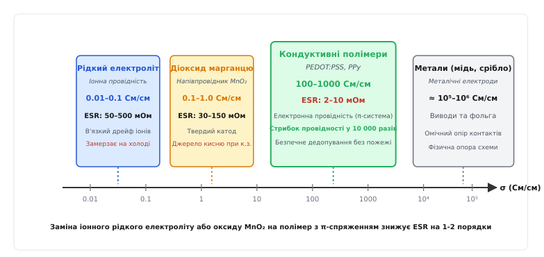
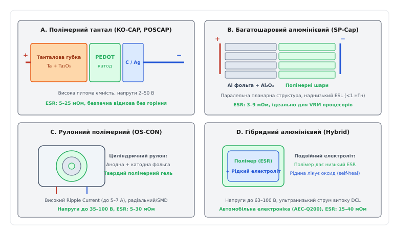
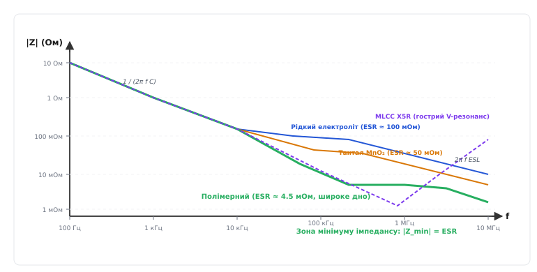
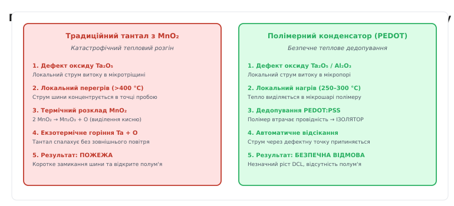

# Полімерний конденсатор

<preknowlist>
- [Конденсатор](book:electronics/capacitor) — будова обкладок, діелектрик, поділ зарядів та формула ємності.
- [Електролітичний конденсатор](book:electronics/electrolytic-cap) — вентильні оксидні діелектрики, анодування металів та роль катодного електроліту.
- [ESR та паразити конденсатора](book:electronics/capacitor-parasitics) — еквівалентний послідовний опір, індуктивність ESL та самонагрів пульсаціями.
- [DC-bias ефект](book:electronics/dc-bias-capacitance) — залежність ємності кераміки від постійної напруги зміщення.
- [Дератинг компонентів](book:electronics/derating) — коефіцієнти запасу за напругою, надійність та температурні межі.
</preknowlist>

У сучасному багатофазному стабілізаторі живлення процесора (VRM) напруга живлення ядра становить 0.95 В, а струм навантаження під час переходу з режиму очікування в повне обчислювальне завантаження стрибає з 5 А до 85 А всього за 10 наносекунд (швидкість наростання `di/dt = 8 А/нс`). Допустимий коридор відхилення напруги на шині обмежений вікном ±30 мВ. Якщо розробник спробує застосувати звичайні алюмінієві електролітичні конденсатори, еквівалентний послідовний опір (ESR) яких становить 50–100 мОм на корпус, навіть масив із десяти запаралелених банок дасть сумарний опір 5–10 мОм. Під час стрибка струму `ΔI = 80 А` омічне просідання напруги `ΔV = ΔI · ESR` складе від 400 до 800 мВ, що миттєво обвалить напругу ядра майже до нуля та викличе скидання процесора. Крім того, високочастотний струм пульсацій у десятки амперів виділятиме в електроліті вати тепла, розпираючи корпус газом і висушуючи рідкий розчинник за лічені тижні, а за температури −40 °C в'язка рідина замерзне, збільшивши опір у десять разів.

Спроба замінити електроліти звичайними танталовими конденсаторами з твердим катодом із діоксиду марганцю `MnO₂` усуває проблему висихання, але створює загрозу пожежі. Діоксид марганцю є твердим хімічним окисником, насиченим киснем; за локального електричного пробою нанометрового діелектрика через високу густину струму метал танталу нагрівається понад 400 °C, запускаючи бурхливу екзотермічну реакцію горіння без доступу зовнішнього повітря. Використання виключно багатошарової кераміки MLCC класу II (X5R/X7R) натрапляє на обвал ємності під дією постійної напруги (DC-bias ефект забирає до 70% номіналу), п'єзоелектричний акустичний писк друкованої плати та схильність тендітної кераміки до тріщин при температурних деформаціях.

Фундаментальне вирішення цієї суперечності полягає в заміні рідкого електроліту або діоксиду марганцю на **кондуктивні полімери** — органічні напівпровідники з делокалізованою системою електронних зв'язків (PEDOT:PSS, поліпірол). Цей крок здійснює стрибок питомої електропровідності катодного матеріалу на 4 порядки — з 0.01–1 См/см до 100–1000 См/см. Конденсатор отримує еквівалентний послідовний опір на рівні 2–10 мОм, колосальну стійкість до пульсуючих струмів, стабільність на морозі, повну відсутність падіння ємності від постійної напруги та безпечний механізм відмови без горіння.

## Фізика кондуктивних полімерів: від спряжених зв'язків до твердого електроліту

Класичні органічні полімери — поліетилен, поліпропілен, полістирол — є бездоганними діелектриками. У їхніх молекулах усі валентні електрони атомів вуглецю міцно замкнені в одинарних локалізованих ковалентних сигма-зв'язках (σ-зв'язках), утворених перекриттям `sp³`-гібридизованих орбіталей. Енергетична заборонена зона таких сполук перевищує 6–8 еВ, тому вільні носії заряду в них відсутні.

Електропровідні полімери мають зовсім іншу електронну конфігурацію: атоми вуглецю перебувають у стані `sp²`-гібридизації, формуючи чергування одинарних і подвійних зв'язків — так звану **спряжену (кон'юговану) π-систему** (лат. *conjugatio* — з'єднання). Негібридизовані `p_z`-орбіталі сусідніх атомів перекриваються боковими пелюстками вздовж усього полімерного ланцюга. Електрони в такій системі перестають належати конкретній парі ядер і делокалізуються, утворюючи суцільну смугу перекриття енергетичних рівнів, аналогічну валентній зоні напівпровідників.

Проте нейтральний спряжений полімер залишається напівпровідником із помірною провідністю (близько `10⁻⁵...10⁻²` См/см). Щоб матеріал набув майже металевої провідності, його піддають **окисному легуванню** (*p-type doping*). Під час синтезу хімічний окисник відриває частину електронів від спряженого π-ланцюга. Вилучення електрона створює локальний надлишковий позитивний заряд, що супроводжується деформацією навколишньої кристалічної решітки полімеру. Цей зв'язаний комплекс заряду та деформації називається **поляроном** (квазічастинкою зі спіном 1/2). При подальшому окисненні полярони об'єднуються в **біполярони** — двічі іонізовані безспінові ділянки ланцюга.

Рух поляронів і біполяронів вздовж спряжених макромолекул під дією електричного поля забезпечує швидкий електронний транспорт заряду з питомою електропровідністю `σ = 100...1000 См/см`. Детальний перебіг наукових пошуків та історію створення перших промислових зразків розкрито у вставці про [відкриття кондуктивних полімерів та історію створення перших конденсаторів](book:electronics/polymer-capacitor/hist-conductive-polymers.md).

```
Спряжений ланцюг полімеру (спрощена схема перенесення заряду):
— C = C — C = C — C = C — C = C —   [нейтральний стан, напівпровідник]
— C — C = C — C⁺— C = C — C = C —   [поляронний стан, вільний рух дірок]
```

### Основні кондуктивні полімери в конденсаторобудуванні

У конденсаторах використовують три основні класи провідних полімерів:

1. **Поліпірол (PPy, *polypyrrole*):**
   Гетероциклічний полімер, отриманий окиснювальною полімеризацією піролу. Має типову провідність 10–100 См/см. Застосовувався в перших комерційних рулонних та танталових полімерних конденсаторах 1990-х років. Його недоліком є чутливість до тривалого впливу високих температур (понад 105 °C), за яких відбувається поступове термоокиснювальне руйнування спряженого ланцюга.

2. **Поліанілін (PANI, *polyaniline*):**
   Полімер на основі анілінових кілець, що легується протонними кислотами (перехід у стан смарагдинової солі). Володіє провідністю до 100 См/см, проте його кислотна природа створює технологічні труднощі через корозійний вплив на тонкі шари оксиду діелектрика.

3. **Полі-3,4-етилендіокситіофен : полістиролсульфонат (PEDOT:PSS):**
   Сучасний золотий стандарт промисловості. Мономер EDOT містить тіофенове кільце, захищене етилендіокси-містком, що виключає побічні розгалуження ланцюга під час полімеризації. Полістиролсульфонат (PSS) виступає стабілізуючим поліаніоном: він одночасно утримує позитивний заряд на ланцюгах PEDOT (легуючий агент) та утворює стійку водну нанодисперсію. PEDOT:PSS витримує нагрівання до 150–200 °C, не окиснюється на повітрі та забезпечує електропровідність до 500–1000 См/см.

### Технологія нанесення: In-situ полімеризація проти колоїдних нанодисперсій

Головним технологічним викликом при виробництві полімерних конденсаторів є доставка провідного полімеру вглиб нанометрових пор спеченої танталової губки або протравленої алюмінієвої фольги, діаметр яких становить від 30 до 150 нм при глибині в десятки мікронів.

Історично першим застосовувався метод **хімічної окисної полімеризації на місці** (*in-situ chemical oxidative polymerization*). Анодний елемент з вирощеним оксидом почергово занурювали в рідкий розчин рідкого мономеру (EDOT або піролу), а потім у розчин солі-окисника (переважно п-толуолсульфонату заліза(III), `Fe(PTS)₃`). Хімічна реакція утворення полімерного ланцюга відбувалася безпосередньо всередині мікропор. Проте цей процес вимагав багаторазового повторення циклів (до 10–20 занурень) і подальшого ретельного відмивання залишків солей заліза, які могли створювати центри локального струму витоку.

Сучасна передова технологія базується на **прямому вакуумному просоченні стабілізованими нанодисперсіями** PEDOT:PSS. Завдяки оптимізації синтезу розмір полімерних глобул у водному колоїдному розчині зменшено до 10–25 нм. Такі частки під дією капілярного тиску та вакуумування вільно затікають у найглибші пори оксиду без участі сторонніх іонів металів. Після випаровування розчинника утворюється суцільна, монолітна, високопровідна плівка з мінімальним дефектним струмом витоку та бездоганною адгезією до діелектрика.

```
Порівняння провідності катодних середовищ (порядок величини σ):
Рідкий електроліт:   0.01 — 0.1 См/см     [повільний дрейф іонів у розчиннику]
Діоксид марганцю:    0.1 — 1.0 См/см      [оксидний напівпровідник MnO₂]
PEDOT:PSS / PPy:     100 — 1000 См/см     [електронна провідність π-системи]
Мідні електроди:     ≈ 6·10⁵ См/см        [металічна провідність]
```


*Логарифмічна шкала електропровідності катодних матеріалів. Перехід від іонного перенесення заряду в рідині до делокалізованої електронної провідності кондуктивних полімерів зменшує питомий опір катода у 10 000 разів, що зумовлює падіння ESR з сотень міліом до одиниць міліом.*

## Конструктивні сімейства полімерних конденсаторів

На відміну від звичайних конденсаторів, де обкладками слугують суто металеві електроди, в електролітичних і полімерних конденсаторах однією з «обкладок» завжди є хімічний провідник (електроліт). Метал анода (алюміній або тантал) піддають глибокому травленню для створення лабіринту мікропор, збільшуючи ефективну площу в десятки й сотні разів. На цій площі електрохімічним анодуванням вирощують нанометровий шар оксиду (`Al₂O₃` або `Ta₂O₅`). Твердий полімер заповнює кожну мікропору, контактуючи з оксидом по всій площі рельєфу та передаючи заряд на металевий катодний струмознімач.

За способом формування анода та компонування шарів виділяють чотири конструктивні родини.


*Чотири архітектурні родини полімерних конденсаторів: A — танталовий полімерний (KO-CAP/POSCAP); B — планарний багатошаровий алюмінієвий (SP-Cap); C — рулонний циліндричний (OS-CON); D — гібридний алюмінієвий з подвійним електролітом.*

### 1. Полімерні танталові конденсатори (KO-CAP, POSCAP)

Анод формується пресуванням і високотемпературним вакуумним спіканням ультрачистого танталового порошку в пористу об'ємну губку (*pellet*). Поверхня зерен окиснюється в діелектрик пентаоксид танталу `Ta₂O₅` з високою діелектричною проникністю (`ε_r ≈ 27`). 

Потім пори губки просочують мономером із каталізатором або нанодисперсією PEDOT:PSS, висушуючи полімер у тверду струмопровідну сітку. Зовні наноситься шар колоїдного графіту (вуглецю), шар срібної контактної пасти, після чого деталь монтується на мідний вивідний фрейм і заливається епоксидним компаундом у стандартний прямокутний SMD-корпус (типорозміри EIA 3528 / Case B, 7343 / Case D, Case V тощо).

Ця родина вирізняється максимальною питомою ємністю на одиницю площі друкованої плати (до 1000–1500 мкФ в одному SMD-корпусі), типовим ESR 4.5–25 мОм і номінальними напругами від 2.0 В до 50 В.

### 2. Полімерні алюмінієві багатошарові планарні конденсатори (SP-Cap)

У планарних конденсаторах (*Stacked Polymer Aluminum*) повністю відсутнє згортання електродів. Конденсатор збирається зі стопки паралельно розташованих плоских протравлених алюмінієвих фольг завтовшки десятки мікронів. На кожній фользі вирощено оксид `Al₂O₃` (`ε_r ≈ 9`) та нанесено шар PEDOT.

Анодні краї всіх фольг зварюються разом лазерним зварюванням, утворюючи масивну паралельну плюсову шину, а катодні полімерні поверхні об'єднуються через струмопровідний шар. Завдяки масивній паралельності струм розтікається широкими плоскими пластинами з протилежними напрямками, що забезпечує взаємну компенсацію магнітних полів і рекордно низьку власну індуктивність `ESL < 0.5...1.0 нГн`. Типовий опір ESR становить усього 3–6 мОм за висоти корпусу від 1.1 мм до 1.9 мм. 

Це безальтернативний вибір для встановлення безпосередньо під сокетами потужних процесорів, де кожен міліметр висоти та наногенрі індуктивності критичні.

### 3. Полімерні алюмінієві рулонні конденсатори (OS-CON)

Анодна та катодна алюмінієві фольги глибокого травлення згортаються в циліндричний рулон разом із пористим сепаратором. Замість рідкого розчину сепаратор просочується твердим полімером PEDOT або поліпіролом. Рулон герметизується в алюмінієвому циліндричному стакані з гумовим ущільнювальним дном (у вивідному радіальному корпусі THT або SMD V-Chip).

Рулонна конструкція забезпечує величезну площу поверхні фольги (номінали ємності до 2700 мкФ, напруги до 35–100 В) та чудову тепловіддачу через металевий стакан. Такі конденсатори витримують середньоквадратичні струми пульсацій до 5–7 А. Їхнім обмеженням є дещо вища індуктивність ESL (2–4 нГн) через довжину закрученої стрічки фольги.

### 4. Гібридні алюмінієві конденсатори (Polymer Hybrid Aluminum)

Гібридна технологія поєднує два типи електролітів в одному рулоні. Травлена анодна фольга спочатку покривається високопровідною плівкою полімеру PEDOT (що забезпечує 95% провідності та низький ESR у межах 15–30 мОм), а залишковий мікропоровий об'єм заповнюється спеціальним функціональним рідким електролітом.

Рідка фаза виконує одну ключову функцію: **безперервне електрохімічне самозаліковування** оксиду алюмінію за високих робочих напруг (від 25 В до 63–100 В). Якщо в оксиді під дією електричного поля виникає дефект, рідкий електроліт миттєво генерує кисень за рахунок мікроструму витоку, локально добудовуючи кристалічну решітку `Al₂O₃`. Завдяки цьому струм витоку гібридних конденсаторів у 5–10 разів нижчий за чисто полімерні, а температурний діапазон сягає +125...+150 °C за стандартом AEC-Q200.

Детальний порівняльний аналіз електричних параметрів, вартості та сфер застосування наведено у вставці про [порівняльний аналіз чотирьох конструктивних родин полімерних конденсаторів](book:electronics/polymer-capacitor/comp-polymer-families.md).

## Частотні характеристики імпедансу |Z(f)|, ESR та відсутність DC-bias ефекту

Поведінка будь-якого конденсатора в колі змінного струму описується послідовною еквівалентною схемою з трьох компонентів: ємності `C`, активного опору `ESR` та паразитної індуктивності `ESL`.

Комплексний опір (імпеданс) виражається формулою:

```
Z(ω) = ESR + j · (ω · ESL − 1 / (ω · C))
```

де `ω = 2π f` — циклічна частота сигналу. Модуль імпедансу визначає повний опір конденсатора протіканню змінного струму:

```
|Z(f)| = √(ESR² + (2π · f · ESL − 1 / (2π · f · C))²)
```


*Частотна залежність модуля імпедансу |Z(f)| для конденсаторів однакової номінальної ємності 100 мкФ. Полімерний конденсатор утворює глибоке, надзвичайно широке плоске дно імпедансу на рівні 3–5 мОм у критичній смузі частот комутації DC-DC перетворювачів (100 кГц – 1 МГц).*

### Анатомія кривої імпедансу: чому полімер перевершує аналоги

Крива імпедансу поділяється на три характерні діапазони:

1. **Ємнісна область (низькі частоти, `f < 50 кГц`):**
   Домінує реактивний опір `1 / (2π f C)`. Графік спадає з постійним нахилом −20 дБ на декаду частоти.
2. **Область власного послідовного резонансу (`50 кГц < f < 1 МГц`):**
   На частоті власного резонансу `f₀ = 1 / (2π · √(C · ESL))` ємнісний та індуктивний реактивні опори повністю взаємно знищуються (`2π f₀ ESL = 1 / (2π f₀ C)`). Імпеданс досягає абсолютного мінімуму:
   ```
   |Z_min| = ESR
   ```
   У звичайних електролітах мінімум імпедансу становить 50–200 мОм. У полімерних танталових і планарних SP-Cap дно опускається до 3–6 мОм і залишається пласким у широкому діапазоні частот від 100 кГц до 1 МГц.
3. **Індуктивна область (високі частоти, `f > 1 МГц`):**
   Домінує реактивний опір паразитної індуктивності `2π f ESL`. Графік піднімається з нахилом +20 дБ/декаду. Завдяки низькому `ESL < 1 нГн` планарні полімери зберігають низький імпеданс аж до кількох мегагерців.

### Стабільність ємності під постійною напругою (відсутність DC-bias)

Найбільшим підводним каменем сучасної кераміки MLCC класу II (діелектрики X5R, X7R, X8R) є **DC-bias ефект**: під дією прикладеної постійної напруги сегнетоелектричні домени титанату барію `BaTiO₃` насичуються, внаслідок чого реальна ємність конденсатора падає на 50–80% від номіналу вже за 50% від номінальної напруги. Конденсатор 0805 на 47 мкФ / 6.3 В на шині живлення 5.0 В реально має ємність лише 10–12 мкФ.

В оксидних діелектриках полімерних конденсаторів (`Al₂O₃` та `Ta₂O₅`) поляризація має чисто іонно-електронну природу без сегнетоелектричних доменів. Тому **полімерні конденсатори мають нульовий DC-bias ефект**: конденсатор номіналом 330 мкФ зберігає повні 330 мкФ і при 0 В, і при 1.2 В, і при 12 В постійної напруги зміщення.

### Роль нуля ESR у фазовому запасі перетворювачів

Опір `ESR` вихідного конденсатора створює в передавальній функції імпульсного DC-DC перетворювача нуль лівої півплощини:

```
f_z_esr = 1 / (2π · C_out · ESR)
```

Цей нуль додає фазовий підйом до +90°, компенсуючи фазове запізнення від подвійного полюса силового LC-фільтра. Полімерний конденсатор з ESR 3–10 мОм розміщує нуль `f_z_esr` акурат у діапазоні 50–150 кГц, забезпечуючи фазовий запас контуру стабілізації 60°–75° без складних кіл компенсації Type-III. Математичний апарат розрахунку PDN, антирезонансних піків та стабільності контуру детально виведено у вставці про [математичний розрахунок вихідного фільтра VRM та цільового імпедансу живлення](book:electronics/polymer-capacitor/math-vrm-filter.md).

## Фізика відмови та безпека: пожежа проти теплового дедопування

Головним недоліком класичних танталових конденсаторів з твердим катодом із діоксиду марганцю `MnO₂` є катастрофічний режим відмови. Оксид танталу `Ta₂O₅` під дією механічного напруження або стрибка напруги зазнає локального мікропробою. Через точку дефекту тече великий струм короткого замикання, що розігріває мікрооб'єм понад 400–500 °C. За цієї температури діоксид марганцю розкладається з виділенням вільного атомарного кисню:

```
2 MnO₂ → Mn₂O₃ + O   [виділення кисню всередині корпусу]
```

Виділений кисень миттєво вступає в бурхливу екзотермічну реакцію окиснення з нагрітим металевим танталом порошкової губки:

```
2 Ta + 5 O → Ta₂O₅ + Q   [виділення колосальної теплової енергії]
```

Конденсатор спалахує відкритим полум'ям, пропалюючи друковану плату й сусідні компоненти. Саме через це тантал із `MnO₂` вимагає обов'язкового зниження робочої напруги на 50% (дератинг 2×).


*Фізичний механізм відмови при локальному дефекті оксиду: ліворуч — екзотермічний спалах танталу з MnO2 через виділення кисню; праворуч — безпечне теплове дедопування полімеру PEDOT:PSS, що перетворює дефектну зону на непровідний ізолятор і відсікає струм.*

У полімерних конденсаторах хімічний механізм відмови докорінно інший. Органічний полімер PEDOT:PSS не містить зв'язаного кисню у формі, схильній до термічного виділення. Коли в точці мікродефекту оксиду починає протікати струм витоку й температура локально піднімається до 250–300 °C, полімер піддається **термічному дедопуванню** (*thermal de-doping*) та деструкції. Полімерний ланцюг втрачає спряження і перетворюється на високоомний органічний **діелектрик-ізолятор**.

Струмопровідний місток навколо дефекту миттєво ізолює сам себе від решти катодного об'єму. Протікання струму припиняється, нагрів зникає, і дефект локалізується без короткого замикання шини та без полум'я. Конденсатор зазнає доброякісної відмови (*benign open-circuit failure*), лише незначно збільшуючи постійний струм витоку або втрачаючи частку відсотка ємності.

### Пульсуючий струм і тепловий баланс (Ripple Current)

Допустимий середньоквадратичний струм пульсацій `I_ripple_rms` обмежений максимально допустимим самонагрівом осердя конденсатора (типово `ΔT ≤ +10...20 °C` над температурою плати). Потужність внутрішніх втрат визначається законом Джоуля — Ленца:

```
P_loss = I_ripple_rms² · ESR
```

Оскільки ESR полімерного конденсатора в 20–50 разів менший за рідкий електроліт, за однакового струму пульсацій полімер виділяє в 20–50 разів менше тепла. Там, де класична алюмінієва банка 100 мкФ перегрівається та закипає вже при струмі 300 мА (RMS), полімерний конденсатор такого самого типорозміру спокійно працює при струмах 3.5–6.0 А (RMS).

### Стійкість до пускових кидків струму (Inrush Surge Current)

Традиційні танталові конденсатори з `MnO₂` мають критичну вразливість перед пусковими кидками струму (Inrush Current), що виникають під час гарячого підключення джерела живлення (*hot-plug*) або ввімкнення потужних ключів. Стрибок струму з великим `di/dt` через низький імпеданс викликає локальний термічний шок у найтонших ділянках оксиду танталу, що часто спричиняє миттєвий пробій і пожежу. Через це правила проектування традиційного танталу суворо вимагали додавання послідовного резистора (від 1 до 3 Ом на вольт прикладеної напруги) або складних схем плавного пуску (*soft-start*).

Полімерні конденсатори мають природну стійкість до колосальних пускових струмів. Завдяки механізму швидкого теплового дедопування навіть у разі локального мікропробою струм миттєво відсікається ізолюючою полімерною плівкою без переростання в лавинний пробій. Полімерні танталові конденсатори (KO-CAP / POSCAP) витримують багаторазові імпульсні струми амплітудою в десятки й сотні амперів без застосування послідовних баласних резисторів.

### Розрахунок ресурсу: закон прискорення старіння для твердих полімерів

На відміну від рідких електролітичних конденсаторів, де ресурс обмежений поступовим випаровуванням рідкого розчинника крізь гумовий ущільнювач і описується правилом подвоєння швидкості реакції на кожні +10 °C (коефіцієнт Арреніуса `2^((T_max - T_op)/10)`), чисто твердотільні полімерні конденсатори не містять летких рідин і не висихають.

Термічна деградація твердого полімеру відбувається за значно повільнішим законом: **зниження робочої температури на кожні 20 °C збільшує термін служби полімерного конденсатора в 10 разів** (декадний температурний коефіцієнт):

```
Life_actual = Life_base · 10^((T_max − T_actual) / 20)
```

де:
- `Life_base` — гарантований термін служби за максимальної робочої температури (типово 2000–3000 годин при `T_max = 105 °C`);
- `T_actual` — реальна температура осердя конденсатора на платі з урахуванням самонагріву.

**Порівняльний приклад ресурсу:**
Якщо конденсатор працює за реальної температури `T_actual = 65 °C` (на 40 °C нижче за паспорту межу 105 °C):

```
1. Рідкий електролітичний конденсатор (правило +10 °C → ×2):
   Прискорення = 2^((105 − 65) / 10) = 2⁴ = 16 разів
   Ресурс = 2000 · 16 = 32 000 годин ≈ 3.7 року безперервної роботи.

2. Полімерний твердотільний конденсатор (правило +20 °C → ×10):
   Прискорення = 10^((105 − 65) / 20) = 10² = 100 разів
   Ресурс = 2000 · 100 = 200 000 годин ≈ 22.8 року безперервної роботи.
```

Це математично доводить, чому полімерні конденсатори є основою необслуговуваного серверного, телекомунікаційного та медичного обладнання з гарантованим терміном безперервної експлуатації понад 15–20 років.

## Вологісні та монтажні обмеження: рівень MSL і температурний удар

Попри видатні електричні параметри, полімерні конденсатори мають специфічні технологічні обмеження, пов'язані з хімічною природою органіки:

1. **Гігроскопічність матриці PSS:**
   Полістиролсульфонат, що слугує допантом у PEDOT:PSS, містить полярні сульфогрупи `-SO₃⁻`, які активно поглинають вологу з навколишнього повітря. У процесі зберігання на відкритому складі полімерний шар насичується мікрокраплями води.
2. **Рівень чутливості до вологи MSL (Moisture Sensitivity Level):**
   Більшість полімерних танталових (KO-CAP) та планарних алюмінієвих (SP-Cap) конденсаторів мають рівень **MSL 3** за стандартом J-STD-020. Це означає, що після відкриття заводського герметичного вакуумного пакета з силікагелем компоненти повинні бути запаяні на плату впродовж **168 годин (7 діб)** за температури ≤ 30 °C та вологості ≤ 60% RH.
3. **Ефект попкорнінгу при безсвинцевому паянні (Peak Reflow 260 °C):**
   Якщо конденсатор, що наситився вологою, потрапляє в піч оплавлення припою, де температура сягає 260 °C, вода всередині полімеру миттєво перетворюється на пару з колосальним внутрішнім тиском. Це спричиняє мікротріщини в оксидному діелектрику або розшарування корпусу (*popcorning*), що проявляється в різкому стрибку постійного струму витоку (DCL) після монтажу. Якщо час MSL перевищено, компоненти вимагають обов'язкового попереднього сушіння в печі (*baking*) при 125 °C протягом 24–48 годин перед монтажем.
4. **Пост-паяльне відновлення струму витоку:**
   Одразу після проходження печі оплавлення струм витоку полімерного конденсатора через механічні температурні напруження може зростати в 5–10 разів проти паспорта. Це нормальне явище: під час перших кількох годин роботи під робочою напругою за кімнатної температури відбувається саморелаксація напружень і струм витоку повертається до норми.

## Правила проектування та дератинг напруги

Правильний вибір запасу за напругою (дератинг, англ. *derating*) є запорукою безвідмовної роботи схеми:

```
Правила дератингу напруги для конденсаторів різних типів:
Традиційний тантал з MnO₂:     50% запасу  (шина 5.0 В → брати 10–16 В номіналу)
Полімерний тантал (напруги ≤10 В): 10–20% запасу (шина 5.0 В → брати 6.3 В номіналу)
Полімерний тантал (напруги >10 В): 20–30% запасу (шина 12.0 В → брати 16–20 В номіналу)
Полімерний алюміній (SP-Cap):     10–20% запасу (шина 1.2 В → брати 2.0–2.5 В номіналу)
Гібридний алюмінієвий:            10–15% запасу (шина 48 В → брати 56–63 В номіналу)
```

Завдяки безпечному механізму дедопування полімерні танталові конденсатори не потребують подвійного запасу за напругою на низьковольтних шинах: на шину 3.3 В або 5.0 В надійно ставлять номінал 6.3 В. Це дає змогу виграти в 2–3 рази за питомою ємністю в тому самому об'ємі.

### Типові сфери застосування

- **VRM та фази живлення CPU / GPU:** Багатошарові SP-Cap та полімерний тантал для придушення динамічних просідань напруги при стрибках навантаження в сотні амперів.
- **Вихідні фільтри POL DC-DC перетворювачів (500 кГц – 2 МГц):** Забезпечення стабільності контуру та низьких пульсацій напруги без втрати місткості від DC-bias.
- **Телекомунікаційні модулі живлення 48 В / 12 В:** Рулонні OS-CON та гібридні конденсатори для фільтрації великих струмів пульсацій комутації.
- **Автомобільна електроніка (ECU, системи ADAS):** Гібридні конденсатори з робочою температурою до +125...+150 °C та стійкістю до вібрацій.

## Розрахунковий приклад: проектування фільтра VRM (Worked example)

**Умова.**
Синхронний понижувальний стабілізатор перетворює напругу `12.0 В` на `V_out = 1.0 В` для живлення кристала мікроконтролера. 
- Максимальний динамічний стрибок струму споживання: `ΔI_step = 30 А`;
- Швидкість наростання струму: `di/dt = 5 А/нс`;
- Допустиме відхилення напруги: `ΔV_max = 35 мВ` (0.035 В);
- Частота комутації ключів: `f_sw = 500 кГц`, частота зрізу контуру регулювання: `f_c = 60 кГц`;
- Струм пульсацій силового дроселя: `I_ripple_rms = 6.0 А`.

Потрібно розрахувати необхідні параметри вихідного конденсатора та перевірити теплове навантаження.

```
1. Цільовий імпеданс шини:
   Z_target = ΔV_max / ΔI_step
            = 0.035 / 30
            = 0.001167 Ом ≈ 1.17 мОм

2. Час реакції активного контуру стабілізатора:
   t_resp = 1 / (2π · f_c)
          = 1 / (2π · 60 000)
          ≈ 2.65·10⁻⁶ с = 2.65 мкс

3. Мінімально необхідна ємність для утримання заряду за час t_resp:
   C_min = (ΔI_step · t_resp) / (2 · (ΔV_max − ΔI_step · ESR_total))
   Приймемо цільовий ESR_total = 0.8 мОм:
   ΔV_esr = 30 · 0.0008 = 0.024 В = 24 мВ
   ΔV_cap_allowed = 35 − 24 = 11 мВ = 0.011 В
   C_min = (30 · 2.65·10⁻⁶) / (2 · 0.011)
         = 7.95·10⁻⁵ / 0.022
         = 3.61·10⁻³ Ф = 3610 мкФ

4. Вибір компонентів:
   Обираємо полімерні алюмінієві планарні конденсатори SP-Cap 470 мкФ / 2.0 В
   (номінал одного конденсатора: C₁ = 470 мкФ, ESR₁ = 4.5 мОм, ESL₁ = 0.8 нГн).
   Кількість конденсаторів у паралель: N = 8 шт.

   Сумарні параметри масиву:
   C_total   = 8 · 470 мкФ = 3760 мкФ   [перевищує C_min = 3610 мкФ]
   ESR_total = 4.5 / 8 = 0.5625 мОм     [менше за 0.8 мОм]
   ESL_total = 0.8 / 8 = 0.10 нГн

5. Перевірка реального просідання напруги:
   ΔV_esr = 30 · 0.0005625 = 0.016875 В ≈ 16.9 мВ
   ΔV_cap = (30 · 2.65·10⁻⁶) / (2 · 3.76·10⁻³)
          = 7.95·10⁻⁵ / 7.52·10⁻³
          = 0.01057 В ≈ 10.6 мВ
   ΔV_total = 16.9 + 10.6 = 27.5 мВ     [менше за ліміт 35 мВ, запас 21%]

6. Теплове розсіювання від пульсуючого струму (P = I²·ESR):
   P_loss = 6.0² · 0.0005625
          = 36 · 0.0005625
          = 0.02025 Вт ≈ 20.3 мВт      [сумарно на 8 конденсаторів]
   На кожен корпус припадає:
   P_one = 20.3 / 8 ≈ 2.53 мВт
   Підвищення температури корпусу:
   ΔT = P_one · R_th_ja
      = 0.00253 · 60
      ≈ 0.15 °C                         [нагрів абсолютно непомітний]
```

**Висновок.**
Вісім паралельних конденсаторів SP-Cap створюють сумарний опір ESR менше 0.6 мОм, утримуючи динамічне просідання напруги в межах 27.5 мВ без найменшого перегріву чи загрози відмови.

## Практичні пастки розробника

- **Плутанина маркування полярності між родинами:**
  Класична та найнебезпечніша пастка монтажу. На **полімерних танталових SMD-конденсаторах (KO-CAP, POSCAP)** смуга на корпусі позначає **ПОЗИТИВНИЙ вивід (анод)**. Натомість на **полімерних алюмінієвих SMD-банках (OS-CON, Hybrid)** та циліндричних корпусах кольорова смуга позначає **НЕГАТИВНИЙ вивід (катод)**. Плутанина при трасуванні плати призводить до монтажу зі зворотною полярністю та миттєвого пробою діелектрика.
- **Антирезонансний дзвін при змішуванні з MLCC:**
  Підключення полімерного конденсатора з індуктивністю `ESL = 1 нГн` паралельно з керамікою MLCC без належного узгодження створює паралельний контур з гострим піком імпедансу на частотах 1–5 МГц. Щоб запобігти цьому, сумарний опір полімеру мусить задовольняти умові демпфування `ESR ≥ √(ESL / C_mlcc)`.
- **Порушення умов зберігання MSL 3:**
  Монтаж полімерних танталових конденсаторів, що пролежали на відкритому повітрі понад 168 годин без повторного просушування, викликає внутрішнє розшарування парою при 260 °C і багаторазовий ріст постійного струму витоку.
- **Використання чисто полімерних алюмінієвих конденсаторів на напругах понад 35 В:**
  На високих напругах чистий полімер без рідкої фази не здатний ефективно заліковувати мікротріщини діелектрика, що веде до деградації струму витоку. Для шин 24 В, 48 В та автомобільної мережі слід застосовувати **гібридні полімерно-електролітичні конденсатори**.
