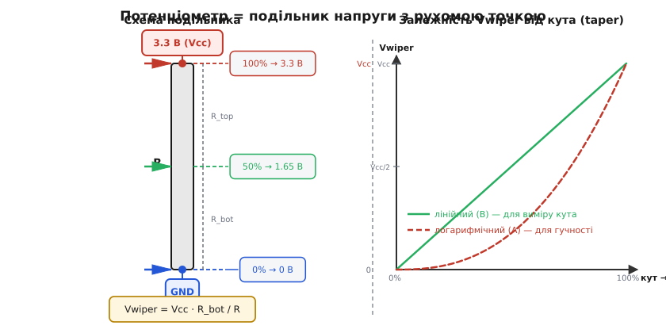
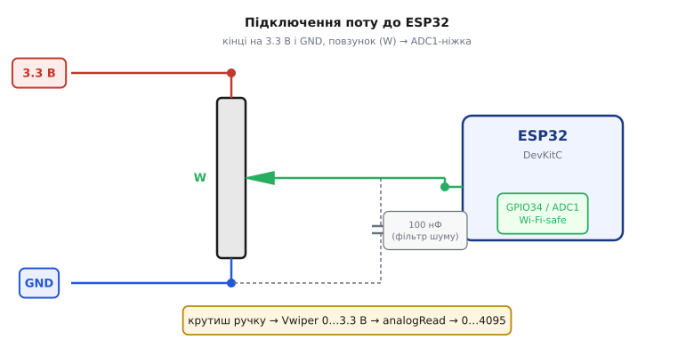

# 📋 Потенціометр: розпіновка, рівні й підключення до АЦП

Щоб мікроконтролер коректно прочитав потенціометр, потрібен чіткий контракт: куди йдуть його **три виводи**, яку напругу подавати на кінці доріжки й на яку ніжку [АЦП](topic:electronics/adc) заводити повзунок. Ось ця довідка — розпіновка, передавальна залежність і рівні, без яких повзунок дасть або сміття, або ризик спалити ніжку.

## Три виводи

**Потенціометр** (*potentiometer*, «pot») — змінний резистор із трьома виводами: два кінці фіксованої доріжки опору (повний опір R, наприклад 10 кОм) і **повзунок** (*wiper*), що ковзає доріжкою й знімає напругу в точці контакту. Електрично це [подільник напруги](topic:electronics/voltage-divider) з рухомою середньою точкою.

| Ніжка | Маркування | Призначення |
|-------|-----------|-------------|
| 1 | кінець, CCW («проти годинникової») | один кінець доріжки |
| 2 | **W** (*wiper*) | повзунок — рухомий відвід, вихід |
| 3 | кінець, CW («за годинниковою») | другий кінець доріжки |

## Передавальна залежність

Повзунок ділить повний опір R на верхнє плече R_top і нижнє R_bot; сума плечей стала:

```
R_top + R_bot = R

Vwiper = Vcc · R_bot / (R_top + R_bot) = Vcc · R_bot / R

поворот 0 %   → R_bot = 0     → Vwiper ≈ 0 В
поворот 50 %  → R_bot = R/2   → Vwiper ≈ Vcc/2 = 1.65 В
поворот 100 % → R_bot = R     → Vwiper ≈ Vcc ≈ 3.3 В
```

Залежність **ратіометрична** (*ratiometric*): Vwiper визначає лише частка R_bot/R, а не абсолютні кілооми — номінал 10 кОм і 50 кОм дають однаковий Vwiper при однаковому куті (бо і подільник, і [опорна напруга](topic:electronics/voltage-reference) АЦП живляться від того самого Vcc). Практичний бік номіналу: дуже малий R — зайвий наскрізний струм і нагрів; дуже великий R — високий вихідний опір джерела, і АЦП поводиться примхливо.


*Потенціометр = подільник напруги з рухомою точкою; лінійний проти логарифмічного taper.*

Закон зміни опору вздовж доріжки — *taper*: для вимірювання кута чи положення беруть **лінійний** (lin, **B**) — частка опору пропорційна куту; **логарифмічний** (log/audio, **A**) призначений для гучності й дає «криву» шкалу, непридатну для вимірювань.

## Підключення до ESP32

- кінець **1** або **3** → **3.3 В**
- протилежний кінець → **GND**
- повзунок **W (2)** → ніжка **ADC1** (GPIO32–39)


*Підключення поту до ESP32: кінці на 3.3 В і GND, повзунок на ADC1-ніжку.*

Схема самодостатня — зовнішніх резисторів не треба (на відміну від [кнопки з підтяжкою](topic:electronics/contact-debounce)). За бажання — конденсатор ~100 нФ між повзунком і GND як найпростіший фільтр шуму доріжки.

## Рівні й обмеження

- **3.3 В, не 5 В.** Верхня межа шкали АЦП ESP32 — близько 3.3 В (це питання [опорної напруги](topic:electronics/voltage-reference)). Подаси 5 В на кінець — при повному повороті Vwiper впреться в стелю (код застрягає на 4095, *clipping*), і є ризик пошкодити ніжку.
- **Тільки ADC1 (GPIO32–39).** При ввімкненому Wi-Fi ніжки ADC2 повертають непередбачувані значення — особливість [АЦП](topic:electronics/adc) ESP32.
- **Переплутані кінці — не поломка.** Поворот праворуч зменшує Vwiper замість збільшувати; лікується переполюсовкою кінців або `4095 - raw` у коді.
