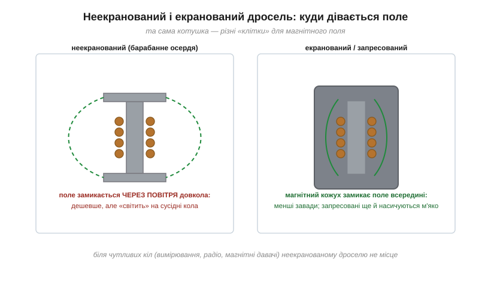
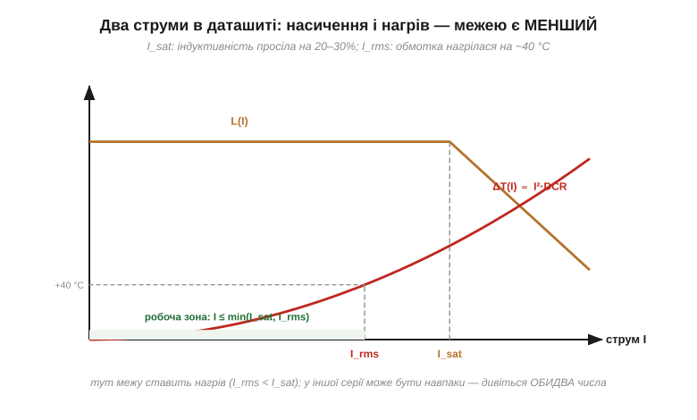

# 🔌 Силові дроселі на платі: екрановані SMD-індуктивності, струм насичення, маркування

### Клас компонента

Квадратна присадкувата «шайба» від 2×2 до 12×12 мм поряд із мікросхемою живлення — це він. Типові номінали — від часток до десятків мікрогенрі, струми — від одиниць до десятків ампер. Його робота — не дрібна фільтрація, а [накопичення енергії](topic:electronics/inductor-energy) (½·L·I²): в імпульсному перетворювачі дросель (нім. *Drossel* — від *drosseln*, придушувати, бо котушка «придушує» різкі зміни струму) щомікросекунди набирає порцію енергії й віддає її навантаженню.

Щоб відчути, навіщо взагалі окремий клас деталей, придивімося, що робить імпульсний перетворювач. Він не «зменшує» напругу опором, як лінійний стабілізатор, що просто палить надлишок у тепло. Він **порціями переливає енергію**: ключ замикається — дросель набирає струм і запасає енергію в магнітному полі; ключ розмикається — дросель віддає цю енергію далі. Саме тому ефективність сягає 90–95%: енергія не горить, а перекладається з місця на місце. Але посередником у цій перекладці є магнітне поле дроселя, і весь ККД тримається на тому, наскільки чесно ця котушка вміє поле запасати й віддавати. Звідси й суворі вимоги одразу за трьома пунктами, що відрізняють [силові типи дроселів](topic:electronics/inductor-types): малий DCR (щоб не гріти намарне те, що мало б іти в навантаження), високий I_sat (щоб не обвалитися на піку струму) і пристойна поведінка поля (щоб запасене поле не фонило на всю плату).

> 🔧 **Навіщо це.** У будь-якому проєкті з акумулятором живлення ESP32 чи моторів робиться через step-down/step-up перетворювач, а в нього завжди є дросель. Помилка у виборі цієї однієї «шайби» — найчастіша причина того, що плата гріється без діла, перетворювач зривається в писк під навантаженням або радіотракт ловить шум нізвідки. Лінійний стабілізатор такого дроселя не має взагалі — тому коли в схемі є котушка живлення, ви точно дивитесь на імпульсний перетворювач.

### Будова: куди дівається поле

Конструктивно силові дроселі діляться на дві великі породи, і ділить їх саме питання «куди замикається магнітне поле». Поле обмотки мусить кудись повертатися — лінії індукції завжди утворюють замкнені петлі. Питання лише в тому, чи проходять ці петлі **крізь магнітний матеріал** (тоді поле зосереджене й кероване), чи **крізь повітря довкола** деталі (тоді воно розповзається по платі).

**Неекранований** (*non-shielded*) — обмотка на феритовому «барабанчику» (drum core): осердя проходить лише всередині котушки, а замикання поля віддане повітрю. Дешево й сердито, бо магнітне поле повертається **через простір довкола** деталі — і дорогою наводить ЕРС на все, що поруч. Це випромінювані завади і наведення від вимірювальних доріжок до магнітних давачів. **Екранований** (*shielded*) ховає обмотку під магнітний кожух (зазвичай феритове «горнятко», pot core), що дає полю замкнутися всередині матеріалу, а не в повітрі. А в найпоширеніших сьогодні **запресованих** (*molded/composite*) обмотка прямо вформована в осердя з пресованого металевого порошку: магнітний матеріал оточує дріт з усіх боків, тож поле зосереджене всередині, насичення м'яке, і деталь до того ж не «свистить».

Чому це не просто «краще-гірше», а інженерний вибір: неекранований за ті самі гроші дає **нижчий DCR і вищий I_sat**, бо все осердя працює на котушку, а матеріал кожуха в запресованих частково «з'їдає» місце під магнітне поле. Тому неекранований не помилка сам по собі — він доречний там, де поряд немає чутливих кіл (наприклад, силовий вузол у кутку плати, далеко від антени й давачів). Помилкою його робить лише сусідство з тим, що боїться поля.


*Та сама котушка, різні «клітки» для поля. Барабанне осердя замикає поле через повітря — дросель фонить на сусідів; кожух чи запресоване порошкове осердя тримає поле всередині. Біля чутливих кіл місце лише екранованим.*

> 🔧 **Навіщо це.** Коли на платі поряд живуть DC-DC перетворювач і щось чутливе — антена Wi-Fi/BLE ESP32, мікрофон, магнітометр, аналоговий давач струму — неекранований дросель тихо псує саме їх, а не себе. Класична пастка: на схемі все ідеально, а компас «гуляє» або радіус зв'язку вдвічі менший за очікуваний. Лікується заміною на екранований чи запресований без жодної зміни схеми.

### Два струми — і межею є менший

Найважливіше, чого не видно з одного запису «10 µH, 3 A»: у силового дроселя в даташиті **два різні граничні струми**, і обмежують вони різне, бо стоять за ними два різні фізичні механізми.

- **I_sat** — [струм насичення](topic:electronics/inductor-types): за нього індуктивність просіла на задані 20–30%, бо магнітне осердя дійшло до межі намагнічування й більше струму в поле «вкласти» не може. Це межа **миттєвого** струму, включно з короткими піками: насичення настає мало не за наносекунди, тому ловить саме верхівку пилкоподібного струму перетворювача.
- **I_rms** — тепловий струм: за нього обмотка нагрілася на типові 40 °C через втрати на активному опорі (P = I²·DCR). Це межа **тривалого** (середньоквадратичного) струму, бо нагрів — процес повільний, із сталою часу в секунди, і реагує на середнє за період, а не на пік.

Ключ до того, чому межі дві й чому вони незалежні: насичення — це властивість **осердя** (геометрія + матеріал), а нагрів — властивість **дроту** (переріз міді + тепловідведення). Можна зробити котушку з товстим осердям і тонким дротом (висока I_sat, низька I_rms) або навпаки. Тому з двох чисел не виводиться третє — їх читають окремо.


*L(I) тримається полицею до I_sat і обвалюється; нагрів росте квадратично і впирається у свій ліміт на I_rms. Робочий струм має бути нижчим за ОБИДВА; котрий із них суворіший — залежить від конструкції конкретної серії.*

Чому межею є саме **менший** із двох, а не якесь усереднення: це два незалежні способи зіпсувати роботу, і досить одного. Перевищили I_sat — індуктивність обвалюється, струм у котушці злітає лавиною (поле більше не стримує його наростання), і пік б'є по ключовому транзисторі та діоді перетворювача — аж до пробою. Перевищили I_rms — нічого миттєво не ламається, але деталь сидить на 80–100 °C, лак обмотки старіє, DCR із температурою росте (мідь має додатний температурний коефіцієнт ≈ +0.39%/°C), нагрів іще трохи підростає, ресурс тане. Перший відмовляє різко й одразу, другий — повільно й непомітно; обороняються від обох, тримаючись нижче меншого.

**Приклад: порівнюємо дві реальні котушки на той самий номінал.** Перетворювач 5 В → 3.3 В живить ESP32 з піками до 0.5 А, середній струм навантаження ≈ 0.5 А, обрано L = 4.7 µH. На столі дві серії з однаковим записом «4.7 µH», але різною конструкцією:

```
Котушка A — запресована композитна (molded):
  L      = 4.7 µH
  DCR    = 30 мОм
  I_sat  = 6.0 A   (просадка 30%, м'яка)
  I_rms  = 4.0 A   (Δт = 40 °C)
  → межа = min(6.0, 4.0) = 4.0 A  (першим упирається нагрів)

Котушка B — ферит із зазором, менший корпус:
  L      = 4.7 µH
  DCR    = 18 мОм
  I_sat  = 3.0 A   (просадка 30%, різка)
  I_rms  = 5.0 A   (Δт = 40 °C)
  → межа = min(3.0, 5.0) = 3.0 A  (першим упирається насичення)
```

Висновок читається відразу: для одного й того ж номіналу межу ставлять **різні** механізми. Тепер прикинемо піковий струм у котушці. У step-down він дорівнює середньому струму плюс половина пульсації ΔI:

```
ΔI = (V_out · (1 − V_out/V_in)) / (L · f_sw)
   = (3.3 · (1 − 3.3/5)) / (4.7e−6 · 500e3)
   = (3.3 · 0.34) / (2.35)
   ≈ 0.48 A

I_peak = I_avg + ΔI/2 = 0.5 + 0.24 ≈ 0.74 A
```

Обидві котушки тут із величезним запасом: пік 0.74 А проти меж 4.0 А і 3.0 А. Але якщо це той самий перетворювач для моторного вузла з пусковим піком 3.5 А, котушка B вже **в насиченні** (3.5 > 3.0 A) — індуктивність обвалиться саме на старті двигуна, коли струм і так найбільший, і перетворювач може зірватися. Котушка A витримає пік (3.5 < 6.0 A), хоча тривало більш як 4.0 А тягти не можна. Той самий «4.7 µH» — два різні рішення для двох сценаріїв; вибір роблять числа, а не номінал.

М'якість насичення — окремий і недооцінений вибір. Запресовані порошкові осердя втрачають індуктивність **поступово**: порошок — це безліч дрібних феритових зерен у немагнітному сполучнику, тобто розподілений мікрозазор, і зерна входять у насичення не разом, а одне за одним. Крива L(I) спадає полого, тож короткий пік над номінальним I_sat лише трохи просаджує індуктивність — котушка пробачає. Ферит без зазору насичується **різко**: суцільний магнітний шлях доходить до межі весь одразу, L падає стрімко, і пік струму понад I_sat може скінчитися аварією перетворювача. Для імпульсного живлення зі стрибучими струмами (мотори, радіопередача, ввімкнення навантаження) м'яке насичення — велика чеснота: воно перетворює різкий обрив на пологу деградацію, що дає схемі шанс пережити перевищення.

### Маркування

Код на корпусі — той самий принцип, що в конденсаторів ([вставка про маркування](topic:electronics/capacitor/comp-marking-sizes.md)), лише базова одиниця — **мікрогенрі**:

```
4R7  = 4.7 мкГн      (R — десяткова кома)
100  = 10 мкГн       (10 × 10⁰ — не «сто»!)
471  = 470 мкГн
R47  = 0.47 мкГн
```

Логіка третьої цифри — показник степеня десятки, тому «100» читається як 10 × 10⁰ = 10, а не «сто»: це найчастіша помилка прочитання, бо око хоче бачити звичне десяткове число. «471» — це 47 × 10¹ = 470. Літера «R» підміняє десяткову кому там, де число менше десяти, бо коми на дрібному корпусі не видно. Полярності дросель не має (магнітне поле симетричне), але крапка на корпусі часто позначає початок обмотки: у щільних платах орієнтація деталі трохи впливає на завади, бо зовнішній виток котушки, ближчий до сусідів, бажано тримати на «холодному» (з'єднаному із землею) кінці. DCR і граничні струми на корпусі не пишуть — місця нема, та й залежать вони від серії, — лише в даташиті, тож «прочитати» силовий дросель без документації неможливо в принципі: код дає номінал, але мовчить про два струми, на яких усе тримається.

### Типові граблі

- **Вибрати за L і забути про I_rms.** Перетворювач працює, але дросель тримає 60–80 °C, бо середній струм перевищив тепловий ліміт; ресурс лаку обмотки і ККД тануть, а на осцилографі все «нормально» — нагрів осцилограф не показує.
- **Неекранований дросель біля чутливого тракту.** Наведення на вимірювальні кола, шум у радіочастині, збожеволілий магнітний давач — бо поле замкнулося через повітря просто в сусіда. На схемі все правильно: схема поля не малює.
- **«Такий самий, тільки менший».** У меншому корпусі той самий номінал означає тонший дріт і менше осердя: вищий DCR (тонша мідь) і нижчий I_sat (менше магнітного матеріалу), тому деталь гріється й насичується там, де стара працювала. Номінал збігся, фізика — ні.
- **Свист.** Погано закріплена обмотка вібрує під дією сил Лоренца, а магнітострикція осердя змінює його розмір у такт намагнічуванню; на пульсівному навантаженні з частотою, що зайшла у звуковий діапазон (або на субгармоніках при змінному навантаженні), це дає чутний писк. Запресовані конструкції цим майже не грішать, бо обмотка залита в моноліт і рухатися їй нікуди.
- **Холодна пайка.** Масивна металева деталь тягне тепло з майданчика, тож звичайного жала не вистачає прогріти вивід до температури паяння: для ручного монтажу потрібні більша потужність жала й терпіння, інакше з'єднання виглядає готовим (припій оплив), але контакт неповний — і «дзвонить через раз».

### Варіації класу

Поодинокий дросель — не єдине виконання класу: та сама фізика дає кілька споріднених виконань, і в кожного є **своя причина існувати**.

**Запресовані композитні** — нинішній мейнстрим саме тому, що поєднують дві чесноти в одній деталі: поле зосереджене всередині (тихо для сусідів) і насичення м'яке (прощає піки). Платять за це трохи вищим DCR, ніж у неекранованих, — компроміс, що майже завжди виправданий на платі з радіо й давачами.

**Ферит із зазором** — дешевше й із нижчим DCR, бо матеріал простіший, але насичення різке. Доречний там, де струм передбачуваний і запас по I_sat великий, а кожна копійка й кожен міліом DCR на рахунку (масове недороге живлення без піків).

**Тороїдальні THT для великих струмів** виникають там, де SMD-«шайба» фізично не витягне десятки ампер: замкнене кільце осердя майже не має зовнішнього поля (магнітний шлях весь усередині тора), тому тороїд майже не фонить навіть без кожуха й тримає велике осердя під товстий дріт. Чому не SMD: на таких струмах потрібен переріз міді й маса осердя, які в плаский корпус під автоматичний монтаж просто не вкладаються, тож деталь роблять виводною й часом ще й намотують уручну.

**Здвоєні (coupled) обмотки на спільному осерді** з'являються не примхою, а вимогою конкретних топологій. Коли перетворювач має кілька виходів або працює за схемою з магнітним зв'язком між каналами (наприклад, SEPIC чи багатоканальний знижувач), дві обмотки на одному осерді **жорстко зв'язують свої струми через спільне поле**: енергія може перетікати між каналами, а пульсації частково гасять одна одну. Одне осердя замість двох — менше місця, менша вартість і вужча сумарна пульсація. Самі ці [топології перетворювачів](root:embedded/topology-map) — окрема велика тема; тут досить знати, що «дві обмотки в одному корпусі» — це не два дроселі поряд, а навмисно зв'язана пара, і міняти її на дві окремі котушки не можна, бо зникне саме той магнітний зв'язок, заради якого схему й вибрали.

А читається будь-який із них тими самими чотирма числами теми (L, DCR, I_sat, I_rms) плюс правилом цієї вставки: **межа — менший із двох струмів**.
