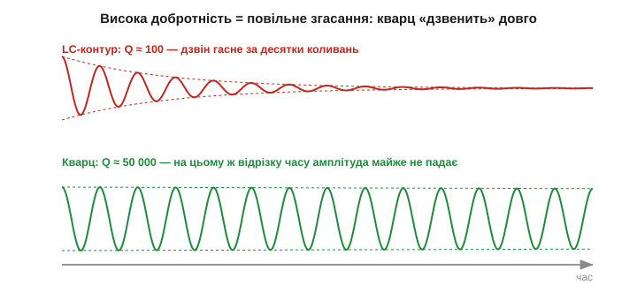
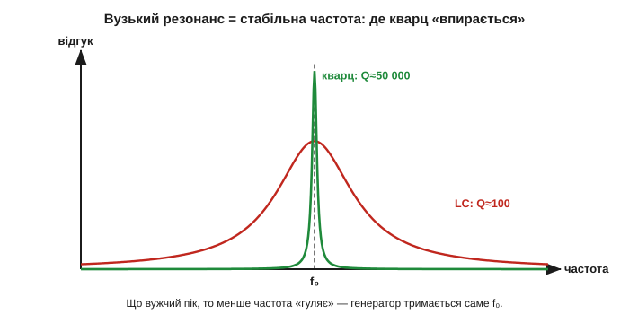

# Кварцовий резонатор: механічний резонанс із добротністю в десятки тисяч

Кварц — електромеханічний резонатор, і головне число, заради якого його взагалі застосовують, — це **добротність** *(quality factor, Q)*. У кварцу вона сягає **десятків і сотень тисяч** — на два-три порядки вища, ніж у найкращого LC-контуру з його скромною [добротністю](book:electronics/quality-factor). Саме ця колосальна Q і робить частоту кварцу такою стабільною. Розберімось, що це означає фізично і звідки береться така перевага.

### Що таке кварцовий резонатор зсередини

Кварцовий резонатор — це тонка **пластина**, вирізана з монокристалічного кварцу під точним кутом до його осей, з нанесеними на дві грані тонкими металевими **електродами** (зазвичай напиленими сріблом чи золотом). Електроди — це виводи, через які схема подає напругу (зворотний ефект збуджує коливання) і знімає відгук (прямий ефект). Пластину закріплюють у кількох точках по краях — там, де при коливанні майже немає руху, щоб кріплення не «глушило» вібрацію й не з'їдало добротність. Усе це герметично запаковують у металевий чи скляний корпус, часто у вакуумі або в інертному газі, щоб повітря не гальмувало вібрацію й не псувало Q.


*Рис. Будова кварцового резонатора. Ліворуч — з монокристала вирізають пластину під точним кутом до осей (популярний AT-зріз ≈ 35°). Праворуч — на грані наносять електроди; під змінною напругою грані пластини ковзають назустріч одна одній (коливання зсуву по товщині). Це і є механічний резонанс, частоту якого задає товщина пластини.*

Спосіб, у який коливається пластина, залежить від зрізу й розмірів. Найпоширеніший для частот від одиниць до десятків мегагерц — **AT-зріз** *(AT-cut)*, де пластина коливається **зсувом по товщині** *(thickness shear)*: верхня й нижня грані ковзають у протилежні боки, як дві карти колоди, що зрушуються одна відносно одної. Частота такого резонансу **обернено пропорційна товщині** пластини: що тонша — то вища частота (приблизно як обернено до товщини). Для типових мегагерцових кварців товщина — частки міліметра; кварц на 100 МГц прямим коливанням зробити вже важко, бо пластина вийшла б тоншою за фольгу й надто крихкою.

Кут зрізу обирають невипадково: при AT-зрізі частота **слабко залежить від температури** в широкому діапазоні — її [температурна крива](book:electronics/frequency-accuracy-ppm) пласка біля кімнатних температур, і це головна причина популярності AT. Інші зрізи мають інші переваги: [годинниковий камертон](book:electronics/watch-crystal-rtc) ріжуть інакше, бо в нього інша частота й форма коливання. Зрізи позначають двобуквено (AT, BT, SC…), і кожен — компроміс між частотним діапазоном, температурною стабільністю й чутливістю до напружень.

Окремо варто згадати **гармоніки (овертони)**. Пластина може коливатися не лише на основній частоті, а й на непарних кратних — 3-й, 5-й, 7-й гармоніці (як струна, що дає не лише основний тон, а й обертони). Це дає шлях до високих частот: замість тоншати пластину до неможливого, кварц на, скажімо, 100 МГц роблять як резонатор на 33 МГц, що працює на 3-й гармоніці. Така деталь так і зветься — «overtone crystal», і генератор для неї треба будувати інакше, бо інакше він заведеться на основній частоті замість гармоніки. Для звичайних мегагерцових тактів цього не треба — там працюють на основній частоті.

### Чому Q кварцу на порядки вищий за LC-контур

Варто згадати, що таке [добротність](book:electronics/quality-factor): Q — це міра того, **наскільки мало енергії втрачає резонатор за період** коливання. Формально Q = 2π · (запасена енергія) / (втрати за період). Високе Q означає малі втрати: розгойданий резонатор довго «дзвенить» після того, як його перестали штовхати, а його резонансний пік вузький і гострий. Низьке Q — швидке згасання й широкий розмитий пік.

Чому ж у LC-контурі Q невисоке? Бо там енергія снує між котушкою (магнітне поле) і конденсатором (електричне поле), і на кожному переливі частину її з'їдають втрати: активний опір дроту котушки гріється струмом, осердя має втрати на перемагнічування, конденсатор трохи протікає. Усі ці втрати неминучі для реальних деталей, тож Q реального LC-контуру рідко перевищує сотню-другу — на радіочастотах добре, якщо вийде 100–200.

У кварцу енергія запасається геть інакше — не в полях, а в **механічних коливаннях** пружного кристала, у пружній деформації самої ґратки. А механічні втрати в монокристалі кварцу мізерні з кількох причин разом: монокристал надзвичайно пружний і однорідний, без меж зерен, де гасла б енергія; внутрішнє тертя (загасання пружних хвиль) у ньому крихітне; кріплення зроблено у вузлах коливання, тож майже не відбирає енергії; а вакуумований корпус прибирає опір повітря. Усе це разом і дає те, чого LC ніколи не досягне: розгойданий кристал втрачає лише крихітну дрібку енергії за коливання, тож Q сягає **10⁴…10⁵**, а в особливих кварцах і мільйона. Це на два-три порядки більше за LC.


*Рис. Згасання дзвону за однаковий проміжок часу. Угорі — LC-контур (Q≈100): коливання гаснуть за десятки періодів. Унизу — кварц (Q≈50 000): на тому самому відрізку амплітуда майже не падає. Що повільніше гасне резонатор, то стабільніше він тримає свою частоту.*

Є гарний спосіб відчути, що таке Q, через **число коливань загасання**: грубо кажучи, після поштовху резонатор зробить близько Q коливань, перш ніж помітно затихне. LC з Q = 100 «дзвенить» сотню періодів — частки мікросекунди, і по всьому. Кварц із Q = 50 000 «дзвенить» десятки тисяч періодів. Тому за однаковий час LC встигає згаснути дощенту, а кварц майже не міняє амплітуди. Глибше зв'язок Q зі стабільністю — у [🧮 Q і стабільність](math-q-stability.md).

**Приклад (як довго «дзвенить» кварц).** Кварц на 8 МГц із Q = 80 000. Скільки приблизно триватиме його вільне згасання?

```
число коливань до згасання ≈ Q = 80 000
період одного коливання = 1/f = 1/8 000 000 = 0.125 мкс
час згасання ≈ 80 000 · 0.125 мкс = 10 000 мкс = 10 мс
```

Десять мілісекунд вільного «дзвону» в кристала завбільшки з зернятко — ціла вічність для електроніки. Цей самий час пояснює і повільний [старт генератора](book:electronics/pierce-oscillator): щоб розгойдати такий добротний резонатор від шуму, теж потрібні мілісекунди. Висока Q — це палиця з двома кінцями: чудова стабільність, але млявий старт.

### Чому втрати вдається зробити такими малими

Варто трохи затриматися на тому, як інженери відвойовують кожну крихту Q, бо це показує, наскільки тонко зроблено кварцовий резонатор. Головний ворог Q — **витік енергії з пластини**, насамперед через точки кріплення: якщо закріпити пластину там, де вона активно рухається, коливання «витечуть» у тримач і згаснуть, як гасне струна, затиснута пальцем. Тому застосовують **захоплення енергії** *(energy trapping)*: електроди роблять трохи меншими за пластину й розташовують по центру, тож коливання зосереджуються в центральній зоні під електродами й майже не доходять до країв, де пластина кріпиться. Краї лишаються майже нерухомі — там і тримають.

Друге джерело втрат — **середовище**: молекули газу довкола пластини відбирають енергію при кожному коливанні. Тому добротні кварці герметизують у вакуумі або в розрідженому інертному газі. Третє — **домішки й дефекти** в кристалі: чим чистіший і досконаліший монокристал, тим менше внутрішнє тертя. Синтетичний кварц, вирощений у автоклаві, для цього навіть кращий за природний — він однорідніший. Складіть усе разом — захоплення енергії, вакуум, чистий монокристал, кріплення у вузлах — і дістанете ту саму Q у десятки тисяч, що недосяжна для жодного LC. За кожним порядком добротності стоїть конкретне інженерне рішення, а не просто «кварц такий від природи».

> 🔧 **Навіщо це.** Високе Q — це не абстрактна чеснота, а прямий шлях до стабільної частоти. Що вужчий резонансний пік, то «жорсткіше» резонатор тримається власної частоти й то менше її здатні зрушити сторонні впливи — паразитні ємності схеми, дрейф інвертора, наведення. Коли ви ставите кварц замість RC-генератора, ви фактично купуєте оцю гостроту піка: генератор просто **не може** коливатися помітно осторонь від f₀, бо поза вузькою смугою кристал не дає достатнього відгуку, щоб підтримати коливання.

### Гострий пік означає стабільну частоту

Зв'язок між Q і стабільністю найкраще видно на резонансній кривій. Високе Q — це вузький, гострий пік відгуку проти частоти. А генератор коливається там, де резонатор дає найбільший відгук, тобто на вершині піка.


*Рис. Гострота резонансу й стабільність частоти. Широкий пік LC-контуру (Q≈100) дозволяє частоті помітно «гуляти» в межах смуги. Вузький пік кварцу (Q≈50 000) майже не лишає свободи — генератор тримається саме f₀. Що вужчий пік, то стабільніша частота.*

Уявіть, що якийсь зовнішній чинник намагається трохи зрушити частоту генератора — наприклад, дрейфнула паразитна ємність схеми чи «поплив» інвертор. У широкого піка (LC) сусідні частоти дають майже такий самий відгук, тож частота легко зміщується слідом за збуренням — система «не опирається». У гострого піка (кварц) досить крихітного відходу від f₀, щоб відгук різко впав, — а генератор завжди тягнеться туди, де відгук найбільший, тож його миттєво повертає назад до f₀. Образно: вузький пік — як глибока вузька яма, з якої кульку не викотити жодним поштовхом; широкий пік — пологе блюдце, де кулька вільно гуляє від найменшого нахилу. Висока Q — це і є та глибока яма.

Зробімо грубу оцінку, щоб відчути масштаб. Ширина резонансної смуги пов'язана з [добротністю](book:electronics/quality-factor) простим співвідношенням: смуга на рівні половини потужності ≈ f₀/Q. Що вища Q, то вужча смуга при тій самій центральній частоті.

**Приклад (смуга й «свобода» частоти: LC проти кварцу).** Порівняймо два резонатори на ту саму f₀ = 10 МГц.

```
LC-контур, Q = 100:
смуга = f₀ / Q = 10 000 000 / 100 = 100 000 Гц = 100 кГц
відносно f₀:     100 000 / 10 000 000 = 0.01 = 1 %  (тобто ±0.5 %)

кварц, Q = 50 000:
смуга = f₀ / Q = 10 000 000 / 50 000 = 200 Гц
відносно f₀:     200 / 10 000 000 = 0.00002 = 20 ppm
```

Двісті герц проти ста тисяч — у **п'ятсот разів** вужче, рівно у стільки разів, у скільки Q кварцу більша. Ось чому кварц тримає частоту з точністю в одиниці-десятки ppm, а LC — лише в частки відсотка: вузька смуга прямо обмежує, наскільки частота взагалі здатна зміститися. Сама фізика гострого механічного резонансу й дарує цю точність — не калібрування, не підбір деталей, а просто колосальна Q пружного кристала.

Тут варто застерегти від частої плутанини. Висока Q сама по собі **не гарантує**, що частота точно дорівнює номіналу, — вона гарантує лише, що частота **стабільна** й важко зрушується. Абсолютне значення (чи це рівно 10.000000 МГц, чи 10.000200 МГц) задається [початковим допуском](book:electronics/frequency-accuracy-ppm) і [навантажувальною ємністю](book:electronics/pierce-oscillator) генератора; Q відповідає за те, щоб обране значення **не плавало**. Це та сама відмінність [абсолютної точності й стабільності](book:electronics/reference-frequency): кварц блискуче дає стабільність, а абсолютну точність ще треба «налаштувати».

### Q як стійкість до фазових збурень

Є й точніший погляд на те, чому висока Q стабілізує частоту, — через **фазу**. У будь-якому [генераторі](book:electronics/pierce-oscillator) частота встановлюється там, де повний фазовий зсув по петлі дорівнює потрібному. Тепер уявімо, що щось у схемі додало невеликий паразитний зсув фази — нагрівся інвертор, дрейфнула ємність. Генератор мусить компенсувати цей зсув, трохи зрушивши частоту, бо фаза резонатора залежить від частоти. І ось ключове: **наскільки** доведеться зрушити частоту, щоб набрати потрібну поправку фази, залежить від того, **наскільки круто** фаза резонатора міняється з частотою біля резонансу. А ця крутість прямо пропорційна Q.

У кварцу з його гігантською Q фаза біля f₀ міняється надзвичайно круто: щоб набрати навіть помітний зсув фази, частоту треба зрушити лише на мізерну дрібку. Тому будь-яке паразитне збурення фази генератор «гасить» крихітним зсувом частоти. У низькодобротного LC фаза пологіша, тож те саме збурення тягне частоту куди сильніше. Образно: кварц — це жорстка фазова пружина, що майже не подається; LC — м'яка, що легко прогинається. Звідси загальне правило стабільності генераторів: **відносний зсув частоти від будь-якого фазового збурення обернено пропорційний Q**. Удвічі більша Q — удвічі стабільніша частота за тих самих збурень. Саме тому в погоні за стабільністю інженери завжди тягнуться до якнайвищої Q — і саме тому кварц з його десятками тисяч недосяжний для LC. Формальніше цей зв'язок розгорнуто у [🧮 Q і стабільність](math-q-stability.md).

Але як описати цей механічний резонатор мовою електричної схеми, щоб рахувати генератори навколо нього? Адже паяємо ми не «механічну Q», а компонент із двома виводами. Виявляється, для зовнішньої схеми кварц поводиться **точнісінько як певне коло з котушки, конденсатора й резистора** — саме ця [еквівалентна RLC-схема](book:electronics/quartz-rlc-model) і дає інженерові формули, щоб порахувати все, що навішано навколо кристала.
