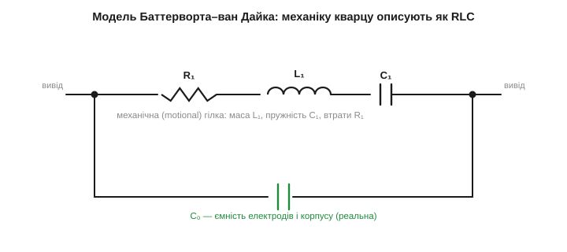
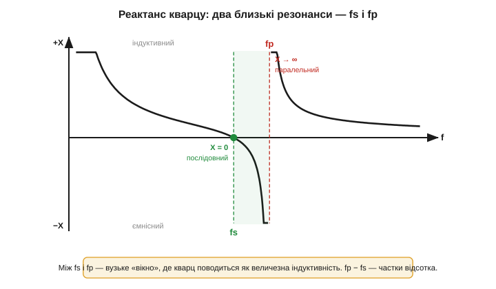

# Еквівалентна RLC-схема кварцу (модель Баттерворта–ван Дайка)

Кварц — механічний резонатор, але вмикають його в електричну схему. Щоб розраховувати генератори, нам потрібна **електрична модель** кристала — таке коло з R, L і C, яке для зовнішньої схеми поводилося б точнісінько, як кварц. Така модель давно є й зветься **схемою Баттерворта–ван Дайка** *(Butterworth–Van Dyke, BVD)*. Вона напрочуд проста — і пояснює одразу два резонанси кварцу й ту дивну «нереальність» його еквівалентних L та C.

### Механіку перекладаємо на R, L, C

Звідки взагалі впевненість, що механічний резонатор можна намалювати електричним колом? З глибокої аналогії між механічними й електричними коливаннями, що проявляється на маятнику й [LC-контурі](book:electronics/lc-resonance). Рівняння коливань однакові за формою, лише з різними «дійовими особами»: маса (інертність, що опирається зміні швидкості) грає роль індуктивності; пружність (що повертає тіло назад) — роль оберненої ємності (1/C); тертя (що з'їдає енергію) — роль опору. Якщо два явища описуються однаковими рівняннями, то й поводяться однаково — тож механічний резонанс **точно** відтворюється відповідним RLC-колом.

Механічний резонатор-кварц має всі три складники: масу рухомої частини пластини, пружність кристалічної ґратки й крихітні втрати на тертя. Перекладемо кожен в електричний еквівалент і дістанемо послідовне RLC-коло:

- **L₁** *(motional inductance)* — еквівалент **маси** колишеться пластини (інертність);
- **C₁** *(motional capacitance)* — еквівалент **пружності** кристала (що менша C₁, то «жорсткіша» пружина);
- **R₁** *(motional resistance, ESR)* — еквівалент механічних **втрат** (загасання).

Цю трійку звуть **механічною** (або *motional*) гілкою — вона описує сам резонанс і нічого більше. Але реальний кварц — це ще й фізична деталь: дві металеві грані-електроди з діелектриком-кварцом між ними. А дві пластини з діелектриком — це ж готовий [конденсатор](book:electronics/capacitor)! Його ємність нікуди не дінеться й існує незалежно від того, коливається кристал чи ні. Тому паралельно до механічної гілки додають **C₀** *(shunt capacitance)* — статичну ємність електродів, виводів і корпусу. На відміну від «механічних» L₁ і C₁, ця C₀ — звичайнісінький фізичний конденсатор, який можна було б навіть зміряти на нерухомому кристалі.


*Рис. Еквівалентна схема кварцу (BVD). Послідовна (motional) гілка R₁–L₁–C₁ описує механічний резонанс: L₁ — маса пластини, C₁ — пружність, R₁ — втрати. Паралельно стоїть C₀ — реальна ємність електродів і корпусу. Усе разом для зовнішньої схеми поводиться точнісінько як кварц.*

### «Нереальні» значення L та C

А тепер — найдивніше. Якщо взяти даташит кварцу й підставити числа, еквівалентні L₁ і C₁ виявляться **фізично немислимими** для звичайних деталей. Типовий кварц на кілька мегагерц має приблизно такі параметри:

```
L₁ ≈ 10 мГн … кілька Гн      (величезна індуктивність!)
C₁ ≈ 0.01 … 0.03 пФ          (мізерна ємність — соті частки пікофарада)
R₁ ≈ десятки … сотні Ом
C₀ ≈ 3 … 7 пФ                (звичайна ємність електродів)
```

Котушка на кілька **генрі** — це важезний моток дроту завбільшки з кулак (для порівняння: дроселі на платах — це мікро- й мілігенрі); конденсатор на **сотих частки пікофарада** взагалі годі виготовити окремо — це менше за паразитну ємність двох сусідніх доріжок плати! Як же кварц завбільшки з рисове зерно «містить» котушку на кулак? А він її не містить. Ці значення не «зроблені» з міді й діелектрика — вони лише **математичний переклад** механічних властивостей у мову електрики: величезна L₁ відбиває колосальну «інертність» (вузькість, повільність) гострого механічного резонансу, а крихітна C₁ — його надзвичайну «пружність» (жорсткість). Іншими словами, щоб електричне коло поводилося так само вибірково, як механічний кварц, йому й знадобилися б такі екзотичні номінали — а кварц дає їх «безкоштовно» самою своєю фізикою. Перевірмо, що ця пара дає правильну частоту:

**Приклад (частота з еквівалентних L₁, C₁).** Кварц із L₁ = 0.5 Гн і C₁ = 0.05 пФ. Послідовна резонансна частота — за [формулою Томсона](book:electronics/lc-resonance):

```
fs = 1 / (2·π·√(L₁·C₁))
L₁·C₁ = 0.5 · 0.05·10⁻¹²  = 2.5·10⁻¹⁴
√(L₁·C₁)                  = 1.58·10⁻⁷
fs = 1 / (2·π·1.58·10⁻⁷)  ≈ 1.0·10⁶ Гц = 1.0 МГц
```

Звичайні числа на виході — мегагерци, як і треба. Дивні L і C — це просто ціна, якою механічний резонанс описується в електричних термінах. Зате тепер видно, звідки береться величезне Q. Добротність послідовного контуру — Q = (1/R₁)·√(L₁/C₁); підставимо порядки величин:

```
Q = (1/R₁)·√(L₁/C₁)
з L₁ = 0.5 Гн, C₁ = 0.05 пФ, R₁ = 30 Ом:
√(L₁/C₁) = √(0.5 / 0.05·10⁻¹²) = √(10¹³) ≈ 3.16·10⁶
Q = 3.16·10⁶ / 30 ≈ 1.05·10⁵
```

Сто тисяч — це і є та [колосальна добротність кварцу](book:electronics/quartz-resonator), тільки тепер воно випало само з еквівалентних номіналів. Велика L₁ при крихітній C₁ дає величезне √(L₁/C₁), а малий R₁ ділить його на майже нічого — звідси й колосальна добротність. Усе сходиться: дивна електрична модель правильно відтворює і частоту, і гостроту резонансу реального кристала.

### Два резонанси: послідовний і паралельний

Тепер головна особливість, заради якої BVD взагалі потрібна, а не просто послідовний RLC. Через ту паралельну C₀ кварц має **не один, а два** близькі резонанси — і це принципово для генераторів, бо різні схеми працюють на різних із них.

Перший — **послідовний резонанс** *(series resonance, fs)*. На цій частоті реактивний опір L₁ і C₁ у механічній гілці взаємно гаситься (як у звичайному послідовному LC), і гілка має мінімальний опір — лише R₁. Кварц поводиться як майже чистий малий опір.

Трохи вище є другий — **паралельний резонанс** *(parallel / anti-resonance, fp)*. Тут механічна гілка вже стала індуктивною (вище fs L₁ переважає над C₁) і вступає в резонанс із паралельною C₀. На цій частоті повний опір кварцу різко зростає до максимуму.


*Рис. Два резонанси кварцу. Реактанс X переходить через нуль на послідовній частоті fs (мінімум опору, кварц = малий резистор) і злітає в нескінченність на паралельній fp (максимум опору). Між fs і fp — вузьке «вікно», де кварц поводиться як величезна керована індуктивність. Відстань fp − fs — лише частки відсотка.*

Між fs і fp лежить вузьке «вікно» (зазвичай **частки відсотка** частоти — для типового кварцу fp перевищує fs лише на 0.1…0.5 %), де кварц виглядає як **дуже велика індуктивність**, що стрімко росте з частотою. Саме в цьому вікні й працюють [генератори типу П'єрса](book:electronics/pierce-oscillator): кристал заміняє в них котушку, тільки незрівнянно стабільнішу за будь-яку мідну. Тому такі генератори звуть «паралельно-резонансними»: вони ведуть кварц десь між fs і fp, де він індуктивний. А «послідовно-резонансні» схеми (рідші, у радіотехніці) ведуть кварц рівно на fs, де він — чистий малий опір.

Звідси і два режими паспортизації кварцу: на корпусі або в даташиті пишуть, на **який резонанс** його відкалібровано — послідовний (вказують просто частоту) чи паралельний (тоді обов'язково вказують [навантажувальну ємність CL](book:electronics/pierce-oscillator), бо без неї паралельна частота невизначена). Поставити «паралельний» кварц у послідовну схему (чи навпаки) — типова помилка, через яку частота виходить на сотні ppm не та.

Мала відстань fp − fs дає інженерові ще й важіль: оскільки в паралельному режимі робоча точка лежить десь усередині вікна, її можна трохи «возити» по ньому, підкручуючи зовнішню ємність, — тобто **підстроювати частоту**. Діапазон підстроювання обмежений якраз шириною вікна fp − fs, тому він невеликий (одиниці-десятки ppm), але цього часто досить.

> 🔧 **Навіщо це.** Модель BVD — це не теорія заради теорії, а інструмент, що пояснює практику. Чому кварц у даташиті має параметр [«навантажувальна ємність CL»](book:electronics/pierce-oscillator)? Бо робоча частота лежить між fs і fp і залежить від того, яку ємність кварц «бачить» зовні. Чому генератор іноді не стартує? Бо R₁ завеликий і петля не набирає підсилення. Чому годинниковий кварц можна злегка підкрутити підбором конденсаторів? Бо ви рухаєте точку в вікні fs…fp. Усе це — прямі наслідки чотирьох елементів BVD.

### Як параметри BVD читаються в даташиті

Чотири елементи моделі — не абстракція: вони прямо виписані в даташиті кожного кварцу, лише іноді під іншими іменами. Корисно навчитися їх упізнавати, бо саме за ними добирають кварц під схему.

**R₁** часто значиться як **ESR** (*equivalent series resistance*) — той самий motional-опір. Його гранична величина (max ESR) — найважливіше для старту генерації: чим він менший, тим легше схемі розгойдати кристал. Виробник мікроконтролера у своєму даташиті теж задає «максимальний ESR кварцу, що гарантовано заведеться» — і два числа треба звірити: ESR обраного кварцу має бути нижчим за межу контролера.

**C₀** — «shunt» чи «static capacitance», звичайно 3…7 пФ; її іноді треба знати, щоб точно порахувати, як CL зсуває частоту.

**C₁** (motional) у даташиті трапляється рідше, але саме вона визначає **pullability** — наскільки сильно частота реагує на зміну CL: що більша C₁ відносно (C₀ + CL), то ширший діапазон підстроювання. Годинникові камертони мають крихітну C₁ — тому й тягнуться лише на одиниці ppm.

Є ще один зведений параметр — **відношення ємностей** r = C₀/C₁ (для кварцу — сотні-тисячі). Він показує, наскільки «слабка» механічна гілка проти статичної ємності, і прямо керує тим, наскільки вузьке вікно fp − fs. Велике r — вузьке вікно — мала pullability, зате й мала чутливість частоти до паразитних ємностей плати. Усе це — різні погляди на ту саму четвірку R₁, L₁, C₁, C₀.

**Приклад (наскільки вузьке вікно fp − fs).** Кварц із C₁ = 0.02 пФ і C₀ = 5 пФ. Відносна відстань паралельної частоти від послідовної приблизно дорівнює C₁/(2·C₀):

```
(fp − fs)/fs ≈ C₁/(2·C₀) = 0.02 / (2·5) = 0.002 = 0.2 %
для fs = 16 МГц:  fp − fs ≈ 0.002 · 16 000 000 = 32 000 Гц = 32 кГц
```

Усього 32 кГц на 16 МГц — оце і є все «поле для маневру» частоти. У цих 0.2 % і живе вся pullability: підстроювати частоту можна тільки в межах цього вузенького вікна, і ні на герц більше.

### Чого модель не показує

Як кожна модель, BVD — спрощення, і корисно знати її межі. По-перше, вона описує **один** резонанс. Та реальна пластина має ще й [гармоніки (овертони)](book:electronics/quartz-resonator), а також паразитні «побічні» моди (*spurious modes*) — небажані способи коливання поряд з основним. Кожному з них відповідала б своя додаткова R-L-C гілка. Зазвичай їх ігнорують, бо генератор працює на основній моді, але інколи погано спроєктована схема «зачіпається» за побічну моду чи за гармоніку й заводиться не на тій частоті — і ось тоді про ці зайві гілки доводиться згадати.

По-друге, елементи BVD насправді **не зовсім сталі**: R₁ трохи росте з навантаженням, C₀ ледь залежить від частоти, а вся четвірка повзе з температурою (звідси й [температурний дрейф частоти](book:electronics/frequency-accuracy-ppm)). Тобто BVD — це «миттєвий знімок» кварцу за фіксованих умов, добрий для розрахунку генератора, але не вічна істина.

І все ж саме ця проста чотириелементна модель — робочий інструмент, яким користуються щодня: вона з потрібною точністю передбачає і частоту, і два резонанси, і поведінку з навантажувальною ємністю, і умови старту. Складніші моделі (з гармоніками й побічними модами) дістають із шухляди лише тоді, коли проста перестає пояснювати дивну поведінку. Це типова інженерна мудрість: бери найпростішу модель, що ще працює, і ускладнюй лише за потреби.

### Що означають елементи фізично

Повернімося наостанок до фізичного сенсу четвірки — він допомагає не плутатися в знаках і залежностях. Велика **L₁** — це «важкість» резонансу: що більша еквівалентна маса (а в кварці вона мала за абсолютним значенням, зате в електричному перекладі дає генрі), то нижча частота й вужчий пік. Мала **C₁** — це «жорсткість» пружини: жорстка пружина — мала ємність — і вона ж робить резонанс гострим. **R₁** — це тертя: єдиний елемент, що з'їдає енергію, і саме він обмежує Q й вимагає від генератора підсилення для старту. **C₀** стоїть осторонь — це не частина резонансу, а просто ємність «конденсатора з електродів», що паразитно шунтує кристал; саме вона породжує другий, паралельний резонанс і трохи «зашумлює» картину біля fp.

Корисний уявний експеримент: що було б, якби C₀ не існувало? Тоді кварц був би чистим послідовним RLC з єдиним резонансом fs — як ідеальний камертон. Паралельного fp не було б зовсім, не було б і «вікна» індуктивності, і паралельні генератори стали б неможливі. Отже, саме небажана на перший погляд ємність електродів і дає кварцу його другий резонанс, на якому працює більшість схем. Прикра паразитна ємність обертається корисною властивістю — гарний приклад того, як у реальному компоненті «дефект» стає функцією.

Ще один наслідок фізичного погляду — чому кварц **не можна замінити звичайним LC**, навіть підібравши L і C на ту саму частоту. Бо щоб відтворити кварцову Q, котушці знадобилися б ті самі генрі при мікроскопічних втратах — а реальна котушка на кілька генрі має сотні ом опору дроту й Q у найкращому разі сотні. Електричними деталями таку добротність просто не зробити; її дає лише механіка кристала. Модель BVD це й показує наочно: номінали, що випадають із кварцу, для дискретних деталей фізично недосяжні.
