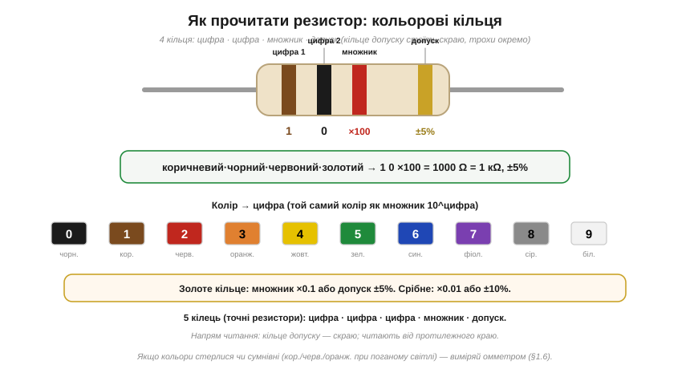

# 🔌 Як прочитати резистор: кольорові кільця й SMD-коди

У [резистора](book:electronics/resistor) номінали стандартизовані рядами E12/E24, але саме число майже ніколи не написане на корпусі цифрами: на виводному воно **зашифроване** кольоровими кільцями, на SMD — стиснутим числовим кодом. Тут — суто практичне вміння **прочитати** цей номінал просто з корпусу, не маючи приладу.

Перш ніж розбирати кільця, варто відповісти на питання, яке майже ніхто не ставить: **а чому взагалі кільця, а не звичайні цифри?** Відповідь — у самій геометрії компонента, і вона пояснює все інше маркування заразом.

Виводний резистор — це циліндрик-«цукерка» діаметром десь 1.5–2.5 мм. Циліндр не має «лицьової» сторони: коли його запаюють у плату чи кидають у коробку, він лягає **випадковою стороною догори**. Якби номінал надрукували цифрами вздовж корпусу, половину часу він дивився б у плату, а решту — був би перевернутий («10k» легко прочитати як «01» догори ногами). Друкований дрібний шрифт ще й **розмазується** на опуклій поверхні. А кільце фарби обходить циліндр **по колу** — його видно з будь-якого ракурсу, поки резистор не закритий сусідами. Колір зчитується миттєво й здалеку, тоді як цифру треба піднести до ока. Тому історично, ще з доцифрового монтажу, обрали саме **кодування кольором, що оперізує корпус**: воно стійке до орієнтації. Цифри повернулися лише на SMD — і то з власними хитрощами, бо там додалася зовсім інша проблема.

> 🔧 **Навіщо це.** У ремонті чи прототипі ви постійно дістаєте резистор «зі смітника» — з коробки безіменної дрібноти. Уміння читати корпус економить не хвилини, а саму можливість працювати: інакше кожен компонент довелося б прозванювати приладом ще до того, як вирішити, чи він взагалі потрібен.

### Кольорові кільця: виводні резистори

На звичному «цукерковому» резисторі з дротяними виводами номінал кодують **кільця фарби** (color bands). Найпоширеніший формат — **чотири кільця**: дві цифри, множник і допуск.


*Чотири кільця читають зліва направо: перше й друге — цифри числа, третє — множник (10 у степені цифри), четверте — допуск. Унизу — таблиця колір→цифра. Приклад: коричневий·чорний·червоний·золотий = 1, 0, ×100, ±5% = 1000 Ω = 1 кΩ ±5%.*

Логіка така:

- **1-ше і 2-ге кільця** — це **дві цифри** числа.
- **3-тє кільце** — **множник**: на скільки нулів помножити (той самий колір, але як степінь десятки). Червоний тут означає не «2», а «×10² = ×100».
- **4-те кільце** — **допуск**: золоте ±5%, срібне ±10%.

Чому саме така схема «дві значущі цифри + множник», а не одне велике число? Бо вона повторює **наукову нотацію**: будь-який номінал записують як «мантиса × степінь десятки». Резистори покривають вісім порядків — від часток ома до десятків мегаом, — і кодувати таке число «цифра за цифрою» означало б десяток кілець. А «дві цифри + множник» вистачає рівно тому, що [ряди E12/E24](book:electronics/resistor) **самі мають лише дві значущі цифри** (4.7; 6.8; 2.2…). Маркування не випадково збігається з рядом номіналів — воно під нього **скроєне**: третє кільце-множник просто пересуває кому, як і степінь десятки в записі 4.7×10³.

Колір→цифра запам'ятовують за таблицею з рисунка: чорний 0, коричневий 1, червоний 2, оранжевий 3, жовтий 4, зелений 5, синій 6, фіолетовий 7, сірий 8, білий 9. Порядок не випадковий — це послідовність від темного до світлого (чорний унизу, білий угорі), тож шкала приблизно лягає на спектр веселки посередині; саме тому її колись було легше тримати в голові, ніж довільну таблицю. **Приклад:** коричневий·чорний·червоний → 1, 0, ×100 = 1000 Ω = **1 кΩ**; а золоте кільце поряд каже «±5%».

**Точні резистори мають п'ять кілець:** три цифри, множник, допуск. Чому додають зайве кільце? Бо дві значущі цифри дають крок ряду E24 (~5%), а точні резистори живуть у [ряді E96](book:electronics/resistor), де номінали різняться вже у третьому знаку (4.70; 4.75; 4.81 кΩ). Двома цифрами «4.75» не закодуєш — потрібна третя, звідси й третє цифрове кільце. Золоте й срібне кільця бувають не лише допуском, а й **множником**: золотий ×0.1, срібний ×0.01 — так кодують частки ома (наприклад, шунти для вимірювання струму).

**З якого боку читати?** Ось де схема кольорів окупається вдруге. Кільце допуску (золоте або срібне) звичайно стоїть **скраю й трохи окремо** — інші чотири тісніші, а воно відсунуте проміжком; читають від протилежного краю. Але навіть якщо орієнтир не очевидний, кодування **саме себе перевіряє**: справжній номінал зобов'язаний лягти на стандартний ряд. Прочитайте з обох боків і відкиньте «несправжній» бік.

**Числовий приклад: розбираємось із сумнівним напрямом.** Резистор зі смітника, кільця: зелений · синій · червоний · золотий. З якого краю золоте — видно нечітко.

```
Читаємо зліва (зел·син·черв):
  зелений = 5, синій = 6, червоний = ×10² 
  → 56 × 100 = 5600 Ω = 5.6 кΩ        ← E24 містить 5.6 ✔ існує

Читаємо справа (черв·син·зел):
  червоний = 2, синій = 6, зелений = ×10⁵ 
  → 26 × 100000 = 2 600 000 Ω = 2.6 МΩ ← E24 не містить 2.6 ✘ немає

Висновок: правильний напрям — зліва. Номінал 5.6 кΩ ±5%.
```

Тобто навіть без видимого орієнтира-проміжку **сам ряд E12/E24 працює ключем**: лише один з двох напрямів дає номінал, який узагалі випускають. Це й є та практична причина, чому інженеру варто пам'ятати кілька рядів напам'ять — вони фільтрують помилки читання.

> 🔧 **Навіщо це.** Перевірка «лягає на ряд / не лягає» рятує не тільки від перевернутого резистора, а й від помилки самого виробника та від підробок: якщо прочитане число взагалі не існує в природі (як «5.3 кΩ»), ви або читаєте неправильно, або тримаєте бракований компонент. Прилад тут лише підтверджує, але напрям підказує саме ряд.

**Граблі.** Кольори **вицвітають** від нагріву й часу, бо пігмент фарби деградує — а червоний, коричневий і оранжевий вигорають у схожий бурий відтінок, через що їх легко сплутати; синій і зелений теж зливаються при кепському освітленні, особливо під жовтим лампочковим світлом, що спотворює колірну температуру. Тому за найменшого сумніву номінал **вимірюють** [омметром](book:electronics/multimeter) — кільця лише підказка, а не вирок.

### SMD-коди: поверхневі резистори

Крихітний **SMD-резистор** (surface-mount device, з монтажем на поверхню) завбільшки з макове зерня лягає на плату плиском, **завжди однією плоскою гранню догори**. Тут проблема орієнтації, що породила кольорові кільця, **зникає сама**: верхня грань видна завжди й однозначно, перевернути неможливо. Тому повертаються цифри — вони компактніші й читаються без таблиці кольорів. Натомість виникає **протилежна** проблема: на грані шириною десяту частку міліметра не вмістиш ані кілець, ані повного числа «4700». Тож номінал друкують **стиснутим числовим кодом** — тією самою ідеєю «значущі цифри + множник», але вже цифрами.


*Чотири типи SMD-кодів. «472» = 47×10² = 4.7 кΩ (3 цифри: дві значущі + множник-нулі). «4701» = 470×10¹ = 4.7 кΩ (4 цифри — точні). «4R7» = 4.7 Ω, «R47» = 0.47 Ω (літера R на місці коми). «000» = перемичка 0 Ω.*

- **3 цифри** — дві значущі плюс **кількість нулів**: «472» = 47 і два нулі = 4700 Ω = **4.7 кΩ**; «100» = 10 Ω; «103» = 10 кΩ. Це той самий формат, що й чотирикольорове кодування, просто кільця замінено цифрами: остання цифра — степінь десятки, а не множник-колір.
- **4 цифри** (точні) — три значущі плюс множник: «4701» = 470 і один нуль = **4.7 кΩ**. Чотиризначний код — прямий аналог п'ятикольорового: третя значуща цифра потрібна тим самим резисторам ряду E96, і з тієї ж причини.
- **Літера R = десяткова кома** для малих опорів: «4R7» = 4.7 Ω, «R47» = 0.47 Ω. Чому буква, а не крапка чи кома? Бо друкована крапка на такій крихті — це одна-дві пилинки тонера: вона забивається, розмазується або зчитується як подряпина. Літера R займає цілу позицію знаку, її **неможливо загубити**, тож вона надійно показує, де стоїть кома.
- **«000» чи «0»** — це **перемичка** 0 Ω: всередині корпусу резистора не резистивний шар, а дротик-замикач. Навіщо «резистор» без опору? Бо на автоматичній лінії його ставить **той самий** автомат тими ж рухами, що й решту резисторів, — ним зручно перекинути доріжку через іншу або лишити на платі місце під опційний номінал, який упаяють лише в деяких версіях виробу.

Є ще дрібний точний формат **EIA-96**: дві цифри — це не саме значення, а **порядковий код** значення в ряді E96 (01 → 100, 02 → 102, …), а літера — множник (наприклад, «01A» = 100×10⁰ = 100 Ω). Навіщо така плутанина замість прямих цифр? Бо для точних резисторів навіть три цифри «100» довші за «01A», а на найдрібніших корпусах кожен знак на вагу золота. Зустрічається рідше; за потреби його розшифровують за таблицею EIA-96.

> 🔧 **Навіщо це.** У реальній ремонтній практиці SMD-код часто доводиться читати **під мікроскопом або лупою з підсвіткою**: корпус 0402 — це 1×0.5 мм. Якщо код стерся від флюсу чи перегріву паяльником, повертаємось до того ж правила, що й з кільцями, — [прозвонити прилад](book:electronics/multimeter). Але якщо код видно, він однозначний: на відміну від кольорів, цифри не вигорають у схожі відтінки.

### Головне правило

Тепер видно наскрізну логіку обох систем: і кільця, і SMD-код вирішують **одну й ту саму** задачу — вмістити номінал на крихітний корпус так, щоб його прочитали без приладу, — і обидві спираються на ту саму ідею «значущі цифри + множник», скроєну під ряди E12/E24/E96. Різниця лише в тому, яку фізичну ваду компонента кожна система обходить: кільця борються з **випадковою орієнтацією** циліндра, цифри SMD — з **браком місця** на плоскій крихті.

Але обидві дають лише **номінал** — задумане значення. Справжній опір лежить у межах **допуску** (тому й існують ряди, підігнані саме під розкид). А коли кільця стерлися, SMD-код не читається під лупою чи закралася підозра — не вгадуй, а **виміряй** [омметром](book:electronics/multimeter). Кодування економить час і дозволяє відрізнити компонент «на око»; прилад дає певність у конкретному числі.
