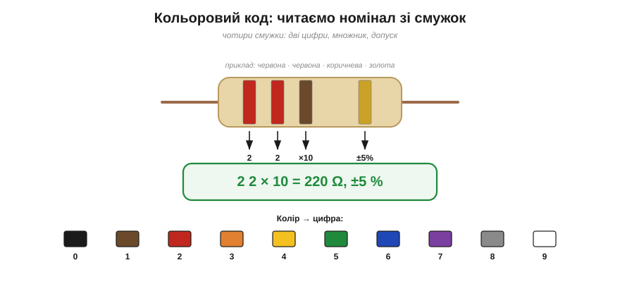

# Резистор як компонент: номінал, потужність, добір і запас

У формулах опір R — це просто **число**. Але резистор (лат. *resistere* — чинити опір) — ще й **реальна деталь**, яку купують і паяють: вона має не лише опір, а й точність, допустиму потужність, розмір і кольорове маркування. Дібрати правильний резистор — невелика, але обов'язкова інженерна процедура. У ній сходиться все відразу: [закон Ома](topic:electronics/ohms-law), [формула потужності](topic:physics/electric-power) і [теплові межі деталі](topic:physics/joule-heating).

### Номінал і ряди E: чому 220, а не 200

Якщо погортати каталог резисторів, упадуть в око «дивні» номінали: 22, 47, 68, 220, 330 Ω — а круглих 20, 50, 70 чомусь немає. Це не примха. Номінали беруть зі **стандартних рядів E**: E6, E12, E24, E48… — по 6, 12, 24, 48 значень на кожну **декаду** (десятикратний проміжок), розставлених **логарифмічно**.


*Номінали беруть не підряд, а з рядів E — по 12 (E12), 24 (E24) і більше значень на декаду, розставлених **логарифмічно**. Так смужки допуску (тут ±10 %) акуратно встеляють усю вісь без дір і зайвих перекриттів. Звідси й «дивні» 22, 47, 68 замість круглих 20, 50, 70.*

Логіка проста й красива. Кожен резистор має **допуск** — скажімо, ±10 %. Тоді «22 Ω ±10 %» накриває діапазон приблизно 20…24 Ω, «27 Ω ±10 %» — 24…30 Ω, і так далі: сусідні номінали **стикаються краями** допусків, укриваючи всю вісь без дір і без надмірних перекриттів. Якби крок був рівномірним (20, 30, 40…), то внизу декади номінали стояли б надто рідко, а вгорі — надто густо. Логарифмічний крок усуває це: що точніший допуск, то густіший ряд (E12 для ±10 %, E24 для ±5 %, E96 для ±1 %). Тому й значення такі «некруглі» — вони підігнані під геометричну прогресію, а не під нашу любов до десяток.

На практиці це означає ось що: порахувавши, скажімо, R = 287 Ω, ви не знайдете такого в продажу, а візьмете найближчий зі стандартного ряду — 270 чи 300 Ω (E24) або 270 чи 330 Ω (E12). Невелика похибка зазвичай несуттєва; а коли потрібен **точний** опір, його складають із кількох резисторів [послідовно](topic:electronics/series-connection) чи [паралельно](topic:electronics/parallel-connection). Тому в шухляді радіоаматора лежать не всі опори підряд, а саме набір рядів E — і ним покривають будь-яку потребу. А самі числа ряду — це [геометрична прогресія з кроком ×10^(1/n)](topic:math/e-series), густина якої математично «одружена» з допуском: чим точніша деталь, тим тісніше стоять сусідні номінали.

### Кольоровий код: читаємо смужки

На дрібному резисторі не надрукуєш «220 Ω», тож номінал позначають **кольоровими смужками**. Класичний код — **чотирисмужковий**: дві перші смужки дають **цифри**, третя — **множник** (степінь десятки), четверта (трохи окремо) — **допуск**.


*Чотири смужки: перші дві — цифри, третя — множник, четверта — допуск. Червона-червона-коричнева-золота = 2, 2, ×10, ±5 % = **220 Ω ±5 %**. Знизу — відповідність кольору й цифри.*

Послідовність кольорів варто знати напам'ять: **чорний 0, коричневий 1, червоний 2, оранжевий 3, жовтий 4, зелений 5, синій 6, фіолетовий 7, сірий 8, білий 9**. Множник кодують тими ж кольорами як степінь десятки (коричневий ×10, червоний ×100…), а допуск — золотий ±5 %, срібний ±10 %, коричневий ±1 %. Для точних резисторів є **п'ятисмужковий** код (три цифри + множник + допуск). Сучасні **SMD**-резистори (поверхневого монтажу) маркують не кольором, а друком: «221» означає 22×10 = 220 Ω.

Дві практичні поради. По-перше, читайте смужки з **правильного боку**: смужка допуску (золота чи срібна) зазвичай стоїть трохи окремо й завжди остання — від неї й орієнтуйтеся. По-друге, якщо колір вицвів або бере сумнів — не вгадуйте, а **зміряйте** опір [мультиметром](topic:electronics/multimeter); це найнадійніше. Кольоровий код — зручність для ока, але остаточну істину завжди скаже прилад. Якщо ж смужок чи кодів забагато — повну таблицю колір→цифра, п'ятисмужковий код для точних резисторів і всі різновиди SMD-кодів («472», «4R7», «000»-перемичка) можна [розшифрувати крок за кроком](topic:electronics/resistor-marking).

### Допуск і розмір: скільки тепла стерпить

Окрім опору, у резистора два важливі паспортні числа. Перше — **допуск** (точність): ±5 % вистачає для більшості кіл, ±1 % беруть там, де номінал критичний (подільники, вимірювання). Друге — **допустима потужність**: скільки ватів деталь розсіє, [не перегрівшись](topic:physics/joule-heating).


*Допустима потужність зростає з розміром: що більший корпус, то більшу поверхню він має й тим більше тепла відведе, не перегрівшись. Той самий опір буває й на 1/8 Вт, і на 2 Вт — обирають за розрахунковою потужністю.*

Саме тому **той самий** опір (скажімо, 100 Ω) продають у різних «розмірах»: 1/8, 1/4, 1/2, 1, 2 Вт і більше. Більший корпус — більша поверхня — більше тепла він віддасть, тож при тій самій потужності [нагрівається менше](topic:physics/joule-heating). Різняться й матеріали: дешеві **вуглецеві** (±5 %), точніші й тихіші **металоплівкові** (±1 %), а для великих потужностей — **дротяні** (намотані ніхромом). Окремий клас — навмисно дуже малі (міліоми) й точні [шунти та силові резистори з підключенням Кельвіна](topic:electronics/kelvin-shunt), якими міряють струм за спадом напруги. Обираючи резистор, ви фактично називаєте три речі: **опір**, **допуск** і **допустиму потужність**.

Що насправді означає допуск? «220 Ω ±5 %» — це гарантія, що справжній опір цього екземпляра лежить десь між 209 і 231 Ω, а конкретно — будь-де в цих межах. Для світлодіода чи підтяжки така невизначеність геть байдужа, а от у точному **подільнику напруги** вона прямо позначиться на результаті — там і беруть ±1 %. Тобто допуск обирають не за гаслом «що точніше, то краще», а **за роллю** резистора в колі: де треба — точний, де байдуже — дешевий.

### Як дібрати: п'ять кроків

Зведімо все в коротку процедуру, придатну для будь-якого кола.


*Порядок добору: 1) що треба (V, I); 2) опір R = V/I; 3) округлити до ряду E; 4) потужність P = I²R; 5) узяти допустиму потужність із запасом 2–3× (derating).*

1. **Що треба.** Випишіть, яка напруга має впасти на резисторі й який струм крізь нього потрібен.
2. **Опір.** Порахуйте R = V/I за [законом Ома](topic:electronics/ohms-law).
3. **Номінал.** Округліть до найближчого значення ряду E — точно того опору може й не бути у продажу.
4. **Потужність.** Порахуйте, скільки [тепла розсіє резистор](topic:physics/electric-power): P = I²R (або V²/R).
5. **Запас і вибір.** Візьміть допустиму потужність **у 2–3 рази більшу** за розрахункову (derating) — і назвіть остаточно опір, допуск і потужність.

> 🔧 **Навіщо це.** Найчастіша помилка початківця — порахувати лише **опір** і забути про **потужність**. Схема «за законом Ома» правильна, а на столі резистор чорніє й димить, бо крізь нього йде забагато ватів. Тому крок 4 не пропускають **ніколи**: спершу опір, потім тепло, і завжди із запасом. Дешевше поставити більший резистор, ніж потім шукати, чому пахне горілим.

### Приклад: резистор для світлодіода

Найкласичніша задача — **струмообмежувальний резистор** для світлодіода. Світлодіод хоче певного струму (скажімо, 10 мА) і сам тримає на собі приблизно сталу напругу (≈2 В); решту напруги живлення мусить «з'їсти» послідовний резистор.


*Класика: резистор для світлодіода. На R припадає 5 − 2 = 3 В; при 10 мА це R = 300 Ω (є в ряді E24). Потужність P = 0.03 Вт — мізер проти 0.25 Вт звичайного резистора, тож запас восьмиразовий.*

**Приклад. Світлодіод 2 В / 10 мА від джерела 5 В — який потрібен резистор?**

```
Спад на R:   V_R = 5 − 2          = 3 В
Опір:        R = V_R / I = 3 / 0.01 = 300 Ω      → ряд E24: є 300 Ω (або 330 Ω з E12)
Потужність:  P = I²·R   = 0.01² × 300 = 0.03 Вт
Запас:       беремо 0.25 Вт ≫ 0.03 Вт            → восьмиразовий запас, надійно
```

Відповідь: резистор **300 Ω, 0.25 Вт** (а на практиці часто беруть 330 Ω — трохи менший струм, ледь тьмяніше світло, зате стандартний номінал E12). Зверніть увагу, як спрацювали всі п'ять кроків — і як легко було б, порахувавши лише опір, узяти резистор без огляду на потужність. Тут запас вийшов величезний сам собою, та в силових колах саме крок 4 рятує деталь від згоряння.

А що було б **без** резистора? Світлодіод майже не обмежує струм сам, тож, увімкнений прямо в 5 В, він пропустив би струм, який стримує хіба що внутрішній опір джерела, — спалахнув би й одразу згорів. Резистор тут не дрібна формальність, а **рятівник**: він задає потрібний струм і бере на себе зайву напругу. Це і є відповідь на питання, навіщо в кожному ліхтарику й кожній платі стільки скромних резисторів: вони **тримають струм у шорах**.

---
