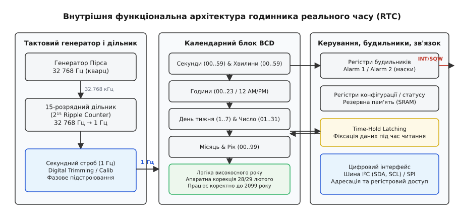
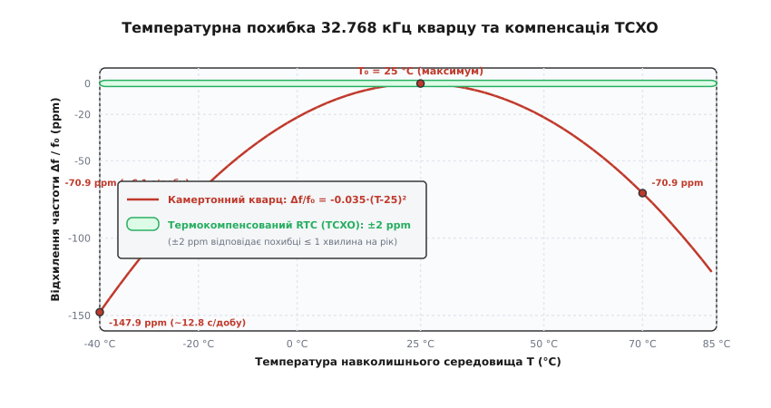
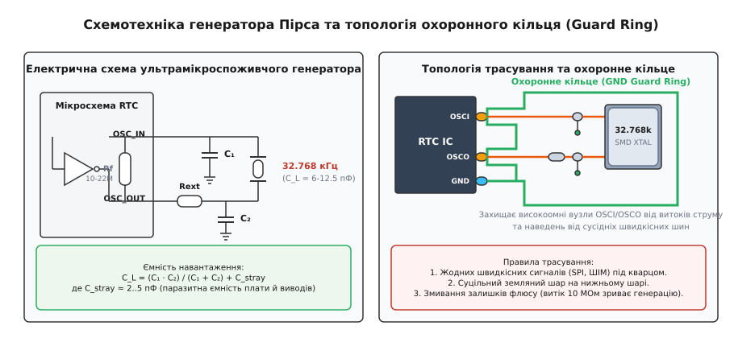
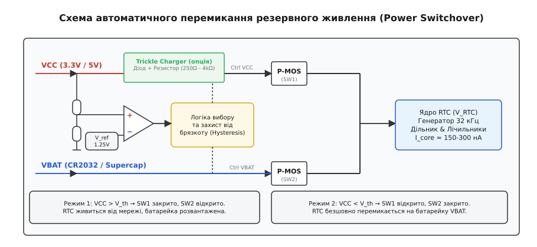

# RTC і точний відлік часу

<preknowlist>
- [Кварцовий резонатор](book:electronics/crystal) — п'єзоелектричний ефект, еквівалентна RLC-схема та умови резонансу.
- [Генератор П'єрса](book:electronics/pierce-oscillator) — підсилювальний інвертор, ємнісний зворотний зв'язок та фазовий зсув.
- [Точність частоти і ppm](book:electronics/frequency-accuracy-ppm) — відносна похибка в мільйонних частках та накопичення часового дрейфу.
- [Шина I²C](book:electronics/i2c) — послідовний інтерфейс обміну даними з відкритою лінією та регістровою адресацією.
- [Суперконденсатор](book:electronics/supercapacitor) — висока питома ємність і розрядні криві для автономного резервування.
- [Охоронне кільце на платі](book:electronics/guard-ring-pcb) — захист високоомних вимірювальних та генераторних кіл від поверхневих витоків струму.
</preknowlist>

Коли автономний реєстратор даних, промисловий лічильник електроенергії або медичний монітор знеструмлюють на місяці чи роки, головний мікроконтролер пристрою повністю вимикається. Якщо залишити процесор у режимі сну з увімкненим системним таймером, струм споживання в десятки або сотні мікроампер розрядить резервну літієву батарею ємністю 220 мА·год за лічені місяці. Для безперервного, прецизійного ведення астрономічного календаря (секунди, хвилини, години, дні тижня, дата, місяць, рік) під час повного знеструмлення апаратури потрібен окремий апаратний домен — годинник реального часу (Real-Time Clock — RTC), здатний функціонувати зі струмом споживання нижче 150–300 наноампер.

---

### Енергетичний парадокс і необхідність виділеного RTC-домену

Будь-який сучасний мікроконтролер містить апаратні таймери-лічильники, здатні відраховувати системні такти процесора. Проте використання центрального процесора для обліку реального часу стикається з трьома фундаментальними бар'єрами:

1. **Енергетичний бар'єр:**
   Динамічна потужність цифрових КМОН-структур (CMOS) пропорційна частоті перемикання затворів: `P_dyn = C_eff · V² · f`. Робота головного процесорного ядра на частотах 16–200 МГц вимагає струму від одиниць до сотень міліампер. Навіть у глибокому енергоощадному режимі (Deep Sleep / Stop mode) зі збереженням живлення частини ОЗП і роботою одного внутрішнього низькочастотного генератора RC струм витоку кристала мікроконтролера зазвичай становить від 1 до 15 мкА за кімнатної температури й стрімко зростає до 50–100 мкА при нагріванні до +70 °C. Для порівняння, спеціалізована мікросхема RTC споживає від 150 до 350 нА (на два-три порядки менше).

2. **Проблема термостабільності внутрішніх RC-генераторів:**
   Внутрішні низькочастотні генератори мікроконтролерів (LSI / Low-Speed Internal RC) мають похибку частоти близько ±1...5 % (що еквівалентно відхиленню на 14–72 хвилини на добу). Такої точності недостатньо для фіксації подій у журналі, обліку тарифних зон електроенергії чи захищених криптографічних міток часу.

3. **Гальванічна та функціональна ізоляція живлення:**
   Виділена мікросхема RTC утворює замкнений, захищений острівець на платі з власним контролером живлення. Вона безперервно підтримує лічильники часу при заміні основних батарей, перезавантаженні ядра, збоях прошивки чи апаратних зависаннях головного процесора.

---

### Чому стандартом обрано саме 32.768 кГц

Частота `32768 Гц` (32.768 кГц) стала непорушним світовим стандартом хронометрії завдяки унікальному збігу трьох інженерних факторів: фізики п'єзоелектричних резонаторів, динаміки енергоспоживання КМОН-логіки та простоти двійкового ділення.

#### 1. Двійковий поділ: 32768 = 2¹⁵
Для отримання базового секундного інтервалу (точно 1.000000 Гц) частоту генератора необхідно поділити на ціле число. Найпростішим, найнадійнішим і найдешевшим цифровим дільником є ланцюжок послідовно з'єднаних асинхронних лічильних тригерів (T-тригерів / Ripple Counter). Кожен каскад перемикається по спаду вихідного сигналу попереднього каскаду, ділячи частоту рівно навпіл:

```
f_out = f_in / 2ⁿ
```

При `n = 15` коефіцієнт ділення становить `2¹⁵ = 32768`. Ланцюжок із 15 послідовних тригерів перетворює вхідний сигнал 32768 Гц на секундний строб без жодного залишку, без необхідності встановлення логічних вентилів скидання чи синтезаторів дробового ділення. При цьому кожен наступний тригер перемикається вдвічі рідше за попередній: другий тригер працює на 16.384 кГц, третій — на 8.192 кГц, а п'ятнадцятий — на 1 Гц. Сумарне динамічне енергоспоживання всього 15-каскадного дільника дорівнює споживанню лише двох перших вхідних тригерів.

#### 2. Механіка камертона (Tuning Fork) проти пластин AT-зрізу
Високочастотні кварцові резонатори мегагерцового діапазону (1–50 МГц) використовують об'ємні зсувні коливання по товщині кварцової пластини (AT-зріз). У таких резонаторах товщина пластини обернено пропорційна частоті: для частоти 10 МГц товщина становить близько 0.16 мм. Якби ми спробували виготовити резонатор AT-зрізу на низьку частоту 32 кГц, товщина пластини мала б становити понад 5 сантиметрів, що унеможливлює створення компактного компонента.

Для діапазону десятків кілогерц кварцовий кристал вирізають у формі мікроскопічного камертона (tuning fork crystal) зі зрізом XY або NT. Коливання відбуваються у згинальній моді: два симетричні зубці камертона рухаються назустріч один одному під дією електричного поля, прикладеного до напилених електродів. На частоті 32.768 кГц довжина зубців камертона становить лише 2.5–3.5 мм при ширині близько 0.2–0.3 мм. Ця конструкція герметично запаюється у вакуумний мініатюрний металевий циліндр (розміром 2×6 мм або 1.5×5 мм) чи ультракомпактний керамічний SMD-корпус (розміром 3.2×1.5 мм або 2.0×1.2 мм). Добротність `Q` камертона у вакуумі сягає 50 000 – 100 000, що мінімізує енергетичні втрати на підтримку коливань.

#### 3. Компроміс між габаритами та енергоспоживанням
Чому не обрали ще нижчу частоту — наприклад, 2¹⁰ = 1024 Гц або 2⁸ = 256 Гц, де енергоспоживання логіки було б ще меншим? На частоті 1 кГц довжина зубців камертона зросла б у кілька разів, резонатор став би громіздким, важким і вкрай чутливим до механічних ударів, вібрацій та акустичного шуму. Навпаки, на частотах вище 100 кГц зростає динамічний струм перезаряду ємностей. Частота 32.768 кГц є оптимальною точкою перетину фізичних розмірів кристала, механічної міцності та мікропотужного споживання.

---

### Внутрішня архітектура мікросхеми RTC

Сучасний годинник реального часу є завершеною цифро-аналоговою системою на кристалі.


*Внутрішня структура мікросхеми RTC: від генератора 32.768 кГц і 15-каскадного двійкового прескалера до BCD-лічильників календаря, блоку будильників, системи фіксації Time-Hold та інтерфейсу зв'язку.*

Сигнал проходить через такі функціональні блоки:

1. **Генератор Пірса ультранизького струму:**
   Підтримує автоколивання зовнішнього або внутрішнього резонатора 32.768 кГц за допомогою однокаскадного КМОН-інвертора з високоомним зміщенням.
2. **15-розрядний асинхронний подільник частоти (Прескалер):**
   Послідовно ділить частоту 32768 Гц на 2¹⁵, формуючи секундний тактовий строб з частотою 1.000000 Гц. У багатьох сучасних мікросхемах сюди інтегровано блок цифрового калібрування (Digital Trimming), який додає чи пропускає тактові імпульси для компенсації похибки ходу.
3. **Календарні лічильники у форматі BCD (Binary-Coded Decimal):**
   Ланцюжок спеціалізованих лічильників підраховує час у зручному для відображення двійково-десятковому коді:
   - *Секунди:* лічильник від 00 до 59 (при досягненні 59 генерує перенесення на хвилини);
   - *Хвилини:* лічильник від 00 до 59;
   - *Години:* лічильник від 00 до 23 (або 01..12 з індикатором AM/PM);
   - *День тижня:* лічильник від 1 до 7;
   - *Число місяця (Date):* лічильник від 01 до 28, 29, 30 або 31 залежно від поточного місяця та року;
   - *Місяць:* лічильник від 01 до 12;
   - *Рік:* лічильник від 00 до 99.
4. **Апаратна логіка високосного року (Leap Year Compensation):**
   Автоматично перевіряє умову кратності року чотирьом (`Year % 4 == 0`). Якщо умова виконується, тривалість лютого встановлюється рівною 29 дням, інакше — 28 дням. Цей алгоритм повністю точний для всіх років у діапазоні від 2001 до 2099 (оскільки 2100 рік за григоріанським календарем не є високосним, більшість простих RTC потребують одноразового ручного переведення дати у 2100 році).
5. **Механізм фіксації буфера зчитування (Time-Hold Latching):**
   Критично важливий вузол, що запобігає «розриву» даних під час повільного читання через шину I²C. Коли головний процесор надсилає команду читання регістра секунд `0x00`, мікросхема миттєво копіює стан усіх лічильників (секунди, хвилини, години, дату) у внутрішні тіньові регістри-засувки (shadow latches). Процесор читає дані з цих засувок, тоді як внутрішні лічильники продовжують безперервно рахувати час. Це гарантує, що якщо читання почалося за мить до переходу з `23:59:59` на `00:00:00`, програма не отримає спотворений комбінований час на кшталт `23:00:00` або `00:59:59`.
6. **Блок будильників і переривань (Alarms / Watchdog):**
   Містить регістри налаштування часу спрацьовування з бітами маскування. При збігу поточного часу з налаштованим будильником виставляється прапорець переривання і формується низький рівень на виводі з відкритим стоком `INT/SQW`, що використовується для пробудження головного контролера з режиму глибокого сну.
7. **Блок виявлення несанкціонованого доступу (Tamper Detection):**
   У захищених промислових та банківських RTC (наприклад, у платіжних POS-терміналах і розумних лічильниках газу/електроенергії) інтегрують входи детектування розкриття корпусу (Tamper Pins). Замикання або розмикання захисного контакту призводить до апаратного збереження поточної мітки часу в незалежний регістр та миттєвого апаратного затирання резервної статичної пам'яті (Battery-Backed SRAM), де зберігаються криптографічні ключі.
8. **Цифровий інтерфейс (I²C або SPI):**
   Забезпечує доступ до внутрішніх регістрів. Шина I²C є стандартом де-факто завдяки використанню лише двох сигнальних ліній (`SDA`, `SCL`) з відкритим колектором, що мінімізує кількість контактів і площу плати.

---

### Температурний дрейф годинникового кварцу

Головним джерелом похибки некомпенсованого годинника реального часу є фізична залежність швидкості поширення п'єзоакустичних хвиль у кристалі від температури.


*Температурна характеристика камертонного кварцу: параболічне падіння частоти зі швидкістю −0.035 ppm/°C² відносно точки перегину 25 °C у порівнянні з активною термокомпенсацією TCXO (зелений коридор ±2 ppm).*

На відміну від мегагерцових резонаторів AT-зрізу (які мають кубічну температурну криву з двома точками перегину), згинальні камертонні кварци зрізу XY описуються параболічною (квадратичною) залежністю:

```
Δf / f₀ = −k · (T − T₀)²
```

де:
- `Δf / f₀` — відносне відхилення частоти;
- `k ≈ 0.035 ppm/°C²` — коефіцієнт кривизни параболи;
- `T₀ ≈ 25 °C` — точка нульового температурного коефіцієнта (вершина параболи);
- `T` — поточна температура кристала.

Знак «мінус» означає, що частота кварцу досягає максимуму за кімнатної температури (+25 °C) і **неминуче знижується як при нагріванні, так і при охолодженні**.

Оцінимо накопичення похибки в реальних умовах експлуатації:

1. **Кімнатна температура (+25 °C):**
   Температурний дрейф дорівнює нулю (`ΔT = 0`), але діє початковий технологічний допуск виготовлення кристала (зазвичай `±20 ppm`):
   ```
   Похибка за добу:   20 · 10⁻⁶ · 86400 с ≈ 1.73 с/добу
   Похибка за місяць: 20 · 2.592 с ≈ 51.8 с/місяць (~1 хвилина на місяць)
   Похибка за рік:    20 · 0.5256 хв ≈ 10.5 хвилин на рік
   ```

2. **Зимові вуличні умови (−20 °C):**
   Відхилення від вершини становить `ΔT = −20 − 25 = −45 °C`:
   ```
   Δf / f₀ = −0.035 · (−45)² = −0.035 · 2025 ≈ −70.9 ppm
   ```
   З урахуванням початкового допуску −20 ppm сумарне відставання сягає `−90.9 ppm`. Годинник щодня втрачає майже `7.86 секунд`, що становить майже `4 хвилини відставання за місяць`.

3. **Промислове середовище (+70 °C):**
   Відхилення `ΔT = +45 °C` дає такий самий температурний зсув `−70.9 ppm` у бік уповільнення.

Повний математичний апарат розрахунку похибок, формули затягування частоти та інтегральні оцінки розряду резервного живлення виведено у вставці [🧮 Розрахунок температурного дрейфу й підстроювання частоти](book:electronics/rtc-timekeeping/math-drift-calc.md).

---

### Термокомпенсовані RTC (TCXO RTC)

Для усунення параболічного температурного дрейфу застосовують інтегральні термокомпенсовані годинники реального часу (TCXO RTC — Temperature-Compensated Crystal Oscillator). Завдяки замкненій системі термокорекції похибка ходу знижується з `±20...100 ppm` до рекордних `±2 ppm` у всьому промисловому діапазоні від −40 °C до +85 °C (що відповідає похибці менше однієї хвилини на рік).

Усередині корпусу TCXO RTC інтегровано п'єзорезонатор, прецизійний цифровий термометр (на базі забороненої зони Bandgap з роздільною здатністю 0.25...0.0625 °C) та логічний блок компенсації, який регулярно (кожні 1–64 секунди) вимірює температуру й коригує хід часу.

У мікросхемах застосовують два принципові методи компенсації:

#### 1. Аналогове підтягування ємністю (Capacitive Pulling)
Паралельно кварцу підключено банк інтегрованих конденсаторів на КМОН-ключах (Switched Capacitor Array). Зміна навантажувальної ємності `C_L` фізично зміщує резонансну частоту коливань кварцу відповідно до формули затягування:

```
Δf / f = C₁ / [ 2 · (C₀ + C_L) ]
```

При падінні температури система зменшує ємність матриці, підвищуючи частоту генератора назад до 32768.00 Гц. Перевага: вихідний сигнал 32.768 кГц і секундний строб 1 Гц залишаються плавними й монохроматичними, без фазового тремтіння (джитера).

#### 2. Цифрове калібрування прескалера (Digital Calibration Trimming)
Кварцовий генератор працює безперервно зі своєю природною частотою, а компенсація здійснюється в цифровому лічильнику: система періодично додає або видаляє окремі тактові імпульси у прескалері, формуючи точний середній секундний інтервал. Перевага: простота схеми та ультранизьке споживання струму (до 150–250 нА). Недолік: наявність дрібного фазового джитера на субсекундних інтервалах.

Детальний аналіз внутрішньої архітектури, блоків активного перемикання живлення та регістрових карт TCXO RTC наведено у вставці [🔌 Архітектура термокомпенсованих RTC](book:electronics/rtc-timekeeping/comp-tcxo-rtc.md).

---

### Схемотехніка генератора Пірса на мікроспоживанні

Генератор Пірса (Pierce Oscillator) є основою тактування RTC. Схема складається з інвертуючого підсилювача на КМОН-транзисторах, резистора зворотного зв'язку `R_f`, кварцового резонатора та двох навантажувальних конденсаторів `C₁` і `C₂`.


*Схема наднизькоспоживчого генератора Пірса з навантажувальними конденсаторами C1, C2, демпфуючим резистором Rext та топологією захисного земляного кільця Guard Ring для перехоплення струмів витоку.*

Схемотехнічний розрахунок вузла генератора вимагає врахування таких фізичних умов:

#### 1. Крутість інвертора та режим слабкої інверсії
Щоб споживання струму генератором не перевищувало 100–250 нА, польові транзистори інвертора проєктуються для роботи в режимі підпорогової провідності (слабкої інверсії, sub-threshold region). Крутість характеристики підсилювача (transconductance `g_m`) становить лише `1.5 ... 5.0 мкА/В` (мікросіменс), що на три порядки менше, ніж у стандартних логічних вентилях.

Високоомний резистор зворотного зв'язку `R_f` (номіналом `10 ... 22 МОм`) з'єднує вхід інвертора з його виходом, автоматично зміщуючи робочу точку в лінійну область максимального підсилення (`V_in = V_out ≈ V_DD / 2`). Через мізерну величину крутості `g_m` вихідний опір інвертора є дуже високим, а час розгойдування стаціонарних коливань (Startup Time) після увімкнення живлення може становити від 0.5 до 3 секунд.

#### 2. Критерій автоколивань Баркгаузена та фазовий зсув
Автоколивання виникають за виконання двох умов критерію Баркгаузена:
1. *Баланс амплітуд:* петлеве підсилення схеми `|T(jω)| ≥ 1`.
2. *Баланс фаз:* сумарний зсув фази по замкненому контуру дорівнює `360°` (або `0°`).

Інвертуючий КМОН-підсилювач створює базовий зсув фази `180°`. Решту `180°` забезпечує триелементний π-подібний фільтр (конденсатор `C₁`, кварцовий резонатор, що працює в індуктивній області між частотами послідовного та паралельного резонансів, та конденсатор `C₂`). Резонатор діє як високодобротна індуктивність `L_eq`, перетворюючи електричний шум у вузькосмуговий стабільний синусоїдальний сигнал.

#### 3. Розрахунок ємності навантаження (Load Capacitance)
Резонатор калібрується виробником на роботу з певною паспортною ємністю навантаження `C_L` (найпоширеніші номінали: 6.0 пФ, 7.0 пФ, 9.0 пФ та 12.5 пФ). Сумарна ємність навантаження схеми визначається послідовним з'єднанням зовнішніх конденсаторів `C₁`, `C₂` та паразитною ємністю монтажу `C_stray`:

```
C_L = (C₁ · C₂) / (C₁ + C₂) + C_stray
```

При симетричних конденсаторах `C₁ = C₂ = C_ext`:

```
C_ext = 2 · (C_L − C_stray)
```

Паразитна ємність монтажу `C_stray` складається з ємності виводів мікросхеми, контактних майданчиків та доріжок плати і зазвичай становить `2.5 ... 4.0 пФ`. Якщо встановити конденсатори неправильного номіналу, виникає постійне статичне зміщення частоти:
- Якщо реальна ємність більша за паспорту (`C_real > C_L`), генератор коливається повільніше номіналу (годинник відстає);
- Якщо реальна ємність менша за паспорту (`C_real < C_L`), генератор коливається швидше номіналу (годинник поспішає).

#### 4. Запас за коефіцієнтом збудження (Negative Resistance / Safety Factor)
Для гарантованого та швидкого запуску генератора в умовах низьких температур і зниженої напруги живлення підсилювальний каскад повинен створювати від'ємний динамічний опір `−R_neg`, модуль якого перевищує еквівалентний послідовний опір кварцу `ESR` (для годинникових кварців `ESR` зазвичай становить 30–80 кОм).

Коефіцієнт надійності запуску (Oscillation Allowance / Safety Factor):

```
SF = |−R_neg| / ESR ≥ 3 ... 5
```

Якщо `SF < 3`, генератор може не запуститися при сильному морозі або після тривалого знеструмлення.

#### 5. Обмеження рівня збудження (Drive Level Control)
Камертонні годинникові резонатори є мініатюрними й надзвичайно тендітними механічними структурами. Максимально допустима потужність збудження кристала (Drive Level — DL) не повинна перевищувати `0.5 ... 1.0 мкВт` (мікроват!).

```
DL = I_drive² · ESR
```

Перевищення рівня збудження призводить до нелінійних спотворень, паразитного збудження на обертонах (наприклад, паразитної генерації на третій гармоніці близько 98 кГц), прискореного механічного старіння кварцу, незворотного зміщення частоти або фізичного відламування зубців камертона. Для обмеження потужності послідовно з виходом інвертора `OSCO` встановлюють демпфуючий резистор `R_ext` (номіналом `100 ... 470 кОм`), який разом із конденсатором `C₂` формує дільник напруги.

---

### Резервне живлення: перемикання VCC ↔ VBAT та джерела енергії

Щоб час не скидався при вимкненні основного джерела, RTC обладнують системою автоматичного перемикання живлення (Power Switchover).


*Схемотехніка вузла перемикання живлення: компаратор з гістерезисом та P-канальні польові транзистори забезпечують безшовний перехід між основним живленням VCC і батареєю VBAT без просідання напруги на ядрі RTC.*

#### Логіка роботи активного перемикача:
- **Мережевий режим (`VCC > V_th`):**
  Компаратор відкриває верхній ключ PMOS (SW1), живлячи RTC від системної шини `VCC`. Нижній ключ PMOS (SW2) закритий, ізолюючи батарею `VBAT` (витік струму з батареї < 1 нА).
- **Аварійний/резервний режим (`VCC < V_th`):**
  При знеструмленні плати напруга `VCC` падає нижче порога спрацьовування. Логіка вимикає SW1 і вмикає SW2, безшовно переводячи ядро RTC на живлення від `VBAT`. Вбудований гістерезис компаратора (50–100 мВ) повністю виключає брязкіт і багаторазове перемикання при повільному розряді шини `VCC`.

#### Порівняння джерел резервного живлення:

| Тип джерела | Номінальна напруга | Енергоємність | Саморозряд | Термін служби | Особливості застосування |
| :--- | :--- | :--- | :--- | :--- | :--- |
| **CR2032 (Li-MnO₂)** | 3.0 В | 220–240 мА·год | < 1% / рік при 25 °C | 10–15 років | Стандарт де-факто, висока надійність, замінний елемент |
| **BR2032 (Li-(CF)ₓ)** | 3.0 В | 190–200 мА·год | < 0.5% / рік | 15–20 років | Розширений діапазон температур (−40...+85 °C), для автоелектроніки |
| **ML2032 / MS621** | 3.0 В | 3–65 мА·год | 5–10% / місяць | 300–500 циклів | Перезаряджувані Li-акумулятори, вимагають Trickle Charger |
| **Суперконденсатор (EDLC)** | 2.7–3.3 В | 0.1–1.0 Фарад | Витік 100–300 нА | > 20 років (необмежено) | Не потребує заміни, забезпечує автономність від 3 діб до 1 місяця |

#### Явище пасивації літієвих елементів
При багаторічній експлуатації первинних батарей CR2032 зі струмом розряду менше 1 мкА на поверхні металевого літієвого анода утворюється захисна кристалічна плівка хлориду або оксиду літію (пасивація). Ця плівка корисна, оскільки знижує саморозряд до рекордних 0.5% на рік, але має високий опір.

Коли після років спокою мікроконтролер раптово активує читання RTC по шині I²C і виникає короткочасний імпульс струму в кілька мікроампер, напруга на зануреній у пасивацію батареї може короткочасно просісти на 0.3–0.5 В. Для захисту від скидання RTC паралельно виводам `VBAT` обов'язково встановлюють танталовий або керамічний конденсатор ємністю `1.0 ... 4.7 мкФ`, який згладжує динамічні піки струму.

---

### Трасування друкованої плати та захист від паразитних витоків

Вузол підключення годинникового кварцу 32.768 кГц є найбільш чутливим до наведень і витоків місцем на всій друкованій платі. Оскільки струми збудження становлять частки мікроампера, вхідний імпеданс інвертора сягає `10 ... 50 МОм`. За таких умов будь-який паразитний струм здатний зірвати генерацію.

#### Критичні правила трасування:
1. **Охоронне земляне кільце (Guard Ring):**
   Навколо контактних майданчиків `OSCI`, `OSCO`, конденсаторів `C₁`, `C₂` та корпусу кварцу формують замкнену доріжку землі `GND`, вільну від паяльної маски. Охоронне кільце перехоплює поверхневі струми витоку від сусідніх високовольтних чи цифрових ліній живлення.
2. **Суцільний земляний шар під кварцом:**
   Безпосередньо під кварцовим вузлом на сусідньому шарі плати має розташовуватися суцільний полігон землі. **Суворо заборонено** проводити під кварцом будь-які швидкісні цифрові доріжки (шини SPI, UART, лінії ШІМ) чи силові імпульсні траси DC-DC перетворювачів: ємнісна наводка в частки пікофарада додає фазовий джитер і зриває рахунок секунд.
3. **Мінімальна довжина трас:**
   Кварц і конденсатори розташовують на відстані не більше 3–5 мм від виводів мікросхеми.
4. **Небезпека залишків флюсу та вологи:**
   Неактивовані залишки флюсу після монтажу плати мають гігроскопічні властивості. За високої вологості поверхневий опір між виводами кварцу падає нижче 10 МОм, що шунтує високоомний вхід інвертора і призводить до раптової зупинки годинника. Для пристроїв зовнішньої установки плати обов'язково відмивають в ультразвуковій ванні та покривають вологозахисним лаком (Conformal Coating).

---

### Метрологічний контроль та вимірювання: пастка щупа осцилографа

Типовою помилкою інженерів-початківців під час налагодження плати є спроба перевірити роботу генератора 32.768 кГц підключенням стандартного щупа осцилографа до виводів `OSCI` або `OSCO`.

Стандартний пасивний щуп із дільником 1:10 має власну вхідну ємність `C_probe ≈ 10 ... 15 пФ` та активний опір `10 МОм`. Оскільки навантажувальна ємність схеми становить лише `C_L = 6 ... 12.5 пФ`, а вихідний струм інвертора не перевищує 0.3 мкА, підключення щупа призводить до таких наслідків:
1. Додаткова паралельна ємність 12 пФ миттєво зменшує власну частоту генератора на −80...−200 ppm (годинник уповільнюється на 7–17 секунд на добу безпосередньо під час вимірювання);
2. Вхідний опір щупа 10 МОм шунтує високоомний зворотний зв'язок `R_f`, зменшуючи петлеве підсилення нижче одиниці, внаслідок чого генерація миттєво зривається, і на екрані осцилографа спостерігається нуль.

Для коректного вимірювання частоти 32.768 кГц на виробничих лініях застосовують безконтактні методи:
- Програмне вмикання буферизованого виходу `SQW` або `CLKOUT` (де вихідний КМОН-буфер живиться від системного джерела та повністю ізольований від чутливого кварцового вузла);
- Використання спеціальних безконтактних індуктивних або ємнісних датчиків ближнього поля (Near-Field Probes), розташованих на відстані 2–5 мм над металевим корпусом резонатора.

---

### Системна ієрархія синхронізації та інтервали утримання (Holdover)

У розподілених промислових мережах, енергетичних підстанціях (стандарт IEC 61850) та базових станціях зв'язку RTC є лише однією з ланок багаторівневої ієрархії синхронізації часу:

1. **Первинний еталон (Stratum 0 / GNSS / Атомний стандарт):**
   Супутникові приймачі GPS/Galileo формують секундний імпульс PPS (Pulse-Per-Second) з абсолютною похибкою менше 20–50 наносекунд відносно шкали UTC.
2. **Мережеві протоколи синхронізації (PTP IEEE 1588 / NTP):**
   Протокол PTP забезпечує субмікросекундну точність через локальну мережу Ethernet з апаратною фіксацією міток часу, тоді як NTP через глобальну мережу Інтернет гарантує точність 1–10 мс.
3. **Локальний автономний хронометр (TCXO RTC):**
   Виконує роль джерела часу під час утримання (Holdover Mode). Якщо супутниковий сигнал заглушено радіоперешкодами або мережевий кабель пошкоджено, система переходить на автономний відлік за власним RTC.

#### Розрахунок бюджету утримання часу (Holdover Budget)
Припустимо, що система релейного захисту вимагає розходження міток часу не більше ніж `Δt_max = ±100 мс`.
- При використанні звичайного некомпенсованого RTC з похибкою `±30 ppm` час утримання становить:
  ```
  t_hold = 0.1 с / (30 · 10⁻⁶) ≈ 3333 с ≈ 55 хвилин
  ```
- При використанні прецизійного TCXO RTC з гарантованою стабільністю `±2 ppm` час утримання зростає до:
  ```
  t_hold = 0.1 с / (2 · 10⁻⁶) = 50 000 с ≈ 13.9 годин
  ```

---

### Програмна взаємодія та архітектура драйвера

Програмна взаємодія з RTC зводиться до роботи з регістрами через послідовну шину (I²C або SPI).

Практичний драйвер повинен вирішувати завдання цілісності даних:
- **Перевірка прапорця Oscillator Stop Flag (OSF):** під час старту мікроконтролер зобов'язаний зчитати регістр статусу. Якщо `OSF == 1`, це свідчить про повне знеструмлення або збій кварцу — час вважається недостовірним і потребує синхронізації з еталонним джерелом (NTP / GPS).
- **Пакетне читання дати й часу:** читання регістрів секунд, хвилин, годин, дати здійснюється за одну безперервну транзакцію I²C для активації апаратного механізму Time-Hold Latching.
- **Двійково-десяткова конвертація (BCD):** програмне забезпечення перетворює упаковані BCD-байти в цілочисельні типи.

Повну реалізацію надійного драйвера для вбудованих систем мовами C та C++ з підтримкою апаратних будильників та обробкою помилок наведено у вставці [⚙️ Реалізація надійного I²C-драйвера для RTC](book:electronics/rtc-timekeeping/proj-rtc-driver.md).

---

### Інженерні критерії вибору RTC

Вибір архітектури обліку часу визначається вимогами системи до автономності, робочого температурного діапазону та допустимої похибки:

| Критерій | Внутрішній RTC мікроконтролера | Дискретний базовий RTC (наприклад, PCF8563) | Прецизійний TCXO RTC (наприклад, DS3231, RV-3028) |
| :--- | :--- | :--- | :--- |
| **Похибка ходу за рік** | 10–30 хвилин (без калібрування) | 5–15 хвилин (залежить від температури) | **Менше 1 хвилини** (±2 ppm у всьому діапазоні) |
| **Струм від батареї** | 1.0–5.0 мкА | 250–500 нА | **150–800 нА** |
| **Чутливість до монтажу** | Висока (вимагає прецизійного трасування) | Висока (вимагає ретельного монтажу кварцу) | **Нульова** (кварц інтегровано всередині корпусу) |
| **Собівартість рішення** | Мінімальна (лише зовнішній кварц) | Низька ($0.30–$0.60) | Середня ($1.50–$3.00) |
| **Галузь застосування** | Побутова техніка, споживча електроніка | Автономні датчики з періодичною синхронізацією | **Лічильники енергоресурсів, касові апарати, логери** |

Для простих пристроїв з регулярним доступом до мережі Інтернет або періодичною синхронізацією по радіоканалу достатньо внутрішнього RTC мікроконтролера або дешевого дискретного чипа. Проте для необслуговуваних промислових приладів обліку, автомобільних блоків, систем безпеки та наукових реєстраторів, де накопичення похибки в кілька хвилин неприпустиме, єдиним стандартом є термокомпенсовані мікросхеми класу TCXO RTC.
