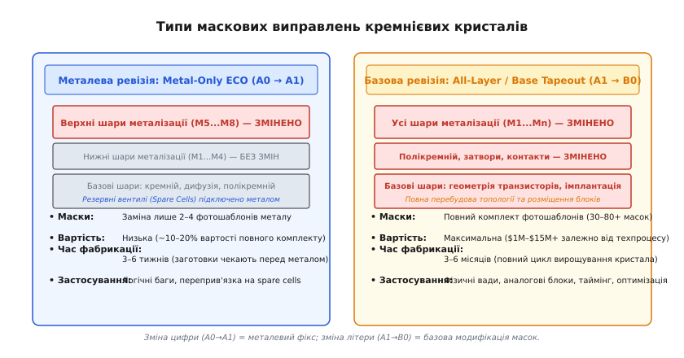
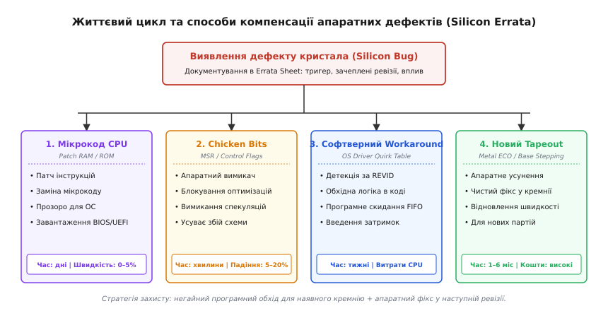
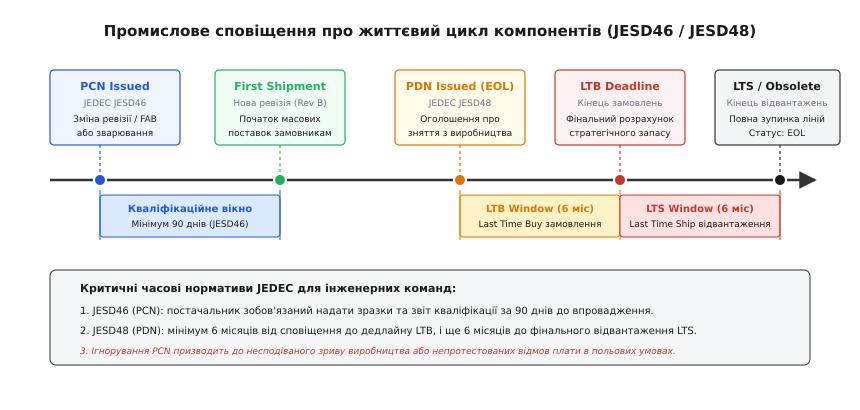

# Управління ревізіями кремнію

<preknowlist>
- [Структура даташита](topic:electronics/datasheet-structure) — розпізнавання розділів документації, специфікацій та маркування виробника.
- [Дрібний шрифт даташита](topic:electronics/datasheet-fine-print) — приховані обмеження, виноски та поведінка компонентів у неідеальних умовах.
- [Корпуси й розпіновка](topic:electronics/packages-pinout) — взаємозв'язок кремнієвого кристала, корпусування та виводів мікросхеми.
- [Граничні режими (Absolute Maximum Ratings)](topic:electronics/abs-max-ratings) — межі електричної та термічної деградації напівпровідникових структур.
</preknowlist>

Партія з 50 000 щойно виготовлених промислових контролерів після монтажу на складальній лінії несподівано демонструє спорадичні збої: приблизно один із двадцяти приладів зависає під час ініціалізації швидкісного інтерфейсу SPI в режимі прямого доступу до пам'яті DMA. Принципова схема плати ідеально повторює референсний дизайн виробника, трасування ліній виконано з дотриманням хвильового опору, а попередня дослідна серія з 500 зразків працювала місяцями без жодної відмови. 

Поглиблений аналіз за допомогою логічного аналізатора виявляє причину: на дослідній партії використовувалися мікроконтролери початкової ревізії кристала `Rev A0`, де для усунення внутрішнього стану гонитви шини інженери додали у прошивку додаткове фіктивне читання статусного регістра. У новій комерційній партії постачальник непомітно перейшов на виправлену ревізію `Rev B0`, де таймінги арбітражу шини оптимізували, через що старий програмний обхідний шлях сам перетворився на джерело блокування процесора. 

Ця криза ілюструє фундаментальний закон напівпровідникової індустрії: інтегральна мікросхема ніколи не є монолітною незмінною деталлю. Упродовж свого багаторічного комерційного життя кремнієвий кристал постійно модифікується, виправляється, оптимізується та переноситься між фабриками. Керування ревізіями кремнію (*Silicon Revision Management*) — це сукупність інженерних, програмних та нормативних методологій, що забезпечують безперервну надійність приладів в умовах постійної еволюції напівпровідникових кристалів.

### Чому перший кремній ніколи не буває ідеальним

Сучасні надвеликі інтегральні схеми (НВІС, англ. *Very Large Scale Integration, VLSI*) — мікроконтролери, цифрові сигнальні процесори (DSP), графічні прискорювачі та системи на кристалі (SoC) — містять від десятків мільйонів до сотень мільярдів транзисторів, розташованих на кристалі площею в кілька десятків квадратних міліметрів. Топологія чіпа формується за допомогою десятків послідовних літографічних шарів (дифузія, полікремній, діелектрики, від 10 до 80 металевих шарів міжз'єднань).

Створення такого кристала супроводжується фундаментальними фізичними та логічними викликами:
1. **Неможливість 100% покриття верифікацією:** Перед передачею топології у виробництво (*tapeout*) цифровий дизайн проходить мільярди циклів симуляції на емуляторах та верифікацію за допомогою формальних математичних методів. Проте кількість можливих динамічних станів у складному процесорі з позачерговим виконанням команд, багаторівневим кешем, шинними мостами та десятками периферійних модулів перевищує `2^{10000}`. Жоден суперкомп'ютер у світі не здатен промоделювати всі комбінації асинхронних подій, переривань та конфліктів шинного арбітражу.
2. **Аналогові та паразитарні ефекти:** На нанометрових технологічних нормах (від 90 нм до 3 нм) цифровий сигнал перестає бути ідеальною прямокутною сходинкою. Паразитна ємність сусідніх провідників, індуктивність зварювальних дротів, падіння напруги в розподільчій мережі живлення (*IR-drop*) та випадковий тепловий шум призводять до порушень часу встановлення та утримання сигналів (*setup/hold violations*), які виявляються лише на фізичному кремнії.
3. **Фізичні дефекти літографії та розкид легування:** Перші виготовлені партії пластин (*engineering samples*) зазвичай мають невисокий відсоток виходу придатних кристалів (*yield*). Фабрика потребує технологічного підлаштування доз іонної імплантації, товщини діелектриків та геометрії масок оптичної корекції близькості (*Optical Proximity Correction, OPC*).

У результаті перший вирощений кремній — ревізія `A0` (англ. *Alpha zero / First Silicon*) — практично завжди містить десятки недокументованих аномалій, апаратних помилок і логічних глухих кутів. Замість зупинки проекту напівпровідникова індустрія впровадила стандартизований цикл поступових виправлень кристала, відомий як **степінг кремнію** (*Silicon Stepping*).

### Анатомія ревізії кристала (Silicon Stepping)

Степінг (від англ. *stepping* — крок літографічного сканера) позначає конкретну фізичну версію масок літографії, використаних для виготовлення даної партії кристалів. У технічній документації ревізії традиційно позначаються буквено-цифровим індексом: `A0`, `A1`, `A2`, `B0`, `B1`, `C0`, `D0`.


*Класифікація маскових виправлень: металева ревізія (A0 → A1) модифікує лише верхні шари комутації за допомогою резервних вентилів, тоді як базова ревізія (A1 → B0) вимагає повного перероблення всіх літографічних фотошаблонів.*

Зміна літери та зміна цифри в індексі ревізії несуть принципово різний технологічний та економічний зміст:

#### 1. Металевий фікс: Metal-layer tapeout fix / ECO (зміна цифри: A0 → A1, B0 → B1)
Коли в первинному кремнії `A0` виявляють локальний логічний дефект (наприклад, інвертований біт статусу в регістрі або помилку арбітражу FIFO), інженерам немає потреби переробляти весь кристал з нуля.

Під час проектування топології на кристалі заздалегідь рівномірно розміщують так звані **резервні вентилі** (*spare cells* або *gate array filler*) — мільйони базових логічних елементів (NAND, NOR, тригери, мультиплексори), транзистори яких сформовані в нижніх кремнієвих шарах, але входи й виходи залишаються непідключеними.

Для усунення помилки інженери випускають інженерне розпорядження про зміну (*Engineering Change Order, ECO*). САПР перебудовує топологію лише двох-чотирьох верхніх шарів металізації (наприклад, Metal-4 та Metal-5), з'єднуючи дефектний блок із найближчими резервними вентилями:
- **Кількість нових масок:** Замінюються лише 2–4 фотошаблони з повного комплекту в 40–80 масок.
- **Фінансові витрати:** Становлять лише 10–20% від вартості повного комплекту масок (десятки або сотні тисяч доларів замість мільйонів).
- **Час виготовлення (Cycle Time):** Займає всього 3–6 тижнів. Фабрика бере так звані «заготовки кристалів» (*base wafer bank*), які вже пройшли базові технологічні етапи формування транзисторів і чекають нанесення металу на складі незавершеного виробництва, і швидко наносить скориговані верхні металеві доріжки.

#### 2. Базовий фікс: Base-layer / All-layer tapeout fix (зміна літери: A1 → B0, B1 → C0)
Якщо виявлений дефект пов'язаний із фізичною геометрією транзисторів, розведенням шин живлення, топологією комірок пам'яті SRAM, аналоговими блоками (АЦП, ЦАП, ФАПЧ/PLL) або серйозними помилками трасування всього кристала, металевого виправлення недостатньо.

Потрібна повна модифікація базових шарів літографії (шарів ізоляції STI, n/p-кишень, полікремнієвих затворів та контактних переходів):
- **Кількість нових масок:** Виготовляється повністю новий комплект фотошаблонів (*Full Mask Set*).
- **Фінансові витрати:** Складають від $1.5M до $15M+ залежно від технологічної норми (наприклад, 28 нм, 7 нм або 3 нм).
- **Час виготовлення:** Триває від 3 до 6 місяців, оскільки пластини вирощуються з чистої кремнієвої підкладки через сотні послідовних операцій травлення, осадження та літографії.

Історичні уроки подолання апаратних дефектів, від скандалу з помилкою ділення в процесорах Pentium FDIV до методології лазерного підрізання та мікрокодових латок, детально розібрано в окремому матеріалі ([📜 історичну еволюцію степінгів та кремнієвих латок](topic:electronics/silicon-revision-management/hist-stepping-evolution.md)).

---

### Заводське тестування, бінінг та електронні запобіжники (eFuses)

Керування ревізіями кремнію нерозривно пов'язане з процесом вихідного заводського сортування пластин (*Wafer Sort / Die Sort*). Навіть у межах однієї кремнієвої пластини діаметром 300 мм кристали в центрі та на периферії мають різну товщину шарів та поріг відкривання транзисторів через градієнти температури в реакторі літографії.

Для керування цим розкидом напівпровідникова індустрія використовує три ключові технології:

1. **Частотний та енергетичний бінінг (Speed & Voltage Binning):**
   Автоматичний тестер (*Automatic Test Equipment, ATE*) підключається до контактних майданчиків кристала голчастим адаптером (*Probe Card*) і вимірює максимальну робочу частоту та струм витоку. Швидкі кристали з мінімальним витоком маркуються як топові промислові або серверні версії, тоді як повільніші — як стандартні комерційні компоненти зі зниженою частотою.

2. **Електронні мікрозапобіжники (eFuses / OTP ROM):**
   Сучасні кристали містять масиви одноразово програмованої пам'яті (*One-Time Programmable Memory*). Тестер подає імпульс струму високої напруги, перепалюючи мікроскопічні полікремнієві або металеві перемички. Цим назавжди записуються:
   - Апаратний числовий код ревізії `REV_ID`;
   - Калібрувальні коефіцієнти опорної напруги внутрішнього стабілізатора (*Bandgap Reference Trim*);
   - Зсуви напруги калібрування вбудованого АЦП і температурного датчика;
   - Біти апаратного відключення дефектних обчислювальних ядер або збійних блоків кеш-пам'яті (перетворення 8-ядерного чіпа на 6-ядерний).

3. **Апаратна конфігурація та відновлення резервом:**
   Якщо під час тестування блоку пам'яті SRAM тестер виявляє дефект у кількох рядках матриці, за допомогою eFuses активуються резервні рядки пам'яті (*Redundant Memory Rows*). Для зовнішнього процесора пам'ять залишається повністю цілісною та працездатною без зміни загальної логіки чіпа.

---

### Документування апаратних дефектів: Silicon Errata Sheet

Жоден серійний мікроконтролер чи мікропроцесор не продається без офіційного документа, який зветься **Silicon Errata** (або *Errata Sheet* — лист апаратних дефектів). Це офіційний технічний бюлетень виробника напівпровідників, у якому відкрито зафіксовано всі відомі внутрішні вади кремнію, умови їхнього виникнення та методи програмного або схемотехнічного обходу.


*Життєвий цикл апаратного дефекту: від виявлення аномалії до вибору методу компенсації через мікрокод, системні quirks, конфігураційні запобіжники або новий фізичний степінг.*

#### 1. Структура запису в Errata Sheet
Кожен дефект у листі еррат має стандартизовану структуру:
1. **Ідентифікатор дефекту (Errata ID):** Унікальний код модуля та номера (наприклад, `ES_USART_002`, `Errata 2.3.1`).
2. **Коротка назва (Title):** Лаконічне формулювання проблеми (наприклад: *«DMA transfer corruption during concurrent APB bridge access»*).
3. **Зачеплені ревізії кремнію (Affected Silicon Revisions):** Таблиця, де чітко позначено, які саме степінги мають цей дефект, а в яких його усунуто:
   - `Rev A0`: Зачеплена (*Impacted*);
   - `Rev A1`: Зачеплена (*Impacted*);
   - `Rev B0`: Виправлено (*Fixed*).
4. **Опис проблеми (Problem Description):** Детальний опис того, що саме відбувається всередині цифрового блоку або аналогової схеми під час виникнення аномалії.
5. **Умови виникнення (Trigger Conditions):** Точні межові стани: частота шини, рівень напруги живлення, значення бітів у регістрах конфігурації, наявність зовнішнього переривання під час виконання конкретної інструкції.
6. **Вплив на систему (Impact):** Наслідки для кінцевого пристрою (збільшення споживання струму на 15 мА в режимі сну, спотворення молодшого байта пакету даних, зависання шини).
7. **Програмний обхідний шлях (Workaround):** Готовий інженерний рецепт: послідовність дій у коді драйвера, зміна порядку ініціалізації периферії або додаткові схемні елементи на платі (наприклад, зовнішній підтягувальний резистор), що нейтралізують вплив дефекту. Якщо дефект не має програмного обходу, вказується позначка *«No workaround: feature must be disabled»*.

#### 2. Класифікація дефектів за ступенем критичності
- **Функціональні дефекти (Functional Errata):** Блок виконує логічну функцію з помилкою в окремих граничних випадках. Наприклад: таймер пропускає імпульс переповнення, якщо значення лічильника перезаписується в той самий такт, коли надходить зовнішній сигнал скидання.
- **Параметричні дефекти (Parametric Errata):** Прилад функціонує коректно за логікою, але виходить за межі заявлених у даташиті електричних характеристик. Наприклад: струм витоку входу GPIO при температурі +125 °C становить 5 мкА замість паспортних 1 мкА, або інтегральна нелінійність АЦП (*INL*) перевищує 3 LSB у діапазоні напруг нижче 2.4 В.
- **Критичні дефекти блокування (Safety-Critical / Deadlock Errata):** Дефекти, що призводять до неконтрольованого зависання процесорного ядра або шинного мосту без можливості виходу через програмне переривання. Такі дефекти вимагають негайного оновлення прошивки або апаратного скидання через зовнішній сторожовий таймер (*Watchdog*).

#### 3. Апаратні запобіжники: Chicken Bits
Для мінімізації ризиків у складних кристалах архітектори застосовують концепцію **Chicken Bits** (апаратних бітів конфігурації в прихованих регістрах MSR). Коли в кристал додають нову експериментальну оптимізацію (наприклад, агресивне передбачення розгалужень або злиття операцій запису в пам'ять), нею керує спеціальний конфігураційний біт. 

Якщо на етапі серійної експлуатації виявляється, що ця оптимізація в рідкісних умовах призводить до збою, виробник випускає еррату з вимогою: *«Встановити біт 17 у системному регістрі MSR_CTRL_2 в 1»*. Це повністю вимикає ризикований блок, повертаючи мікросхему до консервативного, але гарантовано стабільного режиму роботи ціною незначного (3–5%) зниження пікової швидкодії.

---

### Програмне визначення ревізій та архітектура адаптивних драйверів

Спроба скомпілювати окрему прошивку під кожен степінг чіпа руйнує виробничу логістику. Якщо на складі одночасно лежать плати з чіпами ревізії `A0` та `B0`, помилка оператора під час прошивання призведе до випуску приладів із прихованими дефектами.

Єдиним професійним стандартом розробки є **динамічне визначення ревізії кремнію** (*Runtime Silicon Detection*) за допомогою апаратних регістрів ідентифікації.

#### 1. Апаратні регістри ідентифікації
Виробники інтегрують у кристал апаратно фіксовані регістри, що зчитуються процесором на етапі запуску:
- **Архітектура x86:** Інструкція `CPUID` з `EAX=1` повертає 32-бітне значення в регістрі `EAX`, де виділені біти кодують номер степінгу (*Stepping ID*), модель (*Model*) та сімейство (*Family*).
- **Архітектура ARM Cortex (32-bit та 64-bit):** Системні регістри `MIDR_EL1` (*Main ID Register*) або блоки налагодження `DBGMCU_IDCODE`. Поле `Revision` (біти 20..23) та `Patch` (біти 0..3) однозначно задають номер ревізії кристала (наприклад, позначення `r2p1` вказує на ревізію 2, патч 1).
- **Архітектура RISC-V:** Керуючі регістри стану CSR `mvendorid` (код виробника за JEDEC), `marchid` (архітектурна модель ядра) та `mimpid` (конкретна ревізія та степінг імплементації процесора).
- **Мікроконтролери STM32 / NXP / TI:** Регістри `DBGMCU_IDCODE` (STM32) або `SYS_REVID` (TI TMS570), розташовані за фіксованими фізичними адресами пам'яті (наприклад, `0xE0042000`). Поле `DEV_ID` кодує сімейство чіпа, а поле `REV_ID` (16 бітів) — конкретну версію маски кремнію.

#### 2. Диспетчеризація через таблицю вад (Silicon Quirk Table)
Низькорівневий драйвер ОС або прошивки не повинен містити розкиданих по коду перевірок `if (silicon_rev == 0x1000)`. Замість цього застосовується централізований шаблон проектування «Таблиця вад» (*Quirk Table*):

1. Під час старту системи функція ініціалізації зчитує апаратний регістр `REVID`.
2. За таблицею конфігурації знаходиться відповідний запис і формується бітова маска активних вад для даного екземпляра кристала (`active_quirks`).
3. Периферійний драйвер виконує швидку побітову перевірку `has_quirk(QUIRK_FLAG)`. Якщо біт активний — застосовується обхідний шлях (наприклад, додаткова затримка чи фіктивне скидання FIFO); якщо дефект виправлено в кремнії — драйвер виконує прямий швидкісний доступ до регістрів.

Нижче наведено зразок системної реалізації диспетчеризації вад мовами C та C++:

:::tabs
```c
/* silicon_quirk_dispatch.h - Архітектура диспетчеризації мовою C */
#include <stdint.h>
#include <stdbool.h>
#include <stddef.h>

#define QUIRK_I2C_BUSY_LOCK   (1U << 0)
#define QUIRK_UART_DMA_CORRUPT (1U << 1)
#define QUIRK_ADC_REF_DRIFT    (1U << 2)

typedef struct {
    uint16_t rev_id;
    uint32_t active_quirks;
} silicon_entry_t;

static const silicon_entry_t QUIRK_REGISTRY[] = {
    { 0x1000, QUIRK_I2C_BUSY_LOCK | QUIRK_UART_DMA_CORRUPT }, /* Rev A0 */
    { 0x1001, QUIRK_UART_DMA_CORRUPT },                       /* Rev A1 */
    { 0x2000, 0 }                                             /* Rev B0 (Fixed) */
};

static uint32_t g_active_quirks = 0;

void silicon_init_quirks(uint16_t hw_rev_id) {
    g_active_quirks = 0;
    for (size_t i = 0; i < sizeof(QUIRK_REGISTRY)/sizeof(QUIRK_REGISTRY[0]); ++i) {
        if (QUIRK_REGISTRY[i].rev_id == hw_rev_id) {
            g_active_quirks = QUIRK_REGISTRY[i].active_quirks;
            break;
        }
    }
}

static inline bool silicon_has_quirk(uint32_t quirk_flag) {
    return (g_active_quirks & quirk_flag) != 0;
}

/* Приклад використання в драйвері UART */
void uart_transmit_complete_handler(volatile uint32_t *uart_sr) {
    if (silicon_has_quirk(QUIRK_UART_DMA_CORRUPT)) {
        /* Обхідний шлях: обов'язкове очікування біта TC перед скиданням DMA */
        while (!(*uart_sr & (1U << 6))) { /* wait TC */ }
    }
}
```
```cpp
// silicon_quirk_dispatch.hpp - Ідіоматична реалізація мовою C++20
#include <cstdint>
#include <array>
#include <optional>

namespace hardware {

enum class Quirk : uint32_t {
    None             = 0,
    I2cBusyLock      = (1U << 0),
    UartDmaCorrupt   = (1U << 1),
    AdcRefDrift      = (1U << 2),
};

constexpr Quirk operator|(Quirk a, Quirk b) noexcept {
    return static_cast<Quirk>(static_cast<uint32_t>(a) | static_cast<uint32_t>(b));
}

constexpr Quirk operator&(Quirk a, Quirk b) noexcept {
    return static_cast<Quirk>(static_cast<uint32_t>(a) & static_cast<uint32_t>(b));
}

struct QuirkEntry {
    uint16_t rev_id;
    Quirk quirks;
};

class SiliconQuirkManager {
public:
    explicit constexpr SiliconQuirkManager(uint16_t rev_id) noexcept {
        for (const auto& entry : Registry) {
            if (entry.rev_id == rev_id) {
                active_quirks_ = entry.quirks;
                return;
            }
        }
    }

    [[nodiscard]] constexpr bool has_quirk(Quirk flag) const noexcept {
        return (active_quirks_ & flag) != Quirk::None;
    }

private:
    Quirk active_quirks_{Quirk::None};

    static constexpr std::array<QuirkEntry, 3> Registry{{
        { 0x1000, Quirk::I2cBusyLock | Quirk::UartDmaCorrupt }, // Rev A0
        { 0x1001, Quirk::UartDmaCorrupt },                      // Rev A1
        { 0x2000, Quirk::None }                                 // Rev B0 (Fixed)
    }};
};

} // namespace hardware
```
:::

Повну архітектуру динамічного завантаження quirks, порівняння диспетчеризації бітових масок із таблицями віртуальних функцій та методику автоматизованого тестування в середовищі неперервної інтеграції (CI/CD) розібрано в окремому проектному матеріалі ([⚙️ повнофункціональну архітектуру динамічних quirks](topic:electronics/silicon-revision-management/proj-silicon-quirks.md)).

---

### Промислове сповіщення про зміни: стандарти JEDEC JESD46 та JESD48

У комерційному виробництві електроніки раптова зміна параметрів чіпа постачальником може зупинити конвеєр або спричинити відмову тисяч приладів у клієнтів. Щоб урегулювати процес інформування, міжнародний інженерний комітет JEDEC затвердив два базові стандарти: **JESD46** (повідомлення про зміни) та **JESD48** (зняття з виробництва).


*Хронологія життєвого циклу промислових повідомлень JEDEC: 90-денне кваліфікаційне вікно за стандартом JESD46 та річний часовий коридор EOL (LTB/LTS) за стандартом JESD48.*

#### 1. Стандарт JEDEC JESD46: Product Change Notification (PCN)
Стандарт зобов'язує постачальника напівпровідників випускати офіційне повідомлення **PCN** у разі будь-яких значущих змін (*Major Changes*), що можуть вплинути на форму, посадку на плату, функціонування або надійність чіпа (*Fit, Form, Function, Quality*).

До таких подій належать:
- Випуск нового степінгу кремнію (наприклад, перехід із ревізії `A1` на `B0`);
- Перенесення фабрикації пластин на інший завод (*Wafer Fab Transfer*);
- Зміна складального майданчика або заводу тестування (*Assembly / Test Site Transfer*);
- Заміна матеріалу зварювальних мікродротів (наприклад, перехід із золотого дроту `Au` на мідний `Cu` або паладієвий `CuPd`);
- Зміна формувального епоксидного компаунду корпусу (*Mold Compound*).

**Нормативні вимоги JESD46:**
1. **Строк сповіщення:** Постачальник зобов'язаний опублікувати PCN **щонайменше за 90 календарних днів** до дати першого відвантаження нової ревізії клієнтам (*First Ship Date*).
2. **Доступність зразків:** Разом із публікацією PCN виробник повинен надати клієнтам кваліфікаційні зразки нового кремнію для тестування в їхніх приладах.
3. **Період реакції замовника:** Замовник має 30 днів на надання офіційної відповіді, запиту додаткових звітів або відхилення повідомлення в разі виявлення несумісності.

#### 2. Перенесення виробництва між фабриками (FAB Transfers) та ризики
Перенесення виробництва з однієї фабрики на іншу часто сприймається як суто логістична дія. Проте навіть за умови використання ідентичного обладнання літографії фізичні параметри чіпа зазнають дрейфу:
- Зміщуються порогові напруги транзисторів `V_th` через незначні відмінності в чистоті хімічних реактивів;
- Змінюється питомий опір і паразитна ємність металевих доріжок;
- Змінюється поведінка вбудованого генератора RC або опорного джерела струму.

Саме тому стандарт JESD46 класифікує будь-яку зміну фабричного майданчика як критичну подію, що вимагає обов'язкової повторної кваліфікації та офіційного випуску повідомлення PCN.

#### 3. Стандарт JEDEC JESD48: Product Discontinuance Notification (PDN / EOL)
Коли виробництво компонента стає економічно невигідним або фабрика закриває стару технологічну лінію, постачальник випускає сповіщення про зняття з виробництва — **PDN** (або *EOL — End of Life*).

Стандарт JESD48 встановлює жорсткий часовий регламент:
1. **Вікно Last Time Buy (LTB):** Клієнтам надається **мінімум 6 місяців** з дати виходу PDN для розрахунку та розміщення фінального замовлення на виготовлення необхідного запасу мікросхем.
2. **Вікно Last Time Ship (LTS):** Постачальник зобов'язується виготовити та відвантажити замовлену партію протягом **щонайменше 6 місяців після закриття вікна LTB** (сумарно 12 місяців від моменту первинного сповіщення).

#### 4. Економіка та ризики розрахунку буферного запасу
Під час отримання PDN підприємство опиняється перед складним інженерно-фінансовим компромісом:
- **Недобір запасу (Under-purchasing):** Якщо замовлених чіпів не вистачить на планований життєвий цикл виробу, підприємство буде змушене терміново перепроектовувати плату (*Redesign*), повторно проходити сертифікацію або купувати компоненти на відкритих брокерських ринках із величезним ризиком натрапити на підроблені або відновлені чіпи (*Counterfeit ICs*).
- **Перебір запасу (Over-purchasing):** Заморожування мільйонних фінансових коштів на складі та ризики погіршення паяності виводів компонентів через окислення під час багаторічного зберігання (старіння інтерметалідів, порушення герметичності за стандартом MSL — *Moisture Sensitivity Level*).

Повну нормативну матрицю полів документу PCN, структуру часових інтервалів та математичні формули розрахунку буферного запасу LTB наведено в спеціальному довіднику ([📋 нормативну матрицю стандартів PCN, PDN, PPAP та AEC-Q100](topic:electronics/silicon-revision-management/api-pcn-ppap-matrix.md)).

---

### Автомобільна та аерокосмічна кваліфікація ревізій: AEC-Q100, PPAP та OPN

У побутовій електроніці зміна ревізії мікроконтролера зазвичай проходить непомітно для кінцевого споживача. Проте в автомобілебудуванні, авіоніці та медичній техніці будь-яка несанкціонована зміна кремнію може призвести до відмови систем гальмування (ABS/ESP), аварії подушок безпеки чи зриву керування авіаційним рулем.

Тому в критичних галузях діють суворі правила кваліфікації та авторизації виробництва.

#### 1. Стандарт кваліфікації надійності AEC-Q100
Рада з автомобільної електроніки (*Automotive Electronics Council, AEC*) розробила стандарт **AEC-Q100**, що визначає процедуру стресових випробувань мікросхем на надійність:
- **Температурні класи (Grades):** Від `Grade 3` (від −40 °C до +85 °C для салонної мультимедіа) до `Grade 0` (від −40 °C до +150 °C для підкапотного простору, блоків керування двигуном та трансмісією).
- **Стрес-випробування:** Включають високотемпературний ресурстест `HTOL` (1000 годин при +125 °C під граничною напругою, що симулює 15 років роботи авто), випробування під тиском і вологістю `HAST`, термоциклювання `TC` (від −65 °C до +150 °C) та стрес електростатичного розряду `ESD`.

Якщо постачальник вносить зміни в кремній автомобільного чіпа (наприклад, випускає степінг `B0`), він зобов'язаний заново провести повний цикл випробувань за стандартом AEC-Q100 на трьох незалежних виробничих партіях кристалів.

#### 2. Процедура схвалення виробничої частини: PPAP (Level 1–5)
**PPAP** (*Production Part Approval Process*) — це обов'язковий регламент світового автопрому (стандарт AIAG), що підтверджує готовність технологічної лінії постачальника випускати продукцію стабільної якості з нульовим рівнем дефектів (*Zero Defects*).

Під час впровадження нової ревізії кремнію постачальник формує офіційний пакет документів, що складається з **18 обов'язкових елементів**:
- Результати вимірювання розмірів та креслення корпусу;
- Звіти аналізу видів і наслідків потенційних відмов конструкції (*DFMEA*) та техпроцесу (*PFMEA*);
- Протоколи дослідження вимірювальних систем (*MSA / Gauge R&R*);
- Статистичні індекси придатності процесу (індекс `Cpk` для ключових електричних параметрів чіпа зобов'язаний бути `Cpk >= 1.67`, що гарантує менше 1 бракованого чіпа на мільйон);
- Звіти стрес-тестів AEC-Q100;
- Гарантійний лист відповідності частини (*Part Submission Warrant, PSW*), підписаний уповноваженим керівником якості постачальника.

Автомобільний стандарт за замовчуванням вимагає подання документів за рівнем **PPAP Level 3** (надання всіх 18 елементів разом із фізичними зразками продукції). Без офіційного підписання листа PSW автоконцерн юридично блокує встановлення блоків із новою ревізією чіпа на серійний конвеєр.

#### 3. Керування партномерами: комерційний OPN проти автомобільного
Щоб унеможливити несанкціоноване проникнення неперевіреного кремнію на автоскладальні лінії, виробники напівпровідників застосовують різну політику формування торгових номерів замовлення (*Ordering Part Number, OPN*):

```
+-----------------------------------+-----------------------------------+
| Комерційний OPN (STM32, LPC, TMS) | Автомобільний OPN (SPC, FS, S9S)  |
+-----------------------------------+-----------------------------------+
| • Партномер фіксує лише пам'ять,  | • Партномер ЖОРСТКО фіксує        |
|   частоту та тип корпусу          |   конкретну ревізію кремнію       |
| • Постачальник може відвантажувати| • Заборонено змінювати степінг    |
|   Rev A1 або B0 під тим самим OPN |   без відкриття нового OPN        |
| • Кваліфікація за даташитом       | • Кваліфікація AEC-Q100 + PPAP L3 |
+-----------------------------------+-----------------------------------+
```

Комерційний чіп (наприклад, `STM32F407VGT6`) постачальник може відвантажувати з ревізією `A`, `Z` або `Y` без зміни назви товару, оскільки вони вважаються функціонально сумісними. 

Натомість автомобільний мікроконтролер (наприклад, `SPC560P50L5BEABR`) має в структурі партномера літеру `B`, яка жорстко прив'язує партію до затвердженого степінгу `B0` та конкретного пакету PPAP. Якщо вендор випустить ревізію `C0`, він буде змушений зареєструвати новий партномер `SPC560P50L5CEABR`, випустити PCN за 90 днів та наново затвердити PPAP у кожного автомобільного клієнта.

---

### Системний інжиніринг: стратегія супроводу продукту

Успішна робота з ревізіями кремнію вимагає від системного інженера та архітектора дотримання чотирьох фундаментальних правил:

1. **Регулярний моніторинг баз даних PCN/Errata:** Інженерний відділ зобов'язаний підписатися на автоматичні сповіщення PCN від усіх постачальників ключових мікросхем проекту (мікроконтролери, трансивери, контролери живлення). Кожне нове повідомлення PCN або оновлення Errata Sheet повинно реєструватися у внутрішній системі відстеження завдань для негайної перевірки впливу на прошивку та схемотехніку.
2. **Універсальна архітектура драйверів:** Код низькорівневого програмного забезпечення повинен будуватися за модульним принципом із динамічним зчитуванням регістрів `REVID` та ізоляцією обхідних шляхів усередині таблиць quirks. Спроби хардкодити часові затримки без перевірки прапорців вад повинні відсікатися на етапі статичного аналізу коду та рецензування (*Code Review*).
3. **Збереження простежуваності на виробництві:** Заводська система управління виробництвом (MES) під час монтажу друкованої плати повинна зчитувати та зберігати у виробничому паспорті приладу не лише номер плати, а й серійний номер котушки, код дати (*Date Code*) та апаратну ревізію кремнію встановленого процесора. Це дозволяє в разі польових відмов локалізувати проблему до конкретної партії за лічені години.
4. **Формування стратегії другого джерела (Second Source):** Для критичних компонентів схемотехнік повинен на етапі розробки проектувати посадкові місця друкованої плати з урахуванням можливості встановлення сумісних аналогів від альтернативних виробників (*Pin-to-Pin Compatible ICs*), захищаючи проект від раптового зняття компонентів з виробництва за повідомленнями PDN.

Керування ревізіями кремнію перетворює неминучу недосконалість напівпровідникових структур із джерела неконтрольованих виробничих аварій на керований, передбачуваний та надійний інженерний процес супроводу приладу на всіх етапах його життєвого циклу.
