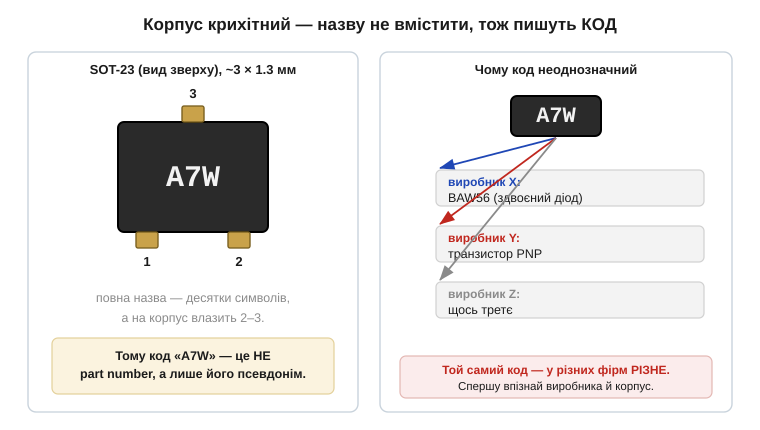
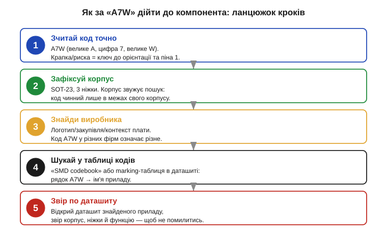

# 🔌 Коди SMD-маркування: як за «A7W» на SOT-23 дійти до компонента

### Клас «приладу»: маркування — це псевдонім, а не ім'я

Спершу домовимося, з чим маємо справу. **SMD-маркування** — це короткий код, нанесений лазером або фарбою на корпус компонента для **поверхневого монтажу** *(SMD, surface-mount device)*. Він заміняє повну назву там, де її фізично нема куди подіти.

Чому так? Корпус для поверхневого монтажу буває крихітний. Класичний **SOT-23** *(small-outline transistor)* — це приблизно 3 × 1.3 мм, менший за рисове зернятко. Повна назва приладу — скажімо, `MMBT3904LT1G` — це десяток-півтора символів; на таку площу їх не покласти читабельно. Тож виробник наносить **код** — рядок із 2–4 знаків, який у його системі позначень однозначно вказує на конкретний прилад.

*Рис. Зліва — SOT-23 з трьома ніжками й маркуванням `A7W`: повна назва на такий корпус не влізе, тому пишуть короткий код. Справа — головна пастка: один і той самий код у різних виробників означає різні прилади, бо системи позначень у них свої. Маркування — це **псевдонім** приладу всередину однієї фірми, а не глобальне ім'я.*

І ось ключове, що треба засвоїти з першої хвилини: **маркування — це не part number**. Part number (повне замовне ім'я, як-от `BAW56`) однозначний у всьому світі. Код на корпусі — лише **скорочення**, чинне **в межах системи позначень одного виробника й одного корпусу**. Той самий `A7W` у фірми X може бути здвоєним діодом, а в фірми Y — зовсім іншим приладом. Тому декодування коду — це не «подивитися в один словник», а маленьке розслідування: треба звузити, **чий** це код і в **якому** корпусі.

### Блок-схема коду: з чого він складається

Якщо код — це псевдонім, то корисно розібрати, з яких частин той псевдонім зібраний. Хоч системи в різних виробників свої, у коді майже завжди ховається та сама внутрішня логіка — три ролі, які корисно бачити окремо.

- **Сімейство приладу (*device family*)** — головна частина коду, що вказує на сам прилад: який це транзистор, діод чи мікросхема. У `A7W` основу несуть символи `A7`.
- **Суфікс/префікс варіанта** — додаткова буква, що уточнює різновид: підтип, коефіцієнт підсилення, клас напруги. Часто це остання буква — у нашому прикладі `W`.
- **Код партії або заводу (*date/lot code*)** — інколи до маркування додають окремий символ чи крапку, що позначає тиждень випуску чи лінію. До типу приладу він стосунку не має — його при декодуванні **відкидають**.

Окремо варто пам'ятати про **орієнтир піна 1**. На багатьох корпусах поряд із кодом є **крапка, скіс кута або смужка** — мітка, що задає, з якого боку рахувати ніжки. Її не плутають із символом коду: це не літера, а ключ до [розпіновки корпусу](book:electronics/packages-pinout).

### Розпіновка: код прив'язаний до корпусу

Друга половина успіху — **корпус**. Код чинний лише в парі зі своїм корпусом: для кожного корпусу виробник веде **окрему** таблицю кодів (двох-трьох символів вистачає на сотні позначень саме тому, що їх розводять по різних корпусах). Тож **корпус — перший фільтр**: він каже, в якій із таблиць шукати.

Практично корпус визначають за двома ознаками: **число ніжок** і **форма**. Три ніжки в маленькому пластмасовому корпусі — майже напевно SOT-23 (родина дрібних транзисторів і діодів). П'ять-шість ніжок — SOT-23-5/SOT-23-6 (там уже бувають мікросхеми). Дві ніжки в циліндрі чи бруску — діод. Порахувавши ніжки й глянувши на обриси, ви вже знаєте, **в якому розділі довідника** шукати код.

### «Перший байт»: алгоритм декодування

Отже, маємо дві опори — частини коду й корпус як перший фільтр. Лишається зібрати їх у послідовність дій: як від коду дійти до приладу. Це впорядкована процедура, а не вгадування; пройдемо її по кроках.

*Рис. Декодування коду — це п'ять кроків: точно зчитати символи → зафіксувати корпус → знайти виробника → знайти рядок у таблиці кодів → звірити по даташиту знайденого приладу. Пропуск будь-якого кроку (особливо «чий це код») веде до хибної відповіді.*

**Крок 1. Зчитай код точно.** Під лупою або камерою телефона з макрозйомкою розберіть символи без здогадок. Тут легко помилитися (про це нижче), тож фіксуйте кожен знак: велике це `A` чи мале, цифра `7` чи буква. Окремо знайдіть мітку піна 1.

**Крок 2. Зафіксуй корпус.** Порахуйте ніжки й визначте корпус (SOT-23, SOT-23-5, SOD-323…). Це звужує пошук до однієї таблиці.

**Крок 3. Знайди виробника.** Це найважче й найважливіше. Іноді на платі є логотип фірми; іноді відомо з закупівлі, чий компонент стоїть; іноді підказує контекст схеми. Поки виробник невідомий — відповідь буде лише ймовірною, бо один код у різних фірм означає різне.

**Крок 4. Шукай у таблиці кодів.** Є два шляхи. Перший — **таблиця маркування в самому даташиті**: у багатьох даташитах є розділ *Marking Information*, де прямо написано, який код наносять на який корпус. Другий — **зведений довідник кодів** *(SMD codebook, marking codes database)*: онлайн-бази й офлайн-довідники, де за кодом і корпусом шукають ім'я приладу. У такому довіднику знаходять рядок `A7W` для SOT-23 і дістають кандидата — наприклад, ім'я конкретного приладу.

**Крок 5. Звір по даташиту.** Знайшовши кандидата, **відкрийте його даташит** і переконайтеся, що все збігається: той самий корпус, та сама кількість ніжок, та сама функція, той самий код у розділі маркування. Цей крок відсіює випадкові збіги — і саме він перетворює здогад на впевнену відповідь.

> 🔧 **Навіщо це.** Декодування маркування потрібне щоразу, коли ви тримаєте плату, а схеми до неї нема: треба ж зрозуміти, що це за деталь, перш ніж її замінити чи повторити схему. Без цього вміння крихітний прилад із кодом `A7W` лишається анонімом — і ремонт або реверс плати глухне на першому ж непідписаному корпусі.

### Типові граблі

Процедура виглядає простою, та зривається вона майже завжди на тих самих місцях. Ось пастки, через які декодування дає хибну відповідь найчастіше, — їх корисно знати наперед.

- **Сплутані символи.** На дрібному корпусі легко переплутати `0`/`O`, `1`/`I`, `5`/`S`, `8`/`B`, `2`/`Z`. Не вгадуйте — дивіться під збільшенням і звіряйте з мітками регістру (великі/малі літери в кодах значать різне).
- **Перевернутий корпус.** Якщо читати код «догори ногами», `A7W` легко прочитати як щось інше. Спершу знайдіть мітку піна 1 (крапку/скіс) і зорієнтуйте корпус правильно, а вже потім читайте.
- **Ігнорування виробника.** Найпідступніша помилка: знайти `A7W` у першому-ліпшому довіднику й узяти першу відповідь, не звіривши, чий це код. Один код у різних фірм означає різні прилади — без виробника відповідь ненадійна.
- **Код партії за код приладу.** Зайвий символ чи крапка поряд з основним кодом — це часто дата/партія, а не частина типу. Не намагайтеся «вкласти» його в назву приладу.
- **Зупинка на кандидаті без звірки.** Знайшли ім'я в таблиці — це ще не кінець. Поки не відкрили даташит і не звірили корпус та функцію, відповідь — лише гіпотеза.

### Варіації класу

Розібрана на SOT-23 процедура переноситься на решту дрібних корпусів — лише з поправками.

- **Двоногі діоди** (SOD-323, SOD-123, MELF): коди ще коротші (одна-дві позиції), а орієнтацію задає **смужка-катод**, а не крапка.
- **SOT-23-5/-6 і дрібні мікросхеми**: коди довші (4–5 символів), із власними скороченнями виробника — частіше доводиться лізти саме в розділ *Marking Information* даташита.
- **Зовсім крихітні корпуси** (SC-70, SOT-553): місця так мало, що код стискають до однієї-двох позицій — неоднозначність ще гостріша, тож виробник і даташит критичні.
- **Резистори й конденсатори SMD** мають свою, окрему систему (числові коди номіналу) — не плутайте її з кодами активних приладів.

Спільна нитка одна: маркування — це **псевдонім приладу всередину системи одного виробника**, а не глобальне ім'я. Тому шлях завжди той самий: точно зчитати код → зафіксувати корпус → знайти виробника → дійти таблицею до part number → звірити по даташиту. Хто тримає в голові цей ланцюжок, той за `A7W` на SOT-23 спокійно дійде до конкретного компонента — а не зупиниться на першому-ліпшому збігу.
