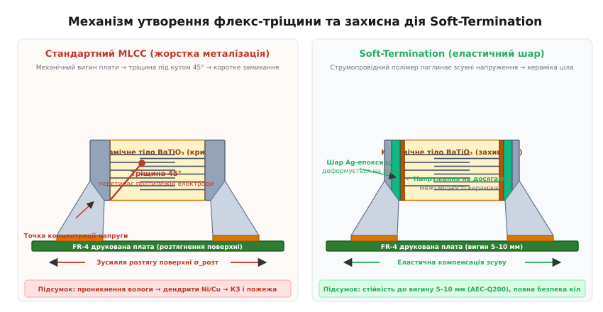
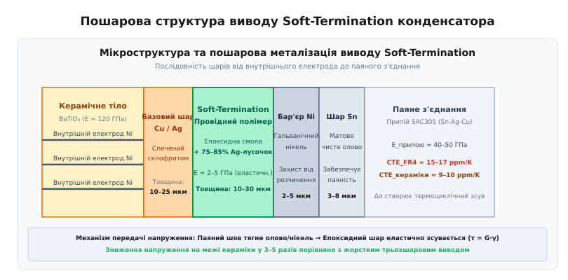
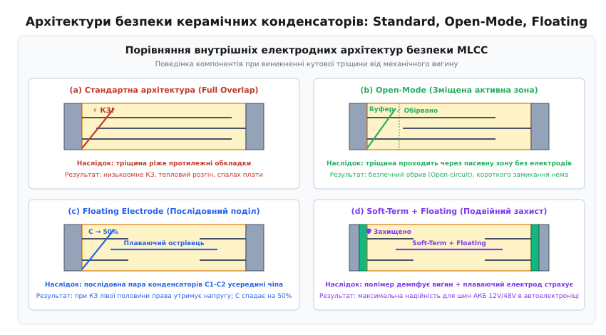
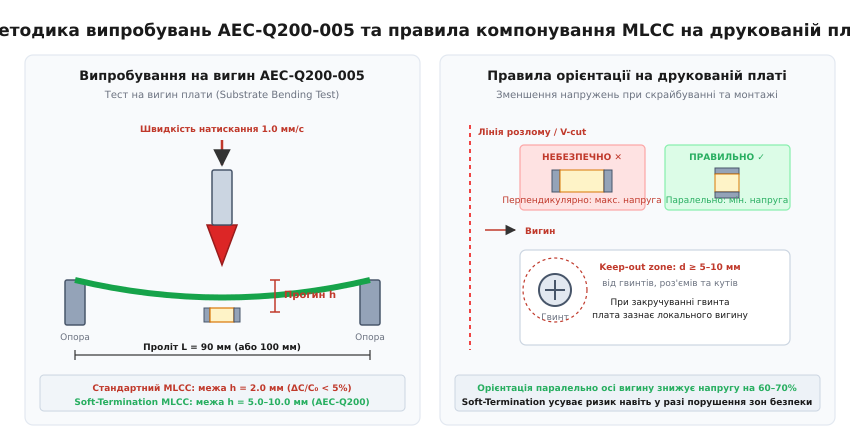

# Soft-termination конденсатори

<preknowlist>
- [Конденсатор](book:electronics/capacitor) — будова обкладок, накопичення заряду та фізичні принципи діелектричної ізоляції.
- [MLCC](book:electronics/mlcc) — монолітна керамічна структура, паралельне чергування електродів і металізація виводів.
- [Коротке замикання](book:electronics/short-circuit) — механізми пробою ізоляції, виділення джоулевого тепла та небезпека аварій у силових колах.
- [Паяння оплавленням](book:electronics/reflow-soldering) — формування галтелі припою, температурні профілі та залишкові механічні напруження.
- [Посадкові місця (footprint)](book:electronics/footprint-design) — геометрія контактних майданчиків SMD-компонентів та їхній вплив на паяний шов.
</preknowlist>

Автомобільний блок керування двигуном успішно проходить вихідний контроль на заводі, де автоматичний тестер ICT підтверджує нормативну ємність і гігаомний опір ізоляції кожного фільтрувального конденсатора на шині живлення 12 В. Проте під час фінального складання електронного вузла робітник закручує гвинт кріплення друкованої плати до алюмінієвого корпусу з незначним перекосом. Плата зі склотекстоліту FR-4 зазнає локального вигину зі стрілою прогину менше як 1.5 мм. Цього мікроскопічного зміщення виявляється достатньо, щоб у стандартному керамічному конденсаторі типорозміру 1206, розташованому поруч із кріпильним отвором, зародилася внутрішня тріщина під кутом 45°. Через кілька тижнів експлуатації автомобіля у вологу погоду капілярна волога проникає крізь тріщину, під дією постійної напруги 12 В виникає електрохімічна міграція іонів нікелю, опір конденсатора падає до десятих часток ома, і нерозривний струм акумулятора розігріває плату до 900 °C, спричиняючи термічний розгін і пожежу під капотом.

Ця фундаментальна вразливість класичних багатошарових керамічних конденсаторів зумовила появу технології **Soft-Termination** (англ. *flexible termination* або *flex-cap* — гнучкі виводи) — конструкції контактних виводів із проміжним шаром еластичного струмопровідного полімеру, який поглинає зсувні напруження під час деформації плати та блокує передачу руйнівних зусиль на крихке керамічне тіло.

## Механіка крихкого руйнування керамічних MLCC

Щоб зрозуміти причину вразливості керамічних конденсаторів до механічних впливів, необхідно зіставити фізико-механічні властивості конструкційних матеріалів, що взаємодіють у зоні паяного з'єднання.

Сучасний монолітний керамічний конденсатор ([MLCC](book:electronics/mlcc)) виготовляється на основі **титанату барію** (`BaTiO₃`, лат. *barium titanate*) — високолегованої кераміки з перовскітною кристалічною ґраткою. Цей матеріал має визначні діелектричні властивості (діелектрична проникність `ε_r` сягає 2000–4000 для кераміки класу X7R), проте має яскраво виражену механічну анізотропію та крихкість:

- **Модуль пружності Юнга (E):** для кераміки `BaTiO₃` становить `E_кераміки ≈ 110...140 ГПа`, що робить її надзвичайно жорсткою.
- **Міцність на стиск:** перевищує `1000...1500 МПа` — кераміка практично не руйнується під дією здавлювання.
- **Міцність на розтяг (σ_розт):** складає лише `80...150 МПа` — майже на порядок менше, ніж на стиск.
- **Тріщиностійкість (в'язкість руйнування K_IC):** для титанату барію знаходиться в діапазоні `0.8...1.2 МПа·м^(1/2)`. Для порівняння, конструкційні сталі мають `K_IC > 50...100 МПа·м^(1/2)`.

Згідно з теорією крихкого руйнування Гріффітса, у матеріалах із низькою в'язкістю руйнування будь-який мікроскопічний поверхневий дефект або пора діє як концентратор напружень. Коли локальне розтягувальне напруження на вістрі мікротріщини перевищує критичну міжатомну міцність зв'язків `Ti–O` та `Ba–O`, тріщина поширюється зі швидкістю, близькою до швидкості звуку в матеріалі (~4000 м/с).

### Джерела механічних напружень на друкованій платі

Друкована плата під час життєвого циклу зазнає інтенсивних механічних та термічних навантажень:

1. **Депанелізація (розділення групових заготовок):** вирубка штампом, скрайбування (розламування по V-подібних надрізах) або дискове різання створюють локальні деформації текстоліту зі стрілою вигину 2–5 мм на відстані кількох міліметрів від лінії різу.
2. **Монтаж компонентів і збирання корпусу:** закручування кріпильних гвинтів без каліброваного динамометричного контролю, запресовування роз'ємів (технологія Press-Fit), установлення важких радіаторів охолодження та затискання плати в тестових адаптерах типу «ложе цвяхів» (Bed-of-Nails).
3. **Експлуатаційні вібрації та удари:** вібраційні навантаження в моторному відсіку автомобіля (спектральна густина віброприскорення до `20...50 g` у смузі частот до 2 кГц), падіння мобільних пристроїв на тверду поверхню.
4. **Різниця температурних коефіцієнтів лінійного розширення (CTE mismatch):** склотекстоліт FR-4 має коефіцієнт теплового розширення `α_PCB ≈ 14...17 ppm/K` у площині плати, тоді як кераміка `BaTiO₃` характеризується `α_кераміки ≈ 8...10 ppm/K`, а безсвинцевий припій SAC305 (Sn-Ag-Cu) має `α_припою ≈ 20...22 ppm/K`. Під час термоциклування від -40 °C до +125 °C або +150 °C різниця коефіцієнтів `Δα ≈ 6...8 ppm/K` породжує циклічні зсувні зусилля в паяному шві навіть за абсолютно рівної плати.

### Вплив товщини плати: чому масивні плати небезпечніші

Поширена інтуїтивна помилка — вважати, що товсті багатошарові друковані плати (товщиною `t = 2.0...2.4 мм` на 8–16 шарів) надійніші за тонкі. Хоча товста плата має вищу жорсткість на вигин `E · I`, її геометрична товщина `t` пропорційно збільшує відстань від нейтральної осі до зовнішньої поверхні `y = t / 2`.

При тій самій випадковій стрілі прогину `h` поверхнева деформація товстої плати `ε = 6 · t · h / L²` є на 50% вищою, ніж для стандартної плати 1.6 мм. Тому в серверних материнських платах, телекомунікаційних базових станціях та силових автомобільних інверторах ризик крихкого руйнування пасивних SMD-компонентів зростає у півтора раза.

### Геометрія вигину та зародження діагональної тріщини

Коли друкована плата зазнає вигину з опуклістю в бік встановленого компонента, її верхня поверхня розтягується. Мідні контактні майданчики плати віддаляються один від одного на відстань `ΔL = ε_поверхні · L_компонента`.

Паяне з'єднання формує жорсткий клиноподібний меніск ([галтель припою](book:electronics/reflow-soldering)), який надійно фіксує металевий торець конденсатора до контактного майданчика плати. Через високий модуль пружності припою SAC305 (`E ≈ 40...50 ГПа`) паяний шов діє як жорсткий важіль.


*Зліва: у стандартному MLCC вигин плати створює розтяг, який через жорсткий паяний шов зароджує діагональну тріщину під кутом 45°, що пронизує протилежні обкладки й спричиняє КЗ. Справа: у конденсаторі Soft-Termination проміжний шар епоксиду деформується на зсув, поглинаючи деформацію та захищаючи кераміку.*

Максимальна концентрація розтягувальних і зсувних напружень виникає на верхньому зрізі галтелі припою, де закінчується металізація і починається відкрите керамічне тіло. Коли локальне напруження перевищує межу міцності кераміки `σ_розт ≈ 100 МПа`, зароджується мікротріщина.

Вона поширюється вглиб під характерним кутом приблизно 45° до площини плати (уздовж траєкторії головних розтягувальних напружень при чистому зсуві). Ця 45-градусна тріщина неминуче перетинає зону чергування внутрішніх електродів, розсікаючи чергові позитивні та негативні металеві шари нікелю.

Для вивчення точних математичних залежностей між прогином балки, поверхневою деформацією плати в мікрострейнах та напруженнями у шві зверніться до [детального математичного розрахунку деформацій і зсувних напружень](book:electronics/soft-termination-cap/math-pcb-strain-deflection.md).

## Сценарій катастрофічної відмови: від мікротріщини до пожежі

Найпідступніша особливість механічного руйнування керамічних конденсаторів полягає в тому, що утворення тріщини рідко призводить до миттєвого повного виходу схеми з ладу на виробничій лінії. Розвиток аварії відбувається у чотири стадії:

```
+-----------------------------------------------------------------------------------+
|                        ЛАНЦЮЖОК КАТАСТРОФІЧНОЇ ВІДМОВИ                            |
+-----------------------------------------------------------------------------------+
|  1. Зародження механічної тріщини 45° (ICT-тест пройдено, C в нормі, R > 10 ГОм) |
|                                       │                                           |
|                                       ▼                                           |
|  2. Проникнення вологи та іонів флюсу крізь капілярний проміжок                   |
|                                       │                                           |
|                                       ▼                                           |
|  3. Електрохімічна міграція іонів Ni/Cu під дією постійної напруги DC              |
|                                       │                                           |
|                                       ▼                                           |
|  4. Зростання струму витоку → Джоулеве тепло → Тепловий розгін → Загоряння плати |
+-----------------------------------------------------------------------------------+
```

### Стадія 1: Латентна мікротріщина
Одразу після завершення механічного впливу (наприклад, депанелізації) береги тріщини стискаються залишковими внутрішніми пружними силами. Ширина розкриття тріщини становить менше 0.1–0.5 мкм. В умовах сухого повітря цеху опір ізоляції компонента залишається вищим за `10...100 ГОм`, а зменшення ємності внаслідок відсікання невеликого кута електродів не перевищує 0.5–2.0%. Автоматичний оптичний контроль (AOI) не бачить тріщину, оскільки вона схована під шаром припою, а електричний контроль (ICT/FCT) реєструє справний виріб. Плата монтується у кінцевий блок і відвантажується замовнику.

### Стадія 2: Капілярна конденсація та адсорбція вологи
Під час експлуатації електронний блок піддається добовим коливанням температури та вологості навколишнього середовища. Завдяки капілярному ефекту волога затягується у вузький проміжок тріщини. Водяна пара розчиняє залишки активаторів паяльного флюсу (іони хлору `Cl⁻`, брому `Br⁻` або органічні кислоти) та атмосферні солі, перетворюючись на рідкий електроліт із високою іонною провідністю безпосередньо між оголеними торцями внутрішніх електродів протилежної полярності.

### Стадія 3: Електрохімічна міграція та утворення дендритів
На електроди конденсатора постійно подається робоча напруга шини живлення (наприклад, 12 В, 24 В або 48 В). В утвореній електрохімічній комірці на аноді (позитивному електроді) відбувається окиснення та розчинення металу електрода:

```
Ni → Ni²⁺ + 2e⁻    або    Cu → Cu²⁺ + 2e⁻
```

Під дією сильного електричного поля (яке у вузькому зазорі тріщини шириною 1 мкм при напрузі 12 В сягає `E = 12 В / 10⁻⁶ м = 1.2 × 10⁷ В/м = 120 кВ/см`) позитивні іони металу дрейфують до катода (негативного електрода), де відновлюються до нейтральних атомів металу:

```
Ni²⁺ + 2e⁻ → Ni
```

На поверхні катода починають проростати тонкі ниткоподібні металеві кристали — **дендрити** (грец. *dendron* — дерево). З часом дендрит перетинає зазор і замикає протилежні електроди металевим містком.

### Стадія 4: Тепловий розгін і займання текстоліту
Опір ізоляції стрімко деградує: від гігаомів до кілоомів, а потім до десятих часток ома. Через утворений резистивний місток починає текти струм витоку. Відповідно до закону Джоуля — Ленца, у мікроскопічній зоні пошкодження виділяється теплова потужність:

```
P = V² / R_витоку
```

При напрузі шини 12 В та опорі містка 1.0 Ом потужність становить `P = 144 Вт`, яка виділяється в об'ємі кераміки менше ніж `0.01 мм³`. Густина виділення енергії сягає сотень кіловатів на кубічний міліметр.

Температура в центрі дефекту миттєво піднімається вище 800–1200 °C. Кераміка `BaTiO₃` при таких температурах зазнає термічного колапсу та фазового переходу в провідний розплав. Припій плавиться, мідні доріжки плати випаровуються з утворенням електричної дуги, а епоксидна основа склотекстоліту FR-4 піролізується, виділяючи горючі гази та перетворюючись на електропровідний вуглецевий кокс (явище трекінгу). Плата спалахує відкритим полум'ям.

У слабкострумових сигнальних колах мікротріщина викликає лише збій передачі даних або підвищене енергоспоживання. Проте на первинних силових шинах живлення (таких як автомобільна клема 30, підключена безпосередньо до свинцево-кислотного або літієвого акумулятора з пусковим струмом у сотні ампер) [коротке замикання](book:electronics/short-circuit) стандартного керамічного конденсатора призводить до повного вигоряння електронного блоку.

## Конструкція та матеріалознавство Soft-Termination

Рішенням описаної проблеми є введення механічно піддатливого матеріалу у ланцюжок передачі механічних зусиль між друкованою платою та керамікою.

### Порівняння класичної та Soft-Termination металізації

Класичний вивід MLCC містить три шари:
1. **Базовий шар (Inner Termination):** спечений порошок міді `Cu` або срібла `Ag` зі скляним фритом товщиною 10–25 мкм, що створює омічний контакт із внутрішніми нікелевими електродами.
2. **Бар'єрний шар (Barrier Layer):** шар гальванічного нікелю `Ni` товщиною 2–5 мкм, що запобігає розчиненню міді в розплаві припою (захист від вимивання / *leaching*).
3. **Зовнішній шар (Outer Layer):** шар гальванічного матового олова `Sn` товщиною 3–8 мкм, що забезпечує ідеальну змочуваність припоєм під час монтажу.

Конструкція **Soft-Termination** (відома у виробників під торговими марками *FlexiCap* від Knowles/Syfer, *FT-CAP* від KEMET/Yageo, *Soft Termination* від TDK, *Polyterm* від AVX/Kyocera) додає четвертий спеціалізований шар між базовою металізацією та нікелевим бар'єром.


*Мікроструктура контакту Soft-Termination: між спеченою міддю та гальванічним нікелем розміщено еластичний шар епоксидної смоли з 75–85% вмістом срібних лусочок, який бере на себе зсувну деформацію.*

Послідовність шарів у Soft-Termination конденсаторі:
1. **Базовий металевий шар (Cu / Ag-frit):** високотемпературно спечена мідна паста товщиною 10–25 мкм, що виходить на торці керамічного тіла і контактує з внутрішніми електродами BME Ni.
2. **Еластичний провідний шар (Conductive Polymer / Ag-Epoxy):** шар термореактивної епоксидної смоли товщиною 10–30 мкм, рівномірно наповненої мікроскопічними лусочками срібла високої чистоти `Ag` (масова частка наповнювача становить 75–85%, об'ємна — близько 30–40%).
3. **Бар'єрний нікелевий шар (Ni):** гальванічний шар нікелю товщиною 2–5 мкм, нанесений безпосередньо поверх провідного полімеру.
4. **Зовнішній олов'яний шар (Matte Sn):** чисте матове олово товщиною 3–8 мкм для безсвинцевого паяння.

### Фізика демпфування: чому полімер захищає кераміку

Захисна дія проміжного шару базується на фундаментальній різниці модулів пружності матеріалів:
- Модуль Юнга кераміки `BaTiO₃`: `E_кераміки ≈ 120...140 ГПа`.
- Модуль Юнга спеченої міді: `E_міді ≈ 110 ГПа`.
- Модуль Юнга нікелю: `E_нікелю ≈ 200 ГПа`.
- Модуль Юнга припою SAC305: `E_припою ≈ 45 ГПа`.
- Модуль Юнга сріблонаповненого епоксиду: `E_полімеру ≈ 2.0...5.0 ГПа`.

Модуль Юнга провідного полімеру у **30–60 разів менший**, ніж у кераміки, та у **15–20 разів менший**, ніж у паяного шва.

Коли під час вигину плати галтель припою тягне за собою зовнішні олов'яно-нікелеві шари металізації, полімерний шар товщиною 20 мкм зазнає значної пружно-пластичної деформації зсуву `γ = Δx / t_полімеру`. Зсувне напруження в полімері розраховується за законом Гука:

```
τ = G_полімеру · γ
```

де модуль зсуву полімеру становить лише `G_полімеру = E / (2 · (1 + ν)) ≈ 1.0...1.8 ГПа` (за коефіцієнта Пуассона `ν ≈ 0.35`).

Полімерний шар діє як механічний демпфер і пружина зсуву. Він розв'язує жорсткий зовнішній шов і тендітне внутрішнє керамічне тіло: механічне зміщення поглинається зсувом полімерної матриці, а розтягувальні напруження, що доходять до кераміки, знижуються у 3–5 разів — до значень `σ < 60...80 МПа`, що значно нижче порогу крихкого руйнування `BaTiO₃`.

Срібні лусочки всередині епоксидної матриці контактують одна з одною за рахунок високої концентрації, що перевищує поріг перколяції (явище протікання струму крізь випадкову сітку провідних частинок). Під час деформації лусочки зсуваються і ковзають одна по одній, зберігаючи неперервний електричний ланцюг без погіршення провідності контакту.

## Демпфування п'єзоелектричного шуму (Acoustic Noise Reduction)

Окрім захисту від механічного злому, полімерний прошарок Soft-Termination вирішує проблему акустичного шуму електронних схем.

Кераміка на основі титанату барію класу II (X5R, X7R, X8R) нижче точки Кюрі (125 °C) перебуває у сегнетоелектричній фазі та має сильні п'єзоелектричні й електрострикційні властивості. Коли через конденсатор протікає змінний струм або пульсації напруги звукового діапазону (20 Гц – 20 кГц), спричинені ШІМ-стабілізаторами чи аудіопідсилювачами, керамічне тіло мікроскопічно стискається й розширюється.

У стандартних MLCC ця високочастотна механічна вібрація через абсолютно жорсткий паяний шов передається на друковану плату FR-4. Плата виконує роль акустичної мембрани (деки динаміка), випромінюючи в навколишній простір відчутний високочастотний писк, дзвін та свист («співаючий конденсатор»).

Еластичний шар Soft-Termination з низьким модулем пружності діє як механічний фільтр низьких частот: він демпфує мікровібрації кераміки, знижуючи передачу акустичної енергії на текстоліт плати на **10–20 дБ** (у 3–10 разів за звуковим тиском).

## Стандарти надійності та методика випробувань (AEC-Q200-005)

Стійкість пасивних компонентів до механічних впливів нормується міжнародними стандартами:
- **AEC-Q200-005:** *Board Flex / Substrate Bending Test* (вимоги автомобільного комітету Automotive Electronics Council);
- **IEC 60384-1 / EN 130700:** *Fixed capacitors for use in electronic equipment* (європейський стандарт);
- **JIS C 5101-1:** *Fixed capacitors for use in electronic equipment* (японський промисловий стандарт).

### Методика триточкового вигину (AEC-Q200-005)

Випробувальний стенд складається з двох циліндричних опор радіусом 1.0–2.5 мм, встановлених на фіксованій відстані (проліт `L = 90 мм` або `100 мм`). Тестова плата зі склотекстоліту FR-4 товщиною `t = 1.6 мм` із припаяним у центрі досліджуваним конденсатором встановлюється компонентом донизу (у зону максимального розтягу).

Посередині зворотного боку плати прикладається навантаження пуансоном, що опускається з нормованою швидкістю `v = 1.0 мм/с` до досягнення контрольної стріли прогину `h`.

```
                    Пуансон (v = 1.0 мм/с)
                            │
                            ▼
          ┌─────────────────▼─────────────────┐   ▲
          │      Тестова плата FR-4 (t = 1.6) │   │  Товщина t = 1.6 мм
    ──────┴─────────────────┬─────────────────┴───▼──────
    ▲                       │                       ▲
    │                       │                       │
  Опора 1            Конденсатор MLCC             Опора 2
  (радіус r)         (зона розтягу σ)             (радіус r)
    ◄───────────────────────┴──────────────────────►
                     Проліт L = 90 мм
```

Критерії відповідності стандарту:
- **Стандартні комерційні MLCC:** повинні витримувати прогин `h = 2.0 мм` без утворення видимих тріщин та зі зміною ємності `|ΔC / C₀| ≤ 5.0%` (для діелектриків класу II X7R/X8R).
- **Soft-Termination MLCC (AEC-Q200 Grade 0 / Grade 1):** гарантовано витримують прогин `h ≥ 5.0 мм`, а кращі зразки зберігають працездатність при прогині `h = 8.0...10.0 мм`.

При прогині плати `h = 5.0 мм` на прольоті `L = 90 мм` відносна деформація поверхні текстоліту складає `ε ≈ 5930 με` (понад 0.59% подовження!). Стандартний конденсатор у таких умовах кришиться вже при `h = 2.2...2.8 мм`, тоді як компонент із Soft-Termination витримує повний хід пуансона без падіння опору ізоляції.

Для ознайомлення з програмним забезпеченням автоматизованого випробувального комплексу перегляньте [автоматизовану систему моніторингу випробувань за стандартом AEC-Q200](book:electronics/soft-termination-cap/proj-flex-test-monitor.md).

### Стійкість до температурних циклів (AEC-Q200-004)

Окрім чистого вигину, Soft-Termination забезпечує видатну стійкість до термоциклування. У стандартних MLCC внаслідок невідповідності `ΔCTE` між FR-4 та керамікою після 1000 циклів від -55 °C до +125 °C спостерігається втомне розтріскування паяного шва та зародження кутових мікротріщин.

Завдяки еластичності срібло-епоксидного шару компоненти Soft-Termination витримують понад **3000 циклів** термоудару без погіршення параметрів, що є обов'язковою вимогою для електроніки підкапотного простору автомобілів (AEC-Q200 Grade 0, робочий діапазон від -55 °C до +150 °C).

## Альтернативні та комбіновані архітектури безпеки

Хоча Soft-Termination запобігає виникненню тріщин, інженери розробили низку альтернативних топологій внутрішніх електродів, спрямованих на безпечну поведінку конденсатора у випадку, якщо тріщина все ж виникне за екстремальних навантажень.


*Чотири архітектури безпеки: (a) Стандартна — тріщина викликає КЗ; (b) Open-Mode — тріщина проходить через пасивну кераміку; (c) Floating Electrode — тріщина закорочує одну половину, ємність падає на 50% без КЗ; (d) Soft-Term + Floating — подвійний захист.*

### 1. Архітектура Open-Mode
В архітектурі Open-Mode внутрішні електроди відсунуті від торців і кутів компонента на значну відстань (збільшений захисний бар'єр пасивної кераміки). Активна зона перекриття пластин зосереджена виключно в центральній третині чіпа.

Коли при сильному вигині в кутку утворюється класична тріщина під кутом 45°, вона проходить виключно крізь пасивну кераміку, де немає електродів протилежної полярності. В результаті коротке замикання стає фізично неможливим: деталь переходить у стан розриву кола (англ. *open mode failure*), зберігаючи цілісність шини живлення.

### 2. Плаваючий електрод (Floating Electrode / Tandem)
Топологія з плаваючим електродом розділяє внутрішню структуру компонента на два послідовно з'єднані конденсатори в одному керамічному моноліті. Зовнішні контакти з'єднуються з крайніми незалежними пластинами, а посередині розташовується масив ізольованих електродів («плаваючих острівців»).

Якщо механічна тріщина пошкоджує лівий або правий край деталі й закорочує електроди однієї сторони, протилежна сторона залишається неушкодженою і продовжує виконувати функцію ізолятора. Підсумкова ємність компонента зменшується на ~50%, проте шина живлення ніколи не замикається накоротко.

### 3. Комбінований захист (Soft-Termination + Floating Electrode)
Для найвідповідальніших вузлів (гальмівні системи ABS/ESP, блоки керування подушками безпеки, контролери тягових батарей електромобілів BMS) застосовують гібридні конденсатори, що поєднують **Soft-Termination** та **Floating Electrode** (наприклад, серія KEMET Dual-Fail-Safe FT-CAP або TDK CGA Soft-Term Tandem). Полімерний шар виключає тріщини за звичайних деформацій плати (до 5–10 мм), а структура плаваючих електродів гарантує відсутність короткого замикання навіть у випадку важкої аварії та фізичного розламу чіпа навпіл.

Детальне зіставлення електричних параметрів, вартості, паразитних індуктивностей та обмежень усіх захисних архітектур наведено у [системному порівняльному аналізі архітектур безпеки MLCC](book:electronics/soft-termination-cap/comp-failsafe-mlcc-architectures.md).

## Електричні параметри та компроміси

Введення полімерного прошарку дещо змінює електричні характеристики компонента, що необхідно враховувати при прецизійному проектуванні:

```
+-----------------------------------------------------------------------------------+
|               ВПЛИВ SOFT-TERMINATION НА ЕЛЕКТРИЧНІ ПАРАМЕТРИ                      |
+-----------------------------------------------------------------------------------+
|  • Номінальна ємність (C)    : Не змінюється (визначається внутрішнім чіпом)      |
|  • DC-bias дерайтинг         : Ідентичний стандартному MLCC того ж діелектрика    |
|  • Еквівалентна індуктивність: ESL не змінюється (< 1% різниці)                   |
|  • Еквівалентний опір (ESR)  : Зростає на +5...15 мОм (за рахунок Ag-епоксиду)    |
|  • Тепловиділення на AC-тоці : Незначно зростає при екстремальних струмах I_rms   |
+-----------------------------------------------------------------------------------+
```

### 1. Еквівалентний послідовний опір ([ESR](book:electronics/esr-capacitor))
Оскільки провідність епоксидної матриці зі срібним наповнювачем дещо нижча за провідність суцільної металевої міді, еквівалентний послідовний опір конденсатора Soft-Termination на частотах 100 кГц – 1 МГц зростає на `ΔESR ≈ 5...15 мОм` (залежно від типорозміру).

У більшості кіл фільтрації та розв'язки живлення ([Decoupling](book:electronics/decoupling)) це збільшення є абсолютно некритичним, а в багатьох випадках — навіть корисним. Додатковий опір 10 мОм забезпечує природне демпфування паразитних коливальних контурів, утворених ємністю MLCC та індуктивністю провідників друкованої плати, запобігаючи виникненню високодобротних резонансних піків імпедансу в розподільчих мережах живлення (PDN, англ. *Power Distribution Network*).

### 2. Еквівалентна послідовна індуктивність ([ESL](book:electronics/capacitor-parasitics))
Товщина полімерного шару (10–30 мкм) є мізерною у порівнянні з габаритами чіпа, тому петля протікання високочастотного струму не збільшується. ESL конденсаторів Soft-Termination ідентична стандартним моделям.

### 3. DC-bias ефект та температурна стабільність
Внутрішня керамічна структура титанату барію та конфігурація діелектричних шарів у Soft-Termination залишаються без змін. Відповідно, температурний коефіцієнт ємності (TCC), залежність ємності від постійної напруги зміщення ([DC-bias ефект](book:electronics/dc-bias-capacitance)) та діелектричні втрати повністю відповідають стандартним конденсаторам аналогічного класу (X7R, X8R, C0G).

## Правила проектування друкованих плат (PCB Layout & DFM)

Застосування Soft-Termination конденсаторів повинно підкріплюватися грамотним топологічним трасуванням плати, що мінімізує механічні напруження ще на етапі проектування посадкових місць ([Footprint design](book:electronics/footprint-design)).


*Зліва: геометрія випробування на 3-точковий вигин за AEC-Q200-005. Справа: правила розміщення на платі — орієнтація паралельно лініям зламу зменшує напруження на 60–70%, а відстань до гвинтів має перевищувати 5–10 мм.*

### 1. Орієнтація відносно ліній згинальних напружень
Головне правило розміщення керамічних конденсаторів: **поздовжня вісь компонента повинна бути паралельною до осі вигину плати (лінії зрізу, скрайбування або краю плати)**.
- **Перпендикулярне розташування (НЕБЕЗПЕЧНО):** різниця зміщень між контактними майданчиками максимальна (`ΔL = ε · L_компонента`). Кераміка зазнає граничного розтягу.
- **Паралельне розташування (БЕЗПЕЧНО):** обидва контактні майданчики лежать на одній ізолінії деформації, відстань між ними не змінюється, поздовжнє розтягувальне напруження знижується на 60–70%.

### 2. Зони відчуження (Keep-out Zones)
Керамічні конденсатори (особливо великих типорозмірів 0805, 1206, 1210 і більше) заборонено розміщувати в зонах підвищеної деформації:
- Відстань до ліній V-подібного скрайбування (V-cut): **не менше 5.0–10.0 мм**;
- Відстань до отворів під кріпильні гвинти та заклепки: **не менше 5.0–8.0 мм**;
- Відстань до масивних роз'ємів і клемних колодок, що монтуються вручну або піддаються вигину при підключенні кабелю: **не менше 5.0 мм**.

Якщо за умовами високої щільності трасування розмістити конденсатор поза зоною відчуження неможливо, застосування компонента з **Soft-Termination** або **Open-Mode** є строго обов'язковим.

### 3. Геометрія контактних майданчиків та трафарету
Надмірний об'єм припою під час паяння оплавленням створює надто високу галтель припою, яка перетворюється на жорсткий захват. Рекомендації з формування посадкових місць за стандартом IPC-7351:
- Уникати надмірного вильоту контактного майданчика за межі чіпа;
- Зменшувати вікно трафарету для паяльної пасти на 10–20% відносно площі мідного майданчика, щоб висота галтелі припою не перевищувала 50% висоти компонента (`h_галтелі < 0.5 · H`).

## Галузі застосування та стратегія нульових дефектів (Zero Defect)

В автомобільній промисловості рівня Tier-1 (Bosch, Continental, Denso, Magna) діє сувора стратегія нульових дефектів (англ. *Zero Defect Strategy*). У межах процедури схвалення виробництва автомобільних компонентів PPAP (Production Part Approval Process) провідні автовиробники прямо забороняють використання стандартних MLCC на нерозв'язаних ланцюгах акумуляторного живлення.

Технологія Soft-Termination стала обов'язковим галузевим стандартом у таких сферах:

1. **Автомобільна електроніка (Automotive):**
   - Пряме підключення до бортової мережі 12 В / 24 В / 48 В (клема 30 / акумуляторна шина без проміжних захисних ключів);
   - Інвертори тягових електроприводів, DC-DC перетворювачі та бортові зарядні пристрої електромобілів (OBC);
   - Електронні блоки керування шасі, двигуном і гальмами (ECU, ABS, ESP, рульове керування EPS);
   - Сенсори допомоги водієві (ADAS): радари міліметрового діапазону, камери та лідари, встановлені на вібруючих елементах кузова.
2. **Аерокосмічна та оборонна техніка:**
   - Бортова авіоніка, системи навігації та керування польотом, що зазнають екстремальних вібрацій і перепадів температур від -55 °C до +125 °C.
3. **Промислова автоматика та енергетика:**
   - Частотні перетворювачі, сонячні інвертори, релейний захист підстанцій, контролери бурового обладнання для нафтогазової галузі (де температури сягають +150...+175 °C).
4. **Високонадійні сервери та телекомунікації:**
   - Модулі VRM (Voltage Regulator Module) живлення процесорів із масивними друкованими платами товщиною понад 2.0–2.4 мм, схильними до деформації при встановленні важких радіаторів та сокетних притисків.

Застосування Soft-Termination керамічних конденсаторів усуває головну слабку ланку поверхневого монтажу — крихке руйнування діелектрика при вигині плати, гарантуючи довготривалу безпеку силових та сигнальних кіл у найжорсткіших умовах експлуатації.
