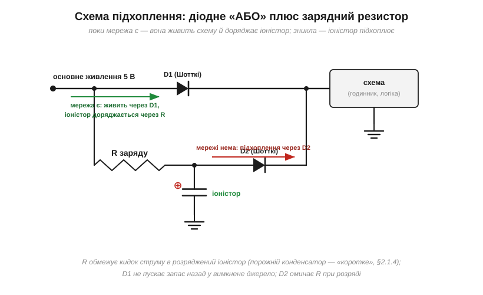

# 🔌 Іоністор як резервне живлення: годинник і «останній подих»

Базова фізика [суперконденсатора (іоністора)](book:electronics/supercapacitor) — окрема тема; тут — конкретна схемотехніка: як підвісити іоністор на живлення, щоб він непомітно заряджався в роботі, а в мить зникнення мережі підхопив годинник на дні або дав усій системі кілька секунд попрощатися.

### Два сценарії — два класи задач

**Сценарій «годинник»:** після зникнення живлення мусить вижити мізерний споживач — годинник реального часу, лічильник, невелика пам'ять. Струми — одиниці-десятки мікроампер, час — години й доби. **Сценарій «останній подих» (*last gasp*):** система мусить пропрацювати ще кілька секунд на повному ході — встигнути записати дані, надіслати повідомлення «мене вимкнули», коректно згаснути. Струми — десятки-сотні міліампер, час — секунди. Обидва закриває іоністор, але **різний** іоністор — і це головна пастка вставки.

Чому той самий компонент розколюється на два класи? Бо в нього два геть різні внутрішні «вузькі місця». Для годинника важлива тільки ємність і саморозряд — струми такі мізерні, що внутрішній опір ролі не грає. Для «останнього подиху» головним стає той самий внутрішній опір (ESR): саме він вирішує, чи комірка взагалі здатна віддати сотні міліампер, чи вона захлинеться на першій же мілісекунді. За цими двома сценаріями стоять два механізми — **звідки береться ESR** і **куди тихо тікає заряд** під час очікування. Без них усі розрахунки нижче — лічба на папері, що розходиться з життям.

### Базова схема: діодне «АБО» плюс зарядний резистор


*Рис. Поки мережа є, схема живиться через D1, а іоністор тихо доряджається через резистор R. Щойно мережа зникла — напруга на шині просідає, D2 відкривається, і запас іоністора підхоплює навантаження. D1 при цьому не пускає заряд назад у вимкнене джерело.*

Кожен елемент тут не випадковий. **Резистор R** обмежує кидок струму: розряджений іоністор для джерела — майже коротке замикання, бо порожній конденсатор не має напруги, яка протистояла б струму (звідси й [стала часу заряджання RC](book:electronics/rc-time-constant)), тому без R увімкнення плати просаджувало б усе живлення на хвилини, поки комірка набирає заряд. **D1 і D2** — [діоди Шотткі](book:electronics/zener-schottky) з малим прямим падінням: D1 відсікає шлях назад у джерело, бо інакше при зникненні мережі іоністор розряджався б не в навантаження, а в холодні кола вимкненого блока живлення; D2 дає запасу оминути зарядний резистор при розряді — інакше ті самі 100 Ом, що рятували нас при заряді, тепер задушили б віддачу струму. Ціна діода — украдені ~0.3 В: на шині 3.3 В іоністор зарядиться лише до ≈3.0 В, бо [контактна різниця метал-напівпровідник Шотткі](book:electronics/zener-schottky) забирає це падіння, і це треба врахувати в розрахунку запасу.

> 🔧 **Навіщо це.** Ця трійця — R, D1, D2 — це мінімальна чесна схема резерву, яку ви реально розводите на платі коло RTC чи коло мікроконтролера. Помилка в будь-якому з трьох елементів дає одну з трьох типових поломок: без R плата не стартує, без D1 заряд тече назад і резерв «висихає» за хвилини, без D2 система не встигає віддати струм у критичний момент. Решта вставки — це обґрунтування номіналів цих трьох деталей.

**Приклад (скільки заряджається).** R = 100 Ом, C = 10 Ф. [Стала часу заряджання](book:electronics/rc-time-constant) τ = R·C = 1000 с, повний заряд за 5τ ≈ **1.4 години** після ввімкнення. Резервне живлення готове не одразу — і прошивка не повинна обіцяти «останній подих» у перші хвилини роботи.

### Звідки береться ESR: фізика пористого електрода

Перш ніж рахувати, скільки протримає іоністор під навантаженням, треба зрозуміти, **чому** в нього такий несподівано великий внутрішній опір — і чому в одних серій він міліоми, а в інших десятки ом. Це не дрібниця даташита, а ключ до вибору між «годинником» і «останнім подихом».

Уся хитрість іоністора — у [величезній площі електрода](book:electronics/supercapacitor). Звичайний конденсатор має дві гладкі пластини; іоністор — два електроди з **активованого вугілля** (activated carbon), пористого до того, що один грам розгортається в сотні квадратних метрів поверхні. Саме ця площа дає фарадні ємності в наперстку. Але та сама пориста губка, що дарує ємність, водночас і **душить струм** — і ось чому.

Заряд в іоністорі зберігають не електрони на металі, а **іони електроліту**, що збираються тонким шаром біля стінок пор. Щоб віддати заряд, ці іони мусять фізично **проповзти крізь рідину** з глибини пори назовні. А рух іона в електроліті — це не легкий політ електрона мідним дротом; це повільне протискання важкої зарядженої частинки крізь розчинник, з тертям. Звідси перша і головна складова ESR — **іонний опір електроліту в порах**:

- пори вузькі й довгі, тож іонам із дна пори далеко добиратися — опір зростає з глибиною пористої структури;
- сам електроліт має питому провідність на порядки гіршу за метал, бо носій — громіздкий сольватований іон, а не електрон;
- що нижча температура, то в'язкіший електроліт і повільніші іони — тому на морозі ESR іоністора підскакує в рази, і резерв, що працював улітку, взимку може не віддати потрібний струм.

До іонного опору додаються дрібніші внески: контактний опір між вугільним порошком і металевим струмознімачем, опір самих виводів. Але саме **дифузія іонів у порах** робить ESR іоністора принципово більшим за ESR звичайного конденсатора тієї ж ємності — і принципово **залежним від частоти**: на постійному струмі працює вся глибина пор, а на швидкому імпульсі іони з дна пори просто не встигають зреагувати, тож «миттєвий» ESR завжди гірший за «повільний».

Тепер ясно, звідки розкид у даташитах. **Низько-ESR силові серії** роблять електрод тонким і широким, з короткими порами й рідким, добре провідним електролітом — іони мають близький шлях, ESR падає до десятків міліом. **Монетка-«таблетка»** оптимізована під компактність і мікроамперний годинник: товстий електрод, довгі звивисті пори, в'язкіший електроліт — іонам далеко повзти, ESR виростає в **десятки ом**. Однакова цифра ємності на корпусі при цьому нічого не каже про здатність віддати струм: вона про запас заряду, а ESR — про те, як швидко цей запас можна випустити.

> 🔧 **Навіщо це.** Коли в даташиті дві комірки «1 Ф 5.5 В», а ціни різняться втричі — різниця майже завжди в ESR, тобто в геометрії пор і типі електроліту. Для годинника беріть дешеву високоомну: 2 мкА не помітять і десятків ом. Для «останнього подиху» переплата за низько-ESR серію — не примха, а фізична необхідність: без неї комірка просто не віддасть струм, скільки б фарад на ній не було написано.

### Скільки протримає: рахуємо чесно

Оцінка та сама, що в темі: t = C·ΔV/I, де ΔV — від стартової напруги до мінімуму, нижче якого споживач непрацездатний.

**Приклад (годинник на «монетці»).** Іоністор-«таблетка» 0.47 Ф 5.5 В, заряджений до 5.0 В; годинник споживає 2 мкА і працює до 2.0 В:

```
t = C · ΔV / I = (0.47 Ф · 3.0 В) / (2×10⁻⁶ А)
t = 705 000 с  ≈  8 діб
```

Вісім діб на папері — на практиці менше: власний саморозряд іоністора і витік діода «їдять» запас разом із годинником. Чому — розберемо за хвилину окремо; поки що запам'ятайте чесну цифру для монетки: **дні, не місяці**; на місяці потрібна вже літієва батарейка.

**Приклад («останній подих»).** Низько-ESR іоністор 1 Ф, заряджений до 5.0 В; системі треба 150 мА і вона працює до 3.5 В:

```
t = C · ΔV / I = (1 Ф · 1.5 В) / (0.15 А) = 10 с
```

Десять секунд — досить, щоб записати дані й вимкнутися. Але тут уже не можна писати t = C·ΔV/I і заспокоїтися, бо тепер у гру входить ESR: **у мить підхоплення напруга миттєво просідає на ESR·I ще до всякого розряду**. Це не повільний спад ємності, а стрибок за законом Ома на внутрішньому опорі — він є рівно стільки, скільки тече струм. Для низько-ESR комірки (40 мОм) це непомітні 6 мВ; а от поширена «монетка» 5.5 В має ESR у **десятки ом** — порахуймо, що буде з нею.

**Приклад (чому монетка не тягне силу).** Та сама «таблетка» 0.47 Ф 5.5 В, тепер із типовим ESR = 30 Ом, від неї хочуть 150 мА:

```
ΔU(ESR) = I · ESR = 0.15 А · 30 Ом = 4.5 В
```

Просадка на самому лише внутрішньому опорі — 4.5 В, тоді як на комірці всього 5.0 В. Фізично це означає, що комірка **не може** провести 150 мА: напруга на виводах упала б майже до нуля раніше, ніж почався б корисний розряд ємності. Монетка віддає такому навантаженню лічені міліампери — і жодні «0.47 фарада» цьому не зарадять. Ось де фізика ESR перетворюється на вирок схемі: для «останнього подиху» беруть низько-ESR серії не «бажано», а інакше нічого не працює.


*Рис. Зліва — режим годинника: пологий лінійний спад, дні-тижні. Справа — «останній подих»: одразу сходинка ESR·I, далі швидкий спад до мінімуму за секунди. Та сама ємність на папері — зовсім різні вимоги до ESR.*

### Куди тікає заряд: механізм саморозряду

Повернімося до тих «восьми діб», що на практиці стають меншими. Іоністор, відключений від усього, з часом сам втрачає напругу — і для сценарію «годинник», де рахунок іде на доби, це не дрібниця, а часто головний обмежувач. Щоб не обманюватися паспортними цифрами, треба розуміти, **звідки** цей саморозряд (self-discharge) береться. Він складається з трьох різних механізмів, і вони спадають у часі по-різному.

**Перше — перерозподіл заряду в порах.** Уся справа знову в геометрії пор: іони сидять у порах різної глибини. Коли ми швидко заряджаємо комірку, іони встигають заповнити лише гирла пор — поверхня заряджена, а глибина ще ні. Після відключення напруга на виводах висока, але система не в рівновазі: заряд починає **перетікати вглиб пор**, вирівнюючись. Зовні це виглядає як стрімке падіння напруги в перші хвилини й години — хоча заряд нікуди не дівся, він просто переїхав туди, звідки його вже важко швидко дістати. Саме тому щойно заряджена комірка «провалюється» найшвидше, а потім стабілізується.

**Друге — паразитні струми витоку (leakage).** Електроліт ніколи не буває ідеальним діелектриком: домішки, сліди вологи й розкладу електроліту створюють тонесенький провідний місток між електродами, яким заряд повільно стікає. Це справжня втрата енергії (на відміну від перерозподілу), і саме вона задає довгостроковий «фоновий» розряд — ті постійні наноампери-мікроампери, що тиждень за тижнем висушують резерв. Чим вища напруга й температура, тим жвавіший цей витік, бо й хімія електроліту, і провідність домішок ростуть із теплом.

**Третє — повільні фарадні (хімічні) реакції** на межі вугілля й електроліту: за ідеального іоністора заряд має лише фізично налипати на поверхню, але реальна поверхня вугілля має активні групи, що потроху вступають у зворотні реакції й «з'їдають» частину заряду.

> 🔧 **Навіщо це.** Практичний висновок прямий: не міряйте резерв одразу після заряду й не вірте паспортному «typical» як гарантії. Закладаючи годинник на іоністорі, дайте комірці вистоятися й рахуйте запас від **усталеної** напруги, а не від пікової. І не тримайте резервний іоністор постійно зарядженим до самої стелі: і витік, і хімічні реакції, і [старіння комірки](book:electronics/supercapacitor) ростуть із напругою, тож невеликий запас по напрузі продовжує життя резерву. Якщо вам потрібні саме місяці автономії — це сигнал, що іоністор тут не на своєму місці й час дивитися на літієву батарейку.

### Чому «монетка» — 5.5 В

Поширений резервний форм-фактор — плоска «таблетка» 0.1–1.5 Ф на **5.5 В**. Це не порушення [стелі окремої комірки](book:electronics/supercapacitor): усередині дві комірки [послідовно](book:electronics/capacitors-series-parallel), 2×2.75 В. Чому стеля окремої комірки саме ~2.7 В? Бо вище цієї напруги поле починає **електрохімічно розкладати електроліт** — органічний розчинник не витримує і розпадається, що й нищить комірку; тому виробник ставить дві послідовно, аби кожна лишалася в безпечному вікні, а збірка трималася на звичній 5-вольтовій шині. Платою за компактність є якраз великий ESR, що ми пояснили геометрією пор — тож монетки створені для мікроамперних годинників, не для силових подвигів. І ще одна тонкість послідовного з'єднання: дві комірки ніколи не однакові, тож без балансування одна з них може набрати більше за свою стелю — про це нижче.

### Типові граблі

- **Забутий зарядний резистор:** при кожному старті плати розряджений іоністор «коротить» шину — стабілізатор іде в захист, плата не стартує. Механізм — порожній конденсатор не має напруги проти струму, тож тягне з джерела все, на що той здатен.
- **Чекати від монетки місяців:** саморозряд (перерозподіл у порах + витік + хімія) обмежує реальний резерв днями — паспортна ємність тут ні до чого.
- **Монетка на «останній подих»:** десятки ом ESR за законом Ома просадять напругу нижче робочого порогу раніше, ніж почнеться корисний розряд — для цього сценарію беруть низько-ESR серії з короткими порами.
- **Розрахунок резерву взимку за літніми цифрами:** на морозі електроліт густішає, іони повільнішають, ESR росте в рази — комірка, що тягла струм улітку, може не віддати його в холод.
- **Одна комірка 2.7 В на шині 5 В:** перевищення хімічної стелі розкладає електроліт — повільна смерть; беруть збірку 5.5 В або [дві комірки з балансуванням](book:electronics/supercapacitor), бо без балансування одна комірка перебирає напругу.
- **Розрахунок без мінімальної напруги:** лінійний спад означає, що частина запасу нижча за поріг схеми й недосяжна — рахуйте ΔV, а не «всю» енергію.

### Варіації

У багатьох годинникових мікросхем є окремий вивід резервного живлення — іоністор вішають просто на нього, а перемикання «мережа/резерв» чип робить сам. Для серйозніших резервів існують гібридні літій-іонні конденсатори (lithium-ion capacitor, LIC) — у них один електрод вугільний, а другий працює як у літієвої батарейки, тож вікно напруги ширше, а щільність енергії вища, хоч і ціною строгіших вимог до напруги. Є й спеціалізовані мікросхеми-зарядники з обмеженням струму й активним балансуванням збірок — вони беруть на себе і захист від кидка, і вирівнювання напруг між послідовними комірками, рятуючи від тих самих граблів, що ми перелічили. Але в основі кожного такого рішення — та сама базова трійця: зарядний опір, розділові діоди й чесний розрахунок t = C·ΔV/I, тепер уже підкріплений фізикою ESR і саморозряду, а не самою лише паспортною ємністю.
