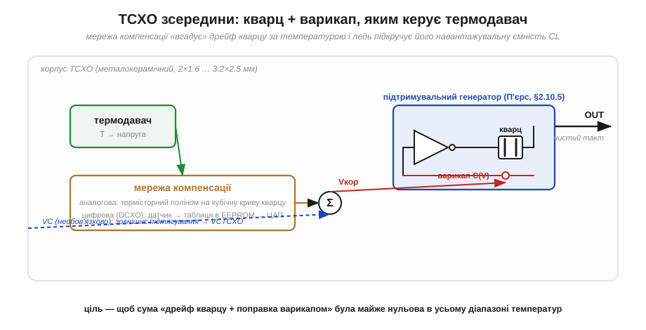
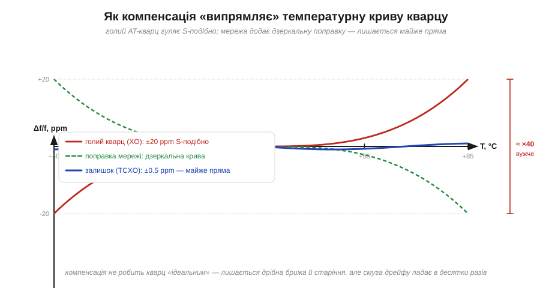

# 🔌 TCXO зсередини: як влаштована термокомпенсація і де такий модуль стоїть

> Головна біда кварцу — він пливе з температурою, і [TCXO](book:electronics/tcxo-ocxo) стоїть на своїй сходинці в піраміді точності саме тому, що цей дрейф приборкує. Зазирнемо в чотириногий корпус: що там, окрім кварцу, як саме мережа компенсації «випрямляє» дрейф, як такий модуль підключають і на чому об нього найчастіше спотикаються.

### Що це за клас пристроїв

**TCXO** (*temperature-compensated crystal oscillator*, термокомпенсований кварцовий генератор) — це готовий генератор у металокерамічному корпусі завбільшки 2×1.6 чи 3.2×2.5 мм, який сам, без жодної допомоги ззовні, тримає частоту проти зміни температури. Голий кварцовий генератор (XO) гуляє на ±20…±50 ppm у робочому діапазоні; TCXO заганяє цей розкид у ±0.5…±2 ppm — у десятки разів вужче. На платі він заступає звичну пару «кварц + два конденсатори» зі [схеми Пірса](book:electronics/pierce-oscillator) там, де такого дрейфу не пробачать: у приймачах [GNSS](book:communications/gnss), радіомодулях із вузьким каналом, базах LoRa, точному відліку часу.

### Що всередині

Зовні це проста коробочка з тактом на виході, але всередині поряд із кварцом сидить ще кілька вузлів — саме вони й роблять його «термокомпенсованим».

*Рис. У корпусі сидить той самий підтримувальний [генератор Пірса](book:electronics/pierce-oscillator) з кварцом, але навантажувальну ємність задає не постійний конденсатор, а **варикап** (*varactor*) — діод, ємність якого керується напругою. Поряд — **термодавач** і **мережа компенсації**: вона за виміряною температурою формує коригувальну напругу Vкор, що ледь підкручує варикап, а з ним і частоту. Необов'язковий вхід VC дозволяє «підтягувати» частоту ще й ззовні — тоді це VCTCXO.*

Уся хитрість — у формі дрейфу. Кварц AT-зрізу пливе не абияк, а за відомою **кубічною** кривою Δf/f(T) із точкою повороту коло +25 °C. Якщо знаєш форму — її можна відняти.

*Рис. Голий кварц (червона S-крива) відхиляється на ±20 ppm. Мережа компенсації генерує дзеркальну поправку (зелена), і їхня сума — майже пряма (синя): лишається лише дрібна брижа недокомпенсації та повільне старіння. Смуга дрейфу падає в десятки разів.*

Як саме рахується поправка — звідси й два підкласи. **Аналоговий TCXO** складає криву з кількох [термісторів](book:electronics/ntc-thermistor) і резисторів: проста аналогова мережа, чий поліном наближає кубіку кварцу. **Цифровий** (DCXO) має давач температури, таблицю поправок у внутрішній EEPROM і ЦАП, що видає напругу на варикап, — точніше, та дорожче.

### Розпіновка й підключення

Хоч би яким способом рахувалася поправка, назовні все це ховається за кількома ногами. Найпоширеніший корпус — **чотири ноги**: **GND**, **VDD**, **OUT** і четверта, що залежить від типу. У простого TCXO це **OE/ST** (*output enable / standby* — вмикання виходу), у VCTCXO — **VC** (вхід керування частотою). Підключення майже як у годинної мікросхеми: живлення на VDD з конденсатором розв'язки 100 нФ упритул до ноги, землю на GND, такт знімається з OUT. Ніякої «обв'язки» кварцом і навантажувальними конденсаторами — усе вже всередині. Вихід буває двох ґатунків: **clipped sine** (обрізаний синус — менше шумить у спектрі, в радіо краще) і повний **CMOS-меандр** (зручний просто як такт). VC, якщо є, лишають на половині живлення через дільник або керують ЦАПом мікроконтролера.

### Перший «байт»

Коду тут нема — TCXO просто видає такт із моменту подання живлення. «Заговорити» з ним означає завести OUT на тактовий вхід приймача чи на чип, дозволити вихід рівнем на OE (якщо така нога є) і пересвідчитися осцилографом, що на OUT є чиста хвиля потрібної частоти. Далі вже сам приймач рахує по ній.

### Типові граблі

Підключення просте, та саме на цій простоті й спотикаються — здебільшого на чотирьох речах.

**Clipped sine — не логічний рівень.** Обрізаний синус має малу амплітуду (близько вольта) і постійне зміщення; цифровий вхід може його не «побачити». Тип виходу беруть під приймач, а не навпаки.

**VC висить — частота пливе.** Залишений «у повітрі» вхід керування ловить наводки, і частота гуляє за ними. Не керуєш ним — притягни до фіксованого рівня.

**Залишковий нахил і гістерезис.** Компенсація не ідеальна: лишається дрібна брижа Δf/f, а ще TCXO має невеликий **термогістерезис** — частота трохи різниться, чи гріли ви його, чи студили до тієї самої температури. Для GNSS це не біда, для еталона — уже важить.

**Старіння нікуди не зникло.** TCXO б'ється тільки з температурою. Повільний відхід частоти з роками ([старіння](book:electronics/frequency-accuracy-ppm)) лишається, тож раз на якийсь час частоту перекалібровують — часто саме через вхід VC.

### Варіації

Остання грабля — про підрівнювання через VC — уже виводить за межі найпростішого модуля: під одним ім'ям «TCXO» ховається ціле сімейство, що різниться саме тим, як його частоту коригують. Простий **TCXO** — фіксована частота, сам себе компенсує. **VCTCXO** додає вхід підстроювання — його «дисциплінують» від точнішого джерела (класика — GPS-disciplined oscillator, де секундний імпульс супутника підрівнює місцевий TCXO). **DCXO/MCXO** — цифрова компенсація для кращих ±0.1 ppm. А коли ±0.5 ppm замало й температуру треба не вгадувати, а **тримати**, кварц саджають у мініатюрний термостат — це вже **OCXO**, інша вагова категорія за точністю, габаритами й апетитом до живлення.

> 🔧 **Навіщо це.** TCXO ставлять, коли дрейф звичайного кварцу зриває зв'язок або відлік часу: приймач GNSS без нього довго шукає супутники, вузькосмугове радіо «з'їжджає» з каналу. Підключення просте — живлення, розв'язка, такт із OUT, — але двічі звірся: тип виходу (clipped sine чи CMOS) під свій вхід і що вхід VC не висить у повітрі. І пам'ятай межу: TCXO рятує від температури, та не від старіння — для довгої точності його ще доводиться зрідка підрівнювати.
