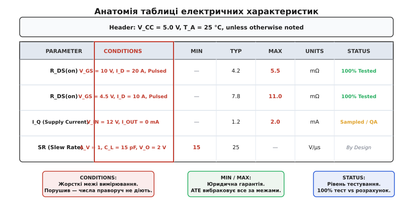
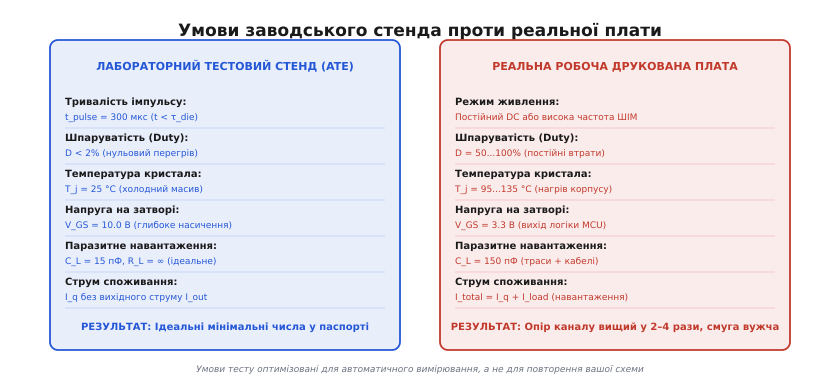
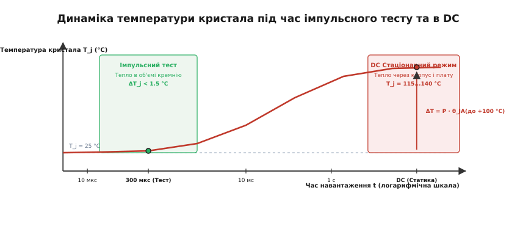
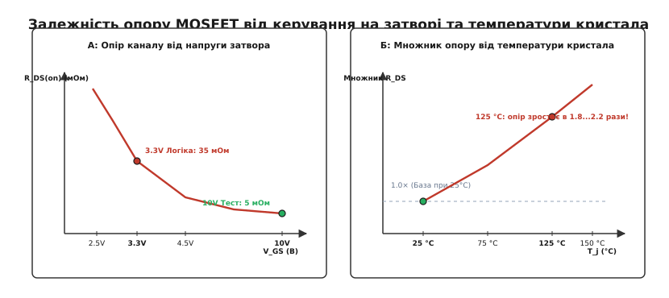

# Анатомія умов тесту в даташиті

<preknowlist>
- [Структура даташита](topic:electronics/datasheet-structure) — загальна будова специфікації та призначення її розділів.
- [Граничні режими](topic:electronics/abs-max-ratings) — різниця між межами фізичного руйнування та діапазоном нормальної роботи.
- [Опір Rds(on)](topic:electronics/rds-on) — канал польового транзистора та фактори, що визначають його провідність.
- [Радіатор](topic:electronics/heatsink) — тепловідвід, потужність розсіювання і тепловий опір переходу.
</preknowlist>

Розробник обирає силовий N-канальний польовий транзистор для комутації двигуна постійного струму з номінальним робочим струмом 12 А. На першій сторінці технічного опису великим жирним шрифтом зазначено: опір відкритого каналу 4.5 мОм, максимальний постійний струм стоку 40 А. Керування затвором подається безпосередньо з виводу мікроконтролера з логічним рівнем 3.3 В. Здавалося б, трикратний запас за струмом гарантує надійність, а очікуване розсіювання потужності на опорі 4.5 мОм не повинно перевищувати 0.65 Вт. Проте на зібраній друкованій платі транзистор розігрівається до температури понад 160 °C і згорає зі спалахом через дві секунди після запуску двигуна.

Причина цієї катастрофи криється не в бракованій деталі й не в помилці паяння. Вона полягає в тому, що число 4.5 мОм було вирвано з контексту вимірювального протоколу. Це значення дійсне виключно за умови, що на затвор подано напругу 10 В, а саме вимірювання проведено коротким поодиноким імпульсом тривалістю 300 мікросекунд при початковій температурі кремнієвого кристала рівно 25 °C. При напрузі затвора 3.3 В транзистор опинився в пологій перехідній зоні, його опір каналу становив 35 мОм, а постійний струм навантаження розігрів кристал до 150 °C. При нагріванні розсіювання електронів на коливаннях кристалічної решітки кремнію подвоїло опір каналу до 70 мОм. Замість очікуваних 0.65 Вт на кристалі виділилося понад 10 Вт теплової потужності, що без масивного радіатора призвело до миттєвого теплового пробою.

Цей випадок формулює фундаментальне метрологічне правило роботи з напівпровідниковою документацією: **жоден числовий параметр у даташиті не є ізольованою фізичною константою компонента**. Кожна цифра в таблиці характеристик — це результат штучного лабораторного експерименту, проведеного за строго зафіксованих граничних умов. Стовпчик «Test Conditions» у специфікації — це метрологічний контракт виробника: гарантії праворуч діють лише за умови точного відтворення електричного й теплового середовища, описаного ліворуч.

---

### Три рівні документації: фізична міцність, довговічність і функціональний контракт

Щоб вільно орієнтуватися в технічній документації та не допускати фатальних помилок при виборі елементної бази, інженер повинен чітко розмежовувати три фундаментальні розділи даташита: Absolute Maximum Ratings, Recommended Operating Conditions та Electrical Characteristics. Кожна з цих таблиць описує принципово різний стан напівпровідникової структури, має різний фізичний зміст та різну юридичну силу.


*Анатомія паспортної таблиці: графа Test Conditions визначає межі дійсності параметрів Min, Typ і Max. Без контролю умов випробування числові значення втрачають практичний зміст.*

Розділ **Absolute Maximum Ratings** визначає крайні межі фізичної міцності твердотільної структури чіпа. Це червона лінія, за якою починаються незворотні руйнівні процеси в кристалі. Якщо гранична напруга затвор-витік зазначена як 20 В, це означає, що при напрузі 20.1 В підшаровий діелектрик діоксиду кремнію `SiO₂` товщиною в кількадесят нанометрів зазнає незворотного тунельного або лавинного пробою з утворенням провідного мікроканалу. Якщо максимальний струм виводу обмежений значенням 100 мА, це означає, що при більшому струмі мікроскопічні алюмінієві чи золоті дротинки внутрішнього розварювання кристала розплавляться або перегорять унаслідок електроміграції атомів металу.

Критично важливо усвідомлювати: перебування приладу в діапазоні Absolute Maximum Ratings **не гарантує збереження працездатності**. Виробник заявляє лише те, що компонент не вибухне і не розпадеться на частини негайно. Усі характеристики точності, коефіцієнти підсилення, часові затримки та логічні рівні можуть повністю вийти за будь-які функціональні норми. Ба більше, тривала робота поблизу абсолютних меж викликає прискорене накопичення дефектів кристалічної ґратки кремнію, деградацію p-n переходів і катастрофічно скорочує час напрацювання на відмову.

Розділ **Recommended Operating Conditions** окреслює безпечний робочий простір, у якому напівпровідникова структура призначена працювати роками без деградації. Це діапазон напруг живлення, вхідних сигналів, струмів навантаження та робочих температур, у межах якого виробник проводить довготривалі випробування на надійність і гарантує збереження ресурсу за законом Арреніуса.

Розділ **Electrical Characteristics** є основним практичним інструментом інженера-розробника. На відміну від перших двох розділів, які задають загальні рамки для всього чіпа в цілому, кожен окремий рядок таблиці Electrical Characteristics є строго індивідуальним функціональним контрактом. Кожен параметр — чи то струм спокою, напруга зміщення, частота зрізу або опір ключа — супроводжується власним стовпчиком **Test Conditions**. Якщо реальні умови на вашій друкованій платі відрізняються від записаних у цьому стовпчику хоча б на один параметр (наприклад, напруга живлення впала на 10% або змінилася ємність навантаження), виробник автоматично звільняється від гарантій дотримання числових значень, зазначених у цьому рядку.

---

### Статистична анатомія стовпчиків: медіана Typ проти обов'язкових меж Min і Max

У таблиці електричних характеристик традиційно наведено чотири стовпчики числових значень: Min (мінімальне значення), Typ (типове значення), Max (максимальне значення) та Units (одиниці вимірювання). За цими колонками стоїть сувора математична статистика напівпровідникового виробництва та алгоритми роботи промислового вихідного контролю якості.

Масове виготовлення мікросхем на кремнієвих пластинах діаметром 200 або 300 мм підпорядковане законам статистичного розкиду. Через мікроскопічні коливання товщини шарів оксиду, локальні флуктуації дози іонного легування та оптичну аберацію лінз фотолітографічних установок параметри окремих транзисторів неминуче відрізняються як у межах однієї пластини, так і між різними виробничими партіями (лотами). Розподіл більшості фізичних параметрів добре описується класичною кривою Гаусса.

```
       Розподіл Гаусса для партії напівпровідників
                   ▲ Кількість приладів у партії
                   │
                   │         ┌─── TYP (медіана 50%)
                   │         │   (НЕ перевіряється в ATE)
                   │         ▼
                   │       ╭───╮
                   │      ╭╯   ╰╮
                   │     ╭╯     ╰╮
       MIN ────────┼────╭╯       ╰╮────┼──────── MAX
(Брак відсікається)│   ╭╯         ╰╮   │ (Брак відсікається)
                   └───┴───────────┴───┴────────► Параметр
                       ◄── Гарантований ──►
                           діапазон ATE
```

Колонка **Typ (Typical)** показує статистичну медіану (50-й процентиль) вибірки при кімнатній температурі для так званого номінального технологічного процесу *(nominal process corner)*. **Стовпчик Typ не має жодної юридичної сили і не забезпечується гарантійними зобов'язаннями виробника.** Це суто інформаційне число. Якщо в даташиті вказано типовий струм споживання мікросхеми 1.0 мА, але при цьому колонка Max порожня, у придбаній вами партії компонентів можуть законно опинитися чіпи зі споживанням 3 мА або навіть 5 мА. Виставити претензію постачальнику чи виробнику в такому разі юридично неможливо, оскільки граничний ліміт Max не був офіційно задекларований.

Стовпчики **Min та Max** — це технологічні межі відбракування *(guard-banded test limits)*. Саме ці числа завантажуються в пам'ять промислових автоматизованих тестерів (ATE — Automated Test Equipment). Під час фінального контролю кожна готова мікросхема автоматично встановлюється маніпулятором у вимірювальне гніздо, тестовий генератор подає задані напруги, а вимірювальний блок фіксує відгук. Якщо хоча б один параметр виходить за межі Min або Max хоча б на один мілівольт чи наноампер, чіп негайно відбраковується.

Промислові тестери на напівпровідникових фабриках працюють в умовах надзвичайно жорстких часових обмежень. На тестування однієї корпусованої мікросхеми виділяється від 5 до 50 мілісекунд. Протягом цього крихітного проміжку часу тестовий автомат повинен перевірити десятки параметрів: струми споживання, напруги зміщення, рівні шумів, логічні рівні, опір ключів і частоту генерації. Забезпечити стаціонарний прогрів чіпа або повільне вимірювання за таких швидкостей фізично й економічно неможливо, оскільки термостатичні камери з рідким азотом чи нагрівачами збільшили б собівартість чіпа в десятки разів. Тому всі процедури контролю на конвеєрі оптимізовані під надшвидкісні імпульсні вимірювання.

Будь-які інженерні розрахунки надійності, аналіз схем за найгіршим випадком *(Worst-Case Circuit Analysis)* та ймовірнісне моделювання за методом Монте-Карло повинні опиратися **виключно на значення Min і Max**. Використання стовпчика Typ припустиме лише для попередньої оцінки на найбільш ранніх етапах розробки.

Крім того, у виносках під таблицею виробники обов'язково розкривають глибину метрологічного контролю:
- **100% Production Tested** — кожен без винятку чіп пройшов апаратне вимірювання цього параметра на виробничому стенді.
- **Sample Tested / Quality Conformance Inspection (QCI)** — параметр перевіряється вибірково на кількох чіпах із кожної пластини для статистичного контролю стабільності техпроцесу.
- **Guaranteed by Design / Characterization** — параметр узагалі не вимірюється на серійній лінії через високу вартість тесту; його відповідність гарантується схемотехнічною топологією та розрахунковим моделюванням кристала.

---

### Теплова метрологія даташита: перехід `T_j`, корпус `T_c` та фізика імпульсного тесту

Найбільш підступним і небезпечним фактором напівпровідникової документації є температура, за якої проводяться паспортні випробування. У шапці практично кожної таблиці міститься стандартний запис: `T_A = 25 °C` або `T_J = 25 °C, unless otherwise noted`.

Для коректного теплового аналізу необхідно чітко розрізняти три температурні рівні:
1. `T_A` *(Ambient Temperature)* — температура навколишнього середовища (повітря навколо плати всередині корпусу приладу).
2. `T_C` *(Case Temperature)* — температура зовнішньої поверхні пластикового або металевого корпусу чіпа.
3. `T_J` *(Junction Temperature)* — температура активної зони кремнієвого кристала (каналу польового транзистора або p-n переходу).


*Розбіжність між заводським тестом і реальною платою: тестер вимірює холодний кристал короткочасним імпульсом, тоді як у схемі транзистор нагрівається власним струмом.*

Під час протікання робочого струму електрична потужність втрат `P` перетворюється на тепло безпосередньо в мікроскопічному об'ємі кремнію. Стаціонарний нагрів переходу відносно навколишнього повітря визначається повним тепловим опором ланцюга від кристала через корпус і радіатор до повітря:

```
T_J = T_A + P · θ_JA                  [температура переходу в стаціонарному режимі]
```

Якщо транзистор або інтегральний стабілізатор розсіює всього 2.0 Вт у стандартному корпусі SO-8 з тепловим опором «перехід–середовище» `θ_JA = 55 °C/Вт` при температурі повітря всередині закритого корпусу приладу `T_A = 50 °C`, реальна температура кристала сягає:

```
T_J = 50 + 2.0 · 55
    = 50 + 110
    = 160 °C                          [критична робоча температура кристала]
```

При температурі 160 °C фізичні характеристики напівпровідникового кремнію зазнають кардинальних змін відносно початкового кімнатного стану:
- Інтенсивне розсіювання вільних електронів на теплових коливаннях кристалічної ґратки (акустичних фононах) зменшує рухливість носіїв заряду, унаслідок чого опір каналу польового транзистора `R_DS(on)` збільшується у 1.8–2.3 рази.
- Струми зворотного витоку p-n переходів та діодів Шотткі зростають за експоненційним законом, збільшуючись у сотні й тисячі разів.
- Пряма напруга відкриття переходів база-емітер `V_BE` та діодів зменшується зі швидкістю приблизно `−2 мВ/°C`.
- Вхідні струми витоку польових затворів CMOS і JFET подвоюються на кожні 10 °C підвищення температури.

Як же тоді виробники отримують ідеальні паспортні характеристики при струмах у 50–100 А, записуючи в таблицю значення `T_J = 25 °C`?

Для цього застосовують технологію **імпульсного тестування (Pulsed Test)**. Тестовий автомат подає робочий струм через кристал у формі поодинокого прямокутного імпульсу тривалістю `t_pulse ≈ 300 мкс` із дуже низькою шпаруватістю (`Duty cycle < 2%`).


*Часова динаміка нагріву: за 300 мкс тепло не встигає вийти за межі кристала, тому прилад тестується ідеально холодним.*

Теплова стала часу власне кремнієвого кубика товщиною 300 мкм становить близько 500–800 мкс, а теплова стала корпусу й радіатора вимірюється десятками секунд. За 300 мікросекунд теплова енергія, що виділилася в каналі, встигає поширитися лише на товщину самої кремнієвої пластини (глибина дифузії менше 330 мкм) і взагалі не встигає дійти до шару припою та мідного тепловідводу корпусу. Приріст температури кристала за час такого імпульсу не перевищує 0.5–1.0 °C. Детальний математичний апарат поширення тепла в кремнії та формули розрахунку імпульсного імпедансу наведено у [виведенні нестаціонарного теплового імпедансу кристала](topic:electronics/test-conditions-anatomy/math-pulsed-junction.md).

Тому напис `T_J = 25 °C, Pulsed` означає: параметр виміряно на штучно знерухомленому, ідеально холодному кремнії. У реальній схемі з постійним струмом навантаження кристал неминуче прогріється до стаціонарної температури, і його характеристики значно деградують відносно паспортного рядка.

---

### Електричні тестові умови: напруги зміщення, струми та паразитні навантаження

Параметри будь-якого напівпровідникового компонента є динамічною реакцією на конкретне електричне оточення, в якому проводиться вимірювання. Зміна будь-якої напруги, струму чи паразитного опору в контурі тестера спотворює кінцевий результат.

#### 1. Напруги зміщення та нелінійні міжкаскадні ємності
Більшість динамічних характеристик напівпровідників є нелінійними функціями прикладеної напруги. Наприклад, вихідна ємність польового транзистора `C_oss` та прохідна ємність зворотного зв'язку `C_rss` (ємність Міллера) утворюються збідненими шарами p-n переходів. Товщина збідненого шару `W_dep` збільшується пропорційно кореню квадратному з прикладеної напруги сток-витік `V_DS`:

```
W_dep ∝ √(V_DS)                       [товщина збідненого діелектричного шару]
C_dep = (ε · A) / W_dep ∝ 1 / √(V_DS) [ємність переходу]
```

У паспорті значення `C_oss` часто вказують для високої напруги `V_DS = 25 В` або `V_DS = 50 В`, де ємність збідненого шару мінімальна (наприклад, 120 пФ). Проте в процесі ввімкнення транзистора, коли напруга на стоці падає до часток вольта (`V_DS → 0 В`), збіднений шар звужується, а ємність різко зростає у 5–15 разів (до 1500–2000 пФ). Розрахунок часу перемикання або заряду затвора за паспортним значенням при 25 В дасть грубу похибку в оцінці комутаційних втрат.

#### 2. Опори та ємності тестового навантаження (`R_L`, `C_L`)
Усі швидкісні часові характеристики (час наростання `t_r`, час спаду `t_f`, затримка поширення `t_pd`, час встановлення `t_settling`) наводяться для фіксованого лабораторного еквівалента навантаження.

У документації на логічні вентилі та інтерфейсні мікросхеми стандартним тестовим навантаженням є ємність `C_L = 15 пФ` або `C_L = 50 пФ`. Значення 15 пФ відповідає високоякісному активному щупу осцилографа з короткою земляною пружиною безпосередньо на тестовій платі. Якщо ж на реальній платі вихід мікросхеми навантажений на розгалужену друковану трасу, захисні діоди та кілька входів приймачів, сумарна ємність легко перевищує 100–200 пФ. Оскільки час наростання фронту пропорційний добутку вихідного опору на ємність:

```
t_r ≈ 2.2 · R_out · C_L               [час наростання фронту сигналу]
```

швидкість передачі сигналів різко знизиться, виникнуть фазові затримки шини, а динамічне енергоспоживання каскаду зросте.

#### 3. Синфазні напруги та частотна залежність придушення завад
В аналогових компонентах такі параметри, як коефіцієнт послаблення синфазного сигналу (CMRR) та коефіцієнт нестабільності живлення (PSRR), у таблицях наводяться для постійного струму (DC) або низьких частот (100 Гц).

На високих частотах (вище 10 кГц) через паразитні ємності між виводами корпусу та внутрішніми вузлами кристала CMRR і PSRR стрімко падають — часто на 40–60 дБ. Підсилювач, який на постійному струмі мав коефіцієнт придушення перешкод живлення 100 дБ, на частоті роботи імпульсного перетворювача 100 кГц має PSRR лише 30 дБ, безперешкодно пропускаючи всі високочастотні пульсації на свій вихід.

---

### Область безпечної роботи (SOA): імпульсні лінії проти межі Спіріто

Ще одна зона підвищеної небезпеки при читанні даташитів на силові транзистори — це графік області безпечної роботи *(Safe Operating Area, SOA)*. Цей графік визначає допустимі комбінації напруги сток-витік `V_DS` та струму стоку `I_D`, які прилад здатен витримати без виходу з ладу.

На графіку SOA нанесено сімейство кривих для різних тривалостей імпульсу: 10 мкс, 100 мкс, 1 мс, 10 мс і суцільна лінія постійного струму (DC). Кожна лінія обмежена кількома фізичними бар'єрами:
1. **Ліміт опору каналу `R_DS(on)`** (нахилена лінія зліва вгорі): транзистор повністю відкритий, струм обмежений виключно внутрішнім опором кремнію.
2. **Ліміт максимального струму виводів та розварювання** (горизонтальна лінія вгорі): струм обмежений плавленням металізації.
3. **Ліміт максимальної теплової потужності кристала** (лінія з нахилом `P = const`): максимальне виділення тепла, що не перевищує `T_j(max)`.
4. **Ліміт лавинного пробою `BV_DSS`** (вертикальна лінія справа): максимальна зворотна напруга напівпровідникової структури.

Проте для сучасних транзисторів із високою щільністю комірок *(trench MOSFET)* існує додаткова підступна зона — **лінія термічної нестійкості Спіріто (Spirito effect)**. У лінійному режимі (наприклад, при роботі в електронному навантаженні, лінійному стабілізаторі або в процесі повільного ввімкнення) порогова напруга відкриття транзистора `V_GS(th)` має негативний температурний коефіцієнт: чим гарячіша ділянка кристала, тим нижча її порогова напруга і тим більший струм через неї тече.

У результаті виникає локальна шнурівка струму: весь струм кристала стягується в крихітну гарячу точку діаметром у частки міліметра. Транзистор локально розплавляється за потужності, яка в рази менша за теоретичний тепловий ліміт чіпа. На графіку SOA цей ефект проявляється як різкий крутий злам імпульсних і постійних кривих при високих напругах `V_DS`. Лінія DC SOA за високої напруги стрімко падає вниз, показуючи, що транзистор із паспортним струмом 100 А при напрузі 40 В у стаціонарному лінійному режимі не здатен витримати навіть 1.5 А.

---

### Чотири критичні інженерні пастки даташитів

Неуважність до стовпчика Test Conditions є найчастішою причиною відмов електронної апаратури на етапі серійного виробництва. Систематичний порівняльний аналіз підводних каменів для різних класів деталей наведено в [порівнянні тестових режимів із робочими](topic:electronics/test-conditions-anatomy/comp-test-traps.md).


*Подвійна пастка MOSFET: падіння напруги на затворі нижче 4.5 В експоненційно збільшує опір каналу, а нагрів кристала до 125 °C подвоює його ще раз.*

#### Пастка 1: Опір каналу MOSFET `R_DS(on)` проти напруги затвора 3.3 В
Найпоширеніша помилка — пряме керування потужним польовим транзистором від 3.3-вольтового виводу мікроконтролера, коли в специфікації транзистора вказано привабливий опір каналу 4 мОм.

Якщо уважно прочитати рядок Test Conditions, виявиться, що цей опір гарантується лише при напрузі затвора `V_GS = 10 В`. Для формування низькоомного інверсійного каналу напруга на затворі має суттєво перевищувати порогову напругу `V_GS(th)`. При напрузі 3.3 В транзистор ледь відкривається: опір каналу становить не 4 мОм, а 30–50 мОм. При протіканні робочого струму на транзисторі падає значна напруга, він розігрівається, опір зростає додатково у 2 рази через нагрів, і транзистор згорає від теплового пробою. Для роботи з логікою 3.3 В необхідно обирати транзистори класу Logic-Level з явно задекларованим рядком `R_DS(on)` при `V_GS = 2.5 В` або `V_GS = 1.8 В`.

#### Пастка 2: Струм спокою операційного підсилювача `I_Q` без урахування навантаження
У паспортах на прецизійні та мікропотужні операційні підсилювачі виробники підкреслюють мінімальний струм споживання, наприклад `I_Q = 800 нА`. Розробник закладає цей підсилювач у бездротовий автономний давач, розраховуючи на роки роботи від літієвої батареї.

Але в графі умов випробування чітко записано: `I_OUT = 0 мА, V_OUT = Mid-Supply`. Струм `I_Q` вимірюється тоді, коли вихід підсилювача повністю відімкнений від навантаження. Щойно підсилювач підключають до дільника зворотного зв'язку 20 кОм або входу АЦП, вихідний каскад починає віддавати струм у навантаження. Загальний струм, що відбирається від джерела живлення, дорівнює:

```
I_total = I_Q + |I_OUT|               [загальний струм споживання мікросхеми]
```

Якщо вихідна напруга становить 2.0 В на опорі 10 кОм, струм навантаження дорівнює 200 мкА, що у 250 разів перевищує паспортний струм спокою. Батарея приладу виснажиться за лічені дні замість запланованих років.

#### Пастка 3: Смуга пропускання (GBW) та межа швидкості наростання (Slew Rate)
У заголовку даташита на операційний підсилювач зазначено привабливу смугу пропускання `GBW = 12 МГц`. Інженер планує використати його для підсилення синусоїдального сигналу з частотою 1.5 МГц та амплітудою 4 В.

Однак смуга GBW вимірюється в режимі **малого сигналу (Small-Signal)** при амплітуді виходу не більше 50–100 мВ, де внутрішні каскади працюють у строго лінійному режимі без насичення струму коригувального конденсатора. Для сигналів великої амплітуди максимальна швидкість наростання напруги обмежена параметром `Slew Rate (SR)`:

```
SR = I_tail / C_comp                  [швидкість наростання вихідної напруги]
```

Максимальна частота неспотвореного синусоїдального сигналу повної амплітуди `V_peak` визначається співвідношенням повної смуги потужності *(Full-Power Bandwidth, FPBW)*:

```
FPBW = SR / (2 · π · V_peak)          [смуга повної потужності]
```

Якщо підсилювач зі смугою 12 МГц має швидкість наростання `SR = 1.2 В/мкс`, то для вихідної амплітуди `V_peak = 4 В` максимальна частота синусоїди без спотворень становить:

```
FPBW = 1.2 · 10⁶ / (2 · π · 4)
     = 1.2 · 10⁶ / 25.132
     ≈ 47.7 кГц
```

На частотах вище 48 кГц підсилювач не встигає відпрацьовувати крутизну синусоїди, його вихідний сигнал перетворюється на спотворений трикутник зі зменшеною амплітудою, а на частоті 1.5 МГц амплітуда виходу впаде практично до нуля.

#### Пастка 4: Вхідні ємності та ефект Міллера при комутації
Для польових транзисторів часто наводять статичну вхідну ємність `C_iss = C_GS + C_GD`, виміряну на частоті 1 МГц при фіксованій напрузі на стоці. Розробник розраховує час перезаряду затвора, виходячи з паспортного значення `C_iss = 800 пФ`.

Проте під час реального перемикання напруга на стоці змінюється на десятки вольт. Зміна напруги на прохідній ємності `C_GD` призводить до появи ефекту Міллера. Еквівалентна динамічна ємність затвора на ділянці перемикання зростає у десятки разів, утворюючи так звану «полку Міллера» *(Miller Plateau)* на графіку напруги затвора. Драйвер затвора з малим вихідним струмом зависає на цій полці, через що транзистор проводить тривалий час в активній зоні одночасно під високою напругою і високим струмом, що генерує колосальні комутаційні втрати. Перевірити роботу транзистора в реальних імпульсних умовах дозволяє [програма імпульсного тестера ВАХ](topic:electronics/test-conditions-anatomy/proj-pulsed-iv-curve.md).

---

### Чотирикроковий протокол аналізу технічної документації

Щоб унеможливити помилки, пов'язані з некоректним читанням даташитів, кожен інженер повинен застосовувати строгий протокол верифікації параметрів:

```
                       АЛГОРИТМ ВЕРИФІКАЦІЇ ДАТАШИТА
                                     │
                                     ▼
        ┌─────────────────────────────────────────────────────────┐
        │ 1. Сканування заголовка таблиці:                        │
        │    V_supply, початкова температура T_A / T_J, живлення  │
        └────────────────────────────┬────────────────────────────┘
                                     │
                                     ▼
        ┌─────────────────────────────────────────────────────────┐
        │ 2. Читання графи "Test Conditions":                     │
        │    Напруги керування, струми, опір та ємність нагрузки │
        └────────────────────────────┬────────────────────────────┘
                                     │
                                     ▼
        ┌─────────────────────────────────────────────────────────┐
        │ 3. Перерахунок на робочу температуру T_J:               │
        │    T_J = T_A + P · θ_JA; дератинг опорів та витоків     │
        └────────────────────────────┬────────────────────────────┘
                                     │
                                     ▼
        ┌─────────────────────────────────────────────────────────┐
        │ 4. Вибір стовпчика для розрахунку:                      │
        │    Тільки MIN або MAX залежно від найгіршого випадку    │
        └─────────────────────────────────────────────────────────┘
```

1. **Крок 1: Перевірка загального заголовка таблиці.** Перш ніж дивитися на значення параметрів, з'ясуйте базові умови випробування розділу. Якщо вказано `V_CC = 5 В, T_A = 25 °C`, а ваша система працює від 3.3 В при 70 °C, табличні дані не діють напряму.
2. **Крок 2: Детальний аналіз стовпчика Test Conditions.** Знайдіть рядок необхідного параметра і випишіть точні тестові напруги, струми та еквівалентні ємності навантаження. Знайдіть у розділі графіків *(Typical Characteristics)* криві залежності параметра від напруги та температури.
3. **Крок 3: Тепловий розрахунок робочої точки кристала.** Обчисліть очікувану потужність втрат у схемі та визначте стаціонарну температуру переходу `T_J = T_A + P · θ_JA`. Застосуйте коефіцієнти дератингу для опору каналу, швидкодії та зворотних струмів витоку.
4. **Крок 4: Розрахунок схеми за найгіршим випадком.** Закладайте в проект виключно граничні значення зі стовпчиків Min або Max. Для споживаних струмів, опорів каналу, часів затримок і шумів розрахунок ведеться за лімітом Max; для коефіцієнтів підсилення, швидкості наростання та порогових напруг — за лімітом Min.

---

### 🔧 Навіщо це

> 🔧 **Навіщо це.** Вміння читати стовпчик Test Conditions перетворює схемотехніку з небезпечного вгадування на точну інженерну дисципліну. Запам'ятайте чотири ключові правила. **Перше:** значення Typ — це статистична медіана процесу без юридичних зобов'язань виробника; проектний розрахунок ведуть виключно за межами Min та Max. **Друге:** паспортні струми та опори силових компонентів вимірюються імпульсом 300 мкс на холодному кристалі `T_J = 25 °C`; у тривалому режимі реальний опір буде вищим у 1.5–2.5 рази через робочий нагрів. **Третє:** швидкодія підсилювачів і цифрових мікросхем вимірюється на штучно малих навантаженнях `15 пФ` і малих сигналах; на великих амплітудах швидкість обмежує Slew Rate. **Четверте:** у напівпровідниках немає абсолютних чисел — є лише поведінка структури за строго визначених умов випробування. Інженер, який перевіряє умови тесту до виготовлення друкованої плати, створює пристрої, що працюють безвідмовно у всій серії за будь-яких температур.
