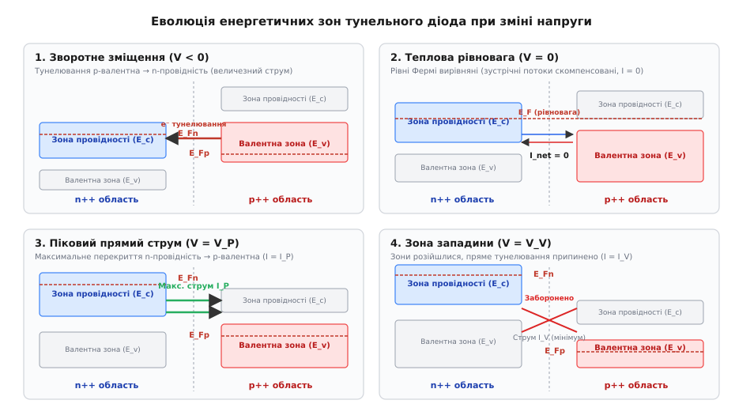
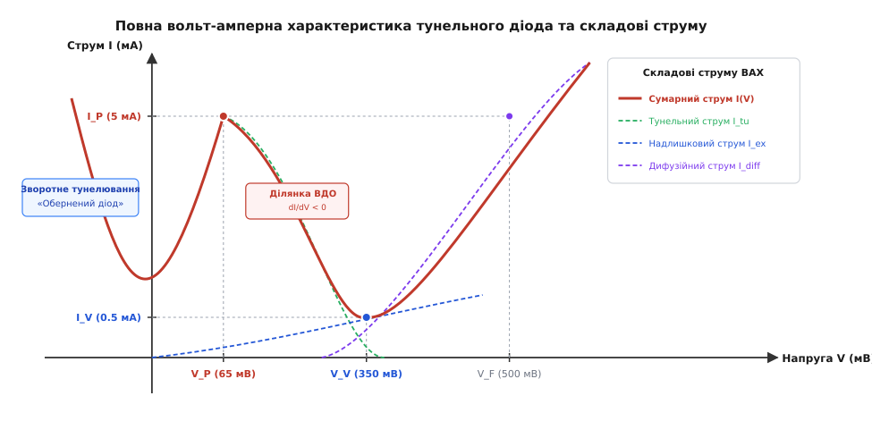
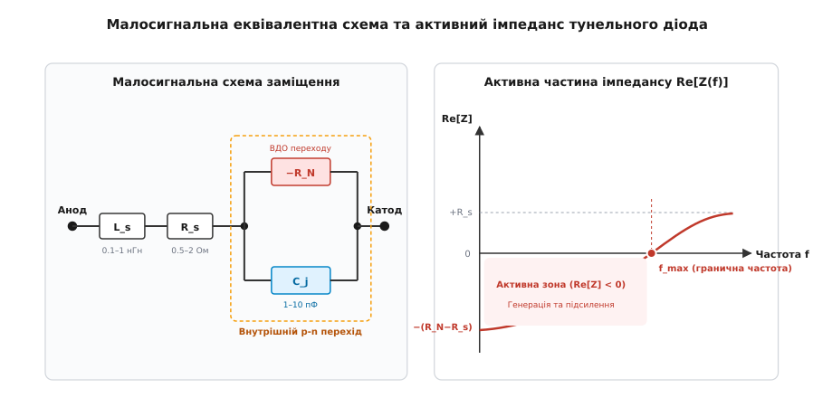
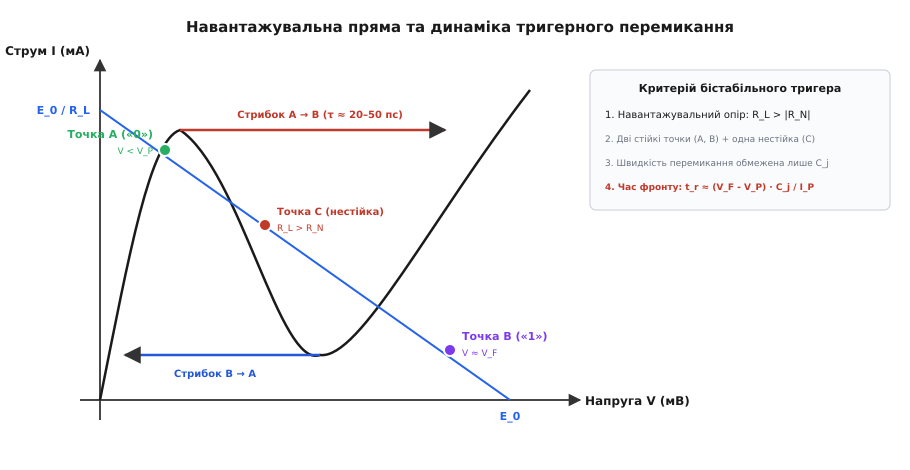

# Тунельний діод (діод Лео Есакі)

<preknowlist>
- [p-n перехід](book:physics/pn-junction) — контакт напівпровідників p- та n-типу, збіднена область і контактна різниця потенціалів.
- [Квантове тунелювання](book:physics/quantum-tunnelling) — проходження мікрочастинки крізь потенціальний бар'єр скінченної ширини без подолання його класичної висоти.
- [Зонна теорія напівпровідників](book:physics/semiconductor) — валентна зона, зона провідності, заборонена зона та положення рівня Фермі.
- [ВАХ діода](book:electronics/diode-iv-curve) — класична експоненційна вольт-амперна характеристика та дифузійний струм напівпровідникового переходу.
- [Від'ємний диференційний опір](book:physics/negative-differential-resistance) — спадна ділянка dI/dV < 0 та умови виникнення автоколивань і бістабільності в електричних колах.
</preknowlist>

У високочастотних радіотрактах та стробоскопічних осцилографах класичні випрямні діоди й біполярні транзистори натикаються на жорстку фізичну межу: процес інжекції та розсмоктування неосновних носіїв заряду триває одиниці або десятки наносекунд. Навіть найшвидші діоди Шотткі обмежуються часом перезаряджання бар'єрної ємності. Коли в 1957 році японський фізик Лео Есакі (лат. *Leo Esaki*, яп. 江崎 玲於奈) спробував вивчити поведінку германієвих діодів із гранично високим рівнем легування, кристал показав неочікувану аномалію: при зростанні прямої напруги струм крізь прилад не зростав, а стрімко падав. Так виник тунельний діод — прилад, у якому електрони долають заборонену зону шляхом прямого квантового тунелювання зі швидкістю світлової хвилі, забезпечуючи перемикання за десятки пікосекунд і генерацію коливань на частотах у десятки гігагерців.

### Фізичний глухий кут класичного p-n переходу

Звичайний напівпровідниковий p-n перехід функціонує за рахунок теплової інжекції носіїв через потенціальний бар'єр. Коли до переходу прикладають пряму напругу, висота бар'єра зменшується, і електрони з n-області разом із дірками з p-області дифундують у протилежні напівпровідникові шари. Там вони стають неосновними носіями заряду.

Головна вада цього механізму для імпульсної та мікрохвильової техніки полягає в інерційності. Щоб діод закрився при раптовій зміні полярності напруги на зворотну, впорснуті неосновні носії повинні рекомбінувати або витекти назад під дією електричного поля. Цей процес займає час зворотного відновлення, який у стандартних кремнієвих діодах становить від кількох наносекунд до мікросекунд.

Спроба зменшити цей час шляхом радикального збільшення концентрації легуючих домішок несподівано змінила сам фундаментальний механізм провідності. Замість очікуваного класичного випрямлення кристал почав проводити струм за рахунок квантовомеханічного підбар'єрного проникнення.

### Вироджений стан напівпровідника (p++ та n++)

У звичайних напівпровідниках концентрація донорних або акцепторних домішок становить `10¹⁴–10¹⁶ см⁻³`. За таких умов рівень Фермі (енергетичний рівень, імовірність заповнення якого електронами за температури абсолютного нуля дорівнює одиниці, а за вищих температур — 0.5) розташований усередині забороненої зони: ближче до дна зони провідності в n-типі або ближче до стелі валентної зони в p-типі.

У тунельних діодах застосовують надважке легування (позначається як `n⁺⁺` та `p⁺⁺`), за якого концентрація домішок сягає `10¹⁹–10²⁰ см⁻³`. Це означає, що атом домішки заміщує вузол кристалічної ґратки через кожні кілька десятків атомів основного напівпровідника (германію `Ge`, арсеніду галію `GaAs`, антимоніду галію `GaSb` або кремнію `Si`).

За такого екстремального легування відстань між сусідніми атомами домішки стає меншою за ефективний борівський радіус зв'язаного електрона (`r_B ≈ 3–5 нм`). Хвильові функції сусідніх домішкових центрів починають сильно перекриватися. Відбувається квантовий перехід Мотта (перехід ізолятор–метал), і дискретні рівні домішок розмиваються у суцільну домішкову зону, яка зливається з краями дозволених зон.

Напівпровідник переходить у **вироджений стан** (англ. *degenerate semiconductor*, від лат. *degenerare* — вироджуватися, втрачати специфічні вихідні властивості):
1. **На n-боці (`n⁺⁺`):** Домішкова зона повністю зливається з дном зони провідності `E_c`. Рівень Фермі `E_Fn` занурюється **всередину дозволеної зони провідності** на глибину кількох десятих часток електронвольта (`E_Fn − E_c ≈ 0.05–0.25 еВ`). Нижні енергетичні рівні зони провідності виявляються повністю заповненими електронами навіть за температури абсолютного нуля.
2. **На p-боці (`p⁺⁺`):** Акцепторна зона зливається зі стелею валентної зони `E_v`, а рівень Фермі `E_Fp` опускається **всередину дозволеної валентної зони** (`E_v − E_Fp ≈ 0.05–0.25 еВ`). У верхній частині валентної зони виникає висока концентрація незаповнених квантових станів (вільних дірок).

Крім того, сильне кулонівське екранування носіїв та обмінна взаємодія електронів призводять до ефекту звуження забороненої зони (BGN — *Bandgap Narrowing*): ефективна ширина забороненої зони `E_g` зменшується на 50–100 меВ порівняно з чистим кристалом. У результаті виродження обидва боки переходу набувають металоподібної провідності за рахунок мажоритарних носіїв заряду.

### Ультратонкий збіднений шар

Ширина області просторового заряду (збідненого шару) `W` на межі металургійного переходу обернено пропорційна квадратному кореню з концентрації іонізованих домішок:

```
W = √[ (2 · ε · ε₀ · (V_bi − V)) / q · (1 / N_A + 1 / N_D) ]
```

де `ε` — відносна діелектрична проникність напівпровідника, `ε₀` — електрична стала, `V_bi` — контактна різниця потенціалів (вбудований потенціал), `V` — прикладена зовнішня напруга, `N_A` та `N_D` — концентрації акцепторів і донорів.

У звичайних випрямних діодах ширина збідненої зони становить від `0.5` до `5 мкм`. Проте при концентраціях `N_A, N_D > 10¹⁹ см⁻³` товщина бар'єра різко стискається:

```
W_tunnel ≈ 5–10 нм
```

Відстань у `5–10 нм` відповідає лише 20–40 атомним моношарам кристала. На такій мікроскопічній товщині вбудована контактна різниця потенціалів `V_bi ≈ 0.8–1.2 В` створює колосальну напруженість електричного поля:

```
E_field ≈ V_bi / W ≈ 1.0 В / (10 · 10⁻⁷ см) = 10⁶ В/см (100 кВ/мм)
```

Ширина бар'єра стає сумірною з дебройлівською довжиною хвилі електрона в напівпровіднику (`λ_dB ≈ 5–15 нм`). За таких умов електрон більше не поводиться як класична локалізована частинка, що мусить перестрибнути через енергетичний пагорб: квантовомеханічна хвильова функція електрона здатна вільно просочуватися крізь заборонену зону шляхом прямого тунелювання.


*Енергетичні зонні діаграми тунельного p-n переходу при зміні напруги: 1 — зворотне зміщення з прямим тунелюванням валентних електронів у зону провідності; 2 — стан теплової рівноваги з нульовим результуючим струмом; 3 — піковий струм при максимальному збігу зон; 4 — розходження зон у зоні западини.*

### П'ять режимів зміщення та механізм квантового тунелювання

Щоб квантове міжзонне тунелювання відбулося, мають одночасно виконуватися три фундаментальні фізичні умови:
1. На тому боці, звідки рухається електрон, мають бути **заповнені квантові стани** на певному енергетичному рівні `E`.
2. На протилежному боці переходу на **тому самому енергетичному рівні `E`** (за законом збереження повної енергії) мають існувати **вільні дозволені квантові стани** (порожні діркові рівні).
3. Товщина просторового бар'єра має бути достатньо малою (`W < 10 нм`), щоб хвильовий хвіст затухаючої експоненти мав значну амплітуду на протилежній межі. Крім того, має зберігатися поперечна складова квазіімпульсу електрона (`k_perp = const`).

Еволюція взаємного розташування зон при зміні напруги дозволяє виділити п'ять послідовних режимів роботи тунельного діода.

#### 1. Зворотне зміщення (V < 0)

Коли до анода (p-область) прикладають мінус, а до катода (n-область) плюс, енергетичні рівні p-боку зміщуються вгору відносно рівнів n-боку на величину `q · |V|`.

У результаті заповнені електрони валентної зони p-області опиняються на одній висоті з порожніми дозволеними станами зони провідності n-області. Електрони масово тунелюють крізь надвузький бар'єр із валентної зони p в зону провідності n.

При збільшенні зворотної напруги енергетичне перекриття зон лише розширюється, а ширина бар'єра під сильним полем додатково тоншає. Зворотний струм стрімко наростає вже при частках мілівольта без будь-яких ознак лавинного пробою. Оскільки діод відмінно проводить зворотний струм і не має порогу відмикання, такий режим використовують у так званих **обернених діодах** (англ. *backward diode*) для надчутливого детектування слабких НВЧ сигналів.

#### 2. Теплова рівновага (V = 0)

За відсутності зовнішньої напруги рівні Фермі обох областей вирівнюються в єдину ізоенергетичну лінію: `E_Fn = E_Fp`. 

Заповнені стани зони провідності n-області розташовані навпроти заповнених станів валентної зони p-області. Оскільки всі протилежні стани зайняті, тунелювання заблоковане принципом заборони Паулі. На краях рівнів Фермі відбуваються слабкі зустрічні теплові квантові переходи, проте потік електронів з n у p строго дорівнює зустрічному потоку з p в n. Результуючий струм у зовнішньому колі дорівнює нулю: `I_net = 0`.

#### 3. Прямий зсув: наростання струму до піку (0 < V ≤ V_P)

При поданні невеликої прямої напруги (плюс на p-область, мінус на n-область) енергетичні зони n-боку зміщуються вгору на величину `q · V` відносно p-боку.

Електрони, що заповнюють зону провідності n-області між дном зони `E_c` та рівнем Фермі `E_Fn`, опиняються строго навпроти вільних дозволених станів у валентній зоні p-області (між стелею `E_v` та рівнем `E_Fp`). Виникає прямий тунельний перехід електронів: `n(провідність) → p(валентна)`.

У міру зростання напруги область енергетичного перекриття збільшується. Струм швидко зростає за лінійним, а згодом сублінійним законом, досягаючи максимального значення — **пікового струму `I_P`** при **піковій напрузі `V_P`** (типово `V_P ≈ 50–70 мВ` для германію та `100–150 мВ` для арсеніду галію).

Детальний історичний опис того, як Лео Есакі вперше зафіксував цей пік під час вивчення германієвих структур у компанії Sony, наведено у вставці [📜 Історія відкриття Лео Есакі](book:electronics/tunnel-diode/hist-esaki.md).

#### 4. Прямий зсув: від'ємний диференційний опір (V_P < V < V_V)

Якщо продовжувати збільшувати пряму напругу понад `V_P`, зони n-боку піднімаються ще вище. Дно зони провідності n-області починає виходити вище за стелю валентної зони p-області.

Кількість заповнених станів n-провідності, розташованих навпроти вільних діркових рівнів p-валентної зони, починає стрімко зменшуватися. Що більшу напругу прикладає джерело, то менше електронів знаходять дозволені вільні стани на протилежному боці переходу на своєму енергетичному рівні.

У результаті зростання напруги призводить до **зменшення струму**. Виникає ділянка **від'ємного диференційного опору (ВДО)** (англ. *Negative Differential Resistance*, NDR):

```
R_N = (dI / dV)⁻¹ < 0,   G_N = dI / dV < 0
```

Цей спад струму триває доти, доки дно зони провідності `E_c(n)` повністю не підніметься вище за стелю валентної зони `E_v(p)`. Тоді пряме міжзонне тунелювання повністю припиняється.

#### 5. Зона западини та відновлення дифузійної провідності (V ≥ V_V)

Коли пряма напруга досягає **напруги западини `V_V`** (англ. *valley voltage*, типово `300–400 мВ` для `Ge` та `500–600 мВ` для `GaAs`), пряме квантове тунелювання стає фізично неможливим: навпроти зони провідності n-боку розташована заборонена зона p-боку, де вільних квантових станів немає.

Струм діода падає до свого локального мінімуму — **струму западини `I_V`** (англ. *valley current*).

При подальшому збільшенні напруги `V > V_V` зовнішнє поле суттєво знижує електростатичний потенціальний бар'єр переходу. Починається класична термоемісія та дифузійна інжекція електронів над бар'єром. Струм знову починає експоненційно зростати за класичним законом Шоклі, як у звичайному випрямному діоді. Напругу на цій ділянці, за якої прямий струм знову зрівнюється з піковим значенням `I_P`, називають **напругою прямого відновлення `V_F`** (англ. *forward voltage*, типово `0.5–1.1 В`).


*Вольт-амперна характеристика тунельного діода: результуючий N-подібний струм I(V) складається з міжзонного тунельного струму I_tu, надлишкового струму дефектів I_ex та класичного теплового струму інжекції I_diff.*

### Анатомія повної вольт-амперної характеристики

Реальний струм тунельного діода на прямій гілці складається з трьох незалежних фізичних компонентів:

```
I_total(V) = I_tu(V) + I_ex(V) + I_diff(V)
```

1. **Тунельний струм `I_tu(V)`:** Описується міжзонним інтегралом Есакі. Швидко зростає від нуля до піку `I_P` при напрузі `V_P` і спадає до нуля при напругах, близьких до `V_V`.
2. **Надлишковий струм `I_ex(V)` (Excess Current):** У реальних напівпровідниках струм у точці западини `I_V` ніколи не дорівнює теоретичному нулю. Причиною є ступінчасте тунелювання через глибокі енергетичні рівні домішок та дефектів кристалічної ґратки, розташованих усередині забороненої зони. Електрон тунелює з зони провідності на дефектний рівень пастки, а звідти рекомбінує у валентну зону. Що чистіший монокристал і менше дефектів легування, то менший надлишковий струм і глибша западина.
3. **Дифузійний струм `I_diff(V)`:** Класичний струм термоемісії носіїв над бар'єром Шоклі:
   ```
   I_diff(V) = I_0 · [ exp( (q · V) / (n · k_B · T) ) − 1 ]
   ```

Головним критерієм якості тунельного діода є **коефіцієнт відношення пікового струму до струму западини (PVCR)**:

```
PVCR = I_P / I_V
```

Що вище значення `PVCR`, то більший динамічний діапазон і вища вихідна потужність автогенератора або надійність спрацьовування тригера.

Математичне виведення прозорості бар'єра у наближенні ВКБ та аналітичний розрахунок екстремумів струму викладено у вставці [🧮 Квантовий розрахунок тунельного струму та граничних частот](book:electronics/tunnel-diode/math-tunnel-current.md).

### Концепція оберненого діода (Backward Diode)

Особливим різновидом тунельного переходу є **обернений діод** (англ. *backward diode*, або *back diode*). У ньому рівень легування підбирають таким чином, щоб одна з областей була виродженою, а протилежна перебувала рівно на межі виродження (`E_Fn ≈ E_c` або `E_Fp ≈ E_v`).

За такої зонної структури:
- На прямій гілці прямий тунельний пік майже повністю редукований або має мізерну амплітуду, і діод відкривається лише при класичній дифузійній напрузі `0.4–0.6 В`.
- На зворотній гілці міжзонне квантове тунелювання вмикається миттєво при найменшій зворотній напрузі (`|V| > 1 мВ`), забезпечуючи гігантську крутизну струму.

У результаті прилад проводить струм у **зворотному напрямку набагато краще, ніж у прямому** (звідки й назва «обернений»). Головна перевага оберненого діода — відсутність порогу відмикання (відкривається від 0 В) та рекордна квадратична чутливість (коефіцієнт кривини ВАХ `γ = (d²I/dV²) / (dI/dV) > 30 В⁻¹` у нульовій точці), що робить його незамінним прямим детектором мікрохвильових та міліметрових радіосигналів потужністю до мікроват.

### Шумові характеристики та дробовий шум

Оскільки тунелювання є квантовомеханічним процесом випадкового подолання бар'єра дискретними зарядами, головним джерелом шуму тунельного діода є **дробовий шум** (shot noise). Спектральна густина флуктуацій струму описується узагальненою формулою:

```
S_i(f) = 2 · q · I_eq = 2 · q · I_tu · coth( (q · V) / (2 · k_B · T) )
```

У стані рівноваги (`V → 0`) формула точно переходить у тепловий шум Найквіста: `S_i = 4 · k_B · T · G_0`. На ділянці від'ємного опору при роботі на частотах понад сотні мегагерців фліккер-шум (`1/f`) практично відсутній. Це забезпечує тунельним підсилювачам винятково низький коефіцієнт шуму (типово менше `3–5 дБ` на частотах 10 ГГц), що історично дозволило використовувати їх як надчутливі вхідні малошумливі підсилювачі в радіоастрономії та супутниковому зв'язку.

### Температурна поведінка вольт-амперної характеристики

На відміну від звичайних напівпровідникових діодів, у яких прямий струм зростає з нагріванням за експоненційним законом через збільшення концентрації власних носіїв, тунельний діод демонструє складну немонотонну температурну залежність:

1. **Піковий струм `I_P`:** Має слабку температурну залежність, оскільки концентрація вироджених носіїв у дозволених зонах не залежить від температури. У германієвих діодах піковий струм має слабкий негативний температурний коефіцієнт (падає приблизно на 0.1%/°C при нагріванні), оскільки теплове розмиття сходинки Фермі — Дірака зменшує кількість електронів біля рівня Фермі, здатних тунелювати в резонансному вікні. В арсенід-галієвих діодах `I_P` може навпаки слабо зростати з температурою через теплове звуження забороненої зони `dE_g/dT < 0`, що експоненційно збільшує коефіцієнт прозорості бар'єра `T`.
2. **Струм западини `I_V`:** Зростає з нагріванням набагато сильніше, оскільки надлишковий струм дефектів та дифузійний струм Шоклі мають термоактиваційну природу.
3. **Коефіцієнт `PVCR`:** Зі збільшенням температури відношення `I_P / I_V` монотонно деградує. Германієві діоди надійно працюють до температур +75...+100 °C, тоді як арсенід-галієві прилади зберігають працездатність до +150...+200 °C.
4. **Кріогенні температури (4.2 K та нижче):** За температур рідкого гелію тунельний діод не зазнає ефекту «виморожування носіїв» (carrier freeze-out), оскільки рівень Фермі занурений у зону провідності. Сходинка Фермі стає гранично різкою, а струм западини падає до мінімуму, піднімаючи `PVCR` до рекордних значень (понад 40–50 для `GaAs` та `GaSb`).

### Порівняння матеріалів напівпровідників

Властивості тунельних діодів критично залежать від ширини забороненої зони `E_g` та ефективної маси електронів `m*` напівпровідникового матеріалу.

| Матеріал | Заборонена зона `E_g` (еВ) | Пікова напруга `V_P` (мВ) | Напруга западини `V_V` (мВ) | Типовий `PVCR` (`I_P / I_V`) | Гранична частота `f_max` | Особливості застосування |
|---|---|---|---|---|---|---|
| **Германій (`Ge`)** | 0.66 | 55–70 | 300–380 | 6–10 | До 20 ГГц | Найкраща температурна стабільність, низький шум, стандарт для вимірювальних тригерів |
| **Арсенід галію (`GaAs`)** | 1.42 | 100–160 | 450–600 | 12–25 | До 60 ГГц | Високий вихідний розмах напруги, висока вихідна потужність у НВЧ-генераторах |
| **Антимонід галію (`GaSb`)** | 0.72 | 40–55 | 280–340 | 15–30 | До 40 ГГц | Рекордно низький струм западини, високий PVCR, робота при низьких напругах |
| **Кремній (`Si`)** | 1.12 | 60–80 | 400–450 | 2.5–4 | До 2 ГГц | Непрямозонний перехід вимагає участі фононів для тунелювання; низький PVCR, застарілий |

Кремнієві тунельні діоди практично вийшли з ужитку через непрямозонну структуру кремнію: електрон для збереження квазіімпульсу при тунелюванні повинен одночасно поглинути або випромінити квант коливань ґратки (фонон), що різко знижує ймовірність тунелювання та зменшує `PVCR` до скромних 3–4. Натомість прямозонні матеріали `GaAs` та `GaSb` забезпечують прямі переходи без участі фононів, досягаючи рекордних коефіцієнтів `PVCR > 20`.

### Природа пікосекундної швидкодії: відсутність неосновних носіїв

У класичних напівпровідникових приладах перемикання лімітується трьома фундаментальними часовими константами:
1. **Час прольоту носіїв крізь базу:** `τ_transit = W_base² / (2 · D)`.
2. **Час життя та рекомбінації неосновних носіїв:** `τ_rec ≈ 1–100 нс`.
3. **Час перезаряджання бар'єрних ємностей:** `τ_RC = R · C`.

У тунельному діоді обидва робочі боки переходу є виродженими, а перенесення заряду здійснюється виключно **мажоритарними носіями** (електронами провідності n-боку та дірками p-боку), які безпосередньо переходять між зонами.

Квантове тунелювання відбувається практично миттєво: характерний хвильовий час проходження бар'єра завтовшки `5 нм` становить:

```
τ_tunnel ≈ ℏ / E_g ≈ (1.05 · 10⁻³⁴ Дж·с) / (1.5 · 10⁻¹⁹ Дж) ≈ 10⁻¹⁵ с (1 фемтосекунда)
```

У приладі повністю відсутнє накопичення надлишкового заряду неосновних носіїв у базі, тому час вимикання дорівнює нулю. Єдиним фізичним фактором, що обмежує швидкість перемикання тунельного діода, є швидкість перезаряджання його власної бар'єрної ємності `C_j` струмом піку `I_P`:

```
t_switch ≈ (V_F − V_P) · C_j / I_P
```

Для дискретних діодів із `C_j = 1 пФ` та `I_P = 10 мА` час перемикання становить:

```
t_switch ≈ (0.5 В − 0.065 В) · 10⁻¹² Ф / 0.01 А ≈ 43.5 пс
```

У спеціальних інтегральних безкорпусних структурах час перемикання сягає менше `10–20 пс`.


*Малосигнальна еквівалентна схема тунельного діода на ділянці ВДО: активний перехід моделюється парою -R_N та C_j, а корпус додає паразитні втрати R_s та індуктивність L_s. Праворуч — залежність дійсної частини імпедансу від частоти із зазначенням граничної частоти посилення f_max.*

### Малосигнальна еквівалентна схема та частотні обмеження

Для розрахунку мікрохвильових кіл на ділянці від'ємного опору тунельний діод заміщують лінеаризованою малосигнальною схемою:
- `−R_N` — від'ємний диференційний опір внутрішнього p-n переходу (`R_N = |dI/dV|⁻¹ ≈ 20–100 Ом`);
- `C_j` — бар'єрна ємність p-n переходу (`0.5–10 пФ`), що шунтує від'ємний опір на високих частотах;
- `R_s` — опір омічних втрат напівпровідникового кристала та контактів (`0.5–2 Ом`);
- `L_s` — паразитна індуктивність кристалотримача та корпусних виводів (`0.1–1 нГн`).

Повний комплексний імпеданс діода дорівнює:

```
Z(ω) = [ R_s − R_N / (1 + ω² · R_N² · C_j²) ] + i · [ ω · L_s − (ω · R_N² · C_j) / (1 + ω² · R_N² · C_j²) ]
```

Звідси випливають дві критичні граничні частоти:

#### 1. Гранична резистивна частота генерації (f_max)
Частота, на якій дійсна частина імпедансу перетворюється на нуль (`Re[Z(ω_max)] = 0`):

```
f_max = (1 / (2 · π · R_N · C_j)) · √( (R_N / R_s) − 1 )
```

На частотах `f > f_max` втрати `R_s` повністю переважають негативну енергію переходу, дійсна частина імпедансу стає додатною, і підсилення чи генерація стають фізично неможливими.

#### 2. Власна резонансна частота (f_0)
Частота, на якій реактивна частина імпедансу компенсується індуктивністю виводів (`Im[Z(ω_0)] = 0`):

```
f_0 = (1 / (2 · π)) · √( 1 / (L_s · C_j) − 1 / (R_N² · C_j²) )
```

Для стабільної роботи НВЧ-генератора конструкція повинна задовольняти нерівність `f_0 < f_max`, інакше коливання будуть придушені втратами до досягнення послідовного резонансу.


*Навантажувальна пряма I = (E_0 - V)/R_L перетинає характеристику тунельного діода у трьох точках: двох стійких (A і B) та одній нестійкій (C). Запуск додатковим імпульсом викликає пікосекундний стрибок робочої точки A → B.*

### Навантажувальна пряма та динамічні режими

Поведінка кола з тунельним діодом визначається співвідношенням між опором навантаження `R_L`, напругою джерела живлення `E_0` та модулем від'ємного опору `|R_N|`.

Рівняння навантажувальної прямої за другим законом Кірхгофа:

```
I = (E_0 − V) / R_L
```

Залежно від нахилу прямої виникають три принципово різні режими роботи:

1. **Режим лінійного підсилювача (`R_L < |R_N|`):**
   Навантажувальна пряма має крутий нахил і перетинає ВАХ діода лише в **одній точці**, розташованій на ділянці ВДО. Коло стійке за постійним струмом і поводиться як регенеративний підсилювач із від'ємним опором, що компенсує втрати коливального контуру.
2. **Бістабільний режим / Тригер (`R_L > |R_N|`):**
   Навантажувальна пряма має пологий нахил і перетинає ВАХ у **трьох точках**:
   - Точка `A` (низька напруга, `V < V_P`) — стійкий стан «0»;
   - Точка `B` (висока напруга, `V ≈ V_F`) — стійкий стан «1»;
   - Точка `C` (ділянка ВДО) — динамічно нестійка точка рівноваги.
   Будь-яке випадкове флуктуаційне відхилення миттєво зриває систему з точки `C` і перекидає її в одну зі стійких точок `A` або `B`. Подаючи короткі вхідні імпульси струму амплітудою понад `I_P − I_A`, тригер перемикається між станами за десятки пікосекунд.
3. **Автоколивальний режим (Генератор):**
   Якщо паралельно діоду підключено `LC`-контур, а напруга зміщення виставлена посередині ділянки ВДО, коло перетворюється на автогенератор гармонічних або релаксаційних НВЧ коливань. Негативний опір діода вносить у контур від'ємне затухання, компенсуючи втрати активного опору котушки та навантаження.

Практичну програмну реалізацію чисельного моделювання динаміки перемикання пікосекундного тригера мовами C та C++ наведено у вставці [⚙️ Чисельне моделювання пікосекундного тригера](book:electronics/tunnel-diode/proj-tunnel-pulse-generator.md).

> 🔧 **Навіщо це.** Тунельний діод — це унікальний приклад твердотільного квантового приладу, який дозволяє реалізувати повноцінний бістабільний тригер пам'яті або формувач пікосекундних перепадів на **одному-єдиному компоненті** без складної транзисторної обв'язки. У стробоскопічних вимірювальних приладах саме тунельні діоди дозволяють «заморожувати» та реєструвати надшвидкі періодичні оптичні й електричні сигнали з смугою понад 50 ГГц.

### Сфери практичного застосування

Незважаючи на бурхливий розвиток гетероструктурних польових транзисторів (HEMT) та біполярних транзисторів на гетеропереходах (HBT), тунельні діоди зберігають унікальні позиції в спеціалізованій апаратурі завдяки рекордній швидкодії та радіаційній стійкості:

1. **Стробоскопічні змішувачі та осцилографи:**
   Формування стробуючих строб-імпульсів із часом наростання менше `30 пс` для аналізу надшвидких перехідних процесів у вимірювальній техніці Tektronix, Agilent та Keysight.
2. **НВЧ-генератори та перетворювачі міліметрового діапазону:**
   Компактні малопотужні гетеродини та автогенератори для радіолокації на частотах від 1 до 50 ГГц.
3. **Радіаційно-стійка та космічна апаратура:**
   Оскільки робота тунельного діода ґрунтується на виродженому стані мажоритарних носіїв, радіаційне опромінення (яке створює пастки для неосновних носіїв і вбиває звичайні транзистори) практично не впливає на концентрацію мажоритарних носіїв. Тунельні діоди витримують дози гамма-випромінювання та нейтронних потоків на 2–3 порядки вищі, ніж стандартні кремнієві інтегральні мікросхеми.
4. **Регенеративні підсилювачі слабких сигналів:**
   Використання ділянки ВДО для компенсації втрат у резонансних антенах надвисоких частот за допомогою феритових циркуляторів.
5. **Багатозначна логіка (MVL) та квантові зчитувачі:**
   Послідовне з'єднання кількох тунельних діодів із різними піковими струмами формує багатопікову вольт-амперну характеристику з кількома стійкими станами рівноваги, що дозволяє створювати надкомпактні комірки пам'яті трійкової та четвіркової логіки на одному кристалі.

### Порівняльний аналіз із суміжними НВЧ-приладами

Для правильного вибору компонента в мікрохвильовій техніці важливо зіставити тунельний діод із іншими твердотільними приладами, що використовують негативний опір або високу швидкодію.

| Прилад | Фізичний механізм | Наявність ВДО | Гранична частота | Максимальна вихідна потужність | Чутливість до радіації | Основне призначення |
|---|---|---|---|---|---|---|
| **Тунельний діод (Esaki)** | Квантове міжзонне тунелювання носіїв у виродженому p-n | Так (N-подібна ВАХ) | 10–50 ГГц | Мала (0.1–10 мВт) | Надзвичайно низька (дуже стійкий) | Пікосекундні тригери, стробоскопічні змішувачі, малопотужні гетеродини |
| **Резонансно-тунельний діод (RTD)** | Резонансне тунелювання крізь квантову яму (гетеробар'єри) | Так (N-подібна ВАХ, високий PVCR) | 0.5–2.5 ТГц | Мала (0.01–1 мВт) | Низька | Терагерцова спектроскопія та надшвидка логіка |
| **Діод Ґанна** | Міждолинний перехід електронів у GaAs/InP під сильним полем | Так (N-подібна ВАХ об'єму) | 10–150 ГГц | Середня (10–500 мВт) | Середня | Потужні міліметрові автогенератори локаторів |
| **Лавинно-пролітний діод (IMPATT)** | Лавинне розмноження носіїв + фазовий пролітний зсув | Так (динамічний негативний імпеданс) | 10–300 ГГц | Висока (1–20 Вт) | Висока (шумить) | Потужні твердотільні передавачі НВЧ |
| **Діод Шотткі** | Термоелектронна емісія через бар'єр метал–напівпровідник | Ні (класична експонента) | До 100 ГГц | — | Середня | Випрямлення, швидке змішування, обмеження напруги |

На відміну від діодів Ґанна та лавинно-пролітних діодів, які потребують високих напруг живлення (від десятків до сотень вольтів) і генерують потужний фазовий шум через ударну іонізацію, тунельний діод працює за напруг усього `0.1–0.5 В`, має мізерне енергоспоживання і вкрай низький рівень власних фазових шумів.

### Підсумковий синтез

Тунельний діод Лео Есакі назавжди змінив уявлення інженерів про фундаментальні межі напівпровідникової електроніки. Він довів, що квантові ефекти, які класична схемотехніка сприймала як шкідливі витоки або паразити, можна перетворити на надшвидкісний робочий інструмент. 

Поєднання надважкого виродженого легування з мікроскопічною товщиною бар'єра менше 10 нанометрів усуває дифузійну затримку носіїв заряду. Завдяки цьому тунельний діод залишається класичним еталоном швидкодії твердотільних перемикачів, а відкриті в ньому фізичні принципи лягли в основу сучасної наноелектроніки — від резонансно-тунельних гетероструктур до терагерцових квантових приладів.
