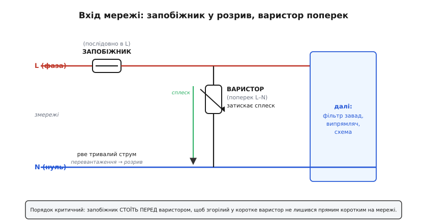
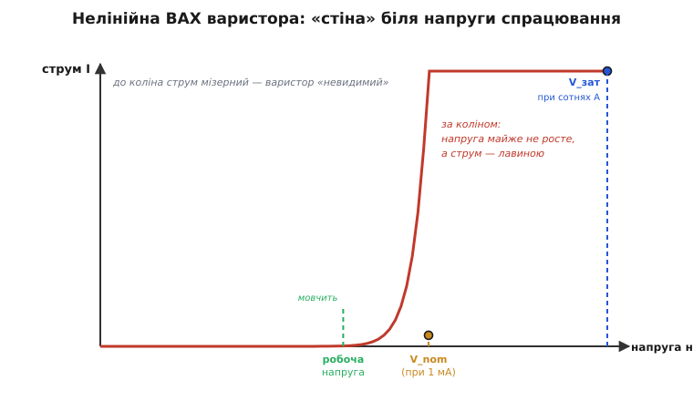

# 🔌 Варистор

Варистор — це деталь, опір якої залежить від прикладеної напруги (звідси й назва: англ. *varistor* — стягнення *variable resistor*, «змінний резистор»; інша поширена назва — VDR, *voltage-dependent resistor*). Поки напруга в межах робочої — варистор майже ізолятор і його ніби немає в колі. Щойно напруга підскочила понад поріг — варистор за наносекунди стає майже провідником і зливає крізь себе зайвий струм, не пускаючи сплеск далі на плату. Спрацьовує він від самої фізики матеріалу, нічим не керується й ні з чим не «розмовляється» — просто чекає аварії й кидається на неї тілом.

Ловить варистор саме **напругу в моменті**: наносекундно-мікросекундний сплеск. Це комутаційний викид у мережі, коли поряд вимикається потужне навантаження; наведення від далекої блискавки; перехідний процес при ввімкненні. Така біда приходить за мікросекунди й закінчується сама, бо несе **скінченну порцію енергії** — запасену в індуктивності проводів чи в грозовій хмарі. Її не треба розривати, її треба **поглинути на місці** й випустити теплом. Саме тому варистор переживає сотні сплесків, доки старіння його не доб'є, — на відміну від плавкого запобіжника, що гине з першого ж спрацювання.

### Чому варистор не сам: пара із запобіжником

Варистор закриває лише одну з двох мережевих бід. Друга — **струм у часі**: коротке замикання чи перевантаження, що триває мілісекунди й довше. Тут енергія вже **без межі зверху**: мережевий трансформатор підстанції віддасть тисячі ампер хвилинами, аж поки щось не розплавиться. Поглинути таке тілом неможливо — коло треба **розірвати назавжди**, і це робота [плавкого запобіжника](book:electronics/fuse-types). Варистор за наносекундним сплеском устигне, а запобіжник — ні; запобіжник розірве затяжне коротке, а варистор від нього просто згорить. Тому їх ставлять **разом** і в строго визначеному порядку.


*Запобіжник стоїть послідовно у фазному проводі — увесь струм плати тече крізь нього. Варистор підключений паралельно між фазою і нулем: у нормі він «невидимий», а сплеск напруги зливає повз схему. Порядок критичний — запобіжник стоїть перед варистором за течією струму, інакше згорілий варистор лишиться під напругою мережі без жодного захисту.*

Запам'ятати легко: **запобіжник — у розрив, варистор — поперек**. Запобіжник розриває коло, тож стоїть у лінії; варистор відводить сплеск, тож висить між проводами. За цим рубежем уже йдуть вхідні кола живлення — фільтр завад і [випрямляч](book:electronics/rectification). Будь-яке керування навантаженням [симістором](book:electronics/triac) чи [твердотільним реле](book:electronics/solid-state-relay) має сенс лише за цим захисним рубежем: керований ключ беззахисний перед сплеском, від якого його прикриває саме варистор.

> 🔧 **Навіщо це.** Варистор і запобіжник — буквально перші два компоненти за клемами мережі й найдешевша страховка проти пожежі та вигорілої плати. Підбір: запобіжник — за робочим струмом плюс пусковий пік; варистор класу 275 В для мережі 230 В з напругою затиску нижчою за те, що витримує вхід далі. Золоте правило монтажу: запобіжник перший за фазою, варистор за ним поперек між фазою і нулем.

### Як працює варистор: нелінійна «стіна»

Чому варистор «невидимий» у нормі, але миттєво відводить сплеск? Уся справа в його матеріалі. Найпоширеніший варистор — це **MOV** (англ. *metal-oxide varistor*, оксидно-металевий варистор): спечена керамічна таблетка з мільйонів зерен оксиду цинку. Кожна межа між сусідніми зернами поводиться як зустрічна пара діодів, а мільйони таких меж разом дають **різко нелінійний** опір: до певної напруги MOV — майже ізолятор, вище неї — майже провідник. Як виник цей матеріал і чим він кращий за попередників — окрема історія.

> 📜 Шлях до оксиду цинку був довгий: спершу мережу боронив карбід кремнію, і лише наприкінці 1960-х японський інженер винайшов сучасну кераміку. [Звідки взявся варистор](book:electronics/varistor/hist-from-thyrite-to-zno.md).

Чому саме межі зерен, а не самі зерна, роблять усю роботу? Усередині зерно оксиду цинку — добрий провідник (леговане ZnO). А от тонкий прошарок на межі між двома зернами утворює потенціальний бар'єр, як у зустрічних діодах: поки прикладена напруга мала, бар'єр тримає, струм мізерний. Коли ж напруга на одній межі сягає приблизно 3 В (для різних складів кераміки — від 2 до 4 В), бар'єр **пробивається** — тунельний і лавинний механізм разом — і вже неважливо, наскільки сильніше тиснути: спад на цій межі майже не росте. Повна напруга диска — це сума таких трививольтових сходинок по всьому ланцюжку зерен від електрода до електрода.

Звідси два важелі конструкції в руках виробника. **Товщина диска** — це число зерен у стовпчику, отже сума сходинок, отже напруга спрацювання: товщий диск тримає вищу напругу. **Площа диска** — це скільки паралельних ланцюжків поділять між собою струм, отже скільки енергії кераміка з'їсть, не перегрівшись. Це й ключ до читання маркувань: дві групи в назві (наприклад, 14D431) — це діаметр у міліметрах (14, тобто енергія) і коліно напруги (431 — читається як 43·10¹, тобто 430 В). Скільки саме сходинок дають потрібну напругу й чому залишковий нахил кривої такий, який є, — у математиці степеневого закону.

> 🧮 Нелінійність варистора описують степенем: I = k·Vᵅ, де показник α сягає кількох десятків. Саме він каже, наскільки «крута» стіна й звідки береться залишковий нахил. [Степеневий закон варистора](book:electronics/varistor/math-power-law.md).


*До «коліна» (його визначають при струмі 1 мА) струм мізерний — варистор не заважає колу. За коліном напруга на варисторі майже не росте, а струм лавиною йде крізь нього: сплеск зливається повз плату, а напруга на платі лишається затиснутою на рівні напруги затиску.*

Ключові числа з паспорта варистора:

```
MCOV   (макс. робоча напруга)  ≈ 1.1…1.25 · V_діюче_лінії
V_nom  (коліно, при 1 мА)        V₁ₘₐ — місце перегину ВАХ
V_зат  (напруга затиску)         спад при ПОВНОМУ імпульсному струмі
                                 (форма 8/20 мкс); мусить лишатись
                                 НИЖЧОЮ за межу плати
W_max  (Дж)                      енергія за один сплеск, яку MOV з'їсть
I_max  (А, 8/20 мкс)             пік-струм, що диск витримає не розколовшись
```

Для мережі 230 В (діюче значення) беруть MOV класу **275 В** (робоче діюче): запас над піком мережі (приблизно 325 В) є, але до коліна ще далеко, тож у нормі варистор мовчить і не гріється. А коли сплеск таки приходить, варистор відкривається і пропускає крізь себе лавину струму: енергія імпульсу скінченна, і кераміка «з'їдає» її теплом за ту коротку мить.

### Звідки береться напруга затиску і чому вона вища за коліно

Тут криється головне непорозуміння початківців. Здавалося б, варистор «затискає» напругу на рівні коліна, отже плата побачить близько 430 В. Насправді більше, інколи майже вдвічі. Чому?

Бо за коліном вольт-амперна крива хоч і полога, але **не горизонтальна**: у MOV лишається невеликий залишковий (динамічний) опір, і що сильніший струм крізь нього женемо, то вищий спад. Коліно V₁ₘₐ міряють при крихітному струмі 1 мА. А реальний сплеск жене крізь диск **сотні чи тисячі ампер** — і на тому самому залишковому опорі це дає набагато більший спад. Саме цю напругу, при повному імпульсному струмі стандартної форми 8/20 мкс, виробник і вказує як **напругу затиску**.

```
Грубо:  V_зат ≈ V_nom + I_сплеску · R_дин

де R_дин — динамічний (залишковий) опір MOV за коліном, частки ома.
Прямий наслідок: чим БІЛЬШИЙ диск (менший R_дин),
тим НИЖЧА напруга затиску при тому самому струмі сплеску.
```

Для типового 14-мм диска класу 275 В: коліно V₁ₘₐ ≈ 430 В, а напруга затиску при повному струмі сягає **близько 710 В**. Ось чому це не дрібниця, а **головне число для захисту**: саме напругу затиску, а не коліно, побачить вхід плати в найгірший момент. Якщо за варистором стоїть випрямляч на діодах зі зворотною напругою 1000 В — 710 В їх не вб'ють, запас є. Якщо ж там безтрансформаторне живлення з конденсатором на 400 В — такий MOV його не врятує, бо напруга затиску вища за межу. Тоді або беруть більший диск (нижчий R_дин → нижча напруга затиску), або піднімають межу самої плати.

### Скільки енергії варистор здатен з'їсти

Друге число, на якому горять плати, — **енергетична місткість** W_max. Сплеск несе скінченну енергію, і вся вона за мікросекунди перетворюється в тепло всередині керамічного тіла диска. Якщо цієї енергії більше, ніж диск може поглинути не перегрівшись, кераміка тріскає або плавиться — варистор гине миттєво, часто з тріском і у режим **короткого замикання** (а не обриву; саме тому за ним і потрібен запобіжник).

Місткість прямо залежить від **об'єму** кераміки, а отже від діаметра диска — більший диск має куди розвести тепло. Грубі орієнтири за розміром (енергія для одиночного імпульсу форми 10/1000 мкс):

```
7D  (7 мм)   ≈ 20–30 Дж    — захист на самій платі, слабкі сплески
10D (10 мм)  ≈ 35–50 Дж    — дрібна побутова техніка, блоки живлення
14D (14 мм)  ≈ 70–110 Дж   — мережеві фільтри, подовжувачі
20D (20 мм)  ≈ 150–200 Дж  — промислове обладнання
34D (34 мм)  ≈ 400–500 Дж  — головні розподільчі щити
```

Енергію сплеску оцінюють як добуток затиснутої напруги, пік-струму й характерного часу: W ≈ V_зат · I_пік · τ. Для побутового входу беруть пік-струм форми 8/20 мкс у межах **1–3 кА** — цього вистачає на наведення від далекої блискавки та комутаційні викиди; промисловий і вуличний вхід вимагають 6–10 кА, бо там сплески жорсткіші. Запас обов'язковий: варистор починає деградувати вже при струмі близько 1.5× від рейтингу, тож закладають принаймні дворазовий-триразовий запас за струмом і енергією.

> 🔧 **Навіщо це.** Два числа вирішують, виживе плата чи ні: **напруга затиску** (щоб не пробити вхід) і **W_max** (щоб варистор сам не луснув). Коліно V₁ₘₐ — лише орієнтир, а не те, що побачить схема. Правило підбору: спершу за робочою напругою фіксуємо клас (275 В для мережі 230 В), потім за допустимою напругою входу обираємо диск так, щоб напруга затиску була нижчою за межу плати, і нарешті перевіряємо, що W_max та I_max покривають очікуваний сплеск із запасом приблизно 1.5…3×.

### Числовий приклад: підбираємо варистор під реальну плату

**Умова.** Безтрансформаторний вузол живлення пристрою на ESP32 на вході 230 В. Перший електролітичний конденсатор за випрямлячем — на 400 В. Діоди мосту — на 1000 В зворотної напруги. Очікуваний клас сплесків — побутовий, до 2 кА (форма 8/20 мкс). Який варистор ставити?

```
Крок 1. Робоча напруга → клас MOV.
  V_лінії(діюче)     = 230 В
  V_пік              = 230 · √2 ≈ 325 В
  MCOV (з запасом)   ≈ 1.2 · 230 ≈ 276 В  → беремо клас 275 В діюч.

Крок 2. Жорстка межа схеми = найслабша ланка за варистором.
  конденсатор 400 В  ← саме він обмежує, не діоди (1000 В)
  отже:  V_зат варистора  МУСИТЬ бути < 400 В при 2 кА

Крок 3. Перевірка кандидата 14D431 (14 мм, 275 В діюч.):
  V_зат (при повному струмі) ≈ 710 В   ← НАБАГАТО вище за 400 В
  ВЕРДИКТ: не годиться — пробʼє конденсатор раніше, ніж MOV допоможе.

Крок 4. Висновок інженерний, не «беремо більший диск».
  Жоден MOV класу 275 В не дасть V_зат < 400 В:
  саме коліно вже ≈ 430 В, тобто вище за межу конденсатора.
  → Конденсатор 400 В для входу 230 В обрано НАДТО близько до піка.
    Реальне рішення: підняти конденсатор до 450 В (стандартний клас),
    тоді запас над V_пік (325 В) з'являється,
    а MOV 14D431 з V_зат ≈ 710 В лишається другим ешелоном
    разом із діодами 1000 В.

Крок 5. Енергія та струм — фінальна перевірка обраного 14D431.
  W_max(14 мм)  ≈ 110 Дж
  I_max(8/20)   ≈ 4.5 кА   ← очікуваний сплеск 2 кА має запас ~2×, добре
  W_сплеску     ≈ V_зат · I_пік · τ
                ≈ 710 В · 2000 А · (20·10⁻⁶ с / 2) ≈ 14 Дж  < 110 Дж ✓
```

Висновок прикладу подвійний. По-перше, **напруга затиску вибраного варистора керує вибором межі плати, а не навпаки**: не можна ставити вхідний конденсатор упритул до піка мережі й сподіватися, що MOV його врятує, — він фізично не затисне нижче власного коліна. По-друге, коли межу плати піднято з запасом, обраний 14D431 з W_max ≈ 110 Дж та I_max ≈ 4.5 кА покриває побутовий сплеск 2 кА з подвійним запасом за струмом — саме такий запас і потрібен, бо при кожному спрацюванні варистор трохи деградує.

### Варистор серед родичів: TVS і газорозрядник

Варистор — не єдиний, хто гасить сплеск напруги; у нього два близькі родичі, і вибір між ними диктує швидкість та енергія аварії. [TVS-діод](book:electronics/tvs-diode) затискає **точніше й швидше** за варистор (пікосекунди, чіткіша напруга), але тримає мало енергії — його місце на сигнальних лініях і за варистором другим ешелоном. [Газорозрядник](book:electronics/gdt) навпаки — глитає **величезну** енергію прямого удару блискавки, але вмикається повільно й «провалює» напругу майже до нуля, тож сам по собі живлення не боронить. Варистор сидить між ними: достатньо швидкий для мережевих сплесків і достатньо місткий для побутових та промислових енергій. У серйозному захисті всіх трьох ставлять каскадом — газорозрядник першим на грубу енергію, варистор у середині, TVS останнім на тонкий доводячий затиск.

> 🔌 Готовий варистор у платі — це не лише диск: типова розпіновка, монтаж поперек лінії, термозапобіжник поряд і характерні граблі класу зібрані окремо. [Варистор як компонент](book:electronics/varistor/comp-mov-module.md).

### Граблі (саме тут б'є струмом по руках)

Принцип у варистора простий, та помилок на ньому роблять чимало — і кожна обертається не згорілою платою, а пожежею чи ударом струму. Ось чотири найчастіші.

- **Порядок переплутано.** Якщо варистор стоїть **до** запобіжника, то згорілий MOV (а він відмовляє в **коротке замикання**) лишиться під напругою мережі без захисту — і перетвориться на жарину. Завжди: спершу запобіжник, потім варистор за ним.
- **Старіння варистора.** Кожен поглинутий сплеск трохи деградує MOV: його коліно повзе вниз, бо частина зернистих меж пробивається назавжди. Зрештою варистор починає підтікати в нормі (струм витоку росте), грітися й може зайнятися. Серйозні плати ставлять поруч термозапобіжник, що відключає деградований MOV, перш ніж той загориться.
- **«Замінив на більший — буде надійніше».** Для варистора більший диск і справді кращий (нижча напруга затиску, більше енергії). А от завищений номінал **запобіжника** працює навпаки: він уже не перегорить вчасно, тож аварійний струм спокійно випалить доріжки замість дешевої вставки. Два сусідні компоненти — два протилежні правила, плутати їх не можна.
- **Варистор без запобіжника.** Сплеск енергії, більший за W_max, проб'є MOV наскрізь у коротке замикання — і без запобіжника попереду цей пробитий диск опиниться прямим коротким на мережі. Варистор без послідовного запобіжника на вході — це закладена пожежа.

> 🔧 **Навіщо це.** Сплеск, від якого варистор не врятує (пробив наскрізь), доб'є запобіжник — удвох вони закривають і миттєву, і затяжну біду. Тому варистор ніколи не ставлять самотою: лише за [запобіжником](book:electronics/fuse-types) у фазі, і бажано з термозапобіжником поряд на випадок повільного старіння. Це найдешевший вузол на платі — і той, на якому економія обертається вогнем.
