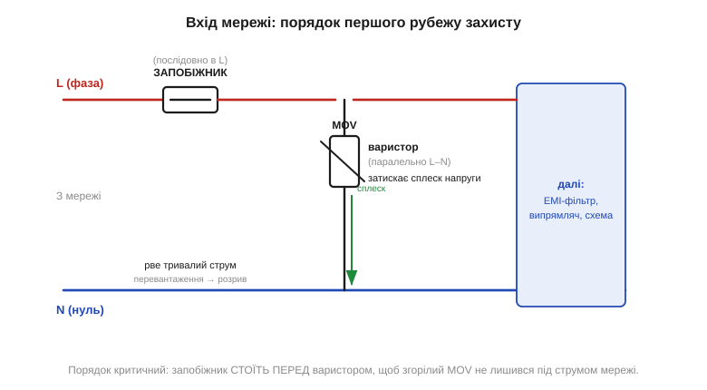
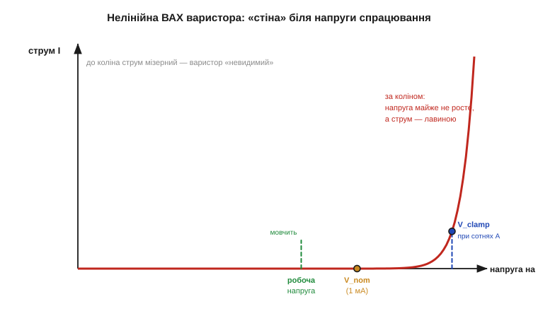

# 🔌 Варистор і запобіжник: перший рубіж між мережею і платою

### Клас: пасивний захист на вході мережі

Обидва належать до класу **пасивного захисту живлення**. На відміну від керованих ключів мережі — [симістора](book:electronics/triac) чи [твердотільного реле](book:electronics/solid-state-relay) — вони нічим не керують і ні з чим не «розмовляють», а лише чекають аварії й спрацьовують від самої фізики. Кожен з них закриває свою біду:

- **запобіжник** ловить **струм у часі** — коротке замикання чи перевантаження, що триває мілісекунди й довше;
- **варистор** ловить **напругу в моменті** — наносекундно-мікросекундний сплеск (комутаційний викид у мережі, наведення від далекої блискавки, перехідний процес при ввімкненні сусіднього потужного навантаження).

Жоден сам по собі не повний: запобіжник не встигне за наносекундним сплеском, а варистор згорить, якщо тиснути в нього струм довго. Тому їх ставлять **разом** і в строго визначеному порядку.

Чому ролі поділені саме так — диктує фізика двох аварій, і вона ж потім задасть номінали та монтаж. Перевантаження за струмом — це **енергія без межі зверху**: мережевий трансформатор підстанції віддасть тисячі ампер хвилинами, аж поки щось не розплавиться. Тут потрібен елемент, що сам **розриває коло** назавжди, — запобіжник. Сплеск напруги навпаки — це **скінченна порція енергії**, запасена в індуктивності проводів чи в грозовій хмарі: вона приходить за мікросекунди й закінчується сама. Її не треба розривати — її треба **поглинути на місці** й випустити теплом, і це робота варистора. Звідси й різна доля компонентів: запобіжник одноразовий за самою суттю, а варистор переживає сотні сплесків, доки старіння його не доб'є.

### Блок-схема: де вони сидять на вході


*Рис. Запобіжник стоїть послідовно у фазному проводі (L) — увесь струм плати тече крізь нього. Варистор підключений паралельно між L і N — у нормі він «невидимий», а сплеск напруги зливає повз схему. Порядок критичний: запобіжник СТОЇТЬ ПЕРЕД варистором за течією струму.*

Запам'ятати легко: **запобіжник — у розрив, варистор — поперек**. Запобіжник розриває коло, тож стоїть у лінії; варистор відводить сплеск, тож висить між проводами. За цим рубежем уже йдуть вхідні кола живлення — фільтр завад і [випрямляч](book:electronics/rectification).

### Як працює варистор: нелінійна «стіна»

Чому ж варистор «невидимий» у нормі, але миттєво відводить сплеск? Уся справа в його матеріалі. Варистор (*Metal-Oxide Varistor*, MOV) — це спечена таблетка з зерен оксиду цинку. Кожна межа між зернами поводиться як зустрічна пара діодів, а мільйони таких меж разом дають **різко нелінійний** опір: до певної напруги MOV — майже ізолятор, вище неї — майже провідник.

Чому саме межі зерен, а не самі зерна, роблять усю роботу? Усередині зерно оксиду цинку — добрий провідник (леговане ZnO). А от тонкий прошарок на межі між двома зернами утворює потенціальний бар'єр, як у зустрічних діодах: поки прикладена напруга мала, бар'єр тримає, струм мізерний. Коли ж напруга на одній межі сягає ~3 В, бар'єр **пробивається** (тунельний і лавинний механізм разом) — і вже неважливо, наскільки сильніше тиснути, спад на цій межі майже не росте. Повна напруга диска — це сума таких ~3-вольтових сходинок по всьому ланцюжку зерен від електрода до електрода. Тому **товщину диска (число зерен у стовпчику) виробник підбирає під потрібну напругу спрацювання**, а площу диска — під енергію, яку треба з'їсти. Це ключ до читання маркувань: дві групи в назві (наприклад, 20D431) — це діаметр (20 мм, тобто енергія) і коліно напруги (431 ≈ 430 В).


*Рис. До «коліна» (V_nom, що визначають при струмі 1 мА) струм мізерний — варистор не заважає. За коліном напруга майже не росте, а струм лавиною йде крізь MOV: сплеск зливається повз плату, а напруга на ній лишається затиснутою на рівні V_clamp.*

Ключові числа з паспорта:

```
V_варистора (MCOV)  ≈ 1.1…1.25 · V_діюче_лінії   ← робоча напруга з запасом
V_nom  (@ 1 мА)      — «коліно» ВАХ (V₁ₘₐ)
V_clamp              — напруга при ПОВНОМУ імпульсному струмі (8/20 мкс)
                       (мусить лишатись НИЖЧОЮ за межу плати)
W_max  (Дж)          — скільки енергії MOV з'їсть за один сплеск
I_max  (А, 8/20 мкс) — пік-струм, який диск витримає не розколовшись
```

Для мережі 230 В (діюче) беруть MOV класу **275 В** (working RMS): запас над піком ~325 В є, але до коліна ще далеко, тож у нормі варистор мовчить і не гріється. А коли сплеск таки приходить, варистор відкривається і пропускає крізь себе лавину струму: енергія імпульсу скінченна, і MOV «з'їдає» її теплом за ту коротку мить.

### Звідки береться V_clamp і чому вона ВИЩА за коліно

Тут криється головне непорозуміння новачків. Здавалося б: MOV «затискає» напругу на рівні коліна, отже плата побачить ~430 В. Насправді — більше, інколи майже вдвічі. Чому?

Бо за коліном ВАХ хоч і полога, але **не горизонтальна**: у MOV лишається невеликий залишковий (динамічний) опір, і що сильніший струм крізь нього женемо, то вищий спад. Коліно V₁ₘₐ міряють при крихітному 1 мА. А реальний сплеск жене крізь диск **сотні чи тисячі ампер** — і на тому самому залишковому опорі це дає набагато більший спад. Саме цю напругу, при повному імпульсному струмі стандартної форми 8/20 мкс, виробник і вказує як **V_clamp**.

```
Грубо:  V_clamp ≈ V_nom + I_сплеску · R_динам

де R_динам — динамічний (залишковий) опір MOV за коліном, частки ома.
Прямий наслідок: чим БІЛЬШИЙ диск (менший R_динам),
тим НИЖЧА V_clamp при тому самому струмі сплеску.
```

Для типового 14-мм диска класу 275 В: коліно V₁ₘₐ ≈ 430 В, а V_clamp при повному струмі сягає **~700–775 В**. Ось чому V_clamp — це не дрібниця, а **головне число для захисту**: саме його, а не коліно, побачить вхід плати в найгірший момент. Якщо за варистором стоїть випрямляч на діодах зі зворотною напругою 1000 В — 775 В їх не вб'ють, запас є. Якщо ж там безтрансформаторне живлення з конденсатором на 400 В — такий MOV його не врятує, бо V_clamp вищий за межу. Тоді або беруть більший диск (нижчий R_динам → нижча V_clamp), або піднімають межу самої плати.

### Скільки енергії MOV здатен з'їсти

Друге число, на якому горять плати, — **енергетична місткість** W_max. Сплеск несе скінченну енергію, і вся вона за мікросекунди перетворюється в тепло всередині керамічного тіла диска. Якщо цієї енергії більше, ніж диск може поглинути не перегрівшись, кераміка тріскає або плавиться — MOV гине миттєво, часто з тріском і у режим **короткого замикання** (а не обриву; саме тому за ним потрібен запобіжник).

Місткість прямо залежить від **об'єму** кераміки, а отже від діаметра диска — більший диск має куди розвести тепло. Грубі орієнтири за розміром:

```
7D  (7 мм)   ≈ 20–25 Дж   — захист на самій платі, слабкі сплески
10D (10 мм)  ≈ 25–40 Дж   — дрібна побутова техніка, блоки живлення
14D (14 мм)  ≈ 40–60 Дж   — мережеві фільтри, подовжувачі
20D (20 мм)  ≈ 60–100 Дж  — промислове обладнання
34D (34 мм)  ≈ 150–250 Дж — головні розподільчі щити
```

Енергію сплеску оцінюють як добуток затиснутої напруги, пік-струму й характерного часу: W ≈ V_clamp · I_пік · τ. Для побутового входу беруть пік-струм 8/20 мкс у межах **1–3 кА** — цього вистачає на наведення від далекої блискавки та комутаційні викиди; промисловий і вуличний вхід вимагають 6–10 кА, бо там сплески жорсткіші. Запас обов'язковий: MOV починає деградувати вже при струмі ~1.5× від рейтингу, тож закладають принаймні дворазовий-триразовий запас за струмом і енергією.

> 🔧 **Навіщо це.** Два числа вирішують, виживе плата чи ні: **V_clamp** (щоб не пробити вхід) і **W_max** (щоб MOV сам не луснув). Коліно V₁ₘₐ — лише орієнтир, а не те, що побачить схема. Правило підбору: спершу за робочою напругою фіксуємо клас (275 В для мережі 230 В), потім за допустимою напругою входу обираємо диск так, щоб **V_clamp був нижчий за межу плати**, і нарешті перевіряємо, що W_max та I_max покривають очікуваний сплеск із запасом ~1.5…3×.

### Числовий приклад: підбираємо MOV під реальну плату

**Умова.** Безтрансформаторний вузол живлення ESP32-пристрою на вході 230 В. Перший електролітичний конденсатор за випрямлячем — на 400 В. Діоди мосту — на 1000 В зворотної. Очікуваний клас сплесків — побутовий, до 2 кА (8/20 мкс). Який MOV ставити?

```
Крок 1. Робоча напруга → клас MOV.
  V_лінії(RMS)        = 230 В
  V_пік              = 230 · √2 ≈ 325 В
  MCOV (з запасом)   ≈ 1.2 · 230 ≈ 276 В  → беремо клас 275 В RMS

Крок 2. Жорстка межа схеми = найслабша ланка за варистором.
  конденсатор 400 В  ← саме він обмежує, не діоди (1000 В)
  отже:  V_clamp MOV  МУСИТЬ бути < 400 В при 2 кА

Крок 3. Перевірка кандидата 14D431 (14 мм, 275 В RMS):
  V_clamp(@ повний струм) ≈ 710 В   ← НАБАГАТО вище за 400 В
  ВЕРДИКТ: не годиться — пробʼє конденсатор раніше, ніж MOV допоможе.

Крок 4. Висновок інженерний, не «беремо більший диск».
  Жоден MOV класу 275 В не дасть V_clamp < 400 В:
  саме коліно вже ~430 В, тобто вище за межу конденсатора.
  → Конденсатор 400 В для входу 230 В обрано НАДТО близько до піка.
    Реальне рішення: підняти конденсатор до 450 В (стандартний клас),
    тоді запас над V_пік (325 В) з'являється,
    а MOV 14D431 з V_clamp ~710 В лишається другим ешелоном
    разом із діодами 1000 В.

Крок 5. Енергія та струм — фінальна перевірка обраного 14D431.
  W_max(14 мм)  ≈ 50 Дж
  I_max(8/20)   ≈ 6 кА   ← очікуваний сплеск 2 кА має запас 3×, добре
  W_сплеску     ≈ V_clamp · I_пік · τ
                ≈ 710 В · 2000 А · (20·10⁻⁶ с / 2) ≈ 14 Дж  < 50 Дж ✓
```

Висновок прикладу подвійний. По-перше, **V_clamp вибраного варистора керує вибором межі плати, а не навпаки**: не можна ставити вхідний конденсатор упритул до піка мережі й сподіватися, що MOV його врятує, — він фізично не затисне нижче власного коліна. По-друге, коли межу плати піднято з запасом, обраний 14D431 з W_max ≈ 50 Дж та I_max ≈ 6 кА покриває побутовий сплеск 2 кА з потрійним запасом — саме такий запас і потрібен, бо при кожному спрацюванні MOV трохи деградує.

### Граблі (саме тут б'є струмом по руках)

Принцип у цих двох компонентів простий, та помилок на них роблять чимало — і кожна обертається не згорілою платою, а пожежею чи ударом струму. Ось чотири найчастіші.

- **Порядок переплутано.** Якщо варистор стоїть **до** запобіжника, то згорілий MOV (а він відмовляє в **коротке замикання**) лишиться під напругою мережі без захисту — і перетвориться на жарину. Завжди: спершу запобіжник, потім варистор за ним.
- **Старіння MOV.** Кожен поглинутий сплеск трохи деградує варистор: його коліно повзе вниз, бо частина зернистих меж пробивається назавжди. Зрештою він починає підтікати в нормі (струм витоку росте), грітися й може зайнятися. Серйозні плати ставлять поруч термозапобіжник, що відключає деградований MOV, перш ніж той загориться.
- **«Замінив на більший — буде надійніше».** Завищений номінал **запобіжника** не рятує плату, а лише вбиває сенс захисту: він уже не перегорить вчасно, тож аварійний струм спокійно випалить доріжки й трансформатор замість дешевої вставки. Номінал беруть **мінімально достатній** для робочого струму з пусковим піком, не більше. (Для варистора правило протилежне — більший диск кращий, бо знижує V_clamp і додає енергії; плутати ці два правила не можна.)
- **Швидкий проти повільного.** Запобіжники бувають швидкі (*F*) і інерційні (*T*, slow-blow). Блокам живлення з великим пусковим струмом (заряд вхідних конденсаторів) потрібен **T**, інакше він перегорятиме при кожному ввімкненні.

> 🔧 **Навіщо це.** Це буквально перші два компоненти за клемами мережі — і найдешевша страховка проти пожежі та вигорілої плати. Підбір: запобіжник — за робочим струмом плюс пусковий пік (тип T для блоків живлення); варистор класу 275 В для мережі 230 В, причому V_clamp нижче за те, що витримує вхід далі. І золоте правило монтажу: **запобіжник перший за фазою, варистор за ним поперек L–N**. Сплеск, від якого MOV не врятує (пробив наскрізь), доб'є запобіжник — удвох вони закривають і миттєву, і затяжну біду. Будь-яке керування навантаженням [симістором](book:electronics/triac) чи [твердотільним реле](book:electronics/solid-state-relay) має сенс лише за цим захисним рубежем.
