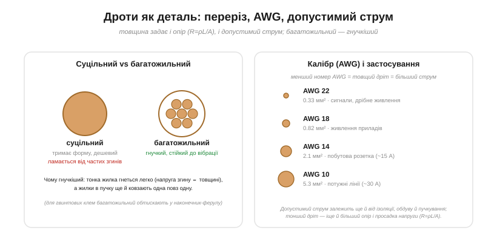

# 🔌 Дроти: переріз, AWG, допустимий струм і чому багатожильний гнучкіший

Ця стаття дивиться на дріт як на **повноцінну деталь**: скільки струму він стерпить, скільки напруги «з'їсть» на довгій лінії і чому той самий переріз буває суцільним і багатожильним.

### Дріт — теж деталь, а не «ідеальне з'єднання»

Звикли вважати дріт просто лінією на схемі — лінія з'єднує дві точки, і обидві точки мають однаковий потенціал. Це зручна ідеалізація, і на коротких сигнальних доріжках вона майже точна. Та насправді в дроту є **опір** (R = ρL/A, де ρ — [питомий опір](topic:physics/resistivity) металу) і **межа струму** — і коли струм великий або лінія довга, обидві ці властивості перестають бути дрібницею й починають диктувати схему.

Чому так? Бо опір ніде не зникає: він просто малий. Доки струм мізерний (одиниці міліампер у сигнальній лінії), спад напруги I·R на десятку міліом — це мікровольти, і ним справді можна нехтувати. Але опір входить у дві формули, кожна з яких «вибухає» у свій бік. У спад напруги він входить лінійно (V = I·R), у тепловиділення — квадратично (P = I²R — те саме [джоулеве тепло](topic:physics/joule-heating)). Тому варто струмові вирости до амперів, а лінії — до метрів, як той самий «нульовий» опір перетворюється то на втрачені вольти живлення, то на ват тепла в ізоляції. Дріт стає деталлю, яку треба **розраховувати**, а не просто малювати.

> 🔧 **Навіщо це.** В автономному пристрої (живлення від батареї, мотори, силова шина 5–12 В) дроти й роз'єми — частий прихований винуватець: то двигун недокручує через спад напруги на тонкому живленні, то джгут гріється під обшивкою корпусу. Уміти прикинути R дроту й спад на ньому — базова навичка, що рятує від «магічних» багів живлення.

### Допустимий струм (ampacity)


*Ліворуч: суцільний дріт (один провідник — тримає форму) проти багатожильного (пучок тонких жилок — гнучкий). Праворуч: калібр AWG — менший номер = товщий дріт = більший допустимий струм (а ампацитет залежить ще й від ізоляції та умов охолодження).*

Головне число дроту — **допустимий струм** (*ampacity*): скільки ампер він понесе, не перегрівшись. Логіка суто теплова, і варто простежити її до причини. Струм гріє дріт потужністю P = I²R — це [джоулеве тепло](topic:physics/joule-heating), що виділяється у всьому об'ємі металу. Водночас дріт цю потужність **скидає** з поверхні: тепло йде в повітря конвекцією і випромінюванням, а також стікає вздовж міді до клем. Усталена температура дроту встановлюється там, де **виділення зрівнюється зі скиданням**: скільки ват народжується всередині, стільки ж тіче назовні. Підніми струм — рівновага зміститься в бік вищої температури, бо тепла народжується більше (та ще й квадратично), а поверхня скидання та сама. Перевищиш межу — ізоляція доходить до своєї температурної межі, плавиться, оголюється мідь, і коротке замикання дає вже неконтрольований нагрів аж до пожежі (саме від цього лінію й береже [плавкий запобіжник](root:embedded/fuses-ptc)).

Звідси видно, **чому товщий дріт терпить більший струм**, і причин одразу дві, обидві працюють на нього. По-перше, у товщого дроту більший переріз A, тому менший опір R = ρL/A — за того самого струму менше ват тепла народжується. По-друге, товщий дріт має більшу **поверхню** на одиницю довжини, тож краще скидає те тепло, що все ж народилося. Виділення падає, скидання росте — рівновага сидить на нижчій, безпечнішій температурі. Саме тому калібр AWG (англ. *American Wire Gauge* — американський дротовий калібр) влаштований «навиворіт»: менший номер = товщий дріт = більший допустимий струм. Номер AWG — це, по суті, скільки разів дріт «протягли крізь фільєру»: кожне протягування тоншає його, тож більший номер означає тонший провід. Грубе, але корисне правило: кожні **−3 одиниці AWG приблизно подвоюють переріз** (і вдвічі зменшують опір), а −10 одиниць — десятикратно.

Та ось важлива пастка: **ампацитет — не одне число**. Він не властивість самого дроту, а властивість дроту **в певних умовах скидання тепла** — а умови бувають різні. Він залежить від **ізоляції** (*insulation*): її температурна межа і є тим стелею, до якого дозволено гріти мідь, тож провід у термостійкій ізоляції на 105 °C несе більший струм, ніж той самий мідний переріз у дешевому ПВХ на 70 °C. Він залежить від **довкілля** (*ambient*): у гарячому місці дріт стартує з вищої температури, отже до межі йому ближче — допустимий струм падає. І, найпідступніше, він залежить від **пучкування** (*bundling*): дроти, зібрані в джгут чи прокладені в трубі, гріють один одного й гірше віддають тепло назовні (внутрішні жили взагалі оточені сусідами, а не повітрям). Тому кожен у пучку треба **дерейтити** (*derating*, брати запас і знижувати дозволений струм). Саме через цю залежність від умов таблиці ампацитету завжди наведені «за вказаних умов» — і не можна просто «взяти максимум» із колонки, не звіривши, чи це твій випадок.

> 🔧 **Навіщо це.** Усередині корпусу робота чи дрона дроти лежать щільним джгутом, ще й біля гарячих регуляторів — тобто в найгірших для скидання тепла умовах. Тут беруть переріз із подвійним запасом проти «табличного» одиночного дроту на відкритому повітрі: те, що в каталозі несе 10 А голим, у джгуті під обшивкою безпечне хіба на 5–6 А.

### Падіння напруги на довгій лінії

Другий чинник, про який часто забувають, — **падіння напруги** (*voltage drop*). Тепло — це про те, чи виживе сам дріт; спад напруги — про те, чи доїде живлення до навантаження неушкодженим. Довгий тонкий дріт має помітний опір (R = ρL/A росте з довжиною), і за законом Ома на ньому губиться напруга V = I·R — ці вольти лишаються на дроті й не доходять до приладу. Прилад на кінці лінії бачить не напругу джерела, а напругу джерела **мінус** спад на дроті туди й назад (струм же тече по двох жилах — плюсовій і зворотній, тож рахувати треба **обидві**).

Чому це б'є саме по низьковольтних лініях? Бо важить не сам спад у вольтах, а його **частка** від напруги живлення. Згубити 0.5 В на дроті — дрібниця для лінії 230 В (0.2 %), але катастрофа для лінії 5 В (10 %): мікроконтролер на кінці може впасти нижче порога скидання, а двигун — недокрутити. Тому в довгих низьковольтних шинах часто саме спад напруги, а не нагрів, **диктує** товщину дроту: дріт цілком переживає струм за ампацитетом, але вольтів на ньому втрачається стільки, що беруть товще — не щоб не згорів, а щоб напруга доходила.

**Worked example: дріт 18 AWG на 5-вольтову лінію 3 метри, струм 2 А.**

Перевіримо обидві межі одразу — і нагрів, і спад напруги. Питомий опір міді ρ ≈ 1.7·10⁻⁸ Ом·м; переріз 18 AWG ≈ 0.82 мм² = 0.82·10⁻⁶ м². Лінія двопровідна, тож електрично дріт «туди й назад» має подвійну довжину: L = 2 × 3 м = 6 м.

```
Опір однієї жили на метр:
  R/L = ρ / A
      = 1.7e-8 / 0.82e-6
      = 0.0207 Ом/м        (≈ 20.7 мОм на метр)

Повний опір петлі (туди + назад, 6 м):
  R = (R/L) · L
    = 0.0207 · 6
    = 0.124 Ом

Спад напруги на лінії:
  V_drop = I · R
         = 2 · 0.124
         = 0.249 В         (≈ 0.25 В)

Напруга на навантаженні:
  V_load = 5.0 − 0.25
         = 4.75 В          (втрачено 5 % — на межі)

Тепло, що виділяється в дроті:
  P = I² · R
    = 2² · 0.124
    = 0.50 Вт              (розмазано по 6 м міді — дріт ледь теплий)
```

Висновок подвійний. По теплу 18 AWG тут з величезним запасом: пів вата на шести метрах відкритого дроту — це навіть не тепло на дотик, ампацитет 18 AWG (порядку 10 А на повітрі) ми використали на п'яту частину. А от по напрузі ми **на самій межі**: 4.75 В для логіки 5 В ще терпимо, але якби струм був 3 А чи лінія 5 м — навантаження впало б нижче 4.5 В, і це вже відмови. Якби взяли 15 AWG (−3 одиниці → переріз удвічі більший → R удвічі менший), спад упав би до ≈0.12 В. Ось наочно, **чому товщину тут диктує не нагрів, а спад**: тепловий запас десятикратний, а напруговий — на нулі.

> 🔧 **Навіщо це.** Перш ніж тягнути живлення метрами по корпусу, зроби цей самий розрахунок на серветці: 21 мОм/м на 18 AWG, ×2 за петлю, ×струм. Якщо вийшло більше за 3–5 % від напруги шини — бери товще, інакше ловитимеш плаваючі перезавантаження контролера під навантаженням, які важко відтворити.

### Суцільний чи багатожильний

Тепер — чому той самий переріз буває двох видів, хоча міді в обох однаково. **Суцільний** (*solid*) дріт — це один товстий провідник: дешевий, тримає форму (зручно встромляти в макетку, не розкуйовджується), добрий для нерухомого монтажу й друкованих плат. **Багатожильний** (*stranded*) — той самий переріз, але набраний пучком тонких жилок: **гнучкий** і стійкий до вібрації.

Чому ж багатожильний гнучкіший, якщо міді стільки само? Корінь — у механіці згину. Коли дріт гнуть по радіусу, його зовнішній бік розтягується, внутрішній стискається, і деформація крайніх волокон тим більша, чим **далі** вони від нейтральної осі — тобто чим **товщий** провідник. Тонка жилка гнеться по тому самому радіусу майже без деформації, бо її край близько до центру; пучок тонких жилок гнеться легко, бо кожна окремо ледь напружується. Більше того, жилки в пучку при згині **ковзають** одна повз одну, тож пучок не поводиться як один монолітний стрижень, а як в'язка соломин — кожна сама по собі. Суцільний же дріт від частих згинів **наклепується** (метал у зоні згину деформаційно зміцнюється і робиться крихким), у ньому накопичуються мікротріщини, і він зрештою **ламається від утоми металу** — саме там, де гнеться найчастіше. Звідси просте правило: усе, що рухається (кабель до рухомого вузла, дріт у руці робота, провід до поворотної головки), — **багатожильне**; нерухомий монтаж і плати — можна суцільне.

> 🔧 **Навіщо це.** Найчастіша смерть саморобної проводки в рухомому пристрої — злам суцільного дроту біля роз'єму, де він згинається щоразу. Симптом підступний: контакт то є, то нема, схема «глючить» від руху. Лік — багатожильний провід плюс розвантаження від натягу (петля, термозбіжка) у місці згину.

### Типові граблі

- **Замалий дріт = пожежа.** Добирай переріз під струм **із запасом** і дерейть у джгутах і теплі: тепло народжується як I²R, тож подвоєння струму вчетверо збільшує нагрів — а від крайнього випадку лінію страхує [плавкий запобіжник](root:embedded/fuses-ptc), і чим гірший [тепловідвід](topic:physics/thermal-resistance) у дроту, тим консервативніший має бути запас.
- **Багатожильний у гвинтовій клемі** розпушується, окремі жилки тікають убік повз притиск, реальний контакт лишається на кількох — переріз контакту падає, місце гріється; обтискай у **наконечник-ферулу** (*ferrule*), що збирає жилки в один твердий стрижень.
- **Довга лінія** — рахуй спад напруги (V = I·R по **петлі**, туди й назад), а не лише нагрів: на низьковольтній шині саме спад, а не температура, диктує товщину.
- **Ізоляція має рейтинг** (напруга + температура) — не перевищуй: температурна межа ізоляції і є стелею ампацитету; біля гарячого (регулятори, мотори) — бери термостійку (силікон, ПТФЕ).

### Варіації

Суцільний і багатожильний — лише два полюси; між ними і поруч живе ще кілька різновидів під конкретні задачі. **Стрічковий** (*ribbon*, плаский ряд провідників) — під роз'єми-«гребінці», зручно тиснути одразу всі жили IDC-контактом. **Обмотувальний** (*magnet wire*, емальований: ізоляція — тонкий лак, а не товста оболонка) — для котушок і трансформаторів, де виткам треба лягати щільно. **Літцендрат** (нім. *Litzendraht* — плетений дріт; багато **окремо ізольованих** тонких жилок, сплетених разом) — для високих частот: на ВЧ струм через скін-ефект (англ. *skin* — шкіра, поверхня) тулиться до поверхні провідника, тож багато тонких ізольованих жил дають більше «поверхні» й менший опір, ніж один товстий дріт того самого перерізу. Силіконовий — гнучкий і термостійкий, частий вибір для силових ліній у тісному гарячому корпусі. Калібр позначають у **AWG** або **мм²** — у даташитах трапляються обидва, і пам'ятай: AWG логарифмічний (−3 ≈ ×2 за перерізом), а мм² — прямо площа, тому переводити між ними на око не варто, краще за таблицею.
