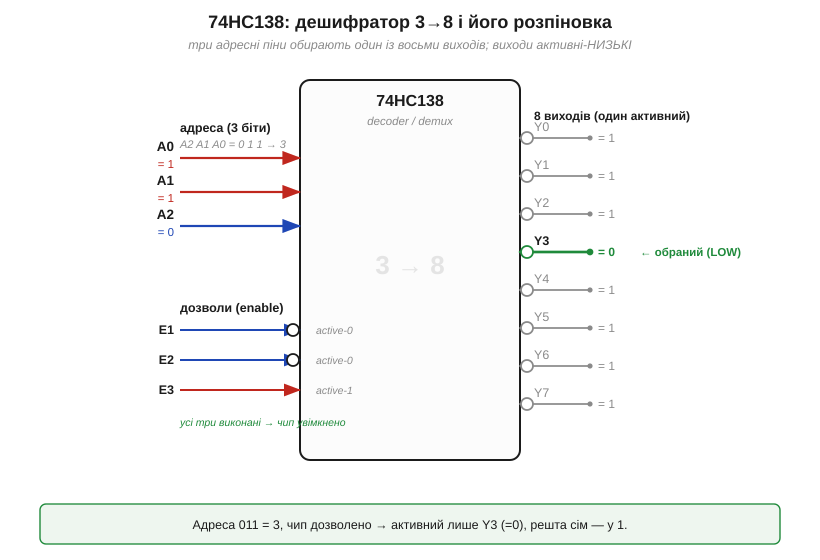
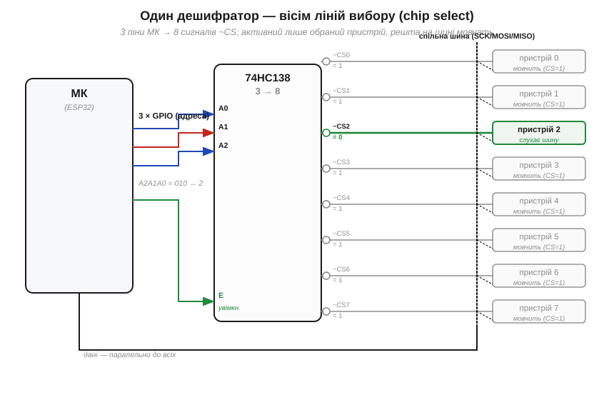

# 🔌 74HC138: дешифратор як «chip select» — три піни обирають один із восьми

74HC138 — мікросхема, що втілює [дешифратор](book:electronics/combinational-circuits) у чистому вигляді: номер на вході → активний рівно один вихід. Логічно це той самий блок, що збирається з вентилів, тільки тут він **3-в-8** і відлитий у готову деталь. Саме на ньому добре видно, як абстрактна комбінаційна схема перетворюється на справжню мікросхему, що день у день розв'язує цілком земну задачу: як кільком пристроям ужитися на одній спільній шині.

## Що це за деталь

74HC138 — це **дешифратор/демультиплексор «1 з 8»** (*3-to-8 line decoder/demultiplexer*): бере трибітне число на входах і вмикає рівно один із восьми виходів — той, чий номер дорівнює цьому числу. Це прямий нащадок історичної **серії 7400** (*7400-series*) — родини логічних мікросхем, що почалася з простого вентиля 7400 (чотири NAND в одному корпусі) від Texas Instruments: спершу у військовому виконанні (5400) восени 1964 року, а від 1966-го — у дешевому пластиковому корпусі для всіх. Кожній функції в серії дали свій номер; «138» дістався саме цьому дешифратору й закріпився за ним на десятиліття. Літери **HC** означають уже сучасну начинку — **High-speed CMOS** ([КМОН-вентиль](book:electronics/cmos-gate)): живлення 2–6 В, у спокої — мікроампери струму, тож деталь чудово почувається поряд з ESP32. Та сама логічна функція, що колись стояла в міні-комп'ютерах на TTL, тепер коштує копійки й тримається на тих самих CMOS-вентилях.


*Рис. Усередині — [дешифратор](book:electronics/combinational-circuits) 3→8. Зліва три **адресні** входи A0–A2 задають число (тут 011 = 3) і три **дозволи** E1, E2, E3. Справа — вісім виходів Y0–Y7, але з важливою деталлю: вони **активні-низькі** ([кружок-інверсія](book:electronics/basic-gates) на кожному). Обраний вихід падає в **0**, решта сім лишаються в **1** — дзеркально до схеми «один гарячий». Тут адреса 3 і чип дозволено, тож у 0 пішов лише Y3.*

## Блок-схема й розпіновка

Назовні 74HC138 — це три групи ніжок плюс живлення:

```
VCC, GND        — живлення (2–6 В) і земля
A0, A1, A2      — три адресні входи (число 0…7)
E1, E2 (~E)     — два дозволи, активні-НИЗЬКІ (для роботи тримати в 0)
E3              — третій дозвіл, активний-ВИСОКИЙ (для роботи тримати в 1)
Y0…Y7          — вісім виходів, активні-НИЗЬКІ (обраний = 0, решта = 1)
```

Двох речей варто пильнувати від початку, бо вони — головна пастка цієї деталі. По-перше, виходи **інверсні**: активний стан — це 0, а не 1, тож сім «неактивних» ліній постійно сидять у високому рівні. По-друге, дозволів аж **три**, і вони різнополярні: щоб чип узагалі почав декодувати, треба одночасно E1 = 0, E2 = 0 і E3 = 1. Інакше всі вісім виходів — у 1 (нічого не обрано). Ці три дозволи здаються надмірністю, та насправді це подарунок: вони дають змогу **складати** дешифратори в більші, не докуповуючи вентилів — наприклад, чотири 74HC138 і один інвертор перетворюються на дешифратор «1 з 32».

## Як підключити: вісім ліній вибору з трьох пінів

Тепер — навіщо все це на практиці. Уявімо спільну цифрову шину (як-от SPI), на якій висить кілька пристроїв. Шина в них спільна — ті самі дроти даних і тактів ідуть до всіх одразу, — тож у кожен момент говорити має **рівно один**, інакше відповіді змішаються. Кожен пристрій має вхід **вибору кристала** (*chip select*, ~CS), активний-низький: поки на ньому 1 — пристрій «спить» і відпускає шину; впав у 0 — пристрій слухає. Питання лише в тому, звідки взяти стільки сигналів ~CS, не витративши по ніжці МК на кожен. Відповідь — 74HC138.


*Рис. Три лінії GPIO мікроконтролера задають адресу 74HC138, а його вісім активних-низьких виходів ідуть просто на входи ~CS восьми пристроїв. За адреси 010 = 2 у 0 падає лише ~CS2 — слухає **пристрій 2**, решта сім тримають ~CS = 1 і мовчать. Шина даних (SCK/MOSI/MISO) спільна й заведена паралельно до всіх; хто з них озветься — вирішує дешифратор. Так **три** піни МК керують **вісьмома** вибірками.*

Вигода очевидна: інверсні виходи дешифратора лягають на інверсні входи ~CS **без жодного зайвого вентиля** — це той випадок, коли «незручна» активна-низька логіка раптом виявляється рівно тим, що треба. Три ніжки МК заступають вісім, а на дозвіл E можна завести ще один GPIO, щоб одним рухом «погасити» всі вибірки разом (корисно при старті, поки рівні ще не визначені).

## Перший байт: як ним «заговорити»

Найприємніше, що жодного протоколу тут немає — 74HC138 не програмують, він просто [комбінаційний](book:electronics/combinational-circuits): що на входах зараз, те й на виходах. «Перший байт» зводиться до трьох рядків думки:

```
1) виставити на A0,A1,A2 номер потрібного пристрою (0…7)
2) дешифратор САМ опустить відповідний ~CS у 0 (решта = 1)
3) поговорити по спільній шині — і підняти вибірку назад
```

Тобто вибір пристрою — це просто запис трьох бітів у три GPIO; усе інше дешифратор робить миттєво, без команд і регістрів.

## Типові граблі

- **Виходи активні-низькі.** Найчастіша помилка — чекати на обраному виході 1. Ні: обраний падає в **0**, а сім інших стоять у 1. Для входів ~CS це ідеально, але якщо вам потрібен активний-**високий** сигнал (скажімо, засвітити світлодіод), доведеться додати інвертор або взяти інший дешифратор.
- **Забули про дозволи.** Лишили E3 у 0 або підтягнули E1/E2 до 1 — і чип «мертвий»: усі виходи в 1, нічого не обирається. Незадіяні дозволи **прив'язуйте** жорстко (E1, E2 — на землю, E3 — на VCC), а не лишайте «висіти».
- **Тільки один активний завжди.** Дешифратор фізично не вміє мовчати «на всіх восьми»: коли він дозволений, рівно один вихід **завжди** в 0. Якщо потрібен стан «нікого не обрано», вимикайте чип через дозвіл E (тоді всі виходи підуть у 1).
- **Перемикання «обтікає» сусіда.** Поки три адресні біти змінюються не строго одночасно, на частку мікросекунди може коротко «блимнути» хибна адреса — і не той ~CS на мить впаде в 0 (це ті самі [глітчі](book:electronics/combinational-circuits), що виникають у комбінаційних схемах при неодночасній зміні входів). Тому адресу міняють, **поки шина мовчить**, а не посеред обміну.

## Варіації класу

Та сама функція живе в кількох близьких номерах. **74HC138** — базовий дешифратор «1 з 8» з активними-низькими виходами; **74HC238** — його двійник, але з активними-**високими** виходами (зручно там, де потрібна 1, а не 0). **74HC139** — це **два** незалежні дешифратори «1 з 4» в одному корпусі (коли восьми ліній забагато, а дві четвірки — саме враз). Ширший родич **74HC154** декодує вже «1 з 16» (чотири адресні входи). А за іншими літерами (74**LS**138 на старому TTL, 74**HCT**138 із входами під 5-вольтову логіку) ховається той самий дешифратор — змінюється лише начинка й рівні, а призначення «три піни обирають один із багатьох» лишається тим, заради чого ця деталь і потрапила в кожну шухляду з мікросхемами.
