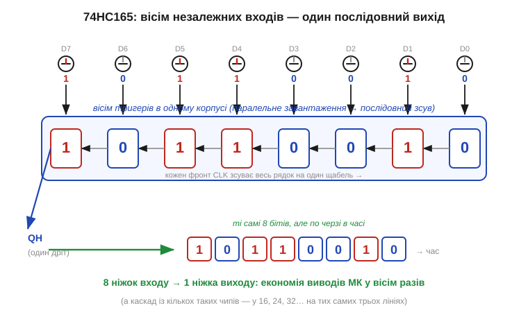
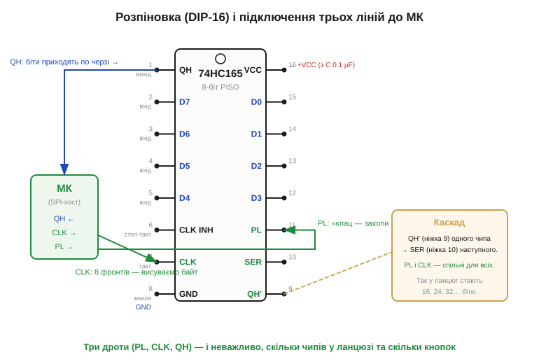
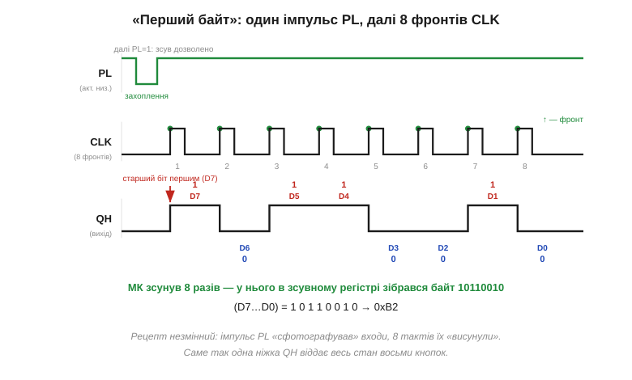

# 🔌 74HC165: вісім кнопок в одну ніжку

**74HC165** — це [зсувний регістр](topic:electronics/register) типу **PISO** (*parallel-in, serial-out*), відлитий в окрему мікросхему: він бере вісім **паралельних** входів і віддає їх **одним** послідовним дротом. Уся його робота — перекласти «всі біти разом» у «біти по черзі», і тут ця абстракція стає деталлю, яку можна взяти в руки.

## Що це за деталь

Уявімо пристрій із десятком кнопок, кінцевих вимикачів і перемикачів. Кожен — це один біт, і за наївного підходу кожен просить свою ніжку мікроконтролера. Ніжки скінченні, і вони закінчуються швидко. **74HC165** розв'язує це просто: усередині — **вісім [D-тригерів](topic:electronics/d-flip-flop)**, увімкнених як **зсувний регістр з паралельним завантаженням**. Спершу чип одним рухом **захоплює** стан усіх восьми входів (паралельне завантаження), а потім **висуває** їх назовні по одному біту на кожен такт. Вісім ліній входу перетворюються на одну лінію виходу.


*Вісім незалежних входів D7…D0 (тут — кнопки зі станами 1/0) одночасно завантажуються у вісім тригерів усередині корпусу. Далі кожен фронт такту зсуває рядок на щабель, і ті самі вісім бітів виходять одним дротом QH — по черзі в часі. Вісім ніжок входу коштують одну ніжку виходу.*

Префікс **74HC** означає лише технологію корпусу: це **high-speed CMOS**-варіант класичної серії 7400 (про її історію — у [📜-вставці](topic:electronics/register/hist-shift-register-ics.md)). Логіка ж усередині — звичайний [зсувний регістр](topic:electronics/register), тож нічого нового, крім реальних ніжок, тут немає.

## Блок-схема й розпіновка

Корпус — звичний **DIP-16** (є і SMD), і його виводи лягають точно на три ролі зсувного регістра: завантажити, тактувати, зчитати. Найважливіші ніжки такі:

```
D0…D7  — вісім паралельних входів (стан, який «фотографуємо»)
PL      — Parallel Load: імпульс «захопи всі вісім входів» (активний низький)
CLK     — такт: кожен фронт зсуває регістр на один біт
QH      — послідовний вихід: біти виходять старшим уперед; його ведуть на SER наступного чипа в каскаді
QH̅      — інверсний (комплементарний) вихід: той самий біт, але перевернутий
SER     — послідовний вхід (приймає QH попереднього чипа в ланцюзі)
CLK INH — Clock Inhibit: «заморозити» такт, поки високий
VCC, GND — живлення (з керамічним конденсатором 0.1 µF поруч)
```


*Зліва — мікроконтролер, що веде лише три лінії: PL («клац — захопи входи»), CLK (вісім фронтів) і QH (читаємо біти). Праворуч — каскад: вихід QH одного чипа йде на вхід SER наступного, а PL і CLK у них спільні, тож кілька корпусів стають єдиним довгим регістром на 16, 24, 32… біти — і все ще на тих самих трьох лініях.*

## Підключення

Звідси й схема підключення проста. Кнопки (чи будь-які джерела рівнів) сідають на входи D0…D7; як завжди для входів, кожному потрібен визначений рівень — [підтяжка](topic:electronics/floating-pullups), щоб ненатиснута кнопка не «плавала». До мікроконтролера йдуть **три** сигнали: PL, CLK і QH. Живлення шунтуємо конденсатором 0.1 µF біля ніжки VCC. А якщо восьми входів мало — нарощуємо **каскад**: QH першого чипа на SER другого, лінії PL і CLK у всіх спільні. Ланцюг із чотирьох корпусів дає 32 входи — і однаково тримається на трьох дротах. У цьому й сенс послідовного зв'язку: він економить дроти.

## Перший байт

Як «заговорити» з чипом — це майже дослівно процедура зсуву [регістра](topic:electronics/register). Спершу даємо короткий **імпульс PL**: він наказує всім восьми тригерам одночасно захопити те, що зараз на входах, — наче фотографія стану. Потім подаємо **вісім фронтів CLK** і на кожному читаємо ніжку QH: чип віддає біти **старшим уперед** (D7, далі D6, …, D0). Зібравши вісім бітів у свій зсувний регістр, мікроконтролер дістає цілий байт — стан усіх восьми входів.


*Часова діаграма «першого байта». Спершу імпульс PL «фотографує» входи. Далі вісім фронтів CLK висувають біти на QH — старший (D7) першим. Тут приклад дає (D7…D0) = 1 0 1 1 0 0 1 0, тобто 0xB2.*

Зчитування можна робити «вручну» (смикати ніжки CLK і PL програмно — біт-бенгінг) або доручити апаратному вузлу [SPI](topic:communications/spi-bus), бо «дай такт — читай біт» — це точно його робота; чип при цьому виглядає як джерело байтів по SPI. Сам рецепт простий, та збитися в ньому легко — ось де саме.

## Типові граблі

- **Переплутані PL і такт.** PL **активний низький**: захоплення відбувається, поки PL у нулі. Тримати PL у нулі весь час — означає, що регістр вічно перезавантажується входами й нічого не зсуває; забути опустити PL перед читанням — означає зсувати старі дані. Рецепт: коротко в нуль (захопити) → у одиницю (дозволити зсув) → вісім тактів.
- **Хибний порядок або інверсія бітів.** Вихід віддає **старший біт першим**; зберете біти в іншому порядку — і байт «перевернеться». Звіряйтеся з часовою діаграмою «першого байта».
- **Забута підтяжка на входах.** Ненатиснута кнопка без підтяжки лишає вхід плаваючим, і чип «сфотографує» шум замість чесного нуля чи одиниці.
- **CLK INH не там, де треба.** Якщо цей вхід випадково активний, такт «заморожений» і зсуву не буде; коли каскад не потрібен, ніжку SER теж не лишають у повітрі.
- **Каскад без спільних ліній.** У ланцюзі PL і CLK мусять бути **спільні** для всіх корпусів — інакше чипи захоплюють і зсувають уроздріб, і довгий регістр розсипається.

## Варіації класу

Найближчий родич — **74HC595**, дзеркальний за призначенням: не PISO, а **SIPO** (*serial-in, parallel-out*), тобто «один дріт → вісім виходів» для розширення **виходів** (світлодіоди, реле). Пара 165 + 595 і покриває обидва напрями: 165 збирає входи, 595 роздає виходи. Той самий PISO існує і в інших технологіях корпусу — **74HCT165** (входи під рівні TTL), **74LS165** (біполярна TTL-серія), **CD4021** (CMOS-серія 4000). Логіка скрізь одна — той самий [зсувний регістр](topic:electronics/register); різниться лише «обв'язка» рівнів, швидкість і живлення.
