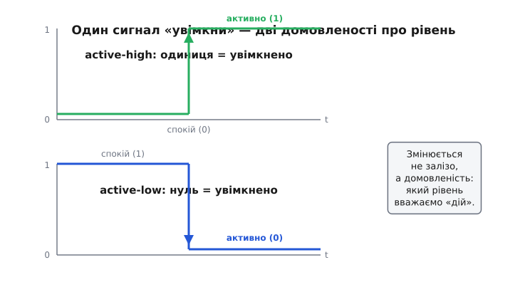
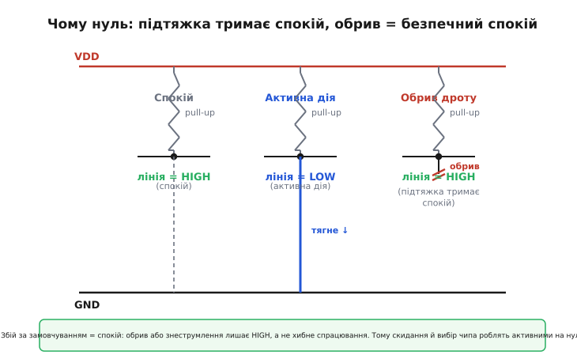
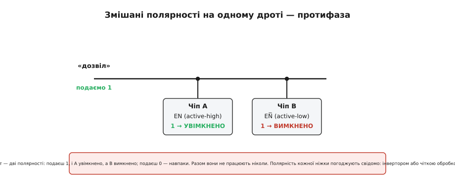

# Active-low: логіка «0 = увімкнено»

Здоровий глузд каже: одиниця — це «так», «увімкнено», «дій»; нуль — «ні», «спокій». Так і роблять для більшості сигналів. Але візьміть будь-яку мікросхему й гляньте на ніжку скидання, вибору чипа чи запиту переривання — і побачите дивне: там **навпаки**. Активна дія — це **низький** рівень, нуль. Ба більше, назву такої ніжки часто пишуть із рискою над нею: R̅E̅S̅E̅T̅. Наче хтось спеціально все перевернув.

Це не примха й не заплутування. За «активним нулем» (англ. *active-low* — «активний на низькому») стоїть фізика транзисторів і одна дуже практична вигода. Розберімо, звідки воно взялося, як його читати — і головне, як не втрапити в халепу, переплутавши, що тут «увімкнено».

## Що взагалі означає «активний»

Спершу домовмося про слово. **Активний** рівень сигналу — це той, що означає «дій, спрацюй, я тебе про щось прошу». Протилежний — **пасивний**, «спокій, нічого не роби, все як звичайно». Це поняття **логічне**, воно про зміст, а не про вольтметр.

А тепер накладімо на нього напругу. Є два способи:

- **active-high** («активний на високому»): активний рівень — це HIGH (одиниця). Подав одиницю — спрацювало. Це те, чого чекає інтуїція.
- **active-low** («активний на низькому»): активний рівень — це LOW (нуль). Спрацьовує, коли **садиш** ніжку в нуль, а одиниця — це «спокій».

Ключове, що плутає новачків: слова «активний» і «одиниця» — **не синоніми**. У active-low ніжці активна дія кодується **нулем**, а одиниця означає «не чіпай». Тобто «увімкнено» тут — це 0 В, а «вимкнено» — 3.3 В (чи 5 В). Саме звідси й підзаголовок: **0 = увімкнено**.


*Один і той самий сигнал «увімкни» у двох домовленостях. **Active-high**: спокій унизу (0), активна дія — стрибок угору (1). **Active-low**: спокій угорі (1), активна дія — падіння вниз (0). Змінюється не залізо, а те, який рівень ми домовилися вважати «дій». Плутати «активно» з «одиниця» не можна: у active-low активне — це нуль.*

> 🔧 **Навіщо це.** Перше правило, що рятує години налагодження: побачивши в даташиті ніжку `CS`, `RESET`, `EN` чи `IRQ`, не питайте «яка тут одиниця». Питайте «який рівень тут **активний**». Для active-low відповідь — нуль: щоб **вибрати** чип по `CS̅`, ви кладете на ту ніжку **0**, а не 1. Переплутаєте — і пристрій просто мовчатиме, хоч усе спаяно правильно.

## Звідки риска над назвою

Раз є дві домовленості, треба їх якось розрізняти прямо в назві сигналу — щоб з першого погляду було ясно, коли він «активний». Так і роблять. Активний рівень **позначають** прямо в імені:

- **риска зверху** — класика: R̅E̅S̅E̅T̅, C̅S̅, W̅E̅. Риска (англ. *overbar* — «верхня риска») читається як «не» і промовисто каже: активний рівень — **низький**.
- **скісна риска чи знак оклику попереду**: `/RESET`, `!CS` — те саме, коли риску зверху технічно незручно набрати (у коді, в схемах).
- **суфікс `_n` або `#`**: `RESET_N`, `CS#` — так само «активний нуль», лише іншим значком.

Звідки взявся саме такий запис? Він природно виріс із **булевої алгебри**, де риска над змінною — це заперечення (інверсія). Якщо величина `RESET` (без риски) означає «скидання відбувається», то `R̅E̅S̅E̅T̅` — це її заперечення: «сигнал активний, коли сама величина = 0». Інженери ранніх логічних родин (1960-ті) підхопили цей значок, бо він точно лягав на їхнє залізо, де активним справді був нуль. Відтоді риска зверху = «читай як active-low» — усталена, всюдисуща позначка.

Отже, риска — не прикраса, а **попередження**: обережно, тут «увімкнено» — це нуль. Немає риски (просто `EN`, `START`) — швидше за все active-high, звичайна одиниця вмикає. Але покладатися лише на назву не варто: остаточну правду завжди каже даташит. Назва підказує намір, даташит його підтверджує.

## Чому взагалі нуль, а не одиниця

Тепер найцікавіше — **чому** таку незручну на позір домовленість узагалі вигадали й досі люблять. Причин дві, і обидві глибокі.

**Перша — фізика транзисторів.** Класична логіка (TTL, а потім і CMOS) уміє **сильніше** тягнути ніжку **вниз**, до землі, ніж угору, до живлення. У біполярних (TTL) виходах нижній транзистор — міцний «поглинач» струму (може прийняти в себе чималий струм, *sink*), а верхнє плече слабше. Так виходить через саму будову напівпровідників: перенесення електронів (n-канал, npn) ефективніше за перенесення дірок. Тож **природний, сильний** стан виходу — це **притиснути лінію до нуля**. Якщо активна, важлива дія кодується саме цим сильним станом — сигнал виходить чіткішим і завадостійкішим. Активний нуль — це «дію сильною рукою», активна одиниця — «дію слабшою».

**Друга — спільні лінії й безпечний спокій.** Багато керівних сигналів мають вихід типу [відкритий стік/колектор](topic:electronics/open-drain): такий вихід уміє **лише тягнути вниз або відпускати**, а високий рівень задає зовнішня [підтяжка (*pull-up*)](topic:electronics/floating-pullups) до живлення. Це відразу дає дві переваги для active-low. По-перше, на **одну** лінію можна повісити кілька джерел (кілька пристроїв, що просять переривання), і **будь-хто** смикне її вниз — вийде природне «АБО» тривог без конфліктів. По-друге, спокій такої лінії — це HIGH, який тримає підтяжка. А отже, якщо дріт **обірветься** чи пристрій знеструмиться, лінія сама сяде у свій **пасивний** стан (підтяжка підніме її вгору = «спокій»), а не хибно «спрацює». Для скидання чи вибору чипа це золоте правило безпеки: обрив = «нічого не роблю», а не «випадково скинувся» чи «випадково вибрався».


*Active-low лінія з підтяжкою у спокої сидить у HIGH («не чіпай»). Активна дія — коли джерело **притягує** її вниз до нуля. Якщо дріт обірветься або пристрій вимкнеться, ніхто вже не тягне вниз — підтяжка сама піднімає лінію в **пасивний** HIGH. Тобто збій за замовчуванням означає «спокій», а не хибне спрацювання. Саме тому скидання й вибір чипа роблять активними на нулі.*

Складімо докупи: сильний вихід тягне вниз, спільні лінії природно збираються по «хтось смикнув униз», а обрив безпечно лишає спокій. Усі три вигоди вказують в один бік — **активним зробити нуль**. Ось чому ця «перевернута» логіка не курйоз, а промислова норма, особливо для скидання, вибору чипа, дозволу й переривань.

## Читаємо active-low у коді прошивки

Домовленість про рівні мусить точно віддзеркалюватися в програмі, інакше все розсиплеться. Розгляньмо типову ситуацію: керуємо чипом, у якого вибір `CS̅` — active-low. «Вибрати» чип — це подати на ніжку **нуль**; «відпустити» — подати одиницю.

**Приклад (active-low вибір чипа).** Ніжка `CS̅` заведена на вивід порту. Обмін даними триває, поки `CS̅` тримаємо в нулі, а по завершенні відпускаємо в одиницю:

```c
#define CS_PORT   GPIOB
#define CS_PIN    12          // CS̅ — active-low

// вибрати чип: активний рівень = НУЛЬ
static inline void chip_select(void)   { CS_PORT->BSRR = (1u << (CS_PIN + 16)); } // скинути в 0
// відпустити чип: пасивний рівень = ОДИНИЦЯ
static inline void chip_release(void)  { CS_PORT->BSRR = (1u <<  CS_PIN);       } // поставити 1

void read_sensor(void) {
    chip_select();            // 0 → чип слухає нас
    spi_transfer(0x80);       // ... обмін ...
    chip_release();           // 1 → чип відпущено
}
```

Зверніть увагу, наскільки легко тут схибити. Природний порив — написати «вибрати = поставити 1». Для active-low це **точно навпаки**, і чип просто не озветься. Тому корисне правило: **ховайте полярність за іменами**. Функції `chip_select()` / `chip_release()` кажуть, **що** робимо (вибрати/відпустити), а не **який рівень** виставляємо. Так полярність задана в одному місці — і решта коду читається зрозуміло, без ризику переплутати нуль з одиницею.

Те саме з **входом**. Хай кнопка заведена так, що натиснута притягує ніжку до землі (active-low, з підтяжкою до живлення) — типова схема, бо так [підтяжка тримає стабільний рівень](topic:electronics/floating-pullups), поки кнопку не чіпають. Тоді «натиснуто» — це **нуль** на ніжці, а прочитати намір треба через інверсію:

:::tabs
```cpp
// кнопка active-low: не натиснута → 1 (підтяжка), натиснута → 0
static inline bool button_pressed(void) {
    return (BTN_PORT->IDR & (1u << BTN_PIN)) == 0;   // 0 на ніжці = натиснуто
}
```
```micropython
from machine import Pin

# кнопка active-low: не натиснута → 1 (підтяжка), натиснута → 0
btn = Pin(BTN_PIN, Pin.IN, Pin.PULL_UP)

def button_pressed():
    return btn.value() == 0        # 0 на ніжці = натиснуто
```
:::

І знову — назва `button_pressed()` повертає **логічний намір** («натиснуто?»), а всю active-low кухню (порівняння з нулем) сховано всередині. Код зверху читається як думка людини, а не як загадка про рівні.

> 🔧 **Навіщо це.** Візьміть за звичку: **де сигнал active-low — там у коді одразу інверсія, схована за осмисленим ім'ям**. Не розкидайте порівняння «== 0» по всій програмі — інакше рано чи пізно десь напишете «== 1» і півдня шукатимете, чому кнопка «сама натискається». Одна функція-обгортка на полярність, зрозуміла назва — і ви більше ніколи не тримаєте в голові, де тут нуль, а де одиниця.

## Головна пастка: змішування полярностей

Найпідступніше з active-low — не сам нуль, а **мовчазне змішування** двох домовленостей в одній схемі. Один чип чекає активну одиницю на дозволі (`EN`, active-high), сусідній — активний нуль (`EN̅`, active-low). Якщо завести їх від **одного** керівного дроту навпростець, то коли перший «дозволено», другий буде «заборонено» — вони працюватимуть у протифазі, і ви ловитимете «неможливу» поведінку, де половина плати живе, а половина спить.

Ліки прості й механічні: **тримайте полярність кожної ніжки в голові окремо** й погоджуйте їх свідомо. Іноді достатньо інвертора між сигналами; іноді — просто акуратно розписати в коді, який рівень для кого «активний». Ніколи не припускайте «ну це ж дозвіл, значить одиниця» — гляньте, чи нема риски над назвою й що каже даташит.

І ще одне, суто читацьке. У булевих виразах риска-заперечення інколи «складається» несподівано. Скидання, активне на нулі (`R̅E̅S̅E̅T̅`), у програмі часто зручніше тримати як звичайну змінну `reset_active` (true = скидаємо), а перетворення «логічний намір ↔ рівень на ніжці» робити **лише** на самому краю, коли читаєте чи виставляєте ніжку. Тоді вся логіка всередині оперує зрозумілими «так/ні», і жодна риска не заплутує думку. Полярність — це властивість **дроту**, а не вашого міркування; тримайте її на межі заліза, а не в серці алгоритму.


*Пастка змішаних полярностей. Один дріт «дозвіл» заведено на active-high вхід (`EN`, активний на 1) і на active-low вхід (`EN̅`, активний на 0). Подаєш 1 — перший чип увімкнено, другий вимкнено; подаєш 0 — навпаки. Вони ніколи не працюють разом. Тому полярність кожної ніжки погоджують свідомо: інвертором у залізі або чіткою обробкою в коді.*

## Коротко про суть

Active-low — це домовленість, де **активна дія кодується нулем**, а одиниця означає спокій. Виникла вона не з примхи: класична логіка сильніше тягне лінію вниз, спільні лінії природно збираються по «хтось смикнув униз», а обрив за такої полярності безпечно лишає **спокій**, а не хибне спрацювання. Тому скидання, вибір чипа, дозвіл і переривання так часто роблять активними на нулі, а їхні назви позначають рискою зверху (чи `/`, `_n`, `#`) — як попередженням «тут увімкнено — це 0».

На практиці все зводиться до двох звичок. Спершу — питати не «де тут одиниця», а «який рівень **активний**», і брати відповідь із даташита. Далі — ховати полярність у коді за осмисленими іменами (`chip_select`, `button_pressed`), роблячи інверсію рівно на межі із залізом. Тоді «перевернута» логіка нуля перестає плутати: ви просто кажете пристрою, що робити, а він слухається — навіть якщо його «так» на дроті виглядає як нуль.
