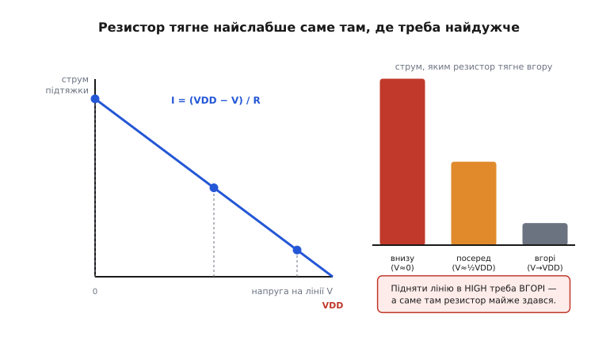
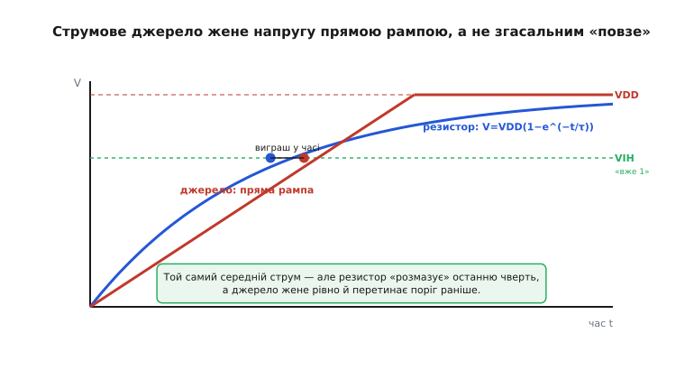
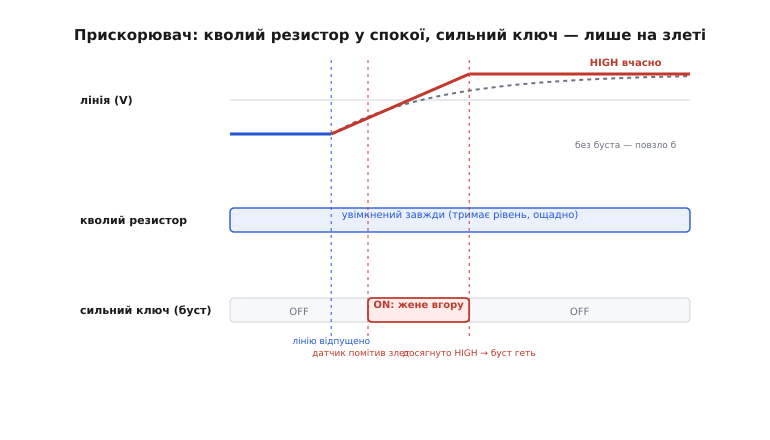
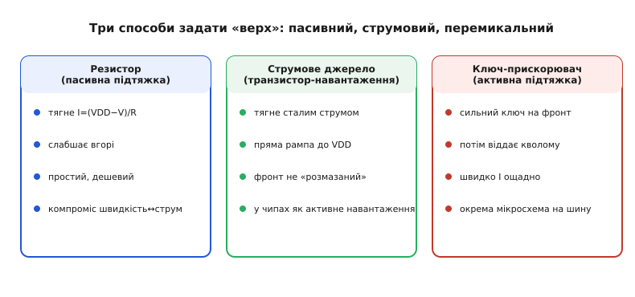

# Активна підтяжка і струмове джерело

Найпростіший спосіб задати на лінії «одиницю» — почепити [резистор-підтяжку до VDD](topic:electronics/floating-pullups): він кволо тягне лінію вгору, коли її ніхто не тримає активно. Дешево, надійно, скрізь. Але в цьому резисторі захована **вроджена вада**, і що швидша чи довша лінія — то болючіше вона дається взнаки. Вада ось у чому: резистор тягне вгору **найслабше саме тоді, коли до мети вже близько** — коли напруга майже дісталася VDD. А підняти лінію в надійну одиницю треба саме там, угорі. Виходить, найголовнішу частину шляху резистор долає ледь-ледь.

Лікують це, замінивши **пасивний** резистор чимось **активним** — елементом, що не просто «висить між лінією і VDD», а або тягне зі **сталою** силою незалежно від напруги (струмове джерело), або **чуйно вмикає сильний ключ** саме на злеті й тут же відпускає (активна підтяжка-прискорювач). Обидва прибирають ту саму ваду резистора, і обидва — те, на чому тримаються швидкі шини й акуратні аналогові вузли. Розберімо, звідки береться вада й чим її б'ють.

### Чому пасивний резистор слабшає саме вгорі

Погляньмо, з якою силою резистор-підтяжка тягне лінію вгору. Сила ця — струм, яким він заряджає лінію, а він підкоряється [закону Ома](topic:physics/electric-current):

```
струм підтяжки:
   I = (VDD − V) / R

   V   — напруга, яка вже є на лінії
   VDD — куди тягнемо
   R   — номінал підтяжки
```

Уся суть — у чисельнику `(VDD − V)`: це **проміжок, що лишився** до мети. Поки лінія внизу (щойно її відпустив нижній транзистор, `V ≈ 0`), проміжок великий — і струм найбільший, резистор тягне бадьоро. Але що вище підповзає напруга, то менший проміжок — і струм **згасає**. У самого VDD проміжок нульовий, і струм падає до нуля: резистор тут майже здався.


*Резистор тягне вгору струмом I=(VDD−V)/R, тобто **пропорційно проміжку, що лишився**. Унизу проміжок великий — тягне сильно; біля VDD проміжок стискається до нуля — струм гасне. Прикрість у тому, що надійну одиницю лінія набирає саме вгорі, а резистор дійшов туди майже без сили.*

Ось чому лінія на резисторній підтяжці не «підстрибує» в HIGH, а **повзе** й найдовше вовтузиться на останній чверті шляху. Будь-яка лінія має паразитну **ємність** (сам провідник, входи мікросхем, монтаж), і резистор заряджає її не миттєво, а за час близько `τ = R·C` — виходить згасальна крива, [та сама «повільна одиниця» open-drain-виходів](topic:electronics/open-drain). Хочеш швидше — бери менший резистор; але менший резистор у стані LOW (коли лінію тягнуть униз) марно палить більший струм. Це той **компроміс швидкість↔струм**, що затискає [вибір номіналу підтяжки](topic:electronics/floating-pullups) у вузьке вікно. Вада нікуди не дівається — її лише пересувають.

> 🔧 **Навіщо це.** Ця вада — головна причина, чому [шина I2C](topic:communications/i2c-bus) має стелю швидкості. На «швидкому» I2C (400 кГц) чи «швидкому+» (1 МГц) із довгими доріжками й багатьма пристроями ємність велика, а резистор мусить встигнути підняти лінію між тактами. Коли шина «не тягне» на високій частоті — винен саме цей повільний, згасальний фронт HIGH. І перше, що пробують, — зменшити резистор; а коли й це не рятує (струм у LOW стає завеликий), переходять до **активних** способів, про які далі.

### Струмове джерело: тягнути сталою силою

Найперша ідея напрошується сама: а що, як тягти лінію вгору не резистором, а таким елементом, що дає **сталий струм незалежно від напруги** на лінії? Тоді проміжок `(VDD − V)` більше не керує силою — струм однаковий і внизу, і майже нагорі. Такий елемент — **струмове джерело** (англ. *current source* — джерело струму): двополюсник, що жене крізь себе задану величину струму, хоч би яка напруга на ньому впала.

Що це міняє? Ємність, яку заряджають **сталим** струмом, набирає напругу **рівномірно** — не згасальною кривою, а **прямою рампою** (англ. *ramp* — похила пряма, «підйом»). Швидкість підйому проста:

```
підйом напруги при сталому струмі I:
   ΔV / Δt = I / C        (заряджаємо ємність C струмом I)

   тобто час дійти від 0 до VDD:
   t = C · VDD / I        — лінійно, без «розмазаного» хвоста
```

Пряма рампа не гальмує на підході до VDD — вона однаково крута весь шлях і **перетинає поріг «уже одиниця» (VIH) раніше**, ніж згасальна експонента резистора з тим самим середнім струмом. А ще — і це головне — струмове джерело **розчіпляє** дві речі, які резистор намертво зв'язав: «як сильно тягну вгору» більше не диктує «скільки марную в стані LOW». Ти задаєш рівно той струм, що потрібен для потрібної швидкості, — не більше.


*Та сама ємність, той самий середній струм. Резистор жене напругу за V=VDD(1−e^(−t/τ)) — круто внизу, ледь-ледь угорі, тож поріг VIH перетинає пізно. Струмове джерело жене **сталим** струмом — пряма рампа, однаково крута весь час, перетинає поріг раніше. Виграш саме там, де резистор здавався.*

Звідки взяти таке джерело? З транзистора. Транзистор у певному режимі поводиться саме як струмове джерело: пропускає струм, майже не зважаючи на напругу на собі. Найчистіший спосіб задати цей струм точно — [**дзеркало струмів** (*current mirror*)](topic:electronics/current-mirror): схема з пари транзисторів, що «віддзеркалює» задану величину струму в потрібну гілку. Поставивши таке дзеркало підтяжкою замість резистора, дістаємо підтяжку, що тягне вгору **точним сталим струмом** — активну підтяжку струмовим джерелом.

### Де струмове джерело тягне за нас насправді

Може здатися, що струмове джерело замість резистора — рідкісна екзотика. Насправді ви користуєтеся ним щодня, самі того не бачачи: воно живе **всередині мікросхем**. Проектуючи логіку в кремнії, звичайний резистор ставити невигідно — він займає багато місця й гріється; натомість ставлять **транзистор-навантаження** (*active load* — активне навантаження), що поводиться між резистором і струмовим джерелом. Історично ранню логіку так і будували: у сімействі **NMOS** роль верхньої підтяжки грав окремий транзистор із приєднаним до опору затвором — саме він давав приблизно сталий струм і виходив куди кращим навантаженням, ніж голий резистор.

Та сама ідея працює й у сучасному аналоговому кремнії: коли підсилювальному каскаду треба «навантаження вгору», ставлять не резистор, а струмове дзеркало — і дістають водночас велике підсилення й акуратну робочу точку. Тобто «активна підтяжка струмовим джерелом» — це не хитрий трюк для окремого випадку, а **основний будівельний блок** усередині мільярдів мікросхем.

> 🔧 **Навіщо це.** Прикладнику з платою й прошивкою це знадобиться так: коли бачите в даташиті вихід із позначкою «current-source output» чи вхідний струм, заданий як стала величина (а не «через підтяжку R»), — знайте, що всередині сидить активна підтяжка струмовим джерелом, і поводиться вона **інакше**, ніж резистор. Її струм не залежить від напруги на лінії, тож звичні прикидки «τ = R·C» до неї не застосовні — рахуйте рампу `t = C·ΔV/I`. Це рятує від здивування, чому фронт виходить не такий, як підказує резисторна інтуїція.

### Активна підтяжка-прискорювач: сильний ключ лише на злеті

Струмове джерело — гарне рішення там, де підтяжку можна закласти в кремній. Але на **готовій шині** (як I2C), де висить купа сторонніх пристроїв і стоїть звичайний резистор, кремній не переробиш. Тут застосовують інший, дуже дотепний хід — **активну підтяжку-прискорювач** (англ. *rise-time accelerator*, *bus accelerator* — прискорювач фронту, прискорювач шини).

Ідея будується на чесному компромісі. У **спокої** лінію тримає слабкий резистор — саме як завжди, ощадно, майже без струму, поки нічого не відбувається. Але поряд сидить **датчик**, що стежить за лінією. Щойно нижній транзистор відпустив лінію й вона **почала повзти вгору**, датчик це ловить — і на коротку мить умикає **сильний** транзистор, що жене лінію вгору потужно, куди швидше за кволий резистор. Лінія стрімко долітає до HIGH — і тут прискорювач **вимикає** сильний ключ, повертаючи все кволому резистору. Сильний струм тече **лише ті кілька наносекунд, поки триває фронт**, а весь інший час лінію тримає ощадний резистор.


*Активна підтяжка-прискорювач у роботі. Кволий резистор увімкнений завжди (тримає рівень ощадно). Коли лінію відпущено й вона рушила вгору, датчик це помічає й на час фронту вмикає **сильний ключ** — лінія круто злітає в HIGH замість того, щоб повзти (пунктир). Досягли HIGH — буст геть, знову самий резистор. Швидко І ощадно.*

Так прискорювач розриває той самий проклятий компроміс, але вже на рівні **часу**: сильно тягне лише тоді, коли це справді треба (на злеті), а не весь час. Виходить швидкий фронт, як у малого резистора, **без** його постійного марного струму в LOW. Саме так працюють спеціальні мікросхеми-прискорювачі для довгих і навантажених I2C-шин — вони [ловлять фронт і підганяють його активним ключем](topic:electronics/slew-rate-control), даючи шині взяти швидкість, недосяжну на самому резисторі.

Тут є одна тонкість, за яку варто чіплятися оком. Прискорювач мусить **надійно відрізняти** справжній фронт «лінію відпустили, вона летить угору» від власне повільного повзання чи наводки — інакше він або не спрацює, або, гірше, увімкне сильний ключ **не вчасно** й почне битися струмом із пристроєм, що якраз тягне лінію **вниз**. Тому такі мікросхеми мають поріг швидкості наростання: реагують лише на достатньо круте `dV/dt`, характерне для справжнього релізу лінії. Це не «просто ще одна підтяжка» — це маленький розумний вузол зі своєю логікою.

Історія цього прийому старша за I2C. Ще на світанку [двотактних виходів](topic:electronics/push-pull-output) інженери зрозуміли: пасивний резистор угорі — повільний, тож замість нього поставили **активний** верхній транзистор. Ця «активна підтяжка» дала легендарній логіці 7400 її швидкість; як саме вона влаштована (транзистор-повторювач угорі, стравлювальний діод проти наскрізного струму) і хто її придумав — у вставці [історія активної підтяжки в TTL](topic:electronics/active-pullup/hist-ttl-totem-pole.md).

### Три роди «верху»: коротко про вибір

Зведімо докупи три способи задати на лінії одиницю — бо вибір між ними і є практичною суттю теми.


*Три роди підтяжки вгору. **Резистор** — пасивний, простий, дешевий, але слабшає вгорі й тримає компроміс швидкість↔струм. **Струмове джерело** — тягне сталим струмом, дає пряму рампу, живе всередині чипів як активне навантаження. **Ключ-прискорювач** — сильний транзистор лише на фронт, тоді віддає кволому резистору; швидко й ощадно, зазвичай окрема мікросхема на шину.*

Правило вибору просте й причинне. Якщо лінія повільна чи коротка, а ємність мала — **резистора досить**, нічого не ускладнюй. Якщо підтяжку закладаєш **у кремній** і хочеш чистий, незалежний від напруги струм (аналоговий каскад, вихід із заданим струмом) — **струмове джерело**. А якщо в тебе **готова швидка шина** з великою ємністю, де резистор уже не встигає, а зменшувати його нікуди (струм у LOW зашкалює) — **прискорювач**: він дасть швидкість без марнотратства.

### Порахуймо: чи встигне резистор, чи потрібен активний спосіб

Найкорисніше, що дає ця тема прикладнику, — уміння **завчасно** сказати, чи витягне звичайний резистор потрібну швидкість шини, чи вже час думати про активну підтяжку. Порахуймо це для реальної I2C-лінії.

**Приклад (чи тягне резистор швидкий I2C).** Шина: `VDD = 3.3 В`, ємність лінії `C = 200 пФ` (довга доріжка, кілька пристроїв), підтяжка `R = 4.7 кОм`. Стандарт «швидкого» I2C (400 кГц) дозволяє на фронт HIGH щонайбільше `t_r = 300 нс`. Резистор устигне?

```c
#include <stdio.h>

int main(void) {
    double Vdd = 3.3;        // В
    double C   = 200e-12;    // Ф  (200 пФ)
    double R   = 4700.0;     // Ом
    double t_allowed = 300e-9; // с  — межа фронту для Fast-mode I2C

    // Фронт HIGH міряють між 0.3·VDD і 0.7·VDD (як у даташиті I2C).
    // Для згасальної експоненти V=VDD(1−e^(−t/RC)) цей відрізок triває ≈ 0.847·R·C.
    double tau   = R * C;                 // стала часу RC
    double t_rise = 0.847 * tau;          // час фронту 30%→70%

    printf("RC = %.0f ns\n", tau * 1e9);
    printf("фронт резистора (30-70%%) = %.0f ns\n", t_rise * 1e9);
    printf("дозволено стандартом      = %.0f ns\n", t_allowed * 1e9);
    printf(t_rise <= t_allowed ? ">> резистор ВСТИГАЄ\n"
                               : ">> резистор НЕ встигає — треба менший R або прискорювач\n");
    return 0;
}
```

Порахуймо руками, що видасть програма:

```
RC = R · C = 4700 · 200·10⁻¹² = 9.4·10⁻⁷ с = 940 нс
фронт (30→70%) = 0.847 · 940 ≈ 796 нс
дозволено       = 300 нс

796 нс > 300 нс  →  резистор НЕ встигає
```

Резистор програє більш ніж удвічі. Що робити? Спробувати менший `R` — скажімо, 1.5 кОм: тоді `RC = 300 нс`, фронт `≈ 254 нс` — уже влазить. Але перевірмо ціну: у стані LOW через таку підтяжку тектиме `I = 3.3 / 1500 = 2.2 мА`, і це на **кожній** із двох ліній шини, у кожному нулі. Якщо пристроїв багато, шина довга, а живлення батарейне — цей струм уже кусається, та й не кожен вихідний транзистор його певно «проковтне». Ось точка, де інженер каже: далі зменшувати резистор нема куди — і ставить **прискорювач**, який дасть ті самі стрімкі фронти, лишивши в спокої ощадні 4.7 кОм.

Саме такий розрахунок — «порахував фронт резистора, порівняв із межею стандарту, зважив струм у LOW» — і відрізняє того, хто розуміє активну підтяжку, від того, хто наосліп крутить номінал, доки «якось запрацює». Точний вивід формули `0.847·R·C` (звідки береться множник і чому фронт міряють саме між 30% і 70%), а поряд — чому пряма рампа струмового джерела виграє в експоненти при однаковому середньому струмі, розкладено у вставці [математика фронту: RC проти рампи](topic:electronics/active-pullup/math-rc-vs-ramp.md).

Отже, пасивний резистор-підтяжка носить у собі вроджену ваду: тягне вгору **пропорційно проміжку, що лишився**, тож слабшає саме на підході до VDD — там, де надійну одиницю набирати найважче, — і намертво зв'язує швидкість фронту з марним струмом у нулі. Активна підтяжка цю ваду прибирає двома шляхами: **струмове джерело** тягне сталою силою й дає пряму рампу замість згасального повзання (так працюють активні навантаження всередині мікросхем), а **ключ-прискорювач** умикає сильний транзистор лише на короткий час фронту, лишаючи спокій ощадному резистору (так тягнуть швидкість готові шини на кшталт I2C). Обидва — про те саме: не тягти лінію «як вийде», а тягти її **розумно** — саме там і саме тоді, де й коли це справді потрібно.
