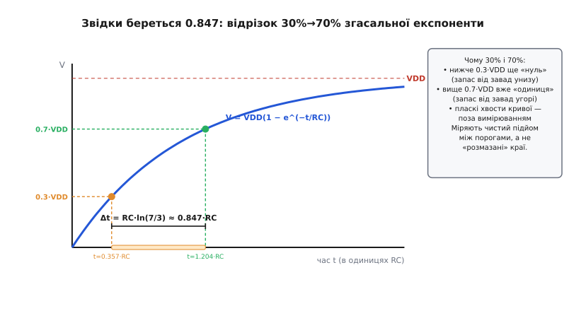
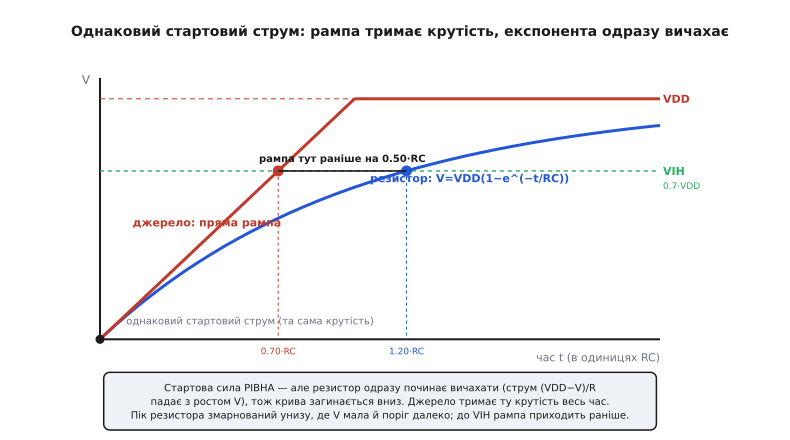

# 🧮 Математика фронту: RC проти рампи

Дві короткі формули вирішують геть практичне питання: **чи витягне звичайний резистор потрібну швидкість шини, чи вже треба активна підтяжка**. Перша — час фронту резистора, `0.847·R·C`. Друга — час рампи струмового джерела, `t = C·ΔV/I`. За цими двома числами інженер каже «резистор устигає» або «ні, ставмо струмове джерело / прискорювач» — не крутячи номінал наосліп. Тут ми виведемо обидві **від першопричини**: звідки взявся дивний множник 0.847, чому фронт міряють саме між 0.3·VDD і 0.7·VDD, і — найцікавіше — чому пряма рампа перетинає поріг раніше за згасальну експоненту, дарма що починають вони з однаковою силою. Останнє тонше, ніж здається на перший погляд, і саме там ховається справжня суть.

## Що ми взагалі рахуємо: заряд ємності через опір

Будь-яка лінія має паразитну **ємність** (англ. *capacitance* — здатність утримувати заряд): сам провідник відносно землі, входи мікросхем, монтаж. Позначмо її `C`. Резистор-підтяжка `R` під'єднаний між лінією та живленням `VDD`. Коли нижній транзистор відпускає лінію, вона стоїть біля нуля, і резистор починає лити в цю ємність заряд — напруга `V` на лінії повзе вгору. Питання лише: **за яким законом** повзе і **скільки часу** їй до надійної одиниці.

Закон випливає з двох простих фактів. Перший — [**закон Ома**](book:physics/electric-current): струм крізь резистор дорівнює спаду напруги на ньому, поділеному на опір. Спад на резисторі — це різниця між тим, куди тягнемо, і тим, що вже є на лінії:

```
струм, яким резистор заряджає ємність:
   I(t) = (VDD − V(t)) / R
```

Другий факт — визначення ємності: заряд, що надійшов, підіймає напругу пропорційно, `Q = C·V`. А струм — це і є швидкість надходження заряду, `I = dQ/dt = C·dV/dt`. Прирівняймо два вирази для струму:

```
C · dV/dt = (VDD − V) / R
```

Це **диференціальне рівняння** (рівняння, що зв'язує величину з її швидкістю зміни). Читається просто: швидкість підйому напруги пропорційна тому, **скільки ще лишилося** дотягти, `(VDD − V)`. Що ближче лінія до VDD — то менший проміжок, то повільніший підйом. Саме звідси й береться згасання: система гальмує сама себе на підході до мети.

> 🔧 **Навіщо це.** Це те саме рівняння, що керує зарядкою будь-якого конденсатора через опір, — від фільтра живлення до затримки на RC-ланцюжку. Розв'язавши його раз, ви розумієте фронт HIGH на I2C, час установлення на аналоговому вході АЦП і чому кнопка «дзвенить» саме стільки, скільки дзвенить. Одна формула — десятки застосувань.

## Розв'язок: згасальна експонента

Розв'язати таке рівняння можна відокремленням змінних, але тут важливіший **результат** і його форма. Функція, чия швидкість зростання пропорційна залишку до стелі, — це насичувальна експонента:

```
V(t) = VDD · (1 − e^(−t / RC))

   e   — основа натурального логарифма, ≈ 2.71828
   RC  — добуток опору на ємність, має розмірність часу (секунди)
```

Перевірмо, що це справді розв'язок, — на очах, без віри. При `t = 0`: `e^0 = 1`, тож `V = VDD·(1−1) = 0` — лінія стартує з нуля, правильно. При `t → ∞`: `e^(−∞) = 0`, тож `V → VDD` — доповзає до живлення, теж правильно. А похідна `dV/dt = (VDD/RC)·e^(−t/RC)` — підставте її й `V(t)` назад у рівняння `C·dV/dt = (VDD−V)/R`, і обидві сторони збігаються тотожно. Отже, форма вгадана правильно.

Ключова величина тут — добуток `RC`, який називають **сталою часу** (англ. *time constant*), і позначають грецькою `τ` (тау). Це природний масштаб часу задачі: за `t = τ` напруга проходить частку `1 − e^(−1) = 0.632`, тобто **63.2%** шляху до VDD. За `2τ` — 86.5%, за `3τ` — 95%, за `5τ` — 99.3%. Формально до VDD лінія не доходить **ніколи** — лише підповзає дедалі ближче. Ось чому «повний» час зарядки — поняття беззмістовне; має сенс лише час до **конкретного порога**.

> Стала часу RC — окрема глибока тема: чому саме добуток опору й ємності дає час, як вона задає смугу пропускання й затримку. Тут ми беремо готову формулу `V=VDD(1−e^(−t/RC))`; повне виведення й інтуїцію «чому 63%» дивіться в темі [Стала RC](book:electronics/rc-time-constant).


*Напруга на лінії йде згасальною експонентою до VDD. Опустивши на вісь часу точки, де крива перетинає 0.3·VDD і 0.7·VDD, дістаємо відрізок Δt — це і є час фронту 30%→70%. Він дорівнює RC·ln(7/3) ≈ 0.847·RC. Праворуч — чому міряють саме між цими рівнями: пласкі хвости кривої (унизу й біля VDD) з вимірювання викидають, лишаючи чистий підйом між порогами.*

## Чому фронт міряють між 0.3·VDD і 0.7·VDD

Перш ніж рахувати час фронту, треба домовитися, **від якого рівня до якого** його рахувати. Наївно було б сказати «від 0 до VDD» — але це число нескінченне (експонента доходить до VDD лише в нескінченності) і безглузде. Тому фронт завжди міряють між двома **проміжними** рівнями. Питання: якими саме?

Відповідь диктує не математика, а **логіка цифрового приймача**. Приймач не бачить точної напруги — він бачить лише «нуль» чи «одиниця», і має два пороги. Усе, що **нижче** нижнього порога, він певно читає як нуль; усе, що **вище** верхнього, — певно як одиницю; проміжок між ними — заборонена зона невизначеності. У [шини I2C](book:communications/i2c-bus) ці пороги стандарт задає прямо через частку живлення: нижній `VIL = 0.3·VDD`, верхній `VIH = 0.7·VDD`. Нижче трьох десятих — гарантований нуль, вище семи десятих — гарантована одиниця (це підтверджено специфікацією I2C: рівні прив'язані саме до 0.3·VDD і 0.7·VDD, статус — усталений факт).

Тепер зрозуміло, чому фронт міряють саме тут. Час, за який лінія проходить **від 0.3·VDD до 0.7·VDD**, — це час, поки сигнал перебуває в **забороненій зоні**, між «уже не певний нуль» і «ще не певна одиниця». Саме цей проміжок критичний: поки напруга в ньому, приймач не має права надійно читати лінію. Що довше він триває — то більше часу шина «сліпа». Тому стандарт нормує **саме його**, а не розмазані хвости внизу (де сигнал і так уже певний нуль) і вгорі (де він і так уже певна одиниця).

Є й друга, суто вимірювальна причина. Хвости експоненти пласкі: біля VDD крива майже горизонтальна, і точно засікти, коли вона «дійшла», неможливо — дрібний шум зсуває момент на скільки завгодно. А **в середині** крива крута, тож перетин рівня датується чітко й повторно. Міряючи між 30% і 70%, ми беремо найкрутішу, найвизначенішу частину підйому — там, де і фізика цифрового рішення, і надійність вимірювання збігаються.

> 🔧 **Навіщо це.** Коли берете осцилограф і дивитеся фронт I2C, курсори ставте саме на 0.3·VDD і 0.7·VDD, а не «на око від низу до верху». Інакше ваше виміряне число не порівняти з межею даташита (`t_r ≤ 300 нс` для Fast-mode), бо стандарт нормує саме відрізок 30→70%. Виміряли інакше — порівнюєте яблука з грушами й даремно міняєте резистор.

## Виведення множника 0.847

Тепер — власне число. Треба знайти час, за який `V(t)` проходить від `0.3·VDD` до `0.7·VDD`. Знайдемо два моменти окремо й віднімемо.

Момент, коли лінія досягла частки `k` від VDD, дістаємо, підставивши `V = k·VDD` у розв'язок і виразивши час:

```
k·VDD = VDD·(1 − e^(−t/RC))
      k = 1 − e^(−t/RC)
e^(−t/RC) = 1 − k
   −t/RC = ln(1 − k)
       t = −RC · ln(1 − k) = RC · ln(1 / (1 − k))
```

Тепер підставмо два наші рівні. Для нижнього, `k = 0.3`:

```
t₃₀ = RC · ln(1 / (1 − 0.3)) = RC · ln(1/0.7) = RC · ln(10/7) ≈ 0.3567·RC
```

Для верхнього, `k = 0.7`:

```
t₇₀ = RC · ln(1 / (1 − 0.7)) = RC · ln(1/0.3) = RC · ln(10/3) ≈ 1.2040·RC
```

Час фронту — різниця. І тут стається гарне спрощення. Різниця двох логарифмів — це логарифм частки, а `VDD` і зайві десятки скорочуються:

```
t_фронту = t₇₀ − t₃₀
         = RC·ln(1/0.3) − RC·ln(1/0.7)
         = RC·[ln(1/0.3) − ln(1/0.7)]
         = RC· ln( (1/0.3) / (1/0.7) )
         = RC· ln( 0.7 / 0.3 )
         = RC· ln( 7 / 3 )
```

Залишилося порахувати сам логарифм. `7/3 ≈ 2.3333`, а його натуральний логарифм:

```
ln(7/3) = ln(2.3333…) ≈ 0.8473
```

Ось звідки береться множник. Час, за який згасальна експонента проходить від 30% до 70% свого кінцевого рівня, **завжди** дорівнює `0.847·RC` — байдуже, які там VDD, R і C окремо. Це число — чиста властивість форми експоненти на відрізку 30→70%, стала природи, як 63.2% для однієї τ.

Зверніть увагу на красу виведення: **VDD зникло**. Час фронту між двома **частками** живлення не залежить від самого живлення — лише від `R`, `C` і вибору тих часток. Живи шина на 3.3 В чи на 1.8 В — множник той самий 0.847, бо і пороги, і крива масштабуються разом. Це і є причина, чому стандарти задають пороги у частках VDD, а не у вольтах: одне правило працює на будь-якій напрузі.

Корисно тримати в голові й сусідні числа тієї самої природи. Якби фронт міряли між 10% і 90% (як заведено для багатьох інших сигналів), множник був би `ln(9/1) = ln 9 ≈ 2.197·RC` — майже втричі більший, бо 10→90% захоплює довші пласкі краї. А одна стала часу `τ = RC` — це підйом до 63.2%. I2C свідомо взяв вужчий, крутіший відрізок 30→70%, і тому його «природний» множник — саме скромні 0.847.

**Приклад (порахувати фронт руками).** Шина: `VDD = 3.3 В`, ємність лінії `C = 200 пФ`, підтяжка `R = 4.7 кОм`.

```
τ = R·C = 4700 · 200·10⁻¹² = 9.4·10⁻⁷ с = 940 нс
t_фронту(30→70%) = 0.847 · 940 нс ≈ 796 нс
```

Порівняймо з межею Fast-mode I2C (`t_r ≤ 300 нс`): 796 нс більш ніж удвічі перевищує норму — резистор **не встигає**. Це число ви дістали одним множенням, не інтегруючи нічого. (Тут же видно й межі інших режимів I2C — усталені: Standard-mode дозволяє до 1000 нс, Fast-mode — до 300 нс, Fast-mode+ — до 120 нс; що швидша шина, то жорсткіша вимога до фронту.)

## Другий спосіб заряду: пряма рампа струмового джерела

Тепер порахуймо ту саму ємність, заряджену **інакше** — не резистором, а **струмовим джерелом** (елементом, що жене крізь себе задану величину струму незалежно від напруги на ньому). Математика тут навіть простіша, і саме її простота — ключ до розуміння виграшу.

Струмове джерело дає сталий `I`. Ємність, у яку ллється сталий струм, набирає заряд рівномірно, `Q(t) = I·t`, а напруга росте пропорційно заряду:

```
V(t) = Q(t) / C = I·t / C
```

Це **пряма лінія** — рампа (англ. *ramp* — похилий підйом). Її крутість стала весь час:

```
dV/dt = I / C = const
```

Звідси час дійти до будь-якого рівня `ΔV` — просто діленням:

```
t = C · ΔV / I
```

Жодних логарифмів, жодного згасання. Рампа не гальмує на підході до мети — вона однаково крута від нуля до верху. Порівняйте два світи: у резистора швидкість підйому `(VDD−V)/(RC)` **падає** з ростом V, у джерела `I/C` **стала**. Резистор гальмує сам себе; джерело — ні.

Це те саме диференціальне рівняння, тільки з іншим джерелом: замість `(VDD−V)/R` праворуч стоїть сталий `I`. Прибравши залежність струму від напруги, ми прибрали й згасання — розв'язком стала не експонента, а пряма.

## Серце теми: чому рампа перетинає поріг раніше

А тепер — найцікавіше й найтонше. Часто кажуть: «рампа приходить до порога раніше, ніж експонента з тим самим **середнім** струмом». Звучить переконливо, але як заявлено — **неправда**, і варто зрозуміти чому, бо на цьому легко впасти.

Розберімо чесно. «Той самий середній струм» означає: за той самий час обидва способи внесли в ємність **той самий сумарний заряд**, тож і напруга в кінці однакова. Але щоб дійти до однакового кінця за однаковий час, згасальна крива (яка спереду крута, ззаду полога) мусить іти **вище** прямої на всьому проміжку між ними — вона ж витрачає більше заряду раніше. А якщо експонента вище прямої, то поріг VIH (який нижче кінцевої точки) вона перетне **раніше** за рампу, а не пізніше. Тобто за буквального прочитання «однаковий середній струм» виграє якраз експонента. Пастка.

То в чому ж правда? Правильне, чесне порівняння — не за середнім, а за **піковим** струмом. І ось чому саме воно має фізичний сенс.

Струм резистора **не сталий** — це і є вся суть теми. Він стартує на максимумі й одразу згасає:

```
пік струму резистора (при t=0, коли V=0):
   I_пік = VDD / R

середній струм резистора на шляху до VIH:
   I_сер = (заряд до VIH) / (час до VIH)
```

Порахуймо відношення піку до середнього. Заряд, щоб підняти ємність до `VIH = 0.7·VDD`, дорівнює `C·0.7·VDD`. Час до цього рівня ми вже знаємо: `t₇₀ = 1.204·RC`. Отже:

```
I_сер = C·0.7·VDD / (1.204·RC) = 0.7·VDD / (1.204·R) ≈ 0.581 · VDD/R
I_пік / I_сер = (VDD/R) / (0.581·VDD/R) ≈ 1.72
```

Резистор **б'є піком у 1.72 раза сильнішим за свій же середній струм** — і робить це на самому старті, коли лінія біля нуля. Ось де марнується сила: величезний початковий струм витрачається **внизу**, де напруга ще мала й до порога далеко, тож користі з нього мало. Що вище повзе лінія — то слабший струм, і до самого порога резистор доповзає майже без сили.

Тепер справедливе порівняння. Дамо струмовому джерелу **той самий пік**, що й резисторові, — тобто нехай сталий струм джерела дорівнює стартовому струму резистора: `I = VDD/R`. Це означає, що **на старті обидва йдуть з однаковою крутістю** `dV/dt = VDD/(RC)` — рампа джерела є **дотичною** до експоненти резистора в точці `t = 0`. Але далі експонента загинається вниз (бо її струм в'яне), а рампа тримає крутість. Порахуймо, коли кожен дійде до VIH:

```
рампа з I = VDD/R:
   t_рампа = C·VIH / I = C·0.7·VDD / (VDD/R) = 0.7·R·C = 0.70·RC

резистор:
   t_резистор = 1.204·RC   (як вивели вище)

виграш рампи: 1.204·RC − 0.70·RC = 0.504·RC
відношення:   1.204 / 0.70 ≈ 1.72×
```

Рампа доходить до порога в **1.72 раза швидше**, дарма що обидва **стартували з однаковою силою**. Уся різниця — в тому, що резистор ту силу **не втримав**: викинув пік унизу, де він майже даремний, і вичах саме там, де сила ще згодилася б, — на підході до VIH.


*Обидві криві стартують з тієї самої точки й з **однаковою крутістю** (однаковий стартовий струм — рампа є дотичною до експоненти при t=0). Далі струм резистора в'яне з ростом V, тож крива загинається вниз, а джерело тримає крутість — і йде прямою. До порога VIH=0.7·VDD рампа приходить при t=0.70·RC, а резистор аж при t=1.20·RC. Пік резистора змарновано внизу, де напруга мала й поріг далеко.*

Ось точне формулювання виграшу, без пастки: **при однаковому піковому (стартовому) струмі рампа перетинає VIH у 1.72 раза раніше за згасальну експоненту**. Причина — розподіл сили в часі: рампа кладе струм рівно, а резистор висипає його спереду, внизу, де він не наближає до порога, і лишається без сили нагорі, де поріг. Струмове джерело не сильніше за резистор у піку — воно **ощадливіше розпоряджається** тією самою силою, не марнуючи її там, де від неї мало пуття.

Це й дає друге, окреме благо струмового джерела, про яке варто сказати прямо. Раз джерелу для тієї самої швидкості треба менший пік струму (`0.7·VDD/R` замість `VDD/R` — рівно в 1.72 раза менший), то воно й **менше палить**. Резистор, щоб дати круту рампу, мусив би мати малий `R` — а малий `R` у стані LOW (коли лінію тримають унизу) тече великим постійним струмом `VDD/R`. Джерело ж дає той самий фронт меншим струмом і не зобов'язане лити його в LOW. Так **розчіплюються** дві речі, які резистор намертво зв'язав: «як швидко тягну вгору» і «скільки марную в нулі».

## Де ця математика працює в темі

Обидві формули — не абстракція, а два робочі інструменти прикладника.

`0.847·R·C` — це **швидкий тест придатності резистора**. Знаєте ємність лінії (з довжини доріжки й числа входів — грубо 5–15 пФ на пристрій плюс монтаж) і номінал підтяжки — множите на 0.847·R·C і одразу бачите, чи влазите в межу стандарту. Влазите — резистора досить, не ускладнюйте. Не влазите — задача переходить у площину «менший R чи активний спосіб», і тут вмикається другий бік розрахунку: менший R прискорює фронт, але лінійно піднімає струм у LOW (`VDD/R`), і в якийсь момент цей струм або з'їдає бюджет батареї, або перевищує те, що здатен «проковтнути» нижній транзистор пристрою. Ось точка, де формула каже: далі зменшувати резистор нема куди — ставмо **прискорювач** або **струмове джерело**.

`t = C·ΔV/I` — це **розрахунок фронту, коли підтяжка активна**. Побачили в даташиті вихід із позначкою «current-source» чи заданий сталий струм підтяжки — звична прикидка `τ = R·C` до нього **не застосовна**, бо струм не залежить від напруги. Рахуйте рампу: час фронту — просто `C·ΔV/I`, лінійно. Плутати ці дві моделі — типова помилка: людина прикладає резисторну інтуїцію до струмового джерела й дивується, чому фронт виходить зовсім не такий.

І головне, що дає розуміння множника 1.72: **чому взагалі варто морочитися з активною підтяжкою**. Не тому, що вона «сильніша», — у піку вона така сама. А тому, що резистор через саму свою природу `I=(VDD−V)/R` витрачає більшість своєї сили внизу, де вона майже даремна, і приходить до порога знесилений. Активний спосіб — струмове джерело чи ключ-прискорювач — прибирає саме цю ваду: тримає силу там і тоді, де й коли вона справді штовхає лінію через поріг. Дві формули, `0.847·R·C` і `C·ΔV/I`, — це кількісний бік тієї самої якісної думки: не тягти лінію «як вийде», а тягти її **розумно**.
