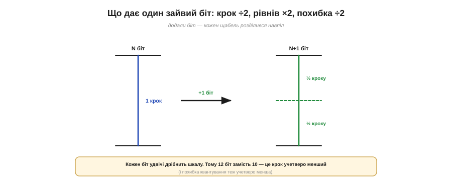
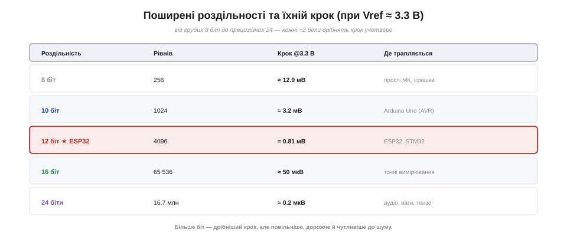
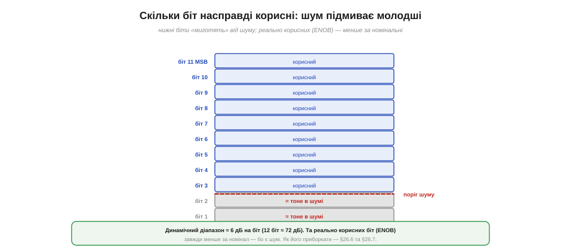

# Біти й роздільність: скільки мВ в одному кроці (LSB)

[Квантування](topic:electronics/sampling-quantization) округлює напругу до найближчого щабля, а відстань між сусідніми щаблями називають кроком (LSB). Звідси постає головне кількісне питання **рівневої осі**: скільки тих щаблів і яка між ними відстань у вольтах? Це і є **роздільність (*resolution*)** АЦП — і вона прямо визначає найдрібнішу зміну напруги, яку перетворювач узагалі здатний помітити. Усе впирається в одне число — кількість **біт**.

Варто з самого початку відчути, що роздільність — це **гострість зору** вимірювача. Грубий АЦП бачить світ великими сходинками й не помічає дрібних змін; тонкий розрізняє ледь помітні відтінки напруги. Жоден із них не «правильніший» — просто один годиться зміряти, чи ввімкнено світло, а інший — уловити кволий сигнал термопари. Тож питання роздільності — це завжди питання «наскільки дрібну зміну мені треба бачити», а не «чим більше біт, тим краще».

### Біти → рівні: степінь двійки

АЦП зберігає результат у двійковому числі з певної кількості розрядів — біт. А число з N біт може набувати рівно **2ᴺ** різних значень — отже, стільки в АЦП і рівнів. Тут діє нещадна арифметика степеня двійки: кожен доданий біт **подвоює** кількість рівнів.


*Кожен біт подвоює кількість рівнів: 4 біти — 16, 8 біт — 256, 10 біт — 1024, 12 біт — 4096, 16 біт — 65 536. Зростання експоненційне, тож кілька зайвих біт дають надзвичайно дрібну шкалу.*

Числа ростуть так швидко, що інтуїція за ними не встигає. 8 біт — це вже 256 рівнів, 10 біт — понад тисяча, 12 біт (як в ESP32) — понад чотири тисячі, а 16 біт — за шістдесят п'ять тисяч. Тому, коли кажуть «АЦП на 12 біт», мають на увазі не «трохи краще за 10», а **4096 щаблів** замість 1024 — учетверо дрібніша шкала. Саме розрядність — головна «ручка» роздільності: побільшив N на одиницю — і рівнів удвічі більше.

Чому саме подвоєння? Бо кожен біт — це одне двійкове «так чи ні», одна поділка діапазону навпіл. Один біт ділить шкалу на дві половини (верх чи низ), другий — кожну половину ще навпіл, і так далі: N біт ставлять N послідовних питань «вище чи нижче?», звужуючи відповідь щоразу вдвічі. Власне код, що його повертає АЦП, — це і є відповіді на ці питання, записані двійковим числом. Тому роздільність і кількість біт — те саме, що глибина гри у «вгадай число»: більше питань — точніша відповідь.

### Крок (LSB): скільки вольтів у щаблі

Кількість рівнів сама по собі ще нічого не каже про напругу — її треба поділити на робочий діапазон. Якщо весь діапазон від 0 до опорної напруги Vref поділити на 2ᴺ рівнів, дістанемо розмір **одного кроку**, він же **молодший значущий розряд (LSB, *least significant bit*)**:

```
крок (LSB) = Vref / (2ᴺ − 1)
```

Це найдрібніша зміна напруги, яку АЦП відрізняє: усе, що менше за крок, для нього зливається в один код.


*LSB — це Vref, поділена на рівні. Та сама шкала 0…Vref з 4 бітами дає грубі щаблі (крок ≈ 0.22 В), а з 8 бітами — уже дрібні (≈ 12.9 мВ). В ESP32 з його 12 бітами крок ще менший — близько 0.81 мВ.*

Підставмо числа для ESP32: Vref ≈ 3.3 В, N = 12, отже крок = 3.3 / 4095 ≈ **0.806 мВ**. Тобто кожен код відрізняється від сусіднього лише на восьмисоті частки вольта — для переважної більшості давачів цього з головою. А ось у простого 8-бітного АЦП крок був би 3.3 / 255 ≈ 12.9 мВ — у шістнадцять разів грубіше. Звідси й практичний сенс роздільності: **крок LSB — це «ціна поділки» вашого вимірювального приладу**, і саме він каже, чи помітите ви потрібну вам зміну напруги.

Назва LSB (молодший значущий розряд) тут не випадкова: це «вага» наймолодшого біта числа — найменша порція напруги, яку він представляє; на протилежному кінці старший біт (MSB, *most significant bit*) важить половину всієї шкали. І ще пересторога щодо слів: «роздільність» у даташитах подають то як кількість біт, то як крок у вольтах, то навіть як кількість рівнів — це той самий факт із трьох боків. Тож завжди дивіться, що саме мають на увазі, аби не сплутати 12 біт із 12 мілівольтами.

### Зайвий біт — удвічі дрібніше

Варто закарбувати, що саме дає кожен доданий біт, бо це найшвидший спосіб оцінити виграш. Один біт подвоює кількість рівнів — а отже, **удвічі зменшує крок** і рівно так само вдвічі зменшує максимальну похибку квантування.


*Сенс одного біта. Додали розряд — кожен щабель розділився навпіл: рівнів стало вдвічі більше, крок і похибка — вдвічі менші. Тому 12 біт замість 10 означають крок учетверо менший (два біти — це ×4).*

Звідси легко рахувати в умі: кожні **+2 біти дрібнять крок учетверо**, +4 біти — у шістнадцять разів. Перехід від 10-бітного АЦП (як у класичного Arduino Uno) до 12-бітного (ESP32) — це вчетверо тонша шкала за ту саму напругу. Це й пояснює, чому розрядність так цінують: вона входить у крок не лінійно, а **експоненційно**, тож навіть скромна на вигляд різниця в кілька біт обертається разючою різницею в точності.

Щоб відчути це числами, порівняймо крок за Vref ≈ 3.3 В: 8 біт — ≈ 12.9 мВ, 10 біт — ≈ 3.2 мВ, 12 біт — ≈ 0.81 мВ, 14 біт — ≈ 0.20 мВ. Кожен рядок учетверо дрібніший за той, що на два біти грубіший. Та сама напруга, та сама ніжка — а «зерно» вимірювання відрізняється в десятки разів лише через кілька біт. Ось чому розрядність вважають однією з найважливіших цифр у даташиті АЦП.

### Роздільність — не те саме, що діапазон

Тут чигає поширена плутанина, тож розведімо два поняття чітко. **Роздільність** — це на скільки щаблів поділено шкалу (скільки біт). **Діапазон (повна шкала, *full scale*)** — це наскільки високу напругу шкала взагалі охоплює, тобто Vref. А крок залежить від **обох**: крок = діапазон / рівні.


*Крок = діапазон / рівні, тож на нього впливають дві різні речі. Більше біт за тієї самої Vref → дрібніший крок. Але й менша Vref за тих самих біт → теж дрібніший крок (бо ту саму кількість щаблів «упаковано» у вужчий діапазон).*

Це означає, що дрібнішого кроку можна досягти **двома** шляхами: або додати біт, або звузити діапазон Vref. Якщо ви міряєте давач, що дає напругу лише 0…1 В, то, обмеживши Vref до ~1 В замість 3.3 В, ви втричі здрібните крок навіть без зайвих біт — бо ті самі 4096 рівнів ляжуть на вужчий діапазон. Це потужний прийом, але він тягне за собою питання, що ж таке ця [опорна напруга](topic:electronics/voltage-reference) й як її задають. Головне ж тут: **не плутайте «скільки біт» (роздільність) із «до скількох вольтів» (діапазон)** — це різні ручки, що разом визначають крок.

З цього випливає й поширена помилка — **марнувати діапазон**. Якщо ваш давач видає щонайбільше 1 В, а АЦП міряє проти Vref = 3.3 В, то понад дві третини щаблів просто ніколи не задіються: сигнал тиснеться в нижню третину шкали, і реально вам дістається не 12, а лише близько 10 корисних біт. Підігнавши діапазон під сигнал — меншою Vref або підсиливши сам сигнал до повної шкали, — ви повертаєте собі ті втрачені біти майже задарма. Тому досвідчений розробник завжди питає не лише «скільки біт», а й «чи добре сигнал заповнює шкалу».

> 🔧 **Навіщо це.** Обираючи АЦП чи режим, рахуйте не біти, а **крок у вольтах**, бо саме він порівнюється з вашою потрібною точністю. Питання ставте так: «яку найменшу зміну напруги мені треба помітити?» — і доберіть біти й діапазон так, щоб крок був дрібніший за неї (із запасом). Часто звузити діапазон Vref під свій сигнал вигідніше, ніж ганятися за зайвими бітами.

### Поширені роздільності та ESP32

Корисно тримати в голові кілька орієнтирів — типові розрядності й те, де вони трапляються.


*Орієнтири роздільності за Vref ≈ 3.3 В: 8 біт (256, ≈ 12.9 мВ) — прості МК; 10 біт (1024, ≈ 3.2 мВ) — Arduino Uno; **12 біт (4096, ≈ 0.81 мВ) — ESP32, STM32**; 16 біт (65 536, ≈ 50 мкВ) — точні вимірювання; 24 біти — аудіо й ваги. Кожні +2 біти дрібнять крок учетверо.*

АЦП у ESP32 — рідно **12-бітний**: `analogRead` за замовчуванням повертає число 0…4095. У коді розрядність задають так:

:::tabs
```cpp
analogReadResolution(12);     // ESP32: рідні 12 біт (0..4095)
int n = analogRead(34);       // напр., 0…4095
```
```micropython
from machine import ADC, Pin

adc = ADC(Pin(34))            # ESP32: рідні 12 біт (0..4095)
adc.atten(ADC.ATTN_11DB)      # повний діапазон входу ~0..3.3 В
adc.width(ADC.WIDTH_12BIT)    # ширина результату — 12 біт
n = adc.read()                # напр., 0…4095
```
:::

Важлива чесна засторога: функція `analogReadResolution` лише змінює **ширину результату**, але не додає точності понад те, що вміє залізо. Попросите в ESP32 «16 біт» — він просто допише молодші нулі, а реальних щаблів так і лишиться 4096. Тож рідні 12 біт — це стеля справжньої роздільності цього АЦП; усе, що «більше», — косметика.

Варто звикнути читати АЦП у «сирих відліках» (англ. *counts*) — цілих числах 0…4095, — а переводити їх у вольти лише там, де справді треба. Для порівняння: класичний Arduino Uno на ATmega328 має 10-бітний АЦП (0…1023) із кроком близько 3.2 мВ на 3.3 В, тож ESP32 з його 4096 рівнями вже вчетверо точніший «з коробки». Це одна з тих дрібниць, через які навіть прості виміри на ESP32 виходять помітно чистішими, ніж на старших 8-бітних платах.

Не дивно, що саме 12 біт стали негласним стандартом сучасних мікроконтролерів: це золота середина. Крок під мілівольт уже задовольняє майже будь-який звичайний давач, а схема лишається простою, швидкою й дешевою. Менше було б відчутно грубо, а більше — здебільшого надмірно: зайві біти все одно потонули б у шумі звичайної плати. Тому, починаючи проєкт, 12 біт варто вважати розумним типовим вибором, від якого відштовхуються лише за особливої потреби.

> 🔧 **Навіщо це.** Не женіться за числом біт у даташиті як за магією: 12-бітний АЦП ESP32 дає чудовий крок ≈ 0.8 мВ, і для більшості давачів (температура, світло, напруга батареї) цього вдосталь. А якщо колись знадобиться по-справжньому тонше — мікровольти для термопари чи тензодавача, — беруть **зовнішній** 16- чи 24-бітний АЦП окремою мікросхемою, бо вбудований стелю вже не підніме.

### Скільки біт справді корисні: шум

Насамкінець — важлива правда, про яку даташити кажуть пошепки. Чим дрібніший крок, тим ближче він підходить до рівня власного **шуму** схеми — крихітних випадкових коливань напруги, що завжди є в реальному залізі. Коли крок стає меншим за шум, наймолодші біти перестають нести корисну інформацію: вони просто **миготять** від наведень, а не міряють сигнал.


*Старші біти несуть сигнал, а кілька молодших «тонуть у шумі» й безладно миготять. Тому реально корисних біт (ENOB, *effective number of bits*) завжди менше за номінальні. Орієнтир: динамічний діапазон ≈ 6 дБ на біт (12 біт ≈ 72 дБ).*

Через це вводять поняття **ефективної кількості біт (ENOB, *effective number of bits*)** — скільки розрядів реально корисні, коли відкинути ті, що потонули в шумі. ENOB майже завжди менший за номінальну розрядність: 12-бітний АЦП на практиці може давати, скажімо, 10–11 «чесних» біт. Звідси й важливий висновок: нарощувати розрядність має сенс лише доти, доки крок не вперся в шум; далі зайві біти оцифровують саму лише тремтячу «травичку». Зменшити цей шум і витиснути більше чесних біт допомагають [боротьба з похибками АЦП](topic:electronics/adc-errors) та [акуратне зчитування сигналу](root:embedded/signal-acquisition) — усереднення, екранування, правильне джерело. Корисний орієнтир: кожен біт додає близько **6 дБ** динамічного діапазону, тож 12 біт — це приблизно 72 дБ.

Практичний наслідок простий: **не довіряйте останнім цифрам** виміру наосліп. Якщо два сусідні читання АЦП відрізняються на одиницю-дві коду навіть за нерухомого входу — це і є той шум у молодших бітах, а не реальна зміна сигналу. Найдешевший спосіб відіграти частину втрачених біт — **усереднити** кілька читань: шум, бувши випадковим, частково взаємознищується, і результат стає стабільнішим. Докладніше про цей прийом — в [акуратному зчитуванні сигналу](root:embedded/signal-acquisition).

**Приклад (роздільність 12-бітного АЦП ESP32).** Vref ≈ 3.3 В.

```
рівнів = 2¹² = 4096
крок (LSB) = 3.3 / 4095 ≈ 0.806 мВ
похибка квантування ≤ ½ LSB ≈ 0.40 мВ
динамічний діапазон ≈ 6.02 × 12 ≈ 72 дБ

Треба розрізняти зміну 1 мВ?
  крок ≤ 1 мВ  →  2ᴺ ≥ 3.3 / 0.001 = 3300  →  N ≥ 12 (4096 рівнів) ✓
8 біт дали б крок ≈ 12.9 мВ — для такої задачі замало.
```
Отже, 12 біт ESP32 розрізняють менш як мілівольт — рівно те, чого бракувало б 8-бітному АЦП. А коли хочеться ще дрібніше, варто пам'ятати: крок залежить не лише від біт, а й від [опорної напруги](topic:electronics/voltage-reference), проти якої АЦП міряє.
