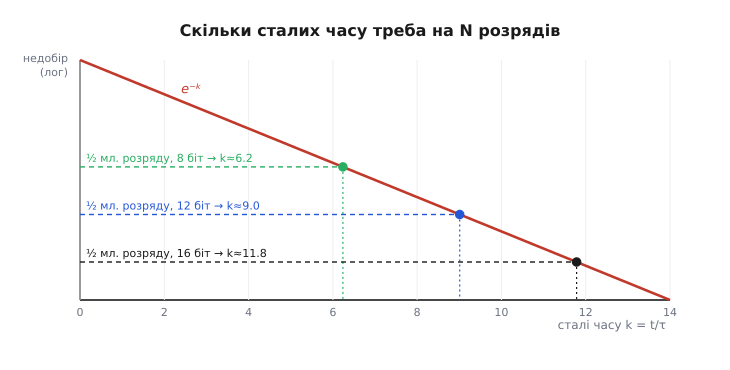
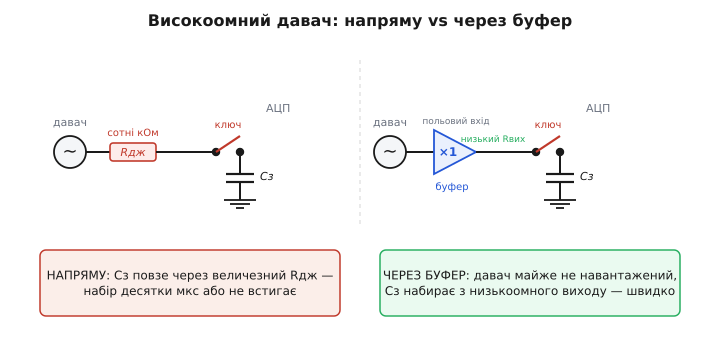

# ⚙️ Розрахунок часу набору вбудованого АЦП у прошивці

Ви взяли мікроконтролер із вбудованим АЦП, під'єднали до входу давач і хочете «просто зчитати напругу». У бібліотеці виробника є поле з назвою на кшталт `sampling_time` або `SMP`, і воно приймає одне з кількох дивних значень — «1.5 такту», «7.5 такту», «239.5 такту». За замовчуванням стоїть найкоротше. Здається, чим коротше — тим швидше опитаєш, тим краще. І дуже часто саме тут народжується перша тиха біда: показ АЦП стабільно занижений, шумить, «плаває» від каналу до каналу — а винне не залізо, а одне поле в регістрі, виставлене навмання.

Задача цієї вставки — навчитися рахувати це поле **свідомо**, з першопринципів, і закласти розрахунок прямо у прошивку. Ми пройдемо весь ланцюжок: від опору давача й розрядності АЦП — до конкретного числа тактів, яке треба записати в регістр. І напишемо робочу C-функцію, яка це число видає сама, а не вимагає, щоб інженер щоразу заглядав у даташит із калькулятором.

## Задача: скільки тактів простояти на вході, перш ніж читати

Усередині вбудованого АЦП сидить крихітний конденсатор вибірки — та сама «пам'ять» вузла [вибірки-зберігання](topic:electronics/adc-sample-hold). Коли ви даєте команду виміряти канал, АЦП спершу **під'єднує** цей конденсатор до вашого входу через внутрішній ключ і тримає з'єднаним рівно стільки тактів, скільки записано в полі часу вибірки. Це фаза набору. Лише потім ключ відрізає конденсатор, і починається власне перетворення — порозрядне зважування замороженого заряду.

Уся точність тримається на одному: **чи встиг конденсатор за час набору дозарядитися до напруги входу**. Конденсатор бачить перед собою не ідеальне джерело, а ланцюжок опорів — вихідний опір самого давача Rдж, опір доріжки й, головне, опір відкритого внутрішнього ключа Rвкл. Через цей сумарний опір він заряджається по знайомій згасній кривій, і швидкість наздоганяння задає стала часу:

```
τ = (Rдж + Rвкл) · Cз
```

де Cз — внутрішній конденсатор вибірки (у STM32, наприклад, це кілька пікофарад). За одну τ конденсатор проходить ~63 % недобору, за кожну наступну — ще ту саму частку того, що лишилося. Питання «скільки тактів стояти» — це насправді питання «скільки сталих часу τ дати, щоб недобір став дрібнішим за половину молодшого розряду N-розрядного АЦП».

> 🔧 **Навіщо це.** Поле `sampling_time` — це і є той час набору, переведений у такти шини АЦП. Виставите замало — заморозите напругу, яка ще повзе вгору до цілі, і **кожен** відлік буде занижений на похибку набору, яку жодне подальше перетворення не виправить. Виставите з надлишком — марно втратите швидкість опитування. Правильне число народжується з трьох речей: опору джерела, ємності Cз і розрядності N. Мета — навчити прошивку рахувати його самій.

## Ідея: від «недобір < пів-розряду» до числа сталих часу

Зведімо вимогу точності до формули. Після часу набору tнаб конденсатор недобрав до входу частку e⁻ᵗ⁄τ від початкового розриву напруг. Аби цей недобір не з'їв жодного розряду, він мусить бути меншим за половину ваги молодшого розряду. Молодший розряд N-розрядного АЦП — це 1/2ᴺ від повної шкали; його половина — 1/2ᴺ⁺¹:

```
e⁻ᵏ  <  1 / 2ᴺ⁺¹
```

де k = tнаб / τ — потрібне число сталих часу. Логарифмуємо обидві сторони (беремо натуральний логарифм, знак нерівності перевертається через мінус):

```
−k  <  −(N+1) · ln 2

k   >  (N+1) · ln 2
```

Ось і вся суть. **Число сталих часу лінійно росте з розрядністю.** Множник ln 2 ≈ 0.693 — тому й народжується робоча прикидка «десь 0.7 τ на розряд», яку часто наводять у даташитах. Порахуймо кілька значень, щоб відчути масштаб:

```
N = 8   →  k > 9 · 0.693  ≈ 6.24   →  беремо 7 τ
N = 10  →  k > 11 · 0.693 ≈ 7.62   →  беремо 8 τ
N = 12  →  k > 13 · 0.693 ≈ 9.01   →  беремо ~9.1 τ
N = 16  →  k > 17 · 0.693 ≈ 11.78  →  беремо 12 τ
```

Чому «+1», а не просто N? Бо поріг — **половина** молодшого розряду, а не цілий; ділення навпіл додає рівно один ln 2. Це не педантизм: на 12 розрядах різниця між N·ln2 і (N+1)·ln2 — це майже ціла зайва τ, тобто цілком відчутний шматок часу набору. Дешевше закласти його, ніж потім ловити систематичне заниження на молодшому розряді.


*Недобір напруги (лог-шкала) падає прямою — кожна стала часу τ ділить його на e ≈ 2.72. Горизонтальні лінії — поріг «половина молодшого розряду» для різної розрядності: що більше розрядів, то нижчий поріг і то правіше крива його перетинає. Абсциса перетину — і є мінімальне число сталих часу k.*

Ця картина пояснює, чому вимога так м'яко залежить від розрядності: недобір падає **експоненційно**, а поріг опускається лише **лінійно** (кожен розряд — удвічі нижче). Тому подвоєння точності коштує лише одну зайву τ, а не вдвічі більше часу. Гарна новина для швидкодії.

## Від сталих часу до тактів: конкретний регістр

Тепер найпрактичніше. Ми знаємо потрібний час набору в секундах:

```
tнаб = k · τ = (N+1)·ln2 · (Rдж + Rвкл) · Cз
```

Але регістр АЦП рахує не секунди, а **такти власної шини** fАЦП. Один такт триває 1/fАЦП секунд, тож потрібне число тактів — це час набору, поділений на період такту:

```
такти = tнаб · fАЦП = (N+1)·ln2 · (Rдж + Rвкл) · Cз · fАЦП
```

Ось де все сходиться: розрядність, опір джерела, ємність вибірки й тактова частота АЦП — усе в одному добутку. Лишається округлити це число **вгору** до найближчого значення, яке залізо взагалі вміє.

А вміє воно не будь-яке. У STM32F103, наприклад, поле SMP приймає лише вісім фіксованих значень тривалості набору (у тактах АЦП): **1.5, 7.5, 13.5, 28.5, 41.5, 55.5, 71.5, 239.5**. Це не помилка «півтакту» —半-такти беруться з того, що вибірка й перетворення тактуються від тих самих фронтів зі зсувом. Наше завдання — порахувати потрібне число тактів, а тоді знайти **найменше зі списку, яке його покриває**. Якщо навіть найбільше (239.5) замале — це вже сигнал, що джерело задобре, і сам АЦП не витягне: треба зовнішній буфер (про це наприкінці).

> 🔧 **Навіщо це.** Саме тому не можна «просто перевести секунди в такти й записати». Залізо дискретне: між 71.5 і 239.5 такту в цьому АЦП **нічого немає**. Якщо розрахунок дав 90 тактів — доведеться брати 239.5 (втрачаючи швидкість) або міняти умови: підняти опір ключа неможливо, зате можна знизити тактову частоту АЦП чи опір джерела. Функція, що просто округлить угору до наявного значення, зробить цей вибір за вас прозоро й без сюрпризів.

## Робочий C: від опору й розрядності до значення регістра

Зберемо все у прошивковий код. Спочатку — «фізичне ядро»: чиста функція, що з опору джерела, ємності, розрядності й тактової частоти повертає **мінімальне число тактів набору**. Вона нічого не знає про конкретний АЦП — лише фізика. Це навмисно: ядро легко перевірити й перенести на будь-який чип.

```c
#include <math.h>
#include <stdint.h>

/* Мінімальна кількість тактів шини АЦП, яку конденсатор вибірки
 * мусить простояти під'єднаним, щоб недобір став меншим за
 * половину молодшого розряду N-розрядного перетворення.
 *
 *   r_src_ohm  — вихідний опір джерела (давача) + доріжки, Ом
 *   r_sw_ohm   — опір відкритого внутрішнього ключа АЦП, Ом (з даташита)
 *   c_hold_f   — ємність внутрішнього конденсатора вибірки, Фарад
 *   n_bits     — розрядність перетворення (8, 10, 12, 16)
 *   f_adc_hz   — тактова частота шини АЦП, Гц
 *
 * Повертає число тактів (з дробовою частиною), яке далі округлюють
 * угору до найближчого значення, доступного в регістрі.
 */
static double adc_min_sampling_cycles(double r_src_ohm,
                                      double r_sw_ohm,
                                      double c_hold_f,
                                      unsigned n_bits,
                                      double f_adc_hz)
{
    const double tau     = (r_src_ohm + r_sw_ohm) * c_hold_f;   /* стала часу, с */
    const double k       = (n_bits + 1) * M_LN2;                /* число сталих часу */
    const double t_acq_s = k * tau;                             /* час набору, с   */
    return t_acq_s * f_adc_hz;                                  /* → у такти шини  */
}
```

Три рядки арифметики — і весь ланцюжок «фізика → секунди → такти» замкнено. Тепер надбудова, специфічна для конкретного чипа: перелік того, що вміє залізо, і вибір найменшого значення, яке покриває розрахунок.

```c
/* Значення тривалості набору, які РЕАЛЬНО вміє SMP-поле STM32F103,
 * у тактах шини АЦП. Мусять іти за зростанням. */
static const struct {
    double  cycles;   /* тривалість у тактах */
    uint8_t smp_code; /* код у полі SMP[2:0] */
} ADC_SMP_TABLE[] = {
    {  1.5, 0 }, {   7.5, 1 }, {  13.5, 2 }, {  28.5, 3 },
    { 41.5, 4 }, {  55.5, 5 }, {  71.5, 6 }, { 239.5, 7 },
};
#define ADC_SMP_COUNT (sizeof(ADC_SMP_TABLE) / sizeof(ADC_SMP_TABLE[0]))

/* Спеціальне значення: навіть найдовший набір замалий — потрібен буфер. */
#define ADC_SMP_NEED_BUFFER 0xFF

/* Підібрати код SMP під конкретне джерело.
 * Повертає код SMP[2:0] або ADC_SMP_NEED_BUFFER, якщо джерело
 * задобре навіть для найдовшого набору цього АЦП. */
uint8_t adc_pick_smp_code(double r_src_ohm, unsigned n_bits, double f_adc_hz)
{
    /* Параметри саме цього АЦП — з даташита STM32F103:
     * опір ключа ~1 кОм, конденсатор вибірки ~8 пФ (беремо з запасом). */
    const double R_SWITCH = 1000.0;      /* Ом  */
    const double C_HOLD   = 8.0e-12;     /* Ф   */

    const double need = adc_min_sampling_cycles(r_src_ohm, R_SWITCH,
                                                C_HOLD, n_bits, f_adc_hz);

    for (unsigned i = 0; i < ADC_SMP_COUNT; ++i)
        if (ADC_SMP_TABLE[i].cycles >= need)
            return ADC_SMP_TABLE[i].smp_code;   /* найменше, що покриває */

    return ADC_SMP_NEED_BUFFER;                 /* не вистачило й найдовшого */
}
```

Зверніть увагу на дві свідомі рішення. По-перше, C_HOLD і R_SWITCH беруться **з запасом у гірший бік** — реальний конденсатор може бути 5 пФ, але ми ставимо 8, а опір ключа — верхню межу з даташита. Похибка тут коштує розрядів, а зайвий такт-другий набору — майже нічого; тож перестрахуватися дешево. По-друге, функція **чесно каже «потрібен буфер»** окремим значенням, а не мовчки повертає найдовший набір, роблячи вигляд, що впоралася. Прошивка мусить знати, коли залізо здалося.

Тепер приклад, як цим користуватися при налаштуванні каналу. Нехай тензодавач має вихідний опір 10 кОм, АЦП 12-розрядний і тактується від 12 МГц:

```c
void adc_setup_channel(uint8_t ch, double r_src_ohm)
{
    uint8_t smp = adc_pick_smp_code(r_src_ohm, /*n_bits=*/12,
                                    /*f_adc_hz=*/12.0e6);

    if (smp == ADC_SMP_NEED_BUFFER) {
        /* Джерело задобре для внутрішнього набору — сюди має стояти
         * зовнішній буфер. Не приховуємо проблему, а сигналимо. */
        error_high_impedance_source(ch);
        smp = 7;   /* аварійно беремо найдовший, показ буде занижений */
    }

    /* Записати SMP[2:0] у потрібне поле SMPR2 для каналу ch (0..9).
     * Кожен канал займає 3 біти. */
    uint32_t shift = 3u * ch;
    ADC1->SMPR2 = (ADC1->SMPR2 & ~(0x7u << shift)) | ((uint32_t)smp << shift);
}
```

Прокрутімо числа для цього виклику вручну, щоб переконатися, що функція дає розумне:

**Умова: Rдж = 10 кОм, Rвкл = 1 кОм, Cз = 8 пФ, N = 12, fАЦП = 12 МГц.**

```
τ = (10000 + 1000) · 8·10⁻¹²
  = 11000 · 8·10⁻¹² = 8.8·10⁻⁸ с = 88 нс

k = (12 + 1) · ln2 = 13 · 0.693 ≈ 9.01

tнаб = 9.01 · 88 нс ≈ 793 нс

такти = 793·10⁻⁹ · 12·10⁶ ≈ 9.5 такту
```

Потрібно 9.5 такту — у таблиці найменше, що покриває, це **13.5** (код SMP = 2). Сім із половиною було б замало (заниження на молодшому розряді), а брати 28.5 — марно повільно. Функція обере саме 13.5. А тепер підставте замість 10 кОм джерело на 500 кОм — τ підскочить до ~4 мкс, потрібно стане ~430 тактів, і навіть 239.5 не вистачить: функція поверне `ADC_SMP_NEED_BUFFER`. Рівно той випадок, який ми зараз розберемо.

## Пастка високоомних давачів і коли рятує буфер

Формула `такти ∝ Rдж` каже жорстку правду: **час набору росте прямо пропорційно опору джерела**. Подвоїли опір давача — подвоїли потрібний час набору. І тут високоомні джерела швидко впираються в стелю.

Хто ці високоомні джерела? Дільники напруги з великими резисторами (щоб не гріти живлення), потенціометри, ємнісні давачі, [фотодіоди у фотострумному режимі](topic:electronics/transimpedance-amplifier), скляні pH-електроди (десятки-сотні мегаом!), піроелектричні й п'єзодавачі. Для них Rдж — не кілооми, а сотні кілоом і вище. Порахуймо межу.

**Умова: до якого опору джерела вистачає найдовшого набору 239.5 такту? (N = 12, fАЦП = 12 МГц, Cз = 8 пФ, Rвкл = 1 кОм.)**

```
239.5 такту при 12 МГц → tнаб = 239.5 / 12·10⁶ ≈ 20 мкс

τ доступна = tнаб / k = 20·10⁻⁶ / 9.01 ≈ 2.2·10⁻⁶ с

Rдж + Rвкл = τ / Cз = 2.2·10⁻⁶ / 8·10⁻¹² ≈ 277 кОм

Rдж(макс) ≈ 277 − 1 ≈ 276 кОм
```

Отже, навіть із найдовшим набором цей АЦП чесно тягне джерело лише десь до **чверті мегаома** на 12 розрядах. pH-електрод на 100 МОм — це у чотири сотні разів більше; його набір тривав би мілісекунди, під час яких вхід уже зовсім не той. Прямо чіпати таке джерело внутрішнім АЦП безнадійно.

Вихід — **розв'язати** високий опір джерела від конденсатора вибірки, поставивши між ними **буфер**: [операційний підсилювач](topic:electronics/opamp) у ввімкненні повторювача з польовим входом. Його вхід майже нічого не бере з давача (вхідний опір — гігаоми, вхідний струм — пікоампери), а вихід має **низький** опір — одиниці-десятки ом. Для конденсатора вибірки джерелом стає вже цей низькоомний вихід буфера, а не мегаомний давач. Підставте Rдж = 10 Ом у формулу — і потрібний набір падає до найкоротших 1.5 такту. Буфер, по суті, **перекладає тягар набору на себе**: він устигає стежити за повільним високоомним давачем безперервно, а АЦП набирає вже з його бадьорого виходу.


*Ліворуч: високоомний давач (сотні кОм) тягне заряд у Cз через свій великий опір — набір триває десятки мікросекунд або зовсім не встигає. Праворуч: буфер із польовим входом майже не навантажує давач, а його низькоомний вихід заряджає Cз миттєво; тягар набору перекладено з давача на буфер.*

Але буфер — не безкоштовне добро, і тут криється друга пастка: **не всякий оппідсилювач витримає ємнісне навантаження**. Вхід АЦП разом із конденсатором вибірки та монтажем — це для буфера саме ємність на виході. Багато оппідсилювачів на ємнісному навантаженні **самозбуджуються** — вихід дзвенить або йде в стійку генерацію. Тому буфер під АЦП або вибирають спеціально «стабільним на ємність» (unity-gain stable, толерантним до C_load), або ставлять між ним і входом АЦП маленький послідовний резистор (десятки-сотні ом) — він гасить дзвін. Але цей же резистор знову додається до Rдж набору! Тож його беруть якомога меншим, шукаючи баланс: досить, щоб приборкати генерацію, і досить мало, щоб не зіпсувати набір.

> 🔧 **Навіщо це.** Правило для прошивки й схеми разом: якщо `adc_pick_smp_code` повертає `ADC_SMP_NEED_BUFFER` — це не «виставте набір довше», а «на платі бракує буфера». Софтом тут не відбутися; найдовший набір лише замаскує заниження, не прибравши його. І навпаки: поставили буфер — тепер у розрахунок іде **його** вихідний опір (одиниці ом), і найкоротший набір раптом стає законним. Функція `adc_pick_smp_code(10.0, 12, 12e6)` для виходу буфера поверне код 0 (1.5 такту), і опитування піде на повній швидкості.

## Що ще ховається в цьому розрахунку

Формула проста, але кілька тонкощів варто тримати в голові, коли переносиш код на реальний проєкт.

**Ємність вибірки — не єдиний конденсатор.** До Cз паралельно додаються паразитна ємність виводу, монтажу й, якщо він є, зовнішній антизавадний конденсатор на вході (його часто ставлять для придушення шуму). Останній може бути в **сотні разів** більший за внутрішній Cз — і тоді набір визначає вже він, а не крихітні пікофаради всередині. Якщо на вході стоїть зовнішній C, підставляйте в τ саме його; інакше розрахунок брехатиме в оптимістичний бік. Це, до речі, ще одна причина не ставити великі конденсатори прямо на вхід АЦП без розуміння: вони «лагодять» шум, але ламають набір.

**Опір ключа залежить від напруги живлення.** Rвкл внутрішнього ключа — не константа: при нижчому живленні транзистор ключа відкривається слабше, і його опір росте (іноді вдвічі-втричі). Даташит зазвичай дає Rвкл для номінального живлення; на 1.8 В замість 3.3 В закладайте більший опір. У коді це просто інша цифра в R_SWITCH — але про неї легко забути, і тоді на зниженому живленні з'явиться заниження, якого не було на стенді.

**Мультиплексор між каналами.** Вбудований АЦП часто опитує багато каналів по черзі через внутрішній мультиплексор. Перемикання каналу під'єднує до конденсатора вибірки **новий** вхід із, можливо, зовсім іншою напругою — і набір починається з чистого аркуша щоразу. Якщо сусідні канали мають дуже різні напруги й один з них високоомний, буває ефект «затягування»: залишок заряду від попереднього каналу спотворює перші відліки нового. Лік — той самий буфер на високоомному каналі або довший набір саме для нього (тому SMP і задають **окремо на кожен канал**, а не один на весь АЦП).

**Округлення вгору — не забаганка, а безпека.** У функції ми беремо перше значення таблиці, що `>= need`. Спокуса взяти «найближче» (може бути й менше) — хибна: набір, коротший за потрібний, дає систематичну, невипадкову похибку, яку не усереднити й не відфільтрувати. Краще зайвий такт, ніж стабільне заниження. Тому в циклі стоїть саме `>=`, і саме округлення вгору.

Підсумок короткий. Час набору вбудованого АЦП — не магічне число з даташита, а простий добуток `(N+1)·ln2·(Rдж+Rвкл)·Cз·fАЦП`, який прошивка може порахувати сама. Функція з двох частин — фізичне ядро й таблиця конкретного чипа — перетворює опір давача на код регістра й чесно кричить, коли залізо не тягне джерело. А коли кричить — на плату проситься буфер, і тоді набір знову стає швидким. Хто заклав цей розрахунок у прошивку, той раз і назавжди позбувся тихого заниження на високоомних входах — найпідступнішої з похибок, бо вона не шумить, а просто рівно бреше.
