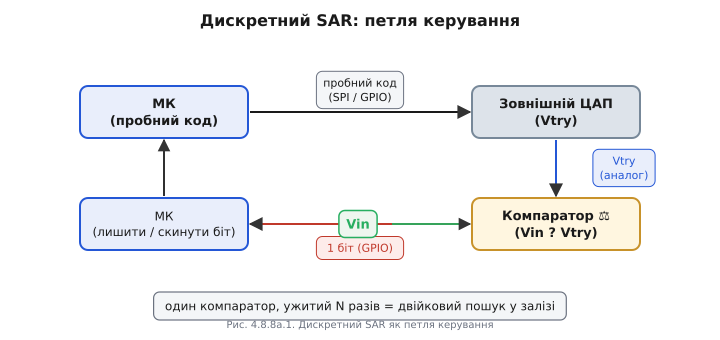
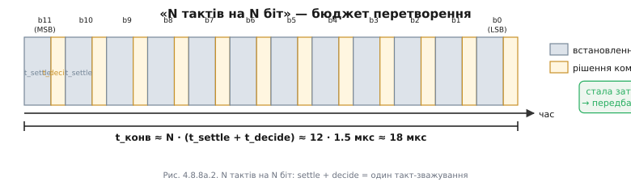

# ⚙️ SAR — двійковий пошук у залізі: N тактів на N біт

> Алгоритмічна вставка про внутрішній алгоритм SAR-АЦП ([типи АЦП](book:electronics/adc-types)). Ззовні SAR — це терези з гирями-частками Vref: проба збігається до Vin. Тут зазираємо в нього як в алгоритм: той самий двійковий пошук, записаний як цикл прошивки, що сам керує ЦАПом і компаратором — код і часовий бюджет того перетворення.

## Задача

SAR усередині — це ЦАП плюс компаратор (comparator) плюс логіка двійкового пошуку, і 12 біт знаходяться за 12 кроків, а не за 4096 проб. Але як саме виглядає той «двійковий пошук» як код? І що буде, якщо викласти його руками на реальних деталях?

Ставимо дві мети чесно. Перша — демістифікувати: показати алгоритм SAR як короткий C/C++-цикл, щоб було зрозуміло, що саме робить мікросхема всередині `analogRead()`. Друга — практична: зібрати робочий дискретний регістр послідовного наближення (successive-approximation register, SAR) із зовнішнього ЦАП, компаратора й виводів МК — коли потрібен нестандартний канал, більша роздільність, ніж вбудовані 12 біт, або просто щоб збагнути принцип «у залізі». Чесна рамка: вбудований SAR ESP32 кращий майже завжди — швидший, відкалібрований, береться одним рядком. Цінність дискретної збірки — розуміння й ніша.

## Ідея: двійковий пошук = по одному біту згори вниз

Серце алгоритму: будуємо цифровий код побітно, від старшого (MSB) до молодшого (LSB). На кроці k встановлюємо пробний біт у 1, ЦАП видає пробну напругу Vtry, компаратор відповідає «Vin ≥ Vtry?»: так — біт лишаємо, ні — скидаємо. Через N кроків маємо повний N-бітний код. Це той самий механізм зважування з образу терезів, лише записаний як петля, керована ззовні.

Чому рухаємось згори вниз і чому завжди навпіл? Кожен крок ділить навпіл інтервал невизначеності: після першого кроку ми знаємо, у якій половині шкали лежить Vin, після другого — у якій чверті, і так далі: ½ → ¼ → ⅛ від [опорної напруги](book:electronics/voltage-reference) Vref. Звідси N кроків на N біт, а не 2ᴺ проб, як у флеш-АЦП. Це образ «вгадай число за 12 питань» — але тепер ми самі ставимо запитання залізу.

Фізична петля складається з чотирьох ланок: МК виставляє пробний код → ЦАП перетворює код на Vtry → компаратор порівнює Vtry з Vin і повертає 1 біт → МК читає біт і вирішує — лишити чи скинути. Один і той самий компаратор використовується N разів — не 2ᴺ компараторів паралельно, як у флеш-АЦП. Саме ця дешевизна й компактність SAR тепер видна поелементно.



*Рис. Дискретний SAR як петля керування: МК виставляє пробний код на зовнішній ЦАП → ЦАП дає Vtry → компаратор порівнює Vtry з Vin і віддає 1 біт у GPIO → МК лишає або скидає біт. Та сама петля, що в монолітному SAR, лише розкладена на видимі деталі.*

## Робочий код: SAR-цикл на C/C++

Та сама петля, перекладена в прошивку, — це напрочуд короткий цикл; уся «магія» SAR уміщається в десяток рядків.

```cpp
// Час встановлення зовнішнього ЦАП (мкс) — залежить від мікросхеми
#define T_SETTLE_US  1
#define N_BITS       12

// Хелпери для конкретної схеми
// dac_write(): SPI-транзакція або dacWrite() на зовнішній 12-бітний ЦАП
static void dac_write(uint16_t code) {
    // Наприклад, MCP4922 через SPI:
    // spiTransfer(DAC_CS_PIN, (code >> 8) | 0x30, code & 0xFF);
    // Замініть на свій драйвер.
    (void)code;
}

// comparator_above(): читає GPIO компаратора.
// Полярність: повертає true, якщо Vtry > Vin (тобто «перебрали»).
// УВАГА: напрям залежить від підключення входів компаратора — перевірте схему!
static bool comparator_above(void) {
    return digitalRead(CMP_PIN) == HIGH;
}

// Ядро SAR: повертає 12-бітний код, що відповідає Vin
uint16_t sar_convert(void) {
    uint16_t code = 0;
    for (int b = N_BITS - 1; b >= 0; --b) {
        code |= (1u << b);             // пробуємо біт b = 1
        dac_write(code);               // виставити пробне Vtry на ЦАП
        delayMicroseconds(T_SETTLE_US);// ЧЕКАЄМО, поки ЦАП усталиться
        if (comparator_above()) {      // Vtry > Vin → перебрали
            code &= ~(1u << b);        // скинути біт — він зайвий
        }
        // якщо Vtry ≤ Vin → біт лишаємо
    }
    return code;
}
```

Інваріант циклу: після кроку b у змінній `code` правильно встановлені всі біти від MSB до b включно — кожен крок звужує пошуковий інтервал удвічі. Рядок `delayMicroseconds(T_SETTLE_US)` — не косметика і не перестраховка: це фізична умова коректності. Зчитаєте компаратор зарано — ЦАП ще не досяг Vtry, і ви порівняєте Vin з проміжною напругою. Помилка потрапить саме в старший, найважчий за вагою біт, і код розсиплеться. Саме так, лише в кремнії й за такти внутрішнього тактового генератора АЦП, а не мікросекундними затримками прошивки, працює вбудований SAR.

Для порівняння — вбудований SAR ESP32 викликається одним рядком:

```cpp
int raw = analogRead(PIN);  // весь 12-крокований SAR-цикл — апаратно, за ~мкс
```

Увесь цикл вище схований у мікросхемі: ті самі кроки, та сама логіка, лише без `delayMicroseconds` — ЦАП і компаратор там у сотні разів швидші за зовнішні деталі.

## Скільки це коштує: N тактів на N біт

Кожен біт коштує один такт зважування. Такт складається з двох фаз: час встановлення ЦАП (settling time) — скільки чекаємо, поки Vtry усталиться, — плюс час рішення компаратора (decide). Загальна затримка одного перетворення:

```
t_конв ≈ N · (t_settle + t_decide)
```

**Приклад (бюджет 12-бітного перетворення).**

```
N        = 12 біт
t_settle ≈ 1.0 мкс  (типовий зовнішній ЦАП, напр. MCP4922)
t_decide ≈ 0.5 мкс  (компаратор + GPIO читання на ESP32)
t_такт   ≈ 1.5 мкс
t_конв   ≈ 12 · 1.5 мкс ≈ 18 мкс  →  ~55 тис. відліків/с
```

Для порівняння: вбудований SAR ESP32 тактується від внутрішнього ~МГц-джерела, і весь 12-бітний цикл займає одиниці мікросекунд — у 5–10 разів швидше, ніж саморобна схема навіть із непоганим компаратором.

Ця лінійна залежність «N тактів на N біт» дає дві важливі властивості. По-перше, час перетворення постійний і передбачуваний — кожен відлік займає рівно стільки ж, незалежно від значення Vin, тож відліки лягають [рівним кроком у часі](book:communications/nyquist-aliasing). По-друге, стеля швидкості визначається найповільнішою з двох фаз: хочете швидше — або скорочуйте t_settle (швидший зовнішній ЦАП), або t_decide (швидший компаратор), або жертвуйте бітами (менше N).



*Рис. «N тактів на N біт»: бюджет одного 12-бітного перетворення. Кожен з 12 тактів (b11…b0) = час встановлення ЦАП + час рішення компаратора. Сумарна затримка t_конв ≈ N·(t_settle+t_decide) — стала й передбачувана, звідси й стеля швидкості SAR.*

> 🔧 **Навіщо це.** Коли проєктуєте дискретний SAR або хочете зрозуміти вбудований — часовий бюджет рахується саме так: щоб отримати більше відліків за секунду, беріть швидший ЦАП/компаратор або зменшуйте роздільність, бо кожен біт коштує цілий такт.

## Складність і пастки на МК

- **Vin мусить лишатися нерухомим усі N тактів.** Без вузла [вибірки-зберігання](book:electronics/sampling-quantization) двійковий пошук на кожному кроці порівнює гирю з іншим значенням вхідного сигналу — код розсиплеться, і помилка буде хаотичною, а не систематичною. У дискретній збірці або використовуйте зовнішній S/H, або обмежтеся повільними сигналами. Саме тому монолітний SAR має внутрішній конденсатор вибірки.

- **ЦАП мусить встановитися до рішення.** `delayMicroseconds(T_SETTLE_US)` — це не перестраховка, а фізична умова коректності. Зчитаєте компаратор зарано — порівняєте Vin з проміжним Vtry, отримаєте грубу помилку саме в старших (найважчих за вагою) бітах. Settling time — домінантна стаття часового бюджету.

- **Метастабільність компаратора (metastability).** Коли Vin ≈ Vtry, вихід компаратора може «зависнути» між 0 і 1 і не встигнути визначитися до моменту читання GPIO — отримаєте випадковий біт. Запобігання: давати компаратору достатній час рішення (t_decide в бюджеті), обирати компаратор з явним гістерезисом для застосувань, нечутливих до LSB, не зменшувати T_SETTLE_US до мінімуму. Помилка в старшому біті — катастрофа (похибка ½ шкали), у молодшому — лише ±1 LSB.

- **Полярність і знак.** Переплутана полярність входів компаратора або інвертована шкала ЦАП дають дзеркальний код — алгоритм зійдеться, але до хибного значення. Зайвий або відсутній крок зсуває всю шкалу на LSB. Тестуйте на відомих точках: 0 В → код 0, ½·Vref → код ~2048, Vref → код 4095; будь-яке відхилення вказує на помилку полярності або підрахунку.

- **Опір джерела й Vref.** Високий [опір джерела сигналу](book:communications/signal-acquisition) подовжує час заряду вхідного конденсатора S/H — час встановлення зростає. ЦАП і компаратор мусять вимірювати відносно тієї самої [опорної напруги](book:electronics/voltage-reference) Vref, що задає шкалу (ratiometric): якщо Vref дрейфує між кроками або між ЦАП і компаратором — код «попливе» навіть за ідеального алгоритму.

- **Це навчальна й нішева збірка, а не заміна вбудованому.** Вбудований SAR ESP32 швидший, відкалібрований заводом і викликається одним `analogRead()`. Дискретна версія виправдана для: нестандартного компаратора з особливою точністю, нетипової Vref (наприклад, прив'язаної до датчика), роздільності понад 12 біт (зовнішній 16-бітний ЦАП), або просто як навчальна збірка «щоб зрозуміти, що відбувається всередині».

## Підсумок

SAR — це двійковий пошук, відлитий у залізо: один компаратор плюс ЦАП, задіяні N разів, дають N біт за N тактів зі сталою, передбачуваною затримкою. Записати його як цикл C/C++ — означає по-справжньому зрозуміти, що робить мікросхема всередині кожного `analogRead()`. Зібрати дискретно можна, але платите часом встановлення й боротьбою з метастабільністю — тож для повсякденного вжитку беріть вбудований, а ці знання тримайте, щоб свідомо обирати параметри та впевнено довіряти своєму АЦП.
