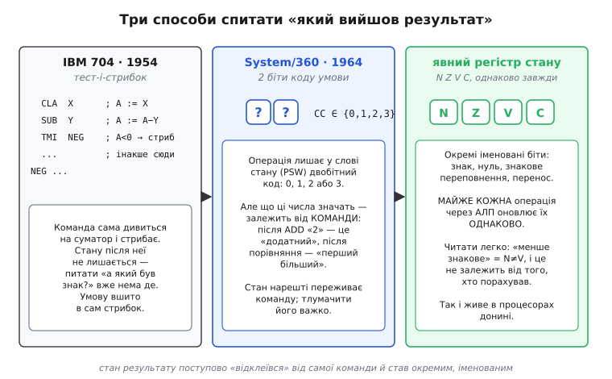

# 📜 Історія прапорців стану: як машина навчилася зважати на результат

Сьогодні прапорці стану здаються самоочевидними: порахував — і збоку лежать чотири біти, які кажуть, яким вийшов результат. Але це рішення не було очевидним. Перші машини взагалі обходилися без збереженого стану; знадобилося майже двадцять років і кілька архітектурних поколінь, поки біти на кшталт Z, N, C, V відклеїлися від самої команди й зажили окремим життям у власному регістрі. Історія цього відклеювання пояснює, чому прапорці влаштовані саме так — і чому дотепер існують дві протилежні домовленості про те, що означає перенос при відніманні.

Питання, на яке всі ці машини шукали відповідь, одне: **як спитати «а який вийшов результат?» і вчинити залежно від відповіді.** Виявляється, спитати можна щонайменше трьома різними способами, і кожне покоління обирало свій.


*Три покоління однієї ідеї. Ліворуч стан узагалі не зберігається — команда сама тестує суматор і стрибає. Посередині з'являється збережений код умови, але його зміст залежить від команди, що його породила. Праворуч біти стають окремими, іменованими й оновлюються однаково після майже будь-якої операції — це те, що дожило до наших процесорів.*

## Спершу стану не було зовсім: IBM 704 і тест-та-стрибок

Візьмімо IBM 704 — велику наукову машину, яку IBM почала постачати 1954 року (усталений факт; це перший серійний комп'ютер IBM із апаратною арифметикою з рухомою комою). Спитайте себе: де в ній жив прапорець «результат від'ємний»? Відповідь несподівана — **ніде.** Такого біта просто не існувало.

Замість того щоб порахувати, відкласти ознаку результату вбік, а потім окремою командою її перевірити, 704 робив усе одним махом. У нього була ціла родина команд умовного переходу, кожна з яких **сама дивилася** на акумулятор і залежно від побаченого або стрибала, або йшла далі:

```
TZE  — transfer on zero        стрибни, якщо акумулятор нульовий
TNZ  — transfer on no zero     стрибни, якщо ненульовий
TPL  — transfer on plus        стрибни, якщо додатний
TMI  — transfer on minus       стрибни, якщо від'ємний
TOV  — transfer on overflow    стрибни, якщо було переповнення
TNO  — transfer on no overflow стрибни, якщо переповнення не було
```

(Мнемоніки й їхній зміст — з документації системи команд 704; усталений факт.) Придивіться до `TMI` — «transfer on minus». Це не «прочитай прапорець N і стрибни». Це монолітна дія: «глянь просто зараз на знак акумулятора й, якщо він від'ємний, перейди за адресою». Знак ніде не запам'ятовувався — команда споживала його на льоту й одразу забувала.

Чому так? Бо для машини тих років це було **найдешевше й найприродніше.** У 704 арифметика крутилася навколо одного акумулятора; ознака результату завжди сиділа там-таки, на його виходах. Городити окремий регістр, куди її щоразу відкладати, означало зайве залізо без явної вигоди — навіщо копіювати знак кудись убік, якщо перевірити його все одно можна прямо на акумуляторі? Простіше зробити команду, що читає акумулятор і стрибає.

Той самий підхід ще ощадливіше виглядав на малих машинах. У них поширилася навіть не «стрибни-якщо», а **«пропусти-якщо»** (англ. *skip*): команда на кшталт «пропусти наступну команду, якщо акумулятор нульовий». Оскільки команди мали однакову довжину, «пропустити» означало банально збільшити лічильник команд удвічі — ніякого обчислення адреси. Так робив, наприклад, DEC PDP-8 (перший комерційно успішний мінікомп'ютер, 1965; усталений факт): його система команд трималася на пропуск-командах, а єдиним чимось схожим на прапорець був однобітний **Link** — біт-перенос, що виходив зі старшого розряду акумулятора при додаванні й брав участь у зсувах. Один-єдиний біт стану на всю машину.

> 🔧 **Навіщо це.** Тест-та-стрибок не музейна старовина — його дух живий. У сучасних наборах команд є `CBZ`/`CBNZ` (ARM — «compare and branch if zero», «…if non-zero»): вони порівнюють регістр із нулем і стрибають **однією командою, не чіпаючи прапорців узагалі.** Причина та сама, що й у 704: коли перевірка тривіальна («нуль?»), тримати заради неї збережений стан марно — дешевше й швидше вшити тест у сам перехід. Прапорці окупаються лише тоді, коли між обчисленням і рішенням є проміжок або коли одну й ту саму ознаку читають кількома різними переходами.

Але в тест-та-стрибку є вбудована стеля. Умова **зрощена** зі стрибком: не можна порахувати зараз, а вчинок відкласти на потім. Не можна одну й ту саму ознаку («менше?») прочитати то так, то інакше. Кожне поєднання «умова × дія» доводиться передбачати окремою командою — а їх комбінаторно багато. Щойно машини стали складнішими, ця зрощеність почала заважати.

## System/360 відклеює стан: два біти коду умови

1964 року IBM оголосила System/360 — родину сумісних між собою машин, покликану замінити зоопарк несумісних попередніх ліній (оголошення 7 квітня 1964; усталений факт). Її архітектуру спроєктували Джин Амдал (Gene Amdahl, американець), Джерріт Блау (Gerrit Blaauw, нідерландець) і Фредерік Брукс (Frederick Brooks, американець), спираючись на рекомендації внутрішньої групи SPREAD 1961 року (усталений факт; імена й ролі — з їхньої програмної статті «Architecture of the IBM System/360», IBM Journal of Research and Development, 1964).

Проєктувальники 360 вчинили принципово інакше, ніж 704. Вони **відклеїли** ознаку результату від команди, що стрибає. Тепер майже кожна арифметична чи логічна операція лишала по собі невеличкий слід — **код умови** (англ. *condition code*): всього **два біти**, тобто одне з чотирьох значень 0, 1, 2, 3. Ці два біти жили у великому слові стану процесора — **PSW** (англ. *program status word*, слово стану програми), 64-бітному регістрі, що тримав, крім коду умови, ще й адресу поточної команди та маски переривань. А окрема команда `BC` (branch on condition, «перехід за умовою) читала цей збережений код і вирішувала, стрибати чи ні.

Ось воно, вирішальне зрушення: **стан результату вперше пережив команду, що його породила.** Між обчисленням і перевіркою тепер можна було вставити інші дії — код умови лежав собі у PSW й чекав. Тест перестав бути зрощеним зі стрибком; вони роз'єдналися на «порахуй і запиши ознаку» та «пізніше прочитай ознаку й вчини».

Була в цьому й хитромудра дрібничка. Двом бітам коду умови в 360 надали не значень 0–3, а «зважених» кодів: комбінація «00» рахувалася як 8, «01» — як 4, «10» — як 2, «11» — як 1. Навіщо? Щоб їх можна було складати логічним «або» й перевіряти кілька умов одним махом: маска в команді переходу — це просто набір з чотирьох дозволених кодів, і з двобітного апаратного стану виходило 16 програмних варіантів перевірки (деталь із документації системи команд 360; усталений факт).

Але за елегантність кодування довелося платити ясністю. І тут криється головна вада підходу 360, яку тодішні автори визнавали прямо: **зміст цих двох бітів залежав від команди, що їх виставила** — і залежав примхливо. Після додавання код «2» міг означати «результат додатний»; після команди порівняння символьних рядків той самий код «2» означав «перший операнд більший»; після ще якоїсь операції — щось третє. Два біти самі по собі не казали нічого — їх треба було тлумачити в парі зі знанням, **хто саме** їх щойно поставив. Це робило код умови 360 і важким для реалізації в залізі, і незручним для читання: одна й та сама комбінація бітів не мала єдиного, наскрізного змісту.

> 🔧 **Навіщо це.** Ідея PSW — зібрати весь стан керування в одному слові — пережила саму 360 і стала стандартним прийомом. У сучасних ARM це регістр `CPSR`/`PSTATE`, у x86 — `EFLAGS`/`RFLAGS`: одне слово, де поряд із прапорцями результату сидять біти режиму, дозволу переривань, рівня привілеїв. Коли операційна система перемикає задачі, вона зберігає й відновлює саме такий регістр — увесь «настрій» процесора однією дією. Пряма спадкоємиця слова стану 360.

## Біти набувають імен: до явного регістра стану

Наступний крок напрошувався сам. Якщо стан результату вже відклеївся в окреме слово — чому б не зробити його **прозорим і однаковим**? Не двобітний код, зміст якого треба вгадувати за командою-джерелом, а кілька **окремих іменованих бітів**, кожен зі сталим, наскрізним значенням: цей — знак, цей — нуль, цей — перенос, цей — знакове переповнення. І щоб **майже кожна** операція, яка проходить через АЛП, оновлювала їх **однаково**, за єдиним правилом, незалежно від того, що то була за операція.

Саме таку модель — чотири біти **N** (negative, знак), **Z** (zero, нуль), **V** (overflow, знакове переповнення), **C** (carry, перенос) у складі слова стану процесора — усталив DEC PDP-11, що вийшов 1970 року (наявність цих чотирьох біт у PSW від самого початку архітектури — усталений факт; дата випуску 1970 — усталений факт). У PDP-11 практично кожна команда, що ганяла операнди крізь АЛП, лишала по собі свіжі N, Z, V, C за єдиним правилом; читати їх було легко, бо «менше знакове» завжди означало `N ≠ V` — і це не залежало від того, яка команда порахувала результат. Ось ця чиста, однорідна четвірка й дожила майже незмінно до сьогоднішніх процесорів.

Тут потрібна чесність в атрибуції, і її варто назвати прямо. **Приписувати винахід «явного регістра стану» саме PDP-11 було б перебільшенням** — це радше зручна віха, ніж усталена першість. Збережений стан результату існував і до нього: у PDP-8 був однобітний Link (1965), у System/360 — двобітний код умови у PSW (1964), а сама ідея слова стану, куди складено ознаки, там уже цілком сформувалася. Точніше сказати так: PDP-11 не вигадав збережений стан із нуля, а **довів його до чистої, однорідної форми** — набору окремих іменованих бітів, що оновлюються одноманітно й читаються без оглядки на команду-джерело. Це радше **кристалізація** моделі, ніж її винахід. Тож коли трапляється теза «явний регістр стану походить від PDP-11», варто читати її як **правдоподібне, але спрощене** твердження: віха — так, одноосібний винахід — ні.

Цікаво, що навіть ця, здавалося б, вершинна модель мала свою ціну — і головний архітектор PDP-11 визнавав це згодом сам. Однорідність «майже кожна команда оновлює прапорці» пізніше вилізла боком: коли процесори навчилися виконувати команди **не по порядку** й **паралельно**, спільний на всіх регістр прапорців перетворився на вузьке місце — кожна команда неявно писала в нього, тож усі вони чіплялися одна за одну через цей спільний стан. Те, що в 1970-му було гідністю (простота й одноманітність), у добу конвеєрів і позачергового виконання стало гальмом. Це та історична іронія, через яку в найновіших архітектурах (наприклад, RISC-V) від глобального регістра прапорців місцями свідомо відмовляються, повертаючись подекуди до тест-та-стрибку в дусі 704.

## Дві правди про перенос: борг проти не-боргу

Лишилася одна дражлива спадщина цієї історії, на якій дотепер спотикаються програмісти. Прапорець переносу **C** при **відніманні** тлумачать двома **протилежними** способами — і обидва живі, обидва усталені, жоден не «правильніший». Це не безлад і не помилка: два способи виросли з двох різних, однаково розумних поглядів на те, що таке віднімання.


*Той самий біт, протилежний зміст. Ліворуч C читають як борг — саме так, як міркує людина з олівцем: позичив зі старшого розряду — запиши борг. Праворуч C — це чесний перенос-вихід із суми A+(~B)+1, якою залізо реально й рахує різницю; тоді перенос виходить, коли позики НЕ було. Борг = НЕ C.*

**Перший погляд — «борг» (англ. *borrow*), як вас учили в школі.** Коли ви віднімаєте стовпчиком і в розряді не вистачає, ви **позичаєте** з наступного. Домовмося: біт C = 1, якщо позичати довелося (тобто A < B), і C = 0, якщо ні. Це прямий, людський погляд: «був борг — підніми прапорець боргу». Так тлумачать перенос родини **x86, Z80, 8080, 68000, 8051, VAX** (перелік і сам принцип — усталений факт зі зведень із архітектури). У таких машинах команда «відняти з боргом» рахує `A − B − C`, прямо віднімаючи позичений біт.

**Другий погляд виростає з того, як АЛП реально віднімає.** Окремої схеми віднімання в процесорі зазвичай **немає** — є лише суматор, і різницю він рахує через додавання доповнення:

```
A − B  =  A + (~B) + 1
```

тобто «інвертуй усі біти B і додай одиницю» — це і є взяти `−B` у доповняльному коді. А тепер ключове: раз віднімання насправді є **додаванням**, то в нього є **звичайний перенос-вихід** — той самий біт, що виходить зі старшого розряду будь-якої суми. Що він означає? Пройдімо арифметику:

```
5 − 3:   5 + (~3) + 1  =  0101 + 1100 + 1  =  1 0010   → перенос-вихід = 1, різниця = 2
3 − 5:   3 + (~5) + 1  =  0011 + 1010 + 1  =  0 1110   → перенос-вихід = 0, різниця = −2
```

Перенос вийшов саме тоді, коли A ≥ B (позики не треба), і **не** вийшов, коли A < B (позика потрібна). Тобто цей чесний перенос суматора — **пряма протилежність** боргу: **C = 1 означає, що позики НЕ було.** Машини, які беруть перенос як є, з виходу суматора, отримують саме цю домовленість. Так роблять **6502, ARM, PowerPC, System/360, MSP430, SPARC** (перелік і принцип — усталений факт).

Обидві домовленості описують **той самий фізичний біт** — просто одна читає його як «борг», а друга як «не-борг». Формально `борг = НЕ C`. Ні та, ні та не хибна: перша ближча до шкільної інтуїції, друга — до того, як залізо реально рахує (і економить транзистори, бо не треба окремого відніматора). Обидві виникли рано, обидві вкоренилися, і жодна індустрія не стала другій нав'язувати свою.

Найкраще парадоксальність цього видно на **6502**. У нього взагалі **немає** команди «відняти без переносу» — є лише `SBC` (subtract with carry, «відняти з переносом»). Тому перед кожним відніманням, де борг не потрібен, програміст мусить **вручну виставити C = 1** окремою командою `SEC` (set carry). Новачки на цьому регулярно ловлять баг: забув `SEC` — і результат менший на одиницю. Причина суто апаратна й гарно показує другий погляд: щоб узяти `−B`, треба інвертувати біти **й додати 1**; 6502, аби заощадити логіку, **не додає цю одиницю сам** — він бере її з прапорця C. Тож «виставити C перед відніманням» — це буквально «дай суматору ту `+1`, без якої доповняльний код не працює» (усталений факт; поведінка `SBC`/`SEC` — з документації 6502).

> 🔧 **Навіщо це.** Ця розбіжність — не курйоз, а реальне джерело важких багів у арифметиці **широких чисел** (коли число не влазить в один регістр і його рахують по частинах, заводячи перенос із молодшого слова в старше). Портуєте код із x86 на ARM — і ланцюжок переносу треба **перевернути**: те, що на x86 було боргом, на ARM є не-боргом. Мовчазне припущення «C після віднімання означає борг», перенесене на залізо з протилежною домовленістю, тихо зіпсує кожне багатослівне віднімання. Тому золоте правило: **перш ніж читати C після `SUB`/`CMP`, з'ясуй, яку з двох домовленостей тримає саме твій процесор** — і не вір інтуїції з попередньої архітектури. Це рівно та ситуація, де знання історії прямо рятує від бага.

## Що з цієї історії лишилося

Прапорці стану пройшли шлях від «їх узагалі немає» до «вони окремі, іменовані й однакові скрізь». IBM 704 (1954) тестував результат і стрибав однією нероздільною командою, стану ніде не лишаючи — дешево й природно для машини з одним акумулятором. System/360 (1964) вперше **відклеїла** ознаку результату в збережений двобітний код умови у слові стану PSW — але зміст тих двох бітів примхливо залежав від команди-джерела. PDP-11 (1970) **викристалізував** модель до чотирьох чистих іменованих бітів N, Z, V, C, що оновлюються однаково після майже будь-якої операції; приписувати йому винахід збереженого стану було б надто сильно (Link у PDP-8 і код умови в 360 були раніше) — точніше, він довів ідею до тієї форми, що дожила донині. І досі з нами дві протилежні, однаково законні домовленості про перенос при відніманні — «борг» (x86, Z80, 68000) проти «не-боргу» (6502, ARM, PowerPC, System/360), — які виросли з двох чесних поглядів на те, чи є віднімання окремою дією, чи прихованим додаванням доповнення. Знати, який погляд тримає твоє залізо, — не педантизм, а захист від тихого бага в кожному широкому відніманні.
