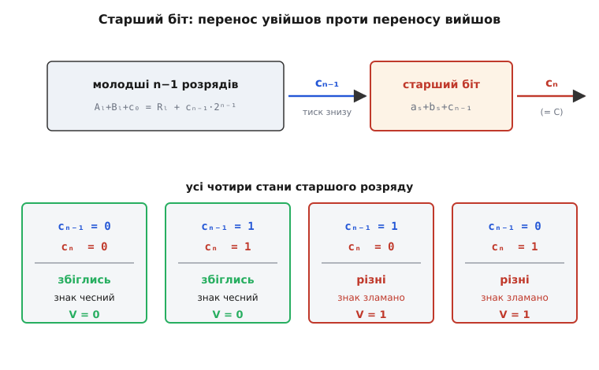
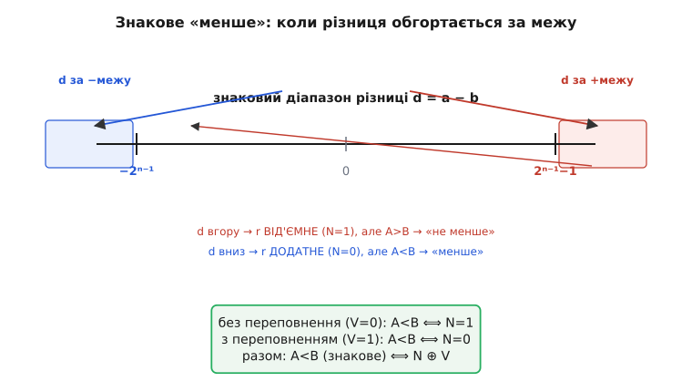

# 🧮 Умови прапорців, виведені з арифметики

Стаття про прапорці показує **що** зчитує кожен із них: N бере старший біт, C виводить перенос-вихід, V порівнює два старші переноси, а порівняння згортаються у вирази на кшталт N ≠ V. Це працює — але чому саме так? Чому «виключне або» двох переносів **точно**, без винятків, дорівнює зміні знаку? Чому знакове «менше» — це рівно N XOR V, а не просто N? Чому перенос-вихід віднімання несе відповідь про беззнаковий порядок? І чому C з V ніколи не заважають одне одному, хоч читаються з тієї самої суми?

Тут ми виведемо кожну з цих умов **із самої арифметики доповняльного коду** — не як завчений факт, а як неминучий наслідок того, що́ таке число в цьому коді. Виявиться, що всі чотири прапорці — це чотири тіні одного простого рівняння, яке пов'язує справжню суму цілих чисел із тим, що суматор насправді виставляє на виходах. Щойно це рівняння побачиш, кожна прапорцева формула перестає бути магією й стає очевидністю.

Домовмося про ширину. Візьмемо **n** бітів (для конкретності часто n = 8, але жодне міркування від цього не залежить). Індексуємо біти 0…n−1; біт n−1 — старший (знаковий). Позначмо:
- **cᵢ** — перенос, що заходить у розряд i (тобто c₀ — перенос-вхід усього додавання, зазвичай 0 для `ADD` і 1 для `SUB`);
- **cₙ** — перенос, що виходить за старший розряд (це і є апаратний C для беззнакового додавання);
- **cₙ₋₁** — перенос, що заходить **у** старший біт.

Саме двійко cₙ₋₁ і cₙ стоятиме в центрі всього.

## Одне рівняння, з якого випливає все

Почнімо з того, що суматор узагалі робить. Він не знає ні про знак, ні про доповняльний код — він тупо складає стовпчиком n двійкових цифр двох чисел плюс перенос-вхід. Якщо трактувати входи як **беззнакові** цілі A і B, то суматор обчислює точну суму A + B + c₀, а тоді лишає з неї молодші n бітів, викидаючи все, що не влізло, у перенос cₙ. Записати це можна одним рядком:

```
A + B + c₀ = R + cₙ · 2ⁿ
```

де R — це n-бітове число на виходах (0 ≤ R < 2ⁿ), а cₙ ∈ {0, 1}. Читається просто: **справжня** сума або вміщається у n бітів (тоді cₙ = 0 і R = A + B + c₀), або переливається через край рівно на одну вагу 2ⁿ (тоді cₙ = 1, а R — це те, що лишилось після відняття цього 2ⁿ). Третього не дано: два числа, менші за 2ⁿ, у сумі з переносом-входом не досягають 2·2ⁿ, тож перелитися можуть щонайбільше один раз. Це — беззнакова правда про суматор, і вона точна.

> 🔧 **Навіщо це.** Це рівняння — не формальність, а робочий інструмент. Коли пишеш арифметику широких чисел (додати два 64-бітні числа на 32-бітній машині), ти **вручну** розриваєш суму на слова саме за ним: молодше слово дає R і cₙ, а cₙ ти заводиш переносом-входом у старше. Уся `ADC` (add-with-carry) — це буквальне продовження цього рівняння на наступне слово.

Тепер той самий суматор, ті самі напруги — але дивимось на них як на **знакові** числа в доповняльному коді. Тут і починається все цікаве, тож пригадаймо, що таке знакове значення бітів.

> Доповняльний код кодує знакове число x у діапазоні −2ⁿ⁻¹ … 2ⁿ⁻¹−1 його беззнаковим залишком за модулем 2ⁿ: невід'ємні x лишаються собою, а від'ємні представлені як x + 2ⁿ. Старший біт при цьому має **від'ємну** вагу −2ⁿ⁻¹, решта — звичайні додатні ваги. Саме тому старший біт відразу є знаком, а додавання за модулем працює однаково для обох знаків. Детальніше — [доповняльний код](topic:math/twos-complement-algebra).

Ключ у слові «за модулем». Позначмо знакові значення тих самих бітів малими літерами: a — знакове значення A, b — знакове значення B, r — знакове значення R. За означенням доповняльного коду кожне з них відрізняється від беззнакового рівно на кратне 2ⁿ:

```
A = a + kₐ · 2ⁿ,   B = b + k_b · 2ⁿ,   R = r + k_r · 2ⁿ
```

де kₐ дорівнює 0 (якщо a ≥ 0) або 1 (якщо a < 0) — і так само для інших. Підставмо це в беззнакове рівняння суматора й скоротімо всі кратні 2ⁿ. Праворуч і ліворуч лишаться знакові значення плюс якесь ціле число, помножене на 2ⁿ. Оскільки нас цікавить саме різниця між справжньою знаковою сумою (a + b + c₀) і тим, що суматор поклав у знаковий результат (r), винесімо її:

```
(a + b + c₀) − r = (cₙ + k_r − kₐ − k_b) · 2ⁿ
```

Ліва частина — це **помилка знакового результату**: наскільки те, що ми прочитали (r), відхилилось від того, що мало вийти (a + b + c₀). Права частина каже, що ця помилка завжди кратна 2ⁿ. Але і a, і b, і r — усі в межах ±2ⁿ⁻¹, тож справжня сума a + b + c₀ лежить у діапазоні приблизно −2ⁿ … +2ⁿ, а її відхилення від r не може дорівнювати ±2ⁿ більш ніж один раз. Отже, помилка приймає рівно одне з трьох значень: 0 (усе гаразд), +2ⁿ, або −2ⁿ. І це вже **означення знакового переповнення**: воно сталося тоді й лише тоді, коли ця помилка не нуль.

Ось воно — те саме рівняння, з якого впаде все інше. Перепишемо його як означення V:

```
V = 1  ⟺  a + b + c₀ ≠ r  ⟺  правильна знакова сума не вмістилась у n бітів
```

Далі — три різні способи прочитати цю саму помилку, і кожен дасть свою прапорцеву формулу.

## Чому V = cₙ₋₁ XOR cₙ

Найкрасивіший спосіб побачити переповнення — на двох сусідніх переносах. Щоб його вивести, глянемо на старший розряд **окремо** від решти.

Розіб'ємо кожне число на «хвіст» (молодші n−1 бітів) і старший біт. Нехай Aₗ, Bₗ, Rₗ — беззнакові значення молодших n−1 бітів (кожне в межах 0 … 2ⁿ⁻¹−1), а aₛ, bₛ, rₛ ∈ {0, 1} — старші біти. Тоді беззнакові числа записуються так:

```
A = Aₗ + aₛ · 2ⁿ⁻¹,   B = Bₗ + bₛ · 2ⁿ⁻¹,   R = Rₗ + rₛ · 2ⁿ⁻¹
```

Тепер спитаймо, що таке cₙ₋₁ — перенос **у** старший біт. Молодша частина складається сама в собі: Aₗ + Bₗ + c₀ дає Rₗ і викидає нагору рівно перенос cₙ₋₁. За тим самим беззнаковим рівнянням, але для n−1 біта:

```
Aₗ + Bₗ + c₀ = Rₗ + cₙ₋₁ · 2ⁿ⁻¹
```

А тепер сам старший розряд. У нього заходять три одиничні внески — aₛ, bₛ і перенос cₙ₋₁ — а виходить із нього старший біт результату rₛ і перенос назовні cₙ. Тобто:

```
aₛ + bₛ + cₙ₋₁ = rₛ + cₙ · 2
```

Ці два рядки — повний і точний опис того, що робить суматор, просто розрізаний по межі старшого біта. Складемо їх, помноживши другий на 2ⁿ⁻¹ (бо старший біт важить 2ⁿ⁻¹), і побачимо, що вони дають те саме беззнакове рівняння цілком — тобто розріз коректний. Але цінне для нас — саме **другий** рядок, про старший розряд. Він каже, як пов'язані два переноси cₙ₋₁ і cₙ зі старшими бітами доданків і результату.

Тепер перекладімо той самий старший розряд на **знак**. У доповняльному коді старший біт важить не +2ⁿ⁻¹, а −2ⁿ⁻¹. Тож знакова помилка, яку ми вивели вище, — це рівно різниця між тим, що́ старший біт мав би зробити зі знаком, і тим, що́ зробив насправді. Візьмімо рівняння старшого розряду й подивімось на нього очима знаку.

Простіше за все — перебрати всі випадки, бо кожна з величин aₛ, bₛ приймає лише 0 чи 1, а c₀ для звичайного `ADD` нуль (випадок c₀ = 1 повторює міркування дослівно, лише зсуває межі). Знак доданка від'ємний ⟺ його старший біт 1. Переповнення за нашим означенням — це коли справжня знакова сума не влізла, тобто знак результату «збрехав». Пройдімо чотири знакові комбінації доданків:

```
aₛ bₛ │ знаки доданків │ cₙ₋₁=0                       │ cₙ₋₁=1
──────┼────────────────┼─────────────────────────────┼─────────────────────────────
 0  0 │  +  та  +      │ rₛ=0, cₙ=0 → знак +, OK      │ rₛ=1, cₙ=0 → знак −, ПЕРЕПОВНЕННЯ
 0  1 │  +  та  −      │ rₛ=1, cₙ=0 → знак −, OK      │ rₛ=0, cₙ=1 → знак +, OK
 1  0 │  −  та  +      │ rₛ=1, cₙ=0 → знак −, OK      │ rₛ=0, cₙ=1 → знак +, OK
 1  1 │  −  та  −      │ rₛ=0, cₙ=1 → знак +, ПЕРЕПОВНЕННЯ │ rₛ=1, cₙ=1 → знак −, OK
```

Кожен рядок читається з рівняння aₛ + bₛ + cₙ₋₁ = rₛ + 2·cₙ. Наприклад, «+ та +» (aₛ = bₛ = 0) з cₙ₋₁ = 1 дає суму 1, тож rₛ = 1, cₙ = 0: результат «від'ємний», хоч склали два додатні — це переповнення. І тут-таки видно, що cₙ₋₁ = 1, а cₙ = 0: переноси **різні**.

Тепер випишемо в останній стовпчик пару (cₙ₋₁, cₙ) для кожного з восьми рядків і зіставимо з тим, де стоїть слово ПЕРЕПОВНЕННЯ:

```
переповнення сталося → (cₙ₋₁, cₙ) = (1, 0)  або  (0, 1)   — переноси РІЗНІ
переповнення нема     → (cₙ₋₁, cₙ) = (0, 0)  або  (1, 1)   — переноси ОДНАКОВІ
```

Це і є доказ. Переповнення трапляється **точно** тоді, коли cₙ₋₁ ≠ cₙ — а «різні» для двох бітів це і є «виключне або»:

```
V = cₙ₋₁ ⊕ cₙ
```

Жодного винятку, жодного «майже»: рівність повна, бо ми перебрали **всі** вісім можливих станів старшого розряду. Інтуїція за цим така. Перенос cₙ₋₁, що зайшов у старший біт, — це «тиск знизу»: молодші розряди переповнились і намагаються посунути старший біт. Перенос cₙ, що вийшов, — це «скид угору»: старший біт сам переповнився й скинув вагу за межі слова. Коли тиск знизу дорівнює скиду вгору (обидва є або обох немає), старший біт відпрацював чесно — вага, що зайшла, дорівнює вазі, що пішла, і знак не постраждав. Коли ж вони різні — старший біт або проковтнув чужу вагу (зайшло, не вийшло), або віддав свою (вийшло, не зайшло), і саме цей дисбаланс перекручує знак. XOR — це буквально «тиск і скид не збіглися».


*Старший біт як шлюз між «тиском знизу» (перенос cₙ₋₁, що заходить) і «скидом угору» (перенос cₙ, що виходить). Коли ваги, що заходить і виходить, рівні — знак не спотворюється; коли різні — старший розряд або проковтнув чужу вагу 2ⁿ⁻¹, або віддав свою, і знак перекручується. Саме ця нерівність двох переносів і є V.*

Помітьте, що ми ні на мить не припускали, які знаки в доданків: перебір покрив усі чотири комбінації, і формула вийшла одна на всіх. Тому апаратура рахує V абсолютно однаково для будь-яких операндів — просто XOR двох дротів, без жодної перевірки знаків.

## Той самий V, прочитаний за знаками операндів

Стаття згадує другу, «знакову» прикмету переповнення: воно можливе лише коли **обидва доданки одного знаку, а результат виходить іншого**. Це не інша умова, а те саме рівняння, прочитане не з переносів, а з бітів знаку. Виведемо і його — заразом побачимо, чому «різні знаки доданків» **гарантують** відсутність переповнення.

Повернімось до знакової помилки a + b + c₀ − r, яка дорівнює 0, +2ⁿ або −2ⁿ. Коли вона +2ⁿ? Це означає, що справжня сума a + b (беремо c₀ = 0) на цілих 2ⁿ більша за прочитаний результат r. Оскільки r ≥ −2ⁿ⁻¹, справжня сума мусить бути ≥ +2ⁿ⁻¹ — тобто **вискочила за верхню межу** +2ⁿ⁻¹−1. А щоб сума двох чисел, кожне з яких < 2ⁿ⁻¹, досягла +2ⁿ⁻¹, **обидва мають бути додатні** (два додатні можуть дати аж до 2ⁿ⁻¹−2; від'ємний доданок лише зменшив би суму). Результат r при цьому виходить від'ємний (його знаковий біт 1), бо додатне значення ≥ 2ⁿ⁻¹ у n бітах читається як від'ємне. Отже:

```
помилка = +2ⁿ  ⟺  обидва доданки додатні (aₛ=bₛ=0), а результат від'ємний (rₛ=1)
```

Дзеркально, помилка −2ⁿ означає, що справжня сума на 2ⁿ менша за r, тобто ≤ −2ⁿ⁻¹−1 — **вискочила за нижню межу** −2ⁿ⁻¹. Досягти такого можуть лише **два від'ємні** доданки, а результат r читається як додатний (rₛ = 0):

```
помилка = −2ⁿ  ⟺  обидва доданки від'ємні (aₛ=bₛ=1), а результат додатний (rₛ=0)
```

Складімо обидва випадки в одну булеву формулу через старші біти. Переповнення є, коли (aₛ=0, bₛ=0, rₛ=1) **або** (aₛ=1, bₛ=1, rₛ=0):

```
V = (¬aₛ · ¬bₛ · rₛ)  +  (aₛ · bₛ · ¬rₛ)
```

Ця формула — теж робочий спосіб рахувати V у залізі (деякі АЛП саме так і роблять, коли переносу cₙ₋₁ немає під рукою). І з неї миттєво видно ключове: якщо знаки доданків **різні** (aₛ ≠ bₛ), то в першому доданку нуль дає ¬aₛ·¬bₛ, у другому — aₛ·bₛ, обидва обнуляються, і V = 0 **завжди**. Ось строге підґрунтя фразі зі статті «переповнення можливе лише коли обидва доданки одного знаку»: коли знаки різні, справжня сума за модулем менша за більший із доданків, тож нікуди вискочити вона не може — доведено.

Отже, дві прикмети V — «переноси різні» (cₙ₋₁ ⊕ cₙ) і «знаки доданків збіглися, а знак результату ні» — тотожні, бо обидві виведені з однієї помилки a + b + c₀ − r. Перша зручніша схемно (два дроти й XOR), друга — концептуально (видно **чому** саме знак ламається).

## Чому беззнакове A < B — це відсутність переносу

Тепер про C і про порівняння. АЛП не має окремого «віднімача»: щоб порахувати A − B, він годує суматор числами A і ~B (побітове доповнення B), а перенос-вхід ставить у 1. Виходить рівно A − B, і ось чому. Побітове доповнення в n бітах — це ~B = (2ⁿ − 1) − B (кожен біт перевертається, а всі одиниці разом дають 2ⁿ−1). Підставмо в те, що рахує суматор:

```
A + (~B) + 1 = A + (2ⁿ − 1 − B) + 1 = A − B + 2ⁿ
```

Тобто суматор бачить на виходах A − B, зсунуте вгору на 2ⁿ. Застосуймо до цього беззнакове рівняння суматора (з c₀ = 1). Ліва частина — A + (~B) + 1 = (A − B) + 2ⁿ; права — R + cₙ·2ⁿ. Прирівняймо:

```
(A − B) + 2ⁿ = R + cₙ · 2ⁿ
```

Розберемо два випадки за знаком **беззнакової** різниці A − B.

**Випадок A ≥ B.** Тоді A − B ≥ 0, і ліва частина ≥ 2ⁿ. Щоб права дорівняла її, потрібен cₙ = 1, а R = A − B (коректна різниця, 0 ≤ R < 2ⁿ). **Перенос вийшов.**

**Випадок A < B.** Тоді A − B < 0, точніше −2ⁿ < A − B < 0, тож ліва частина строго між 0 і 2ⁿ. Праворуч це можливо лише з cₙ = 0, а R = A − B + 2ⁿ (те, що позичило зверху — «обгортка»). **Переносу немає.**

Звідси прямий висновок:

```
A ≥ B (беззнакове)  ⟺  cₙ = 1
A < B (беззнакове)  ⟺  cₙ = 0
```

А cₙ — це і є апаратний C для суми A + (~B) + 1. Тому беззнакове «менше» — рівно **C = 0** (в ARM це умова LO/CC, буквально «carry clear»; підтверджено таблицею умовних кодів ARM). Інтуїція гранично проста: перенос-вихід тут означає «вистачило без позики». Коли A ≥ B, віднімання проходить, не позичаючи зверху, і той «незужитий» перенос-вхід (ота +1) виходить назовні цілим — C = 1. Коли A < B, доводиться позичати вагу 2ⁿ згори, вона й «з'їдає» перенос — C = 0. Саме тому кажуть: **борг = ¬C**.

Тут і корінь тієї «дрібниці, що ламає віднімання», про яку попереджає стаття. Частина архітектур (ARM, 6502, PowerPC) лишає C як цей чесний перенос-вихід, тож C = 1 означає «позики не було». Інші (x86, 68000, Z80) інвертують його на вході в біт-прапорець і звуть **борг**: там C = 1 означає «позика була». Це той самий фізичний cₙ, лише з протилежним знаком тлумачення — і жодна домовленість не «правильніша», вони просто різні. Виведена рівність A < B ⟺ cₙ = 0 не залежить від домовленості; залежить лише, як конкретне залізо називає цей самий біт назовні.

> 🔧 **Навіщо це.** Коли реалізуєш беззнакове порівняння руками — скажімо, `if (a < b)` для двох `uint32_t` через віднімання й читання прапорця, — тобі життєво треба знати домовленість своєї архітектури. На ARM ти після `SUBS` береш «менше» як «C очищено»; на x86 після `CMP` те саме «менше» — це «C встановлено» (бо там C = борг). Переплутати — отримати інвертоване порівняння, класичний баг у ручному асемблері та в емуляторах процесорів.

## Чому знакове A < B — це N XOR V

Лишилось найтонше — знакове «менше». Наївно здається: `A − B` дало від'ємний результат ⟺ A < B, тобто досить прапорця N (старшого біта різниці). І справді, **якби різниця завжди влазила** у n бітів, так би й було: r = a − b, знак r прямо каже, хто більший. Але різниця сама може переповнитись, і тоді r бреше про знак. Уся хитрість — акуратно зшити два випадки.

Позначмо знакову різницю d = a − b (справжнє ціле, не обгорнуте). A < B (знаково) — це буквально d < 0. Питання лише в тому, як прочитати знак d, коли між нами й ним стоїть суматор, що міг переповнитись. Тут якраз стає в пригоді N: за означенням N — це старший біт прочитаного результату r, тобто **знак того, що суматор поклав на виходи**. А V каже, чи це r правдиве, чи переповнене. Розберімо два випадки — і побачимо, як N з V разом відновлюють справжній знак d.

**Випадок без переповнення (V = 0).** Тоді за нашим головним рівнянням помилка нульова: r = a − b = d точно (з поправкою на те, що віднімання — це a + (−b), і воно не вискочило). Прочитаний результат — це і є справжня різниця, тож його знак чесний:

```
V = 0:   A < B  ⟺  d < 0  ⟺  r < 0  ⟺  N = 1
```

Отут «менше» дорівнює просто N = 1. Поки переповнення нема, N сам усе каже.

**Випадок із переповненням (V = 1).** Тепер r ≠ d — вони відрізняються рівно на ±2ⁿ, тобто **знак r перевернутий** відносно справжнього d. Це не випадковість: ми щойно бачили, що переповнення буває лише двох сортів — справжня сума вискочила за верхню межу (тоді результат читається від'ємним) або за нижню (читається додатним). У відніманні d = a − b рівно те саме. Якщо d вискочило вгору (d ≥ +2ⁿ⁻¹, тобто A **набагато** більше за B, отже A > B), результат r читається **від'ємним**, N = 1 — але істина A > B, тобто «не менше». Якщо d вискочило вниз (d ≤ −2ⁿ⁻¹, A набагато менше за B, отже A < B), r читається **додатним**, N = 0 — але істина A < B, «менше». Складімо:

```
V = 1:   N = 1  означає d вискочило вгору  → насправді A > B → «НЕ менше»
         N = 0  означає d вискочило вниз   → насправді A < B → «менше»
```

Тобто при переповненні знак треба читати **навпаки**: «менше» ⟺ N = 0. Зіставимо два випадки в одну таблицю:

```
V │ «A < B» істинне, коли │  тобто
──┼───────────────────────┼──────────
0 │ N = 1                 │  N ≠ V   (бо V=0, N=1)
1 │ N = 0                 │  N ≠ V   (бо V=1, N=0)
```

В обох рядках умова «менше» — це рівно **N ≠ V**. Один випадок дав (N=1, V=0), інший (N=0, V=1) — і те, й те є «N і V різні». Зведімо:

```
A < B (знакове)  ⟺  N ≠ V  ⟺  N ⊕ V
```

Це і є та «елегантна» формула зі статті, тепер строго доведена перебором обох випадків (в ARM — умова LT = «N != V», підтверджено офіційною таблицею; GE, дзеркально, — це N == V). Дивовижа тут ось у чому: V виступає **виправленням знаку**. Прапорець N дає знак того, що вийшло; V каже, збрехав цей знак чи ні; а XOR — це «візьми N, і якщо V каже брехню, переверни». Одна логічна операція лагодить переповнення, яке інакше зруйнувало б порівняння.


*Чому самотній N не годиться для знакового «менше». Коли різниця d влазить у діапазон, її знак (N) правдивий. Коли d вискакує за межу, доповняльний код обгортає її на протилежний бік осі, і знак r перевертається відносно справжнього — саме тоді V=1 сигналить, що N треба читати навпаки. XOR N⊕V об'єднує обидва світи в одну умову.*

## Чому C і V незалежні

Наостанок — питання, що часто бентежить: обидва прапорці, C і V, зчитуються з **тієї самої** суми, з тих самих переносів. То як вони можуть нести незалежну інформацію? Хіба один не визначає інший?

Ні — і тепер, маючи формули, це видно строго. Випишімо, від чого залежить кожен:

```
C = cₙ                — перенос-ВИХІД за старший розряд
V = cₙ₋₁ ⊕ cₙ         — чи РІЗНЯТЬСЯ перенос-вхід у старший біт і перенос-вихід
```

C — це один біт, cₙ. V — це відношення **двох** бітів, cₙ₋₁ і cₙ. Знати cₙ (тобто C) нічого не каже про cₙ₋₁, бо перенос у старший розряд народжується в **молодших** бітах, які до cₙ прямого стосунку не мають. Формально: зафіксуй C = cₙ = 0. Тоді V = cₙ₋₁ ⊕ 0 = cₙ₋₁, а cₙ₋₁ може бути хоч 0, хоч 1 — залежно від молодшої частини. Отже, за фіксованого C прапорець V ще вільний. Так само за фіксованого V вільний C. Жоден не є функцією іншого — це і є незалежність.

Побачити всі чотири комбінації найпростіше на прикладах 8-бітного `ADD` (c₀ = 0). Ось по одному представнику кожної пари (C, V):

**C=0, V=0 — обидва мовчать.** 20 + 30 = 50. Ні беззнакове (50 < 256), ні знакове (50 ≤ 127) не переповнилось. cₙ = 0, cₙ₋₁ = 0.

**C=1, V=0 — беззнакове вилізло, знакове ні.** 200 + 100 = 300. Беззнакове не влізло (300 > 255) → cₙ = 1. А знаково це (−56) + 100 = +44, законно → cₙ₋₁ = 1, тож V = 1⊕1 = 0. Той самий приклад, що й у статті.

**C=0, V=1 — знакове вилізло, беззнакове ні.** Найпростіше — два **додатні**, що переповнюють знаковий діапазон, але не беззнаковий: 100 + 50 = 150. Беззнаково 150 < 256, тож cₙ = 0 → C = 0. Знаково +100 + +50 = +150 > +127 — вилізло, V = 1. Перевірмо переносами: обидва додатні (aₛ=bₛ=0), а результат 150 = `1001 0110` читається від'ємним (rₛ = 1). Щоб rₛ став 1, у старший біт мусив зайти перенос cₙ₋₁ = 1, а вийти йому нема куди — cₙ = 0. Отже V = cₙ₋₁ ⊕ cₙ = 1 ⊕ 0 = 1. **C=0, V=1.**

**C=1, V=1 — обидва вилізли.** Обережна пастка: два **від'ємні** доданки не гарантують C = 0, бо їхні беззнакові біти великі й легко переповнюють. Візьмімо (−128) + (−128): біти 128 + 128 = 256, у 8 бітах → 0. Беззнаково 128 + 128 = 256 > 255 → cₙ = 1, C = 1. Знаково −128 + −128 = −256, далеко за −128 → V = 1. Переносами: aₛ=bₛ=1, rₛ=0, тож у старший біт нічого не зайшло (cₙ₋₁ = 0), а вийшло (cₙ = 1), V = 0 ⊕ 1 = 1. Так само (−100) + (−50) = −150 дає C=1, V=1: беззнакові 156 + 206 = 362 переповнюють, і знакове −150 теж. Тобто «обидва від'ємні» саме по собі нічого про C не каже — треба дивитись на переноси.

Усі чотири пари реалізуються — виразна ознака того, що C і V пробігають свій квадрат станів **незалежно**. Кожен несе свою частину правди: C стереже беззнаковий діапазон (0 … 2ⁿ−1), V — знаковий (−2ⁿ⁻¹ … 2ⁿ⁻¹−1). А оскільки одні й ті самі біти водночас представляють два різні числа з двома різними діапазонами, «вилізло» для них — це дві незалежні події. Тому процесор і мусить виставляти **обидва** прапорці щоразу: він не знає, як програма тлумачить свої біти, тож готує відповідь на обидва запитання, а вибір лишає команді переходу.

> 🔧 **Навіщо це.** Незалежність C і V — причина, чому в системі команд є **окремі** умовні переходи для знакового й беззнакового «менше» (в ARM — LT проти LO, у x86 — JL проти JB). Не можна обійтися одним: ті самі біти дають протилежні відповіді залежно від тлумачення. Компілятор, генеруючи порівняння, дивиться на **тип** операндів у мові й обирає гілку переходу за ним; якщо змішати знаковий і беззнаковий тип, він мусить спершу привести їх до спільного — і саме тут народжуються ті підступні попередження про «signed/unsigned comparison».

## Що ми довели

Усе трималося на одному рівнянні суматора: **A + B + c₀ = R + cₙ·2ⁿ**. Прочитане беззнаково, воно дало перенос як межу діапазону 0 … 2ⁿ−1 і, через прийом A + (~B) + 1, показало, що беззнакове A < B — це рівно відсутність переносу-виходу (C = 0). Прочитане знаково, те саме рівняння перетворилось на помилку a + b + c₀ − r ∈ {0, ±2ⁿ}, і саме її ненульовість — це переповнення V. Ту помилку ми побачили двічі: як нерівність двох сусідніх переносів (V = cₙ₋₁ ⊕ cₙ) і як «знаки доданків збіглися, а знак результату ні». Знак прочитаного результату дав N; поєднання N з поправкою V точно відновило справжній знак різниці, звідки знакове A < B згорнулось у N ⊕ V. А оскільки C залежить від одного переносу, а V — від відношення двох, вони пробігають свій квадрат станів незалежно, і кожен стереже свій діапазон.

Жодна з цих формул не завчена — усі вони випали з арифметики доповняльного коду, щойно ми записали, що́ суматор насправді кладе на виходи. У цьому й сила методу: варто побачити одне точне рівняння за залізом, і чотири прапорцеві умови перестають бути набором правил, а стають чотирма неминучими наслідками одного факту про додавання.
