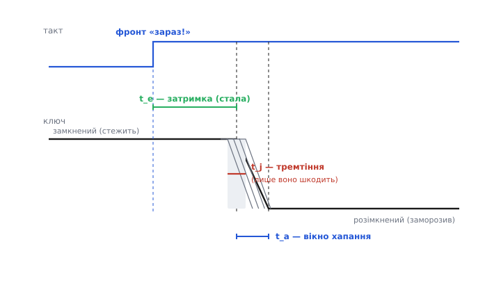

# 📜 Три «апертури», що їх постійно плутають: як Analog Devices навела лад

Мало який куточок аналого-цифрової техніки збирав стільки плутанини, як слово «апертура» (лат. *apertura* — отвір) у даташитах перетворювачів. У різних рядках того самого документа воно означає **три різні речі**, і навіть інженери з досвідом раз у раз плутали одну з одною — писали «апертурний час», маючи на увазі джиттер, чи міряли «затримку», а називали її «невизначеністю». Дійшло до того, що Analog Devices — компанія, яка ці перетворювачі й робить, — випустила окремий навчальний листок, чия назва прямо каже про мету: **«Aperture Time, Aperture Jitter, Aperture Delay Time — Removing the Confusion»**, тобто «прибираємо плутанину». Це історія про те, звідки взялися три апертурні поняття, чому їх так легко змішати, і як термінологічний безлад урешті впорядкували — не одним геніальним осяянням, а терплячою редакторською роботою.

Історія тут повчальна подвійно. По-перше, вона показує, що плутанина в термінах — не дрібниця й не привід для зверхності: коли одне слово тягне три сенси, помилка в специфікації коштує грошей і зіпсованих плат. По-друге, вона — гарний приклад того, як усталюється технічна мова: без указів згори, через авторитет тих, хто пише даташити й підручники, і через одну добре складену табличку, на яку далі всі посилаються.

## Звідки взялося саме слово «апертура»

Корінь плутанини — в аналогії, яку інженери принесли з **фотографії**. Затвор фотоапарата відкриває отвір (англ. *aperture*) на коротку мить, і за цю мить світло встигає лягти на плівку. Так само в перетворювачі є «вікно», протягом якого він «дивиться» на вхід і хапає його значення. Аналогія напрошувалася сама, і слово прижилося: те коротке вікно вибірки й почали звати **апертурою**.

Але фотографічна аналогія, точна в одному, підступно натякнула на зайве в іншому. У фотоапараті витримка (час відкритого затвора) — головна керована величина, і про неї говорять як про єдину «апертурну» характеристику. А в перетворювачі з тієї самої «апертури» виросло **три різні** параметри, бо є три різні запитання про той момент вибірки:

- **коли** саме він стається відносно тактового фронту (це затримка);
- **як довго** триває саме́ хапання, поки ключ переходить із замкненого стану в розімкнений (це тривалість вікна);
- **наскільки той момент тремтить** від відліку до відліку (це невизначеність, вона ж джиттер).

Три запитання — три параметри, і всі троє успадкували прикметник «апертурний». Ось де закладено бомбу: спільне слово на три несумісні поняття. А що плутати їх легко, видно вже з того, що всі троє вимірюються **в одиницях часу** (наносекунди й пікосекунди) і всі троє живуть у тій самій крихітній миті. Око, яке не привчене розрізняти, бачить «якийсь час близько моменту вибірки» — і хапає перше-ліпше з трьох.

> 🔧 **Навіщо це.** Розрізняти ці три — не педантство, а гроші й нерви. Дві з них (затримка й тривалість вікна) — сталі, їх можна врахувати наперед і забути; лише третя (джиттер) додає непереборний шум і ставить стелю точності швидких перетворювачів. Переплутати «маю затримку 3 нс» із «маю джиттер 3 нс» — це різниця між «усе гаразд, просто зсув» і «мій 16-розрядний перетворювач перетворився на 8-розрядний». Тому першим ділом дивляться не на число, а на те, **яка саме** з трьох апертур перед тобою.

## Три апертури поіменно

Розкладімо тепер три поняття по поличках — так, як їх нарешті розвела навчальна серія Analog Devices. Тримаймо в голові вхід перетворювача — вузол [вибірки і зберігання](topic:electronics/adc-sample-hold) (*sample-and-hold*): маленький конденсатор і ключ. Поки ключ замкнений, конденсатор стежить за входом; у мить вибірки ключ **розмикається** — і напруга, що була тієї миті, лишається замороженою. Уся апертурна трійця живе саме навколо цього розмикання.

**Апертурна затримка** (*aperture delay time*, часто позначають *t_e* або *t_d*) — це **стала** фора між тактовим фронтом і справжньою миттю, коли ключ розімкнувся. Ти сказав «зараз!», а реальний ключ послухався на кілька наносекунд пізніше — щоразу на **однаково** пізніше. Саме тому затримка сигналу не спотворює: усі відліки просто рівномірно зсунуті в часі, наче годинник поставили на пару наносекунд уперед. Її вимірюють хитро: подають на вхід двополярну синусоїду й підбирають затримку такту так, щоб вихід перетворювача сів точно на середину шкали; зсув між фронтом такту й справжнім переходом синусоїди через нуль і є апертурна затримка. Число це знають, ураховують — і воно нікого не турбує, поки перетворювач працює сам. (Турбувати починає, коли перетворювачів кілька й вони мають вибирати синхронно — про це нижче.)

**Апертурний час** (*aperture time*, *t_a*), історично званий ще **апертурою вибірки** (*sampling aperture*) — це те коротке, але **ненульове** вікно, потрібне ключу, щоб від'єднати конденсатор від вхідного буфера. Вибірка не миттєва: якусь дещицю часу конденсатор ще «чує» вхід, поки ключ дорозмикається. Це і є пряма родичка фотографічної витримки — власне «апертура» у первісному сенсі. За звичайних умов це вікно теж стале й дуже мале, тож само по собі майже нешкідливе; його головний спадок — саме́ ім'я «апертура», від якого пішли й два інші терміни.

**Апертурний джиттер**, він же **апертурна невизначеність** (*aperture jitter* / *aperture uncertainty*, *t_j*) — це **тремтіння** апертурної затримки від відліку до відліку: та сама фора щоразу трохи інша. Оце вже випадкове й непередбачуване — і саме воно перетворюється на шум напруги, бо якщо мить вибірки з'їхала, а сигнал за цей час рухався, заморозиться не та напруга. Джиттер міряють у середньоквадратичних (RMS) пікосекундах — і не випадково в тих самих одиницях часу, що й перші два, чим і живиться плутанина.

Різниця між трьома, якщо стиснути її в одну думку, така: **перші дві — це фора, яку можна врахувати; третя — це невизначеність фори, врахувати яку неможливо**, бо наперед невідомо, куди хитнеться. Тому з трьох апертур шкодить лише одна — джиттер; дві інші лише позичили їй ім'я і через це десятиліттями тягли її під підозру за компанію.

*Один тактовий фронт — три різні «апертури». Стала затримка t_e зсуває мить вибірки на однакову величину (нешкідливо). Коротке вікно t_a — саме́ хапання, поки ключ розмикається (майже нешкідливо). А t_j — розкид цієї миті від відліку до відліку (сіра «розмазка»): лише він додає шум. Усі троє — в одиницях часу, тому їх і плутають.*

## Чому плутанина стала масовою: окремі SHA й окремі АЦП

Щоб зрозуміти, чому безлад набрав таких масштабів, треба згадати, як **будували** перетворювачі до 1980-х. Тоді єдиної мікросхеми «оцифруй мені напругу» ще не існувало. Систему складали з **двох** окремих деталей: спершу **підсилювач вибірки-зберігання** (*sample-and-hold amplifier*, SHA) заморожував напругу, а вже потім окремий **АЦП** оцифровував заморожене нерухоме число. Дві мікросхеми, два даташити, і — головне — **два різні виробники термінології**.

Analog Devices тут була з перших: ще 1969 року її підрозділ Pastoriza випустив окремі SHA — SHA1 із часом захоплення близько 2 мкс і швидший SHA2 на 200 нс, — призначені для точних вимірювальних систем. У 1970-х пішли інтегральні SHA широкого вжитку — як AD582 від Analog Devices чи LF398 від Texas Instruments. Кожна така мікросхема мала у своєму даташиті власні «апертурні» рядки. А поряд жили даташити АЦП, де слово «апертура» теж траплялося — але вже стосовно **іншої** деталі й іноді в іншому сенсі. Складаючи систему, інженер тримав перед собою два документи, у яких «aperture time» могло означати не зовсім те саме, і сам мусив вирішувати, чиє «вікно» до чого додається.

> 🔧 **Навіщо це.** Ось де корінь безладу: коли вибірка й оцифрування — дві окремі деталі від двох виробників, немає єдиного господаря терміна. Кожен даташит визначав «апертуру» по-своєму, а система успадковувала обидві мови одразу. Тому впорядкувати термінологію змогли лише тоді, коли одна компанія стала писати обидва даташити — і побачила безлад згори.

Ситуацію ускладнювало ще одне слово-двійник. Строго кажучи, вузол, який під час стеження добре **тримається** за вхід, правильніше звати не «вибірка-зберігання» (*sample-and-hold*), а **стеження-зберігання** (*track-and-hold*, T&H): він не бере миттєвий відлік, а весь час **стежить** за входом, аж поки не «замре». На практиці ж обидва терміни вживали як синоніми, і в даташитах вони перемішалися. Тобто плуталося не лише три «апертури», а й самі назви вузла, до якого ті апертури належать.

## Перелом: sampling ADC вбирає SHA в себе

Технічний перелом настав тоді, коли вибірку **вбудували в сам АЦП**. Наприкінці 1970-х з'явилися перші повністю монолітні перетворювачі — як 10-розрядний AD571 від Analog Devices (1978), який спроєктував Пол Брокоу (*Paul Brokaw*); а протягом 1980-х поширилися **АЦП із вбудованою вибіркою** (*sampling ADC*): усередині корпусу вже сидів свій вузол вибірки-зберігання, а зовні був єдиний вхід «подай напругу — забери число». Складати систему з двох деталей стало не потрібно.

Це змінило картину термінів разюче. Тепер у користувача перед очима — **один** даташит на **один** перетворювач. І саме тут стало видно, як безглуздо мати в одному документі три різні «апертури», які до того жили в різних паперах і не сварилися. Коли вони зійшлися під одним дахом, редактори даташитів уже не могли ховатися за «це в іншій мікросхемі» — довелося визначати всі три чітко й поряд, щоб їх не сплутав жоден читач. Інтеграція, що спростила залізо, водночас **загострила потребу навести лад у словах**.

І тут з'явився ще один тонкий поворот, який показав, що навіть «нешкідлива» затримка не завжди безневинна. Поки перетворювач один, стала апертурна затримка — просто зсув, і байдуже. Але щойно перетворювачів кілька й вони мають вибирати **узгоджено** — у перемежованих АЦП (*interleaved*, коли кілька перетворювачів по черзі вибирають, щоб разом дати вищу частоту) чи в прямому I/Q-демодулюванні, — **різниця** апертурних затримок між ними вже спотворює результат. Стала для одного перетворювача величина стає джерелом похибки для гурту. Це ще одна причина, чому три апертури треба тримати нарізно: те, що безпечне поодинці, у поєднанні поводиться інакше.

## Хто навів лад: навчальна серія Analog Devices і Walt Kester

Термінологічний безлад упорядкувала не постанова стандарту, а **терпляча навчальна робота**. Головним її обличчям став **Walt Kester** — багаторічний інженер-прикладник Analog Devices, редактор і автор товстого фахового довідника «The Data Conversion Handbook» (2005) і цілої серії коротких навчальних листків, які в компанії звуть **MT-tutorials** (від *mini-tutorial*), пронумерованих MT-001, MT-002 і далі. Саме в цій серії з'явився листок **MT-007 «Aperture Time, Aperture Jitter, Aperture Delay Time — Removing the Confusion»** (редакція A, жовтень 2008), де три апертури нарешті розкладено поряд, кожну з власним визначенням, позначенням і способом виміру. Поряд стоїть споріднений **MT-090 «Sample-and-Hold Amplifiers»**, що впорядкував і саму назву вузла (S/H проти T&H), і **MT-003** про SNR, ENOB та інші метрики, у яких джиттер зринає як стеля точності.

Тут важливо не збитися на міф про «першовідкривача». Kester **не винаходив** ці поняття — апертурна затримка, апертурний час і апертурний джиттер існували в даташитах і статтях десятиліттями до нього, ще з доби окремих SHA. Його внесок — **систематизація**: узяти три поняття, що плуталися в різних паперах, дати їм несуперечливі, поряд поставлені означення й закріпити спосіб виміру кожного, щоб інженери говорили однією мовою. Це робота радше **редактора-впорядника**, ніж винахідника, — і тим вона цінна: чиста термінологія економить більше помилок, ніж інша схемотехнічна хитрість.

Так само чесно сказати, що Analog Devices тут — не єдиний і не «офіційний» законодавець мови. Ті самі поняття означують і стандарти вимірювань, і даташити інших виробників, і академічні підручники з перетворювачів. Але саме навчальна серія ADI стала тим текстом, на який далі найчастіше **посилаються** — бо він короткий, прямий і виходить від тих, хто ці мікросхеми проєктує. Усталення технічного терміна — це завжди не декрет, а **накопичення посилань**: означення стає каноном тоді, коли на нього починають спиратися всі решта. З апертурними термінами роль такого опорного тексту випала MT-007.

> 🔧 **Навіщо це.** Практична мораль для читача даташита: коли натрапляєш на «aperture», не вір першому враженню, а дивись, **яку з трьох** величин перед тобою поставили — сталу затримку, ненульове вікно чи RMS-тремтіння в пікосекундах. Перші дві врахуй і забудь; третю бери в розрахунок стелі SNR. І пам'ятай, звідки взялася сама потреба розрізняти: три поняття зрослися під одним словом випадково, через фотографічну аналогію й через те, що колись вибірку й оцифрування робили дві різні мікросхеми.

## Що лишилося від цієї історії

Апертурна плутанина — маленький, майже кумедний епізод в історії техніки, але він добре показує три речі, більші за нього самого.

Перше: **одне зручне слово здатне породити довгий безлад**. Фотографічна «апертура» лягла гарно, та потягла за собою три несумісні сенси — і десятиліттями інженери платили за це зіпсованими специфікаціями. Точність мови в техніці — не естетика, а інженерна вимога.

Друге: **термінологію впорядковує не стандарт, а авторитетний текст**. Три апертури розвела не постанова комітету, а добре складена навчальна табличка від тих, хто ці перетворювачі робить, — і закріпилася вона через посилання, а не через указ. Так усталюється більшість технічної мови.

Третє, найглибше: **розрізняти близькі поняття важливіше, ніж їх називати**. Уся суть історії — не в назвах, а в тому, що з трьох схожих на око величин лише одна (джиттер) ставить непереборну стелю точності, а дві інші — просто фора, яку враховують і забувають. Хто цю різницю бачить, той не сплутає безпечний зсув із згубним шумом — і не викине гроші ні на розряди, яких не побачить, ні на страх перед затримкою, яка нікому не шкодить.
