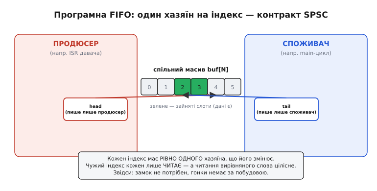
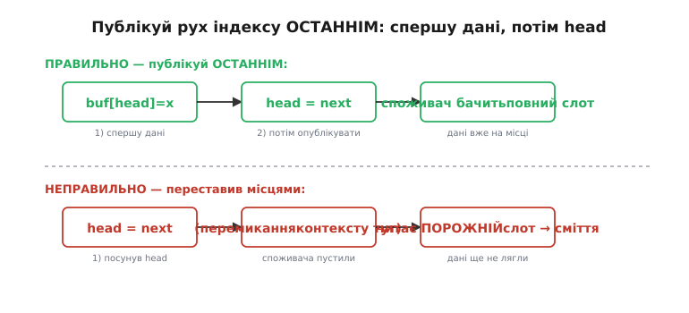
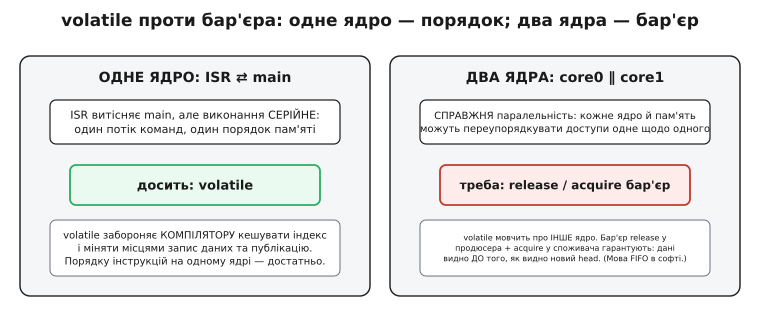

# ⚙️ Кільцевий буфер FIFO у коді: та сама черга, лише без кремнію

Апаратна асинхронна FIFO робить свою роботу мовчки: кільце комірок, два вказівники, зайвий біт, код Грея на межі — і назовні стирчить пара прапорців. Але той самий будівельний блок часто-густо доводиться скласти **власноруч у прошивці** — коли даними міняються не два тактові домени в кремнії, а два **програмні контексти** на одному процесорі. Обробник переривання (англ. *interrupt service routine*, ISR) ловить байти з ефіру й мусить кудись їх складати; головний цикл забирає їх, коли має вільну мить. Між ними — та сама задача «перший зайшов — перший вийшов», тільки тепер її розв'язує не залізо, а ваш C-код.

І тут криється повчальна річ. У софті проступає **той самий скелет** — масив-кільце й два індекси, — але дещо з апаратних хитрощів **зникає як непотрібне**, а дещо, навпаки, **повертається в новій одежі**. Код Грея тут не знадобиться взагалі. Зате питання «як передати індекс через межу так, щоб приймач не побачив недоречне» нікуди не дінеться — воно лише перевтілиться з «дзвону метастабільності» в «переупорядкування пам'яті». Розберімо це кільце з нуля й побачимо, де софтова версія простіша за апаратну, а де — так само підступна.

## Задача: винести потік з обробника, не борючись за нього

Уявіть типову ситуацію на мікроконтролері. Приходить [переривання](topic:programming/interrupts) від UART — прилетів байт. Обробник має його забрати негайно (інакше наступний байт затре цей у регістрі приймача), але **обробляти** його зараз ніколи: ISR мусить бути коротким, бо поки він працює, усе інше в системі стоїть. Отже, байт треба кудись **покласти** й вискочити, а розібратися з ним — уже в спокійному головному циклі.

> Коротко про [ISR](topic:programming/isr), бо на ньому все крутиться. Обробник переривання — це функція, яку процесор викликає **сам**, коли сталася подія (прийшов байт, спрацював таймер), витісняючи те, що виконувалось. Його заповідь — бути якнайкоротшим: жодних довгих обчислень, жодного очікування. Тому обробник лише **хапає** дані й кладе їх у чергу для повільнішого коду, а сам миттю повертається.

Наївне рішення — одна спільна змінна «останній байт» — розсипається одразу: поки головний цикл її читає, наступне переривання її вже затерло, і слово втрачено. Потрібен **буфер**, куди байти складаються один за одним і чекають, поки їх заберуть у тому самому порядку. Тобто FIFO.

Але буфер між ISR і головним циклом — це не просто масив. Ці двоє працюють **«одночасно»** в тому сенсі, що обробник будь-якої миті **витісняє** головний цикл — просто посеред будь-якої команди. Якщо обидва торкаються тих самих полів буфера абияк, виходить **гонка даних** (англ. *data race*): результат залежить від того, у яку саме мить прилетіло переривання. А такі баги — найгірші: вони зникають під налагоджувачем і вилазять раз на мільйон разів у полі.

> 🔧 **Навіщо це.** Це не рідкісний випадок, а щоденний хліб прошивки. Приймач UART, потік відліків з АЦП, мітки часу від таймера захоплення, події енкодера — усе це народжується в перериванні й має дістатися головного циклу цілим і по черзі. Щойно ви пишете обробник, складніший за «підняти прапорець», вам майже напевно потрібна саме така черга. Зробите її неправильно — і матимете плавучий баг, який неможливо зловити на столі.

Проситься замок: перед доступом «замкнув», після — «відімкнув». Але проти **власного** обробника головний цикл замкнутися не може — переривання витіснить його **разом із замкненим замком**, і якщо обробник теж чекатиме той замок, система зависне намертво. Груба альтернатива — **вимикати переривання** на час доступу — працює, та вона дорога й шкідлива: поки переривання вимкнені, система глуха до всього, зростає затримка реакції, можна проґавити подію. Хочеться черги, що взагалі **не потребує блокувань**. І вона існує.

## Ідея: кільце, два індекси й контракт одного хазяїна

Візьмемо звичайний масив `buf[N]` і замкнемо його в кільце — за останнім елементом рахуємо нульовий. Це той самий **кільцевий буфер** (англ. *ring buffer*, *circular buffer*), що й в апаратній FIFO: потік ллється по колу, місце ніколи «не закінчується», індекси просто оббігають кільце.

Стан кільця задають два індекси:

- **head** («голова») — куди ляже наступне слово; його посуває **письменник**;
- **tail** («хвіст») — звідки візьметься наступне слово; його посуває **читач**.

Порожньо, коли `head == tail`: писати вже почали з того місця, звідки ще не читали, — між ними нічого нема. Це достоту як в апаратному кільці, де порожньо — коли вказівник запису наздогнав вказівник читання.

Але головне — **не структура, а дисципліна**. Ключ до черги без замків такий:

> **head змінює ЛИШЕ письменник. tail змінює ЛИШЕ читач. Кожен читає чужий індекс, але ніколи його не пише.**

Оце і є весь секрет. Такий розклад називають **SPSC** — *single producer, single consumer*, «один продюсер, один споживач». Раз у кожного індексу рівно **один хазяїн**, що його змінює, то два контексти ніколи не пишуть **в одну й ту саму** змінну водночас — а отже, класичної гонки «двоє пишуть» просто немає чому виникнути. Чуже кожен лише **читає**, а прочитати одне вирівняне машинне слово процесор уміє **однією неподільною командою** — приймач ніколи не впіймає індекс «наполовину оновленим».


*Програмна FIFO — це той самий кільцевий буфер, але межу між «доменами» тепер креслить не такт, а власність. head пише лише продюсер, tail — лише споживач; чужий індекс кожен лише читає. Оскільки читання вирівняного слова цілісне, а пишуть у кожен індекс з одного боку, замок стає непотрібним: контракт SPSC виключає гонку сам собою.*

Придивіться, як точно це віддзеркалює залізо. В апаратній FIFO два **тактові домени**, і вказівник запису «належить» домену запису, а вказівник читання — домену читання; кожен домен рахує свій вказівник і лише **дивиться** на чужий, проведений через межу. У софті ролі ті самі — просто «домен» тепер це не окремий кварц, а окремий **контекст виконання**: обробник переривання проти головного циклу. Межу між ними креслить не фронт такту, а правило власності. Аналогія тримається напрочуд добре — і ламається рівно в одному місці, до якого ми ще дійдемо: у тому, **як саме** чужий індекс безпечно перетинає межу.

## Порожньо, повно й відлуння «зайвого біта»

Тепер та сама тонкість, що й у кремнії: `head == tail` означає водночас і **порожньо**, і **повно**. Порожньо — коли нічого не поклали з останнього читання. Повно — коли письменник обійшов усе кільце й наздогнав читача ззаду. Індекси в обох випадках однакові, а зміст протилежний. В апаратній FIFO це розв'язували **зайвим старшим бітом** вказівника — лічильником «обертів» кільця. У софті маємо три робочі способи, і вибір між ними — свідомий компроміс.

**Спосіб перший — пожертвувати одну комірку.** Оголосимо «повно» ще **до** того, як індекси зійдуться: буфер повний, коли `next(head) == tail`, тобто коли між головою й хвостом лишилась рівно одна вільна комірка-роздільник. Тоді `head == tail` завжди й лише «порожньо», двозначності немає. Ціна — одна комірка з `N` ніколи не використовується (місткість стає `N−1`), зате стан читається **з самих індексів**, без жодної додаткової змінної. Це найчистіший вибір для SPSC-черги, і саме тому він тут головний.

**Спосіб другий — тримати лічильник заповнення `count`.** Письменник збільшує `count`, читач зменшує; «повно» — це `count == N`, «порожньо» — `count == 0`. У гру входить уся місткість, і до того ж будь-хто миттю бачить, **скільки** слів у черзі, — корисно, коли треба знати ступінь заповнення, а не лише факт. Але з'являється змінна, яку **пишуть обидві сторони**: письменник її інкрементує, читач декрементує. А спільний лічильник, що його двоє змінюють, — це вже потенційна [гонка](topic:programming/atomicity-races): якщо `count++` не атомарна (а на багатьох машинах це три окремі команди «прочитав — додав — записав»), інкремент і декремент можуть перетертися, і лічильник «попливе». Тому `count` рятує лише там, де його оновлення атомарне або захищене.

**Спосіб третій — окремий прапорець-ознака** останньої операції (читання чи запис): коли `head == tail`, дивимось на прапорець — після запису це «повно», після читання «порожньо». Працює, але додає ще одну спільну змінну зі своїми питаннями порядку; на практиці перший спосіб майже завжди чистіший.

Ось де зненацька збігаються дві, здавалося б, далекі речі — і збіг цей не випадковий. В **апаратній** FIFO ніколи не жертвують коміркою: там беруть саме зайвий біт. Причина проста й гарна: у кремнії комірка пам'яті — це реальні тригери, які коштують площі й струму, а зайвий біт вказівника — майже безплатний. У **софті** ж комірка масиву дешева, а от арифметика й спільні змінні — те, що хочеться спростити; тому в коді найчастіше жертвують коміркою й обходяться без лічильника. Один і той самий вибір «повно проти порожньо» дві інженерії розв'язують **дзеркально протилежно** — кожна економить те, що дорого саме їй. Апаратна FIFO бере зайвий біт не тому, що він «розумніший», а тому, що комірка в кремнії дорожча за біт; у прошивці все навпаки.

## Робочий код: кільце байтів для ISR і головного циклу

Досить слів — ось повна, готова до вставляння в проєкт черга. Це реальний C для мікроконтролера, не псевдокод: підключайте, і воно працює. Почнімо з базового варіанта — «пожертвувана комірка», один продюсер (ISR) і один споживач (головний цикл) на **одному ядрі**.

:::tabs
```cpp
#include <stdint.h>
#include <stddef.h>

// Розмір — ОБОВ'ЯЗКОВО степінь двійки: тоді обгортання індексу — це
// швидка маска & (SIZE-1), а не дороге ділення % SIZE.
#define FIFO_SIZE   256u
#define FIFO_MASK   (FIFO_SIZE - 1u)

typedef struct {
    uint8_t          buf[FIFO_SIZE];
    volatile uint16_t head;   // куди пише продюсер (ISR)
    volatile uint16_t tail;   // звідки читає споживач (main)
} fifo_t;

static inline void fifo_init(fifo_t *q)
{
    q->head = 0;
    q->tail = 0;
}

// Наступний індекс по колу. Маска замість % — див. нижче про степінь двійки.
static inline uint16_t fifo_next(uint16_t i)
{
    return (uint16_t)((i + 1u) & FIFO_MASK);
}

// «Порожньо» бачить споживач: голова наздогнала хвіст.
static inline int fifo_empty(const fifo_t *q)
{
    return q->head == q->tail;
}

// «Повно» бачить продюсер: наступна голова вперлась би в хвіст
// (пожертвувана комірка-роздільник).
static inline int fifo_full(const fifo_t *q)
{
    return fifo_next(q->head) == q->tail;
}
```
```python
# Розмір — ОБОВ'ЯЗКОВО степінь двійки: тоді обгортання індексу — це
# швидка маска & (SIZE-1), а не дороге ділення % SIZE.
FIFO_SIZE = 256
FIFO_MASK = FIFO_SIZE - 1


class Fifo:
    def __init__(self):
        self.buf = bytearray(FIFO_SIZE)
        self.head = 0   # куди пише продюсер (ISR)
        self.tail = 0   # звідки читає споживач (main)

    # Наступний індекс по колу. Маска замість % — див. нижче про степінь двійки.
    @staticmethod
    def _next(i):
        return (i + 1) & FIFO_MASK

    # «Порожньо» бачить споживач: голова наздогнала хвіст.
    def empty(self):
        return self.head == self.tail

    # «Повно» бачить продюсер: наступна голова вперлась би в хвіст
    # (пожертвувана комірка-роздільник).
    def full(self):
        return self._next(self.head) == self.tail
```
:::

Тепер дві операції. Письменник (`put`) кладе байт і посуває голову; читач (`get`) бере байт і посуває хвіст. Обидві повертають ознаку успіху — бо черга скінченна, і чесна відповідь «не вийшло» краща за мовчазну втрату даних.

:::tabs
```cpp
// Продюсер (виклик з ISR). Повертає 1, якщо поклали; 0, якщо повно.
static inline int fifo_put(fifo_t *q, uint8_t byte)
{
    uint16_t h = q->head;
    uint16_t n = fifo_next(h);
    if (n == q->tail)          // повно → політика «відкинути новий»
        return 0;
    q->buf[h] = byte;          // 1) СПЕРШУ дані у слот
    q->head   = n;            // 2) ПОТІМ опублікувати нову голову
    return 1;
}

// Споживач (виклик з main/loop). Повертає 1 і байт у *out; 0, якщо порожньо.
static inline int fifo_get(fifo_t *q, uint8_t *out)
{
    uint16_t t = q->tail;
    if (t == q->head)          // порожньо
        return 0;
    *out    = q->buf[t];       // 1) СПЕРШУ прочитати дані
    q->tail = fifo_next(t);    // 2) ПОТІМ звільнити слот
    return 1;
}
```
```python
# Продюсер (виклик з ISR). Повертає True, якщо поклали; False, якщо повно.
def fifo_put(q, byte):
    h = q.head
    n = Fifo._next(h)
    if n == q.tail:            # повно → політика «відкинути новий»
        return False
    q.buf[h] = byte            # 1) СПЕРШУ дані у слот
    q.head = n                 # 2) ПОТІМ опублікувати нову голову
    return True


# Споживач (виклик з main/loop). Повертає (True, байт); (False, 0), якщо порожньо.
def fifo_get(q):
    t = q.tail
    if t == q.head:            # порожньо
        return False, 0
    out = q.buf[t]             # 1) СПЕРШУ прочитати дані
    q.tail = Fifo._next(t)     # 2) ПОТІМ звільнити слот
    return True, out
```
:::

І як це живе разом. Обробник переривання UART складає прилеглі байти в чергу й миттю виходить; головний цикл спокійно їх розгрібає:

```c
static fifo_t rx_fifo;

// Викликається апаратним перериванням: прилетів байт.
void USART_IRQHandler(void)
{
    uint8_t b = (uint8_t)UART_DR;   // забрати з регістра приймача
    if (!fifo_put(&rx_fifo, b)) {
        // черга переповнена — свідомо вирішуємо, що робити:
        // тут лічимо втрату, а не мовчимо про неї
        rx_overflow_count++;
    }
}

// Головний цикл: обробляємо все, що встигло накопичитись.
void main_loop(void)
{
    uint8_t b;
    while (fifo_get(&rx_fifo, &b)) {
        process_byte(b);            // розбір протоколу, збирання рядка тощо
    }
    // ... інша робота циклу ...
}
```

Зверніть увагу, чого тут **немає**. Немає ані замка, ані вимикання переривань, ані коду Грея, ані синхронізаторів. Уся безпека тримається на двох речах: контракті «один хазяїн на індекс» і **правильному порядку** двох дій усередині `put`/`get`. Саме про цей порядок — далі, бо в ньому весь ризик.

## Тонкість, що вирішує все: публікуй рух індексу останнім

Погляньте ще раз на `fifo_put`. Дві дії: записати байт у слот і посунути `head`. Здається, байдуже, у якому порядку, — але **порядок критичний**, і ось чому.

Рух `head` — це **публікація**. Поки голова стоїть, споживач вважає, що цього слота ще нема (`head == tail` для нього — порожньо). Щойно голова зрушила — споживач має право зайти в новий слот і прочитати його. Отже, `head` каже споживачеві «дані готові, бери». Якщо посунути голову **раніше**, ніж покладено байт, то між цими двома командами може прилетіти інше переривання (чи головний цикл на іншому ядрі саме гляне на чергу) — і споживач побачить «новий» слот, кинеться його читати, а там ще **старе сміття**: байт не встиг лягти. Черга віддасть слово, якого ніхто не клав.

Тому правило залізне: **спершу дані, потім публікація**. Письменник заповнює слот, і **лише тоді** посуває голову. Дзеркально читач: спершу забирає дані зі слота, і **лише тоді** посуває хвіст (бо рух хвоста звільняє слот під перезапис — це теж публікація, тільки «місце вільне»).


*Рух індексу — це публікація, і робити її треба ОСТАННЬОЮ. Ліворуч правильно: продюсер кладе дані в слот, а вже потім посуває head, тож споживач завжди бачить заповнений слот. Праворуч пастка: посунули head першим — і якщо саме тут утрутиться споживач, він прочитає слот ще до запису й дістане сміття. Той самий принцип «перемикач останнім», що рятує й надійний запис у флеш: спершу підготуй, потім одним рухом оголоси готовність.*

Цей самий принцип «перемикач останнім» ви впізнаєте всюди, де стан оголошують готовим одним фінальним рухом — від надійного [запису у флеш](topic:programming/write-integrity) (спершу дописати новий образ, потім перемкнути вказівник на нього) до апаратної FIFO, де вказівник у коді Грея теж рухається **після** того, як дані вже лягли в комірку пам'яті. Скрізь однаково: підготуй тихо, опублікуй останнім.

## Чому код Грея тут не потрібен — і чому це не завжди так

Настав час найцікавішого — місця, де софтова аналогія з апаратною **ламається**, і зрозуміти чому означає зрозуміти обидві конструкції до кінця.

В апаратній FIFO багатобітний вказівник вели через межу **в коді Грея** — саме тому, що приймальний домен защіпає його своїм тактом, який може припасти **рівно на мить**, коли вказівник міняється. Якби разом перемикалося кілька бітів, приймач упіймав би мішанину старих і нових бітів — число, якого ніколи не існувало. Код Грея гарантує зміну **одного біта за крок**, тож у найгіршому разі приймач бачить або повністю старе, або повністю нове значення.

У софті на **одному ядрі** цієї біди **немає взагалі** — і причина фундаментальна. Процесор читає вирівняне 16- чи 32-бітне слово **однією неподільною командою**. Не існує миті, коли `head` «наполовину оновлений»: або команда запису вже виконалась, і в пам'яті ціле нове значення, або ще ні, і там ціле старе. Проміжного стану немає **фізично**, бо між командами процесора нічого не «защіпається» на льоту, як тригер у чужому такті. Ось у чому суть відмінності: апаратний синхронізатор **семплює** сигнал у довільну мить (звідси й ризик метастабільності, і потреба в Греї), а програмний читач бачить пам'ять **між** цілими командами, ніколи не всередині запису. Тому код Грея в софтовій FIFO — зайвий: те, від чого він захищає, тут просто не виникає.

Але — і це важливо — тільки на **одному ядрі**. Щойно письменник і читач опиняються на **різних ядрах** (два ядра ESP32, скажімо), стара проблема **повертається в новій одежі**. Не як розрив бітів, а як **переупорядкування пам'яті**.

## Два ядра: коли повертається бар'єр

На одному ядрі порядок, у якому команди **справді змінюють пам'ять**, збігається з порядком, у якому ви їх написали (принаймні як його бачить це саме ядро). Тому «спершу дані, потім head» у коді означає «спершу дані, потім head» і в пам'яті.

На **двох ядрах** ця обіцянка зникає. Кожне ядро має свій кеш і свій буфер запису, і два записи продюсера — байт у слот і нова голова — можуть **дійти до іншого ядра в іншому порядку**, ніж їх зроблено. Ядро-споживач цілком може **побачити нову `head` раніше**, ніж побачить записаний байт, — навіть якщо продюсер акуратно зробив усе «в правильному порядку». Публікація випередила дані, і споживач знову читає сміття — тільки цього разу винен не код, а сама архітектура пам'яті.

І тут виявляється, що `volatile` — **не ліки**. Ключове слово [`volatile`](topic:programming/volatile) забороняє **компілятору** дві речі: кешувати значення в регістрі (тож голову й хвіст щоразу перечитують із пам'яті — інакше цикл `while (fifo_get(...))` міг би «застрягти» на старому значенні) і переставляти доступи до цієї змінної місцями. Цього **досить на одному ядрі**. Але `volatile` не каже нічого **іншому ядру** й нічого не наказує кеш-підсистемі: він керує лише тим, як компілятор породжує команди, а не тим, як ці команди бачить сусіднє ядро. Проти міжʼядерного переупорядкування він безсилий.

Ліки — **бар'єр пам'яті** (англ. *memory barrier*, або *fence*). Це спеціальна вказівка процесору: «усі записи **до** цієї межі мусять стати видимими для інших ядер **раніше** за будь-який запис **після** неї». Продюсер ставить бар'єр **між** записом даних і публікацією голови (бар'єр **release**, «відпустити»); споживач ставить дзеркальний бар'єр **після** читання голови й **перед** читанням даних (бар'єр **acquire**, «захопити»). Разом ця пара дає точну гарантію: якщо споживач **побачив** нову голову, то він гарантовано **побачить і дані**, що лягли перед нею. Це і є **прямий софтовий відповідник** апаратного код-Грея-плюс-синхронізатора: обидва механізми домагаються одного — щоб «нове значення індексу» ніколи не випередило те, на що воно вказує.


*Де межа проходить у софті. На одному ядрі ISR витісняє main, але команди йдуть серійно — один порядок пам'яті, тож volatile (проти кешування в регістрі й перестановки компілятором) цілком достатньо. На двох ядрах з'являється справжня паралельність: записи можуть дійти до сусіда в іншому порядку, і volatile тут мовчить. Тоді потрібен release-бар'єр у продюсера й acquire-бар'єр у споживача — це і є мова коду Грея, перекладена на софт.*

У сучасному C це виражають атомарними операціями зі стандарту C11 — і код виходить компактним та переносним. Голову й хвіст оголошують `_Atomic`, а порядок задають прапорцями: свій індекс читаємо **розслаблено** (`relaxed` — нам байдуже, як він упорядкований щодо іншого, бо ним володіємо лише ми), чужий читаємо з **acquire**, а публікуємо свій з **release**:

```c
#include <stdatomic.h>
#include <stdint.h>

#define FIFO_SIZE 256u
#define FIFO_MASK (FIFO_SIZE - 1u)

typedef struct {
    uint8_t              buf[FIFO_SIZE];
    _Atomic uint16_t     head;
    _Atomic uint16_t     tail;
} fifo_mc_t;

// Продюсер на своєму ядрі.
int fifo_put_mc(fifo_mc_t *q, uint8_t byte)
{
    uint16_t h = atomic_load_explicit(&q->head, memory_order_relaxed); // свій — relaxed
    uint16_t n = (uint16_t)((h + 1u) & FIFO_MASK);
    // чужий (хвіст) — acquire: побачити місце, звільнене споживачем
    if (n == atomic_load_explicit(&q->tail, memory_order_acquire))
        return 0;                       // повно
    q->buf[h] = byte;                   // дані у слот
    // публікуємо голову з release: дані гарантовано ляжуть ДО того,
    // як інше ядро побачить нову голову
    atomic_store_explicit(&q->head, n, memory_order_release);
    return 1;
}

// Споживач на іншому ядрі.
int fifo_get_mc(fifo_mc_t *q, uint8_t *out)
{
    uint16_t t = atomic_load_explicit(&q->tail, memory_order_relaxed); // свій — relaxed
    // чужий (голова) — acquire: парний до release продюсера
    if (t == atomic_load_explicit(&q->head, memory_order_acquire))
        return 0;                       // порожньо
    *out = q->buf[t];                   // читаємо дані (після acquire — вже видимі)
    // звільняємо слот із release: споживач опублікував «місце вільне»
    atomic_store_explicit(&q->tail, (uint16_t)((t + 1u) & FIFO_MASK),
                          memory_order_release);
    return 1;
}
```

Пара `release`↔`acquire` тут — це весь механізм безпеки на двох ядрах, стиснутий у два прапорці. Продюсер відпускає (`release`) дані разом із новою головою; споживач захоплює (`acquire`) їх разом зі зчитаною головою. Стандарт гарантує: усе, що продюсер записав **до** свого `release`, стане видимим споживачеві, щойно той побачить опубліковане значення через свій `acquire`. На одному ядрі ці бар'єри вироджуються майже в ніщо (архітектура й так усе впорядковує), тож той самий код лишається коректним і там — просто без зайвих накладних. Це, до речі, ще одна причина писати одразу з атомарними операціями, якщо є найменший шанс, що черга колись переїде на друге ядро.

> 🔧 **Навіщо це.** Різниця «одне ядро / два ядра» — не теорія, а поширена пастка, на якій ловляться навіть досвідчені. Код із самим `volatile` бездоганно працює на одноядерному STM32 і роками стоїть у продукції; потім проєкт переносять на двоядерний ESP32, той самий код компілюється без єдиного попередження — і зрідка, під навантаженням, черга віддає зіпсований байт. Зрозумівши **чому** (публікація випереджає дані через переупорядкування пам'яті), ви ставите один бар'єр — і проблеми як не було. Не зрозумівши — тижнями полюєте на привида.

## Складність і пастки

Кільцева FIFO в коді — це масив плюс модульна арифметика, і вся її підступність зосереджена в кількох точних місцях. Пройдімося ними наостанок — це чек-лист, який варто тримати перед очима.

- **Рівно один + один.** SPSC — це **один** письменник і **один** читач, і вся безпека без замків тримається саме на цьому. Два обробники, що пишуть в одну чергу, або два читачі — і контракт «один хазяїн на індекс» валиться, гонка повертається. Тоді потрібна вже інша конструкція — черга з замком або багатопродюсерна (MPSC/MPMC), а це геть інша складність. Не намагайтеся «трошки» порушити SPSC: або дотримуйтесь його строго, або беріть замок.

- **Атомарність індексу — не безплатна на вузьких МК.** Уся безпека спирається на те, що індекс читається й пишеться **однією** командою. Для 16-бітного `uint16_t` на 8-бітному AVR це **вже не так**: там 16-бітне слово рухається двома командами по байту, і читач може спіймати індекс «напівоновленим» — старший байт новий, молодший ще старий. Ліки: або тримати індекс у **машинному слові** (`uint8_t` на 8-бітнику, якщо `SIZE ≤ 256`), або на час читання коротко прикрити доступ. На 32-бітному Cortex-M будь-який вирівняний `uint16_t`/`uint32_t` читається цілим — там питання знімається саме собою.

- **Порядок публікації — священний.** Письменник: **дані, потім** head. Читач: **дані, потім** tail. Переставте — і споживач читатиме недописаний слот. Це та сама помилка, що й посунути вказівник у флеші раніше за запис даних; механізм ідентичний.

- **volatile проти бар'єра — не сплутати рівні.** На одному ядрі `volatile` на індексах **обов'язковий** (інакше компілятор закешує їх у регістрі, і черга «застрягне» на старому значенні або взагалі викине перевірку в нескінченному циклі) і водночас **достатній**. На двох ядрах `volatile` **недостатній** — потрібні `release`/`acquire`-бар'єри. Плутанина цих двох рівнів — джерело найкаверзніших багів; тримайте в голові чітко: `volatile` вгамовує **компілятор**, бар'єр — **залізо й інші ядра**.

- **Розмір — степінь двійки.** Тоді обгортання індексу — це маска `& (SIZE−1)` (один такт) замість `% SIZE` (ділення, десятки тактів на Cortex-M без апаратного дільника). Якщо `SIZE` не степінь двійки, маска дає неправильний результат — тоді чесний `%` або ручна перевірка `if (i == SIZE) i = 0;`. Це та сама причина, з якої й апаратне кільце завжди роблять розміром 2ᵏ.

- **Політика переповнення — обрати свідомо.** Черга заповнилась — і треба **вирішити наперед**: відкинути новий байт (як у коді вище), затерти найстаріший (посунути ще й хвіст — але тоді хвіст чіпають **двоє**, і SPSC ламається!), чи виставити прапорець помилки й полічити втрату. Мовчазна втрата даних — найпідступніше: усе «працює», доки одного дня під навантаженням не почнуть зникати байти без жодного сліду. Лічіть переповнення явно, як у прикладі з `rx_overflow_count`.

- **Пожертвувана комірка vs. лічильник.** Варіант «мінус одна комірка» читає стан **із самих індексів** і не має спільної змінної — ідеальний для SPSC. Варіант із `count` дає всю місткість і показує ступінь заповнення, але лічильник **пишуть обидві сторони**, тож він вимагає атомарного інкремента/декремента (або захисту) — інакше сам стає джерелом гонки. Для чистої черги ISR↔main беріть перший; `count` — коли ступінь заповнення справді потрібен і є чим його захистити.

Складіть це докупи — і матимете те, що в апаратній FIFO зашите в кремній, а тут уміщається в півсотні рядків C: надійний, безблокувальний міст між двома контекстами, який не боїться ані витіснення перериванням, ані другого ядра. Скелет усюди один — кільце й два індекси; різниться лише те, чим креслять межу (такт чи власність) і чим захищають перетин (код Грея й синхронізатор — чи порядок публікації й бар'єр пам'яті). Побачивши цей спільний кістяк раз, ви впізнаватимете його і в даташиті мікросхеми, і у власному обробнику переривання.
