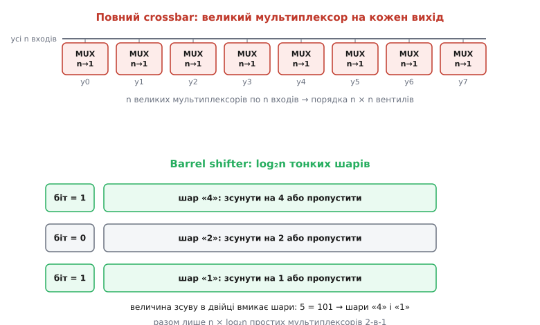
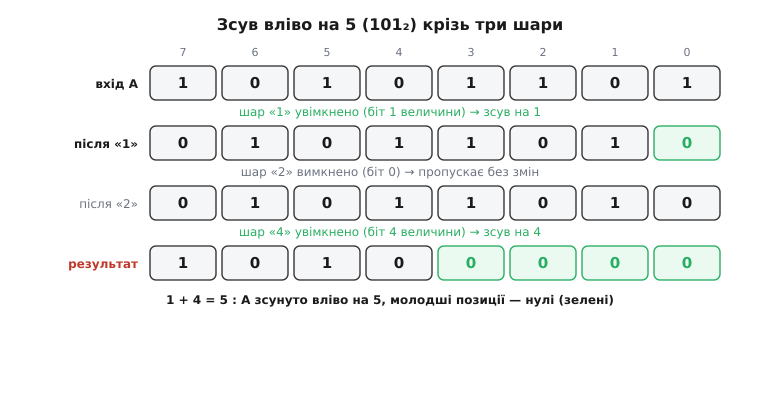
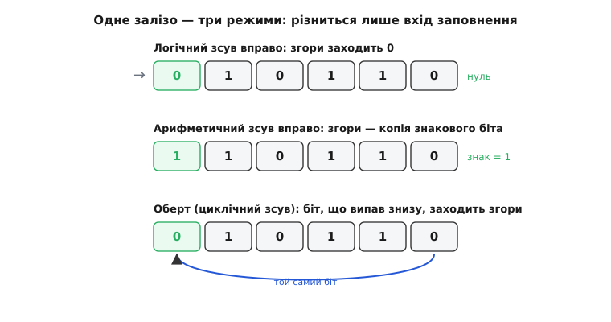

# Barrel shifter

Порахуймо просту річ: скільки коштує зсунути число. У [зсувному регістрі](topic:electronics/shift-register) біти крокують по одному щаблю за такт, тож зсув на п'ять позицій — це п'ять тактів, а на тридцять — тридцять. Для гірлянди світлодіодів це байдуже, але покладіть таку деталь у серце процесора — і кожна команда `x << 5` розтягнеться на п'ять тактів очікування, поки біти доповзуть. А зсуви в процесорі всюди: множення на степінь двійки — це зсув, поділ — зсув, доступ до біта в масиві прапорців — зсув, розбирання пакета на поля — зсув. Якщо кожен із них платить тактами за кожну позицію, машина захлинається.

Тут і потрібна схема, яка зсуває **на будь-яку кількість позицій за один крок**, скільки б їх не було — п'ять, сімнадцять чи тридцять один. Вона зветься **barrel shifter** (англ. *barrel* — бочка, циліндр; назва — від [циліндричного поворотного перемикача-«бочки»](topic:electronics/barrel-shifter/hist-barrel-name.md), як-от замок запалювання в авто, що одним поворотом обирає одне з багатьох положень). Українською її звуть *циклічний зсувач* або просто *зсувач*, але прижилася й англійська назва. Це чиста [комбінаційна схема](topic:electronics/combinational-circuits) — без тактів і пам'яті: подав на вхід число й бажаний зсув, а на виході одразу, крізь кілька шарів логіки, стоїть готовий результат.

## Спокуса «в лоб» і чому вона завелика

Найпряміша думка така. У результаті зсуву кожен вихідний біт — це просто **один із вхідних бітів**, лише вибраний за величиною зсуву. Наприклад, при зсуві вліво на 3 вихід №7 бере вхід №4, вихід №6 бере вхід №3, і так далі. А «вибрати один сигнал із багатьох за керівним числом» — це і є робота [мультиплексора](topic:electronics/multiplexer): у нього кілька входів даних, керівний код, і на вихід проходить рівно той вхід, чий номер збігся з кодом.

Отже, поставмо на **кожен** вихідний біт по великому мультиплексору, що вибирає потрібний вхід із усіх n можливих. Це працює — і зветься **повний перехресний перемикач** (англ. *crossbar*, «перехрестя»): матриця, де будь-який вхід може дійти до будь-якого виходу. Але порахуймо ціну. Для слова на n бітів треба n мультиплексорів, кожен на n входів. Мультиплексор на n входів усередині — це майже n логічних вентилів. Разом виходить порядку **n × n** вентилів: для 8 бітів терпимо, для 32 — уже понад тисяча, для 64 — чотири тисячі, і всі широкі. Такий блок жадібний до площі, а що більший вентиль-мультиплексор, то він і повільніший. Груба сила працює, але дорого.

> 🔧 **Навіщо це.** Тримайте в голові «повний crossbar» як мірило: він завжди можливий і завжди найпряміший, але росте як квадрат ширини. Щоразу, коли бачите блок «будь-що на будь-куди» — маршрутизатор шини, комутатор сигналів, зсувач, — питайте: чи справді потрібна повна матриця, чи задачу можна **розкласти** на дешевші шари? Barrel shifter — узірцевий приклад такого розкладу.

## Ключова думка: розкласти зсув на степені двійки

Уся хитрість — в одному спостереженні про числа. Будь-яку величину зсуву можна записати **двійково**, як суму степенів двійки. Зсув на 5 — це 101₂, тобто 4 + 1. Зсув на 13 — це 1101₂, тобто 8 + 4 + 1. А зсунути на суму — те саме, що зсунути послідовно на кожен доданок: зсув на 5 = спершу на 4, потім ще на 1. Порядок байдужий, результат один.

Звідси й уся будова. Замість одного велетенського мультиплексора на кожен вихід поставмо **шар за шаром**, і кожен шар відповідає за **один степінь двійки**. Перший шар уміє одне: **або** зсунути все слово рівно на 1, **або** пропустити без змін. Другий шар — **або** на 2, **або** нічого. Третій — на 4, четвертий — на 8, і так далі, подвоюючи. Керує кожним шаром **один біт** двійкового запису величини зсуву: біт увімкнений — шар зсуває на свій степінь, вимкнений — просто пропускає.

Складіть шари в стовпчик, і вони самі наберуть будь-який зсув. Хочете на 5? Двійково це 101, тобто в керівному коді ввімкнені біти «4» і «1». Шар-«1» зсуне на один, шар-«2» пропустить, шар-«4» зсуне на чотири — разом рівно п'ять. Хочете на 6 (110)? Увімкнуться шари «2» і «4»: два плюс чотири. Кожна з n можливих величин зсуву набирається своєю унікальною комбінацією ввімкнених шарів — бо кожне число має рівно один двійковий запис.

Тепер порахуймо, скільки шарів. Щоб покрити всі зсуви від 0 до n−1, потрібні степені двійки 1, 2, 4, … до n/2 — а це **log₂n** штук. Для 8 бітів — три шари (1, 2, 4). Для 32 — п'ять (1, 2, 4, 8, 16). Для 64 — шість. Ось де перемога: замість n великих мультиплексорів ми маємо **log₂n** тонких шарів. І кожен шар усередині гранично простий — про це далі.


*Два способи зсунути на довільну величину. Зверху — повний crossbar: кожен вихідний біт тягне окремий великий мультиплексор до всіх входів; блок росте як n×n. Знизу — barrel shifter: та сама задача розкладена на log₂n шарів, кожен відповідає за один степінь двійки (1, 2, 4, …) і лише вибирає «зсунути на свій степінь чи пропустити». Величина зсуву в двійковому записі просто вмикає потрібні шари: 5 = 101 → шари «4» і «1».*

## Зсередини шару: один мультиплексор 2-в-1 на біт

Придивімося до одного шару — скажімо, того, що зсуває на 4. Що він робить із кожним вихідним бітом? Рівно один вибір із двох: узяти біт, що стоїть на **тій самій** позиції входу (якщо шар вимкнено, зсуву нема), **або** взяти біт, що стоїть на 4 позиції нижче (якщо шар увімкнено, зсув на 4). Два варіанти на один вихід — це найпростіший мультиплексор, **2-в-1**: два входи даних, один керівний біт, який із двох пропустити.

Отже, кожен шар — це просто **рядок мультиплексорів 2-в-1, по одному на кожен біт слова**, і всі вони слухають **той самий** керівний біт (свій розряд величини зсуву). Уся різниця між шарами — тільки в тому, **звідки** заведено другий вхід кожного мультиплексора: у шарі-«1» він тягнеться з сусідньої позиції, у шарі-«2» — через одну, у шарі-«4» — через три. Проводка стала, зашита в схему; керує лише один біт на весь шар.

Порахуймо тепер весь блок чесно. Кожен шар — n мультиплексорів 2-в-1 (по одному на біт). Шарів — log₂n. Разом **n × log₂n** мультиплексорів. Порівняймо з crossbar: для 8 бітів було ~64 входи мультиплексорів, стало 8 × 3 = 24 простих 2-в-1. Для 32 бітів різниця ще різкіша: замість матриці на тисячу — 32 × 5 = 160. Замість квадрата — «n на логарифм»: подвоїли ширину слова — додали лише **один** шар, а не вдвічі більше заліза. Саме тому barrel shifter вкладається в бюджет навіть на широких словах, а повний crossbar лишають для вузьких.

> 🔧 **Навіщо це.** Ця будова пояснює, чому в характеристиках процесора зсув на будь-яку величину коштує стільки ж, скільки на одну позицію: сигнал просто протікає крізь log₂n шарів мультиплексорів — фіксовану, невелику глибину, незалежно від того, зсуваєте ви на 1 чи на 31. Немає циклу, немає «що більший зсув, то довше». Коли профілюєте гарячий код і бачите, що маска-зсув `(x >> k) & mask` не є вузьким місцем навіть у циклі, — це заслуга barrel shifter в АЛП.

## Прослідкуймо зсув на 5

Візьмімо восьмибітне слово й зсунемо його вліво на 5. Величина 5 у двійковому записі — 101, тобто шари вмикаються так: шар-«1» — так, шар-«2» — ні, шар-«4» — так. Проженімо біти крізь три шари й переконаймося, що вийде саме зсув на 5, а звільнені молодші позиції заповняться нулями.

**Слово A = 1010 1101 (біти пронумеровані 7…0), зсув вліво на 5 = 101₂.** Крок за кроком крізь шари:

```text
вхід:            A = 1 0 1 0 1 1 0 1        (біти 7 6 5 4 3 2 1 0)

шар «1» (біт зсуву =1, увімкнено): зсув вліво на 1, знизу заходить 0
                 = 0 1 0 1 1 0 1 0

шар «2» (біт зсуву =0, ВИМКНЕНО): пропускає без змін
                 = 0 1 0 1 1 0 1 0

шар «4» (біт зсуву =1, увімкнено): зсув вліво на 4, знизу заходять 0000
                 = 1 0 1 0 0 0 0 0

результат:       = 1 0 1 0 0 0 0 0        (це A, зсунуте вліво на 1+4 = 5)
```

Перевіримо іншим шляхом: зсунути 1010 1101 одразу на 5 — старші 5 бітів випадають, лишаються молодші 3 (101), і вони їдуть на позиції 7,6,5, а молодші п'ять позицій заповнюються нулями: 101 00000. Збіглося. Три шари, кожен — простий вибір «зсунути на свій степінь чи ні», а разом вони набрали точний зсув на п'ять за один прохід, без жодного такту.


*Зсув вліво на 5 (101₂) крізь три шари восьмибітного зсувача. Увімкнені шари «1» і «4» (бо 5 = 4 + 1), шар «2» вимкнено й він пропускає слово без змін. У кожному ввімкненому шарі на звільнені знизу позиції заходять нулі. Сумарний ефект трьох шарів — точний зсув на 5, набраний як 1 + 4.*

## Той самий блок: зсув, арифметичний зсув і оберт

Найкраще в цій будові те, що вона робить **три різні операції тим самим залізом** — змінюється лише те, **чим заповнювати** позиції, що звільняються з одного краю.

Найпростіший — **логічний зсув** (англ. *logical shift*): на звільнене місце заходять **нулі**. Це операція над бітами як над чистим візерунком, без думки про знак: зсунули вліво — молодші стали нулями, зсунули вправо — старші стали нулями.

**Арифметичний зсув вправо** (англ. *arithmetic shift*) потрібен для чисел зі знаком у [доповняльному коді](topic:electronics/twos-complement-hardware), де старший біт — знак. Якщо просто вкинути нулі згори, від'ємне число раптом стане додатним — поділ на два зіпсується. Тому при арифметичному зсуві вправо на звільнені старші позиції заходить **копія знакового біта**: у від'ємного числа згори тягнуться одиниці, у додатного — нулі. Так −8, зсунуте вправо на 1, дає −4, а не якесь велике додатне сміття. У самому зсувачі це нічого не міняє в шарах — лише те, який сигнал подано на «вхід заповнення» з краю: константний 0 чи знаковий біт слова.

**Циклічний зсув, або оберт** (англ. *rotate*): біти, що випадають з одного краю, не гинуть, а **заходять з іншого**. Слово ніби згорнуте в кільце — жоден біт не втрачається, вони просто обертаються по колу. І тут будова зсувача особливо вдячна: щоб зробити оберт, на «вхід заповнення» подають не нуль і не знак, а **ті самі біти, що випадають з протилежного боку**. Часто це роблять ще ощадніше: подають на зсувач слово, склеєне саме з собою (дві копії поряд), і тоді звичайний зсув на m автоматично дає оберт на m — біти, що «випали», уже стоять напоготові з іншого кінця. Саме звідси, до речі, й образ «бочки»: слово крутиться по колу, як барабан.


*Три операції, одне залізо — різниться лише «вхід заповнення» з краю. Логічний зсув заводить нулі. Арифметичний зсув вправо заводить копію знакового біта (у від'ємного числа — одиниці), щоб зберегти знак і правильно ділити на два. Оберт заводить біти, що випадають із протилежного краю, — слово крутиться по колу, ніщо не гине.*

## Як це виглядає в коді прошивки

У прошивці зсув пишуть одним оператором — `x << 5`, `x >> 3` — і компілятор кладе це прямо на barrel shifter процесора: одна команда, фіксований час, жодного циклу. Але щоб **відчути**, що робить залізо всередині, корисно раз написати той самий зсув **шарами** — рівно так, як його виконує схема. Ось восьмибітний зсув вліво, зібраний із трьох умовних шарів; кожен `if` — це один шар мультиплексорів, а його умова — один біт величини зсуву.

**Умова:** зсунути байт `value` вліво на `amount` (0…7), заповнюючи молодші позиції нулями, — не циклом «по одному біту», а трьома шарами, як barrel shifter.

:::tabs
```cpp
#include <stdint.h>

// Логічний зсув байта вліво на amount, зібраний ШАРАМИ (як barrel shifter).
// Кожен if — окремий шар: перевіряємо один біт величини зсуву й, якщо він
// увімкнений, зсуваємо на відповідний степінь двійки. Три шари покривають 0…7.
uint8_t barrel_shl8(uint8_t value, uint8_t amount) {
    if (amount & 1) value <<= 1;    // шар «1»: біт 0 величини → зсув на 1
    if (amount & 2) value <<= 2;    // шар «2»: біт 1 величини → зсув на 2
    if (amount & 4) value <<= 4;    // шар «4»: біт 2 величини → зсув на 4
    return value;                   // разом набирається будь-який зсув 0…7
}
```
```python
# Логічний зсув байта вліво на amount, зібраний ШАРАМИ (як barrel shifter).
# Кожен if — окремий шар: перевіряємо один біт величини зсуву й, якщо він
# увімкнений, зсуваємо на відповідний степінь двійки. Три шари покривають 0…7.
# & 0xFF на кожному кроці відсікає біти вище 7 — емуляція байта (uint8_t).
def barrel_shl8(value, amount):
    if amount & 1: value = (value << 1) & 0xFF   # шар «1»: біт 0 → зсув на 1
    if amount & 2: value = (value << 2) & 0xFF   # шар «2»: біт 1 → зсув на 2
    if amount & 4: value = (value << 4) & 0xFF   # шар «4»: біт 2 → зсув на 4
    return value                                 # будь-який зсув 0…7
```
:::

Прочитайте три рядки — це і є вся схема. Величина `amount` розкладена на біти: `amount & 1` питає «чи ввімкнено шар одиниці», `amount & 2` — шар двійки, `amount & 4` — шар четвірки. Для `amount = 5` спрацюють перший і третій `if` (бо 5 = 101), середній ні — точно ті самі шари, що ми гнали біти крізь малюнок вище. Жодного `while`, жодного лічильника: фіксовані три кроки незалежно від величини зсуву — програмне дзеркало того, чому апаратний зсув коштує стільки ж на будь-яку позицію.

А оберт тим самим прийомом виходить із двох звичайних зсувів, склеєних АБО, — біти, що випадають ліворуч, доклеюються справа:

:::tabs
```cpp
// Циклічний зсув (оберт) байта вліво на amount: те, що випало зліва,
// заходить справа. Два зсуви + АБО — компілятор теж кладе це на barrel shifter.
uint8_t rotl8(uint8_t value, uint8_t amount) {
    amount &= 7;                                   // оберт на 8 = оберт на 0
    return (uint8_t)((value << amount) | (value >> (8 - amount)));
}
```
```python
# Циклічний зсув (оберт) байта вліво на amount: те, що випало зліва,
# заходить справа. Два зсуви + АБО — компілятор теж кладе це на barrel shifter.
def rotl8(value, amount):
    amount &= 7                                    # оберт на 8 = оберт на 0
    return ((value << amount) | (value >> (8 - amount))) & 0xFF
```
:::

Одна тонкість, на якій легко спіткнутися: якщо `amount` дорівнює 0, вираз `value >> (8 - amount)` перетворюється на `value >> 8` — зсув на всю ширину типу, а це в C **невизначена поведінка**, і різні процесори дадуть різне. Тому першим рядком беремо `amount &= 7`: оберт на 8 — це те саме, що на 0, і зайвий випадок зникає. Дрібниця, але саме такі крайові випадки й ловлять у зсувах найчастіше.

> 🔧 **Навіщо це.** Коли пишете `x << k` у прошивці, ви не платите за кожну позицію — компілятор кладе це на barrel shifter, і зсув на 1 та на 31 однаково швидкі. Через це зсуви — улюблений інструмент швидкого коду: множення на степінь двійки роблять зсувом, пакування кількох полів у слово — зсувом і АБО, розбирання регістра пристрою на біти — зсувом і маскою. Знаючи, що всередині сидить log₂n шарів, ви впевнено ставите зсув на гарячий шлях, не боячись, що велика величина зсуву коштуватиме дорожче.

## Де він живе

Найголовніше місце barrel shifter — усередині [арифметико-логічного пристрою (АЛП)](topic:electronics/arithmetic-logic-unit) процесора: саме він виконує команди зсуву й оберту за один такт і бере участь у множенні (множення в стовпчик — це низка зсувів і додавань). Без нього кожна така команда тяглася б циклом, і процесор буквально гальмував би на арифметиці.

Але зсув на довільну величину потрібен не лише в АЛП. Він з'являється щоразу, коли треба **вирівняти дані**: витягти поле, що лежить не на межі байта; зсунути зчитане слово так, щоб потрібні біти стали на місце; впакувати кілька значень різної ширини в один регістр. Тому barrel shifter (чи його ідея) сидить у блоках доступу до пам'яті, у кодерах і декодерах, у графіці — усюди, де біти доводиться швидко й на будь-яку відстань пересувати з місця на місце. Скрізь це та сама думка: не ганяти біти по одному щаблю за такт, а розкласти зсув на степені двійки й пройти його наскрізь за log₂n тонких шарів.

---

**Barrel shifter** зсуває слово на **будь-яку кількість позицій за один крок**, чистою [комбінаційною логікою](topic:electronics/combinational-circuits), без тактів — на відміну від [зсувного регістра](topic:electronics/shift-register), де зсув на m коштує m тактів. Прямий шлях «повний crossbar» (окремий великий [мультиплексор](topic:electronics/multiplexer) на кожен вихід) працює, але росте як n×n. Уся хитрість — **розкласти величину зсуву на степені двійки**: поставити log₂n шарів, де кожен шар — це рядок мультиплексорів 2-в-1, що **або** зсуває все слово на свій степінь (1, 2, 4, …), **або** пропускає; двійковий запис величини зсуву просто вмикає потрібні шари (5 = 101 → шари «4» і «1»). Разом виходить n×log₂n мультиплексорів — «n на логарифм» замість квадрата, тож ширше слово коштує лише один зайвий шар. Той самий блок робить логічний зсув (заводить нулі), арифметичний зсув вправо (заводить знаковий біт) і оберт (заводить біти, що випали з іншого краю) — різниця лише в тому, чим заповнювати край. У прошивці `x << k` компілятор кладе на цей блок: фіксований час незалежно від величини зсуву — тому зсуви й стали улюбленим інструментом швидкого коду. Живе barrel shifter насамперед в [АЛП](topic:electronics/arithmetic-logic-unit) процесора та скрізь, де дані треба швидко вирівнювати.

---
