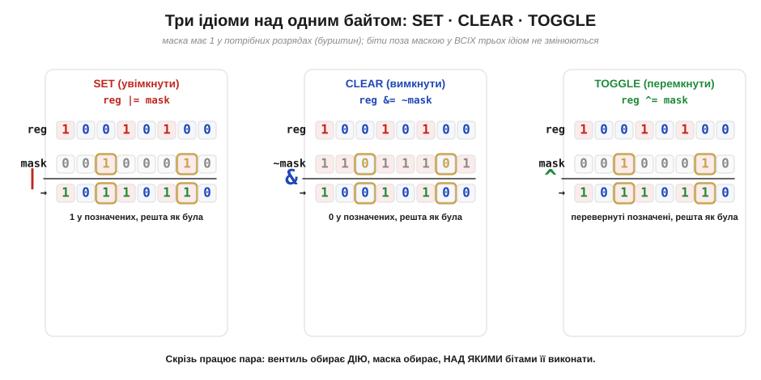
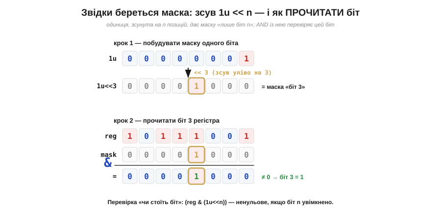

# ⚙️ Бітові операції в C: маски, set/clear/toggle — вентилі у вашому коді

> Алгоритмічна вставка про [базові вентилі AND, OR, NOT](book:electronics/basic-gates). Там вентиль — залізний елемент на платі. Тут виявиться, що той самий AND, OR, NOT і XOR живуть і у звичайному коді на C — як оператори `&`, `|`, `~`, `^`. Пишучи `reg |= mask`, ви буквально пускаєте сигнали крізь вентилі, тільки не в кремнії, а над числом у пам'яті.

## Задача

Дуже часто кілька логічно різних прапорців пакують в **один** байт чи слово: біт 0 — «світлодіод увімкнено», біт 3 — «давач відкалібровано», біт 7 — «сталася помилка». Так роблять і програмісти у власних структурах, і самі мікросхеми: керування периферією — це майже завжди окремі **біти** в спільному регістрі. Постає конкретне завдання: змінити **рівно один** біт (чи кілька названих), **не зачепивши** сусідів у тому ж слові. Прочитати весь байт, перезаписати його цілком — не вихід: затреш чужі прапорці. Потрібен інструмент, що дотягується точно до потрібного розряду. Цей інструмент — **бітові операції** (*bitwise operations*).

## Ідея

Ключова думка проста: оператори `&`, `|`, `^`, `~` у C — це **ті самі [логічні вентилі](book:electronics/basic-gates)**, прикладені до кожного розряду слова **незалежно й воднораз**. `a & b` ставить AND між нульовим бітом `a` і нульовим бітом `b`, між першим і першим, і так усі вісім (чи 32) — як цілий ряд однакових вентилів, що працюють паралельно. Те, що в кремнії було б шеренгою фізичних елементів, у коді вкладається в одну машинну інструкцію.


*Чотири бітові оператори C і відповідні їм вентилі. `&` (AND), `|` (OR), `^` ([XOR](book:electronics/xor-comparison)), `~` (NOT — єдиний унарний, працює з одним операндом). Кожен стовпчик рахується сам по собі за таблицею істинності свого вентиля; вісім розрядів обробляються одним махом. Зверніть увагу на «характер» кожного: AND **стирає**, OR **вмикає**, XOR **перемикає**, NOT перевертає геть усе.*

Самих вентилів, однак, замало — треба ще **вибрати**, над якими саме бітами діяти. Цю роль грає **маска** (*mask*): допоміжне число, у якому одиниці стоять там, де ми хочемо щось зробити, а нулі — там, де чіпати не можна. Маска плюс правильний вентиль і дають точкову зміну.

## Псевдокод: чотири ідіоми

Комбінація «вентиль + маска» зводиться до кількох сталих ідіом, які варто знати напам'ять. Хай `mask` має одиниці лише в потрібних розрядах:

:::tabs
```cpp
set:    reg |= mask;       // увімкнути названі біти (OR)
clear:  reg &= ~mask;      // вимкнути названі біти (AND з інверсією маски)
toggle: reg ^= mask;       // перемкнути названі біти (XOR)
test:   (reg & mask) != 0  // чи увімкнено хоч один названий біт (AND)
```
```python
set:    reg |= mask         # увімкнути названі біти (OR)
clear:  reg &= ~mask        # вимкнути названі біти (AND з інверсією маски)
toggle: reg ^= mask         # перемкнути названі біти (XOR)
test:   (reg & mask) != 0   # чи увімкнено хоч один названий біт (AND)
```
:::

Чому саме так — випливає прямо з [таблиць істинності](book:math/boolean-algebra). **Увімкнути** (set): `x | 1 = 1` завжди, а `x | 0 = x` — отже OR із маскою піднімає позначені біти в 1, а решту лишає як були. **Вимкнути** (clear): `x & 0 = 0`, а `x & 1 = x` — тож AND обнуляє там, де в масці нуль; саме тому маску спершу **інвертують** (`~mask`), щоб нулі опинилися навпроти потрібних бітів. **Перемкнути** (toggle): `x ^ 1 = x̄`, `x ^ 0 = x` — XOR перевертає позначені, не торкаючись інших (це той самий [«керований інвертор»](book:electronics/xor-comparison)). **Перевірити** (test): AND із маскою гасить усе, крім цікавого біта, тож ненульовий результат означає «біт стоїть».


*Один і той самий байт під трьома ідіомами з маскою на біти 2 і 6. Скрізь біти поза маскою (не позначені бурштином) лишаються **недоторканими** — у цьому вся суть. Пара працює так: **вентиль** обирає дію (увімкнути / вимкнути / перемкнути), а **маска** — над якими розрядами її виконати.*

Лишається питання: звідки беруть саму маску? Найчастіше — **зсувом**. Вираз `1u << n` бере одиницю й пересуває її на `n` позицій уліво, даючи число «лише біт `n`». Так `1u << 3` — це маска восьмого розряду (рахуючи з нуля), `(1u << 3) | (1u << 6)` — маска двох розрядів одразу. Зсуви `<<` і `>>` — окремі бітові оператори: вони не комбінують біти вентилем, а **пересувають** усе слово, докладаючи нулі з краю.


*Маска одного біта народжується зсувом `1u << 3`, а перевірка `reg & (1u << 3)` гасить усе, крім третього розряду: ненульовий результат — біт стоїть, нуль — ні. Так із простого зсуву й AND виходить «прочитати один біт».*

> 🔧 **Навіщо це.** Це не академічна вправа, а щоденна мова роботи з залізом. Будь-яке керування периферією мікроконтролера — увімкнути вивід, дозволити переривання, скинути прапорець — це `reg |= …` чи `reg &= ~…` над регістром. Уміючи читати ці ідіоми, ви читаєте чужий драйвер; уміючи писати — точково керуєте бітами, не псуючи сусідніх налаштувань. [Вентилі](book:electronics/basic-gates) з абстракції стають інструментом у пальцях.

## 📜 Звідки в C ці оператори — і чому в них «неправильний» пріоритет

Цікаво, що бітові оператори старші за саму мову C. Вони прийшли довгим спадком: мова **BCPL** (Мартін Річардс — *Martin Richards*, Кембридж, 1967), з неї — мова **B** (Кен Томпсон і Денніс Рітчі — *Ken Thompson*, *Dennis Ritchie*, Bell Labs, близько 1969), а вже з B виросла **C** (Рітчі, початок 1970-х). Це не винахід однієї людини, а усталений набір, відшліфований поколіннями системних мов під реальне залізо PDP.

З цього спадку тягнеться славетна **вада**, через яку й сьогодні спотикаються початківці. У ранній C **не було** окремих логічних `&&` і `||` — їхню роль грали `&` і `|`, чий зміст залежав від місця: в умові `if`/`while` — як логічний, у звичайному виразі — як бітовий. Сам Рітчі згадував, що такий поділ за контекстом «працював незле, але важко пояснювався». На наполягання Алана Снайдера (*Alan Snyder*) до мови додали справжні `&&` і `||`. Та коли постало питання **пріоритету**, Рітчі не наважився підняти `&` і `|` вище за `==`: уже існували купи коду на кшталт `if (a==b & c==d)`, і зміна старшинства тихо зламала б їх усі. Тож пріоритет лишили низьким — і `&`, `^`, `|` донині стоять **нижче** за `==` та `!=`. Тому `x & 1 == 0` означає підступне `x & (1 == 0)`, а не очікуване `(x & 1) == 0`. Брайан Керніган і Денніс Рітчі чесно визнали це у своїй книжці словами «деякі оператори мають неправильний пріоритет». Висновок прямий: бітові підвирази в порівняннях **завжди беріть у дужки**.

## Складність і пастки на МК

Операції тривіальні за вартістю — одна машинна інструкція, **O(1)** на слово. Уся складність — у пастках, кожна з яких спокійно компілюється, а потім дає тихий баг:

- **Пріоритет (та сама вада з історії).** `reg & MASK == 0` — це `reg & (MASK == 0)`. Беріть бітові підвирази в дужки: `(reg & MASK) == 0`.
- **Зсув знакового числа.** `1 << 31` для 32-бітного `int` — це зсув у знаковий біт, **невизначена поведінка** (*undefined behavior*) за стандартом C. Лік: робіть літерал беззнаковим — `1u << 31` (а для ширших масок `1ul`/`1ull`). Узагалі для прапорців тримайте беззнакові типи (`uint32_t`).
- **Ширина літерала.** `1u` — це лише `unsigned int`. Якщо регістр 64-бітний, `1u << 40` переповнюється й дає 0. Беріть тип під ширину: `1ull << 40`.
- **Цілочислове підвищення.** Над `uint8_t` оператори рахуються не у 8, а в `int` (правило *integer promotion*). Тому `~mask` для `uint8_t mask` дає 32-бітне число з одиницями у старших розрядах — і `x &= ~mask` може зачепити те, чого ви не бачите. Маскуйте назад (`x &= (uint8_t)~mask`) або працюйте у тій ширині, у якій і думаєте.
- **Читання-зміна-запис над «живим» регістром не атомарне.** `reg |= mask` — це насправді три кроки: прочитати, змінити, записати. Якщо між ними втрутиться інший код, що теж пише в той самий регістр, його правка загубиться. Для апаратних регістрів, які може міняти ще хтось, потрібен `volatile`, щоб компілятор не «кешував» значення; а захист самої трійки кроків — то вже окрема тема поза цією вставкою.

## Підсумок

Бітові операції — це [вентилі](book:electronics/basic-gates), що оселилися у вашому коді: `&` (AND), `|` (OR), `^` (XOR), `~` (NOT) діють на кожен розряд слова паралельно, а **маска** (часто `1u << n`) каже, над якими розрядами. Звідси чотири ідіоми: **set** `|= mask`, **clear** `&= ~mask`, **toggle** `^= mask`, **test** `& mask`. Усе це коштує одну інструкцію, тож пастки — не у швидкості, а в дрібницях C: низький пріоритет бітових операторів (давня вада мови — дужки!), невизначений зсув знакового числа (`1u`), ширина літерала й цілочислове підвищення. Опанувавши їх, ви керуєте бітами регістра точково — і читаєте [логіку вентилів](book:electronics/basic-gates) прямо в коді, не торкаючись паяльника.
