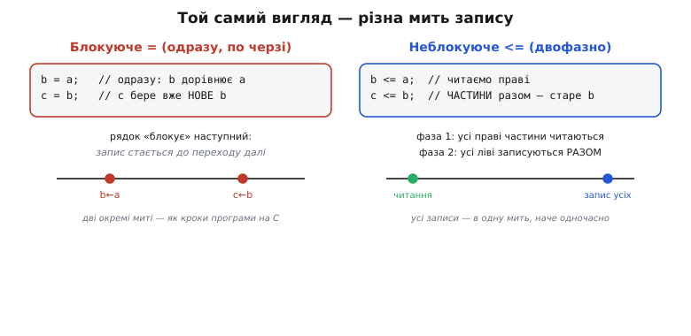
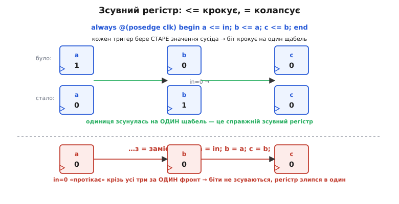
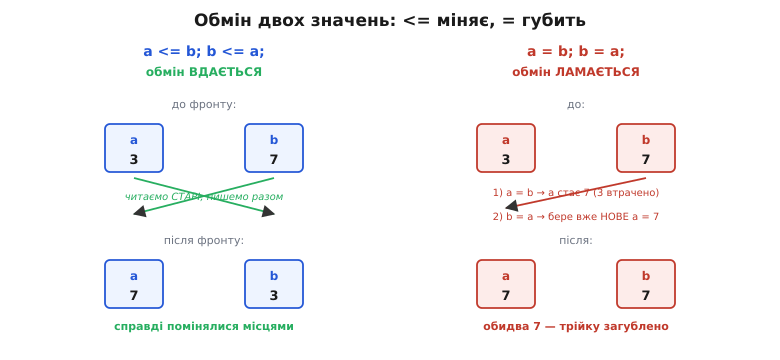

# Блокуючі й неблокуючі присвоєння

У [мові опису апаратури](topic:electronics/hdl) Verilog є два оператори присвоєння, майже неможливо схожі на око: звичайне `=` і трохи довше `<=`. Різниця — один знак, а наслідки — колосальні: та сама на вигляд стрічка коду з `=` і з `<=` описує **фізично різне залізо** й веде себе протилежно. Це найпідступніша пастка Verilog: новачок ставить `=`, «бо так у C», його схема «синтезується» без єдиної скарги — і поводиться загадково, губить дані, розсипає зсувний регістр. Розберімо, **чому** ці два оператори означають різні речі, коли який брати, — і побачимо, що за химерним `<=` стоїть проста фізична правда про те, як працює справжня цифрова схема.

Почнімо з самих назв. **Блокуюче** присвоєння (англ. *blocking*, «те, що загороджує дорогу») — це `=`: воно **блокує** виконання наступного рядка, доки не завершиться саме. **Неблокуюче** (англ. *non-blocking*, «те, що не загороджує») — це `<=`: воно наступний рядок **не затримує**, а лишень планує свій запис на потім. За цими сухими словами ховається вся суть, і зараз ми її розкриємо.

### Одна мить проти двох фаз

Щоб зрозуміти обидва оператори, треба уявити, що діється всередині одного [фронту такту](topic:electronics/edge-vs-level) — тієї миті, коли синхронна схема оновлюється. Блокуюче й неблокуюче присвоєння по-різному відповідають на питання «**коли** записується ліва частина».

**Блокуюче `=` працює точно як присвоєння в C.** Коли доходить черга до рядка `b = a;`, значення `a` **негайно** кладеться в `b`, і лише **після цього** керування йде на наступний рядок. Тому наступний рядок бачить уже **оновлене** `b`. Присвоєння відбуваються **по черзі**, одне за одним, кожне встигає до наступного — рівно як кроки програми.

**Неблокуюче `<=` розбиває такт на дві фази.** Спершу — **фаза читання**: усі праві частини всіх `<=` в блоці обчислюються, беручи **старі** значення, ті що були до фронту. Ці обчислені значення відкладаються вбік. І аж тоді — **фаза запису**: усі ліві частини оновлюються **разом**, наче в одну спільну мить. Ключове: під час читання жодна ліва частина ще не змінена, тому кожне `<=` бачить сусідів **такими, якими вони були на початку такту**, а не такими, якими вони стануть.


*Блокуюче `=` записує ліву частину одразу й лише тоді йде далі — друге присвоєння вже бачить нове значення першого, як два кроки програми на C. Неблокуюче `<=` спочатку обчислює всі праві частини зі старих значень, а потім записує всі ліві разом, в одну мить. Той самий вигляд коду — інша мить запису, і звідси вся різниця в поведінці.*

Ось і весь механізм. Уся плутанина з `=` та `<=` розсипається, щойно тримаєш у голові цю картинку: `=` пише **зараз і по черзі**; `<=` читає все **зараз**, а пише все **потім і разом**. З цієї маленької різниці виростають геть протилежні схеми — та перш ніж дивитися на них, варто спитати найважливіше: **навіщо** взагалі знадобилося друге, чудне присвоєння, якщо є звичне `=`?

### Навіщо `<=`: тригери клацають одночасно

Відповідь ховається у фізиці справжнього заліза. Візьмімо [D-тригер](topic:electronics/d-flip-flop) — основну комірку пам'яті цифрової техніки. На фронті такту він робить одну просту річ: **захоплює** те, що стоїть на його вході D, і виставляє це на вихід Q. А тепер уявімо кілька тригерів, з'єднаних ланцюжком: вихід одного йде на вхід наступного. Що станеться на фронті?

Усі тригери клацають **одночасно, від одного фронту**. Кожен захоплює те, що було на його вході **за мить до фронту** — тобто **старе** значення виходу сусіда. Другий тригер не бачить нове значення першого, бо перший ще не встиг його виставити: обидва спрацьовують в один і той самий момент. Це не домовленість, а сама природа синхронної схеми — фронт приходить до всіх разом, і всі захоплюють стан, який був **перед** фронтом.

> 🔧 **Навіщо це.** Саме тому `<=` існує й саме тому воно — правильний вибір для всього, що описує тригери. Двофазність неблокуючого присвоєння — «прочитати всі старі значення, потім записати всі нові» — це **точна модель** того, як банк тригерів клацає від спільного фронту. Пишете `<=` — і симулятор поводиться рівно так, як поводитиметься залізо: кожен регістр на фронті бере старий стан сусідів, а не той, що народжується цієї ж миті. Пишете `=` там, де мали бути тригери, — і симуляція «протікає» крізь ланцюг за один фронт, показуючи поведінку, якої в залізі не буде. `<=` не примха мови, а спосіб змусити текст поводитися як реальна синхронна схема.

Отже, `<=` — це **штучний, але точний** відбиток фізики: він змушує опис поводитися як банк тригерів, що всі клацають від одного фронту. Найяскравіше це видно на зсувному регістрі — там різниця між `=` і `<=` перетворюється з абстракції на «працює / не працює».

### Зсувний регістр: `<=` крокує, `=` колапсує

[Зсувний регістр](topic:electronics/shift-register) — ланцюжок тригерів, де на кожен фронт біти дружно роблять крок уперед: вміст першого переходить у другий, другого — у третій, і так далі. Опишімо три такі тригери й подивимось, що дає кожен оператор.

**Умова.** Три тригери `a`, `b`, `c` з'єднані в ланцюг. На фронті вміст має зсунутися: у `c` заходить старе `b`, у `b` — старе `a`, у `a` — новий вхід `in`. Хай на початку `a=1`, `b=0`, `c=0`, а `in=0`.

З неблокуючим присвоєнням опис прямий:

```verilog
always @(posedge clk) begin
    c <= b;      // праві частини читають СТАРІ значення
    b <= a;      // (порядок цих рядків уже не важить)
    a <= in;
end
```

Розгорнімо фазу за фазою. **Фаза читання** бере старі значення: права частина `c <= b` дає 0 (старе `b`), `b <= a` дає 1 (старе `a`), `a <= in` дає 0. **Фаза запису** кладе їх разом: `c=0`, `b=1`, `a=0`. Одиниця, що сиділа в `a`, чисто перейшла в `b` — рівно на **один** щабель. Це і є зсув.


*З `<=` кожен тригер на фронті захоплює старе значення сусіда, тож біт крокує рівно на один щабель — це справжній зсувний регістр. З `=` присвоєння виконуються по черзі: `a` бере вхід, потім `b` бере вже нове `a`, потім `c` бере вже нове `b`, і вхід «протікає» крізь усі три за один фронт. Замість зсуву — колапс: усі три тримають те саме, регістр перетворюється на один тригер.*

Тепер спробуймо той самий намір із блокуючим `=`, як спокушає написати звичка з C, і в тому самому «природному» порядку зверху вниз:

```verilog
always @(posedge clk) begin
    a = in;      // a одразу стає 0
    b = a;       // b бере ВЖЕ нове a = 0 (а не старе a = 1!)
    c = b;       // c бере вже нове b = 0
end
```

Ланцюжок наслідків руйнівний. Спершу `a` **негайно** стає 0. Наступний рядок `b = a` бачить уже **оновлене** `a`, тобто 0, — і губить стару одиницю, що мала перейти в `b`. Далі `c = b` бачить нове `b`, знову 0. Підсумок: `a=0`, `b=0`, `c=0` — вхід `in` **протік** крізь усі три тригери за **один** фронт, замість крокувати щотакту. Зсувний регістр перестав бути регістром: три тригери злиплися в один, бо блокуюче присвоєння пропустило значення наскрізь.

> 🔧 **Навіщо це.** Це не надуманий приклад — це **найчастіша** причина, чому «правильний на вигляд» код на FPGA поводиться дико. Зсувні регістри стоять усюди: сериалізатори й десериалізатори даних, лінії затримки, обчислювальні конвеєри, синхронізатори між [тактовими доменами](topic:electronics/clock-domain-crossing). Скрізь, де дані мають крокувати по тактах, працює саме той механізм «кожен бере старе значення сусіда». Поставив `=` замість `<=` — і замість акуратного зсуву дані стрибають на кілька щаблів за фронт або зникають. Правило просте: **описуєш тригери — пиши `<=`**, і ланцюг крокуватиме так, як має.

Зсувний регістр показав пастку в динаміці. Та є ще чистіший приклад, де різниця видно з однієї пари рядків, — обмін двох значень.

### Обмін місцями: `<=` міняє, `=` губить

Класична задача: поміняти вміст двох регістрів місцями. У звичайному програмуванні для цього потрібна третя, тимчасова змінна — інакше, переписавши перше, ми затираємо його старе значення, і другому вже нема звідки взяти. Неблокуюче присвоєння цю проблему знімає **само собою**, і в цьому його краса.

**Умова.** Два регістри: `a=3`, `b=7`. Треба, щоб після фронту стало `a=7`, `b=3`.

```verilog
always @(posedge clk) begin
    a <= b;      // права частина = старе b = 7
    b <= a;      // права частина = старе a = 3
end
```

Обидві праві частини читаються в фазу читання, зі **старих** значень: `a <= b` бере 7, `b <= a` бере 3. Потім разом записуються: `a=7`, `b=3`. Обмін вдався, і **жодної тимчасової змінної** не знадобилося — двофазність `<=` сама зіграла роль «буфера», в якому старі значення дочекалися запису.


*З `<=` обидві праві частини беруть старі значення (7 і 3) ще до будь-якого запису, а потім оновлюються разом — регістри чисто міняються місцями. З `=` перший рядок одразу робить `a=7`, безповоротно затираючи трійку; другий рядок `b=a` бере вже нове `a=7`, і обидва регістри лишаються з сімкою. Той самий намір — протилежний результат.*

А з блокуючим `=` та сама пара рядків обмін **зламає**:

```verilog
always @(posedge clk) begin
    a = b;       // a одразу стає 7 — стару трійку втрачено назавжди
    b = a;       // b бере вже нове a = 7, а не стару трійку
end
```

Перший рядок негайно робить `a=7`, і стара трійка зникає без сліду. Другий рядок хоче покласти в `b` старе `a` — але старого `a` вже немає, є нове 7. Підсумок: `a=7`, `b=7`. Обидва регістри тримають сімку, трійка загублена. Щоб полагодити обмін через `=`, довелося б заводити третю змінну — рівно як у C. Неблокуюче ж присвоєння дає обмін **задарма**, бо його природа — прочитати все старе, перш ніж писати нове.

### Золоті правила: коли `=`, а коли `<=`

З усього вище випливає проста, залізна дисципліна, якої дотримується кожен інженер Verilog. Вона тримається на поділі логіки на два роди: [комбінаційну](topic:electronics/basic-gates) (без пам'яті, миттєва) і [реєстрову](topic:electronics/state-memory) (з тригерами, по такту).

**Правило перше: реєстрову логіку описуй неблокуючим `<=`.** Усе, що всередині `always @(posedge clk)` і має стати тригером, пиши через `<=`. Тоді симуляція точно повторить залізо: усі регістри на фронті беруть старі значення й оновлюються разом, зсуви крокують, обміни міняють, а не гублять.

**Правило друге: комбінаційну логіку описуй блокуючим `=`.** Коли ти описуєш миттєву логіку без пам'яті — вентилі, [мультиплексор](topic:electronics/basic-gates), проміжні обчислення, які мають з'явитися «зараз же», — усередині комбінаційного блоку пиши `=`. Тут потрібне саме послідовне, крок-за-кроком обчислення, де кожен наступний рядок бачить результат попереднього; неблокуюче тут лише заплутало б і сповільнило симуляцію.

**Правило третє, найважливіше: не змішуй `=` і `<=` в одному блоці.** Один `always`-блок — один рід логіки й один оператор. Мішанина породжує код, який поводиться по-різному в симуляторі й у залізі, дає **гонки** (англ. *race condition* — ситуацію, де результат залежить від непередбачуваного порядку двох одночасних дій) і майже гарантовано веде до багів, які тижнями шукають. Розділив: реєстрове — окремим блоком на `<=`, комбінаційне — окремим на `=`, — і жодних несподіванок.

> 🔧 **Навіщо це.** Ці три правила — не «стиль», а перепустка до передбачуваної схеми. Проблема неправильного вибору в тому, що синтезатор **не сваритиметься**: код із `=` там, де мали бути `<=`, чудово збереться й дасть якесь залізо — просто не те, що ти уявляв, і часто таке, що інакше поводиться в симуляції та в кремнії. Такі баги не ловляться компілятором, лише спостереженням дивної поведінки на реальній платі, і коштують найдорожче. Тому досвідчений розробник не роздумує щоразу — у нього рефлекс: **під такт — `<=`, без такту — `=`, в одному блоці не мішати**. Це один із перших рефлексів, що варто виробити, беручись за Verilog.

Уся ця історія зводиться до однієї думки, яку варто винести й тримати: два майже однакові оператори описують **різні речі в часі**. Блокуюче `=` — це «зроби зараз і йди далі», послідовність кроків, як у звичайній програмі; воно пасує миттєвій комбінаційній логіці. Неблокуюче `<=` — це «прочитай усе старе, потім запиши все нове разом», двофазний ритм, що точно відбиває, як банк тригерів клацає від спільного [фронту такту](topic:electronics/edge-vs-level); воно пасує реєстровій логіці. Плутати їх — значить описувати не те залізо, яке маєш на думці. Хто засвоїв цю різницю, робить перший великий крок від «писати код» до «проєктувати схему», якого й вимагає опис апаратури.

> 📜 **Загляньте у вставку:** [Звідки взявся оператор `<=`](topic:electronics/blocking-nonblocking/hist-nonblocking-origin.md) — як у маленькій фірмі Gateway Design Automation народилася сама ідея двофазного присвоєння й чому мова опису заліза потребувала оператора, якого немає в жодній звичайній мові програмування.

> ⚙️ **Загляньте у вставку:** [Конвеєр і серіалізатор на практиці](topic:electronics/blocking-nonblocking/proj-pipeline-serializer.md) — робочі модулі Verilog, де правильний вибір `=`/`<=` вирішує, чи працюватиме схема: багатоступеневий конвеєр обчислень і послідовний передавач даних, з розбором типових помилок і того, як їх видно в симуляції.
