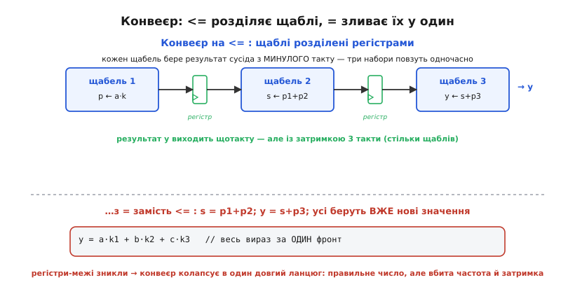

# ⚙️ Конвеєр і серіалізатор: два модулі, де вибір `=`/`<=` вирішує все

Правило «під такт — `<=`» легко вивчити напам'ять і так само легко зрадити в перший же робочий день, коли рука за звичкою з C виводить `=`. Тому візьмімо не іграшкові пари рядків, а два **справжні** модулі Verilog, які інженер пише щотижня: багатоступеневий обчислювальний конвеєр і послідовний передавач даних. У кожному з них той самий текст із `=` замість `<=` дає **фізично іншу схему** — і, що найпідступніше, синтезатор мовчить, а різницю видно аж на хвилях симулятора або, ще гірше, лише на реальній платі. Розберімо обидва до останнього такту: задача → ідея → робочий код → де саме `=` ламає схему й **як цю поломку впізнати за хвилею**.

Наскрізна нитка обох прикладів одна: щоразу, коли значення має **пережити фронт такту** — доїхати до наступного щабля, зачекати наступного біта, — це значення живе в тригері, а тригер описують неблокуючим `<=`. Поставив `=` — і значення не переживає фронт, а «протікає» крізь усю логіку в ту саму мить, ніби її й не було. Обидва модулі показують ту саму поломку з двох різних боків, і після них рефлекс «під такт — `<=`» перестає бути завченим правилом і стає зрозумілою фізикою.

## Приклад перший: обчислювальний конвеєр

### Задача

Треба порахувати трохи важчий вираз, ніж влазить в один такт. Візьмімо конкретну, дуже частку в обробці сигналів дію: зважену суму трьох відліків

```
y = (a·k1 + b·k2 + c·k3)
```

— серце будь-якого [цифрового фільтра](topic:electronics/active-filters). Якби ми спробували порахувати все це «за один фронт» — три множення й два додавання поспіль, — комбінаційний ланцюг вийшов би **довгий**: сигнал мусив би пройти крізь три помножувачі й суматор, перш ніж защіпнутися в тригер. Довгий ланцюг = велика затримка = низька гранична частота такту. Схема працюватиме, але повільно, бо такт доведеться розтягнути під найдовший шлях.

Конвеєр (англ. *pipeline*, «трубопровід») ламає цей довгий шлях на короткі ділянки, між якими стоять **регістри-засувки**. Ідея та сама, що на складальній лінії: замість одного робітника, який робить усю деталь від початку до кінця, ставимо кількох, кожен робить свій маленький крок і **передає** заготовку далі. Такт можна пришвидшити, бо тепер він мусить укластися лише в **один** крок, а не в увесь вираз. Ціна — **затримка** (англ. *latency*): перший результат вийде не одразу, а через стільки тактів, скільки щаблів; зате **потім** результати сиплються щотакту, без пауз.

Розіб'ємо наш вираз на три щаблі так, щоб кожен робив рівно один короткий шматок роботи:

```
щабель 1:  p1 = a·k1        (три множення паралельно)
           p2 = b·k2
           p3 = c·k3
щабель 2:  s  = p1 + p2      (перше додавання)
щабель 3:  y  = s  + p3      (друге додавання, готовий результат)
```

Між щаблями — регістри: результат щабля 1 защіпається й **чекає** наступного такту, аж тоді його бере щабель 2. Уся суть конвеєра в тому, що ці проміжні значення `p1, p2, p3, s` мусять **пережити фронт** — доїхати від свого щабля до наступного. А все, що переживає фронт, — це тригер, і описується він `<=`.

> 🔧 **Навіщо це.** Конвеєр — не академічна вправа, а спосіб, яким усередині ПЛІС і процесорів рахують швидко: [фільтри](topic:electronics/active-filters), помножувачі-накопичувачі (MAC), графічні й криптографічні тракти — усе конвеєризоване, бо інакше такт довелося б сповільнити під найдовший ланцюг логіки. Регістри між щаблями — саме те, що дозволяє тримати високу частоту при складному обчисленні. І саме тут `=` замість `<=` б'є найболючіше: він **прибирає** ці регістри як межі в часі, зливаючи щаблі в один, — схема ніби працює, але вся вигода конвеєра зникає, а часто разом із нею й правильність.

### Робочий код: конвеєр на `<=`

Ось повний, синтезовний модуль. Кожен щабель — свій набір регістрів, усі оновлюються неблокуючим присвоєнням, тож на кожному фронті кожен щабель бере **готовий із минулого такту** результат попереднього щабля, а не той, що народжується цієї ж миті.

```verilog
module mac3 #(
    parameter W = 16                 // розрядність відліків
)(
    input                    clk,
    input      signed [W-1:0] a, b, c,        // три вхідні відліки
    input      signed [W-1:0] k1, k2, k3,     // три коефіцієнти
    output reg signed [2*W:0] y               // результат (з запасом на суму)
);
    // щабель 1: три добутки, защіпнуті в регістри
    reg signed [2*W-1:0] p1, p2, p3;
    // щабель 2: перша часткова сума
    reg signed [2*W:0]   s;

    always @(posedge clk) begin
        // щабель 1 — множення
        p1 <= a * k1;
        p2 <= b * k2;
        p3 <= c * k3;
        // щабель 2 — бере p1, p2 З МИНУЛОГО такту
        s  <= p1 + p2;
        // щабель 3 — бере s і p3 З МИНУЛОГО такту
        y  <= s + p3;
    end
endmodule
```

Прочитаймо, що діється на одному фронті, бо саме тут ховається вся краса неблокуючого присвоєння. Коли приходить фронт, **фаза читання** обчислює всі праві частини зі **старих** значень: `p1 <= a*k1` бере свіжі входи, але `s <= p1 + p2` бере `p1` і `p2` **такими, якими вони були до фронту** — тобто добутки, защіпнуті **минулого** такту. Так само `y <= s + p3` бере старе `s` і старе `p3`. Аж тоді **фаза запису** оновлює всі регістри разом. Результат: дані рухаються рівно на **один щабель за такт**, як заготовка на конвеєрі. Те, що `s` бере «вчорашні» `p1, p2`, — не помилка, а **сама суть**: щабель 2 і має працювати з тим, що щабель 1 приготував **на минулому такті**, бо цього такту щабель 1 уже меле **наступний** набір входів.

Простежмо один набір даних крізь труб. Хай на такті 0 на входи стало `a, b, c`, а далі входи міняються щотакту (заходять нові набори). Ось як конкретний перший набір повзе щаблями:

```
такт 0:  входи a,b,c зайшли; p1,p2,p3 ще старі (сміття/нулі)
такт 1:  p1=a·k1, p2=b·k2, p3=c·k3   ← щабель 1 порахував НАШ набір
такт 2:  s = p1+p2                    ← щабель 2 склав наші добутки
такт 3:  y = s + p3                   ← щабель 3 видав НАШ результат
```

Три такти від входу до виходу — це затримка конвеєра. Але зверни увагу: доки **наш** набір повзе від щабля до щабля, за ним **слідом** ідуть наступні набори, кожен на щабель позаду. На такті 3 щабель 3 видає результат набору, що зайшов на такті 0; щабель 2 у цю ж мить обробляє набір із такту 1; щабель 1 меле набір із такту 2. **Усі три щаблі зайняті одночасно, різними наборами** — оце і є пропускність конвеєра: після початкового наповнення на кожен фронт виходить один готовий `y`.


*Угорі — конвеєр на `<=`: на кожному фронті щабель бере готовий результат сусіда з минулого такту, тож три набори даних одночасно повзуть трьома щаблями, а `y` виходить щотакту (після затримки в три такти). Регістри `p1,p2,p3,s` — це межі в часі, що тримають щаблі окремими. Унизу — той самий текст на `=`: присвоєння виконуються по черзі в одну мить, `s` бере вже нове `p1`, `y` бере вже нове `s`, і весь вираз «протікає» крізь усі три множення й два додавання за **один** фронт — конвеєр колапсує в один довгий комбінаційний ланцюг, регістри-межі зникають.*

### Як `=` ламає конвеєр

Тепер напишімо той самий модуль звичкою з C — блокуючим `=`, у тому самому «природному» порядку зверху вниз:

```verilog
    always @(posedge clk) begin
        p1 = a * k1;
        p2 = b * k2;
        p3 = c * k3;
        s  = p1 + p2;    // p1, p2 — ВЖЕ нові, щойно пораховані цього ж фронту
        y  = s + p3;     // s — вже нове, p3 — вже нове
    end
```

Ланцюг наслідків руйнує весь задум. Блокуюче `=` виконує рядки **по черзі**, і кожен наступний бачить уже **оновлені** значення. Спершу `p1, p2, p3` негайно стають свіжими добутками поточних входів. Далі `s = p1 + p2` бере вже **нові** `p1, p2` — не ті, що защіпнулися минулого такту, а щойно пораховані **цього** фронту. Потім `y = s + p3` бере вже нове `s` і нове `p3`. Підсумок: увесь вираз `a·k1 + b·k2 + c·k3` порахувався **за один фронт**, від входів до `y`, — і проміжні регістри `p1, p2, p3, s` перестали бути **межами в часі**. Синтезатор бачить, що їхнє значення обчислюється й одразу ж споживається в тому самому такті, тож він їх **прибирає** (або вироджує в прості дроти), і на місці трьох щаблів лишається один довгий комбінаційний ланцюг: три помножувачі й два суматори послідовно, а тоді єдина защіпка в `y`.

Це і є колапс конвеєра. Схема **порахує правильну суму** — але за один такт довгим ланцюгом, тобто рівно те повільне залізо, від якого ми конвеєром тікали. Уся вигода — висока частота такту — зникла. Гірше: якщо ти розраховував тайминг на короткий щабель, а отримав довгий наскрізний ланцюг, схема **не встигне** за такт і почне давати збої на швидкості, які годі відтворити на столі.

Є й підступніший бік. Якщо переставити рядки — скажімо, поставити `s = p1 + p2` **перед** тим, як переприсвоєно `p1` (у складнішому блоці зі зворотними зв'язками таке трапляється), — результат зміниться, бо тепер `s` візьме старе `p1`. Тобто з `=` **порядок рядків впливає на схему**, і найменша перестановка тихо міняє поведінку. З `<=` порядок рядків байдужий: усі праві частини читаються зі старих значень **одночасно**, тож рядки можна писати в будь-якому зручному порядку. Ця байдужість до порядку — теж прямий відбиток фізики: банк тригерів клацає від одного фронту, і жоден тригер не «раніший» за інший.

> 🔧 **Навіщо це.** Пастка тим злюща, що симуляція часто **не** покаже помилки в самому числі: сума `y` вийде правильна в обох варіантах, бо математика та сама. Різницю видно там, де на неї не дивишся: у **затримці** (з `=` результат з'являється за один такт, з `<=` — за три) і в **граничній частоті** після синтезу. Тому вибір `=` тут не «зламає тест на числа», а тихо вб'є продуктивність — і виявиться аж у звіті таймінгу синтезатора або на платі, що не тягне цільову частоту. Рефлекс рятує: **щабель конвеєра — завжди `<=`**, і кожен проміжний регістр лишається справжньою межею в часі.

### Як поломку видно в симуляції та в залізі

Найважливіше — навчитися **впізнавати** цю ваду, бо синтезатор про неї не скаже. Поставмо обидва модулі поряд у тестбенч, подамо на такті 0 набір `a=2, b=3, c=4` при `k1=k2=k3=1` (щоб `y` мав вийти 9) і подивімося на **хвилі** сигналу `y`:

```
такт:     0    1    2    3    4
входи:   set  ...  ...  ...  ...          (потрібний набір зайшов на такті 0)

<=  y:    ?    ?    ?    9    ...          ← результат виходить на такті 3 (затримка 3)
 =  y:    ?    9    ...  ...  ...          ← результат вискакує вже на такті 1 (затримки нема)
```

Ось діагностичний відбиток. У правильному конвеєрі `y` реагує на вхід **через три такти** — між подачею даних і появою результату видно рівно три фронти паузи. У зламаному варіанті `y` міняється вже **наступного** такту після входу: затримки конвеєра немає, бо немає щаблів. Якщо ти на хвилях бачиш, що багатоступеневий конвеєр видає відповідь **надто рано** (за один такт замість очікуваних N), — це майже певна ознака, що десь у клокованому блоці стоїть `=` замість `<=` і щаблі позлипалися.

Тепер найковарніше — **розбіжність симуляції до і після синтезу**. Verilog-симулятор поведінку блокуючого конвеєра відтворить точно: `y` вискочить за один такт. Але це **пре-синтезна** симуляція, на рівні тексту. Коли той самий текст пройде через синтез, а тоді через **пост-синтезну** симуляцію (уже на реальних вентилях зі справжніми затримками), картина може розійтися: довгий комбінаційний ланцюг, у який виродився конвеєр, має власну фізичну затримку, і якщо вона довша за такт, защіпка в `y` спіймає **недорахований**, ще не встоялий результат — з'являться неправильні числа, яких у пре-синтезній симуляції не було. Оце і є горезвісний **simulation-synthesis mismatch**: код «працював у симуляторі» й «поламався в залізі». Причина завжди та сама — присвоєння, що описує тригери, написане так, ніби воно послідовна команда.

> 📜 Канонічний розбір цієї родини помилок — праця Кліффорда Каммінгса (Clifford E. Cummings) «Nonblocking Assignments in Verilog Synthesis, Coding Styles That Kill!» (SNUG 1999): саме там показано, чому блокуюче присвоєння в клокованому блоці породжує гонки й розбіжність симуляції з синтезом, і сформульовано правила, які відтоді стали галузевим стандартом. Це усталене, багаторазово підтверджене джерело, а не поодинока думка.

## Приклад другий: серіалізатор даних

### Задача

Друга задача — протилежна за напрямком, але тримається на тому самому механізмі. Маємо байт (вісім біт) **паралельно** — усі вісім проводів одночасно — і мусимо виштовхнути його **послідовно**, по одному дроту, біт за бітом, у часі. Це серіалізація (англ. *serialize*, «викласти в ряд»), і робить її [зсувний регістр](topic:electronics/shift-register): защіпуємо байт, а тоді щотакту **зсуваємо** його на один розряд, віддаючи в лінію крайній біт. За вісім тактів увесь байт вийшов назовні.

Візьмімо конкретний, усюдисущий приклад — передавач у стилі [UART](topic:electronics/hdl/proj-verilog-first-projects.md) (універсальний асинхронний приймач-передавач). Його кадр простий: лінія в спокої тримає одиницю; передача починається **старт-бітом** — нулем; далі йдуть вісім біт даних **молодшим уперед** (англ. *LSB first* — так історично зсували ранні UART, бо зсувний регістр природно віддає біт із молодшого кінця); а завершує кадр **стоп-біт** — одиниця, що заразом повертає лінію в спокій. Це усталений, стандартний формат, підтверджений будь-яким описом UART. Наша задача — описати передавач такого кадру на Verilog так, щоб він був синтезовний і точний у часі.

Ідея розкладається на три знайомі вузли, кожен — тригери:
- **лічильник бітів** — рахує, скільки біт уже вислано (від 10 до 0: старт + 8 даних + стоп);
- **зсувний регістр** — тримає кадр і щотакту зсуває його, віддаючи молодший біт;
- **невеликий керівний автомат** — вирішує, коли регістр **вантажити** новим кадром, а коли **зсувати**.

Уся передача в часі виникає з того, що зсувний регістр щотакту робить **один крок** — а крок зсувного регістра, як ми бачили на трьох тригерах, тримається виключно на неблокуючому присвоєнні: кожен розряд бере **старе** значення сусіда. Постав `=` — і замість акуратного покрокового зсуву кадр **проскочить** увесь за один фронт.

### Робочий код: серіалізатор на `<=`

Ось повний передавач. Для наочності візьмімо один такт на біт (у справжньому UART між бітами чекають дільник бода, але це ортогональна деталь, що лише розтягує кожен крок; механіку `=`/`<=` вона не міняє, тож приберімо її, щоб не затуляла суть).

```verilog
module uart_tx #(
    parameter DBITS = 8
)(
    input            clk,
    input            start,        // імпульс "почати передачу"
    input      [DBITS-1:0] data,   // байт для відправлення
    output reg       tx,           // послідовний вихід
    output reg       busy          // 1, доки триває передача
);
    reg [DBITS+1:0] shreg;         // 10 біт: {стоп, дані[7:0], старт}
    reg [3:0]       bitcnt;        // скільки біт лишилося вислати

    initial begin
        tx   = 1'b1;               // лінія в спокої = 1
        busy = 1'b0;
    end

    always @(posedge clk) begin
        if (start && !busy) begin
            // ЗАВАНТАЖЕННЯ кадру: старт=0 знизу, дані, стоп=1 зверху
            shreg  <= {1'b1, data, 1'b0};
            bitcnt <= DBITS + 2;   // 10 біт до відправлення
            busy   <= 1'b1;
        end else if (busy) begin
            // ЗСУВ: молодший біт — у лінію, решта зсувається вниз
            tx     <= shreg[0];
            shreg  <= {1'b1, shreg[DBITS+1:1]};  // згори вдвигаємо 1 (спокій)
            bitcnt <= bitcnt - 1'b1;
            if (bitcnt == 1)
                busy <= 1'b0;      // останній біт пішов — вільні
        end
    end
endmodule
```

Серце — рядок зсуву. Придивімося, як він працює на неблокуючому присвоєнні. На фронті `tx <= shreg[0]` бере **старий** молодший біт (той, що стоїть на виході цієї миті) і виставляє його в лінію. Одночасно `shreg <= {1'b1, shreg[DBITS+1:1]}` бере **старий** уміст регістра, зсуває його на один розряд униз (кожен біт посідає місце молодшого сусіда) і згори вдвигає одиницю — щоб після кадру лінія природно лишалася в спокої. Ключове: обидва присвоєння читають `shreg` **до** зсуву, зі старого значення. Тому в лінію йде саме той біт, що стояв на виході, а зсув рівно на **один** розряд відкриває наступний біт для **наступного** такту. Кадр виходить біт за бітом, крок за кроком, як і має бути.

Простежмо кілька тактів. Хай `data = 8'b1010_0110` (байт 0xA6). Завантажений кадр `{стоп=1, дані[7:0], старт=0}` — десять біт, молодшим із яких є старт-нуль. Байт `1010_0110` у форматі «молодшим уперед» дає послідовність даних 0,1,1,0,0,1,0,1, тож защіпнутий регістр (зліва старший, справа молодший) виглядає так:

```
завантаження: shreg = 1 10100110 0    (зліва стоп=1, дані, справа старт=0)
такт 1:  tx ← shreg[0]=0  (СТАРТ);  зсув, згори вдвигаємо 1 → 1 11010011 0
такт 2:  tx ← shreg[0]=0  (d0=0);   зсув → 1 11101001 1
такт 3:  tx ← shreg[0]=1  (d1=1);   зсув → 1 11110100 1
такт 4:  tx ← shreg[0]=1  (d2=1);   ... і так далі, по одному біту
   ...
такт 10: tx ← shreg[0]=1  (СТОП);  busy ← 0
```

На кожному фронті виходить рівно один свіжий біт, бо `<=` тримає зсув чесним «один розряд за такт». Уся вихідна послідовність у лінії — старт-0, дані 0,1,1,0,0,1,0,1, стоп-1 — і є вірно серіалізований байт 0xA6. Це і є справжній серіалізатор.


*Угорі — серіалізатор на `<=`: зсувний регістр щотакту віддає в `tx` свій молодший біт і зсувається рівно на один розряд, тож кадр UART виходить у часі правильно — старт-нуль, вісім біт даних молодшим уперед, стоп-одиниця, і між бітами видно чіткі однотактові сходинки. Унизу — той самий регістр, але описаний блокуючим `=` через проміжні змінні: присвоєння виконуються по черзі, значення «протікає» крізь увесь регістр за один фронт, замість крокувати; на хвилі `tx` кадр вироджується — біти зливаються або зникають, і приймач на іншому кінці читає сміття.*

### Як `=` ламає серіалізатор

Небезпека тут та сама, що на трьох тригерах зсувного регістра, тільки в робочому модулі. Уяви, що хтось вирішив «оптимізувати» зсув, розписавши його через проміжні кроки з блокуючим присвоєнням — скажімо, спершу дістати біт, тоді зсунути, все в `=`:

```verilog
    // ЗЛАМАНИЙ варіант: блокуюче присвоєння в клокованому блоці
    always @(posedge clk) begin
        if (busy) begin
            tx    = shreg[0];      // взяли молодший біт
            shreg = shreg >> 1;    // ЗСУНУЛИ shreg одразу
            // ... якщо десь нижче ще раз читати shreg[0] —
            //     це вже НОВИЙ, зсунутий біт, не той, що пішов у tx
        end
    end
```

Поки рядків усього два, різниця здається невинною — але вона вже є: `shreg` перезаписується **посеред** такту, і будь-який наступний рядок, що читає `shreg`, бачить **уже зсунуте** значення, а не те, з якого ми брали `tx`. У складнішому блоці — де є кілька читань регістра, галуження, обчислення парності — це негайно дає розсинхрон: одна частина логіки працює зі старим умістом, інша з новим, посеред одного фронту. А головне, це знову **гонка**: результат залежить від порядку, у якому симулятор виконає присвоєння, і цей порядок не гарантований.

Найяскравіше `=` ламає **ланцюжковий** зсув — коли регістр описано не одним зрушенням `>>`, а поразрядно, як фізичний ланцюг тригерів (саме так пишуть, коли між розрядами є відводи чи логіка):

```verilog
    // Поразрядний зсув на = : КОЛАПС
    always @(posedge clk) begin
        q0 = serial_in;   // q0 бере вхід
        q1 = q0;          // q1 бере ВЖЕ нове q0 (не старе!)
        q2 = q1;          // q2 бере вже нове q1
        q3 = q2;          // ...вхід протік крізь усі чотири за один фронт
    end
```

Це рівно той колапс, що на трьох тригерах: з `=` вхідне значення **протікає** крізь `q0→q1→q2→q3` за один-єдиний фронт, і всі чотири розряди миттю стають однакові. Замість зсувного регістра, що затримує вхід на чотири такти, виходить один тригер, продубльований учетверо. Серіалізатор, побудований на такому «регістрі», не серіалізує **нічого**: він не розтягує байт у часі, а видає його спотворено — біти зливаються, кадр коротшає, приймач бачить сміття. Ті самі рядки з `<=` дали б чесний ланцюг, де кожен розряд бере старе значення сусіда й вхід повзе рівно по одному щаблю за такт.

### Як поломку видно в симуляції та в залізі

І тут головне — **впізнати** ваду за хвилею. Правильний серіалізатор на хвилі `tx` дає чітку картину кадру: рівень спокою (1), провал старт-біта (0 упродовж одного бітового інтервалу), вісім однотактових сходинок даних молодшим уперед, і стоп (1). Кожен біт займає рівно один інтервал, переходи гострі й регулярні.

Зламаний варіант виказує себе на хвилі одразу кількома симптомами:

```
              спок СТАРТ ─── 8 біт даних (0xA6, молодшим) ─── СТОП
правильно (<=):  1   0    0 1 1 0 0 1 0 1                     1
                 └────── кожен біт = рівно 1 такт, кадр чіткий ──────┘

зламано (=):     1   0    1 1 1 1 1 ? ? ?  …кадр коротший за 10 інтервалів
                 └── біти злилися/проскочили за один фронт → сміття ──┘
```

Ознаки на хвилі: кадр **коротший** за очікувані десять бітових інтервалів (бо частина бітів «проскочила» за один фронт); біти, яких у байті бути не мало; `tx` міняється не раз на бітовий інтервал, а хаотично посеред кадру. Якщо серіалізатор на симуляції видає не той байт, що завантажив, або кадр «схлопнутий», — перша підозра завжди на `=` в клокованому блоці.

І та сама пастка розбіжності симуляції з залізом чигає й тут, ще лукавіша. Буває, що на **пре-синтезній** симуляції зламаний зсув випадково дає щось схоже на правду — бо симулятор виконав присвоєння в «зручному» для тебе порядку. Але порядок виконання блокуючих присвоєнь між різними конструкціями Verilog **не гарантує** — це і є гонка. Інший симулятор, інша версія, або **пост-синтезна** модель на реальних вентилях легко виконають їх в іншому порядку — і кадр розсиплеться. Виходить найгірший ґатунок бага: «у мене на симуляторі працює», а на платі (чи навіть на симуляторі колеги) — ні, і причину шукають днями, бо код на око правильний.

> 🔧 **Навіщо це.** Серіалізатори стоять на кожному кроці вбудованих систем: UART, [SPI](topic:electronics/hdl), передача на світлодіодні стрічки, будь-який вихід «паралельне → послідовне». Скрізь працює той самий зсувний регістр, і скрізь `=` замість `<=` перетворює акуратний покроковий зсув на колапс, де байт проскакує за фронт. Оскільки синтезатор мовчить, а пре-синтезна симуляція може випадково збрехати «все гаразд», єдиний надійний захист — не покладатися на везіння, а тримати рефлекс: **зсув під такт описую неблокуючим `<=`**, і тоді кадр гарантовано виходить біт за бітом — однаково в симуляторі, після синтезу й на платі.

## Що варто винести

Обидва модулі — конвеєр і серіалізатор — говорять одне й те саме з двох боків. Регістр існує, щоб значення **пережило фронт такту**: у конвеєрі — доїхало від щабля до щабля наступного такту; у серіалізаторі — дочекалося, поки настане його черга вийти в лінію. А все, що переживає фронт, — це тригер, і тригери описують **неблокуючим `<=`**, бо лише воно відтворює фізику: банк тригерів клацає від одного фронту, і кожен бере **старе** значення сусідів, а не те, що народжується цієї ж миті.

Постав `=` там, де мали бути тригери, — і межі в часі зникають. Конвеєр колапсує в один довгий комбінаційний ланцюг (правильне число, але вбита частота й затримка, плюс ризик не встигнути за такт). Серіалізатор колапсує в один тригер, і кадр проскакує за фронт замість крокувати. У жодному разі синтезатор не поскаржиться — різниця вилазить аж на хвилях симулятора (результат надто рано; кадр вироджений) або, найгірше, лише на реальному залізі як **розбіжність симуляції з синтезом**: «працювало в симуляторі, зламалося в кремнії».

Тому досвідчений розробник не роздумує над кожним рядком клокованого блоку — у нього закарбований рефлекс: **під такт — `<=`**. Не тому, що так велить книжка, а тому, що це єдиний спосіб змусити текст описувати саме те залізо, яке ти маєш на думці — конвеєр, що конвеєризує, і серіалізатор, що серіалізує.
