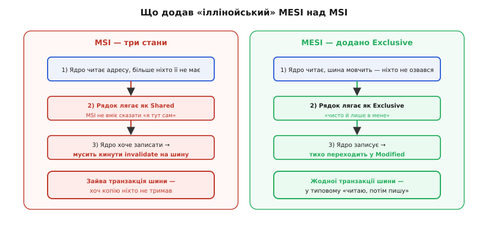

# 📜 Іллінойський протокол: як народилося MESI

Історія когерентності кеша — це історія одного відкриття, яке спершу здавалося дрібним трюком, а виявилося наріжним каменем усіх сучасних багатоядерних процесорів. І що цікаво: та сама проблема, яку в 1980-х розв'язували величезним залізом підслуховування, у мікроконтролері свідомо лишена **невирішеною в залізі** — і саме тому в прошивці доводиться робити clean та invalidate руками. Щоб зрозуміти, чому мікроконтролер віддав цей обов'язок програмісту, варто побачити, скільки коштує зробити його автоматом. А для цього — повернутися до сцени, де проблема вперше загострилася настільки, що на неї не можна було заплющити очі.

## Момент, коли одна пам'ять перестала бути однією правдою

До певного часу проблеми когерентності просто не існувало — не тому, що її розв'язали, а тому, що вона ще не могла виникнути. Один процесор, одна пам'ять: хто питає адресу, той і бачить її вміст, іншого претендента немає. Кеш між ними нічого не псує, бо ядро завжди ходить у пам'ять **через** кеш; свіже воно бачить за визначенням.

Усе змінюється, коли на спільну шину до **тієї самої пам'яті** сідає **другий майстер** — ще один процесор. У 1970-х це була екзотика великих машин, у 1980-х — уже реальність, до якої підбиралися серійно: кілька дешевих мікропроцесорів на одній шині коштували менше за один великий і обіцяли скласти їхню потужність. Ідея приваблива й проста на папері. На кристалі ж вона наштовхнулася на стіну.

Стіна така. Кожен процесор, щоб не давитися повільною спільною пам'яттю, тримає **свій приватний кеш** — гарячі дані впритул до себе. Поки всі лише читають незмінне — злагода. Але щойно один процесор **записав** у адресу, копію якої тримає в кеші **сусід**, — сусід про це не знає. Він і далі бачить у своєму кеші старе значення, тоді як у пам'яті (чи в кеші першого) уже лежить нове. Дві копії однієї змінної розійшлися, а програма про це не здогадується. Це і є **некогерентність** (лат. *cohaerentia* — зчепленість): різні учасники бачать різне там, де мусили б бачити одне.

> 🔧 **Навіщо це.** Той самий корінь — «приватна копія розійшлася з оригіналом» — і в багатопроцесорній машині 1984 року, і у твоєму Cortex-M7 з DMA сьогодні. Різниця лише в тому, **хто** другий майстер (сусіднє ядро чи канал DMA) і **хто** мирить копії (залізо підслуховування чи ти в коді). Зрозумівши, як цю біду ловили автоматом у великих системах, ти точно бачитимеш, чому в мікроконтролері її свідомо лишили тобі.

Перша спокуса — «пиши все одразу в спільну пам'ять» (наскрізний запис, англ. *write-through*). Тоді пам'ять завжди свіжа. Але це не рятує: сусід усе одно читає **зі свого кеша**, а не з пам'яті, і старої копії в його кеші наскрізний запис першого процесора не чіпає. До того ж кожен запис тепер лізе в повільну спільну шину — те, від чого кеш і мав рятувати. Потрібно було, щоб кеші **самі домовлялися** між собою, не турбуючи ні пам'ять, ні програміста. Питання лише — як саме.

## Підслуховування шини: дешева ідея, що все змінила

Ключ виявився в тому, що на **спільній шині** будь-яка транзакція **фізично видима всім**. Коли один процесор виставляє на шину адресу, у яку пише, ці лінії бачать усі — просто зазвичай кожен ігнорує чуже. А що, як не ігнорувати? Що, як кожен кеш **підслуховуватиме шину** (англ. *snooping* — підслуховування) і на кожну чужу транзакцію перевірятиме: «а чи нема в мене копії цієї адреси?»

Якщо є — кеш реагує сам, без команди зверху. Побачив, що сусід пише в адресу, копію якої я тримаю, — **викидаю свою копію** (позначаю недійсною). Наступного разу, коли моє ядро попросить цю адресу, буде промах, і я піду за свіжим. Так копії ніколи не розходяться надовго: щойно хтось псує спільну змінну, решта миттю про це «чують» і скидають старе. Ніяких центральних таблиць, ніякого коду в програмі — сама фізика спільної шини стає механізмом узгодження.

Ця ідея дозріла на початку 1980-х у кількох місцях майже одночасно, і це нормально для колективних винаходів — розрізняймо, хто **сформулював підхід**, а хто **довів його до економного протоколу**. Найранішу широко відому реалізацію снупінгу з інвалідацією описав **Джеймс Ґудмен (James R. Goodman)** з Університету Вісконсину в праці «Using Cache Memory to Reduce Processor-Memory Traffic» на 10-му симпозіумі ISCA 1983 року — так званий протокол **write-once** («запиши раз»). Його хитрість: перший запис у рядок іде наскрізь у пам'ять (щоб сусіди почули й викинули копії), а всі наступні — лише в кеш; так вдавалося вбити двох зайців — і сповістити інших, і не гатити шину на кожному записі. *(Статус: усталено.)*

Паралельно з'явилися й інші схеми снупінгу, кожна зі своїм компромісом:

- **Synapse** — комерційний протокол відмовостійких машин Synapse Computer, з ідеєю власника рядка (хто тримає брудну копію — той відповідає за неї);
- **Berkeley** (протокол власності, англ. *ownership*) — з Каліфорнійського університету в Берклі, теж навколо власника брудного рядка, щоб віддавати дані **з кеша в кеш** напряму, минаючи повільну пам'ять;
- **Firefly** (від дослідницької машини DEC із такою назвою) і **Dragon** (з Xerox PARC у Пало-Альто) — протоколи **оновлення** (англ. *write-update*): замість викидати чужі копії, вони **розсилали нове значення** всім, хто тримав рядок, і копії лишалися живими, тільки свіжими.

Тут пролягає розлом, який визначає весь дизайн: **інвалідація проти оновлення**. Протокол інвалідації на запис **кричить «викиньте копії»** — коротка команда без даних, зате наступне читання в сусіда буде промахом. Протокол оновлення на запис **розсилає саме нове значення** — копії лишаються, зате по шині щоразу їде повний вантаж даних. Що дешевше — залежить від того, як програми ділять дані: якщо один пише, а решта потім читають рідко — інвалідація виграє (не тягнеш дані даремно); якщо кілька процесорів жваво читають те, що часто оновлюється, — виграє оновлення (копії вже гарячі). Магістральний шлях, яким пішла індустрія, — **інвалідація**, бо в типовому коді дані частіше передають, ніж спільно молотять, а тиша на шині цінніша за завчасно розіслані копії.

І от на цьому тлі — снупінг уже є, інвалідація вже перемагає, кілька протоколів уже конкурують за найменший трафік шини — і з'являється робота, яка розставляє все по місцях і дає індустрії її робочий стандарт на десятиліття.

## 1984, Урбана-Шампейн: народження MESI

1984 рік, **Іллінойський університет в Урбана-Шампейн** (University of Illinois at Urbana-Champaign). Аспірант **Марк Папамаркос (Mark S. Papamarcos)** і його науковий керівник **Джанак Патель (Janak H. Patel)** подають на 11-й симпозіум ISCA (Енн-Арбор, Мічиган, червень 1984) статтю з навмисне скромною назвою — **«A Low-Overhead Coherence Solution for Multiprocessors with Private Cache Memories»** («Розв'язок когерентності з малими накладними витратами для багатопроцесорів із приватними кешами»). За скромною назвою — протокол, який світ згодом назве **MESI**, а за місцем народження — **«іллінойський протокол»** (англ. *Illinois protocol*). *(Статус: усталено; праця й автори підтверджені за матеріалами ISCA 1984 та архівом Іллінойського університету.)*

Хто ці двоє? **Джанак Патель** — родом з Індії: бакалаврат Індійського технологічного інституту в Мадрасі (1970), докторат Стенфорда (1976), професор Іллінойського університету з 1980-го до виходу на пенсію 2009-го; 2001 року — член Асоціації обчислювальної техніки (ACM Fellow), зокрема і за протоколи когерентності кеша. Його ім'я і донині стоїть біля «іллінойського протоколу» та «іллінойської scan-архітектури» для тестування мікросхем. **Марк Папамаркос** — на той час його аспірант; ця стаття лишилася найвідомішою в його доробку. Тобто MESI — це **робота керівника й аспіранта**, класична академічна пара, а не безіменне «винайдено в Іллінойсі». Розрізняти тут важливо: протокол не звалився з неба й не належить абстрактному університету — за ним стоять двоє конкретних людей із конкретними іменами. *(Статус біографій: усталено.)*

Що ж вони насправді додали? Щоб це побачити, треба спершу назвати те, над чим вони будували, — **MSI**.

## MSI: три стани й один прикрий зайвий крик

Найпростіший робочий протокол інвалідації для write-back кеша тримає для кожного рядка **три стани** — звідси назва **MSI**:

```
M — Modified (змінений): рядок брудний, лежить лише в моєму кеші,
                          у пам'яті — старе; я одноосібний власник.
S — Shared (спільний):   рядок чистий (= як у пам'яті), копію можуть
                          тримати й інші кеші.
I — Invalid (недійсний): копії немає або вона застаріла; читання
                          цієї адреси дасть промах.
```

Логіка проста й правильна. Читаєш адресу — тягнеш рядок і ставиш **S** (мало хто ще її має, тож про всяк випадок «спільна»). Пишеш — мусиш стати єдиним власником: кидаєш на шину інвалідацію (щоб решта викинули копії), переходиш у **M**. Хтось інший захотів читати твій **M**-рядок — ти віддаєш свіже й опускаєшся в **S**. Когерентність зберігається бездоганно.

Але приховано тут сидить **зайвий крик на шину** — і саме його вполювали в Іллінойсі. Розгляньмо найзвичайніший у житті програм шаблон: **процесор читає змінну, а потім її ж і записує** (лічильник `i++`, накопичувач суми, будь-яке «прочитав-змінив-записав»). У MSI це виглядає так:

```
крок 1.  читаю x  → рядок тягнеться в кеш, стан S
крок 2.  пишу  x  → щоб стати власником, КИДАЮ invalidate на шину,
                    аж тоді переходжу в M
```

А тепер найприкріше: на кроці 2 інвалідація полетіла на шину, **хоча копію цього рядка не тримав більше ніхто**. Ми ж щойно, на кроці 1, притягли його — і шина під час того читання **мовчала**, ніхто не озвався, що теж його має. Тобто рядок був фактично **наш і тільки наш** — а MSI цього не запам'ятав, бо в нього немає стану, щоб сказати «чисто **і** лише в мене». Тому на записі він змушений про всяк випадок кричати «викиньте копії!» — у порожнечу, нікому. У багатопроцесорній системі кожен такий зайвий крик — це зайнята шина, а зайнята шина — це черга і простій **усіх** процесорів. Помнож на мільярди операцій «читаю-пишу» — і набіжить відчутна частка пропускної здатності, витрачена на сповіщення нікого.

## Стан Exclusive: одна буква, що прибрала зайвий крик

Ідея Папамаркоса й Пателя — доточити до MSI **четвертий стан**, який ловить саме той випадок: «рядок чистий, і я тримаю його **сам**». Назвали його **Exclusive (E)** — виключний. Тепер станів чотири, звідси **MESI**:

```
M — Modified:  брудний, лише в мене; пам'ять застаріла.
E — Exclusive: ЧИСТИЙ, лише в мене; пам'ять свіжа. ← новий стан
S — Shared:    чистий, копію можуть тримати й інші.
I — Invalid:   копії немає / застаріла.
```

Ось як **E** вирішує все. Коли процесор читає рядок, а снупінг показує, що **шина мовчить** — жоден інший кеш не озвався, що теж його має, — рядок кладеться не в **S**, а одразу в **E**. Стан **E** каже: «чисто, і я один». А раз я гарантовано один, то **запис у E-рядок нікого не стосується** — жодної копії, яку треба було б інвалідувати, ні в кого немає. Тому перехід **E → M** відбувається **мовчки, без жодної транзакції шини**:

```
крок 1.  читаю x  → шина мовчить → рядок лягає як E  (чисто, лиш у мене)
крок 2.  пишу  x  → E → M ТИХО, без крику на шину
```

Той самий шаблон «читаю, потім пишу» — і зайвий крик зник. У MSI він був завжди; у MESI його немає в найпоширенішому випадку, коли даними ніхто не ділиться. А якщо на кроці 1 хтось таки озвався («я теж її маю») — рядок чесно лягає в **S**, і запис, як і має бути, кине інвалідацію: там копії **справді** є, крик доречний. MESI ніколи не мовчить, коли треба кричати, і ніколи не кричить, коли можна змовчати.


*Уся різниця MESI над MSI в одному шаблоні «читаю, потім пишу». MSI не має стану «чисто й лише в мене», тож на записі про всяк випадок кричить на шину — навіть коли копію ніхто не тримав. MESI ловить цей випадок станом Exclusive і переходить у Modified мовчки. У програмах, де даними майже не діляться, це прибирає більшість зайвих транзакцій шини.*

Ефект тим більший, чим менше процесори насправді **діляться** даними, — а діляться вони куди рідше, ніж здається: більшість змінних живуть у межах одного потоку на одному ядрі. Для них MESI перетворює послідовність «читання + запис» з **двох** подій на шині на **одну** (саме читання), а часто й на нуль, якщо рядок уже лежав у кеші. Ось у чому суть скромного заголовка «low-overhead»: не новий принцип, а **точне усунення зайвого трафіку** там, де попередній протокол страхувався даремно. Мінімізація трафіку шини — це не гасло, а прямий наслідок одного добре поставленого стану.

> 🔧 **Навіщо це.** Exclusive — взірець інженерної ощадливості: додали рівно один стан, щоб зловити рівно один найчастіший марнотратний випадок. Той самий спосіб думки веде і в прошивці мікроконтролера — не вимикати кеш цілком «щоб не думати», а поставити рівно дві операції (clean/invalidate) рівно там, де копія й пам'ять розходяться. І там, і там перемагає не груба сила, а точність.

## Чому саме MESI став стандартом — і що було далі

MESI виявився тією рідкісною точкою рівноваги, де все збіглося: він **простий** (лише чотири стани на рядок, скінченний автомат, який легко втілити в залізі), **не потребує центральних таблиць** (усе вирішується локально зі снупінгу), **модульний** (додаєш процесор — нічого не переробляєш у наявних кешах, нова машина просто теж підслуховує спільну шину) і при цьому **економний на трафік**. Саме цю модульність і відсутність глобальних структур автори підкреслювали як головну перевагу: систему можна нарощувати, не чіпаючи вже наявних кеш-модулів. Тому індустрія прийняла його як робочу основу — і MESI (та його прямі нащадки) досі живе в кеш-підсистемах процесорів настільних, серверних, мобільних.

Нащадки додавали по стану під нові потреби, і назви ростуть тією самою логікою «одна буква — один випадок»:

- **MOESI** — додає **O (Owned)**: рядок може бути водночас брудним **і** спільним, а «власник» O віддає свіже сусідам напряму з кеша, не оновлюючи щоразу пам'ять. Ідея власності з давніх Synapse і Berkeley, доточена до MESI.
- **MESIF** — додає **F (Forward)**: коли спільну копію тримають кілька кешів, рівно один призначається «відповідальним» віддавати її на запити — щоб на одне читання не кинулися відповідати всі одразу. Ця схема лягла в основу когерентності на шинах Intel.

Але для нас важливіший інший поворот історії. Весь цей апарат — снупінг, порівняння чужих адрес зі своїм умістом **на кожній транзакції шини**, скінченний автомат станів у кожному кеші — коштує **заліза й енергії**. Кожен кеш мусить безперервно слухати шину й звіряти адреси; це додаткові порівнювачі, додаткові порти до тегів кеша, додаткове живлення. У багатоядерному процесорі, де десятки ядер справді рівноправно топчуть спільну пам'ять, ця ціна виправдана з лишком: без апаратної когерентності така машина була б непрограмованою. І MESI осів там, де багато рівноправних ядер, — у великих CPU.

А мікроконтролер живе за іншою математикою. Його типова сцена — **одне ядро плюс кілька каналів DMA**, а не юрба рівних ядер. DMA не тримає власного кеша: він просто возить байти між периферією і пам'яттю. Ставити повний апарат снупінгу заради ядра-одинака й пари каналів DMA — платити транзисторами, площею кристала і, головне, **міліватами** за автомат, який майже нема кому обслуговувати. А мікроконтролер б'ється за кожен міліват і кожен квадратний міліметр. Тому інженери зробили чесний розмін: **когерентність DMA не автоматизуємо в залізі — лишаємо її на ручному кеш-майнтененсі**. Ядро отримує швидкий кеш, DMA — прямий шлях у пам'ять, а мирити їх копії — обов'язок програміста: клас, який великі системи ховають за снупінгом, у мікроконтролері виходить назовні як пара операцій clean/invalidate у правильних місцях. *(Статус: усталено — це усвідомлений компроміс дизайну, а не недогляд; підтверджується документацією на ядра Cortex-M7 і практикою вендорів.)*

Ось чому історія MESI — не просто хроніка чужого протоколу, а пряме пояснення твоєї щоденної практики. Те, що Папамаркос і Патель у 1984-му **автоматизували** одним добре поставленим станом, мікроконтролер **свідомо лишає ручним** — з тієї самої причини, з якої вони взагалі старалися: заради ощадливості. У великій системі економлять трафік шини, доточуючи стан Exclusive; у мікроконтролері економлять залізо й енергію, доточуючи два рядки коду в прошивку. Обидва рішення — про те саме: не витрачати ресурс там, де без нього можна обійтися. Зрозумів цю нитку — і ручний clean/invalidate перестає бути прикрою даниною й стає тим, чим є насправді: іншим кінцем однієї й тієї самої інженерної ідеї.
