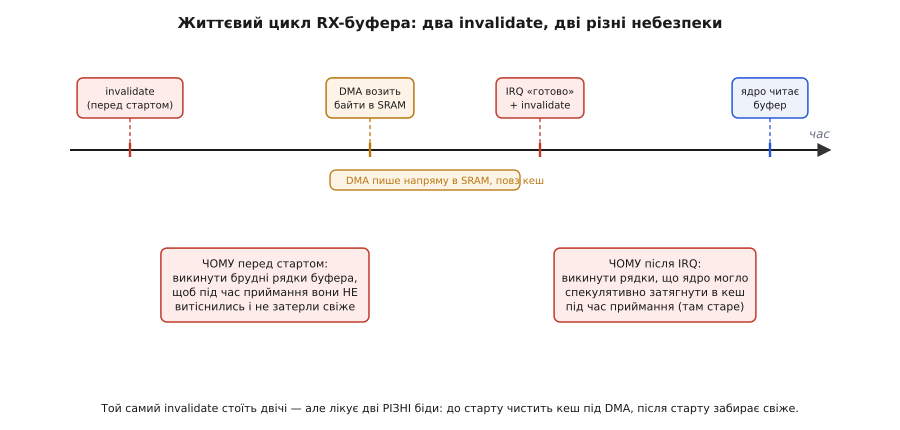
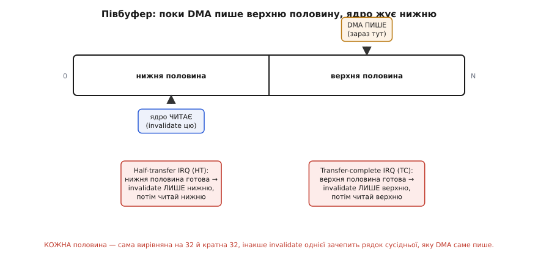

# ⚙️ Кільцевий буфер приймання по DMA з правильним кешем

Візьмімо найтиповіше завдання прошивки на потужному мікроконтролері й доведімо його до робочого коду, у якому все складне вже стоїть на своїх місцях. Прилад безперервно приймає потік байтів через послідовний інтерфейс — UART, SPI, будь-який. Ловити кожен байт перериванням дорого: на швидкій лінії переривання летіли б десятками тисяч на секунду, і ядро тільки й робило б, що заскакувало в обробник і вискакувало. Тож роботу віддають [прямому доступу до пам'яті](topic:electronics/dma): DMA сам, без участі ядра, перекладає прийняті байти в буфер у SRAM і смикає ядро лише тоді, коли назбирав повну порцію. Ядро тим часом зайняте корисним. Класика.

І саме тут, на ядрі рівня Cortex-M7, ця класика ламається об кеш. Ти піднімаєш кеш даних заради швидкості — і драйвер, що роками працював на дрібнішому чипі, раптом віддає з буфера половину старого сміття. Причина не в коді приймання: вона в тому, що ядро й DMA дивляться в **різні дзеркала** тієї самої пам'яті. Цю розбіжність — коли копія в кеші й оригінал у SRAM розходяться, бо до пам'яті ходить другий майстер шини повз кеш — і треба лікувати руками, двома операціями кеша у двох точних місцях.

> Що саме розходиться — коротко, бо на цьому все тримається. Кеш даних Cortex-M7 тримає копії гарячих 32-байтних рядків пам'яті поруч із ядром і в звичайній SRAM працює за політикою зворотного запису (write-back): запис ядра осідає **лише в кеші**, а в SRAM доходить пізніше й не за розкладом. DMA возить дані **напряму в SRAM, повз кеш**. Звідси дві дзеркальні біди: після приймання ядро читає стару копію з кеша замість свіжого з SRAM (лікує **invalidate** — викинути копію); перед передаванням DMA везе стару SRAM замість свіжого з кеша (лікує **clean** — злити копію в пам'ять). Повний розбір механізму — у [темі про кеш-коерентність](topic:electronics/cache-coherency-mcu).

Ця вставка — не переказ того механізму, а його **втілення в драйвер**, який можна вставити в проєкт. Ми зберемо приймання по DMA так, щоб кеш ніколи не збрехав, і дорогою наштрикнемося на кожну пастку: часткові рядки, що псують сусідню змінну; invalidate, поставлений не там; гонитву між DMA й ядром за той самий рядок; півбуферні переривання; і чесну альтернативу — некешовану область, коли ручна дисципліна надто крихка. Кожне рішення матиме своє «чому», бо без нього код перетворюється на набір заклять, які то працюють, то ні.

> 🔧 **Навіщо це.** Приймання по DMA з увімкненим кешем — не екзотика, а стандартний кістяк драйвера на STM32H7, i.MX RT, будь-якому Cortex-M7. Зробиш кеш неправильно — матимеш плавучий баг, який зникає під налагоджувачем (там кеш поводиться інакше) і вилазить раз на тисячу пакетів у полі. Розберешся раз — і ставитимеш ті самі дві-три операції автоматично, як застібаєш ремінь.

## Задача: DMA наповнює буфер, ядро його читає — і не бачить свіжого

Опишімо сцену точно, бо в деталях і живе весь ризик. Периферія (скажімо, приймач UART) отримує байти з лінії. Замість смикати ядро на кожному ми налаштовуємо канал DMA: «складай прийняте в `rx_buf`, а коли набереш повний буфер — підніми переривання». Ядро запускає приймання один раз і йде робити своє. DMA тихо возить байт за байтом у SRAM. Набравши повний буфер, він піднімає прапорець «передавання завершено» (англ. *transfer complete*), і ядро заходить в обробник, щоб забрати пакет.

Обробник читає `rx_buf[0]`, `rx_buf[1]`… — і отримує не те, що привіз DMA. Він отримує те, що лежало в **кеші** на цих адресах з минулого разу. Бо коли ядро (чи його спекулятивний механізм передвибірки) колись торкалося цих адрес, воно затягнуло їхній рядок у кеш. DMA відтоді переписав SRAM начисто — але кеш про це не знає, копія в ньому лишилася стара. Ядро читає адресу, чий рядок є в кеші, отримує **влучання** й повертає стару копію, навіть не сходивши в SRAM. Пам'ять свіжа, кеш черствий — і драйвер віддає минулий пакет замість поточного.

Наївний рефлекс — «додам `volatile` до буфера» — тут безсилий, і важливо розуміти чому. Ключове слово [`volatile`](topic:programming/volatile) велить компілятору не тримати значення в регістрі й щоразу читати його **з пам'яті** — але «пам'ять» для ядра з кешем це і є **кеш**. `volatile` змусить ядро сходити в кеш замість регістра, а в кеші лежить та сама черства копія. Компілятор зробив усе, що йому наказали; проблема на поверх нижче — між кешем і SRAM, куди `volatile` не дотягується. Лікує не він, а операція кеша.

## Ідея: обгорнути DMA у два ліки й одне вирівнювання

Розв'язок збирається з трьох частин, і кожна закриває свою діру.

Перша — **invalidate після приймання**. Коли DMA підняв «готово», ми наказуємо кешу викинути копії рядків буфера: `SCB_InvalidateDCache_by_Addr`. Після цього наступне читання цих адрес **промахнеться** повз кеш і піде за свіжим у SRAM — туди, куди писав DMA. Копію-брехуна усунено, ядро бачить справжнє.

Друга — **вирівнювання буфера на межу рядка**. Кеш обслуговує пам'ять не байтами, а цілими 32-байтними рядками: викинути окремий байт не можна, лише весь рядок від його початку до +31. Тому буфер мусить **починатися на межі 32 байтів і мати розмір, кратний 32** — інакше invalidate зачепить сусідні дані, і про це нижче окремо, бо це найпідступніша пастка всієї теми.

Третя — **clean перед передаванням**, якщо той самий драйвер ще й шле. Наповнивши буфер, ядро тримає свіжі байти лише в кеші (write-back!); перед стартом DMA-передавання їх треба злити в SRAM через `SCB_CleanDCache_by_Addr`, інакше DMA прочитає черству пам'ять.

Складімо кістяк, а тоді доведемо до повного драйвера з усіма пастками.

```c
#include <stdint.h>
#include "stm32h7xx.h"   // дає SCB_* та регістри периферії/DMA

// Буфер під DMA-приймання: власний рядок(-и) кеша, нікого поруч.
// aligned(32) — старт на межі 32; розмір кратний 32 — рівно ціле число рядків.
#define RX_LEN   64u   // 64 = 2 × 32
static uint8_t rx_buf[RX_LEN] __attribute__((aligned(32)));

// Викликається, коли DMA підняв «передавання завершено».
void on_dma_rx_complete(void)
{
    // 1) Викинути стару копію рядків буфера з кеша.
    SCB_InvalidateDCache_by_Addr((uint32_t *)rx_buf, RX_LEN);
    // 2) ТЕПЕР читання йде в SRAM за свіжим — це справді те, що приніс DMA.
    process_packet(rx_buf, RX_LEN);
}
```

Це вже працює для одноразового приймання. Але живий драйвер приймає **безперервно**, DMA і ядро змагаються за буфер щомиті, і саме тут дрімають три різні пастки. Розберімо їх по черзі — кожна варта того, щоб побачити її механізм, а не просто завчити рецепт.

## Пастка перша: частковий рядок псує сусідню змінну

Це найтихіша й найгидкіша пастка, бо ліки від першої біди самі стають причиною другої. Уяви, що поспішив і оголосив буфер абияк:

```c
// НЕБЕЗПЕЧНО: розмір не кратний 32, старту не вирівняно
uint8_t  rx_buf[40];        // 40 не кратне 32; адреса яка вийде
volatile uint32_t ticks;    // лічильник системного таймера — цілком може
                            // лягти в той самий 32-байтний рядок, що й хвіст rx_buf
```

Тепер після приймання ти чесно робиш `SCB_InvalidateDCache_by_Addr((uint32_t*)rx_buf, 40)`. Функція не вміє викидати «40 байтів» — вона працює рядками. Отримавши адресу й розмір, вона знедійснює **всі рядки, яких торкається діапазон**: від рядка, що містить початок буфера, до рядка, що містить останній байт. Якщо буфер не вирівняний, його перший рядок «висить» одним краєм у чужих даних; якщо розмір не кратний 32, те саме з останнім рядком. І в той рядок цілком могла потрапити `ticks`.

Чи станеться лихо, залежить від того, чи була `ticks` в кеші **брудною**. Якщо чистою — invalidate просто викине копію, наступне читання перечитає з SRAM те саме значення, і ти нічого не помітиш. Але якщо брудною — а через write-back свіже значення, яке ядро щойно їй записало, живе **лише в кеші** — вилазить справжня біда. Річ у тім, що `SCB_InvalidateDCache_by_Addr` — це **чистий invalidate**: на кожен рядок вона пише адресу в регістр «знедійснити за адресою» (DCIMVAC), а той **викидає рядок без запису назад** у пам'ять. Жодного злиття брудного перед викиданням тут немає — цим займається окрема функція `SCB_CleanInvalidateDCache_by_Addr`, якої ти не кликав. Тож свіже значення `ticks` у SRAM так і не потрапляє, а копію в кеші знедійснено — воно просто **зникає**. Наступне читання `ticks` піде в SRAM і дістане **старе**. Ти вилікував баг приймання й **посіяв другий**, ще підступніший: чужа змінна в іншому кінці коду тихо втрачає щойно записане значення, і пов'язати це з драйвером UART майже неможливо — вони в різних кінцях коду. Ось чому вирівнювання — умова коректності, а не косметика: на краях діапазону invalidate **не має страхувальної сітки**, і брудний сусід гине мовчки.

Ліки — те саме вирівнювання, з якого ми почали, тепер уже зрозуміле до кінця:

```c
// БЕЗПЕЧНО: старт на межі 32, розмір — ціле число рядків
uint8_t rx_buf[64] __attribute__((aligned(32)));   // 64 = 2 × 32
```

Порахуймо, чому саме так, а не «про запас побільше». Адреса 32-байтного рядка завжди кратна 32 — молодші 5 бітів адреси нульові, бо 2⁵ = 32. Директива `aligned(32)` змушує лінкер поставити буфер на таку адресу, тож його **початок збігається з початком рядка**. Розмір, кратний 32, гарантує, що **кінець** буфера збігається з кінцем останнього рядка. Тепер межі буфера точно лягли на межі рядків — invalidate чіпає рівно ці рядки й **жодного сусіда** в них немає. Не «майже немає», а немає за побудовою.

```
адреса rx_buf: 0x2000_0100   → 0x100 = 256 = 8 × 32  → кратна 32 ✓
розмір:        64             → 64 = 2 × 32           → рівно 2 рядки ✓

рядок 0: [0x2000_0100 .. 0x2000_011F]  ← увесь наш
рядок 1: [0x2000_0120 .. 0x2000_013F]  ← увесь наш
```

Одну деталь варто тримати в голові й для структур: якщо буфер лежить **усередині** ширшої структури, `aligned(32)` на самому полі-масиві ще не гарантує, що між ним і сусіднім полем структури не влізе спільний рядок — вирівнюй і саму структуру, або клади DMA-буфери в окрему секцію лінкера, де поруч свідомо нікого немає. Найнадійніше — виділити під усі DMA-буфери окрему ділянку SRAM цілком.

## Пастка друга: invalidate не там — і гонитва за рядок під час приймання

Тепер найтонше місце, повз яке проходять навіть автори, що вже завчили «invalidate після DMA». Правило «після» — правда, але **неповна**. Для безперервного приймання invalidate треба зробити **ще й перед стартом** DMA — і причина цього змушує по-новому подивитися на весь механізм.

Уяви безперервний драйвер: ядро запускає приймання в буфер, DMA возить туди байти. Поки він возить, ядро зайняте іншим — і десь у своїй роботі торкається адрес, що діляться рядком із буфером (або просто той рядок ще з минулого циклу висить у кеші брудним, бо туди щось писали). У кеша **скінченна місткість**: щоб затягнути новий гарячий рядок, він мусить **витіснити** якийсь старий. І якщо на витіснення потрапить брудний рядок буфера, кеш **запише його назад у SRAM** — просто посеред того, як DMA туди пише. Брудна копія з кеша **затре щойно прийняті байти**. Драйвер не зробив нічого явно неправильного, а дані зіпсовано — їх перебила фонова робота кеша.

Ось чому RX-буфер знедійснюють **двічі, і два invalidate лікують дві різні біди**:

- **invalidate ПЕРЕД стартом DMA** — щоб у кеші не лишилося **брудних рядків** буфера, які під час приймання можуть витіснитися й затерти свіже в SRAM. Це прибирає гонитву «кеш проти DMA за той самий рядок».
- **invalidate ПІСЛЯ завершення DMA** — щоб викинути рядки, які ядро могло **спекулятивно** затягнути в кеш під час приймання (передвибірка читає наперед), бо в них лежить уже застаріле. Це прибирає «ядро читає черстве».


*Той самий invalidate стоїть двічі, але лікує дзеркально різне. Перед стартом він чистить кеш під DMA — щоб жоден брудний рядок буфера не витіснився й не затер прийняте. Після завершення — забирає свіже, викидаючи копії, які ядро спекулятивно затягнуло, поки DMA працював. Пропустиш перший — рідкісне псування під навантаженням; пропустиш другий — стабільно старі дані.*

Порядок тут теж непорушний, як і в парі clean/invalidate загалом. Поставиш invalidate «після» без «перед» — драйвер працюватиме на столі й на малому трафіку (кеш просто не встигає нічого витіснити) і почне зрідка псувати дані під навантаженням, коли витіснення стають частими. Це рівно той тип бага, що коштує тижнів: він відтворюється лише в полі й зникає під будь-яким налагоджувачем.

Зберемо це в чесний безперервний драйвер:

```c
// Запуск чергового приймання: спершу почистити кеш ПІД буфер, тоді пускати DMA.
static void rx_start(void)
{
    // ПЕРЕД стартом: у кеші не має лишитися брудних рядків буфера,
    // інакше витіснення під час приймання затре свіже в SRAM.
    SCB_InvalidateDCache_by_Addr((uint32_t *)rx_buf, RX_LEN);

    // Налаштувати й пустити канал DMA на приймання RX_LEN байтів у rx_buf.
    dma_rx_config((uint32_t)rx_buf, RX_LEN);
    dma_rx_enable();   // з цієї миті DMA пише в SRAM сам
}

// Переривання «DMA завершив приймання повного буфера».
void DMA1_Stream0_IRQHandler(void)
{
    if (dma_rx_complete_flag()) {
        dma_rx_clear_flags();

        // ПІСЛЯ завершення: викинути копії, що ядро могло спекулятивно
        // затягнути під час приймання — тоді читання піде в SRAM за свіжим.
        SCB_InvalidateDCache_by_Addr((uint32_t *)rx_buf, RX_LEN);

        process_packet(rx_buf, RX_LEN);   // тепер це справді прийняте
        rx_start();                       // почати наступний буфер
    }
}
```

Зверни увагу: обидва invalidate — на **вирівняному** буфері, тож жодна фонова змінна в гру не втягнена. Дві пастки сходяться в одному коді: якби буфер не був вирівняний, invalidate «перед стартом» сам би затер брудний рядок сусіда, а «після» — викинув би його свіжу копію. Дисципліна вирівнювання й дисципліна порядку працюють лише разом.

## Пастка третя: півбуферні переривання й потоковий прийом

Попередній драйвер обробляє буфер **цілком** і аж тоді починає наступний — між пакетами є пауза, поки ядро жує прийняте, а DMA стоїть. Для рідкісних пакетів це нормально. Для **безперервного потоку** (звук, суцільний телеметричний струмінь) пауза недопустима: байти летять без упину, і зупиняти DMA ніколи. Тут вмикають **круговий** режим DMA з **півбуферним перериванням** (англ. *half-transfer*) — і кеш додає до нього свою зморшку.

Ідея кругового режиму: DMA возить у той самий буфер **по колу**, не зупиняючись, і піднімає **два** переривання за оберт. На середині (**half-transfer**, HT) — «перша половина буфера готова». У кінці (**transfer complete**, TC) — «друга половина готова, повертаюсь на початок». Поки DMA пише в одну половину, ядро спокійно розгрібає другу; на наступному перериванні вони міняються половинами. Класичне подвійне буферування одним буфером — жодних пауз, потік не рветься.


*Півбуфер розводить DMA і ядро по різних половинах одного кільця. На HT-перериванні готова нижня половина — знедійснюй і читай ЛИШЕ її, поки DMA пише верхню; на TC — навпаки. Знедійснити весь буфер тут не можна: викинеш свіже, яке DMA саме кладе в іншу половину. І кожна половина мусить бути власним цілим числом рядків, інакше invalidate однієї зачепить рядок сусідньої.*

Кеш-дисципліна зміщується разом із логікою. Знедійснювати треба **лише ту половину, яка щойно заповнилася** — саме перед тим, як ядро її прочитає. Знедійснити весь буфер було б помилкою: другу половину DMA якраз **пише зараз**, і invalidate викинув би те, що туди лягає. Звідси залізна вимога до розмітки: **кожна половина** мусить сама бути вирівняна на 32 й бути цілим числом рядків, інакше межа між половинами розсіче рядок, і invalidate однієї половини зачепить кінець сусідньої, яку DMA в цю мить наповнює.

```c
// Круговий прийом у ПОДВІЙНИЙ буфер. Кожна половина — ціле число 32-байтних
// рядків, увесь буфер вирівняно на 32. Приймаємо суцільний потік без пауз.
#define HALF   64u              // одна половина = 64 байти = 2 рядки
#define FULL   (2u * HALF)      // 128 байтів = 4 рядки
static uint8_t stream_buf[FULL] __attribute__((aligned(32)));

static void stream_start(void)
{
    SCB_InvalidateDCache_by_Addr((uint32_t *)stream_buf, FULL);  // чисто під DMA
    dma_rx_config_circular((uint32_t)stream_buf, FULL);          // круговий режим
    dma_rx_enable_ht_tc();     // увімкнути ОБА переривання: HT і TC
}

void DMA1_Stream0_IRQHandler(void)
{
    if (dma_half_transfer_flag()) {        // готова НИЖНЯ половина
        dma_clear_ht_flag();
        // знедійснити й читати ЛИШЕ нижню; верхню DMA саме пише — не чіпати
        SCB_InvalidateDCache_by_Addr((uint32_t *)&stream_buf[0], HALF);
        process_half(&stream_buf[0], HALF);
    }
    if (dma_transfer_complete_flag()) {    // готова ВЕРХНЯ половина
        dma_clear_tc_flag();
        SCB_InvalidateDCache_by_Addr((uint32_t *)&stream_buf[HALF], HALF);
        process_half(&stream_buf[HALF], HALF);
    }
}
```

Тут проступає той самий контракт «один хазяїн на ділянку», що й у [програмній кільцевій черзі SPSC](topic:electronics/async-fifo): DMA володіє половиною, яку пише, ядро — половиною, яку читає, і вони ніколи не чіпають ту саму половину водночас. Кеш-операції не замінюють цього поділу, а надбудовуються над ним: поділ гарантує, що двоє не б'ються за байти, а invalidate — що ядро бачить у своїй половині свіже. Дві дисципліни, кожна про своє: власність — про **хто пише**, кеш — про **що видно**.

Одна практична обережність: обробник мусить встигати розгребти свою половину, **поки DMA не дійшов до неї по колу**. Не встигне — DMA почне переписувати половину, яку ядро ще читає, і потік «наздожене» читача. Це не кеш-баг, а браковий бюджет часу: розмір половини бери з запасом під найгіршу затримку обробника, точнісінько як розмір апаратної FIFO беруть під найгіршу паузу читача.

## Альтернатива без жодного clean/invalidate: некешована область

Досі ми лишали кеш увімкненим і мирили його з DMA руками. Є радикальніший шлях, і в певних випадках він **правильніший** за ручну дисципліну — прибрати кеш **саме з-під DMA-буферів**, не чіпаючи його для решти пам'яті.

Cortex-M7 дозволяє задати атрибути кешування **посекційно** через свій вузол керування правами доступу до пам'яті (Memory Protection Unit, MPU — блок, що ділить адресний простір на ділянки й призначає кожній права та політику кешування). Оголоси невеликий шматок SRAM **некешованим** (атрибут *Non-cacheable*, або тип *Device*) — і ядро ходитиме туди **повз кеш**, як DMA. Копій не виникає взагалі, бо кешу до цієї ділянки байдуже; ядро й DMA завжди бачать ту саму SRAM. Кладеш DMA-буфери в цю ділянку — і **жодного** `SCB_Clean`/`SCB_Invalidate` більше не потрібно, ніде.

```c
// Буфери у СПЕЦІАЛЬНІЙ секції, яку скрипт лінкера кладе в некешовану ділянку SRAM
// (MPU налаштовано оголосити цю ділянку Non-cacheable ще до старту периферії).
static uint8_t rx_buf[64] __attribute__((section(".dma_noncacheable"), aligned(32)));

// Обробник спрощується до безкешової прошивки: читай напряму, кеш тут ні до чого.
void DMA1_Stream0_IRQHandler(void)
{
    if (dma_rx_complete_flag()) {
        dma_rx_clear_flags();
        process_packet(rx_buf, sizeof(rx_buf));   // SRAM некешована — завжди свіжа
    }
}
```

Ціна чесна й вимірювана: ядро втрачає швидкість кеша **на цих даних** — кожне звернення до буфера йде в повільну SRAM (десятки тактів проти одного-двох при влучанні). Тому вибір — це компроміс за характером буфера, і його варто робити свідомо:

- **буфер невеликий або читається рідко** (керівні пакети, поодинокі кадри) — некешована область майже завжди **краща**: втрата швидкості мізерна, а ручну дисципліну (з усіма її «перед/після» і вирівнюванням) прибрано геть, разом із цілим класом багів;
- **буфер гарячий і ядро активно його жує** (потік відліків, який фільтрують чи перетворюють на місці) — тут кеш дає реальний виграш, і платити повільною SRAM за кожен доступ дорого; лишай кеш і став ручні ліки.

Некешована область не «краща» і не «гірша» за ручний clean/invalidate — вона **простіша ціною швидкості доступу**. Одну помилку роблять часто: беруть некешовану область і про всяк випадок **ще й** ліплять `SCB_Invalidate`. Це не потрібно й тільки марнує такти — якщо ділянка справді некешована, викидати з кеша нічого, там і не буває копій. Обери один шлях і тримайся його: або кеш плюс ручні ліки, або некешована ділянка без них.

## Складність і пастки: чек-лист перед очима

Драйвер вище — це кількадесят рядків, і вся їхня підступність зосереджена в кількох точних місцях. Ось вони разом, як список для звіряння перед тим, як лишити код у продукції.

- **Вирівнювання — не косметика, а умова коректності.** Буфер під DMA: `__attribute__((aligned(32)))` **і** розмір, кратний 32. Інакше invalidate краю зачепить сусідній рядок — вилікуєш приймання, посієш псування чужої змінної в іншому кінці коду. Для півбуфера **кожна половина** окремо мусить бути цілим числом рядків. Буфер усередині структури — вирівнюй структуру або винось буфери в окрему секцію.

- **Invalidate — двічі, і це різні операції.** Перед стартом DMA — щоб брудний рядок буфера не витіснився під час приймання й не затер свіже (гонитва кеша з DMA за рядок). Після завершення — щоб викинути спекулятивно затягнуті ядром копії. Пропустиш «перед» — рідкісне псування під навантаженням, невідтворюване на столі; пропустиш «після» — стабільно старі дані.

- **Порядок священний, як у clean/invalidate загалом.** Приймання: invalidate → старт DMA → (DMA пише) → завершення → invalidate → читання. Передавання дзеркальне: наповнив буфер → `SCB_CleanDCache_by_Addr` → старт DMA. Clean **перед** тим, як DMA читає; invalidate **після** того, як DMA записав. Переставиш — злиття затре прийняте або знедійснення викине незлите.

- **`volatile` тут не ліки.** Він велить компілятору читати з пам'яті замість регістра — але для ядра з кешем «пам'ять» це кеш, де й лежить черства копія. `volatile` на буфері не замінює жодного invalidate; він про рівень компілятора, а біда — між кешем і SRAM.

- **Півбуфер: знедійснюй лише готову половину.** На HT — нижню, на TC — верхню, і саме ту, яку зараз читатимеш. Знедійсниш весь буфер — викинеш свіже з половини, яку DMA пише в цю мить. Плюс встигай розгребти половину, поки DMA не дійшов до неї по колу, — інакше потік наздожене читача (це вже питання розміру, не кеша).

- **`SCB_InvalidateDCache_by_Addr` бере адресу й розмір у байтах.** Розмір — саме кількість байтів діапазону (`RX_LEN`, `sizeof(rx_buf)`), не кількість рядків і не елементів. Функція сама розширить діапазон до цілих рядків; твоя справа — щоб краї вже лягали на межі рядків (див. вирівнювання).

- **Некешована область — цілісна альтернатива, не додаток.** Поклав буфери в Non-cacheable-ділянку MPU — прибери **всі** clean/invalidate для них: копій немає, викидати нічого. Не змішуй два підходи на одному буфері. Вибір за характером буфера: холодний/рідкісний — некешована ділянка (простіше, безпечніше); гарячий/жований — кеш плюс ручні ліки (швидше).

Склади це докупи — і матимеш драйвер, у якому кеш ніколи не бреше: DMA возить дані власною дорогою, ядро бачить свіже, а між ними стоять рівно ті операції, яких вимагає механізм — не більше й не менше. Скелет усюди один: DMA пише в SRAM повз кеш, тож ядру треба або **викинути стару копію** (invalidate — коли DMA записав), або **злити свіжу копію** (clean — коли DMA читатиме), і завжди — на буфері, чиї межі збігаються з межами рядків. Побачивши цей кістяк раз, ти впізнаєш його в кожному драйвері на Cortex-M7 — і ставитимеш два ліки в двох місцях, ще не встигнувши подумати, звідки цього разу лізе черстве.
