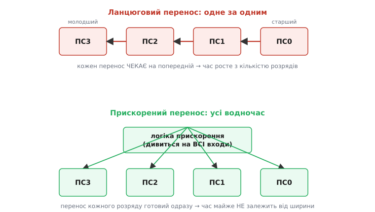
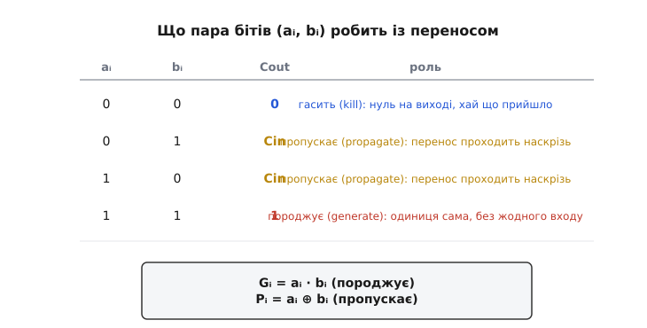
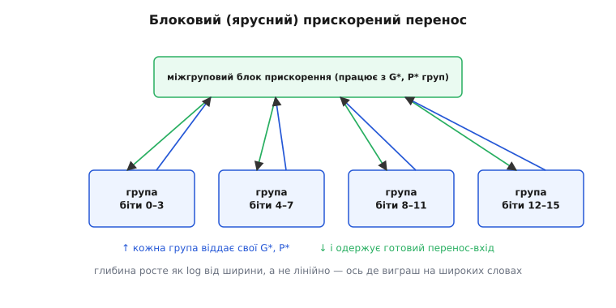

# Суматор із прискореним переносом

Додати два числа здається миттєвою дією, та в залізі вона має ціну — і ціна ця ховається в **переносі**. Коли суматор складає числа стовпчиком, перенос із молодшого розряду мусить дійти до старшого, точно як на папері: щоб дізнатися старшу цифру суми, спершу треба знати, чи прийшов до неї перенос, а це залежить від усіх розрядів нижче. Найпростіший [суматор зі звичайним ланцюговим переносом](book:electronics/combinational-circuits) саме так і працює — перенос фізично біжить дротами розряд за розрядом, і кожен наступний повний суматор чекає, поки перенос дотече до нього. **Суматор із прискореним переносом** (англ. *carry-lookahead adder*, дослівно «суматор, що дивиться на перенос наперед») розриває це чекання: він рахує всі переноси **наперед, водночас**, прямо зі вхідних бітів — і саме тому додає швидко навіть дуже широкі числа.

## Чому ланцюговий перенос повільний

Згадаймо, що робить один **повний суматор** (англ. *full adder*) у розряді i: бере два біти доданків aᵢ і bᵢ та перенос-вхід Cᵢ із сусіда знизу, а видає біт суми й перенос-вихід Cᵢ₊₁ у сусіда зверху. Біт суми для розряду — це непарність трьох бітів, а перенос народжується, коли серед трьох одиниць щонайменше дві.

Проблема не в самому суматорі, а в **залежності** між ними. Перенос C₁ розряду 0 готовий лише тоді, коли крізь вентилі розряду 0 пройшли сигнали; перенос C₂ чекає на C₁; C₃ — на C₂. Виходить ланцюжок, де кожна ланка не може порахувати свій вихід, доки не одержить вихід попередньої.


*Два способи добути переноси. Зверху — ланцюговий: перенос фізично біжить від молодшого розряду до старшого, тож затримка накопичується, ланка за ланкою. Знизу — прискорений: окремий блок логіки дивиться на **всі** вхідні біти одразу й видає перенос-вхід кожному розряду майже водночас, не змушуючи їх чекати один на одного.*

Порахуймо ціну. Хай перенос крізь один розряд проходить за затримку d (кілька вентилів). Тоді для n-розрядного ланцюгового суматора найгірший випадок — коли перенос мусить пробігти від найменшого біта до найбільшого: затримка близько **n·d**. Для 8 бітів терпимо, для 32 — уже довго, для 64 — справжнє гальмо. А найприкріше те, що ця затримка росте **лінійно з шириною слова**: подвоїв розрядність — приблизно подвоїв час додавання. Оскільки додавання лежить в основі майже кожної операції процесора (віднімання, множення, обчислення адрес — усе спирається на суматор), його швидкість прямо обмежує тактову частоту всієї машини.

> 🔧 **Навіщо це.** Суматор стоїть на критичному шляху процесора: найповільніша комбінаційна ланка між двома засувками визначає, наскільки високо можна підняти тактову частоту. Якщо 64-розрядне додавання тягнеться 64 затримки переносу, то весь процесор мусить чекати на цей найгірший випадок щотакту. Прискорений перенос — це не академічна вишуканість, а пряма причина, чому сучасні ядра можуть тактувати гігагерци: ширше слово додається майже за той самий час, що й вузьке.

## Ключова думка: перенос можна не чекати, а порахувати

Уся хитрість в одному спостереженні. Перенос-вихід розряду — це проста **функція** його входів і переносу, що прийшов. А якщо це функція, то її можна розписати наперед, не чекаючи, поки сигнал фізично добіжить. Питання лише: коли розряд **взагалі** видає перенос?

Подивімося на пару бітів aᵢ, bᵢ і запитаймо, що вона робить із переносом, який може прийти знизу. Можливі рівно три поведінки:

- якщо **обидва** біти одиниці (1+1), розряд видає перенос **сам**, незалежно від того, прийшов до нього перенос чи ні. Кажуть, що розряд **породжує** перенос (англ. *generate*);
- якщо **рівно один** із бітів одиниця (1+0 або 0+1), розряд сам переносу не створює, але **пропускає** наскрізь той, що прийшов: прийшов перенос — вийде, не прийшов — не вийде. Кажуть, що розряд **пропускає** перенос (англ. *propagate*);
- якщо **обидва** біти нулі (0+0), розряд **гасить** будь-який перенос: хай що прийшло знизу, на виході нуль (англ. *kill*).


*Що пара бітів робить із переносом. 0+0 гасить (вихід завжди 0), 1+1 породжує (вихід завжди 1, навіть без переносу-входу), а змішані 0+1 і 1+0 пропускають перенос наскрізь — він виходить рівно тоді, коли прийшов. Звідси два сигнали на розряд: Gᵢ = aᵢ·bᵢ (породження) і Pᵢ = aᵢ⊕bᵢ (пропускання).*

Ось і вся основа. Замість того щоб ганяти перенос дротами, опишемо кожен розряд **двома** простими сигналами, які залежать **лише** від його власних бітів — і обчислюються миттєво, паралельно для всіх розрядів:

```
Gᵢ = aᵢ · bᵢ        породжує: обидва біти одиниці
Pᵢ = aᵢ ⊕ bᵢ        пропускає: рівно один біт одиниця
```

Gᵢ (англ. *generate* — породжувати) каже «цей розряд видає перенос сам». Pᵢ (англ. *propagate* — пропускати, від лат. *propagare* — поширювати) каже «цей розряд віддасть назовні той перенос, що прийде». Гасіння окремим сигналом не потрібне: якщо ні Gᵢ, ні Pᵢ не активні (обидва біти нулі), розряд просто нічого не видає.

> 🔧 **Навіщо це.** Розклад на «породжує / пропускає» — це не лише трюк для суматора. Та сама пара сигналів лежить в основі цілої родини швидких суматорів — префіксних (Kogge–Stone, Brent–Kung), що їх ставлять у процесорних ядрах. Хто розуміє G і P, той читає схему будь-якого з них: усі вони — різні способи якнайшвидше скомбінувати ті самі Gᵢ і Pᵢ у переноси.

## Перенос як пряма формула

Тепер найважливіше — записати перенос розряду через ці сигнали, **без жодного посилання на сусідній перенос**. Коли взагалі на виході розряду i буде перенос Cᵢ₊₁? У двох випадках: або розряд **сам породив** його (Gᵢ = 1), або розряд **пропускає** (Pᵢ = 1) і до нього **прийшов** перенос Cᵢ. Одним рядком:

```
Cᵢ₊₁ = Gᵢ + Pᵢ · Cᵢ        (породив сам АБО пропустив те, що прийшло)
```

Це рекурентне правило саме по собі ще ланцюгове — Cᵢ₊₁ через Cᵢ. Та його можна **розгорнути**: підставити вираз для Cᵢ всередину, потім для Cᵢ₋₁, і так до самого початкового переносу C₀ (його в суматор подають іззовні — нуль для додавання, одиниця для віднімання доповняльним кодом). Розгорнімо для перших чотирьох розрядів:

```
C₁ = G₀ + P₀·C₀
C₂ = G₁ + P₁·G₀ + P₁·P₀·C₀
C₃ = G₂ + P₂·G₁ + P₂·P₁·G₀ + P₂·P₁·P₀·C₀
C₄ = G₃ + P₃·G₂ + P₃·P₂·G₁ + P₃·P₂·P₁·G₀ + P₃·P₂·P₁·P₀·C₀
```

Прочитаймо ці формули — вони красномовні. Перенос C₄ дорівнює одиниці, якщо: розряд 3 породив перенос (G₃); **або** розряд 2 породив, а розряд 3 пропустив (P₃·G₂); **або** розряд 1 породив, а розряди 2 і 3 обидва пропустили; і так далі — аж до самого C₀, який доходить до виходу лише тоді, коли **всі** розряди по дорозі його пропускають (P₃·P₂·P₁·P₀·C₀). Кожен доданок — це окремий «шлях», яким перенос міг потрапити на вихід.

Головне тут — **жоден із цих виразів не посилається на інший перенос**. Усі праві частини складені тільки з Gᵢ, Pᵢ і C₀, а ті готові одразу зі входів. Отже, усі переноси C₁, C₂, C₃, C₄ можна порахувати **водночас**, кожен — як двоярусна логіка «спершу І, тоді АБО» (англ. *AND-OR*), тобто за дві затримки вентиля, скільки б розрядів не було. Перенос більше нікуди не біжить — він обчислюється.

Маючи готові переноси, біти суми кожен розряд дораховує тривіально, бо потрібний йому перенос-вхід уже є:

```
Sᵢ = Pᵢ ⊕ Cᵢ = (aᵢ ⊕ bᵢ) ⊕ Cᵢ
```

Сума розряду — це його сигнал пропускання, ще раз додений за модулем 2 із переносом, що прийшов. Той самий XOR трьох бітів, що й у звичайному суматорі, лише перенос ми тепер не чекаємо, а вже маємо.

**Покажемо на числах: 4-розрядне додавання 1011 + 0110 через G, P і прямі формули.** Порахуймо переноси не ланцюгом, а одразу.

:::tabs
```cpp
#include <stdint.h>
#include <stdio.h>

// 4-розрядний прискорений суматор: переноси рахуємо ПРЯМО з G, P, C0.
// Повертає 4-бітну суму; через c4 віддає перенос-вихід групи.
uint8_t cla4(uint8_t a, uint8_t b, uint8_t c0, uint8_t *c4) {
    uint8_t g[4], p[4];
    for (int i = 0; i < 4; i++) {
        uint8_t ai = (a >> i) & 1, bi = (b >> i) & 1;
        g[i] = ai & bi;          // породжує: обидва біти 1
        p[i] = ai ^ bi;          // пропускає: рівно один біт 1
    }
    // переноси — кожен прямою формулою, БЕЗ посилання на сусідній перенос
    uint8_t c1 = g[0] | (p[0] & c0);
    uint8_t c2 = g[1] | (p[1] & g[0]) | (p[1] & p[0] & c0);
    uint8_t c3 = g[2] | (p[2] & g[1]) | (p[2] & p[1] & g[0]) | (p[2] & p[1] & p[0] & c0);
    *c4       = g[3] | (p[3] & g[2]) | (p[3] & p[2] & g[1])
                     | (p[3] & p[2] & p[1] & g[0]) | (p[3] & p[2] & p[1] & p[0] & c0);

    uint8_t cin[4] = { c0, c1, c2, c3 };
    uint8_t sum = 0;
    for (int i = 0; i < 4; i++)
        sum |= (uint8_t)((p[i] ^ cin[i]) << i);   // Sᵢ = Pᵢ ⊕ Cᵢ
    return sum;
}

int main(void) {
    uint8_t c4;
    uint8_t s = cla4(0x0B, 0x06, 0, &c4);          // 1011 + 0110 = 11 + 6
    printf("sum = %u, carry-out = %u\n", s, c4);   // sum = 1, carry-out = 1  →  1 0001 = 17
}
```
```py
# 4-розрядний прискорений суматор: переноси рахуємо ПРЯМО з G, P, C0.
# Повертає (сума, перенос-вихід групи c4).
def cla4(a, b, c0):
    g = [(a >> i) & (b >> i) & 1 for i in range(4)]   # породжує: обидва біти 1
    p = [((a >> i) ^ (b >> i)) & 1 for i in range(4)]  # пропускає: рівно один біт 1

    # переноси — кожен прямою формулою, БЕЗ посилання на сусідній перенос
    c1 = g[0] | (p[0] & c0)
    c2 = g[1] | (p[1] & g[0]) | (p[1] & p[0] & c0)
    c3 = g[2] | (p[2] & g[1]) | (p[2] & p[1] & g[0]) | (p[2] & p[1] & p[0] & c0)
    c4 = (g[3] | (p[3] & g[2]) | (p[3] & p[2] & g[1])
               | (p[3] & p[2] & p[1] & g[0]) | (p[3] & p[2] & p[1] & p[0] & c0))

    cin = [c0, c1, c2, c3]
    sum_ = 0
    for i in range(4):
        sum_ |= (p[i] ^ cin[i]) << i   # Sᵢ = Pᵢ ⊕ Cᵢ
    return sum_, c4


s, c4 = cla4(0x0B, 0x06, 0)                    # 1011 + 0110 = 11 + 6
print(f"sum = {s}, carry-out = {c4}")          # sum = 1, carry-out = 1  →  1 0001 = 17
```
:::

Простежмо, що порахували формули, без жодного «біжить»:

```
a = 1011 (11),  b = 0110 (6),  C0 = 0

розряд:   3    2    1    0
aᵢ:       1    0    1    1
bᵢ:       0    1    1    0
Gᵢ=aᵢ·bᵢ: 0    0    1    0
Pᵢ=aᵢ⊕bᵢ: 1    1    0    1

C1 = G0 + P0·C0            = 0 + 1·0           = 0
C2 = G1 + P1·G0 + P1·P0·C0 = 1 + 0   + 0       = 1
C3 = G2 + P2·G1 + …        = 0 + 1·1 + 0       = 1
C4 = G3 + P3·G2 + P3·P2·G1 + … = 0 + 0 + 1·1·1 + 0 = 1

Sᵢ = Pᵢ ⊕ Cᵢ
S0 = 1 ⊕ 0 = 1
S1 = 0 ⊕ 0 = 0
S2 = 1 ⊕ 1 = 0
S3 = 1 ⊕ 1 = 0
сума = C4 S3 S2 S1 S0 = 1 0001 = 17   ✓  11 + 6 = 17
```

Зверни увагу: щоб дізнатися C4 — найстарший перенос — ми **не** проходили розряди по черзі. Ми просто підставили готові G і P у його власну формулу. Усі чотири переноси можна було б порахувати в один і той самий момент, кожен своєю двоярусною логікою. Ось у цьому й уся швидкість.

## Ціна швидкості: розгалуження входів і блоки

Дармового нема нічого. Подивись на формулу для C₄: останній доданок — добуток **п'яти** сигналів (P₃·P₂·P₁·P₀·C₀), тобто потрібен вентиль І на п'ять входів. Для 8 розрядів це вже добуток дев'яти сигналів, для 16 — сімнадцяти. Кількість входів вентиля — його **розгалуження входів** (англ. *fan-in*) — не може рости безмежно: широкий вентиль і повільніший, і більший за площею, а сигнал Pᵢ доводиться розводити на дедалі більше місць. Тому **плаский** прискорений перенос на все слово відразу будують рідко — десь до 4, рідше 8 розрядів.

Вихід — **ярусність**. Числа ділять на групи (скажімо, по 4 розряди), кожна група — маленький прискорений суматор. Але групу описують **тими самими** двома сигналами, тільки тепер **груповими**: груповий G\* каже «ця група в цілому породжує перенос на виході, хай що прийшло», а груповий P\* — «ця група пропускає перенос наскрізь, якщо всі її розряди пропускають». Для групи з розрядів 0–3:

```
P* = P3·P2·P1·P0                              група пропускає, лише якщо ВСІ пропускають
G* = G3 + P3·G2 + P3·P2·G1 + P3·P2·P1·G0      група породжує сама
```

А далі — те саме спостереження поверхом вище. Маючи групові G\* і P\*, **другий** блок прискорення роздає переноси **між групами** точно за тими ж формулами, що й перший роздавав між розрядами. Виходить дерево: усередині груп переноси біжать наперед, і між групами — теж наперед.


*Ярусний прискорений перенос на 16 розрядів. Слово ділять на чотири групи по 4 біти; кожна група віддає назовні свої груповий G\* і P\*, а окремий міжгруповий блок прискорення за тими ж формулами роздає групам готові переноси-входи. Глибина логіки тепер росте як **логарифм** від ширини слова, а не лінійно, — ось чому навіть 64-розрядне додавання вкладається в кілька затримок вентиля.*

Сенс ярусності — у тому, як росте затримка. У ланцюговому суматорі вона лінійна, ~n·d. У ярусному прискореному — пропорційна **логарифму** ширини: кожен новий ярус учетверо (за розміром групи) збільшує охоплену розрядність, додаючи лише сталу затримку. Подвоїти ширину слова коштує тут не подвоєння часу, а одного зайвого «поверху» дерева. Саме тому реальні суматори процесорів — це варіації на цю тему: швидкість майже не залежить від розрядності, а площа й складність ростуть помірно.

> 🔧 **Навіщо це.** Той самий прийом «опиши блок груповими G\* і P\*, тоді склади блоки в дерево» — це загальний рецепт боротьби з довгими залежностями в цифровій логіці, не лише в суматорі. Він пояснює, чому в готових мікросхем-суматорах (як-от класична серія прискореного переносу) і в синтезованих процесорних ядрах ширина слова майже не б'є по тактовій частоті: довгий ланцюг переносу згорнуто в неглибоке дерево. Розумієш цей розклад — розумієш, чому додавання «безкоштовне» за часом навіть на 64 бітах.

## Звідки це взялося

Ідея рахувати перенос наперед, а не чекати, оформилася в [короткій історії прискореного переносу — від механіки Цузе до логіки IBM](book:electronics/carry-lookahead-adder/hist-weinberger-smith.md): перші підходи до «одночасного переносу» з'явилися наприкінці 1950-х в IBM, коли інженери шукали спосіб додавати за мікросекунду на тодішній повільній логіці, а сам розклад «породжує / пропускає» став класикою комп'ютерної арифметики й основою всіх пізніших швидких суматорів.

---

Суматор із прискореним переносом прибирає головне гальмо додавання — **чекання на перенос**. Замість того щоб ганяти перенос розрядами ([як у ланцюговому суматорі](book:electronics/combinational-circuits)), він описує кожен розряд двома сигналами, що залежать лише від його власних бітів: **Gᵢ = aᵢ·bᵢ** (породжує перенос) і **Pᵢ = aᵢ⊕bᵢ** (пропускає прийшлий). Через них кожен перенос записується **прямою формулою** від G, P і початкового C₀, без посилання на сусідів, — тож усі переноси рахуються водночас, двоярусною логікою, незалежно від ширини слова. Платою є розгалуження входів, що росте з розрядністю; його приборкують **ярусністю** — групи описують тими самими **груповими** G\* і P\*, а дерево блоків роздає переноси між групами. У підсумку затримка додавання росте як логарифм ширини, а не лінійно, — і саме тому широкі числа в процесорі додаються майже так само швидко, як вузькі.
