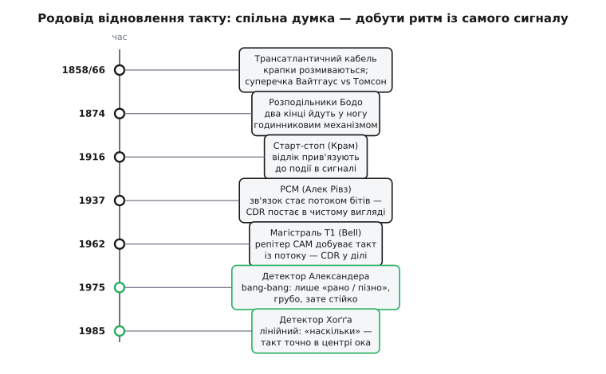

# 📜 Родовід відновлення такту: від скалічених телеграфних крапок до гігабітних магістралей

Задача, яку розв'язує відновлення такту з даних, здається дуже сучасною — вона живе в чипах, що женуть мільярди бітів по одній ниточці. Але коли придивитися, з чого вона зроблена, виявляється, що це один із найстаріших болів електричного зв'язку. Уже перші телеграфісти, які стукали ключем по дроту, натрапили на нього в чистому вигляді: імпульс, посланий різким і коротким, приходив на той кінець розмазаним, кволим і зсунутим у часі — і сусід питав приймача не «що ти прислав», а «коли твій сигнал уже нарешті стане чітким». Уся дальша історія — це поступове усвідомлення, що приймач мусить **сам** здобувати ритм із покаліченого сигналу, і поступове винайдення схем, які це роблять чимраз точніше.

Пройдімо цей родовід по-справжньому, з іменами й датами, і подивімося, як з телеграфної розмитості виросли два хитрі детектори фази, на яких досі тримається кожен швидкий приймач.

## Океанський дріт, що розмазував крапки

Почати варто з події, яка вперше показала проблему в усій її нещадності, — з першого трансатлантичного телеграфного кабелю 1858 року. Дріт завдовжки понад три тисячі кілометрів простягнули по дну океану між Ірландією та Ньюфаундлендом, і сталося диво: два континенти вперше заговорили за секунди, а не за тижні морського поштового рейсу. Але диво тривало недовго, і провал виявився повчальнішим за успіх.

Річ у тім, що довгий кабель — це не просто дріт. Це велетенський розтягнутий конденсатор: мідна жила всередині, солона вода зовні, ізоляція між ними. Пошліть у такий кабель різку прямокутну крапку — і на дальньому кінці ви отримаєте не крапку, а пологий горбок, що поволі наростає й так само поволі спадає, розповзаючись у часі далеко за межі того інтервалу, який ви йому відвели. Цей ефект тоді називали **затримкою** чи **розтягуванням** сигналу *(англ. retardation)*, а сьогодні його впізнають як **міжсимвольну інтерференцію** — коли розповзлий хвіст одного імпульсу залазить на місце наступного й псує його. На кабелі 1858 року розмивання було таке жорстке, що на передачу одного-єдиного знака йшло близько **двох хвилин** — швидкість десь із дві-три літери на хвилину. Тут проблема «коли читати» стоїть уже не тонко, а грубо: приймач мусив довго вдивлятися в кволий горбок і вгадувати, крапка це чи тире й де вона починається.

Довкола цього кабелю зіштовхнулися два підходи, і суперечка ця варта згадки, бо вона про саму суть проблеми. З одного боку стояв **Вілдмен Вайтгаус** *(англ. Wildman Whitehouse)* — головний електрик Атлантичної телеграфної компанії, за фахом лікар, що захопився електрикою. Він вірив: сигнал слабкий — то вдармо по кабелю **вищою напругою**, продавимо його силою. З іншого боку був **Вільям Томсон** *(англ. William Thomson)*, згодом лорд Кельвін (Lord Kelvin) — фізик з Ґлазґо, який **порахував**, що розмивання росте як квадрат довжини кабелю, і що продавлювати напругою марно: треба не бити сильніше, а **чутливіше слухати**. Томсон збудував дзеркальний гальванометр — прилад, що вловлював крихітний струм, відбиваючи промінь світла від крихітного дзеркальця й кидаючи зайчик на шкалу, так що навіть кволий горбок ставав видимим. Скінчилося все повчально: Вайтгаус, женучи швидкість, подав на кабель завелику напругу й **пропалив ізоляцію** — за кілька тижнів кабель здох. Оновлений кабель 1866 року, зроблений уже за Томсоновими засадами (товща жила, чистіша мідь, чутливіший приймач), пішов у вісім слів за хвилину — вісімдесят разів швидше.

> 🔧 **Навіщо це.** Суперечка Вайтгауса й Томсона — це прадавній предок сьогоднішнього вибору між «бити сигналом» і «розумно його читати». Через півтора століття та сама розвилка проступає в кожному швидкому лінку: можна гнати більшу амплітуду, а можна вкласти розум у приймач, який видобуде дані з ледь розкритого [ока](book:electronics/eye-diagram). Історія вже раз розсудила: перемагає той, хто краще слухає. CDR — прямий спадкоємець Томсонового боку цієї суперечки.

Статус цих фактів — **усталено**: історія трансатлантичних кабелів добре задокументована, суперечка Вайтгауса й Томсона розібрана в спеціальній історіографії, а цифри швидкості (дві хвилини на знак 1858-го, вісім слів за хвилину 1866-го) наводять узгоджено різні джерела. Важливо не піддатися спокусі зробити з Томсона одинокого генія: він розв'язав задачу теорією й приладом, але сам кабель тягли, ізолювали й обслуговували сотні інженерів і моряків — винахід тут, як завжди, колективний.

## Годинниковий механізм проти живих рук: як телеграф навчився ділити час

Наступний виток — не про амплітуду, а вже прямо про **час**, і саме тут з'являється зерно ідеї CDR. Коли телеграф подорослішав, крапки й тире почали не вистукувати вручну, а друкувати автоматично — літерами. А щоб друкувальний апарат на тому кінці друкував **правильні** літери, він мусив розуміти, **де** в потоці імпульсів кінчається одна літера й починається наступна. Тобто приймач мусив ділити час на однакові скибки синхронно з передавачем — рівно та сама задача, що й у CDR, лише електромеханічними засобами.

Перший великий розв'язок дав француз **Еміль Бодо** *(фр. Émile Baudot)*: близько 1870 року він склав п'ятибітний код для літер, а 1874-го запатентував цілу систему, у якій кілька телеграфістів ділили один дріт **по черзі в часі**. Синхронність тримали **годинникові розподільники** *(фр. distributeur)* — обертові щіткові механізми на обох кінцях, які годинниковим ходом крутилися **в ногу** й по черзі підмикали кожен канал. Це вже майже CDR за духом: два кінці мусять іти синхронно, і хтось мусить ту синхронність підтримувати. Але тримали її грубо — механічним годинником, який доводилося раз у раз вивіряти вручну, бо два годинники неминуче поволі розходяться.

Механічні годинники тодішньої точності на синхронну роботу літера-в-літеру **не тягнули** — вони розповзалися швидше, ніж устигали передати рядок. І тут народилася ідея, яка виявилася напрочуд живучою: **старт-стоп**. Замість тримати два годинники синхронними нескінченно довго, домовмося перед **кожною** літерою наново. Передавач шле короткий **стартовий** імпульс — «увага, зараз піде літера», приймач від нього **запускає** свій відлік, відмірює п'ять скибок під п'ять біт літери, а тоді **стоповий** сигнал каже «літера скінчилась, зупинись і чекай наступного старту». Так двом годинникам треба йти в ногу лише протягом однієї літери — за такий короткий проміжок вони розійтися не встигають. Цей старт-стоп запатентував **Говард Крам** *(англ. Howard Krum)* — патент США № 1 199 011, виданий 19 вересня 1916 року.

Ось у чому глибина цього моменту, і чому старт-стоп — прямий предок CDR. Приймач більше **не покладається** на власний годинник як на істину в останній інстанції — він **прив'язує** свій відлік до події в самому сигналі, до стартового фронту. Це вже той самий рух думки: **не тягни свій ритм наосліп, а раз у раз звіряй його з переходами в даних.** Різниця лише в тому, що старт-стоп прив'язується один раз на літеру й до спеціально виділеного стартового біта, а сучасний CDR прив'язується до **кожного** переходу самих даних, безперервно. Але зерно те саме.

Статус: **усталено** щодо Бодо (код ~1870, система 1874) і **усталено** щодо старт-стопу з патентом Крама 1916 року — це добре задокументовані віхи в історії телеграфії. Ім'я «Бодо» варто чути правильно: він **француз**, і одиниця швидкості символів — **бод** *(baud)* — названа на його честь; це не абревіатура, а прізвище, перекручене в термін.

## Алек Рівз і зухвала думка: а надішлімо самі числа

Тепер стрибок, який змінив усе, — від передачі розмитих аналогових горбків до передачі **чисел**. Його зробила одна людина в паризькій лабораторії наприкінці 1930-х, і зробила так рано, що світ дозрів до її ідеї лише через десятиліття.

Ідея належить британському інженерові **Алеку Гарлі Рівзу** *(англ. Alec Harley Reeves, 1902–1971)*. Працював він у паризькій лабораторії корпорації ITT *(International Telephone and Telegraph)* — американсько-міжнародної телефонної компанії з дослідницьким осередком у Франції. Тут важливо не наплутати атрибуцію: Рівз — **британець** за походженням і громадянством; ITT — **американська** корпорація з міжнародними лабораторіями; а зроблено відкриття фізично **в Парижі**, у Франції. Три різні виміри, і жоден не робить винахід «французьким» чи «американським» за національністю винахідника — сам Рівз лишається британцем незалежно від того, де стояв його робочий стіл.

1937 року Рівза мучив той самий давній біль, тільки в телефонному вбранні. Голос, посланий по довгій аналоговій лінії, з кожним кілометром і кожним підсилювачем збирає **шум** — і той шум уже не відчистити, бо підсилювач однаково задирає й корисний сигнал, і намерзлий на нього шум. Рівз зробив хід, який тоді здавався майже божевільним: а що, як **не** передавати сам аналоговий голос? Що, як багато разів на секунду **виміряти** його рівень, перетворити кожен вимір на **число** й слати по лінії лише ці числа — двійковими імпульсами? Тоді приймачеві не треба відчищати розмитий горбок від шуму — йому досить розрізнити, **є** імпульс чи **немає** його. А це навіть на брудній лінії зробити куди легше, ніж точно відновити аналоговий рівень. Так народилася **імпульсно-кодова модуляція** *(англ. pulse-code modulation, PCM)* — фундамент усієї цифрової передачі, від телефону до звуку на компакт-диску.

Рівз подав французький патент 1938 року (французький патент № 852 183), а патент США на PCM він отримав 1943 року. Проте технології **тих часів** до PCM не доросли: щоб багато тисяч разів на секунду міряти голос і слати числа потоком, треба швидкої цифрової електроніки, а її ще не існувало — панували лампи, важкі й повільні. Ідея Рівза пролежала майже як теорема без доведення практикою добрих півтора десятиліття, аж поки транзистор не зробив цифрову схемотехніку доступною.

> 🔧 **Навіщо це.** PCM Рівза — це та мить, коли зв'язок перестав бути аналоговим горбком і став **потоком бітів**. І рівно з цієї миті постала задача CDR у її чистому вигляді: якщо по лінії летять двійкові імпульси й окремого такту немає, приймач мусить сам намацати, де межі бітів. До PCM цієї задачі в її сучасному вигляді просто не існувало — не було потоку бітів, у якому треба ловити ритм. Рівз, сам того не плануючи, створив ту сцену, на якій згодом і розігралася вся драма відновлення такту.

Статус — **усталено**: авторство PCM за Рівзом, паризька лабораторія ITT, 1937 рік як рік ідеї, французький патент 1938-го й американський 1943-го узгоджено підтверджують і біографічні джерела, і історіографія зв'язку (IEEE, ETHW). Розрізняймо чесно віхи: **ідея й теорія** (Рівз, 1937–1938) — це одне, а **робоча масова реалізація** прийшла значно пізніше й іншими руками, коли з'явився транзистор. Приписувати Рівзові готову цифрову магістраль було б перебільшенням; його заслуга — сама засаднича думка «передаваймо числа».

## T1: перша магістраль, де репітер мусив сам знайти ритм

Ось тепер — вирішальний момент, у який CDR із філософської потреби стає **щоденною інженерною роботою**. Це система **T1** *(інша назва — Transmission System 1)*, яку розробила Bell Labs і вперше пустила в діло 1962 року в Чикаго. Це була **перша комерційна цифрова магістраль** зв'язку: вона брала двадцять чотири телефонні розмови, оцифровувала кожну за PCM і гнала їх усі одним потоком по звичайній парі мідних дротів зі швидкістю **1.544 мегабіта за секунду**.

Аби відчути, чому саме T1 народила практичний CDR, треба зрозуміти її фізичну біду. Кабелі тягли під землею, доступ до них — через люки, а люки в Чикаго стояли приблизно за **шість тисяч футів** (близько милі) один від одного. На такій відстані потік бітів, ідучи по мідній парі, слабшав і розмивався тим самим прадавнім телеграфним чином — горбки розповзалися, амплітуда танула. Тому в кожному люці ставили **регенеративний репітер** *(англ. regenerative repeater)* — пристрій, який не просто підсилював кволий сигнал (це підсилило б і шум), а **відроджував** його наново: розпізнавав, де 0, а де 1, і випускав далі свіжі, чисті, повнорозмірні імпульси.

І ось тут ховається вся суть. Щоб **відродити** біт, репітер мусить спочатку вирішити, **де** цей біт — тобто в яку мить дивитися на розмиту лінію. А окремого тактового дроту вздовж магістралі **немає** — тягти поряд другий синхронний дріт через усі люки було б безглуздо дорого й ненадійно. Отже, кожен репітер був **змушений** видобувати такт **із самого потоку бітів**, який до нього доходив: чіплятися за переходи розмитого сигналу й з них відновлювати ритм, щоб знати, коли клацати. Це і є CDR у повний зріст — уже не думка, а мідна коробка в підземному люці, від якої залежить, чи дійде розмова. І таких коробок уздовж магістралі стояли десятки поспіль, кожна відновлювала такт заново й передавала естафету далі.

```
Кабель під Чикаго, люки ≈ кожні 6000 футів (≈ миля):

  →──[репітер]──розмитий потік──[репітер]──розмитий потік──[репітер]──→
        │                            │                          │
   відроджує біти               відроджує біти             відроджує біти
   (такт — з потоку!)           (такт — з потоку!)         (такт — з потоку!)

Окремого тактового дроту вздовж магістралі немає:
кожен репітер САМ добуває ритм із переходів сигналу.
```

Саме тому T1 — справжня колиска практичного відновлення такту. До неї CDR існувала здебільшого як міркування; T1 зробила її обов'язковою деталлю, що працює цілодобово в тисячах точок мережі. Розробники репітерів T1 уперше в промисловому масштабі мусили спроєктувати надійне вловлювання такту з випадкового потоку — і рішення тих років (вузькосмугові резонансні контури, що «дзвеніли» на частоті бітів від переходів сигналу) стали першими масовими схемами CDR.

Статус — **усталено** щодо основних віх: T1 як перша комерційна цифрова несуча система, запуск 1962 року в Чикаго, швидкість 1.544 Мбіт/с, канальний банк D1, регенеративні репітери приблизно кожну милю — усе це узгоджено наводять і Bell-івська історіографія, і довідкові джерела. Дату «розроблено ~1957, впроваджено 1962» варто розрізняти: **розробка** й **комерційний запуск** — різні віхи, і саме 1962-й у Чикаго — момент, коли CDR пішла у справжню експлуатацію. Тут теж не варто робити з Bell Labs одного «винахідника CDR»: система T1 — плід великого колективу, а сама ідея добувати ритм із сигналу вже жила в телеграфному старт-стопі за півстоліття до неї.

## Оптика підвищує ставки: NRZ і потреба в чеснішому детекторі

Далі сцена переїздить із мідного кабелю в **скляне волокно**, і саме тут родовід дає два свої найважливіші плоди — два детектори фази, на яких стоїть уся сучасна CDR. Щоб зрозуміти, **чому** вони знадобилися саме тоді, треба врахувати, що змінила оптика.

По-перше, оптичне волокно погнало швидкості вгору — від мегабітів до сотень мегабітів і гігабітів, а на таких темпах кожна пікосекунда неточності такту важить незмірно більше. По-друге, оптичні лінії шлють дані здебільшого кодом **NRZ** *(англ. non-return-to-zero — «без повернення до нуля»)*: біт «1» — світло увімкнене на весь інтервал, біт «0» — вимкнене, і між двома однаковими бітами лінія **не перемикається взагалі**. Це ощадливо за смугою, але для відновлення такту зле: переходи стають рідкими й нерегулярними, з'являються довгі німі ділянки, і детектор фази мусить бути особливо кмітливим, щоб не збитися. Треба було винайти детектори, що надійно тримають такт саме на такому скупому на переходи потоці.

Ключове поняття, яке тут виникає, — **діаграма ока** *(див. [око](book:electronics/eye-diagram))*: якщо накласти багато бітів один на одного, у центрі проступає розкрите «око», і CDR має право клацати саме в його середину, найдалі від країв, де сигнал перемикається. Обидва детектори, до яких ми зараз перейдемо, — це два різні способи відповісти на одне питання: як утримати мить відліку рівно в центрі цього ока.

## Александер, 1975: детектор, що каже лише «рано» чи «пізно»

Перший плід — навдивовижу простий, і саме простота зробила його безсмертним. 1975 року в британському часописі **Electronics Letters** вийшла стаття інженера **Александера** *(англ. J. D. H. Alexander)* з назвою «Clock Recovery From Random Binary Signals» — «Відновлення такту з випадкових двійкових сигналів» (том 11, сторінки 541–542, жовтень 1975). Стаття крихітна — дві сторінки, — але вона задала цілий клас детекторів, які й досі звуть **детектором Александера**.

Ідея Александера — це відмова від зайвих амбіцій. Не мірятимемо, **наскільки** такт схибив, — це важко й вимагає точної аналогової схеми. Питаймо лише, **в який бік**: рано наш такт чи пізно? Для цього беремо **три відліки на біт** — по одному в серединах двох сусідніх бітів і **один на межі** між ними, там, де очікується перехід. Далі — чиста логіка. Порівняймо значення на межі з тим, що стояло в попередньому й у наступному бітах. Якщо на межі рівень **ще збігається** з попереднім бітом — справжній перехід іще попереду, отже, наш такт **зарано**, пригальмуй. Якщо на межі рівень уже збігається з **наступним** бітом — перехід уже проскочив, такт **запізно**, підіжени. Детектор випльовує лише напрям похибки, «плюс» або «мінус», — і петля весь час дрібно **клює** навколо цілі, ніколи не стоячи на ній точно. Це залишкове тремтіння звуть **bang-bang джитером**.

```
Три відліки Александера на один біт:

      біт n            межа            біт n+1
    ┌────●────┐    ┌────╳────┐    ┌────●────┐
    │  відлік │    │ відлік  │    │  відлік │
    │в центрі │    │на межі  │    │в центрі │
    └─────────┘    └─────────┘    └─────────┘

Відлік на межі ще = біту n   →  перехід попереду →  ТАКТ ЗАРАНО (пригальмувати)
Відлік на межі вже = біту n+1 →  перехід проскочив → ТАКТ ЗАПІЗНО (підігнати)
```

Чому «bang-bang»? Це слово прийшло з теорії керування, де так звуть релейний регулятор, що завжди штовхає систему на повну — то в один бік, то в інший, без плавної середини, як термостат, що вміє лише ввімкнути й вимкнути грубку. Детектор Александера керує петлею рівно так: не «підправ на стільки-то», а «штовхни туди» або «штовхни сюди». Груба, релейна логіка — але саме через грубість вона **байдужа** до точної форми сигналу: їй досить розрізнити рівні на трьох відліках, а це навіть на дуже швидкому й брудному потоці зробити реально. Тому bang-bang детектор Александера й досі — робочий кінь чи не кожного гігабітного [SerDes](book:electronics/serdes): він простий, швидкий і напрочуд стійкий.

Статус — **усталено**: стаття Александера в Electronics Letters 1975 року з наведеними томом і сторінками — добре засвідчене джерело, на яке спираються сотні пізніших робіт і патентів; сам термін «детектор Александера» усталився в літературі саме за цим прізвищем. Про самого автора надійні джерела кажуть небагато поза цією працею, тож приписувати йому якісь інші заслуги чи національність без підстав не будемо — документовано лишається сама ця засаднича стаття 1975 року.

## Хоґґ, 1985: детектор, що каже не лише «куди», а й «наскільки»

Другий плід родоводу — протилежний за духом: не грубий, а **точний**. Десятиліттям пізніше, 1985 року, американський інженер **Чарлз Р. Хоґґ-молодший** *(англ. Charles R. Hogge Jr.)* опублікував у часописі **IEEE Journal of Lightwave Technology** статтю «A Self-Correcting Clock Recovery Circuit» — «Самокоригівне коло відновлення такту» (том 3, сторінки 1312–1314, грудень 1985). Це вже не дволисток, а повноцінна схема для оптичних ліній із кодом NRZ, і вона розв'язує задачу з іншого боку.

Хоґґ поставив за мету **лінійний** детектор: видати похибку, **пропорційну** тому, наскільки такт схибив, — не просто «пізно», а «пізно **ось настільки**». Механізм гарний своєю симетрією. Схема проводить дані через **два послідовні перезаписи** тригерами, зсунуті на пів такту, і порівнює результати логікою «виключне АБО» *(XOR)*. Вона видає **дві** імпульсні послідовності: одну, ширина імпульсів якої **залежить** від того, наскільки такт зсунутий відносно даних, і другу — **опорну**, сталої ширини, рівно в піврозмір біта. Схема весь час намагається зробити першу серію рівною за площею другій — а це трапляється рівно тоді, коли фронт такту сидить **точно в центрі** біта. Відхилився такт — перша серія «роздулася» чи «схудла» проти опорної, різниця площ дає пропорційну похибку, і петля тягне такт назад у центр. Звідси й «самокоригівне» в назві: коло само зводить похибку до нуля, а не вічно клює навколо неї.

Плата за точність — вибагливість. Лінійний детектор Хоґґа працює добре, поки сигнал іще **досить чистий**, щоб «наскільки» мало сенс: якщо фронти вже пошарпані шумом, вимірювати їхнє точне положення стає ненадійно, і тоді грубий bang-bang, якому досить «в який бік», виявляється стійкішим. Тому в родоводі ці два детектори не витіснили один одного, а поділили світ: точний **Хоґґ** — там, де сигнал чистий і потрібен якнайрівніший такт; грубий **Александер** — там, де швидко, брудно й головне вижити.

Цю схему Хоґґ не лише описав, а й **запатентував**. Патент США № 4 535 459 має назву «Signal detection apparatus» — «Пристрій виявлення сигналу», винахідник — Чарлз Р. Хоґґ-молодший, власник — корпорація Rockwell International; заявку подано 26 травня 1983 року, патент видано 13 серпня 1985-го. Тут корисно, як і з 8b/10b, розрізнити віхи: **заявка на патент** (1983) → **виданий патент і наукова публікація** (1985). Рік «1985» у назві статті — це рік, коли схема стала публічним надбанням, тоді як сама робота точилася раніше, а пріоритет застовпили заявкою ще 1983-го.

> 🔧 **Навіщо це.** Пара «Александер — Хоґґ» — це і є та розвилка, перед якою досі стоїть кожен, хто проєктує CDR: грубий, але невибагливий і швидкий bang-bang проти точного, але вимогливого лінійного детектора. Знати, звідки взявся кожен, — не історична забаганка: це розуміння, чому в довіднику на один чип написано «Alexander PD», а на інший «Hogge PD», і що з цього випливає для запасу за джитером, чистоти такту й поведінки на брудній лінії. Родовід тут прямо перетікає в інженерне рішення.

Статус — **усталено**: стаття Хоґґа 1985 року в IEEE Journal of Lightwave Technology з наведеними томом і сторінками, як і патент США № 4 535 459 з його авторством, датами й власником Rockwell International, підтверджуються первинними джерелами (сам патент, наукові бази цитувань). Термін «детектор Хоґґа» (Hogge phase detector) усталився в літературі за цим прізвищем.

## Що передалося у спадок

Тепер видно всю лінію роду, і в ній є одна наскрізна думка, що не змінювалася від океанського дроту до гігабітного чипа. Сигнал у дорозі неминуче калічиться — розмивається, слабшає, зсувається; і рано чи пізно всі дійшли одного висновку: **не покладайся на зовнішній годинник, добувай ритм із самого покаліченого сигналу**.


*Одна наскрізна думка тримає весь родовід: добувати ритм із самого сигналу. Телеграф прив'язав відлік до події в сигналі, PCM зробила зв'язок потоком бітів, T1 — обов'язковою мідною деталлю, а оптика викристалізувала два детектори фази (зелені) — грубий Александера й точний Хоґґа.*

Телеграфний старт-стоп уперше прив'язав відлік приймача до події в сигналі — до стартового фронту. PCM Рівза перетворила зв'язок на потік бітів і тим самим створила задачу CDR у чистому вигляді. Магістраль T1 зробила відновлення такту обов'язковою мідною деталлю в кожному підземному репітері. А оптика довела задачу до гостроти, у якій викристалізувалися два детектори фази — грубий релейний **Александера** (1975), що каже лише «рано чи пізно», і точний лінійний **Хоґґа** (1985), що каже «наскільки». На цих двох і донині тримається кожен приймач, який жене шину по одній ниточці.

І остання чесна нота про атрибуцію, бо історія техніки любить зводитися до «геніїв-одинаків», а це майже завжди неправда. Ані трансатлантичний кабель, ані T1 не «винайшла» одна людина — це праця великих колективів, у яких Томсон чи розробники Bell дали ключову ідею, але не тягли дріт власноруч. Рівз справді **британець** — і його заслуга саме в засадничій думці, а не в готовій цифровій мережі, яка постала пізніше й іншими руками. Александер і Хоґґ дали кожен по одній точній схемі — і чесно кажучи, поза цими працями про них відомо небагато, тож і приписувати їм зайвого не варто. Родовід CDR — це не галерея героїв, а довгий ланцюг людей, кожен з яких додав по ланці до одного тихого фокуса: приймач, що сам знаходить, коли читати.
