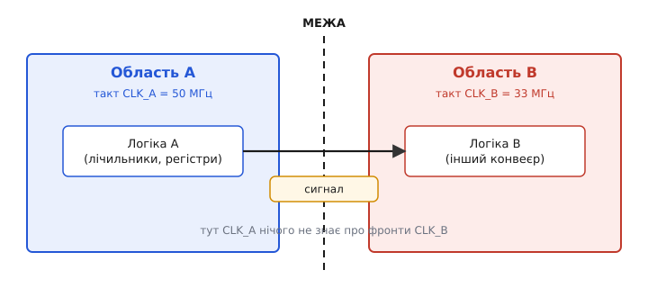
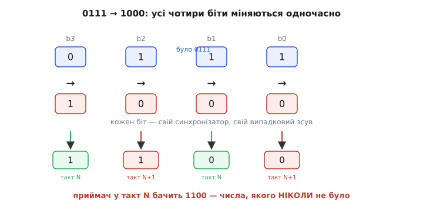
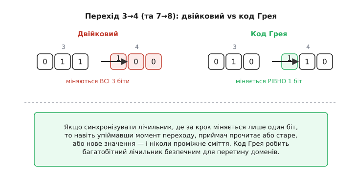
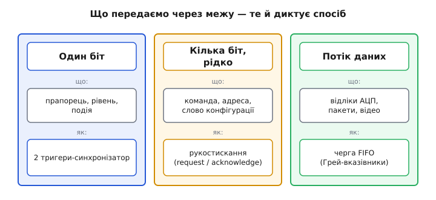

# Перетин тактових доменів

Майже кожен серйозний цифровий пристрій усередині розбитий на кілька **тактових областей** (англ. *clock domain* — область одного такту): шматків логіки, кожен зі своїм власним тактовим сигналом. Процесор цокає на 600 МГц, контролер пам'яті — на 800, периферія USB — на своїх 60, давач віддає дані під свій кварц на 12. Усі вони сидять на одному кристалі чи одній платі й мусять обмінюватися сигналами. І щойно дріт виходить з-під одного такту й заходить під інший — починається найпідступніша зона цифрової техніки. Сигнал тут не «псується» від шуму чи поганого паяння; він ламається через те, що дві сторони **не домовилися про ритм**.

Розберімо, чому це взагалі проблема, чому наївне рішення «просто з'єднати дроти» дає рідкісні нездоланні баги, і якими трьома способами інженери надійно проводять дані з однієї області в іншу.

### Що таке тактова область і чому їх багато

Тактова область — це вся логіка, яку синхронізує **один спільний** тактовий сигнал. Усередині неї панує сувора домовленість: усі тригери защіпають дані за тим самим фронтом, а період такту підібрано так, щоб комбінаційна логіка встигла порахувати наступні значення й вони **застигли** задовго до наступного фронту. Завдяки цій дисципліні всередині однієї області все передбачуване — дані ніколи не міняються в небезпечну мить.

> 🔧 **Навіщо це.** Перш ніж боротися з перетином доменів, треба чітко бачити їхні межі у власному пристрої. Намалюйте блок-схему й позначте, який такт живить кожен блок: ядро, шину пам'яті, кожен інтерфейс (UART, SPI, USB), кожен зовнішній давач. Кожна лінія, що перетинає такий кордон, — потенційне джерело збою, і саме ці лінії потребують особливого поводження. Пропустити бодай одну — означає закласти баг, який спливе раз на тиждень роботи й не відтвориться на столі.

Чому ж не зробити **один** такт на весь пристрій і не мати клопоту? Кілька причин, і всі вагомі. По-перше, різні блоки **фізично хочуть різних частот**: радіоприймачу потрібен такт, точно прив'язаний до ефірної частоти; пам'яті DDR — свій, із власним калібруванням; процесору — якомога вищий заради швидкодії; а малопотужному давачу — повільний, щоб не гріти й не їсти струм. По-друге, частина блоків приходить **готовими ззовні** — мікросхема давача, інша плата, чужий модуль — і вже несе власний кварц, який ви не контролюєте. По-третє, гнати весь кристал на одній високій частоті — це **марнувати енергію**: повільні блоки спокійно живуть на повільному такті й тим заощаджують споживання. Тож множинність тактів — не недогляд, а норма; питання лише в тому, як акуратно зшити області між собою.


*Кожна область живе під своїм тактом і всередині поводиться бездоганно. Але сигнал, що йде з області A (50 МГц) в область B (33 МГц), потрапляє під чужий ритм: фронти CLK_B настають у моменти, про які CLK_A нічого не знає. Саме на цій стрілці через межу й криється вся складність.*

### Чому наївне з'єднання ламається

Уявімо найпростіше: вивід регістра в області A напряму заведено на вхід тригера в області B. Здається, що поганого — дріт як дріт. Проблема в тому, що сигнал з області A змінюється **за ритмом A**, а тригер у B защіпає його **за ритмом B**. Ці два ритми не пов'язані. Рано чи пізно — і то досить часто — зміна сигналу припаде **майже точно** на фронт CLK_B, у те крихітне заборонене вікно навколо фронту, де вхід тригера мусить стояти незмінно. А коли вхід міняється саме у цьому вікні, тригер може **зависнути** в стані «ні 0 ні 1» на непередбачуваний час.

Цей механізм — **метастабільність** — і є коренем усіх бід на межі доменів. Він заслуговує окремого глибокого розгляду, бо випливає з самої фізики бістабільної петлі, на якій стоїть будь-який тригер.

> Перш ніж рухатися далі, варто розуміти суть зависання. **Метастабільність** — це коли тригер, чий вхід змінився рівно на фронті такту (порушено вікно setup/hold), застрягає на виході десь між рівнями «0» і «1» та «дзвенить» там випадковий час, перш ніж випадково впасти в один зі станів. Усередині синхронної області таймінг-дисципліна навмисно не дає входам мінятися на фронті, тож там вона майже не виникає; а от асинхронний вхід рано чи пізно неминуче в неї влучить. Стандартні ліки для **одного біта** — синхронізатор із двох тригерів поспіль: перший приймає удар і має цілий період такту, щоб розв'язатися, перш ніж його зчитає другий. Детально — у статті [метастабільність і таймінг](book:electronics/metastability-timing).

Отже, з одним бітом начебто розібралися: два тригери, і ймовірність біди падає до років чи століть напрацювання. Але справжня халепа починається там, де через межу треба передати **не один біт, а число**.

### Багатобітна пастка: біти приїжджають у різні такти

Скажімо, в області A є 4-бітний лічильник, і його значення треба прочитати в області B. Очевидне рішення — поставити **по синхронізатору на кожен біт**, чотири однакові ланцюжки з двох тригерів. Логічно ж? А ось і ні — і саме тут ламається інтуїція.

Біда в тому, що кожен синхронізатор розв'язує свою метастабільність **незалежно** й із **власним випадковим запізненням**. Коли лічильник перемикається, скажімо, з 0111 на 1000, міняються **всі чотири** біти одночасно. Але дроти й тригери ніколи не спрацьовують ідеально синхронно: один біт «приїде» в область B на такті N, а сусідній — лише на такті N+1. І якщо приймач прочитає шину рівно між цими моментами, він побачить **мішанину** старих і нових бітів — число, якого на лічильнику **ніколи не було**.


*Лічильник переходить 0111 → 1000 — усі біти міняються разом. Але кожен біт долає межу через свій синхронізатор зі своїм випадковим зсувом: два встигли на такт N, два запізнилися на N+1. Приймач на такті N бачить 1100 — значення, що не дорівнює ні старому 0111, ні новому 1000. Для лічильника, можливо, дрібниця; для адреси чи команди — фатальна помилка.*

Осягніть глибину пастки. Кожен окремий синхронізатор **працює бездоганно** — він чесно віддає або старе, або нове значення свого біта. Збій народжується не в жодному з них, а в **їхньому поєднанні**: гарантії на окремий біт не складаються в гарантію на ціле число. Це класичний випадок, коли локально все правильно, а система в цілому помиляється. І найгірше — таке проміжне значення з'являється рідко й невідтворювано, тому на стенді ви його не спіймаєте, а в полі воно колись-таки прорветься.

Звідси висновок: **багатобітну величину не можна синхронізувати побітно**. Потрібен спосіб, який гарантує, що приймач завжди бачить **цілісне**, узгоджене значення — або повністю старе, або повністю нове, без проміжного сміття. Таких способів три, і вибір між ними залежить від того, **що саме** ви передаєте.

### Спосіб перший: код Грея для лічильників

Перша ідея елегантна: а що, як зробити так, щоб за один крок мінявся **лише один біт**? Тоді навіть якщо приймач упіймає момент переходу, єдиний біт, що міняється, дасть або старе значення, або нове — проміжного просто **немає чому** виникнути. Бо «мішанина старого й нового» можлива лише тоді, коли одночасно міняється кілька бітів.

Саме це робить [код Грея](book:electronics/clock-domain-crossing/hist-gray-cummings.md) (англ. *Gray code*, на честь Френка Грея з Bell Labs) — спосіб нумерації, де **між будь-якими сусідніми значеннями міняється рівно один біт**. Лічильник, що рахує в коді Грея, ніколи не перемикає два біти за раз. Тому його значення можна спокійно вести через межу доменів (хай навіть побітно через синхронізатори) — приймач завжди зчитає коректне число.


*У звичайному двійковому записі перехід 3→4 (011→100) перемикає всі три біти — точно та ситуація, що породжує проміжне сміття на межі. У коді Грея ті самі «три» й «чотири» записані як 010 і 110: міняється лише старший біт. Тому навіть на стику тактів приймач прочитає або 010, або 110 — ніколи нічого третього.*

Ось чому код Грея — серце майже кожного механізму перетину доменів, що має справу з **лічильниками**. Його не випадково обрали для вказівників черги FIFO, про яку нижче. Обмеження теж очевидне: код Грея рятує тільки там, де значення **змінюються по одному кроку** (лічильник, що тікає вгору). Якщо величина може **стрибнути** на довільне число — це вже не лічильник, і код Грея не допоможе; тоді міняється багато бітів, і ми знов у пастці. Для довільних багатобітних слів потрібні інші підходи.

### Спосіб другий: рукостискання для випадкових слів

Коли треба передати **довільне** багатобітне слово — команду, адресу, слово конфігурації, — і передавати його доводиться **зрідка**, найнадійніший спосіб — **рукостискання** (англ. *handshake* — «потиск рук»: домовленість двох сторін про готовність).

Ідея в тому, щоб **не синхронізувати самі дані** взагалі. Натомість область A виставляє все слово на звичайних дротах (без жодних синхронізаторів) і піднімає **один** керівний сигнал-прапорець «дані готові» (*request*). Цей **єдиний біт** перетинає межу через звичайний двотактовий синхронізатор — а одному біту, як ми знаємо, синхронізатор цілком до снаги. Коли область B побачила прапорець, вона **вже знає**, що дані на шині давно стоять стабільно (бо A їх виставила ще до того, як підняла прапорець, а поки прапорець ішов крізь два тригери, минуло ще кілька тактів). Тому B спокійно зчитує все слово **разом**, цілісно, і відповідає власним прапорцем «прийняв» (*acknowledge*), що так само одним бітом вертається в A.

Краса прийому в тому, що **жоден біт даних не синхронізується** — синхронізуються лише два керівні прапорці, по одному в кожен бік. А прапорець — це один біт, для якого все вже вирішено. Дані ж до моменту зчитування стоять незмінно **довше**, ніж триває будь-яка метастабільність прапорця, тож приймач завжди застає їх цілими. Плата за надійність — **швидкість**: на кожне слово витрачається повний цикл «запит → підтвердження → скидання», тобто кілька тактів **обох** областей. Для рідкісних команд це дрібниця; для суцільного потоку даних — задорого. Тонкощі побудови такого обміну, аж до робочого коду, варто розглянути окремо: [рукостискання між тактовими доменами](book:electronics/clock-domain-crossing/proj-handshake.md).

### Спосіб третій: черга FIFO для потоку

А коли через межу тече **суцільний потік** — відліки з АЦП, мережні пакети, відеорядок, — рукостискання на кожне слово вбило б темп. Тут потрібен буфер, у який одна область **складає** дані у своєму ритмі, а друга **забирає** у своєму, і обидві майже не чекають одна на одну. Це **черга FIFO** (англ. *First In, First Out* — «першим увійшов, першим вийшов»).

Усередині це шматок двопортової пам'яті плюс два лічильники-вказівники: **вказівник запису** (де область A покладе наступне слово) і **вказівник читання** (звідки область B візьме наступне). A посуває свій вказівник у такті A, B — свій у такті B; самі дані ніколи не перетинають межу «на льоту» — вони спокійно лежать у пам'яті, поки приймач не дозріє їх узяти. А ось **вказівники** перетнути межу таки мусять: щоб знати, чи черга порожня (нема чого читати) і чи повна (нема куди писати), кожна сторона має бачити вказівник іншої. І тут спрацьовує перший спосіб — **вказівники ведуть у коді Грея**, тому їх можна безпечно синхронізувати побітно, не боячись проміжного сміття.

> 🔧 **Навіщо це.** Асинхронна FIFO — це робоча конячка перетину доменів у будь-якій серйозній цифровій системі: між шиною процесора й периферією, на вході та виході високошвидкісних інтерфейсів, скрізь, де дані течуть потоком між різними тактами. У готових мікроконтролерах і FPGA вона часто вже вбудована в апаратні блоки (USB, Ethernet, інтерфейс камери) — і коли ви бачите в даташиті «FIFO depth» біля периферії, це майже завжди саме такий буфер, що тихо рятує вас від усієї мороки з метастабільністю. Розуміючи, як він влаштований, ви правильно добираєте його глибину: замала черга **переповниться** на сплеску даних і загубить відліки, а зайве велика дарма з'їсть пам'ять кристала.

Внутрішня будова такої черги — окрема ґрунтовна тема: як саме рахувати порожнечу й повноту через два домени, чому глибину беруть степенем двійки, як уникнути хибних «повна/порожня». Їй присвячено статтю [асинхронна черга FIFO](book:electronics/async-fifo).

### Як це лягає в реальну розробку

Зведімо нитку докупи. На столі інженера перетин доменів виглядає як просте правило з трьох кроків. **Перший**: знайти всі межі — кожну лінію, що йде з-під одного такту під інший. **Другий**: для кожної межі спитати, **що** саме крізь неї йде. **Третій**: за відповіддю обрати спосіб.


*Спосіб диктує не складність схеми, а природа того, що передається. Один біт — рівень, прапорець, поодинока подія — два тригери-синхронізатор. Багатобітне слово, що йде зрідка, — рукостискання request/acknowledge, де синхронізують лише керівні прапорці. Суцільний потік даних — черга FIFO з вказівниками в коді Грея.*

Чому це так важливо знати, навіть якщо ви програмуєте мікроконтролер, а не проєктуєте мікросхему? Бо межі доменів є й там, де їх не очікуєш. Класичний приклад — **апаратний таймер**, що цокає від власного незалежного кварцу, а ви читаєте його лічильник із програми, яка крутиться на іншому такті ядра. Якщо лічильник 16- чи 32-бітний, його не можна читати «одним махом» — між читанням старшої та молодшої половини він може клацнути, і ви дістанете безглузде число (наприклад, момент переходу `0x00FF → 0x0100` дасть або `0x0000`, або `0x01FF`). Це той самісінький багатобітний CDC, тільки на рівні регістрів. Тому виробники мікроконтролерів дають апаратні засувки чи рекомендують читати такі лічильники з перевіркою:

**Безпечне читання багатобітного лічильника, що міняється асинхронно:**
```c
// Лічильник у периферії цокає від власного кварцу, незалежно від ядра.
// Читаємо двічі, доки два читання не збіжаться — тоді ми не влучили
// у момент перемикання посередині значення (той самий CDC-багаж).
uint32_t read_async_counter(volatile uint32_t *reg) {
    uint32_t a, b;
    do {
        a = *reg;
        b = *reg;   // якщо між a і b лічильник клацнув — повторюємо
    } while (a != b);
    return a;       // a == b ⇒ ми прочитали узгоджене, цілісне значення
}
```

Логіка тут — той самий принцип, що й у залізних рішеннях: домогтися, щоб приймач побачив **цілісне** значення, а не зріз посеред зміни. Дві перевірки збігаються лише тоді, коли між ними лічильник не перемкнувся, — отже, прочитане число справжнє.

Підсумуймо суть. Цифровий пристрій майже завжди має кілька тактових областей, бо різним блокам потрібні різні частоти, а частина приходить готовою ззовні. На межі областей сигнал ламається не через шум, а через **неузгоджені ритми**: вхід чужого тригера рано чи пізно зміниться рівно на фронті й зависне (метастабільність). Один біт рятує синхронізатор із двох тригерів. Багатобітну величину **не можна** синхронізувати побітно — біти приїдуть урізнобій і дадуть число, якого не було; її передають або **кодом Грея** (лічильники), або **рукостисканням** (рідкі слова), або через **FIFO** (потік). А головне правило просте: **жодна лінія не перетинає межу доменів «напряму»** — кожна йде через свій належний міст. Хто це засвоїв, той позбувся цілого класу примарних, раз-на-тиждень багів, які інакше переслідують пристрій усе його життя.
