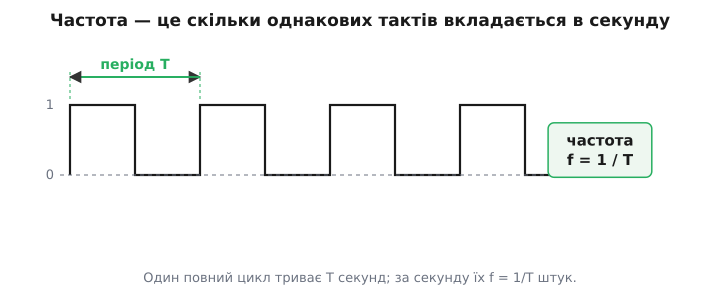
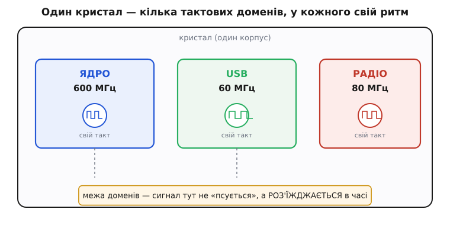
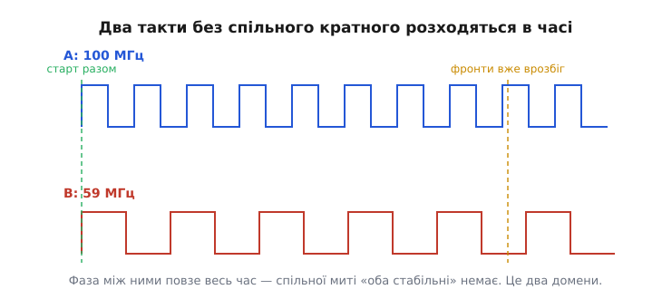

# Тактова частота і тактовий домен

Скажіть про будь-який процесор «він на 600 мегагерц» — і всі кивнуть, наче все зрозуміло. Але за цим коротким числом стоять дві різні речі, які варто розчепити. Перша — **тактова частота**: скільки разів на секунду цокає ритм, що жене логіку. Друга, тонша й важливіша для інженера, — **тактовий домен** (англ. *domain* — володіння, від лат. *dominium*): та частина схеми, яка живе під цим одним ритмом і тільки під ним. Одна цифра «600 МГц» насправді описує **володіння одного такту**, а поряд на тому ж кристалі спокійно цокають інші числа над своїми володіннями.

Розберімо обидві речі від першопричини: що таке частота як число і чим вона обмежена; чому цифрова схема ділиться на області, кожна зі своїм тактом; і що саме робить дві частини **різними доменами**, навіть коли вони поруч на одному шматку кремнію.

### Частота — це число тактів за секунду

[Такт](topic:electronics/clock-signal) — рівномірна прямокутна хвиля 0-1-0-1, спільний ритм, за яким уся машина крокує. Частота відповідає на просте питання: **скільки повних циклів цієї хвилі вкладається в одну секунду.** Один цикл — це «низько, потім високо, і знову до початку». Порахуйте, скільки таких циклів проходить за секунду, — і ви маєте частоту.

Міряють її в **герцах** (Гц, англ. *hertz*) — на честь німецького фізика Генріха Герца (Heinrich Rudolf Hertz, 1857–1894), який першим на досліді впіймав електромагнітні хвилі, передбачені рівняннями Максвелла. Саму назву одиниці за його ім'ям Міжнародна електротехнічна комісія узаконила 1930 року замість старого «циклів за секунду», а Генеральна конференція з мір та ваг закріпила її 1960-го *(усталений факт)*. Один герц — один цикл за секунду. Кіло-, мега- й гігагерц — просто зручні тисячі: 1 МГц = 10⁶ Гц, 1 ГГц = 10⁹ Гц.

Частота й **період** — дві сторони однієї монети. Період T — це тривалість одного циклу в секундах; частота f — це скільки їх за секунду. Тож вони обернені:

```
f = 1 / T        T = 1 / f
```


*Один повний цикл триває T секунд; за секунду їх вкладається f = 1/T штук — це й є частота.*

Ця формула — робочий інструмент, не прикраса. Щойно ви знаєте частоту, ви знаєте, **скільки часу схема має між двома цоканнями**, щоб довести сигнал від тригера до тригера.

**Скільки часу дає такт на 600 МГц.**
```c
// Період такту в наносекундах: T = 1 / f
// f = 600 МГц = 600 · 10⁶ Гц
double f_hz = 600e6;
double T_s  = 1.0 / f_hz;        // 1.667e-9 секунди
double T_ns = T_s * 1e9;         // 1.667 наносекунди
// Отже, між двома фронтами вся логіка має вкластися в ~1.67 нс.
```
Висновок: «600 МГц» на практиці означає бюджет часу **1.67 наносекунди** на кожен крок. Хочете вдвічі швидше — маєте вдвічі менший бюджет, і кожен перегін логіки має встигнути за 0.83 нс. Ось чому частота — не просто хвастощі в характеристиках, а жорсткий часовий кошторис.

> 🔧 **Навіщо це.** Коли в описі мікроконтролера пишуть, що таймер тикає від 84 МГц, ви миттю рахуєте його роздільність: T = 1/84 МГц ≈ 11.9 нс. Це найдрібніший інтервал, який таймер здатен відміряти. Уся точність вимірювання часу, генерації ШІМ, відліку затримок упирається в цю просту оберненість f і T.

### Що обмежує частоту згори

Чому не поставити частоту як завгодно високою? Бо між двома цоканнями сигнал мусить **фізично встигнути** пробігти крізь логіку: вийти з одного тригера, пройти вентилі, дроти, і застигнути на вході наступного тригера **до** приходу нового фронту. Кожен вентиль додає затримку, кожен міліметр дроту додає затримку. Складіть найдовший такий маршрут — і матимете нижню межу періоду. Швидше за неї такт не можна: сигнал просто не добіжить, і тригер защепне ще старе, недороблене значення.

Цей найповільніший маршрут зветься [критичний шлях](topic:electronics/critical-path-timing): серед тисяч перегонів долю частоти вирішує рівно один — найдовший. Коли інструмент після збірки каже «схема тримає лише 78 МГц замість бажаних 100», він насправді каже: є один перегін, якому бракує наносекунд. Тому частота домену — це **не вільний вибір**, а те, що дозволяє найповільніша ланка всередині нього.

### Чому один такт на всіх не годиться

Тепер головне. Уявіть, що весь складний кристал — процесор, контролер пам'яті, USB, радіо — тактується **однією** хвилею. Здавалося б, просто й акуратно. Але швидко впираємось у стіну з двох боків.

З одного боку — **різним частинам треба різне**. Радіомодуль мусить цокати на своїй точній частоті, прив'язаній до ефіру (скажімо, кратній 80 МГц), інакше зв'язок «попливе». USB вимагає своїх 60 МГц із жорсткою похибкою за стандартом. Ядру хочеться якнайшвидше — 600 МГц і вище. Давач висить на дешевому кварці 12 МГц. Пхати всіх під одну хвилю означало б або гальмувати ядро до швидкості найповільнішого, або гнати повільну периферію на непотрібній для неї частоті — а це марна витрата енергії.

З іншого боку — навіть якби всі хотіли одну частоту, **фізично роздати єдиний бездоганний такт на весь великий кристал неможливо.** Хвиля йде дротом зі скінченною швидкістю; до дальнього кутка вона доходить пізніше, ніж до ближнього. Ця різниця приходу зветься перекіс такту (англ. *clock skew*). Що більший кристал і вища частота — то важче тримати весь чип у справді єдиному ритмі.

Тому інженери роблять інакше: кристал **ділять на області, кожна зі своїм тактом**. Ядро — на 600, USB — на 60, радіо — на 80. Кожна така самодостатня область і є **тактовий домен**.


*Один кристал ділять на кілька тактових доменів; у кожного власне джерело ритму, а на межі між ними сигнал не «псується», а розходиться в часі.*

### Що таке тактовий домен, точно

Домен — це **вся сукупність тригерів, які цокають від одного й того самого такту, разом із логікою між ними.** Заведіть сигнал усередині домену з тригера в тригер — і час поводиться передбачувано: ви точно знаєте, коли захопиться значення, бо всі клацають від спільного фронту. Такий сигнал ви можете порахувати наперед, і саме на цьому стоїть уся [перевірка таймінгу](topic:electronics/critical-path-timing).

Кожен домен зазвичай має **своє джерело частоти**. Не обов'язково окремий кварц на кожен — частіше один опорний кварц, з якого [прескейлер і петля синтезу](topic:electronics/prescaler) роблять усі потрібні частоти діленням і множенням. Але щойно два такти **не тримають сталого зв'язку між фронтами** — це вже два різні домени, хоч би вони й народилися з одного кварцу.

> 🔧 **Навіщо це.** У даташиті мікроконтролера ви завжди знайдете «дерево тактів» (clock tree) — схему, де від кількох джерел (кварц, внутрішній RC-генератор, PLL) розходяться гілки до ядра, шин, таймерів, USB. Кожна гілка з власною частотою — це окремий домен. Читати це дерево — перше, що робиш, налаштовуючи новий чип: воно каже, який блок від чого тактується і які частоти взагалі досяжні.

### Що робить два такти різними доменами

Тут криється найтонше місце, і його варто вкласти в голову міцно. Різними домени робить не сама по собі різна частота, а те, що між їхніми фронтами **немає сталого, передбачуваного зв'язку**.

Візьміть два такти: 100 МГц і 59 МГц. Числа різні, спільного цілого кратного в них практично немає. Навіть якщо в якусь мить їхні фронти збіглися, уже за кілька циклів вони розповзуться, а далі фаза між ними повзтиме без кінця. Немає такої миті, про яку можна сказати наперед: «зараз обидва стабільні, ось тут безпечно передавати». Тому 100 і 59 МГц — **два різні, незалежні (асинхронні) домени**.


*Два такти без спільного кратного стартують разом, та фаза між ними повзе весь час — спільної миті «обидва стабільні» немає, тож це два окремі домени.*

А тепер інший випадок: 100 МГц і 50 МГц, зроблені **з одного джерела** діленням навпіл. Тут кожен другий фронт швидкого такту точно збігається з фронтом повільного — зв'язок сталий і відомий наперед. Такі два такти **пов'язані (синхронні)**, і за акуратного проєкту вони можуть жити майже як один домен: перехід між ними передбачуваний. Отже, лінія між доменами проходить не по «різних числах», а по **наявності чи відсутності сталого фазового зв'язку**.

Звідси проста, але сувора класифікація для будь-якої пари тактів:

```
Спільне джерело, цілократне ділення  → фронти зв'язані  → синхронні (можна майже як один домен)
Незалежні джерела або несумісні числа → фаза повзе       → асинхронні (два окремі домени)
```

### Що діється на межі доменів

Поки сигнал сидить у своєму домені, усе спокійно. Небезпека — рівно на **межі**, коли дріт виходить з-під одного такту й заходить під інший асинхронний. Ось де інтуїція часто підводить: сигнал тут **не псується** від шуму чи поганого паяння — рівні цілком правильні. Він ламається через те, що приймальний тригер ловить його **у випадкову мить свого власного ритму**, коли той якраз перемикається.

А в тригера є свята умова: вхід має застигнути на коротку мить перед фронтом і трохи після. Порушите її — і тригер може зависнути в дивному «ні 0 ні 1» стані, з якого невідомо коли й куди він випаде. Це [метастабільність](topic:electronics/metastability-timing), найпідступніша річ у цифровій техніці. На межі асинхронних доменів вона неминуча: рано чи пізно фронт приймача впіймає джерело рівно в момент зміни.

Тому дані з домену в домен **ніколи не проводять голим дротом**. Ставлять [синхронізатор — окрему схему перетину доменів](topic:electronics/clock-domain-crossing): для одного біта — ланцюжок із двох тригерів, для потоку слів — черга-FIFO, для лічильника — код Грея. Мета всіх цих способів одна: дати метастабільності час згаснути й впустити в новий домен уже чисте, усталене значення. Сама тема тактового домену тим і важлива, що **визначає, де проходять ці небезпечні межі** — а вже як їх безпечно перетнути, розбирає окрема стаття.

> 🔧 **Навіщо це.** Найпідступніші баги в реальних пристроях — саме тут. Схема місяцями працює, а раз на тиждень зависає без видимої причини. Часто винне те, що якийсь сигнал — скид, переривання, прапорець готовності — заводять із чужого домену без синхронізатора. Тому, малюючи архітектуру, інженер спершу **окреслює домени й позначає кожну межу**, а вже тоді на кожному переході ставить правильний перехідник. Пропущена межа — це відкладена в часі загадкова відмова.

### Звідки взялася сама ідея спільного такту

Думка синхронізувати всю машину одним ритмом старша за мікросхеми. У [ENIAC](topic:electronics/clock-domain/hist-cycling-unit.md), одному з перших електронних обчислювачів, був окремий вузол — **cycling unit** (англ. — «циклувальний вузол») на 100 кГц, який роздавав багатофазний потік імпульсів усім лічильним блокам, щоб ті клацали **разом**, а не хто коли. По суті це був прадід тактового домену: одне спільне джерело ритму на всю машину.

Слово «домен» у цьому вжитку прижилося набагато пізніше, коли кристали розрослися й на одному чипі стали співіснувати кілька незалежних тактів — і знадобилося назвати кожну область «свого» ритму. Але сама причина — від першого дня цифрової техніки та сама: щоб схема рахувала правильно, її частини мусять **домовитися про спільний ритм**; а де такого спільного ритму немає — там пролягає межа, яку треба переходити обережно.
