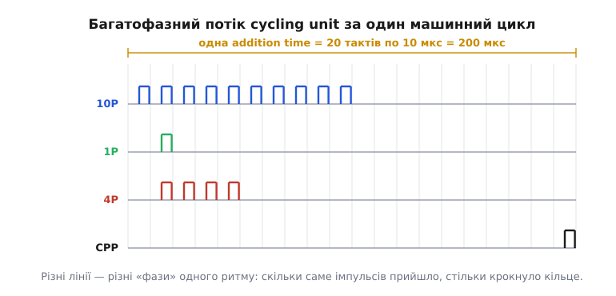
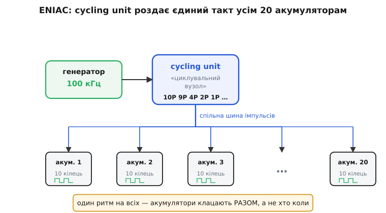

# 📜 Cycling unit: прадід тактового домену

Коли говоримо «тактовий домен», в уяві постає сучасний кристал — крихітний квадратик кремнію, на якому одночасно цокають кілька незалежних ритмів. Але сама думка, що машина мусить рахувати **під один спільний удар**, старша за перший транзистор і за перше слово «комп'ютер» у нинішньому сенсі. Вона народилася в кімнаті завбільшки з невеликий спортзал, напханій вісімнадцятьма тисячами розжарених ламп, — усередині [ENIAC](https://en.wikipedia.org/wiki/ENIAC), одного з перших електронних обчислювачів. І там, серед тих ламп, стояв окремий вузол з простою, майже музичною назвою — **cycling unit** (англ. — «циклувальний вузол», буквально «вузол, що задає цикли»). Він робив одну-єдину річ, без якої вся інша машина була б купою незалежних лічильників, що галасують кожен своє: він **роздавав ритм**.

Розберімо, чому без цього ритму нічого не працює, як саме той вузол його роздавав, і як від нього тягнеться пряма лінія до кожного «дерева тактів» у сучасному чипі.

## Що бентежило: як змусити тисячі ламп рахувати разом

Уявіть завдання інженера 1943 року. Треба скласти два десятизначні числа — електронно, без жодної рухомої деталі, самими лампами. Одне число живе в одному пристрої-лічильнику, друге в іншому. Щоб додати їх, перший пристрій має **надіслати** свій вміст другому у вигляді потоку електричних імпульсів: скільки одиниць у розряді — стільки імпульсів. Другий пристрій ці імпульси **лічить** і на кожному підкручує свій лічильник на один крок.

І тут з'являється тонке, але вбивче питання. **Коли саме** приймач має відкрити «вухо» й почати рахувати? Якщо він розплющиться на мить раніше, ніж передавач почав слати, — пропустить перші імпульси. Якщо запізниться — недорахує. Якщо його внутрішній лічильник крокує у своєму власному, ніяк не узгодженому темпі — імпульс може прийти рівно тоді, коли лічильник сам перемикається, і хтозна, зарахується він чи ні.

У механічного арифмометра такої біди немає: там усе зчеплене валами й шестернями, зуб штовхає зуб, і фізика сама тримає порядок. А в електроніці **нема валів**. Є лише хмара ламп, кожна з яких перемикається за наносекунди й гадки не має, що робить сусідня. Якщо їм не дати спільного відліку часу, вони працюватимуть як оркестр без диригента, де кожен грає у своєму темпі: звуки є, музики немає.

> 🔧 **Навіщо це.** Та сама проблема жива й сьогодні — просто перенесена всередину кристала. Коли один блок надсилає дані іншому, обидва мусять погодитися, у яку мить біт «дійсний». Уся [перевірка таймінгу](topic:electronics/critical-path-timing) сучасних чипів — це нащадок того самого питання «коли саме приймач має слухати», тільки замість ламп там мільярди тригерів, а замість кімнати — квадратний сантиметр.

Розв'язок, до якого дійшли, — рівно той самий, до якого дійде згодом уся цифрова техніка: **дати всім один спільний ритм**. Один пульс, від якого відлічують час геть усі. Тоді питання «коли слухати» має однакову відповідь для кожного: «на такому-то ударі спільного ритму». Приймач і передавач більше не мусять домовлятися між собою — вони обидва підкоряються третьому, спільному годиннику. Ось цей спільний годинник для ENIAC і був **cycling unit**.

## Хто це будував

Машину проєктували двоє в Інженерній школі Мура (Moore School of Electrical Engineering) Пенсільванського університету: фізик **Джон Моклі** (John Mauchly, 1907–1980) — від нього йшла загальна ідея електронної лічильної машини — і інженер **Джон Преспер Еккерт** (J. Presper Eckert, 1919–1995), який відповідав за те, щоб уся ця електроніка **фізично працювала** з тисячами ненадійних ламп. Обидва — американці; жодних приписувань «навпаки» історія тут не потребує, авторство ENIAC ретельно задокументоване й усталене. Контракт із армією підписали 5 червня 1943 року, машина вперше практично запрацювала 10 грудня 1945-го, а публічно її показали 15 лютого 1946 року в Пенсільванському університеті *(усталені факти)*.

Замовником був не університет, а армія: Балістична лабораторія (Ballistic Research Laboratory) потребувала **таблиць стрільби** — величезних таблиць, які кажуть артилеристові, під яким кутом і з яким зарядом бити, щоб снаряд упав куди треба. Кожен рядок такої таблиці — це чисельне розв'язання рівнянь польоту снаряда з урахуванням опору повітря. Рахували їх бригади людей на механічних калькуляторах, тижнями на одну таблицю. ENIAC мав робити те саме за секунди — і саме заради цієї швидкості його й будували електронним, а не механічним. А швидкість електроніки вимагала спільного ритму, бо на таких темпах уже нíчим було механічно зчепити частини між собою.

## Головний герой: серце на 100 кілогерц

Осердям ритму був кварцовий генератор, що видавав рівно **100 000 коливань за секунду** — 100 кілогерц. Це й є та частота, від якої відлічувала час уся машина. Період одного коливання — проста оберненість:

```
T = 1 / f = 1 / (100 000 Гц) = 10⁻⁵ с = 10 мкс
```

Цей проміжок у 10 мікросекунд конструктори назвали **pulse time** — «час одного імпульсу», найдрібніша одиниця часу, якою ENIAC узагалі оперував. Дрібніших подій у машині не бувало: усе, що вона робила, вкладалося в цілу кількість таких десятимікросекундних кроків. Це вже впритул нагадує сучасне поняття такту — найменшого кванта часу, у межах якого схема не змінюється.

> 🔧 **Навіщо це.** Порівняйте з нинішнім чипом: коли даташит каже «ядро на 600 МГц», він каже рівно те саме, що cycling unit казав своїми 100 кГц, — «ось найдрібніший крок часу, у який усе має вкластися». Різниця лише в масштабі: 10 мікросекунд ENIAC проти приблизно 1.7 наносекунди сучасного ядра — тобто теперішній крок майже в шість тисяч разів коротший. Але роль числа та сама: це **бюджет часу на один крок логіки**, ні на йоту не змінена ідея за вісімдесят років.

Одного голого імпульсу, однак, мало. Щоб зробити щось корисне — додати, відняти, переслати число — треба не один удар, а **серію** ударів у чітко визначеному порядку. Тому cycling unit брав рівний потік від генератора й ліпив із нього **машинний цикл**.

## Машинний цикл: двадцять ударів, що складаються в одну дію

Найважливіше число всієї цієї історії — **20**. Cycling unit групував такти по двадцять: рівно двадцять послідовних кроків по 10 мікросекунд складали одну завершену операцію. Цей проміжок назвали **addition time** — «час додавання», бо саме стільки треба, щоб виконати одне додавання. Порахуймо його тривалість:

```
addition time = 20 × pulse time
              = 20 × 10 мкс
              = 200 мкс
```

Двісті мікросекунд на одну дію. А оскільки за секунду таких проміжків уміщається

```
1 с / 200 мкс = 1 000 000 / 200 = 5 000
```

— ENIAC робив **п'ять тисяч додавань за секунду**. За мірками 1945 року — приголомшлива швидкість; людина на калькуляторі так не змогла б і за годину зосередженої праці.

Двадцять кроків — не випадкове число. Числа в ENIAC були **десятизначні**, і десяткові — машина рахувала не в двійці, а в десятці, кожен розряд у своєму лічильнику від 0 до 9. Щоб переслати десятизначне число, потрібен час на прогін усіх десяти розрядів плюс запас на перенесення між ними та на службові такти. Двадцять кроків давали рівно цю раму: половина циклу — на власне пересилання цифр, решта — на впорядкування перенесень і підготовку до наступної дії.


*За один машинний цикл cycling unit видавав не один імпульс, а кілька різних потоків, кожен зі своїм візерунком у межах тих самих двадцяти тактів: скільки імпульсів на лінії — стільки кроків зробить приймач.*

## Багатофазний потік: один ритм, багато голосів

Тут криється найгарніша інженерна ідея вузла, і її варто розжувати. Cycling unit роздавав не одну лінію імпульсів, а **цілий набір різних потоків одночасно** — усі народжені з того самого 100-кілогерцового серця, усі жорстко зчеплені між собою, але з різним візерунком усередині циклу. У документації ENIAC вони мають лаконічні позначки: **10P, 9P, 4P, 2P, 2'P, 1P, 1'P** та керівний **CPP** (Central Programming Pulse — «центральний програмний імпульс»). Кожен — це окрема фаза спільного ритму, і кожен важить приблизно 2 мікросекунди *(усталено, за технічним звітом Балістичної лабораторії)*.

Навіщо стільки? Бо різні потоки роблять різну роботу за той самий цикл. Гляньмо на кілька:

- **10P** — десять імпульсів поспіль. Якщо завести їх у десятковий лічильник-кільце (decade ring counter — кільцевий лічильник на десять положень, серце кожного розряду), він прокрутиться рівно на повний оберт. Це спосіб «прогнати» розряд через усі десять станів.
- **1P** — один-єдиний імпульс. Крутнути кільце рівно на один крок: додати одиницю.
- **4P** — чотири імпульси: додати чотири. **2P** — два. Комбінуючи такі потоки, машина набирала будь-яку потрібну цифру, немов складала число з готових цеглинок «плюс один», «плюс два», «плюс чотири».
- **CPP** — не для лічби, а для **керування**: він приходив наприкінці циклу й був сигналом «дію завершено, можна запускати наступний крок програми». Це прадід сучасного керівного імпульсу, який каже автоматові станів: «переходь у новий стан».

Ось у чому вся суть: **скільки імпульсів прийшло на лінію — на стільки кроків крутнеться приймальне кільце.** Лічильник не «розуміє» чисел; він просто клацає на кожен імпульс. Тож, щоб додати п'ятірку, ти не пояснюєш машині «додай п'ять» — ти впускаєш у неї п'ять імпульсів у потрібну мить, і кільце саме доклацує до потрібного положення. Лічба зводиться до **впускання рівно стількох ударів спільного ритму, скільки треба**.

Сучасна аналогія майже точна: у теперішньому чипі теж від одного опорного кварцу [прескейлер і петля синтезу](topic:electronics/prescaler) роблять цілий набір похідних частот — одну для ядра, іншу для шини, третю для периферії, — і всі вони зчеплені з тим самим джерелом. Cycling unit робив те саме в межах одного циклу: з одного серця — багато фаз. **Де аналогія ламається:** сучасні похідні такти — це різні *частоти* для різних *блоків, що працюють паралельно й довго*; фази ENIAC — це різні *візерунки в межах одного циклу однієї* частоти, різні ролі того самого удару. Тобто в ENIAC це ще не «багато доменів», а «багато голосів одного домену» — і саме тому вузол є **прадідом**, а не готовим тактовим доменом.

## Як ритм доходив до кожного лічильника

Найважливіше — куди ці потоки йшли. ENIAC мав **двадцять акумуляторів** (accumulator — «нагромаджувач», лат. *accumulare* — накопичувати): двадцять пристроїв, кожен зберігав одне десятизначне число й умів додавати до нього. Усередині кожного — десять десяткових кільцевих лічильників, по одному на розряд, плюс окремий для знака. Разом — сотні кілець, розкиданих металевими шафами по всій кімнаті.

І до **всіх** цих кілець cycling unit тягнув свої лінії. Потоки імпульсів роздавалися **безперервно й одночасно** на кожен акумулятор — не «спершу цьому, потім тому», а всім разом, тим самим фронтом. Ось чому машина рахувала злагоджено: коли приходив, скажімо, керівний CPP, його **тієї ж миті** бачили всі двадцять акумуляторів. Ніхто не відставав і не забігав уперед, бо ритм для всіх був фізично один.


*Одне джерело ритму, одна спільна шина — і двадцять акумуляторів клацають синхронно; це і є, у зародку, тактовий домен: уся сукупність лічильників, що живуть під одним тактом.*

Порівняйте це означення з сучасним. Тактовий домен — це **вся сукупність тригерів, що цокають від одного такту, разом із логікою між ними**. А тепер гляньте на ENIAC: усі його кільцеві лічильники цокали від потоків одного cycling unit. Формально це **один суцільний тактовий домен на всю машину** — просто ще без самого слова «домен» і без потреби в ньому, бо доменів було рівно стільки, скільки треба, — один.

## Диригент з трьома темпами: як його налагоджували

Ще одна деталь показує, наскільки глибоко інженери розуміли, що тримають у руках саме **джерело ритму** — а отже, важіль над часом усієї машини. Cycling unit мав перемикач режимів із трьома положеннями, і кожне давало інший спосіб «пустити час» *(усталено, за керівництвом до ENIAC)*:

- **Continuous** — звичайний режим: імпульси течуть безперервно, машина працює на повній швидкості.
- **1 Pulse** — на кожне натискання окремої кнопки видається **рівно один** такт на 10 мікросекунд, і машина завмирає до наступного натискання.
- **1 Addition** — на кожне натискання проганяється **рівно одна** addition time, тобто повні двадцять тактів, і знову стоп.

Навіщо це? Для налагодження. Коли в кімнаті вісімнадцять тисяч ламп і щось рахує не так, ганятися за помилкою на повній швидкості — безнадійно: усе миготить надто швидко для ока й приладів того часу. А ось якщо змусити машину робити **один крок часу за натиском** і дивитися, які лампи засвітилися, помилку можна вистежити по кроках. По суті це найперший у світі **покроковий налагоджувач** (single-step debugger) — і працює він саме через те, що диригентом часу є один вузол: спини його — і спиниться вся машина, синхронно, без «хвостів».

> 🔧 **Навіщо це.** Той самий принцип живий у кожному сучасному мікроконтролері. Коли ви ставите точку зупину й тиснете «крок» у відлагоднику, апаратний блок налагодження **гальмує такт ядра** — рівно як положення «1 Pulse» на ENIAC. Можливість керувати самим ритмом дає можливість заморозити час і роздивитися стан — а це можливо лише тому, що ритм **спільний і єдиний** для всього домену. Було б у ядрі кілька непов'язаних тактів — заморозити його «весь одразу» вже не вийшло б чисто.

## Від одного домену до багатьох: куди пішла думка далі

Отже, першою відповіддю на питання «як змусити машину рахувати разом» був **один спільний ритм на все**. І кілька десятиліть цього вистачало: машини лишалися відносно невеликими, частот вистачало помірних, і єдиний такт справді можна було роздати на всі частини вчасно.

Але ідея зіткнулася зі стіною, коли схеми почали стискати в кристали й розганяти. Тут повилазили дві проблеми, яких у неквапливому ENIAC на 100 кГц просто не існувало.

Перша: **різним частинам стало потрібно різне**. У ENIAC усе було одним лічильним господарством під один темп. А сучасний кристал — це ядро, що хоче цокати якнайшвидше; радіо, прив'язане до частоти ефіру; порт USB зі своїм стандартним числом; давач на дешевому повільному кварці. Пхати їх усіх під один такт означало б або гальмувати найшвидшого, або марно гнати найповільнішого. Один темп на всіх, що чудово служив ENIAC, став тіснотою.

Друга: **єдиний ідеальний ритм фізично перестав доходити всюди вчасно**. У кімнаті ENIAC відстані вимірювалися метрами, а такт був повільний — 10 мікросекунд, за які сигнал устигав оббігти всю машину багато разів. На кристалі з мільярдами елементів і тактом у частки наносекунди хвиля вже **не встигає** дійти до дальнього кутка одночасно з ближнім: з'являється перекіс такту (clock skew — розбіжність у часі приходу того самого фронту в різні точки). Що більший чип і вища частота — то гірше.

Обидві стіни штовхнули до одного рішення: **розділити кристал на області, кожна зі своїм тактом**. І ось тут — аж тепер — знадобилося слово. Кожну таку самодостатню область назвали **тактовим доменом**. Слово «домен» у цьому вжитку прижилося набагато пізніше за сам cycling unit — коли на одному чипі вперше довелося співіснувати кільком незалежним ритмам і знадобилося дати ім'я «володінню» кожного з них. Один cycling unit ENIAC роздрібнився на багато незалежних джерел — по одному «маленькому cycling unit» на кожен домен.

І тут-таки народилася нова біда, якої в ENIAC бути не могло. Поки ритм один — межі немає, усе синхронно за визначенням. А щойно доменів стало кілька й вони незалежні — між ними пролягла **межа**, на якій сигнал переходить з-під одного ритму під інший, ніяк із першим не узгоджений. На цій межі й чигає [метастабільність](topic:electronics/metastability-timing) — стан, коли тригер ловить сигнал у мить його зміни й зависає між нулем і одиницею. ENIAC цієї проблеми не знав саме тому, що був **одним доменом**: усередині одного ритму немає межі, на якій можна впіймати «непевну» мить. Ціна за багато незалежних тактів — необхідність обережно переходити межі між ними; за це відповідає [синхронізатор на перетині доменів](topic:electronics/clock-domain-crossing).

## Що з цього лишилося

Придивіться до будь-якого сучасного «дерева тактів» у даташиті — тієї схеми, де від кварцу й генераторів гілки розходяться до ядра, шин, таймерів, радіо. Кожна гілка — окремий домен, у кожного свій ритм. Це, по суті, **двадцять акумуляторів ENIAC, що розбіглися по власних годинниках**: те, що колись було одним спільним cycling unit, розсипалося на багато незалежних джерел, кожне зі своєю частотою.

Але **причина** від першого дня та сама, і вона не змінилася ні на йоту. Щоб група незалежних електронних вузлів рахувала правильно, вони мусять **домовитися про спільний ритм** — інакше приймач не знатиме, коли слухати. ENIAC розв'язав це одним ритмом на все. Сучасний чип розв'язує це багатьма ритмами, але **всередині кожного** діє той самий закон cycling unit: один такт, і всі під ним клацають разом. А там, де спільного ритму немає, — на межі доменів, — треба ставити перехідник, бо там час стає непередбачуваним.

Тож наступного разу, коли побачите «600 МГц» поряд із «80 МГц» на одному кристалі, згадайте кімнату з вісімнадцятьма тисячами ламп і скромний вузол на 100 кілогерц, що вперше змусив електронну машину крокувати в ногу. Тактовий домен не винайшли одного дня — він **виріс** із простої й вічної потреби: щоб рахувати разом, спершу треба разом цокати.
